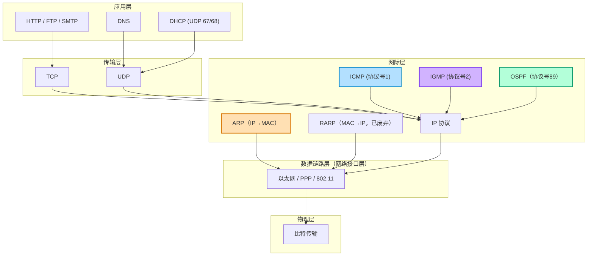
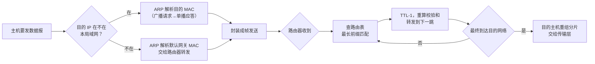
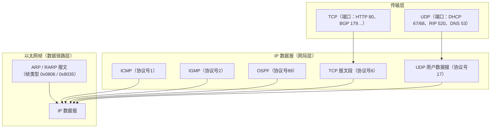

# 网际层协议 · 层次分布与作用场景全景图

> 配合 [[408_IP网际层考点全总结]] 使用。此页用图理解"每个协议在哪一层、干什么、怎么封装"。

## 1. 协议在 TCP/IP 五层模型中的分布

> ⚠️ **ARP 的特殊地位**：它"跨在网际层与链路层之间"——解决 IP→MAC 的映射，但不封装在 IP 里，而是**直接封装在以太网帧**中。所以图里 ARP 直接连到 ETH。

## 2. 各协议作用场景速查表

## 3. "封装方式"一图流（最容易考的辨析点）

## 4. 记忆口诀

- **ARP 找 MAC，只在局域网**；请求广播、应答单播，封装在帧里不走 IP。
- **ICMP 报错兼探测**：ping 用回送请求/应答，traceroute 用超时报文。
- **IGMP 管组播成员**：加入、报告、查询、离开。
- **DHCP 四步**：发现（Discover）→ 提供（Offer）→ 请求（Request）→ 确认（ACK）。
- **RIP 用 UDP 520、OSPF 用 IP 89、BGP 用 TCP 179**——三兄弟封装永不混。
- **IP 无连接不可靠，TCP 补可靠；分片源端分、目的端合，路由器只转发不重组。**

## 5. 一句话总结各协议"在哪一层干活"

| 协议 | 干活的位置 | 一句话作用 |
|---|---|---|
| IP | 网际层 | 寻址 + 路由 + 尽力而为交付 |
| ARP | 网际层↔链路层之间 | 本网内 IP→MAC |
| ICMP | 网际层（封装在 IP 内） | 差错报告 + ping/traceroute |
| IGMP | 网际层（封装在 IP 内） | 组播组成员管理 |
| RIP | 应用层（用 UDP 520） | 域内距离向量路由 |
| OSPF | 网际层（用 IP 89） | 域内链路状态路由 |
| BGP | 应用层（用 TCP 179） | 域间路径向量路由 |
| DHCP | 应用层（用 UDP 67/68） | 自动分配 IP |
| NAT | 网际层（路由器上） | 私网↔公网地址转换 |
