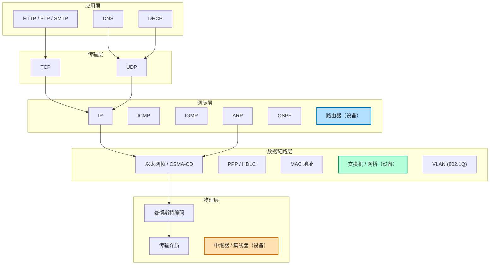
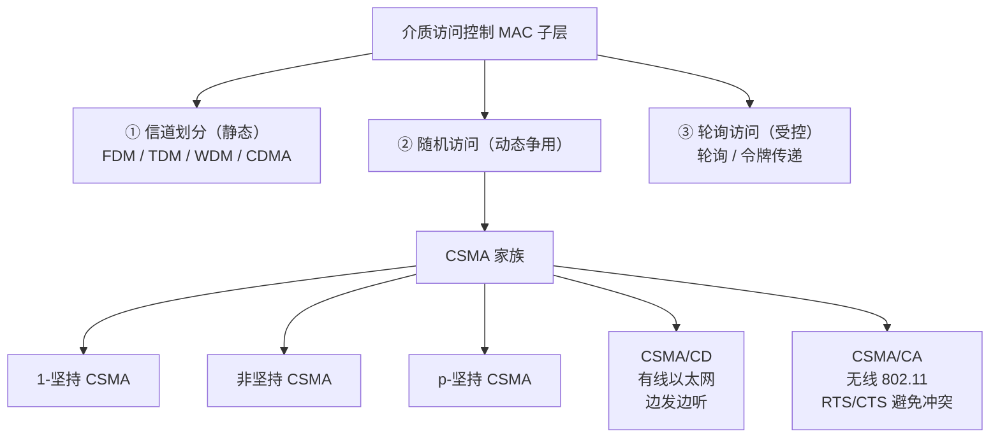
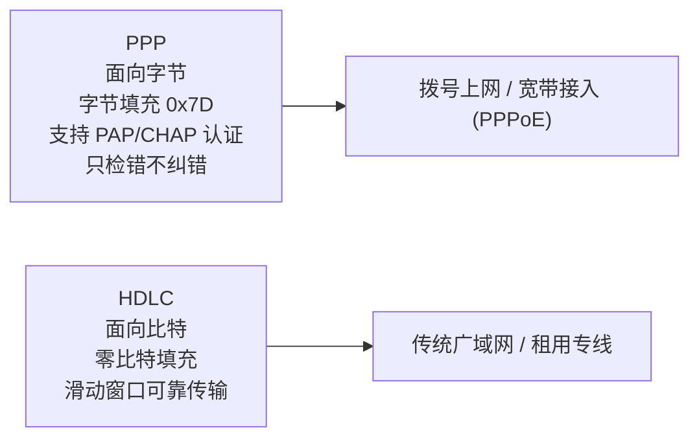
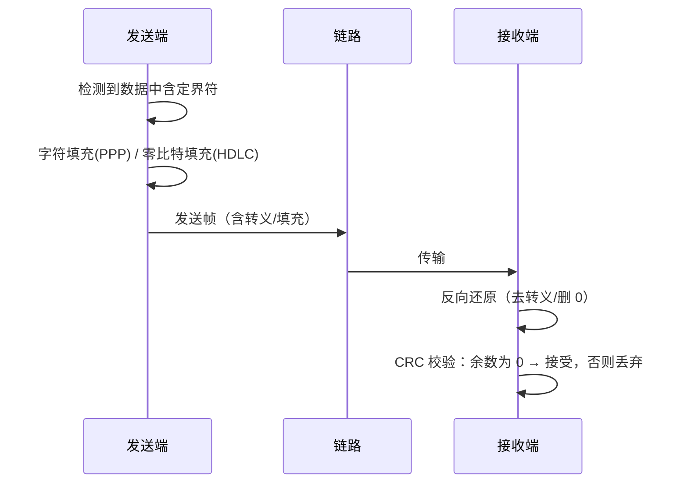

# 物理层 + 数据链路层 · 协议层次分布与作用场景全景图

> 配合 [[408_物理层与数据链路层考点全总结]] 使用。此页用图理解"每个设备/协议在哪一层、干什么"。网际层的协议图见 `01_网际层IP/`。

## 1. 物理层与数据链路层在 TCP/IP 模型中的位置

## 2. 四类设备与域隔离（重点）

| 设备 | 层次 | 隔离冲突域？ | 隔离广播域？ | 转什么 |
|---|---|---|---|---|
| 中继器 | 物理层 | ✗ | ✗ | 信号（比特） |
| 集线器 | 物理层 | ✗ | ✗ | 比特（广播所有口） |
| 网桥/交换机 | 数据链路层 | ✓（每端口） | ✗ | MAC 帧 |
| 路由器 | 网际层 | ✓（每端口） | ✓（每端口） | IP 数据报 |

> **记忆锚点**：冲突域从小到大：集线器（全共享）→ 交换机（每端口隔离）→ 路由器（广播域也隔离）。

## 3. 介质访问控制三类方式

## 4. 点到点协议 PPP vs 面向比特 HDLC

## 5. 数据链路层帧的透明传输

## 6. 记忆口诀汇总

- **物理层**：中继器、集线器 —— "**中继集线物理层，只会放大广播比特**"
- **链路层**：网桥、交换机 —— "**网桥交换链路层，看 MAC 隔离冲突**"
- **网际层**：路由器 —— "**路由器转 IP，隔离广播域**"
- **以太网**："**先听后发边发边听，冲突退避重传；最小帧长 64 字节**"
- **介质访问**："**有线 CD 无线 CA，RTS CTS 解决隐藏站**"
- **点对点**："**PPP 面向字节可认证，HDLC 面向比特可可靠**"
- **CRC**："**补零模二除，余数做 FCS，接收余零算无错**"
- **可靠传输**："**停等窗口一，GBN 回退重发，SR 只重出错帧**"

## 7. 一句话总结各协议"在哪一层干活"

| 协议/设备 | 干活的位置 | 一句话作用 |
|---|---|---|
| 中继器/集线器 | 物理层 | 放大/广播比特信号 |
| 曼彻斯特编码 | 物理层 | 以太网数字信号编码（自带时钟） |
| 以太网 CSMA/CD | 链路层 MAC | 共享介质争用控制 |
| 以太网帧 | 链路层 | 局域网帧封装（64~1518 B） |
| MAC 地址 | 链路层 | 相邻节点寻址（48 bit） |
| 交换机/网桥 | 链路层 | MAC 自学习转发，隔离冲突域 |
| VLAN 802.1Q | 链路层 | 逻辑隔离广播域 |
| PPP | 链路层 | 点到点、面向字节、可认证 |
| HDLC | 链路层 | 点到点、面向比特、可靠传输 |
| CRC | 链路层 | 检错（FCS） |
| 停等 / GBN / SR | 链路层 | ARQ 可靠传输 |
| ARP | 网际层↔链路层 | IP→MAC（本网） |
