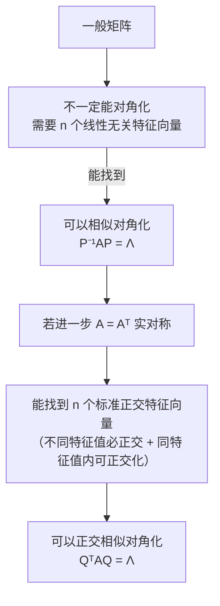
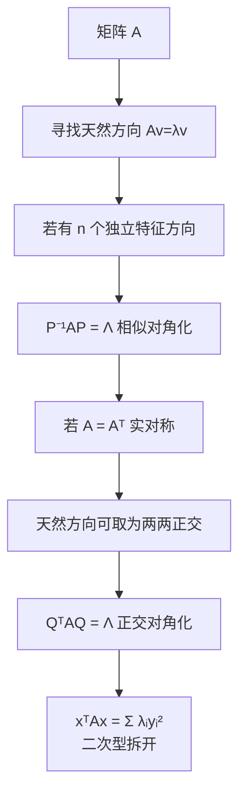

# 相似对角化与实对称矩阵（本质理解）

> [!info] 归属
> 线代大观 · 相似对角化专题 · **本质理解篇**。衔接 [[6_特征值与特征向量（核心思想）]] 与 [[8_半定矩阵（本质理解）]]，把"相似 → 对角化 → 实对称 → 正交对角化 → 二次型 → 正定性"串成一条完整逻辑链。

> [!important] 核心逻辑链（全文总纲）
> $$\boxed{\text{矩阵}} \longrightarrow \boxed{\text{换一组坐标}} \longrightarrow \boxed{\text{相似}} \longrightarrow \boxed{\text{寻找特征向量作为坐标轴}} \longrightarrow \boxed{\text{对角化}}$$
> 而实对称矩阵的特殊之处在于：
> $$\boxed{\text{它一定能找到一组两两正交的单位特征向量作为坐标轴}}$$
> 所以它不只是"可以相似对角化"，而是可以做到更漂亮的
> $$\boxed{Q^TAQ=\Lambda,\qquad Q^TQ=E}.$$
> 这也是为什么**实对称矩阵、特征值、正交矩阵、二次型、正定性**最后会全部汇合到一起。

---

## 一、先搞清楚：矩阵的本质究竟是什么？

我们平时看到 $A=\begin{pmatrix}a_{11}&\cdots&a_{1n}\\ \vdots&&\vdots\\ a_{n1}&\cdots&a_{nn}\end{pmatrix}$，很容易把矩阵理解成"一张数字表"。但在线性代数中，更本质的理解是：

$$\boxed{\text{矩阵是一个线性变换在某一组基下的数字表示}}$$

例如 $y=Ax$ 描述的是：输入向量 $x$，经过一个线性变换以后变成 $y$。但同一个线性变换，你可以选择不同的坐标系描述它。

就像平面上的同一个点：用直角坐标表示可能是 $(1,2)$，换一套坐标轴以后，它的坐标可能变成另外两个数。**点没有变，坐标变了。** 矩阵也是如此：**线性变换没有变，但换了基以后，表示这个线性变换的矩阵会变。**

> [!note] 这就是理解"相似"的入口
> 矩阵不是变换本身，变换是客观的，矩阵只是它在某组基下的"快照"。

---

## 二、相似矩阵的本质：同一个变换，不同的坐标表示

设原坐标下矩阵为 $A$。选一组新的基 $p_1,p_2,\cdots,p_n$，把它们作为列向量组成 $P=(p_1,p_2,\cdots,p_n)$。因为它们是一组基，所以 $P$ 可逆。

假设一个向量在新基下的坐标是 $y$，那么它在原基下的坐标就是 $x=Py$。原坐标下线性变换是 $x\mapsto Ax$，所以 $Ax=APy$。要把结果重新写成新坐标，就左乘 $P^{-1}$：$P^{-1}APy$。因此，在新基下同一个线性变换对应的矩阵就是：
$$\boxed{P^{-1}AP}$$
所以，如果 $B=P^{-1}AP$，我们就说 $A,B$ 相似。

> [!important] 相似 = 同一个变换的另一种表达
> $$\boxed{\text{相似矩阵}\ =\ \text{同一个线性变换在不同基下的矩阵表示}}$$
> 这才是相似的本质。

---

## 三、那为什么非要把它变成对角矩阵？

因为**对角矩阵是最容易理解的矩阵**。例如 $\Lambda=\begin{pmatrix}2&0\\0&3\end{pmatrix}$ 作用在 $x$ 上：
$$\Lambda x=\begin{pmatrix}2x_1\\3x_2\end{pmatrix}.$$
也就是说第一个坐标方向扩大 2 倍、第二个扩大 3 倍，两个方向互不干扰。这就是对角矩阵最核心的特点：
$$\boxed{\text{各个坐标方向完全独立}}$$

> [!important] 对角化的本质问题
> 能不能找到一组最自然的坐标轴，使得在线性变换 $A$ 下，每条坐标轴都只发生自身的伸缩，而不会和其他方向混在一起？而这样的方向，恰恰就是——
> $$\boxed{\text{特征向量方向}}$$

---

## 四、为什么特征向量就是最自然的坐标轴？

特征向量满足 $Av=\lambda v$，意味着：向量 $v$ 经过矩阵 $A$ 作用后，**方向没有改变，只是长度（和正负方向）发生了变化**。

| 情形 | 含义 |
|------|------|
| $Av=3v$ | 沿 $v$ 方向只做一件事：放大 3 倍 |
| $Av=-2v$ | 反向并放大 2 倍 |
| $Av=0$ | 这个方向被压到零向量 |

> [!tip] 特征向量是矩阵作用下的"天然方向"
> 这就是为什么对角化必须找特征向量——它们是矩阵作用中"不扭方向"的特殊方向，最适合当坐标轴。

---

## 五、$P^{-1}AP=\Lambda$ 到底在说什么？

假设 $P=(p_1,p_2,\cdots,p_n)$ 且 $P^{-1}AP=\Lambda=\mathrm{diag}(\lambda_1,\cdots,\lambda_n)$。两边左乘 $P$：
$$AP=P\Lambda.$$
左边 $AP=A(p_1,\cdots,p_n)=(Ap_1,\cdots,Ap_n)$，右边 $P\Lambda=(\lambda_1p_1,\cdots,\lambda_np_n)$。逐列比较：
$$Ap_1=\lambda_1p_1,\quad Ap_2=\lambda_2p_2,\quad\cdots,\quad Ap_n=\lambda_np_n.$$
所以：
$$\boxed{P\text{ 的每一列都是 }A\text{ 的特征向量}}$$
并且 $P$ 可逆，所以这些特征向量必须线性无关。于是得到相似对角化最重要的结论：
$$\boxed{ A\text{ 可相似对角化} \iff A\text{ 有 }n\text{ 个线性无关的特征向量} }$$

> [!important] 这句话的本质
> 如果能够找到 $n$ 个互相独立的"天然方向"，就把这些天然方向直接当成新的坐标轴。在这套坐标系里，$A$ 就只剩下沿各个坐标轴分别伸缩，所以自然变成了对角矩阵。

---

## 六、为什么有些矩阵不能对角化？

因为它找不到足够多的独立特征方向。看
$$A=\begin{pmatrix}1&1\\0&1\end{pmatrix}.$$
它的特征值只有 $\lambda=1$。求特征向量：$(A-E)x=0$，即 $\begin{pmatrix}0&1\\0&0\end{pmatrix}\begin{pmatrix}x_1\\x_2\end{pmatrix}=0$，得到 $x_2=0$。所以特征向量只有 $x=\begin{pmatrix}x_1\\0\end{pmatrix}$，本质上**只有一个独立方向**。

可这是二维空间，想建立二维坐标系至少需要两个线性无关的方向。现在只有一个天然方向，所以根本无法用特征向量组成一组基，因此它不能相似对角化。

> [!warning] 不要把"不能对角化"理解成神秘现象
> $$\boxed{\text{本质只是：特征方向不够}}$$

---

## 七、为什么有 $n$ 个不同特征值就一定能对角化？

因为**不同特征值对应的特征向量一定线性无关**。所以 $n$ 阶矩阵如果有 $n$ 个互不相同的特征值，自然能找到 $n$ 个线性无关的特征向量，因此一定可以相似对角化：
$$\boxed{ n\text{ 个互不相同的特征值} \Longrightarrow \text{可相似对角化} }$$
但反过来不成立。例如 $A=\begin{pmatrix}1&0\\0&1\end{pmatrix}$ 只有一个特征值 $\lambda=1$，但显然已经是对角矩阵。

> [!important] 真正决定能否对角化的
> $$\boxed{\text{是否有足够多的线性无关特征向量}}$$
> 不是"特征值是否重复"。

---

## 八、现在进入关键：实对称矩阵为什么特殊？

所谓实对称矩阵，就是 $\boxed{A^T=A}$。例如 $A=\begin{pmatrix}2&1\\1&3\end{pmatrix}$。它最重要的几个性质最终汇聚为：
$$\boxed{\text{实对称矩阵一定可以正交相似对角化}}$$
即一定存在**正交矩阵** $Q$，满足 $\boxed{Q^TAQ=\Lambda}$。由于正交矩阵满足 $Q^{-1}=Q^T$，所以这其实就是 $Q^{-1}AQ=\Lambda$——它当然也是相似对角化，只不过比普通相似对角化强很多。

---

## 九、普通对角化和实对称矩阵对角化，最大的区别是什么？

普通可对角化矩阵只能保证找到一组**线性无关**特征向量，这些特征向量**不一定垂直**。例如
$$A=\begin{pmatrix}1&1\\0&2\end{pmatrix}.$$
对 $\lambda_1=1$ 取 $p_1=\begin{pmatrix}1\\0\end{pmatrix}$，对 $\lambda_2=2$ 取 $p_2=\begin{pmatrix}1\\1\end{pmatrix}$。它们线性无关所以能对角化，但是 $p_1^Tp_2=1\ne0$，并不正交——它找到的是一套**斜着的坐标轴**。

而实对称矩阵就漂亮得多。它一定能找到一组 $q_1,q_2,\cdots,q_n$ 满足 $q_i^Tq_j=0\ (i\ne j)$ 且 $q_i^Tq_i=1$。因此这些向量既是特征向量，又是**标准正交基**。把它们组成 $Q$，自然就有 $Q^TQ=E$。所以：
$$\boxed{\text{一般可对角化矩阵：找到一组特征向量基}}$$
$$\boxed{\text{实对称矩阵：找到一组标准正交特征向量基}}$$

> [!important] 二者最本质的差别之一
> 一个是"斜坐标轴"，一个是"垂直坐标轴"。

---

## 十、为什么实对称矩阵不同特征值的特征向量一定正交？——关键证明

设 $Au=\lambda u,\ Av=\mu v$，其中 $\lambda\ne\mu$。考虑 $u^TAv$。

因为 $Av=\mu v$，所以 $u^TAv=\mu u^Tv$。另一方面，由于 $A^T=A$：
$$u^TAv=(Au)^Tv.$$
又因为 $Au=\lambda u$，所以 $(Au)^Tv=\lambda u^Tv$。于是 $\lambda u^Tv=\mu u^Tv$，即 $(\lambda-\mu)u^Tv=0$。因为 $\lambda\ne\mu$，所以：
$$\boxed{u^Tv=0}$$

> [!important] 整个证明真正用到的关键一步
> $$u^TAv=(Au)^Tv$$
> 它之所以成立，正是因为 $A^T=A$。所以"特征向量正交"不是偶然现象，而是**矩阵对称性直接造成的结果**。

---

## 十一、如果特征值重复怎么办？

例如某个特征值 $\lambda$ 对应两个线性无关特征向量 $v_1,v_2$，它们未必天然正交。但因为它们属于同一个特征值，所以这个特征值对应的整个解空间中**每一个非零向量都是 $\lambda$ 的特征向量**。因此我们可以在这个空间内部把它们**正交化、单位化**，最后还是能得到标准正交的特征向量。

于是实对称矩阵无论特征值是否重复，最终都能得到 $n$ 个两两正交的单位特征向量。因此：
$$\boxed{\text{实对称矩阵一定可对角化}}$$
而且是 $\boxed{\text{正交相似对角化}}$。

> [!note] 联系
> 正交化工具：[[🌟施密特正交化]]（若库中存在）——在同一特征子空间内部施密特正交化即可。

---

## 十二、$A=Q\Lambda Q^T$ 的几何意义特别重要

由 $Q^TAQ=\Lambda$ 可得 $\boxed{A=Q\Lambda Q^T}$。这个式子告诉我们实对称矩阵 $A$ 是怎样工作的。对向量 $x$：
$$Ax=Q\Lambda Q^Tx.$$
按从右向左的顺序：
1. 先做 $Q^Tx$：把 $x$ 换到"特征向量坐标系"中；
2. 然后做 $\Lambda(Q^Tx)$：在各个互相垂直的特征方向上分别进行 $\lambda_1,\cdots,\lambda_n$ 倍的伸缩；
3. 最后再乘 $Q$：把结果变回原来的坐标系。

> [!important] 实对称矩阵作用的直观图像
> $$\boxed{\text{换到一组正交特征轴}\ \rightarrow\ \text{沿各轴分别伸缩}\ \rightarrow\ \text{换回原坐标}}$$

---

## 十三、来看一个完整例子

取
$$A=\begin{pmatrix}2&1\\1&2\end{pmatrix}.$$
特征方程 $\vert A-\lambda E\vert=\begin{vmatrix}2-\lambda&1\\1&2-\lambda\end{vmatrix}=0$，得到 $\lambda_1=3,\ \lambda_2=1$。

对 $\lambda_1=3$，解 $(A-3E)x=0$ 得特征向量 $\begin{pmatrix}1\\1\end{pmatrix}$，单位化 $q_1=\frac1{\sqrt2}\begin{pmatrix}1\\1\end{pmatrix}$。对 $\lambda_2=1$，得 $q_2=\frac1{\sqrt2}\begin{pmatrix}1\\-1\end{pmatrix}$。马上发现 $q_1^Tq_2=0$。于是
$$Q=\frac1{\sqrt2}\begin{pmatrix}1&1\\1&-1\end{pmatrix},$$
这是正交矩阵，并且 $Q^TAQ=\begin{pmatrix}3&0\\0&1\end{pmatrix}$。

> [!tip] 几何意义
> 原来 $A$ 看上去两个坐标彼此纠缠，但其实只不过是我们原来的坐标轴"选得不好"。真正天然的两个方向是 $\begin{pmatrix}1\\1\end{pmatrix}$ 和 $\begin{pmatrix}1\\-1\end{pmatrix}$。在这两个互相垂直的方向上，矩阵作用特别简单：
> $$\begin{pmatrix}1\\1\end{pmatrix}\longrightarrow3\begin{pmatrix}1\\1\end{pmatrix},\qquad \begin{pmatrix}1\\-1\end{pmatrix}\longrightarrow1\begin{pmatrix}1\\-1\end{pmatrix}$$
> 即：一个方向扩大 3 倍，另一个方向保持不变。**这才是矩阵 $A$ 真正的内部结构。**

---

## 十四、这和你刚学的半正定矩阵为什么直接连起来了？

对于实对称矩阵 $A=Q\Lambda Q^T$，考虑二次型 $x^TAx$。令 $x=Qy$，那么
$$x^TAx=y^TQ^TAQy=y^T\Lambda y.$$
于是：
$$\boxed{x^TAx=\lambda_1y_1^2+\lambda_2y_2^2+\cdots+\lambda_ny_n^2}$$
这就是为什么实对称矩阵的正定性**完全由特征值决定**：全部 $\lambda_i>0$ 则正定，全部 $\lambda_i\ge0$ 则半正定。

> [!important] 完整的逻辑链（衔接 [[8_半定矩阵（本质理解）]]）
> $$\boxed{A=A^T}\ \Longrightarrow\ \text{可找一组正交特征向量}\ \Longrightarrow\ \boxed{Q^TAQ=\Lambda}\ \Longrightarrow\ \text{二次型变成}\ \lambda_1y_1^2+\cdots+\lambda_ny_n^2\ \Longrightarrow\ \boxed{\text{定性就看特征值正负}}$$
> 这就是为什么考研线性代数中，实对称矩阵几乎是连接"特征值"和"二次型"的桥梁。

---

## 十五、一个特别容易混淆的地方：相似变换和二次型变换

普通相似对角化是 $\boxed{P^{-1}AP=\Lambda}$，而二次型换元中出现的是 $\boxed{P^TAP}$。它们一般**不是一回事**，因为通常 $P^{-1}\ne P^T$。

但是对于实对称矩阵，我们可以选择正交矩阵 $Q$，此时 $Q^{-1}=Q^T$，于是：
$$Q^{-1}AQ=Q^TAQ=\Lambda.$$

> [!important] 到实对称矩阵这里，两种变换统一了
> $$\boxed{\text{相似对角化与二次型的正交变换恰好统一起来}}$$
> 这就是为什么实对称矩阵在整章线性代数里地位这么特殊。

---

## 十六、把三个层次区分清楚

> [!important] 层次结论
> $$\boxed{\text{正交相似对角化}\ \text{比}\ \text{普通相似对角化要求更强}}$$
> 而实对称矩阵一定满足这种更强的性质。

---

## 十七、最后给你一个"本质版"总结

> [!important] 第一句：相似的本质是换基
> $$\boxed{B=P^{-1}AP}\ \text{表示同一个线性变换在另一组基下的矩阵}$$

> [!important] 第二句：对角化的本质是把特征向量作为新的坐标轴
> 因为 $Av=\lambda v$，所以沿特征向量方向矩阵只进行简单的倍数伸缩。因此
> $$\boxed{A\text{ 能对角化} \iff \text{有足够多的独立特征方向}\ \iff\ n\text{ 个线性无关特征向量}}$$

> [!important] 第三句：实对称矩阵的本质优势是天然方向彼此可以正交
> 所以可以找到标准正交特征向量组，使
> $$\boxed{Q^TAQ=\Lambda}$$

> [!important] 第四句：正交对角化把二次型也彻底拆开了
> $$x^TAx\ \longrightarrow\ \boxed{\lambda_1y_1^2+\cdots+\lambda_ny_n^2}$$
> 因此实对称矩阵的特征值实际上告诉我们的就是：**在一组互相垂直的天然方向上，矩阵分别做多少倍的伸缩。**

### 本质版脑图

> [!tip] 最终认知
> 如果你把这条主线真正理解了，那么以后考研里看到"相似对角化、实对称矩阵、二次型、正定矩阵"时，它们就不会再是四块知识，而会变成**同一件事情的四种表达**。

## 相关链接

- [[线代大观 MOC]]
- [[6_特征值与特征向量（核心思想）]]（$Av=\lambda v$ 与特征方向的理解基础）
- [[8_半定矩阵（本质理解）]]（$A=Q\Lambda Q^T$ 直接决定二次型正定性）
- [[3_矩阵的秩（10条性质）]]（第⑩条"可相似对角化 ⟹ 秩 = 非零特征值个数"）
- [[🌟A可逆的等价命题]]（满秩 ⇔ 可逆 ⇔ 0 不是特征值）
- [[可对角化矩阵]]（教材级长笔记）
- [[🧵3.矩阵和向量组]]（教材级长笔记）
