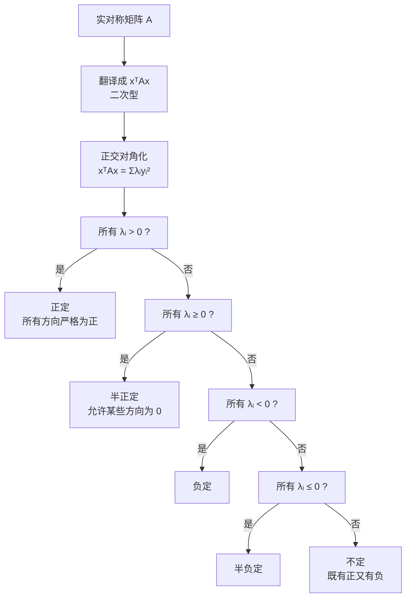

# 半定矩阵（本质理解）

> [!info] 归属
> 线代大观 · 半定矩阵专题 · **本质理解篇**。衔接 [[6_特征值与特征向量（核心思想）]]——理解半正定不要先背判定条件，而要抓住它背后的**二次型**。

> [!important] 核心一句话（全文总纲）
> $$\boxed{ \text{半正定矩阵的本质：一个实对称矩阵所对应的二次型，对任意方向都不会取负值，但允许某些方向恰好取到 }0 }$$

---

## 1. 矩阵为什么会和"正负"扯上关系？

单独一个矩阵 $A=\begin{pmatrix}a_{11}&a_{12}\\a_{21}&a_{22}\end{pmatrix}$ 本身其实没有"正""负"可言。所谓正定、半正定，真正讨论的是
$$\boxed{x^TAx}.$$
如果 $A$ 是实对称矩阵，那么 $f(x)=x^TAx$ 就是一个**二次型**。

例如 $A=\begin{pmatrix}1&0\\0&2\end{pmatrix},\ x=\begin{pmatrix}x_1\\x_2\end{pmatrix}$，则
$$x^TAx=x_1^2+2x_2^2.$$
无论你怎么取 $x_1,x_2$，它都不会小于 $0$。所以 $A$ 是正定的。

> [!note] 关键视角转换
> 看到实对称矩阵 $A$，不要只看到一堆数字，要**马上翻译成 $x^TAx$**。正负性、定性全都从这个二次型来看。

---

## 2. "正定"和"半正定"到底差在哪？——理解"半"字的关键

| | 定义 | 允许 $x^TAx=0$ 吗？ |
|---|---|---|
| **正定** | 对任意 $x\ne0$ 都有 $x^TAx>0$ | 不允许（除原点外任何方向都严格正） |
| **半正定** | 对任意 $x$ 都有 $x^TAx\ge0$ | **允许** $x\ne0$ 但 $x^TAx=0$ |

**正定的例子：** $A=\begin{pmatrix}1&0\\0&2\end{pmatrix}$，因为 $x^TAx=x_1^2+2x_2^2$，只要 $x\ne0$ 一定有 $x_1^2+2x_2^2>0$。

**半正定的例子：** $A=\begin{pmatrix}1&0\\0&0\end{pmatrix}$，此时 $x^TAx=x_1^2\ge0$。但当 $x=\begin{pmatrix}0\\1\end{pmatrix}\ne0$ 时，$x^TAx=0$。所以它不是正定，而是**半正定**。

> [!important] "半"的本质
> $$\boxed{\text{不出现负值，但允许非零向量对应零值}}$$

---

## 3. 为什么特征值能完全决定半正定？——最核心的地方

因为实对称矩阵 $A$ 可以**正交对角化**：
$$A=Q\Lambda Q^T,$$
其中 $\Lambda=\begin{pmatrix}\lambda_1&&\\&\ddots&\\&&\lambda_n\end{pmatrix}$ 里面就是 $A$ 的全部特征值。于是
$$x^TAx=x^TQ\Lambda Q^Tx.$$
令 $y=Q^Tx$，则 $x^TAx=y^T\Lambda y$，也就是：
$$\boxed{x^TAx=\lambda_1y_1^2+\lambda_2y_2^2+\cdots+\lambda_ny_n^2}$$

> [!important] 这一个式子几乎解释了所有"正定、半正定、不定"的问题
> 经过正交变换，二次型永远是各分量平方的加权和，权重就是特征值。

---

## 4. 从这个式子看"半正定"的本质

由于 $y_i^2\ge0$，所以如果所有 $\lambda_i\ge0$，那么显然 $x^TAx\ge0$。因此：
$$\boxed{ A\text{ 半正定} \iff A\text{ 的全部特征值 }\lambda_i\ge0 }$$
（默认 $A$ 是实对称矩阵。）

更重要的是，你可以反过来理解：如果某一个特征值 $\lambda_k<0$，那么只沿着这个特征值对应的特征向量方向走，就会得到 $x^TAx<0$。所以**只要存在一个负特征值，就不可能半正定**。

> [!tip] 为什么特征值如此重要？
> 特征值告诉我们矩阵在各个"特殊方向"上究竟是正、负还是零。

---

## 5. 用三个矩阵对比，你马上就能看出本质

考虑三个对角矩阵：

| 矩阵 | 特征值 | $x^TAx$ | 定性 |
|------|--------|---------|------|
| $A_1=\begin{pmatrix}2&0\\0&3\end{pmatrix}$ | $2,\ 3$ | $2x_1^2+3x_2^2$ | $\boxed{\text{正定}}$ |
| $A_2=\begin{pmatrix}2&0\\0&0\end{pmatrix}$ | $2,\ 0$ | $2x_1^2$ | $\boxed{\text{半正定但不正定}}$ |
| $A_3=\begin{pmatrix}2&0\\0&-1\end{pmatrix}$ | $2,\ -1$ | $2x_1^2-x_2^2$ | $\boxed{\text{不定}}$ |

**对照分析：**
- $A_1$：所有方向都是严格正的 → 正定；
- $A_2$：不会小于零，但沿着 $x=\begin{pmatrix}0\\t\end{pmatrix}$ 方向有 $x^TA_2x=0$ → 半正定；
- $A_3$：取 $x=(1,0)^T$ 得正值，取 $x=(0,1)^T$ 得负值 → 不定。

> [!important] 完整的定性对照表
> $$\boxed{ \begin{array}{c|c} \text{特征值情况}&\text{矩阵性质}\\ \hline \lambda_i>0\text{ 全部成立}&\text{正定}\\ \lambda_i\ge0\text{ 全部成立}&\text{半正定}\\ \lambda_i<0\text{ 全部成立}&\text{负定}\\ \lambda_i\le0\text{ 全部成立}&\text{半负定}\\ \text{既有正又有负}&\text{不定} \end{array}} $$

---

## 6. "半正定"中的 0 到底意味着什么？

如果 $A$ 半正定但不正定，那么至少有一个特征值为 $0$。假设 $Av=0,\ v\ne0$，那么 $v^TAv=0$。也就是说：**存在一个非零方向 $v$，矩阵在这个方向上完全"没有二次作用"。**

所以：
- **正定**：所有方向都有严格的正作用，$x^TAx>0$；
- **半正定**：有些方向有正作用，有些方向可能"完全没作用"（$x^TAx=0$），但绝不会出现负作用。

---

## 7. 从秩的角度再理解一次

如果 $A$ 是 $n$ 阶正定矩阵，因为所有特征值 $\lambda_i>0$，所以没有零特征值，于是 $\vert A\vert\ne0$，从而 $r(A)=n$：
$$\boxed{\text{正定矩阵一定可逆}}$$
但是半正定矩阵允许 $\lambda_i=0$，所以它**可能不可逆**。例如 $A=\begin{pmatrix}1&0\\0&0\end{pmatrix}$ 就是半正定矩阵，但是 $\vert A\vert=0$。

> [!tip] 理解
> - **正定**：每个方向都有作用，所以不会"丢失方向"；
> - **半正定**：可能有某些方向被压成了 0，所以可能降秩。
>
> 注意，正定矩阵一定是半正定矩阵；只是考研题目通常把"半正定但不正定"的情形单独拿出来讨论。

> [!note] 与 [[2_矩阵的秩（本质直觉）]] 衔接
> "方向被压成 0" = 存在 $Av=0$ 的非零解 = $r(A)<n$，与"0 是特征值 ⟺ 降秩"的等价链一致。

---

## 8. 一个特别典型的半正定矩阵（含负数却半正定）

这个例子非常值得掌握：
$$A=\begin{pmatrix}1&-1\\-1&1\end{pmatrix}.$$
表面上看它甚至含有负数，好像"不太正"。但是：
$$x^TAx=\begin{pmatrix}x_1&x_2\end{pmatrix}\begin{pmatrix}1&-1\\-1&1\end{pmatrix}\begin{pmatrix}x_1\\x_2\end{pmatrix}=x_1^2-2x_1x_2+x_2^2=(x_1-x_2)^2.$$
所以 $x^TAx\ge0$，因此 $A$ 半正定。但是取 $x_1=x_2\ne0$ 时 $(x_1-x_2)^2=0$，所以它不是正定。

> [!warning] 纠正一个常见误区
> $$\boxed{\text{半正定跟矩阵元素本身是不是正数没有直接关系}}$$
> 真正看的永远是 $\boxed{x^TAx}$。

---

## 9. 为什么 $A^TA$ 一定半正定？——最能体现本质的地方之一

任意矩阵 $A$，考虑 $A^TA$。对于任意 $x$，
$$x^TA^TAx=(Ax)^T(Ax).$$
而 $(Ax)^T(Ax)$ 就是 $(Ax)_1^2+\cdots+(Ax)_m^2$，因此
$$x^TA^TAx\ge0.$$
所以：
$$\boxed{A^TA\text{ 一定是半正定矩阵}}$$

**为什么只是"半"正定？** 因为有可能存在 $x\ne0$ 满足 $Ax=0$，此时 $x^TA^TAx=0$。如果进一步满足 $Ax=0$ 只有零解，那么对所有 $x\ne0$ 有 $Ax\ne0$，所以 $(Ax)^T(Ax)>0$，此时 $A^TA$ 才是正定的。

> [!important] 这一下把五件事全部串在一起
> * 正定；
> * 半正定；
> * 齐次方程 $Ax=0$；
> * 秩；
> * 特征值。
>
> $A^TA$ 的定性完全由 $Ax=0$ 是否有非零解决定。

> [!note] 与 [[3_矩阵的秩（10条性质）]] 衔接
> 第⑧条 $r(A)=r(A^TA)=r(AA^T)$ 与此处相互印证：$A^TA$ 正定 ⟺ $Ax=0$ 只有零解 ⟺ $r(A)=n$。

---

## 10. 考研最容易犯的一个错误

正定矩阵有一个非常方便的判定：
$$\boxed{\text{实对称矩阵正定} \iff \text{各阶顺序主子式全部大于 }0}$$
但是到了半正定，**不能简单地机械改成"顺序主子式 $\ge0$"**——这并不是充分条件。半正定的主子式判定应该是：
$$\boxed{\text{所有主子式都}\ge0}$$
"所有主子式"和"顺序主子式"不是一回事。

> [!tip] 考研建议
> 遇到半正定问题，更建议优先想到：
> $$\boxed{\text{特征值全部}\ge0}$$
> 或者直接研究
> $$\boxed{x^TAx\ge0}$$
> 这两个思路通常更不容易出错。

---

## 11. 最终建立一个统一认识

以后看到一个实对称矩阵 $A$，脑子里不要只看到一堆数字，应该马上把它翻译成 $x^TAx$。然后想象经过正交变换以后，它一定可以写成
$$\lambda_1y_1^2+\cdots+\lambda_ny_n^2.$$
于是：

| 定性 | 特征值条件 | 二次型含义 |
|------|-----------|-----------|
| **正定** | $\lambda_1,\ldots,\lambda_n>0$ | 所有非零方向都严格为正 |
| **半正定** | $\lambda_1,\ldots,\lambda_n\ge0$ | 所有方向不为负，允许某些非零方向为 0 |
| **负定** | $\lambda_1,\ldots,\lambda_n<0$ | 所有非零方向都严格为负 |
| **半负定** | $\lambda_1,\ldots,\lambda_n\le0$ | 所有方向不为正，允许某些非零方向为 0 |
| **不定** | 既有正特征值又有负特征值 | 有些方向正、有些方向负 |

> [!important] 最值得记住的直觉
> $$\boxed{\text{正定}=\text{所有非零方向都严格为正}}$$
> $$\boxed{\text{半正定}=\text{所有方向都不为负，但允许某些非零方向"变成 }0}$$
> 所以"半正定"和"正定"之间真正差的，不是什么复杂条件，而就是：
> $$\boxed{\text{是否允许零特征值}}$$
> 这就是半定矩阵在考研数学范围内最核心的本质。

### 定性判定流程（脑图）

---

## 一句话总结

$$\boxed{ \text{半正定} = \text{不出现负值} + \text{允许零方向} }$$
$$\boxed{ \text{正定与半正定之差} = \text{是否允许零特征值} }$$

## 相关链接

- [[线代大观 MOC]]
- [[6_特征值与特征向量（核心思想）]]（特征值决定定性的基础：$A=Q\Lambda Q^T$）
- [[2_矩阵的秩（本质直觉）]]（"方向被压成 0" = 降秩，与正定 ⟹ 可逆衔接）
- [[3_矩阵的秩（10条性质）]]（第⑧条 $r(A^TA)=r(A)$ 与 $A^TA$ 半正定衔接）
- [[🌟A可逆的等价命题]]（正定 ⟹ 可逆 ⟹ 0 不是特征值）
- [[🌟基础解系和极大线性无关组]]（$Ax=0$ 非零解 ⟺ $r(A)<n$，决定 $A^TA$ 是否正定）
- [[🧵3.矩阵和向量组]]（教材级长笔记）
