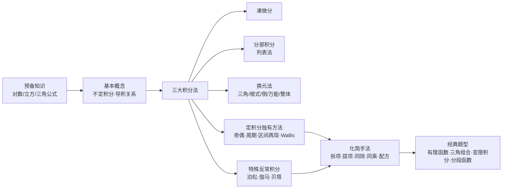

# 一元积分计算 MOC

> [!info] 来源
> 本专题整理自《【A4】一元积分计算知识点》速记 PDF（澄潇宇、一只羊&南门朔），在原有口诀与框架基础上补充了公式、定义与 LaTeX 表达，用于系统性复习一元积分计算。
>
> 2026-08-30 重新整理：正文（[[一元积分大观]]）在保留原有框架与结论前提下，补齐 PDF 中的工作例题（列表法、拆项/提项/同除/同乘、待定系数与混合留数法、反常积分具体值）及 $\sqrt{a^2-x^2}$、$\sqrt{x^2\pm a^2}$ 两条导积关系。
>
> 2026-09-12 补入两张【常见凑微分】速查卡 → [[一元积分大观#一、凑微分法]]：**速查卡 A** 基础 18 条（①–⑩ 初等函数、⑪–⑱ 推广到 $f(x)$）、**速查卡 B** 进阶 16 条（乘积求导法则的逆用）。
>
> 2026-09-12 并入讲义《不定积分·有理函数·全体原函数》→ [[一元积分大观#五、配套例题：三次与四次有理函数家族|有理函数配套例题]]（$\frac{1}{1\pm x^3}$、$\frac{1}{1\pm x^4}$ 七例，含 $\int\frac{dx}{1+x^4}$ 的高阶技巧与 $x=0$ 定义域辨析）＋ [[一元积分大观#三、换元失效点的拼接|全体原函数的拼接]]（660 第 55 / 480 题，分段拼接 vs 换元失效点拼接）。

## 知识结构总览

## 三大积分法导航

| 方法 | 核心 | 适用 |
|------|------|------|
| **凑微分** | 把被积函数凑成 $f[\varphi(x)]\varphi'(x)\,\mathrm{d}x$ 的形式 | 含复合函数、$e^x$ 速算 |
| **分部积分** | 列表法：上导下积、对角相乘、正负相间 | 幂函数 × 指数/三角，循环积分 |
| **换元法** | 三角代换 / 根式代换 / 倒代换 / 整体代换 | 根号下平方和差、根式、分母高次 |

> [!tip] 凑微分先查表
> 动笔前先扫 [[一元积分大观#一、凑微分法|速查卡 A／B]]：**速查卡 A**（18 条）看"被积函数能否配成 $f'(x)$ 与 $f(x)$ 的现成组合"；**速查卡 B**（16 条）看"是否两项相加、其中一项带 $x$"（乘积求导法则逆用）。对上了就一步写出。

## 定积分独有方法导航

| 方法 | 适用 | 核心 |
|------|------|------|
| **奇偶性** | 对称区间 | 偶倍奇零 |
| **周期性** | 三角函数 | 周期内积分与起点无关 |
| **区间再现** | 分子为分母其中一项 | 令 $x=$ 上限 $+$ 下限 $- t$ |
| **平移变换** | 区间不合适 | 移到题设区间 / 构造对称区间 |
| **Wallis 公式** | cos/sin 高次幂 | 分奇偶递推 |

## 特殊反常积分

| 积分 | 公式 | 用途 |
|------|------|------|
| 指数零到无穷 | $\int_0^\infty x^n e^{-x}\,\mathrm{d}x = n!$ | 与伽马函数联系 |
| 泊松积分 | $\int_0^\infty e^{-x^2}\,\mathrm{d}x = \frac{\sqrt{\pi}}{2}$ | 概率论高频 |
| 伽马函数 | $\Gamma(s)=\int_0^\infty x^{s-1}e^{-x}\,\mathrm{d}x$ | 阶乘的推广 |
| 贝塔函数 | $B(p,q)=\int_0^1 x^{p-1}(1-x)^{q-1}\,\mathrm{d}x$ | 与伽马互化 |

> [!mistake] 提醒
> PDF 特别标注：数学一、三建议反复抄写这些反常积分；数学二从未考过概率论（泊松积分与概率联系），但请务必重视。

## 核心考点速查

- 不定积分 = 找原函数 = "找谁干的"
- 常数可随意进出积分号，微分内可任意加减常数
- **凑微分速查卡**：基础 18 条（$\frac{1}{\sqrt{x}},\frac{1}{x^2},\frac{1}{\sqrt{1-x}},\frac{1}{\sqrt{1-x^2}},\frac{1}{1+x^2},\frac{1}{x}$ 及 $\sec^2,\csc^2,\sec\tan,\csc\cot$；再推广到 $f(x)$）；进阶 16 条（$(x\ln x)'$、$(xe^x)'$、$(x^2e^x)'$、$(x\sin x)'$、$(x\arctan x)'$ 等"乘积求导逆用"）
- 导积关系熟记 $\sqrt{a^2-x^2}$、$\sqrt{x^2\pm a^2}$ 两条特殊原函数
- 分部积分：幂函数遇"导积终止符"（幂函数 ➡ 0）；循环积分 ➡ $I$ = 常数倍
- 有理函数积分：分⼦次数 ≥ 分母次数先提项/拆项；分母二次配方后凑微分
- 待定系数法 4 步（因式分解 → 全因式写出 → 分子待定 → 通分对照/特值法）
- 混合留数法 ⭐⭐⭐：括号里一次外一次直接代零点；括号里一次外高次先代高次项剩项特值；括号里二次外一次分子为一次式对比
- 三角组合积分：$\sin\cos$ 奇次凑微分、偶次降幂；$1$ 的妙用、$\cos$ 消 1、$\sin\cos$ 转 $\sin$；$\frac{C\sin x+D\cos x}{A\sin x+B\cos x}$ 拆成 $E(A\sin x+B\cos x)+F(A\cos x-B\sin x)$
- 变限积分定积分：凑微分分部 ⭐⭐⭐ / 交换积分次序
- 分段函数不定积分：分段分别求、写 $C_1C_2$、由原函数可导必连续定关系
- **全体原函数拼接**：换元/技巧在孤立点失效（$\tan$ 在 $\frac\pi2$、同除 $x^n$ 在 $0$）→ 分区间积分后用**连续性**接常数，常数差由单侧极限定

## 相关链接

- [[🌲3.一元积分学及其应用]]
- [[三角函数积分]]
- [[基本积分公式表]]
- [[多元微分 MOC]]（同库其他专题）
