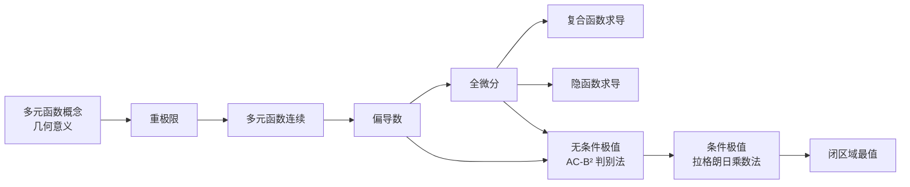
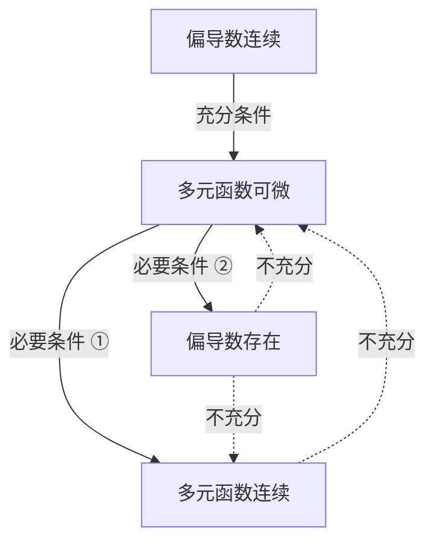

# 多元函数微分学 MOC

> [!info] 来源
> 本专题整理自《多元微分知识点【A4版】》速记 PDF，在原有口诀与框架基础上补充了定义、公式与 LaTeX 表达，用于系统性复习多元函数微分学。

## 知识结构总览

多元函数微分学的核心链条：**极限 → 连续 → 偏导/全微分 → 复合/隐函数求导 → 极值/最值**。

## 关键关系图（可微 / 连续 / 偏导）

- **偏导数连续 ⟹ 可微**（充分条件）
- **可微 ⟹ 连续**（必要条件 ①）
- **可微 ⟹ 偏导数存在**（必要条件 ②）
- 连续 / 偏导数存在 均 **不能** 推出可微
- 偏导数存在 **不能** 推出连续

## 专题导航

| 主题 | 笔记 |
|------|------|
| 考试大纲 | [[多元微分大观#多元微分考试大纲]] |
| 概念与极限 | [[多元微分大观#多元函数概念与重极限]]、[[多元微分大观#多元函数连续]] |
| 偏导与全微分 | [[多元微分大观#偏导数]]、[[多元微分大观#全微分]] |
| 复合与隐函数 | [[多元微分大观#多元复合函数求导]]、[[多元微分大观#多元隐函数求导]] |
| 极值与最值 | [[多元微分大观#无条件极值]]、[[多元微分大观#条件极值与拉格朗日乘数法]]、[[多元微分大观#闭区域最值]] |
| 常用不等式 | [[多元微分大观#柯西不等式与均值不等式]] |

## 核心考点速查

- 证明重极限不存在：取不同路径 / 极坐标
- 已知重极限求全微分：脱极限号，凑可微定义
- 全微分关系：偏导连续 ⟹ 可微 ⟹ 连续 且 偏导存在
- 复合函数求导：先画复合结构图，根部有 x 的都走一遍
- 隐函数求导：$F$ 对"口"的偏导数不为 0，则"口"可确定为其余变量的隐函数（分母不为 0）
- 二阶混合偏导数连续必相等
- 无条件极值：一阶偏导 = 0，二阶偏导 AC-B² 判别法
- 条件极值：拉格朗日乘数法、二转一、极坐标换元
- 闭区域最值：内部驻点 + 边界条件极值 + 端点比较

## 相关链接

- [[🌲4.多元函数微分学及其应用]]（更完整的教材级笔记）
- [[多元函数链式求导法则证明]]
- [[可微的充分条件与性质]]
