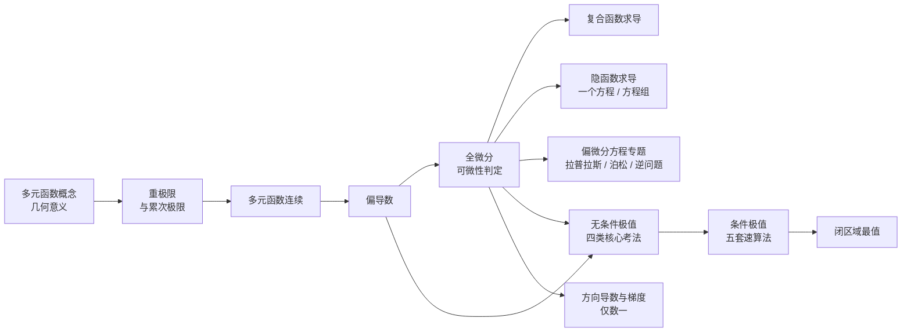
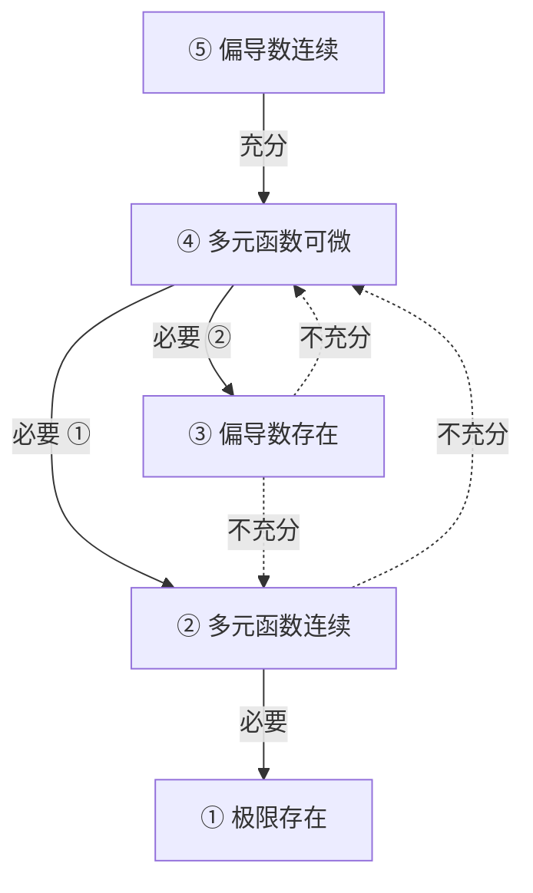

# 多元函数微分学 MOC

> [!info] 来源
> - 本专题的**主笔记**为 [[多元微分大观]]（知识点全解），整合了五份材料：
>   1. 《多元微分知识点【A4版】》（考试大纲 ＋ 速记框架）
>   2. 星河《多元函数微分学概念（底稿）》（15 页手写，**计算型概念**）
>   3. 星河《27 星河-多元函数微分学大题满分讲义 1》（27 页，**题 1–36，大题套路**）
>   4. 星河《无条件极值的四类核心考法》（14 页，**例 1–13**）
>   5. 星河《求多元函数的条件最值》（24 页，**条件极值五套速算法**）
> - 原始出处：**小红书：星河满分高等数学答疑**。
> - 例题解析一律折叠，先自己做再点开；全部公式与例题已逐条数值验算，来源笔误见 [[多元微分大观#附录 B、勘误清单]]。

## 知识结构总览

多元函数微分学的核心链条：**极限 → 连续 → 偏导/全微分 → 复合/隐函数求导 → 偏微分方程 → 极值/最值**。

```mermaid
flowchart LR
    A[多元函数概念<br/>几何意义] --> B[重极限<br/>与累次极限]
    B --> C[多元函数连续]
    C --> D[偏导数]
    D --> E[全微分<br/>可微性判定]
    E --> F[复合函数求导]
    E --> G[隐函数求导<br/>一个方程 / 方程组]
    E --> H[偏微分方程专题<br/>拉普拉斯 / 泊松 / 逆问题]
    D & E --> I[无条件极值<br/>四类核心考法]
    I --> J[条件极值<br/>五套速算法]
    J --> K[闭区域最值]
    E --> L[方向导数与梯度<br/>仅数一]
```

## 关键关系图（可微 / 连续 / 偏导）

```mermaid
flowchart TD
    PC[⑤ 偏导数连续] -->|充分| DW[④ 多元函数可微]
    DW -->|必要 ①| LC[② 多元函数连续]
    DW -->|必要 ②| PD[③ 偏导数存在]
    LC -->|必要| LM[① 极限存在]
    PD -.->|不充分| LC
    LC -.->|不充分| DW
    PD -.->|不充分| DW
```

- **⑤ 偏导数连续 ⟹ ④ 可微**（充分条件）
- **④ 可微 ⟹ ② 连续**（必要条件 ①）
- **④ 可微 ⟹ ③ 偏导存在**（必要条件 ②）
- ② 连续 / ③ 偏导存在 均 **不能** 推出 ④ 可微
- ③ 偏导存在 **不能** 推出 ② 连续
- ④ 可微 **不能** 推出 ⑤ 偏导连续
- **二级结论**：$f_x(x_0,y_0)$ 存在 ＋ $f_y$ 在 $(x_0,y_0)$ 连续 ⟹ 可微

## 专题导航

| 板块 | 笔记 |
|------|------|
| 考试大纲与复习定位 | [[多元微分大观#一、考试大纲与复习定位]] |
| 概念、极限与连续 | [[多元微分大观#二、多元函数的概念、极限与连续]] |
| 偏导数 | [[多元微分大观#三、偏导数]] |
| 全微分 | [[多元微分大观#四、全微分]] |
| **可微性判定**（计算型概念核心） | [[多元微分大观#五、可微性判定（计算型概念核心）]] |
| 复合与隐函数求导 | [[多元微分大观#六、多元复合函数与隐函数求导]] |
| **偏微分方程专题**（题 9–36） | [[多元微分大观#七、偏微分方程专题]] |
| **无条件极值**（四类核心考法） | [[多元微分大观#八、无条件极值]] |
| **条件极值与条件最值** | [[多元微分大观#九、条件极值与条件最值]] |
| 常用不等式 | [[多元微分大观#十、常用不等式]] |
| 闭区域最值 | [[多元微分大观#十一、闭区域最值]] |
| 方向导数与梯度（仅数一） | [[多元微分大观#十二、方向导数与梯度]] |
| 空间曲线与曲面的切线与切平面 | [[多元微分大观#十三、空间曲线与曲面的切线与切平面]] |
| 二阶泰勒公式 | [[多元微分大观#十四、二元函数的二阶泰勒公式]] |
| 速查、默写与易混 | [[多元微分大观#十五、速查、默写与易混]] |
| 来源材料与勘误 | [[多元微分大观#附录 A、来源材料]]、[[多元微分大观#附录 B、勘误清单]] |

## 核心考点速查

- **重极限 vs 累次极限**：三件事互相独立；**累次极限先算后面的**
- **证重极限不存在**：取不同路径 / 极坐标看 $\theta$ / 两个累次极限不等
- **推广判据**：$\dfrac{x^\alpha y^\beta}{x^{2m}+y^{2n}}$，$\frac{\alpha}{2m}+\frac{\beta}{2n}>1$ 则极限为 0，否则不存在
- **已知重极限求全微分**：脱帽法，凑可微定义
- **偏导三算法**：先代后求 / 脱帽法 / 双法
- **可微判定**：$\lim\limits_{\rho\to0}\frac{\Delta z-\mathrm dz}{\rho}=0$；抽象形式走"观察可微 → 脱帽法 → 判高阶无穷小"
- **二级结论**：$f_x$ 存在 ＋ $f_y$ 连续 ⟹ 可微（比"偏导连续"更弱）
- **复合函数求导**：先画复合结构图；抽象函数**按位置求偏导**，括号里一个不动
- **隐函数求导**：$F$ 对"口"的偏导数不为 0；**自变量个数 ＝ 有效字母个数 − 函数个数**
- **偏微分方程**：径向化公式 ＋ **凑全导数**（$(rf')'$、$(t^2f')'$）；乘积形式走**欧拉方程**
- **偏积分**：**积分常数是另一变量的函数**
- **无条件极值**：$AC-B^2$ 判别；失效走**五大技巧**（换元/分解/配方/路径/低次系数）
- **隐函数极值速算**：$A=-\frac{F_{xx}''}{F_z'}$，$AC-B^2=\frac{F_{xx}''F_{yy}''-(F_{xy}'')^2}{(F_z')^2}$
- **条件极值五套**：克拉默（$2\times2$ / 三选二 / 三阶行列式）／齐次速算 $f=-\lambda p$／柯西不等式
- **闭区域最值**：内部驻点 ＋ 逐段边界 ＋ 角点 ＋ 比较
- **最大方向导数** ＝ $\|\nabla f\|$（仅数一）

## 例题索引

### 按章节

| 章节 | 题量 | 入口 |
|---|---:|---|
| 概念与极限 | 例 2.1–2.5 | [[多元微分大观#2.6 本章例题索引]] |
| 偏导数 | 例 3.1 | [[多元微分大观#3.5 本章例题索引]] |
| 可微性判定 | 例 5.0–5.3 ＋ 反例四则 | [[多元微分大观#5.8 本章例题索引]] |
| 复合/隐函数 | 题 1–8 | [[多元微分大观#6.5 本章例题索引]] |
| 偏微分方程 | 题 1–36 | [[多元微分大观#7.7 题 1–36 总索引]] |
| 无条件极值 | 例 8.1–8.14 | [[多元微分大观#8.8 本章例题索引]] |
| 条件极值 | 例题 9.1–9.10 ＋ 课后 1–11 | [[多元微分大观#9.11 本章例题索引]] |
| 闭区域最值 | 4 道标准例题 | [[多元微分大观#11.2 例题]] |

### 按真题年份（条件极值部分）

| 年份·卷别 | 题目 | 位置 |
|---|---|---|
| 1988.III | 铁丝分段围正方形与圆 | [[多元微分大观#9.6.4 课后习题 5（1988.III）]] |
| 1990.IV/V | 广告策略（数三） | [[多元微分大观#9.8.1 例题 9.10（1990.IV/V：广告策略）]] |
| 1991.IV/V | 两市场销售（数三） | [[多元微分大观#9.8.2 课后习题 8（1991.IV/V：两市场销售）]] |
| 1994.II | 椭圆到直线距离（柯西） | [[多元微分大观#9.6.2 例题 9.7（原例 2.1：椭圆到直线距离）]] |
| 1994.V | 养鱼（数三） | [[多元微分大观#9.8.3 课后习题 9（1994.V：养鱼）]] |
| 1995.III | 闭区域上的极值 | [[多元微分大观#9.4.4 例题 9.4（1995 数学三：闭区域上的极值）]] |
| 1997.I | $z=f(\mathrm e^x\sin y)$ 满足 $\nabla^2z=\mathrm e^{2x}z$ | [[多元微分大观#7.3.2 例题（题 16–21）]] |
| 1999.III/IV | 生产函数（数三） | [[多元微分大观#9.8.4 课后习题 10（1999.III/IV：生产函数）]] |
| 2002.I | 小山攀登起点（数一） | [[多元微分大观#9.7.2 课后习题 7（2002.I：小山攀登起点）]] |
| 2005.II/IV | 椭圆域上的最值 | [[多元微分大观#9.5.4 课后习题 4（2005 数学二/四）]] |
| 2006.I | $\nabla^2z=0$ 求 $f(u)=\ln u$ | [[多元微分大观#7.2.2 例题（题 9–15）]] |
| 2007.I | $f=x^2+2y^2-x^2y^2$ 闭区域最值 | [[多元微分大观#9.3.3 课后习题 2（2007.I）]] |
| 2008.I | 曲线到 $xOy$ 面最远/最近点 | [[多元微分大观#9.6.3 例题 9.8（原例 2.2：曲线到 $xOy$ 面距离）]] |
| 2008.II/IV | 两约束下的最值 | [[多元微分大观#9.4.2 例题 9.3（2008.II/IV）]] |
| 2010.III | $u=xy+2yz$ 在球面上 | [[多元微分大观#9.3.2 例题 9.2（2010.III）]] |
| 2012.III | 成本最小化（数三） | [[多元微分大观#9.8.5 课后习题 11（2012.III：成本最小化）]] |
| 2013.II | 曲线到原点最长/最短距离 | [[多元微分大观#9.2.3 课后习题 1（2013.II）]] |
| 2014.I | $z=f(\mathrm e^x\cos y)$ | [[多元微分大观#7.3.2 例题（题 16–21）]] |
| 2015.I | 最大方向导数 | [[多元微分大观#9.7.1 例题 9.9（2015 数学一：最大方向导数）]] |
| 2018.I/II/III | 三段铁丝围圆/正方形/正三角形 | [[多元微分大观#9.6.5 课后习题 6（2018.I/II/III）]] |
| 天津 2019 | $y=\mathrm e^xf(x,x)$ | [[多元微分大观#7.5.2 例题（题 25–32）]] |

### 按竞赛届次

| 届次 | 题目 | 位置 |
|---|---|---|
| 四届决赛 | $y=\mathrm e^{-2x}f(x,x)$ 的一阶方程 | [[多元微分大观#7.5.2 例题（题 25–32）]] |
| 八届初赛 | $f'(\mathrm e^xy^2)\mathrm e^xy^2=f(\mathrm e^xy^2)$ | [[多元微分大观#7.5.2 例题（题 25–32）]] |
| 12 届初赛 | $z=xf(y/x)+2y\varphi(x/y)$（双任意函数） | [[多元微分大观#7.5.2 例题（题 25–32）]] |
| 14 届初赛 | 泊松方程 $f''(r)+\frac1rf'(r)=r^2$ | [[多元微分大观#7.3.2 例题（题 16–21）]] |

## 来源材料

| 文件 | 位置 |
|---|---|
| [[多元函数微分学概念（底稿）.pdf]] | `多元微分/星河/` |
| [[27星河-多元函数微分学大题满分讲义1.pdf]] | `多元微分/星河/` |
| [[无条件极值的四类核心考法.pdf]] | `多元微分/星河/` |
| [[求多元函数的条件最值.pdf]] | `多元微分/星河/` |

## 相关链接

- [[多元微分大观]]（本专题主笔记）
- [[🌲4.多元函数微分学及其应用]]（更完整的教材级笔记）
- [[多元函数链式求导法则证明]]
- [[可微的充分条件与性质]]
- [[微分方程 MOC]]（同库其他专题：偏微分方程化常微分后，解法见这里）
- [[一元积分 MOC]]（同库其他专题）
- [[函数极限 MOC]]（同库其他专题）
