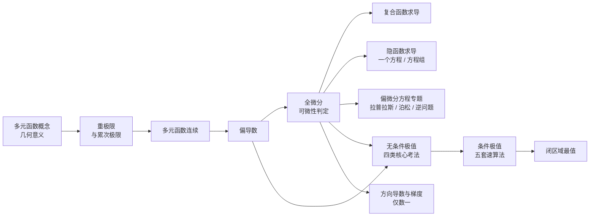
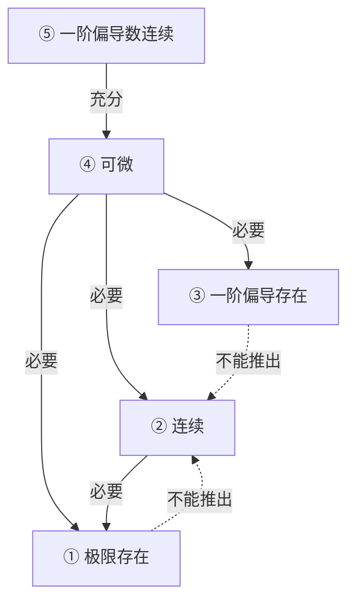

# 多元微分大观

> [!info] 整理说明
> - 本文件由原「多元微分知识点【A4版】」合并稿 扩充重排 而来，新增了四份「星河满分高等数学答疑」讲义的全部内容；索引与速查见 [[多元微分 MOC]]。
> - 四份来源各管一段，合起来才是完整链条：
>   - 《多元函数微分学概念（底稿）》（15 页手写稿）→ 主打 计算型概念：重极限与累次极限的区别、可微性判定的完整操作流程、可导/可微/连续/偏导连续的辨析、常考反例。落位在 第二、三、四、五章。
>   - 《27 星河-多元函数微分学大题满分讲义 1》（27 页、题 1–36）→ 主打 大题套路：Part I 复合/隐函数求导（题 1–8），Part II 偏微分方程五类型（题 9–36）。落位在 第六、七章。
>   - 《无条件极值的四类核心考法》（14 页、例 1–13）→ 主打 极值判别：隐函数极值速算、无穷驻点、$AC=B^2$ 失效五大技巧、极限形式两类题。落位在 第八章。
>   - 《求多元函数的条件最值》（24 页、例 1.1–4.1 及课后 1–11）→ 主打 条件极值五套速算法 ＋ 数一/数三应用。落位在 第九、十一、十四章。
> - 原「A4 版」的口语化口诀（"除框框""脱帽法""驻框框"等）已改写为标准数学表达，并保留口诀原文以备背诵。
> - 标 `[!info]` 补充说明 之处，是为闭合知识链条补上的标准考研内容，并非来源 PDF 逐字转录。
> - 例题的解析一律折叠：题干在外面，先自己做，再点"点开看解析"核对。
> - 本次重整：统一全部标题编号（消除了原稿 3 组重名标题与 38 个无编号标题）、新增全章目录与阅读约定、新增核心公式速查表、例题统一收进 `[!example]` 折叠框、新增第十一～十四章补齐考纲要求但原稿空缺的内容。原稿正文未删改，只动了标题、导航与勘误。
> - 来源 PDF 本身有若干笔误（已逐条验算），全部列在 [[#附录 B、勘误清单]]，正文中已在对应位置就地更正。

> [!info] 阅读约定
> **编号体系**
> - 一级板块 `一、二、三…`（`##`）；二三级 `X.Y`、`X.Y.Z`（`###`/`####`）；最深一级 `（1）（2）…`。
> - 交叉引用一律写编号，如「见 8.5.4」；正文里的内部链接可直接点击跳转。
>
> 只保留四种提示框（其余说明、技巧、易错点一律写成正文，不再套框）
>
> | 提示框 | 用途 |
> |---|---|
> | `[!important]` | 考前直接翻的必背公式与结论，汇总见 [[#目录]] 下的核心公式速查表 |
> | `[!example]` | 例题。题干在外、解析一律折叠（`[!success]-`），先自己做再点开 |
> | `[!question]` | 默写自测题（见 [[#15.3 公式默写自测（20 题）]]） |
> | `[!abstract]` | 分块速查清单（仅 15.3 裸背清单等少数几处） |
>
> **排版约定**
> - 加粗只用于两类：独立成行的小标题，以及结论／口诀／答案里的关键词。句子中间不作强调性加粗。
> - 正文里的「要点」「点评」「验算」等已是普通文字，不再加粗。
> - 全章目录见 Obsidian 右侧大纲面板；本文件只保留 [[#目录]] 处的章节速览表。


---

## 目录

**章节速览**

| 板块 | 一句话内容 | 小节数 |
|---|---|---:|
| [[#总览]] | 知识地图 ＋ 解题总顺序 | 2 |
| [[#一、考试大纲与复习定位]] | 考什么、要求到什么层次 | 3 |
| [[#二、多元函数的概念、极限与连续]] | 重极限 / 累次极限的区别 ＋ 连续 | 21 |
| [[#三、偏导数]] | 定义、几何意义、三种算法 | 10 |
| [[#四、全微分]] | 可微的定义与条件、形式不变性 | 6 |
| [[#五、可微性判定（计算型概念核心）]] | 三步走 ＋ 九命题 ＋ 二级结论 ＋ 反例 | 11 |
| [[#六、多元复合函数与隐函数求导]] | 三类题型的统一流程（题 1–8） | 18 |
| [[#七、偏微分方程专题]] | 五类型套路（题 9–36） | 20 |
| [[#八、无条件极值]] | 四类核心考法（例 1–13） | 21 |
| [[#九、条件极值与条件最值]] | 五套速算法 ＋ 数一/数三应用 | 40 |
| [[#十、常用不等式]] | 柯西与均值，什么时候用哪个 | 6 |
| [[#十一、闭区域最值]] | 内部驻点 ＋ 边界 ＋ 比较 | 2 |
| [[#十二、方向导数与梯度]]（补充） | 考纲要求但原稿空缺，已补齐 | 4 |
| [[#十三、空间曲线与曲面的切线与切平面]]（补充） | 考纲要求但原稿空缺，已补齐 | 2 |
| [[#十四、二元函数的二阶泰勒公式]]（补充） | 考纲要求但原稿空缺，已补齐 | 2 |
| [[#十五、速查、默写与易混]] | 考前十分钟：查表 ＋ 分清单词 ＋ 20 道默写 | 4 |
| [[#附录 A、来源材料]] | 五份材料的对应关系 | 0 |
| [[#附录 B、勘误清单]] | 来源 PDF 的笔误与更正 | 0 |
| [[#相关链接]] | 同库其他专题的入口 | 0 |


> [!important] 核心公式速查（考前直接翻这一张）
>
> | # | 公式 | 位置 |
> |---|---|---|
> | 1 | 二重极限存在 ⟹ 沿任意路径极限相同；累次极限有顺序，先算后面的 | [[#2.3.2 累次极限与二重极限的关系（三句话）]] |
> | 2 | $\displaystyle\lim_{\substack{x\to0\\y\to0}}\frac{x^\alpha y^\beta}{x^{2m}+y^{2n}}$：$\frac{\alpha}{2m}+\frac{\beta}{2n}>1$ 则 $=0$，否则不存在 | [[#2.2.6 推广判据：$\frac{x^\alpha y^\beta}{x^{2m}+y^{2n}}$ 型]] |
> | 3 | 可微判定：$\displaystyle\lim_{\rho\to0}\frac{\Delta z-\mathrm dz}{\rho}=0$ | [[#5.1 定义式判别法]] |
> | 4 | 五大性质：偏导连续 $\Rightarrow$ 可微 $\Rightarrow$ 连续、偏导存在（三条反向全不成立） | [[#4.4 五大性质的关系图]] |
> | 5 | 二级结论：$f_x(x_0,y_0)$ 存在 ＋ $f_y(x,y)$ 在 $(x_0,y_0)$ 连续 $\Rightarrow$ 可微 | [[#5.5 二级结论：$f_x$ 存在 ＋ $f_y$ 连续 ⟹ 可微]] |
> | 6 | 隐函数：$\dfrac{\partial z}{\partial x}=-\dfrac{F_x'}{F_z'}$，$\dfrac{\partial z}{\partial y}=-\dfrac{F_y'}{F_z'}$ | [[#6.3.1 三种解法（公式法 / 直接求导法 / 全微分法）]] |
> | 7 | 自变量个数 ＝ 有效字母个数 − 函数（方程）个数 | [[#6.4.1 一般流程：判断自变量 → 直接求导 → 解方程组]] |
> | 8 | 二维径向：$u=f(r),r=\sqrt{x^2+y^2}\Rightarrow\nabla^2u=f''(r)+\dfrac{1}{r}f'(r)$ | [[#7.2.1 径向化公式（背下来）]] |
> | 9 | 三维径向：$u=f(t),t=\sqrt{x^2+y^2+z^2}\Rightarrow\nabla^2u=f''(t)+\dfrac{2}{t}f'(t)$ | [[#7.2.1 径向化公式（背下来）]] |
> | 10 | 偏积分：积分常数是另一变量的任意函数 $\varphi(y)$ | [[#7.5.1 偏积分三大铁律]] |
> | 11 | 隐函数极值速算：$A=-\dfrac{F_{xx}''}{F_z'}$，$AC-B^2=\dfrac{\begin{vmatrix}F_{xx}''&F_{xy}''\\F_{xy}''&F_{yy}''\end{vmatrix}}{(F_z')^2}$ | [[#8.3.1 公式来源：两次求导，两条路]] |
> | 12 | 无条件极值二阶判别：$AC-B^2>0$ 且有极值（$A>0$ 极小 / $A<0$ 极大）；$<0$ 鞍点；$=0$ 失效 | [[#8.2 充分条件：AC − B² 判别法]] |
> | 13 | 拉格朗日驻点行列式：$\begin{vmatrix}f_x&\varphi_x\\f_y&\varphi_y\end{vmatrix}=0$（三元三选二，两约束用三阶行列式） | [[#9.2 速算法一：克拉默法则消乘子（一个约束、二元）]] |
> | 14 | 齐次速算：$\det A(\lambda)=0$ 解出 $\lambda$，直接代 $f=-\lambda p$ | [[#9.5 速算法四：齐次函数定理（不解变量，直接出答案）]] |
> | 15 | 柯西：$\left(\sum a_ib_i\right)^2\le\left(\sum a_i^2\right)\left(\sum b_i^2\right)$，等号当两组向量成比例 | [[#10.1 柯西不等式（离散形式）]] |
> | 16 | 最大方向导数 $=\|\nabla f\|=\sqrt{f_x^2+f_y^2}$（仅数一） | [[#12.3 最大方向导数与梯度的关系]] |
> | 17 | 闭区域最值三步：内部驻点 → 边界条件极值 → 比较取最值 | [[#11.1 三步法]] |


---

## 总览

### 0.1 全章知识地图

多元函数微分学的核心链条只有一条：

$$\textbf{极限} \longrightarrow \textbf{连续} \longrightarrow \textbf{偏导 / 全微分} \longrightarrow \textbf{复合 / 隐函数求导} \longrightarrow \textbf{极值 / 最值}$$



### 0.2 解题总顺序

遇到多元微分题，先别动笔，按下面五步扫描（对应本笔记的章节号）：

| 步 | 问自己 | 典型动作 | 章节 |
|---|---|---|---|
| 1 | 题目给的是极限还是函数值？ | 二重极限 / 累次极限先分清；可微性先看是不是 $\lim\frac{f-f(P_0)}{A(x,y)}=B$ 型 | [[#二、多元函数的概念、极限与连续]]、[[#五、可微性判定（计算型概念核心）]] |
| 2 | 要求偏导吗？自变量是谁？ | 数个数：自变量个数 ＝ 有效字母个数 − 函数个数 | [[#6.4.1 一般流程：判断自变量 → 直接求导 → 解方程组]] |
| 3 | 有中间变量吗？ | 画复合结构图；抽象函数用 $f_1'$ 按位置求导 | [[#6.1 链式法则]] |
| 4 | 出现 $\nabla^2$ / 偏导等式吗？ | 径向化 / 变量替换 / 偏积分（积分常数是函数） | [[#七、偏微分方程专题]] |
| 5 | 求极值最值吗？ | 无条件走 $AC-B^2$（失效转五大技巧）；有条件走拉格朗日（五套速算法） | [[#八、无条件极值]]、[[#九、条件极值与条件最值]] |


---

## 一、考试大纲与复习定位

**来源**

整理自《多元微分知识点【A4版】》PDF。本章列出考试内容与考试要求，作为复习的路线图。

### 1.1 考试内容

多元函数微分学的考试范围共 14 条：

1. 多元函数的概念
2. 二元函数的几何意义
3. 二元函数的极限与连续的概念
4. 有界闭区域上多元连续函数的性质
5. 多元函数的偏导数和全微分
6. 全微分存在的必要条件和充分条件
7. 多元复合函数、隐函数的求导法
8. 二阶偏导数
9. 方向导数和梯度
10. 空间曲线的切线和法平面
11. 曲面的切平面和法线
12. 二元函数的二阶泰勒公式
13. 多元函数的极值和条件极值
14. 多元函数的最大值、最小值及其简单应用

### 1.2 考试要求

1. 理解多元函数的概念，理解二元函数的几何意义。
2. 了解二元函数的极限与连续的概念，以及有界闭区域上连续函数的性质。
3. 理解多元函数偏导数和全微分的概念，会求全微分；
   了解全微分存在的必要条件和充分条件，了解全微分形式的不变性。
4. 理解方向导数与梯度的概念，并掌握其计算方法。
5. 掌握多元复合函数一阶、二阶偏导数的求法。
6. 了解隐函数存在定理，会求多元隐函数的偏导数。
7. 了解空间曲线的切线和法平面，及曲面的切平面和法线的概念，会求它们的方程。
8. 了解二元函数的二阶泰勒公式。
9. 理解多元函数极值和条件极值的概念，掌握多元函数极值存在的必要条件；
   了解二元函数极值存在的充分条件，会求二元函数的极值；
   会用拉格朗日乘数法求条件极值，会求简单多元函数的最大值和最小值，并会解决一些简单的应用问题。

### 1.3 要求层次速查

| 层次 | 内容 |
|------|------|
| 理解 | 多元函数概念、二元函数几何意义、偏导数与全微分、方向导数与梯度、极值与条件极值概念 |
| 掌握 | 全微分求法、方向导数与梯度计算、复合函数一/二阶偏导、极值必要条件、拉格朗日乘数法、最值应用 |
| 了解 | 极限与连续、有界闭区域性质、全微分充要条件、全微分形式不变性、隐函数存在定理、切线法平面、切平面法线、二阶泰勒公式、极值充分条件 |

**复习定位（按真题分值排）**

- 绝对主力：复合/隐函数求导（第 5、6 条）、偏微分方程大题（本库《大题满分讲义》题 9–36）、极值与条件极值（第 13、14 条）。
- 选择题高频：可微性判定、五大性质的关系、重极限与累次极限的区别（本库《概念（底稿）》第①、②类）。
- 数一专属：方向导数与梯度、空间曲线曲面的切/法、二阶泰勒公式。原稿空缺，已在 [[#十二、方向导数与梯度]]、[[#十三、空间曲线与曲面的切线与切平面]]、[[#十四、二元函数的二阶泰勒公式]] 补齐。
- 教材级补充笔记见 [[🌲4.多元函数微分学及其应用]]。


---

## 二、多元函数的概念、极限与连续

**来源**

2.1–2.4 整理自《多元微分知识点【A4版】》PDF；2.2.5–2.3、2.5.3 来自《多元函数微分学概念（底稿）》PDF，结合教材级定义补充。

### 2.1 多元函数的概念

#### 2.1.1 定义

设 $D$ 是 $\mathbb{R}^n$ 上的一个非空点集，如果按照某种对应法则 $f$，对于 $D$ 中每一点 $P(x_1, x_2, \dots, x_n)$，都有唯一确定的实数 $u$ 与之对应，则称 $f$ 是定义在 $D$ 上的 $n$ 元函数，记作

$$u = f(P) = f(x_1, x_2, \dots, x_n)$$

其中 $D$ 称为定义域，$\{u\}$ 称为值域。

- $n=2$ 时称为二元函数：$z = f(x, y)$
- $n=3$ 时称为三元函数：$u = f(x, y, z)$

#### 2.1.2 二元函数的几何意义

二元函数 $z = f(x, y)$ 在几何上表示空间中的一张曲面。

- 定义域 $D$ 是 $xOy$ 平面上的点集（曲面的投影）。
- 对每个 $(x_0, y_0) \in D$，曲面上有一点 $(x_0, y_0, f(x_0, y_0))$。
- 曲面与平面 $z = C$ 的交线投影到 $xOy$ 面得到等高线（等值线）。

> [!example] 典型曲面
> - $z = \sqrt{1 - x^2 - y^2}$：上半球面，定义域为圆盘 $x^2 + y^2 \le 1$。
> - $z = \sqrt{x^2 + y^2}$：圆锥面（这是证明"连续但不一定可微"的经典反例）。

### 2.2 二重极限（重极限）

#### 2.2.1 定义

设函数 $z = f(x, y)$ 在点 $P_0(x_0, y_0)$ 的某去心邻域内有定义，如果当 $P(x, y)$ 以任意方式趋近于 $P_0(x_0, y_0)$ 时，$f(x, y)$ 都无限趋近于常数 $A$，则称 $A$ 为 $f(x,y)$ 在 $P_0$ 处的二重极限（重极限），记作

$$\lim_{(x,y) \to (x_0, y_0)} f(x, y) = A$$

#### 2.2.2 与一元极限的本质区别

**路径有无穷多条**

一元函数只有左右两条路径；二元函数从平面上任意方向、任意曲线趋近，路径有无穷多种。极限存在必须沿所有路径趋近时极限值相同。

**《概念（底稿）》的整体框架：先把二元极限分两半**

计算二元函数的极限（口诀：盯住目标）分两类：

- 二重极限 $\displaystyle\lim_{\substack{x\to x_0\\y\to y_0}}f(x,y)$ —— 直接盯住目标 $O_1$；
- 累次极限 $\displaystyle\lim_{x\to x_0}\lim_{y\to y_0}f(x,y)$ 或 $\displaystyle\lim_{y\to y_0}\lim_{x\to x_0}f(x,y)$ —— 分两步，先"盯住目标 $O_2$"。

两者各自要判断"存在 / 不存在"，再谈"两者关系"（见 [[#2.3.2 累次极限与二重极限的关系（三句话）]]）。三者是三件独立的事，这正是《概念（底稿）》开篇要"引起重视"的原因。

#### 2.2.3 计算二重极限的四条路

求重极限本质上是一元函数极限的推广，一元极限的运算法则、夹逼准则、等价无穷小替换等均可使用（洛必达法则除外，因为二元没有单调导数方向）。

| 方法 | 适用信号 | 操作 |
|---|---|---|
| 整体换元法 | 分母是平方和、或能配方成平方和 | 令 $x = r\cos\theta$，$y = r\sin\theta$（或先换元成平方和再极坐标） |
| 放缩法（夹逼准则） | 分子能整体放大成一个趋于 0 的量 | 用 $\|\sin u\|\le\|u\|$、$\|\cos u\|\le1$、$\|xy\|\le\frac{x^2+y^2}{2}$ 等放缩 |
| 无穷小 × 有界量 | 出现 $\sin\frac1{x}$、$\cos\frac1{y}$ 这类振荡因子 | 振荡因子有界，配一个无穷小即得 0 |
| 实际上的无元极限 | 化简后与 $x,y$ 的取值路径无关 | 直接代入或化为一元极限 |

**直接代入**

若 $f(x,y)$ 在 $(x_0,y_0)$ 连续（多元初等函数在定义域内部都连续），则可直接代入得 $\lim f = f(x_0,y_0)$。

#### 2.2.4 证明二重极限不存在

**两大方法**

**方法一：取不同路径**
取不同路径趋近 $P_0$（直线 $y = kx$、抛物线 $y = x^2$、曲线等），若沿不同路径得到的极限值不同，或某条路径极限不存在，则重极限不存在。

**方法二：极坐标**
令 $x = r\cos\theta$，$y = r\sin\theta$，重极限存在 ⟺ 极限值与 $\theta$ 无关。若化简后极限依赖 $\theta$，则重极限不存在。

**极坐标技巧：**

- 适用于：分母是"平方和"（即 $x^2 + y^2$ 型）、分子是乘积的情形。
- 分母不是平方和：先换元转换为平方和。例如分母含 $x^4 + y^4$，可令 $u = x^2$，$v = y^2$。
- 分母出现奇数次（如分母为 $x$ 的一次方、三次方…）：重极限必不存在。因为取路径 $y = kx$ 时极限会依赖 $k$，或沿特定路径发散。

> [!example] 证明 $\displaystyle\lim_{(x,y) \to (0,0)} \dfrac{xy}{x^2 + y^2}$ 不存在
> 取路径 $y = kx$：
> $$\lim_{x \to 0} \frac{x \cdot kx}{x^2 + k^2 x^2} = \lim_{x \to 0} \frac{kx^2}{(1+k^2)x^2} = \frac{k}{1+k^2}$$
> 极限值依赖 $k$（$k=1$ 得 $\frac12$，$k=2$ 得 $\frac25$），沿不同直线趋近结果不同，故重极限不存在。

> [!example] 证明 $\displaystyle\lim_{(x,y) \to (0,0)} \dfrac{xy^2}{x^2 + y^4}$ 不存在
> 取路径 $x = y^2$：
> $$\lim_{y\to0}\frac{y^2\cdot y^2}{y^4+y^4}=\frac12$$
> 而取路径 $y = 0$（沿 $x$ 轴）时，$f(x,0)\equiv0\to0$。两者不同，故重极限不存在。

#### 2.2.5 特殊路径法：同阶路径与变阶路径

**《概念（底稿）》的核心手法：让分母变成想要的阶**

之所以敢"取路径"，是因为要看沿这条路分子分母谁高阶。取路径的目标只有一个——让分母成为指定的阶，于是分子分母一比就知道结果。

| 分母形态 | 取路径 | 分母变成 | 名称 |
|---|---|---|---|
| $x+y$ | $y=kx$ | $(1+k)x$ | 同阶路径（分母仍是 1 次） |
| $x+y$ | $y=-x+x^3$ | $x^3$ | 升阶路径（分母升到 3 次） |
| $x+y$ | $y=-x+\sqrt{x}$ | $\sqrt{x}$ | 降阶路径（分母降到 $\frac12$ 次） |
| $x^2+y$ | $y=x^2$ | $2x^2$ | 变为同阶（两项都是 2 次） |

两条口诀：

1. 同阶路径：分母是 $x+y$ 这类一次式时，令 $y=kx$ 即可；分母是 $x^2+y$ 这类"2 次 + 1 次"的混合式时，令 $y=x^2$ 把两项凑成同阶。
2. 变阶路径：分母想升阶就令 $y=-x+x^3$，想降阶就令 $y=-x+\sqrt{x}$。要几阶，就补几阶的小量。

#### 2.2.6 推广判据：$\frac{x^\alpha y^\beta}{x^{2m}+y^{2n}}$ 型

> [!important] 推广判据（《概念（底稿）》总结，可直接用）
> 设 $\alpha,\beta,m,n>0$，则
> $$\lim_{\substack{x\to0\\y\to0}}\frac{x^\alpha y^\beta}{x^{2m}+y^{2n}}=
> \begin{cases}
> 0, & \dfrac{\alpha}{2m}+\dfrac{\beta}{2n}>1,\\[8pt]
> \text{不存在}, & \dfrac{\alpha}{2m}+\dfrac{\beta}{2n}\le 1.
> \end{cases}$$
> 一次比较，直接出结论——这是"特殊路径法"的速算版，考场上比现场放缩快得多。

**推导（为什么是 $\frac{\alpha}{2m}+\frac{\beta}{2n}$ 与 $1$ 比）**

做换元 $u=x^{2m}$，$v=y^{2n}$，则 $x=u^{\frac{1}{2m}}$，$y=v^{\frac{1}{2n}}$，故
$$\frac{x^\alpha y^\beta}{x^{2m}+y^{2n}}=\frac{u^{\frac{\alpha}{2m}}v^{\frac{\beta}{2n}}}{u+v}.$$
记 $A=\frac{\alpha}{2m}$，$B=\frac{\beta}{2n}$，问题化为经典的 $\dfrac{u^Av^B}{u+v}$：
- 取 $v=ku$，则 $\dfrac{u^Av^B}{u+v}=\dfrac{k^B}{1+k}\,u^{A+B-1}$；
- 故 $A+B>1$ 时 $\to0$；$A+B<1$ 时 $\to\infty$；$A+B=1$ 时极限为 $\dfrac{k^B}{1+k}$，依赖 $k$。

后两种情形统一记作"不存在"。

两个等价的见证路径（都在原变量下）：
- 让分母两项同阶：$\boxed{y=kx^{m/n}}$（此时 $x^{2m}$ 与 $y^{2n}$ 同为 $2m$ 阶）；
- 让分子与分母首项同阶：$\boxed{y=kx^{\frac{2m-\alpha}{\beta}}}$（此时分子 $=k^\beta x^{2m}$，与 $x^{2m}$ 同阶）。

《概念（底稿）》写的是第二种路径，两种都对。

> [!example] 判据的两端各验一次
> - $\dfrac{xy}{x^2+y^2}$：$\alpha=\beta=1$，$m=n=1$，和为 $1\le1$ ⟹ 不存在 ✓（正是 2.2.4 的经典反例）。
> - $\dfrac{x^2y}{x^2+y^2}$：$\alpha=2$，$\beta=1$，和为 $\frac32>1$ ⟹ 极限 $=0$ ✓（用 $\|x^2y\|\le\frac{x^2+y^2}{2}\|x\|$ 夹逼也立刻得 0）。

#### 2.2.7 已知重极限求全微分：脱帽法

**核心思路：把极限式"翻译"成可微定义**

已知 $\lim\limits_{(x,y)\to(x_0,y_0)} \dfrac{f(x,y) - L}{g(x,y)} = 0$ 这类条件时，本质上是给了一个无穷小量关系。脱掉极限号，把它改写成
$$f(x,y) - L = \alpha\cdot g(x,y),\qquad \alpha\to0$$
再对照可微定义
$$\Delta z = A\Delta x + B\Delta y + o(\rho)$$
即可读出 $A = f_x$、$B = f_y$，从而写出全微分 $dz = A\,dx + B\,dy$。

**关键转化技巧：**

- 分母极限为 0，推分子极限为 0：若 $\lim \frac{\text{分子}}{\text{分母}} = 0$ 且分母 $\to 0$，则分子必 $\to 0$（分子是分母的高阶无穷小）。这个"分子也趋于 0"的结论常用来确认连续性或确定函数值。
- 凑可微定义：把极限式整理成 $\dfrac{\Delta z - A\Delta x - B\Delta y}{\sqrt{(\Delta x)^2 + (\Delta y)^2}} \to 0$ 的形式，即可判断可微并求出全微分。

### 2.3 累次极限

#### 2.3.1 定义与计算顺序

$$\lim_{x\to x_0}\lim_{y\to y_0} f(x,y)\qquad\text{或}\qquad \lim_{y\to y_0}\lim_{x\to x_0} f(x,y)$$

> [!important] 累次极限的操作流程（《概念（底稿）》）
> 对于 $\displaystyle\lim_{x\to x_0}\lim_{y\to y_0} f(x,y)$：
> 1. 先固定 $x$（视为常数），计算内层 $\displaystyle\lim_{y\to y_0} f(x,y)$。若不存在，则累次极限不存在；
> 2. 若存在（得到关于 $x$ 的函数），再计算外层 $\displaystyle\lim_{x\to x_0}\big[\lim_{y\to y_0}f(x,y)\big]$。若不存在，则累次不存在；若存在，则累次极限存在。

**一句话口诀**

**累次极限有顺序，先算后面的。**
与累次积分类似——后积先定限。写 $\lim_{x\to x_0}\lim_{y\to y_0}$ 时，$y$ 是"后面"的那个，先算。

#### 2.3.2 累次极限与二重极限的关系（三句话）

> [!important] 三句话（看图记）
> ① 二重极限存在 $\not\Rightarrow$ 累次极限存在；累次极限存在 $\not\Rightarrow$ 二重极限存在。（互不蕴含）
> ② 二重极限存在，且累次极限存在 $\Rightarrow$ 两者必相等。
> ③ 若两个累次极限都存在但不相等 $\Rightarrow$ 二重极限不存在。

**用法总结**

三句话的实战价值不对称：
- ②③ 是"证不存在"的利器：③ 只要算出两个累次极限不等，二重极限当场判死。
- ① 是"反直觉"提醒：别以为累次极限存在就万事大吉。
- 计算二重极限本身，仍要走 [[#2.2.3 计算二重极限的四条路]]。

#### 2.3.3 经典例题（张宇 18 讲）

> [!example] 例 2.1（张宇 13.7）　$f(x,y)=x\sin\dfrac1y+y\sin\dfrac1x$，$I_1=\lim\limits_{\substack{x\to0\\y\to0}}f$，$I_2=\lim\limits_{y\to0}\Big[\lim\limits_{x\to0}f\Big]$，则（　　）
> (A) $I_1,I_2$ 均存在　(B) $I_1$ 存在，$I_2$ 不存在　(C) $I_1$ 不存在，$I_2$ 存在　(D) 均不存在
>
> > [!success]- 点开看解析　**答案：(B)**
> > 先算 $I_1$（二重极限）：用"无穷小 × 有界量"。
> > $$\left|x\sin\frac1y+y\sin\frac1x\right|\le|x|+|y|\longrightarrow0$$
> > 由夹逼准则 $I_1=0$，存在。
> >
> > 再算 $I_2$（累次极限，先算里面的）：固定 $y$（$y\ne0$），求 $\lim\limits_{x\to0}f(x,y)$。
> > 此时 $x\sin\frac1y\to0$，但 $y\sin\frac1x$ 随 $x\to0$ 振荡，极限不存在，故内层极限不存在 ⟹ $I_2$ 不存在。
> >
> > 选 (B)。
> >
> > 点评：本题的教训是——$I_1$ 存在不能推出 $I_2$ 存在（关系 ①）。

> [!example] 例 2.2（张宇 13.8）　$f(x,y)=\dfrac{xy}{x^2+y^2}$，$I_1=\lim\limits_{\substack{x\to0\\y\to0}}f$，$I_2=\lim\limits_{y\to0}\Big[\lim\limits_{x\to0}f\Big]$，则（　　）
> (A) $I_1,I_2$ 均存在　(B) $I_1$ 存在，$I_2$ 不存在　(C) $I_1$ 不存在，$I_2$ 存在　(D) 均不存在
>
> > [!success]- 点开看解析　**答案：(C)**
> > 先算 $I_1$：取 $y=kx$，
> > $$\lim_{\substack{x\to0\\y=kx}}\frac{xy}{x^2+y^2}=\frac{k}{1+k^2}$$
> > 依赖 $k$，故 $I_1$ 不存在。
> >
> > 再算 $I_2$：固定 $y\ne0$，$\lim\limits_{x\to0}\dfrac{xy}{x^2+y^2}=\dfrac{0}{y^2}=0$，故 $I_2=0$，存在。
> >
> > 选 (C)。
> >
> > 点评：本题是关系 ① 的反面——累次极限存在也推不出二重极限存在。

> [!example] 例 2.3（张宇 13.9，⭐）　$f(x,y)=\dfrac{x^2-y^2}{x^2+y^2}$，$I_1=\lim\limits_{x\to0}\Big[\lim\limits_{y\to0}f\Big]$，$I_2=\lim\limits_{y\to0}\Big[\lim\limits_{x\to0}f\Big]$，$I_3=\lim\limits_{\substack{x\to0\\y\to0}}f$，则（　　）
> (A) $I_1,I_2$ 存在，$I_3$ 不存在　(B) $I_1,I_2,I_3$ 均不存在　(C) 三者均存在　(D) $I_1,I_2$ 不存在，$I_3$ 存在
>
> > [!success]- 点开看解析　**答案：(A)**
> > 当 $x\ne0$：$\lim\limits_{y\to0}\dfrac{x^2-y^2}{x^2+y^2}=\dfrac{x^2}{x^2}=1$，得 $I_1=1$；
> >
> > 当 $y\ne0$：$\lim\limits_{x\to0}\dfrac{x^2-y^2}{x^2+y^2}=\dfrac{-y^2}{y^2}=-1$，得 $I_2=-1$。
> >
> > 两个累次极限都存在但不相等，由关系 ③ 知 $I_3$ 不存在。选 (A)。
> >
> > 点评：这是"三句话"里 ③ 的标准演示，也是判二重极限不存在最快的一招。

### 2.4 累次极限的实战判断小结

| 要判断 | 用什么 |
|---|---|
| 二重极限存在 | 四条路（换元 / 放缩 / 无穷小×有界 / 化一元）＋ [[#2.2.6 推广判据：$\frac{x^\alpha y^\beta}{x^{2m}+y^{2n}}$ 型]] |
| 二重极限不存在 | 取不同路径 / 极坐标看 $\theta$ / 两个累次极限不等（关系 ③） |
| 累次极限存在与否 | 严格按 2.3.1 两步走，内层不存在则整体不存在 |
| 二重极限已知，求全微分 | 脱帽法（见 [[#2.2.7 已知重极限求全微分：脱帽法]]） |

### 2.5 多元函数的连续

#### 2.5.1 定义与三要素

设函数 $z = f(x, y)$ 在点 $P_0(x_0, y_0)$ 的某邻域内有定义，若

$$\lim_{(x,y) \to (x_0, y_0)} f(x, y) = f(x_0, y_0)$$

则称 $f(x, y)$ 在点 $P_0(x_0, y_0)$ 处连续。

**连续的三要素**

1. $f(x_0, y_0)$ 有定义；
2. 重极限 $\lim\limits_{(x,y) \to (x_0,y_0)} f(x,y)$ 存在；
3. 重极限值 ＝ 函数值。

连续 ⟺ 重极限 ＝ 函数值。若重极限不存在，或存在但不等于函数值，则不连续。

#### 2.5.2 有界闭区域上多元连续函数的性质

在有界闭区域 $D$ 上连续的多元函数具有以下重要性质：

| 性质 | 内容 |
|------|------|
| 有界性 | $f$ 在 $D$ 上有界（存在 $M>0$，$\|f(P)\| \le M$，$\forall P \in D$） |
| 最值定理 | $f$ 在 $D$ 上必有最大值与最小值 |
| 介值定理 | $f$ 在 $D$ 上取到介于最小值与最大值之间的任何值 |

**前提**

这些性质要求 $D$ 是有界闭区域，且函数在 $D$ 上连续。这也是闭区域最值问题的理论基础，见 [[#十一、闭区域最值]]。

#### 2.5.3 多元连续 $\not\Rightarrow$ 单变量连续（从未考过，务必重视）

**反直觉：多元连续推不出"沿每条线连续"**

$$\lim_{\substack{x\to x_0\\y\to y_0}}f(x,y)=f(x_0,y_0)\quad\not\Longrightarrow\quad
\begin{cases}\lim\limits_{x\to x_0}f(x,y_0)=f(x_0,y_0),\\[6pt]\lim\limits_{y\to y_0}f(x_0,y)=f(x_0,y_0).\end{cases}$$
即：多元连续 ≠ 沿水平线/竖直线连续。反过来"两个单变量都连续"也推不出多元连续。

why：多元极限是"沿任意路径"，比"沿两条坐标方向"强得多。$(x,y)\to(x_0,y_0)$ 时 $(x,y_0)\to(x_0,y_0)$ 是其中一条路径，但 $(x,y_0)$ 只允许 $y$ 恰等于 $y_0$；而 $f(x,y_0)$ 是"整条线上的极限"，它考察的是 $y\equiv y_0$ 这条固定直线，两者不是一回事。

《概念（底稿）》特别批注：这条从未考过，但要引起重视——它正是"多元 ≠ 一元简单叠加"的标志性结论。

---

## 三、偏导数

**来源**

整理自《多元微分知识点【A4版】》PDF；3.4 三种算法来自《多元函数微分学概念（底稿）》PDF，结合教材级定义补充。

### 3.1 定义

设函数 $z = f(x, y)$ 在点 $(x_0, y_0)$ 的某邻域内有定义，若极限

$$\lim_{\Delta x \to 0} \frac{f(x_0 + \Delta x, y_0) - f(x_0, y_0)}{\Delta x}$$

存在，则称此极限为 $f$ 在 $(x_0, y_0)$ 处对 $x$ 的偏导数，记作

$$f_x'(x_0, y_0) = \frac{\partial z}{\partial x}\Big|_{(x_0, y_0)}$$

类似地，对 $y$ 的偏导数为

$$f_y'(x_0, y_0) = \lim_{\Delta y \to 0} \frac{f(x_0, y_0 + \Delta y) - f(x_0, y_0)}{\Delta y}$$

**理解**

- 偏导数存在 ＝ 变化率存在 ＝ 上述比值极限存在。
- 求 $f_x'$ 时把 $y$ 当常数对 $x$ 求导；求 $f_y'$ 时同理。本质是"沿坐标轴方向的变化率"，是方向导数的特例。

> [!important] 原则：偏导数实际是一元极限
> 偏导数的定义式里只有一个变量在动，所以它就是一个一元极限。因此：
> - 一元极限的全部工具（洛必达、等价无穷小、夹逼…）都能用；
> - 一元函数"连续 ⇏ 可导"的现象也会重现——这就是"偏导存在 ⇏ 连续"的根源。
>
> 正因如此，定义式要记清楚：求证偏导存在/不存在，永远是回到比值极限。

### 3.2 几何意义

$f_x'(x_0, y_0)$ 是曲面 $z = f(x, y)$ 被平面 $y = y_0$ 所截曲线，在点 $P_0(x_0, y_0, f(x_0,y_0))$ 处的切线对 $x$ 轴的斜率（即沿 $x$ 轴方向/平行于 $xOz$ 面切一个面）。

$f_y'(x_0, y_0)$ 同理，是曲面被平面 $x = x_0$ 所截曲线在该点的切线对 $y$ 轴的斜率。

### 3.3 高阶偏导数与混合偏导相等定理

二阶偏导数共 4 个：

| 记号 | 意义 | 记号 | 意义 |
|------|------|------|------|
| $\dfrac{\partial^2 z}{\partial x^2}$ | $f_{xx}''$，对 $x$ 求两次 | $\dfrac{\partial^2 z}{\partial x\partial y}$ | $f_{xy}''$，先对 $x$ 后对 $y$ |
| $\dfrac{\partial^2 z}{\partial y^2}$ | $f_{yy}''$，对 $y$ 求两次 | $\dfrac{\partial^2 z}{\partial y\partial x}$ | $f_{yx}''$，先对 $y$ 后对 $x$ |

**记号约定**

$f$ 下角标第二个字母表示第二次对什么求导。即 $f_{xy}''$ 表示先对 $x$ 求导、再对 $y$ 求导（按自左向右读）。

#### 3.3.1 混合偏导数相等定理

> [!important] 二阶混合偏导数连续必相等
> 若二阶混合偏导数 $f_{xy}''$ 与 $f_{yx}''$ 在某区域 $D$ 内连续，则在 $D$ 内
> $$f_{xy}'' = f_{yx}''$$
> 初等函数在其定义区域上一定连续，故一般情况可放心交换求导次序。

应用：若偏导表达式中含有待定参数，可利用"混合偏导连续则相等"来解参数。

#### 3.3.2 偏导数与可微、连续的关系

$$
\begin{array}{c}
\text{偏导连续} \xrightarrow{\text{充分}} \text{可微} \xrightarrow{\text{必要}} \text{连续} \\
\text{可微} \xrightarrow{\text{必要}} \text{偏导存在} \\
\text{偏导存在} \not\Rightarrow \text{连续} \\
\text{偏导存在} \not\Rightarrow \text{可微}
\end{array}
$$

**反例**

- $f_x', f_y'$ 存在 且 连续 ⟹ 可微（充分条件）。
- $f_x', f_y'$ 存在 $\not\Rightarrow$ 可微（例：$z = \dfrac{xy}{\sqrt{x^2 + y^2}}$ 的修正形式在 $(0,0)$）。
- $f_x', f_y'$ 存在 $\not\Rightarrow$ 连续。
- 连续 $\not\Rightarrow$ 可微（$z = \sqrt{x^2 + y^2}$ 在 $(0,0)$）。

强度排序：偏导连续 > 可微 > 连续、偏导存在。

**直觉**

偏导存在只保证了沿 $x$、$y$ 两个坐标轴方向"光滑"，其他方向（如 $y = x$）可能存在尖刺或断崖；可微要求所有方向的增量都能用线性主部 + 高阶无穷小近似，即函数在该点局部光滑到可用切平面近似。

完整关系图见 [[#4.4 五大性质的关系图]]。

### 3.4 偏导数的三种算法（《概念（底稿）》）

**三条路，按题目长什么样选**

| 情形 | 用什么算法 |
|---|---|
| 简单型（不含 $\infty$ 的四则式子、纯偏导如 $f_{xx}''(x,1)$） | 先代后求 |
| 复杂型（含 $\infty$ 或 $\frac00$，如要算 $f_x'(0,0)$） | 脱帽法（回到定义） |
| 分段函数 | 双法：分段内部用"先代后求"，分界点用"脱帽法" |

#### 3.4.1 先代后求

要求"在某条线上的偏导函数"（如 $f_x'(x,0)$、$f_y'(0,y)$）时，先把另一个变量代成常数，再对目标变量求导。

**只有最后一次求导可以先带后求**

- 若先代入 $y = y_0$ 再对 $x$ 求偏导，得到的是 $f_x'(x, y_0)$。
- "先带后求"只适用于最后一次求导；如果在求导过程中途代入，会破坏复合结构。
- 例：要算 $z_{xy}''(x_0, y_0)$，不能先代入 $y = y_0$ 再对 $y$ 求导（此时 $y$ 已是常数）。

#### 3.4.2 脱帽法（回到定义）

要求"在某一点处的偏导数值"（如 $f_x'(0,0)$）时，必须回到定义式：

$$f_x'(x_0,y_0)=\lim_{x\to x_0}\frac{f(x,y_0)-f(x_0,y_0)}{x-x_0},\qquad
f_y'(x_0,y_0)=\lim_{y\to y_0}\frac{f(x_0,y)-f(x_0,y_0)}{y-y_0}$$

**一个常见错误**

直接对分段函数在分界点处"求导"——例如对 $f(x,y)$ 在 $(0,0)$ 直接对表达式求偏导再代 $(0,0)$。这是错的，因为 $(0,0)$ 根本不在那个表达式的定义域内部。分界点一律回定义。

#### 3.4.3 双法（分段函数的标准写法）

分段函数 $f(x,y)=\begin{cases}g(x,y),&(x,y)\ne(0,0)\\0,&(x,y)=(0,0)\end{cases}$ 求偏导，写成分段形式：

$$\frac{\partial f}{\partial x}(x,y)=
\begin{cases}
\dfrac{\partial g}{\partial x}(x,y), & (x,y)\ne(0,0),\\[6pt]
f_x'(0,0)\ (\text{用定义算}), & (x,y)=(0,0).
\end{cases}$$

> [!example] 分段函数求偏导的标准演示（例 3.1，张宇 13.11）
> $$f(x,y)=\begin{cases}x^2,&y=0,\\y^2,&x=0,\\1,&\text{其他}.\end{cases}$$
> 求 $\dfrac{\partial f}{\partial x}$、$\dfrac{\partial f}{\partial y}$。
>
> > [!success]- 点开看解析
> > **逐段处理，分界点回定义。**
> >
> > （1）$y=0$ 这条线（$x\ne0$）：$f(x,0)=x^2$，直接求导得 $\dfrac{\partial f}{\partial x}=2x$。
> >
> > （2）$x=0$ 这条线（$y\ne0$）：此时 $f(0,y)=y^2$，与 $x$ 无关。回到定义，注意 $\Delta x\ne0$ 时点 $(\Delta x,y)$ 落在"其他"分支，$f(\Delta x,y)\equiv1$：
> > $$\frac{f(\Delta x,y)-f(0,y)}{\Delta x}=\frac{1-y^2}{\Delta x}$$
> > 该极限存在 ⟺ $1-y^2=0$ ⟺ $y=\pm1$（此时值恒为 $0$）。故 $x=0$ 上除 $y=0,\pm1$ 外，$\dfrac{\partial f}{\partial x}$ 都不存在。
> >
> > （3）原点 $(0,0)$：取 $f(0,0)=0$（由 $y=0$ 分支），则
> > $$f_x'(0,0)=\lim_{\Delta x\to0}\frac{f(\Delta x,0)-f(0,0)}{\Delta x}=\lim_{\Delta x\to0}\frac{(\Delta x)^2}{\Delta x}=0,$$
> > 存在。
> >
> > （4）其余点（$x\ne0,y\ne0$）：$f\equiv1$，故 $\dfrac{\partial f}{\partial x}=0$。
> >
> > 综上
> > $$\frac{\partial f}{\partial x}(x,y)=
> > \begin{cases}2x,&y=0,\\[2pt]\text{不存在},&x=0,\ y\ne0,\pm1,\\[2pt]0,&\text{其他}.\end{cases}$$
> > 把 $x$、$y$ 互换即得 $\dfrac{\partial f}{\partial y}$。
> >
> > **结论**：$f_x'(0,0)$ 本身存在，但 $(0,0)$ 的任意小邻域内都有使 $\dfrac{\partial f}{\partial x}$ 无定义的点（$x=0$ 线上除三个点外处处无定义），故 $\dfrac{\partial f}{\partial x}$ 在 $(0,0)$ 不连续；$\dfrac{\partial f}{\partial y}$ 同理。
> >
> > 又沿 $y=0$ 有 $f\to0$，沿 $y=x$ 有 $f\equiv1\to1$，故 $f$ 在 $(0,0)$ 不连续，从而不可微。
> >
> > 若改成选择题（张宇 13.11 原题），选项"两个偏导数均不连续，且函数不可微"即 选 (D)。
> >
> > 考点：这是"偏导存在 ⇏ 连续"的活标本——两个偏导在 $(0,0)$ 都存在，函数照样不连续、不可微。

---

## 四、全微分

**来源**

整理自《多元微分知识点【A4版】》PDF；4.4 五大性质关系图来自《多元函数微分学概念（底稿）》PDF，结合教材级定义补充。

### 4.1 定义

设函数 $z = f(x, y)$ 在点 $(x_0, y_0)$ 的某邻域内有定义，给自变量增量 $\Delta x$、$\Delta y$，若函数全增量

$$\Delta z = f(x_0 + \Delta x, y_0 + \Delta y) - f(x_0, y_0)$$

可表示为

$$\Delta z = A\Delta x + B\Delta y + o(\rho), \qquad \rho = \sqrt{(\Delta x)^2 + (\Delta y)^2}$$

其中 $A$、$B$ 与 $\Delta x$、$\Delta y$ 无关，仅依赖 $(x_0, y_0)$，则称 $f$ 在 $(x_0, y_0)$ 处可微，称 $A\Delta x + B\Delta y$ 为 $f$ 在 $(x_0, y_0)$ 处的全微分，记作

$$dz = A\Delta x + B\Delta y$$

若 $z = f(x, y)$ 在区域 $D$ 内每点可微，则 $dz = \frac{\partial z}{\partial x}dx + \frac{\partial z}{\partial y}dy$，即全微分由偏导数唯一确定。

### 4.2 全微分存在的条件

#### 4.2.1 必要条件

> [!important] 可微 ⟹ 偏导数存在
> 若 $f$ 在 $(x_0, y_0)$ 处可微，则 $f$ 在该点的偏导数 $f_x'(x_0, y_0)$、$f_y'(x_0, y_0)$ 必定存在，且
> $$A = f_x'(x_0, y_0), \qquad B = f_y'(x_0, y_0)$$
> 从而 $dz = f_x'(x_0, y_0)\,dx + f_y'(x_0, y_0)\,dy$。

> [!important] 可微 ⟹ 连续
> 若 $f$ 在 $(x_0, y_0)$ 处可微，则 $f$ 在该点连续。

#### 4.2.2 充分条件

> [!important] 偏导数连续 ⟹ 可微
> 若 $f$ 的偏导数 $f_x'(x, y)$ 与 $f_y'(x, y)$ 在 $(x_0, y_0)$ 处连续，则 $f$ 在该点可微。

**更弱的充分条件（《概念（底稿）》的"二级结论"）**

其实不需要两个偏导都连续：只要
$$f_x'(x_0,y_0)\ \text{存在（只需一点）},\qquad f_y'(x,y)\ \text{在}\ (x_0,y_0)\ \text{连续}$$
就有 $f$ 在 $(x_0,y_0)$ 可微。证明见 [[#5.5 二级结论：$f_x$ 存在 ＋ $f_y$ 连续 ⟹ 可微]]。

### 4.3 全微分形式的不变性

设 $z = f(u, v)$ 可微，无论 $u$、$v$ 是自变量还是中间变量（即 $u = u(x,y)$，$v = v(x,y)$），一阶全微分的形式不变：

$$dz = \frac{\partial z}{\partial u}du + \frac{\partial z}{\partial v}dv$$

这个性质把复合函数的求导与全微分联系了起来（参见 [[#六、多元复合函数与隐函数求导]]）。

### 4.4 五大性质的关系图

> [!important] 五大性质（《概念（底稿）》的标准记号）
> 记 $f(x,y)$ 在点 $P(x_0,y_0)$ 处的性态分别为：
> - ① 极限存在；
> - ② 连续（多元连续）；
> - ②$'$ 关于 $x$、$y$ 两个变量均连续（即 $f(x,y_0)$、$f(x_0,y)$ 各自连续）；
> - ③ 一阶偏导数存在；
> - ④ 可微；
> - ⑤ 一阶偏导数连续。



| 关系 | 是否成立 | 说明 |
|------|:--------:|------|
| 偏导连续 ⟹ 可微 | ✅ | 充分条件（⑤⟹④） |
| 可微 ⟹ 连续 | ✅ | 必要条件（④⟹②） |
| 可微 ⟹ 偏导存在 | ✅ | 必要条件（④⟹③） |
| 可微 ⟹ 极限存在 | ✅ | 必要条件（④⟹①） |
| 连续 ⟹ 可微 | ❌ | $z=\sqrt{x^2+y^2}$ 在 $(0,0)$ 连续但不可微 |
| 偏导存在 ⟹ 可微 | ❌ | 仅保证坐标轴方向光滑 |
| 偏导存在 ⟹ 连续 | ❌ | 偏导存在推不出连续 |
| 多元连续 ⟹ 单变量连续 | ❌ | 见 [[#2.5.3 多元连续 $\not\Rightarrow$ 单变量连续（从未考过，务必重视）]] |

**速记**

- 偏导连续 充分（最强）
- 可微 ⟹ 连续 且 偏导存在（两个必要）
- 若给一个全微分的式子，且偏导数 $\frac{\partial z}{\partial x}$、$\frac{\partial z}{\partial y}$ 是多元初等函数，则偏导数一定连续；若偏导含参数，可用"混合偏导连续必相等"来解参数。

直观理解：可微 ⟹ 函数在 $(x_0,y_0)$ 局部光滑，光滑到可用一个切平面去近似它。


---

## 五、可微性判定（计算型概念核心）

**来源**

本章几乎全部来自《多元函数微分学概念（底稿）》PDF 的第②类（可微、可偏导性质判别——计算型概念），是所有计算型概念题的主战场。原稿用大量手写推导，这里已整理为可复用的流程。

### 5.1 定义式判别法

> [!important] 定义式判别法（可微的充要判别）
> $f(x,y)$ 在 $(x_0, y_0)$ 处可微 ⟺ 下列极限存在且为 0：

**写法一（用增量 $\Delta x, \Delta y$）：**

$$\lim_{\substack{\Delta x \to 0 \\ \Delta y \to 0}} \frac{f(x_0+\Delta x,\, y_0+\Delta y) - f(x_0, y_0) - \left[f_x'(x_0,y_0)\Delta x + f_y'(x_0,y_0)\Delta y\right]}{\sqrt{(\Delta x)^2 + (\Delta y)^2}} = 0$$

**写法二（用 $x \to x_0,\ y \to y_0$）：**

$$\lim_{\substack{x \to x_0 \\ y \to y_0}} \frac{f(x,y) - f(x_0, y_0) - \left[f_x'(x_0,y_0)(x-x_0) + f_y'(x_0,y_0)(y-y_0)\right]}{\sqrt{(x-x_0)^2 + (y-y_0)^2}} = 0$$

**两种写法等价**

写法二是写法一中令 $\Delta x = x - x_0$、$\Delta y = y - y_0$ 得到的，做题时选方便的一种即可。
分子整体即"全增量 − 全微分线性主部"，分母是"到 $(x_0,y_0)$ 的距离 $\rho$"。

### 5.2 具体函数的操作流程（《概念（底稿）》原流程）

> [!important] 可微判定三步（具体函数版）
> 1. 写 $\Delta z$：$\Delta z=f(x_0+\Delta x,y_0+\Delta y)-f(x_0,y_0)$（或直接把 $f$ 写成 $f(P_0)+A\Delta x+B\Delta y+o(\rho)$ 的形式去凑）；
> 2. 写 $\mathrm dz$：先求 $f_x'(x_0,y_0)$、$f_y'(x_0,y_0)$（用定义算），得 $\mathrm dz=f_x'\Delta x+f_y'\Delta y$；
> 3. 算极限：$\displaystyle\lim_{\rho\to0}\frac{\Delta z-\mathrm dz}{\rho}\stackrel{?}{=}0$。
>    **为 0 ⟹ 可微；否则（不为 0 或不存在）⟹ 不可微。**

**严谨性提示**

判断可微的极限式里不要直接写 $\mathrm dz$，因为写了 $\mathrm dz$ 就等于默认全微分存在——这是循环论证。
上面的式子中，线性部分用偏导表达式写出即可。

### 5.3 抽象形式：三段式（观察可微 → 脱帽法 → 判高阶无穷小）

考卷上大量出现的是抽象形式：

$$\lim_{\substack{(x,y)\to(0,0)}}\frac{f(x,y)-f(0,0)}{A(x,y)}=B,
\qquad\text{且}\qquad f_x(0,0)=f_y(0,0)=0$$

其中 $A(x,y)$ 是某个已知的量（如 $x^2+y^2$、$|x|+|y|$、$\sqrt{x^2+y^2}$）。

#### 5.3.1 第一步：观察可微

> [!important] 目标形式：$\lim\dfrac{f(x,y)-f(0,0)}{\rho}=0$
> 由于 $f_x(0,0)=f_y(0,0)=0$，可微的定义式退化成
> $$\lim_{(x,y)\to(0,0)}\frac{f(x,y)-f(0,0)}{\sqrt{x^2+y^2}}=0.$$
> 所以一切判断都归结为一个问题：$\big(f(x,y)-f(0,0)\big)$ 是不是 $\rho$ 的高阶无穷小？

#### 5.3.2 第二步：脱帽法

> [!important] 脱帽法：把极限式改写成无穷小关系
> 由 $\lim\dfrac{f(x,y)-f(0,0)}{A(x,y)}=B$，脱去极限号：
> $$f(x,y)-f(0,0)=(B+\alpha)A(x,y),\qquad \alpha\to0.$$
> 这一步是整个方法的核心——极限号只在判断最后一步才需要，中间全部当等式算。

**顺带确定 $f(0,0)$**

若分母 $A(x,y)\to0$，则由"分母趋 0、比值有极限"推得分子也趋 0，即 $f(x,y)\to f(0,0)$。
若题目又已知 $f$ 连续，两者合起来就确定了 $f(0,0)$ 的值（常见结论：$f(0,0)=0$）。

#### 5.3.3 第三步：判 $(B+\alpha)A(x,y)$ 是否为 $\rho$ 的高阶无穷小

$$f(x,y)-f(0,0)=(B+\alpha)\,A(x,y)\ \xrightarrow{?}\ o(\rho)\iff \lim_{\rho\to0}\frac{(B+\alpha)\,A(x,y)}{\rho}=0$$

**一句话判据**

**只要 $\dfrac{A(x,y)}{\rho}\to0$，就一定可微（不论 $B$ 是什么）；只要 $\dfrac{A(x,y)}{\rho}$ 不趋于 0，就要小心。**

| $A(x,y)$ | $A/\rho$ 的行为 | 结论 |
|---|---|---|
| $x^2+y^2$ | $\rho\to0$ | 必可微 |
| $\sqrt{x^2+y^2}=\rho$ | $\equiv1$ | $B=0$ 时可微，$B\ne0$ 时不可微 |
| $\lvert x\rvert+\lvert y\rvert$ | 介于 $1$ 与 $\sqrt2$ 之间 | $B=0$ 时可微，$B\ne0$ 时不可微 |

> [!example] 例 5.0（《概念（底稿）》④ 两种算法的演示）　已知 $\displaystyle\lim_{(x,y)\to(0,0)}\frac{f(x,y)}{x^2+y^2}=A$（$f$ 在 $(0,0)$ 连续），判断可微性
>
> > [!success]- 点开看解析
> > **法一（直接算定义式）**
> > 脱帽得 $f(x,y)=(A+\alpha)(x^2+y^2)$，$\alpha\to0$。
> > 先定 $f(0,0)$：令 $(x,y)\to(0,0)$，右边 $\to0$，故 $f(0,0)=0$。
> > 再定偏导：$f(x,0)=(A+\alpha)x^2$，故
> > $$f_x(0,0)=\lim_{x\to0}\frac{f(x,0)-f(0,0)}{x}=\lim_{x\to0}(A+\alpha)x=0,$$
> > 同理 $f_y(0,0)=0$。于是可微定义式成为
> > $$\lim_{(x,y)\to(0,0)}\frac{(A+\alpha)(x^2+y^2)}{\sqrt{x^2+y^2}}=\lim\big[(A+\alpha)\rho\big]=0.$$
> > 可微 ✓
> >
> > **法二（快速法）**
> > 由上面的计算已经知道 $\big(f(x,y)-f(0,0)\big)=O(\rho^2)=o(\rho)$，直接判可微。
> >
> > 要点：$A(x,y)=x^2+y^2$ 是"降维打击"——分母比 $\rho$ 高一阶，怎么都是 $o(\rho)$。

### 5.4 九命题辨析（例 5.1）

> [!example] 例 5.1（《概念（底稿）》例 5）　设二元函数 $f(x,y)$ 在点 $(0,0)$ 处连续，下列命题正确的有（　　）个
>
> ① 若 $\displaystyle\lim_{x\to0}\frac{f(x,0)-f(0,0)}{x}=0$，$\displaystyle\lim_{y\to0}\frac{f(0,y)-f(0,0)}{y}=0$，则 $f(x,y)$ 在 $(0,0)$ 处可微。
> ② 若 $\displaystyle\lim_{x\to0}f_x(x,0)=f_x(0,0)$，$\displaystyle\lim_{y\to0}f_y(0,y)=f_y(0,0)$，则 $f(x,y)$ 在 $(0,0)$ 处可微。
> ③ 若 $\displaystyle\lim_{(x,y)\to(0,0)}\frac{f(x,y)}{\sqrt{x^2+y^2}}=0$，则 $f(x,y)$ 在 $(0,0)$ 处可微。
> ④ 若 $\displaystyle\lim_{(x,y)\to(0,0)}\frac{f(x,y)}{x^2+y^2}$ 存在，则 $f(x,y)$ 在 $(0,0)$ 处可微。
> ⑤ 若 $\displaystyle\lim_{(x,y)\to(0,0)}\frac{f(x,y)}{|x|+|y|}$ 存在，则 $f(x,y)$ 在 $(0,0)$ 处可微。
> ⑥ 若 $f(x,y)$ 在 $(0,0)$ 处可微，则 $\displaystyle\lim_{(x,y)\to(0,0)}\frac{f(x,y)}{|x|+|y|}$ 存在。
> ⑦ 若 $f(x,y)$ 在 $(0,0)$ 处可微，则 $\displaystyle\lim_{(x,y)\to(0,0)}\frac{f(x,y)}{x^2+y^2}$ 存在。
> ⑧ 设 $\displaystyle\lim_{(x,y)\to(0,0)}\frac{f(x,y)-f(0,0)+2x-y}{\sqrt{x^2+y^2}}=1$，则 $f(x,y)$ 在 $(0,0)$ 处可微。
> ⑨ 设 $\displaystyle\lim_{(x,y)\to(0,0)}\frac{f(x,y)-f(0,0)+2x-y}{\sqrt{x^2+y^2}}=0$，则 $f(x,y)$ 在 $(0,0)$ 处可微。
>
> > [!success]- 点开看解析　**答案：3 个（③④⑨）**
> >
> > ① ✗　这两个极限只说明"沿 $x$ 轴、沿 $y$ 轴的两个方向导数存在且为 0"，即只保证两条坐标方向。反例：$f=\sqrt{|xy|}$（修正 $f(0,0)=0$），沿两轴偏导均为 0，但不可微。
> >
> > ② ✗　"偏导沿坐标轴连续"是线上的信息（见 [[#2.5.3 多元连续 $\not\Rightarrow$ 单变量连续（从未考过，务必重视）]] 的同类陷阱），推不出邻域内的连续，更推不出可微。注意 $f_x$ 连续需在二维邻域内成立，见 [[#5.5 二级结论：$f_x$ 存在 ＋ $f_y$ 连续 ⟹ 可微]]。
> >
> > ③ ✓　由已知 $f$ 连续且有 $\frac{f}{\rho}\to0$，得 $f(0,0)=0$，于是 $f=f(0,0)+o(\rho)$，线性主部为 0，可微（且 $f_x=f_y=0$）。
> > > [!warning] 反向不成立
> > > 可微推不出 $\frac{f}{\rho}\to0$：取 $f(x,y)=x$，可微，但 $\frac{x}{\sqrt{x^2+y^2}}$ 不存在。
> >
> > ④ ✓　见 [[#5.3.3 第三步：判 $(B+\alpha)A(x,y)$ 是否为 $\rho$ 的高阶无穷小]] 的例 5.0，$A(x,y)=x^2+y^2$ 时 $\frac{A}{\rho}=\rho\to0$，可微。
> >
> > ⑤ ✗　取 $f(x,y)=|x|+|y|$，则 $\frac{f}{|x|+|y|}\equiv1$ 极限存在，但 $f$ 在 $(0,0)$ 不可微（$f_x(0,0)=\lim\frac{|x|}{x}$ 不存在）。
> > 由脱帽法 $f=(A+\alpha)(|x|+|y|)$，$f_x(0,0)=\lim A\frac{|x|}{x}$ 左右不等、不存在，故不可微。
> >
> > ⑥ ✗　反例仍取 $f(x,y)=x$：可微，但 $\frac{x}{|x|+|y|}$ 沿不同路径不同，极限不存在。
> >
> > ⑦ ✗　反例同 $f(x,y)=x$：可微，但 $\frac{x}{x^2+y^2}$ 沿 $y=0$ 趋于 $\infty$，极限不存在。
> >
> > ⑧ ✗　脱帽得 $f(x,y)-f(0,0)=-2x+y+(1+\alpha)\rho$。要可微，余项必须是 $o(\rho)$，而这里是 $\sim\rho$，不可微。
> > 直接验证：$f(x,0)-f(0,0)=-2x+(1+\alpha)|x|$，于是
> > $$f_x(0,0)=\lim_{x\to0}\frac{-2x+(1+\alpha)|x|}{x}=\begin{cases}-3,&x\to0^-\\-1,&x\to0^+\end{cases}$$
> > 偏导本身就不存在，更谈不上可微。
> > 反向构造函数也可：$f=\sqrt{x^2+y^2}-2x+y+f(0,0)$ 就满足条件 ⑧ 而不可微。
> >
> > ⑨ ✓　脱帽得 $f(x,y)-f(0,0)=-2x+y+\alpha\rho$（$\alpha\to0$），正是可微定义（$f_x(0,0)=-2$，$f_y(0,0)=1$，余项 $o(\rho)$）。
> > **利用可微的必要条件对比系数即可判定。**
> >
> > 归纳：
> > - 分母是 $\rho$ 或比 $\rho$ 高阶 的量，且比值 $\to0$ ⟹ 可微；
> > - 分子里出现"不是 $o(\rho)$ 的线性余项" ⟹ 不可微；
> > - "可微"推不出"某极限存在"——凡是把结论反过来问的（⑥⑦），基本都错。

### 5.5 二级结论：$f_x$ 存在 ＋ $f_y$ 连续 ⟹ 可微

> [!important] 二级结论（比"偏导连续 ⟹ 可微"更弱，更好用）
> 若 $f_x'(x_0,y_0)$ 存在（只需一点），且 $f_y'(x,y)$ 在 $(x_0,y_0)$ 的某邻域内存在、并在 $(x_0,y_0)$ 连续，则
> $$f(x,y)\ \text{在}\ (x_0,y_0)\ \textbf{可微}.$$
> 换言之：两个偏导不必都连续，只要一个连续、另一个单点存在即可。

**证明（拉格朗日中值定理 ＋ 脱帽法，值得背下来）**

记 $A=f_x'(x_0,y_0)$，$B=f_y'(x_0,y_0)$（由 $f_y$ 连续保证其存在）。把增量拆成两截：
$$f(x,y)-f(x_0,y_0)=\underbrace{\big[f(x,y)-f(x,y_0)\big]}_{\text{关于 }y\text{ 的增量}}+\underbrace{\big[f(x,y_0)-f(x_0,y_0)\big]}_{\text{关于 }x\text{ 的增量}}$$

第一截：固定 $x$，把 $f(x,\cdot)$ 看成 $y$ 的一元函数，在 $y_0$ 与 $y$ 之间用拉格朗日中值定理：
$$f(x,y)-f(x,y_0)=f_y\big(x,\ y_0+\theta(y-y_0)\big)\,(y-y_0),\qquad \theta\in(0,1).$$
由 $f_y$ 在 $(x_0,y_0)$ 连续，且 $\big(x,\ y_0+\theta(y-y_0)\big)\to(x_0,y_0)$，脱帽得
$$f_y\big(x,\ y_0+\theta(y-y_0)\big)=B+\alpha_2,\qquad \alpha_2\to0,$$
即第一截 $=(B+\alpha_2)(y-y_0)$。

第二截：由偏导定义脱帽，$\dfrac{f(x,y_0)-f(x_0,y_0)}{x-x_0}=A+\alpha_1$（$\alpha_1\to0$），即第二截 $=(A+\alpha_1)(x-x_0)$。

合并：
$$f(x,y)-f(x_0,y_0)=A(x-x_0)+B(y-y_0)+\big[\alpha_1(x-x_0)+\alpha_2(y-y_0)\big],$$
而
$$0\le\frac{\big|\alpha_1(x-x_0)+\alpha_2(y-y_0)\big|}{\rho}\le|\alpha_1|\cdot\frac{|x-x_0|}{\rho}+|\alpha_2|\cdot\frac{|y-y_0|}{\rho}\le|\alpha_1|+|\alpha_2|\longrightarrow0.$$
故余项是 $o(\rho)$，$f$ 可微，且 $A=f_x(x_0,y_0)$，$B=f_y(x_0,y_0)$。$\blacksquare$

为什么"强行建立联系"很关键：$f(x,y)-f(x_0,y_0)$ 必须先拆出 $f(x,y_0)$，才能让第一截变成"关于 $y$ 的一元差"，从而用得上中值定理；第二截才回到 $x$ 的偏导定义。拆点不是 $x_0$ 也不是 $y_0$，而是 $(x, y_0)$——这一步是整道题的题眼。

**考场用法**

遇到"证明某抽象函数可微"或"判断某结论对不对"，优先看有没有一个偏导连续。有，就套这个二级结论，比硬算定义式快得多。

### 5.6 经典反例四则（结论要记住）

**四个必须背下来的反例**

（1）$f(x,y)=|x|+|y|$ 在 $(0,0)$：连续但偏导不存在（从而不可微）。
　→ 说明"连续 ⇏ 偏导存在"。

**（2）$f(x,y)=\begin{cases}\dfrac{xy}{x^2+y^2},&(x,y)\ne(0,0)\\[6pt]0,&(x,y)=(0,0)\end{cases}$**
在 $(0,0)$：偏导存在（且均为 0），但不连续。
　→ 说明"偏导存在 ⇏ 连续"。

**（3）$f(x,y)=\begin{cases}\dfrac{xy}{\sqrt{x^2+y^2}},&(x,y)\ne(0,0)\\[6pt]0,&(x,y)=(0,0)\end{cases}$**
在 $(0,0)$：连续，偏导存在，但不可微。
　→ 说明"连续 ＋ 偏导存在 ⇏ 可微"。

**（4）$f(x,y)=\begin{cases}(x^2+y^2)\sin\dfrac{1}{x^2+y^2},&(x,y)\ne(0,0)\\[6pt]0,&(x,y)=(0,0)\end{cases}$**
在 $(0,0)$：可微，但偏导不连续。
　→ 说明"可微 ⇏ 偏导连续"，即 [[#4.2.2 充分条件]] 的逆命题不成立。

**逐个核对（三行验完）**

- （2）：$f(x,0)\equiv0\Rightarrow f_x(0,0)=0$；同理 $f_y(0,0)=0$。但沿 $y=x$ 有 $f\equiv\frac12\ne0$，不连续 ✓
- （3）：$|f|\le\frac{|xy|}{\rho}\le\frac{\rho}{2}\to0$，连续；$f(x,0)\equiv0\Rightarrow f_x(0,0)=f_y(0,0)=0$。但沿 $y=x$：$\dfrac{f}{\rho}=\dfrac{x^2}{\sqrt2x^2}=\dfrac{1}{\sqrt2}\ne0$，不可微 ✓
- （4）：$|f|\le\rho^2$ 故 $f=o(\rho)$，可微；而
  $$f_x=\frac{2x\big[(x^2+y^2)\sin\frac{1}{x^2+y^2}-\cos\frac{1}{x^2+y^2}\big]}{x^2+y^2}$$
  沿 $y=0$ 取 $x=10^{-3}$ 时 $f_x\approx-1874$，无界，不连续 ✓

### 5.7 具体函数判定（例 5.2）

> [!example] 例 5.2（《概念（底稿）》例 2）　判定下列函数 $z=f(x,y)$ 在点 $(0,0)$ 是否可微
> (1) $f(x,y)=|xy|$；　(2) $f(x,y)=\sqrt{|xy|}$；
> (3) $f(x,y)=\begin{cases}|xy|\ln(x^2+y^2),&(x,y)\ne(0,0)\\0,&(x,y)=(0,0)\end{cases}$；
> (4) $f(x,y)=\begin{cases}(x^2+y^2)\ln(x^2+y^2),&(x,y)\ne(0,0)\\0,&(x,y)=(0,0)\end{cases}$
>
> > [!success]- 点开看解析　**结论：(1) 可微；(2) 不可微；(3) 可微；(4) 可微**
> >
> > **三步走：① 求偏导 → ② 代定义 → ③ 算极限。**
> >
> > （1）公共准备：四个函数都满足
> > $$f(0,0)=0,\qquad \frac{\partial f}{\partial x}(0,0)=0,\qquad \frac{\partial f}{\partial y}(0,0)=0.\tag{$\ast$}$$
> > 因为对 (1)(2)(3) 都有 $f(x,0)=0\ (\forall x)$，故
> > $$\frac{\partial f(0,0)}{\partial x}=\frac{\mathrm d}{\mathrm dx}f(x,0)\Big|_{x=0}=0,\qquad
> > \frac{\partial f(0,0)}{\partial y}=\frac{\mathrm d}{\mathrm dy}f(0,y)\Big|_{y=0}=0.$$
> > 对 (4) 单独算：
> > $$\frac{\partial f(0,0)}{\partial x}=\lim_{\Delta x\to0}\frac{f(\Delta x,0)-f(0,0)}{\Delta x}=\lim_{\Delta x\to0}\frac{\Delta x^2\ln \Delta x^2}{\Delta x}=\lim_{\Delta x\to0}2\Delta x\ln|\Delta x|=0,$$
> > 同理 $\frac{\partial f(0,0)}{\partial y}=0$。
> >
> > 在 $(\ast)$ 成立的前提下，可微 ⟺ $f(\Delta x,\Delta y)=o(\rho)$ ⟺ $\dfrac{f(\Delta x,\Delta y)}{\rho}\to0$。
> >
> > （1）$|xy|$：可微。 由
> > $$\left|\frac{f(\Delta x,\Delta y)}{\rho}\right|=\frac{|\Delta x\Delta y|}{\rho}\le|\Delta y|\longrightarrow0,$$
> > 得 $\lim\frac{f}{\rho}=0$，可微 ✓
> >
> > （2）$\sqrt{|xy|}$：不可微。 取 $\Delta y=\Delta x$：
> > $$\frac{f(\Delta x,\Delta y)}{\rho}=\frac{\sqrt{|\Delta x\Delta y|}}{\sqrt{\Delta x^2+\Delta y^2}}\xrightarrow{\Delta y=\Delta x}\frac{|\Delta x|}{|\Delta x|\sqrt2}=\frac{1}{\sqrt2}\ne0,$$
> > 故 $\lim\frac{f}{\rho}\ne0$，不可微 ✓（注意它本身连续，所以这是"连续＋偏导存在 ⇏ 可微"的又一例）
> >
> > （3）$|xy|\ln(x^2+y^2)$：可微。 用 $|\Delta x\Delta y|\le\frac{\Delta x^2+\Delta y^2}{2}$：
> > $$\left|\frac{f(\Delta x,\Delta y)}{\rho}\right|=\frac{|\Delta x\Delta y|\,\big|\ln(\Delta x^2+\Delta y^2)\big|}{\rho}
> > \le\frac{1}{2\rho}\big(\Delta x^2+\Delta y^2\big)\big|\ln(\Delta x^2+\Delta y^2)\big|=\rho|\ln\rho|,$$
> > 又 $\lim\limits_{\rho\to0^+}\rho|\ln\rho|=0$（一元极限，可用洛必达），故 $\lim\frac{f}{\rho}=0$，可微 ✓
> >
> > （4）$(x^2+y^2)\ln(x^2+y^2)$：可微。 同理
> > $$\left|\frac{f}{\Delta\rho}\right|=\rho\big|\ln\rho\big|\longrightarrow0,$$
> > 可微 ✓
> >
> > 速记：$|xy|$ 一类的"绝对值型"要当心（可能不可微）；带 $\ln(x^2+y^2)$ 的只要外面配了 $x^2+y^2$ 就一定是 $o(\rho)$。

---

## 六、多元复合函数与隐函数求导

**来源**

6.1 整理自《多元微分知识点【A4版】》PDF 与《大题满分讲义》Part I 的"核心原则"；6.2–6.4 的题 1–8 全部来自《27 星河-多元函数微分学大题满分讲义 1》PDF，解析均已验算。

### 6.1 链式法则

#### 6.1.1 核心公式与复合结构图

> [!important] 前提
> 复合函数求导公式成立的前提是：$f(u, v)$ 可微。

设 $z = f(u, v)$，其中 $u = \varphi(x, y)$，$v = \psi(x, y)$，则

$$\frac{\partial z}{\partial x} = \frac{\partial z}{\partial u}\frac{\partial u}{\partial x} + \frac{\partial z}{\partial v}\frac{\partial v}{\partial x}$$

$$\frac{\partial z}{\partial y} = \frac{\partial z}{\partial u}\frac{\partial u}{\partial y} + \frac{\partial z}{\partial v}\frac{\partial v}{\partial y}$$

**口诀：对 $x$ 求偏导，根部有 $x$ 的都走一遍；对 $y$ 同理。**

**复合结构图法（作图三步）**

(1) 弄清复合关系：哪些是自变量，哪些是中间变量，求导前先画出函数关系图。
(2) 对某个自变量求导时：要经过一切与其有关的中间变量，最后到达该变量。
(3) 求 $\frac{\partial z}{\partial x}$ 就是对所有"从 $z$ 到 $x$ 的路径"求导乘积后求和。

```
        z
       / \
      u   v
     / \ / \
    x  y x  y
```

#### 6.1.2 常见变形

形式二：$z = f(u,v)$，$u = \varphi(t)$，$v = \psi(t)$（复合后是一元函数）

$$\frac{dz}{dt} = \frac{\partial z}{\partial u}\frac{du}{dt} + \frac{\partial z}{\partial v}\frac{dv}{dt}$$

一元情形：$y = f(u)$，$u = g(x)$

$$\frac{dy}{dx} = \frac{d\{f[g(x)]\}}{dx} = \frac{df}{du}\cdot\frac{du}{dx}$$

#### 6.1.3 一阶偏导数复合结构不变

> [!important] 一阶偏导数复合结构不变
> 对复合函数求一阶偏导时，其复合结构（树形图）不变。即：无论求导多少次，只要还在"一阶"层次，中间变量 $u$、$v$ 依然是 $x$、$y$ 的函数，要继续按照相同的结构链式求导。

这个性质是求二阶偏导时继续套用链式法则的依据——求 $z_{xx}''$ 时，$z_x'$ 仍然是 $u,v$（进而 $x,y$）的复合函数。

#### 6.1.4 抽象复合函数求导·核心原则（按位置求偏导）

> [!important] 核心原则：按位置求偏导，括号里一个不动
> 对抽象复合函数求偏导时，$f_1'$、$f_2'$ 的下标表示对 $f$ 的第 1 个、第 2 个位置求偏导，与位置上具体填什么字母无关。
>
> 求导之后，括号里每个位置的内容必须原样保留、一个不动——这是抽象复合函数求导最容易出错、也最关键的一步。

**三条操作细则**

(1) $f_1'=f_1'(\boxed{?})$，$f_2'=f_2'(\boxed{?})$，括号里"$\boxed{?}$"处的内容与求导前 $f=f(\boxed{?})$ 括号里的内容完全相同。
　例：当 $f=f\big(x,\ f(x,x)\big)$ 时，$f_1'=f_1'\big(x,\ f(x,x)\big)$，$f_2'=f_2'\big(x,\ f(x,x)\big)$；当 $f=f(x,x)$ 时，$f_1'=f_1'(x,x)$，$f_2'=f_2'(x,x)$。
(2) 当 $f$ 为一元函数时，求导时就不用写右下标号了，如 $(\varphi(x))'=\varphi'(x)=\varphi'$。
(3) 求导后写成 $f_1'\big(x,f(x,x)\big)$ 而不简写成 $f_1'$，一是为了与 $f_1'(x,x)$ 区别，二是为了代入 $x=1$ 求值。若对省略符号 $f_1'$ 已理解得很清楚，也可用 $f_1'$。

(4) 最重要的一条：求二阶偏导时用简写记号 $f_1'$ 等比较好，但要注意：
$$f_1'\ \text{的函数关系图与}\ f\ \text{的完全相同，即当}\ f=f(\Box)\ \text{时，}\ f_1'=f_1'(\Box),\ \text{括号里的内容是一样的}.$$
换句话说：$f_1'$ 仍然是同一个复合结构，对它再求导必须继续走链式法则，不能当常数。

**复合函数求导小结（《大题满分讲义》原文）**

1. 弄清复合关系，哪些是自变量，哪些是中间变量，求导前可画出函数关系图；
2. 对某个自变量求导时，要经过一切与其有关的中间变量，最后到该变量；
3. 求抽象函数的二阶偏导数时，用简写记号 $f_1'$ 等比较好，但要注意 $f_1'$ 的函数关系图与 $f$ 的完全相同；
4. 如果用了 $f_1'$、$f_2'$ 等符号，且题设中含有 $f(x,y,\cdots)$，则 $f_1'=$ 题中的 $f_x'$，$f_2'=$ 题中的 $f_y'$……

### 6.2 类型一：抽象复合函数求导

> [!example] 题 1（练习题 7-2）　设 $f$、$g$ 都有连续的一、二阶导数，
> $$z=\frac12\big[f(y+ax)+f(y-ax)\big]+\frac{1}{2a}\int_{y-ax}^{y+ax}g(t)\,\mathrm dt,$$
> 求 $\dfrac{\partial^2 z}{\partial x^2}-a^2\dfrac{\partial^2 z}{\partial y^2}$。
>
> > [!success]- 点开看解析　**答案：$0$**
> >
> > 第一步：弄清复合关系。 $z$ 是 $x,y$ 的二元函数，$f$ 的中间变量为 $y+ax$ 与 $y-ax$；积分上限函数经变量替换 $t=y+as$ 可化为
> > $$\int_{y-ax}^{y+ax}g(t)\,\mathrm dt\xrightarrow{\,t=y+as\,}a\int_{-1}^{1}g(y+as)\,\mathrm ds,$$
> > 这样就把变限积分变成了固定上下限 + 被积函数含 $y+ax$ 的形式，求导更直观。
> >
> > **第二步：逐阶求导。**
> > $$\frac{\partial z}{\partial x}=\frac a2\big[f'(y+ax)-f'(y-ax)\big]+\frac12\big[g(y+ax)+g(y-ax)\big]$$
> > $$\frac{\partial^2 z}{\partial x^2}=\frac{a^2}{2}\big[f''(y+ax)+f''(y-ax)\big]+\frac a2\big[g'(y+ax)-g'(y-ax)\big]$$
> > $$\frac{\partial z}{\partial y}=\frac12\big[f'(y+ax)+f'(y-ax)\big]+\frac{1}{2a}\big[g(y+ax)-g(y-ax)\big]$$
> > $$\frac{\partial^2 z}{\partial y^2}=\frac12\big[f''(y+ax)+f''(y-ax)\big]+\frac{1}{2a}\big[g'(y+ax)-g'(y-ax)\big]$$
> >
> > 第三步：两式相减。 含 $f''$ 与 $g'$ 的项分别抵消，
> > $$\frac{\partial^2 z}{\partial x^2}-a^2\frac{\partial^2 z}{\partial y^2}=0.$$
> >
> > 经验：看到 $\frac12[f(y+ax)+f(y-ax)]$ 这种"对称和"结构，就该条件反射地想"两次求导后会相消"——这正是 d'Alembert 解的形式。

### 6.3 类型二：一个方程 $F(x,y,z)=0$ 确定的隐函数求导

#### 6.3.1 三种解法（公式法 / 直接求导法 / 全微分法）

> [!important] 口诀：F 对"口"的偏导数不为 0
> 若 $F$ 对某个变量（"口"）的偏导数不为 0，则该变量就可以确定为其余变量的隐函数（分母不为 0）。
>
> 一元隐函数：$F(x, y) = 0$ 在满足 $F_y'(x_0, y_0) \ne 0$ 的条件下，可确定 $y = y(x)$，且
> $$\frac{dy}{dx} = -\frac{F_x'}{F_y'}$$
>
> 二元隐函数：$F(x, y, z) = 0$ 在满足 $F_z'(x_0, y_0, z_0) \ne 0$ 的条件下，可确定 $z = z(x, y)$，且
> $$\frac{\partial z}{\partial x} = -\frac{F_x'}{F_z'}, \qquad \frac{\partial z}{\partial y} = -\frac{F_y'}{F_z'}$$

**方法小结：三种解法各有战场**

(1) 公式法 $\dfrac{\partial z}{\partial x}=-\dfrac{F_x'}{F_z'}$，$\dfrac{\partial z}{\partial y}=-\dfrac{F_y'}{F_z'}$。
　首先将所给方程整理为 $F(x,y,z)=0$ 的形式，把 $x,y,z$ 看成相互独立的自变量（求 $F_x'$ 时 $y,z$ 当常数，求 $F_y'$、$F_z'$ 同理）。
　适合：只求一阶偏导、且 $F$ 好求的情形。

(2) 直接求导法（复合函数求导法）　方程两边对 $x$ 求导，$y$ 看成常数，$z$ 不再是自变量而是视为中间变量 $z=z(x,y)$，求完导后从方程中解出 $\dfrac{\partial z}{\partial x}$；对 $\dfrac{\partial z}{\partial y}$ 同理。
　适合：要求二阶、或方程里 $z$ 关系复杂的情形（本讲义后续主要用这种，因为它与方程组情形有统一流程）。

(3) 全微分法　对方程两边求全微分，$x,y,z$ 看成相互独立的自变量，然后整理成
$$\mathrm dz=u(x,y,z)\,\mathrm dx+v(x,y,z)\,\mathrm dy,$$
则 $\dfrac{\partial z}{\partial x}=u$，$\dfrac{\partial z}{\partial y}=v$。
　适合：方程各项结构对称、求全微分比求偏导省事的情形。

#### 6.3.2 题 2（例 7-13）

> [!example] 题 2（例 7-13）　已知 $x^2\sin y+e^x\arctan z-\sqrt{y}\ln z=3$，求 $\dfrac{\partial z}{\partial x}$，$\dfrac{\partial z}{\partial y}$。
>
> > [!success]- 点开看解析（三种解法都给，对照记）
> >
> > 解 1（公式法）　令
> > $$F(x,y,z)=x^2\sin y+e^x\arctan z-\sqrt y\ln z-3,$$
> > 则
> > $$F_x'=2x\sin y+e^x\arctan z,\quad
> > F_y'=x^2\cos y-\frac{1}{2\sqrt y}\ln z,\quad
> > F_z'=\frac{e^x}{1+z^2}-\frac{\sqrt y}{z}.$$
> > 所以
> > $$\frac{\partial z}{\partial x}=-\frac{F_x'}{F_z'}=-\frac{z(1+z^2)\big(2x\sin y+e^x\arctan z\big)}{ze^x-\sqrt y\,(1+z^2)},$$
> > $$\frac{\partial z}{\partial y}=-\frac{F_y'}{F_z'}=-\frac{z(1+z^2)\big(2\sqrt y\,x^2\cos y-\ln z\big)}{2\sqrt y\,\big[ze^x-\sqrt y\,(1+z^2)\big]}.$$
> >
> > **解 2（直接求导法）**
> > 第一步，数个数。 1 个方程、3 个变量，所以有"$3-1$"个自变量，按题意选为 $x,y$，函数变量为 $z$，即 $z=z(x,y)$。
> > 第二步，直接求导。 方程两边对 $x$ 求导（$y$ 是常数，$z$ 不是常数）：
> > $$2x\sin y+e^x\arctan z+e^x\cdot\frac{1}{1+z^2}\cdot\frac{\partial z}{\partial x}-\sqrt y\cdot\frac1z\cdot\frac{\partial z}{\partial x}=0.\tag{1}$$
> > 方程两边对 $y$ 求导（$x$ 是常数，$z$ 不是常数）：
> > $$x^2\cos y+e^x\cdot\frac{1}{1+z^2}\cdot\frac{\partial z}{\partial y}-\frac{1}{2\sqrt y}\ln z-\sqrt y\cdot\frac1z\cdot\frac{\partial z}{\partial y}=0.\tag{2}$$
> > 第三步，解方程。 由 (1)(2) 解出 $\dfrac{\partial z}{\partial x}$、$\dfrac{\partial z}{\partial y}$，与解 1 相同。
> >
> > 解 3（全微分法）　方程两边求全微分：
> > $$2x\sin y\,\mathrm dx+x^2\cos y\,\mathrm dy+e^x\arctan z\,\mathrm dx+\frac{e^x}{1+z^2}\mathrm dz-\frac{\ln z}{2\sqrt y}\mathrm dy-\frac{\sqrt y}{z}\mathrm dz=0,$$
> > 整理得
> > $$\mathrm dz=\frac{\big(2x\sin y+e^x\arctan z\big)\mathrm dx+\Big(x^2\cos y-\dfrac{\ln z}{2\sqrt y}\Big)\mathrm dy}{\dfrac{\sqrt y}{z}-\dfrac{e^x}{1+z^2}},$$
> > 故 $\dfrac{\partial z}{\partial x}$、$\dfrac{\partial z}{\partial y}$ 与解 1 相同。
> >
> > 点评：三种解法结果必定一致。考试时：只求一阶用解 1（最快）；要求二阶或方程是方程组用解 2；结构对称时用解 3。

#### 6.3.3 题 3（例 7-14）

> [!example] 题 3（例 7-14）　设 $e^z=xyz$，求 $\dfrac{\partial^2 z}{\partial x^2}$。
>
> > [!success]- 点开看解析　**答案：$-\dfrac{z(z^2-2z+2)}{x^2(z-1)^3}$**
> >
> > 第一步，数个数。 1 个方程、3 个变量，"$3-1$"$=2$，选 2 个自变量为 $x,y$，则 $z=z(x,y)$。
> >
> > 第二步，直接求导。 方程两边对 $x$ 求导（$y$ 是常数）：
> > $$e^z\frac{\partial z}{\partial x}=y\left(z+x\frac{\partial z}{\partial x}\right).$$
> >
> > **第三步，解方程，用原方程化简。**
> > $$\frac{\partial z}{\partial x}=\frac{yz}{e^z-xy}\xlongequal{\;e^z=xyz\;}\frac{yz}{xyz-xy}=\frac{z}{x(z-1)}.\tag{$\ast$}$$
> >
> > 第四步，再对 $x$ 求一次导（注意 $z$ 仍是 $x$ 的函数）：
> > $$\frac{\partial^2 z}{\partial x^2}=\left(\frac{z}{xz-x}\right)'_x=\frac{\dfrac{\partial z}{\partial x}(xz-x)-z\left(z+x\dfrac{\partial z}{\partial x}-1\right)}{(xz-x)^2}.$$
> > 把 $(\ast)$ 代入化简：
> > $$\frac{\partial^2 z}{\partial x^2}=\frac{z(xz-x)-z(xz^2-xz+xz-xz+x)}{(xz-x)^3}
> > =\frac{-xz^3+2xz^2-2xz}{(xz-x)^3}=-\frac{z(z^2-2z+2)}{x^2(z-1)^3}.$$
> >
> > > [!tip] 注：用原方程化简是隐函数计算的常用之道
> > > 第 $(\ast)$ 步的代换 $e^z=xyz$ 是关键——若不用原方程化简，$\frac{\partial z}{\partial x}=\frac{yz}{e^z-xy}$ 求二阶会非常难算。
> > > **凡是隐函数求高阶导，先看能不能用原方程把 $e^z$、$\ln z$ 之类的项换掉。**

#### 6.3.4 题 4（例 7-15）

> [!example] 题 4（例 7-15）　已知 $\varphi(u^2-x^2,\ u^2-y^2,\ u^2-z^2)=0$，其中 $\varphi$ 是可微函数，证明
> $$\frac1x\frac{\partial u}{\partial x}+\frac1y\frac{\partial u}{\partial y}+\frac1z\frac{\partial u}{\partial z}=\frac1u.$$
>
> > [!success]- 点开看解析
> >
> > 分析：本题是复合函数求导与隐函数求导的综合题。
> >
> > 第一步，数个数。 1 个方程、4 个变量，"$4-1$"$=3$，选 3 个自变量（按题意）为 $x,y,z$，则 $u=u(x,y,z)$。
> >
> > 第二步，直接求导。 方程两边对 $x$ 求导（$y,z$ 看成常数，$u$ 不是常数）：
> > $$\varphi_1'\cdot(2u\,u_x'-2x)+\varphi_2'\cdot(2u\,u_x'-0)+\varphi_3'\cdot(2u\,u_x'-0)=0.$$
> > （这里 $\varphi_i'$ 表示 $\varphi$ 对第 $i$ 个位置求偏导，括号里的内容原样保留——见 [[#6.1.4 抽象复合函数求导·核心原则（按位置求偏导）]]。）
> >
> > 第三步，解方程。 整理得 $2u\,u_x'(\varphi_1'+\varphi_2'+\varphi_3')=2x\varphi_1'$，故
> > $$\frac{\partial u}{\partial x}=\frac{x\varphi_1'}{u(\varphi_1'+\varphi_2'+\varphi_3')}.$$
> >
> > 第四步，利用对称性。 由方程中 $x,y,z$ 的对称性，直接写出
> > $$\frac{\partial u}{\partial y}=\frac{y\varphi_2'}{u(\varphi_1'+\varphi_2'+\varphi_3')},\qquad
> > \frac{\partial u}{\partial z}=\frac{z\varphi_3'}{u(\varphi_1'+\varphi_2'+\varphi_3')}.$$
> >
> > 于是
> > $$\frac1x\frac{\partial u}{\partial x}+\frac1y\frac{\partial u}{\partial y}+\frac1z\frac{\partial u}{\partial z}
> > =\frac{\varphi_1'+\varphi_2'+\varphi_3'}{u(\varphi_1'+\varphi_2'+\varphi_3')}=\frac1u.\qquad\blacksquare$$
> >
> > 考点：对称性。只要方程在 $x,y,z$ 之间对称，一个偏导算出来，另外两个抄结构、换下标即可，不必重算。

### 6.4 类型三：方程组确定的隐函数求导

#### 6.4.1 一般流程：判断自变量 → 直接求导 → 解方程组

> [!important] 一般流程（三步）
> （1） $y=y(x)$、$z=z(x)$ 不是有效方程；$z=f(x,y)$ 才是有效方程。$f$、$F$、$\varphi$ 这些对应法则不是有效字母，不计入变量个数。
> （2）自变量的个数 ＝ 有效字母个数 − 函数个数。
> （3） 看题目要求谁，就确定谁是自变量；然后方程（组）两边对该自变量直接求导，最后解方程（组）。

**方程个数与函数个数（难点）**

| 条件 | 结论 |
|------|------|
| 一个方程、三个未知数（$F(x,y,z)=0$） | 可以确定一个二元函数（如 $z=z(x,y)$） |
| 两个方程、三个未知数（$\begin{cases}F(x,y,z)=0\\G(x,y,z)=0\end{cases}$） | 可以确定两个一元函数（如 $y=y(x)$，$z=z(x)$，曲线） |
| 两个方程、四个未知数 | 可以确定两个二元函数 |

记忆：方程数 ＝ 函数数；总变量数 − 方程数 ＝ 自变量数。
求导后把"待求的隐函数偏导"视为未知数，得到线性方程组求解（可配合克莱姆法则）。

例：$\begin{cases}F(x,y,z)=0\\G(x,y,z)=0\end{cases}$ 确定 $y = y(x)$、$z = z(x)$。对 $x$ 求导：

$$
\begin{cases}
F_x' + F_y'\dfrac{dy}{dx} + F_z'\dfrac{dz}{dx} = 0\\[6pt]
G_x' + G_y'\dfrac{dy}{dx} + G_z'\dfrac{dz}{dx} = 0
\end{cases}
$$

解出 $\dfrac{dy}{dx}$、$\dfrac{dz}{dx}$。

#### 6.4.2 题 5（例 7-16）

> [!example] 题 5（例 7-16）
> (1) 已知 $\begin{cases}x=-u^2+v+z,\\ y=u+vz,\end{cases}$ 求 $\dfrac{\partial u}{\partial x}$，$\dfrac{\partial v}{\partial x}$，$\dfrac{\partial u}{\partial z}$；
> (2) 已知 $\begin{cases}u=f(ux,\ v+y),\\ v=g(u-x,\ v^2y),\end{cases}$ 求 $\dfrac{\partial u}{\partial x}$，$\dfrac{\partial u}{\partial y}$，$\dfrac{\partial v}{\partial x}$，$\dfrac{\partial v}{\partial y}$。
>
> > [!success]- 点开看解析（解 1：直接求导法）
> >
> > （1）第一步，数个数。 2 个方程、5 个变量，"$5-2$"$=3$，选 3 个自变量为 $x,y,z$，则 $u=u(x,y,z)$，$v=v(x,y,z)$。
> >
> > 第二步，直接求导。 方程组两边对 $x$ 求导（$y,z$ 看成常数，$u,v$ 不是常数）：
> > $$\begin{cases}1=-2u\dfrac{\partial u}{\partial x}+\dfrac{\partial v}{\partial x}\\[6pt]0=\dfrac{\partial u}{\partial x}+z\dfrac{\partial v}{\partial x}\end{cases}$$
> > **第三步，解方程组。**
> > $$\frac{\partial u}{\partial x}=-\frac{z}{2uz+1},\qquad \frac{\partial v}{\partial x}=\frac{1}{2uz+1}.$$
> >
> > 方程组对 $z$ 求导（$x,y$ 看成常数，$u,v$ 不是常数）：
> > $$\begin{cases}0=-2u\dfrac{\partial u}{\partial z}+\dfrac{\partial v}{\partial z}+1\\[6pt]0=\dfrac{\partial u}{\partial z}+v+z\dfrac{\partial v}{\partial z}\end{cases}
> > \quad\Longrightarrow\quad \frac{\partial u}{\partial z}=\frac{z-v}{2uz+1}.$$
> >
> > （2）第一步，数个数。 2 个方程、4 个变量，"$4-2$"$=2$，选 2 个自变量为 $x,y$，则 $u=u(x,y)$，$v=v(x,y)$。
> >
> > 第二步，直接求导。 方程两边对 $x$ 求导（$y$ 是常数，$u,v$ 不是常数）：
> > $$\begin{cases}
> > \dfrac{\partial u}{\partial x}=f_1'\cdot\left(x\dfrac{\partial u}{\partial x}+u\right)+f_2'\cdot\dfrac{\partial v}{\partial x}\\[6pt]
> > \dfrac{\partial v}{\partial x}=g_1'\cdot\left(\dfrac{\partial u}{\partial x}-1\right)+g_2'\cdot 2vy\dfrac{\partial v}{\partial x}
> > \end{cases}$$
> > 第三步，解方程组（整理成标准线性方程组）：
> > $$\begin{cases}(1-xf_1')\dfrac{\partial u}{\partial x}-f_2'\dfrac{\partial v}{\partial x}=uf_1'\\[6pt]
> > g_1'\dfrac{\partial u}{\partial x}+(2vyg_2'-1)\dfrac{\partial v}{\partial x}=g_1'\end{cases}
> > \quad\Longrightarrow\quad
> > \begin{cases}
> > \dfrac{\partial u}{\partial x}=\dfrac{u(2vyg_2'-1)f_1'+f_2'g_1'}{(1-xf_1')(2vyg_2'-1)+f_2'g_1'}\\[8pt]
> > \dfrac{\partial v}{\partial x}=\dfrac{g_1'-(x+u)f_1'g_1'}{(1-xf_1')(2vyg_2'-1)+f_2'g_1'}
> > \end{cases}$$
> >
> > 方程两边对 $y$ 求导（$x$ 是常数，$u,v$ 不是常数）：
> > $$\begin{cases}
> > \dfrac{\partial u}{\partial y}=f_1'\cdot x\dfrac{\partial u}{\partial y}+f_2'\left(\dfrac{\partial v}{\partial y}+1\right)\\[6pt]
> > \dfrac{\partial v}{\partial y}=g_1'\dfrac{\partial u}{\partial y}+g_2'\left(2vy\dfrac{\partial v}{\partial y}+v^2\right)
> > \end{cases}
> > \quad\Longrightarrow\quad
> > \begin{cases}(1-xf_1')\dfrac{\partial u}{\partial y}-f_2'\dfrac{\partial v}{\partial y}=f_2'\\[6pt]
> > g_1'\dfrac{\partial u}{\partial y}+(2vyg_2'-1)\dfrac{\partial v}{\partial y}=-v^2g_2'\end{cases}$$
> > $$\Longrightarrow\quad
> > \begin{cases}
> > \dfrac{\partial u}{\partial y}=\dfrac{(2vyg_2'-1)f_2'-v^2f_2'g_2'}{(1-xf_1')(2vyg_2'-1)+f_2'g_1'}\\[8pt]
> > \dfrac{\partial v}{\partial y}=\dfrac{v^2(xf_1'-1)g_2'-f_2'g_1'}{(1-xf_1')(2vyg_2'-1)+f_2'g_1'}
> > \end{cases}$$
> >
> > 解 2（全微分法，验证用）　(1) 方程组两边求全微分：
> > $$\begin{cases}\mathrm dx=-2u\,\mathrm du+\mathrm dv+\mathrm dz\\ \mathrm dy=\mathrm du+z\,\mathrm dv+v\,\mathrm dz\end{cases}$$
> > 解出 $\mathrm du$、$\mathrm dv$：
> > $$\mathrm du=\frac{-z\,\mathrm dx+\mathrm dy+(z-v)\mathrm dz}{2uz+1},\qquad
> > \mathrm dv=\frac{\mathrm dx+2u\,\mathrm dy-(1+2uv)\mathrm dz}{2uz+1}.$$
> > 故 $\dfrac{\partial u}{\partial x}=-\dfrac{z}{2uz+1}$，$\dfrac{\partial v}{\partial x}=\dfrac{1}{2uz+1}$，$\dfrac{\partial u}{\partial z}=\dfrac{z-v}{2uz+1}$——与解 1 完全一致 ✓
> >
> > (2) 同理可得 $u_x'$、$u_y'$、$v_x'$、$v_y'$ 与解 1 相同。
> >
> > 点评：两个未知函数的方程组，本质就是解一个 $2\times2$ 线性方程组（可用克莱姆法则）。分母 $=(1-xf_1')(2vyg_2'-1)+f_2'g_1'$ 在四个答案里都一样——这就是克莱姆法则的系数行列式，算一次即可。

#### 6.4.3 题 6（例 7-17）

> [!example] 题 6（例 7-17）　设 $y=f(x,t)$，而 $t$ 是由方程 $F(x,y,t)=0$ 所确定的 $x,y$ 的函数，其中 $f$、$F$ 都具有一阶连续偏导数，证明
> $$\frac{dy}{dx}=\frac{\dfrac{\partial f}{\partial x}\cdot\dfrac{\partial F}{\partial t}-\dfrac{\partial f}{\partial t}\cdot\dfrac{\partial F}{\partial x}}{\dfrac{\partial f}{\partial t}\cdot\dfrac{\partial F}{\partial y}+\dfrac{\partial F}{\partial t}}.$$
>
> > [!success]- 点开看解析
> >
> > **证 1（解方程组）**
> > 第一步，数个数。 因为出现了 2 个方程、3 个变量，"$3-2$"$=1$，选 1 个变量 $x$ 为自变量，则 $y=y(x)$，$t=t(x)$。
> > 第二步，直接求导。 将方程组 $\begin{cases}y=f(x,t)\\ F(x,y,t)=0\end{cases}$ 两边对 $x$ 求导：
> > $$\begin{cases}\dfrac{dy}{dx}=f_1'+f_2'\cdot\dfrac{dt}{dx}\\[6pt]F_1'+F_2'\cdot\dfrac{dy}{dx}+F_3'\cdot\dfrac{dt}{dx}=0\end{cases}
> > \;\Longrightarrow\;
> > \begin{cases}\dfrac{dy}{dx}-f_2'\dfrac{dt}{dx}=f_1'\\[6pt]F_2'\dfrac{dy}{dx}+F_3'\dfrac{dt}{dx}=-F_1'\end{cases}$$
> > **第三步，解方程组。**
> > $$\frac{dy}{dx}=\frac{f_1'F_3'-f_2'F_1'}{F_3'+f_2'F_2'}
> > =\frac{\dfrac{\partial f}{\partial x}\cdot\dfrac{\partial F}{\partial t}-\dfrac{\partial f}{\partial t}\cdot\dfrac{\partial F}{\partial x}}{\dfrac{\partial F}{\partial t}+\dfrac{\partial f}{\partial t}\cdot\dfrac{\partial F}{\partial y}}.\qquad\blacksquare$$
> > （由 $f(x,t)$、$F(x,y,t)$ 知 $f_1'=\frac{\partial f}{\partial x}$，$f_2'=\frac{\partial f}{\partial t}$，$F_1'=\frac{\partial F}{\partial x}$，$F_2'=\frac{\partial F}{\partial y}$，$F_3'=\frac{\partial F}{\partial t}$。）
> >
> > 证 2（代入消元）　将 $F(x,y,t)=0$ 所确定的 $t=t(x,y)$ 代入 $y=f(x,t)$，得
> > $$y=f\big(x,t(x,y)\big).$$
> > 这个方程只含 $x,y$ 两个变量，确定一元函数 $y=y(x)$。两边对 $x$ 求导：
> > $$\frac{dy}{dx}=f_x'+f_t'\left(t_x'+t_y'\frac{dy}{dx}\right).$$
> > 又由 $F(x,y,t)=0$ 得 $t_x'=-\dfrac{F_x'}{F_t'}$，$t_y'=-\dfrac{F_y'}{F_t'}$，代入：
> > $$\frac{dy}{dx}=f_x'+f_t'\left(-\frac{F_x'}{F_t'}-\frac{F_y'}{F_t'}\cdot\frac{dy}{dx}\right)
> > \;\Longrightarrow\;
> > \frac{dy}{dx}=\frac{f_x'F_t'-f_t'F_x'}{F_t'+f_t'F_y'}.\qquad\blacksquare$$
> >
> > 证 3（全微分法）　方程组两边求全微分：
> > $$\begin{cases}\mathrm dy=f_x'\mathrm dx+f_t'\mathrm dt\\ F_x'\mathrm dx+F_y'\mathrm dy+F_t'\mathrm dt=0\end{cases}
> > \Longrightarrow \mathrm dy=\frac{f_x'F_t'-f_t'F_x'}{F_t'+f_t'F_y'}\mathrm dx.$$
> >
> > 点评：三种证法殊途同归。证 1 最稳（不用反解 $t$，不会踩到隐函数存在条件的坑）。

#### 6.4.4 题 7（练习题 7-3）

> [!example] 题 7（练习题 7-3）　设 $y=y(x)$，$z=z(x)$ 是由方程 $z=xf(x+y)$ 和 $F(x,y,z)=0$ 所确定的函数，其中 $f$ 和 $F$ 分别具有一阶连续导数和一阶连续偏导数，求 $\dfrac{dz}{dx}$。
>
> > [!success]- 点开看解析　**答案：$\dfrac{(f+xf')F_y-xf'F_x}{F_y+xf'F_z}$（$F_y+xf'F_z\ne0$）**
> >
> > 第一步，数个数。 2 个方程 $\begin{cases}z=xf(x+y)\\ F(x,y,z)=0\end{cases}$，2 个未知数（函数）。
> > 第二步，定自变量。 自变量个数 ＝ 有效字母个数 − 函数个数 ＝ $(x,y,z$ 共 3 个$)$$-2=1$。看题目要求 $\dfrac{dz}{dx}$，∴ $x$ 是唯一的自变量，$y=y(x)$，$z=z(x)$。
> > 第三步，直接求导。 方程组两边对 $x$ 求导：
> > $$\begin{cases}z_x'=f(x+y)+x\cdot f'(x+y)\left[1+y'(x)\right]\\[6pt]F_1'+F_2'\dfrac{dy}{dx}+F_3'\dfrac{dz}{dx}=0\end{cases}$$
> > 第四步，解方程组。 整理成
> > $$\begin{cases}F_2'\dfrac{dy}{dx}+F_3'\dfrac{dz}{dx}=-F_1'\\[8pt]-xf'(x+y)\dfrac{dy}{dx}+\dfrac{dz}{dx}=f(x+y)+xf'(x+y)\end{cases}$$
> > 由克莱姆法则：
> > $$\frac{dz}{dx}=\frac{\begin{vmatrix}F_2'&-F_1'\\-xf'(x+y)&f(x+y)+xf'(x+y)\end{vmatrix}}{\begin{vmatrix}F_2'&F_3'\\-xf'(x+y)&1\end{vmatrix}}
> > =\frac{(f+xf')F_y-xf'F_x}{F_y+xf'F_z}\qquad(F_y+xf'F_z\ne0).$$
> >
> > 点评：$f$、$f'$ 的变量都是 $x+y$，为简洁起见省略不写。

#### 6.4.5 题 8（练习题 7-4）

> [!example] 题 8（练习题 7-4）　设 $f(x,y,z)=e^xyz^2$，其中 $z=z(x,y)$ 是由 $x+y+z+xyz=0$ 所确定的函数，求 $f_x'(0,1,-1)$。
>
> > [!success]- 点开看解析　**答案：$f_x'(0,1,-1)=1$**
> >
> > 第一步，改造记号。 将 $f(x,y,z)=e^xyz^2$ 改为 $u=f(x,y,z)=e^xyz^2$，使 $u$ 也成为函数变量参与计数。
> > 第二步，数个数、定自变量。 2 个方程 $\begin{cases}x+y+z+xyz=0\\ u=f(x,y,z)=e^xyz^2\end{cases}$，2 个函数。自变量个数 ＝ 有效字母个数 − 函数个数 ＝ $(x,y,z,u$ 共 4 个$)$$-2=2$，且无特殊要求，故取 $x,y$ 为自变量。
> > 第三步，直接求导。 方程组两端对 $x$ 求偏导：
> > $$\begin{cases}f_1'+f_3'\dfrac{\partial z}{\partial x}=ye^xz^2+e^x\cdot2z\dfrac{\partial z}{\partial x}\\[8pt]1+\dfrac{\partial z}{\partial x}+y\left(z+x\dfrac{\partial z}{\partial x}\right)=0\end{cases}$$
> > 第四步，代入求值。 代入 $x=0$，$y=1$，$z=-1$：
> > $$\begin{cases}f_1'(0,1,-1)+f_3'(0,1,-1)\dfrac{\partial z}{\partial x}=1-2\dfrac{\partial z}{\partial x}\\[8pt]1+\dfrac{\partial z}{\partial x}-1=0\end{cases}
> > \;\Longrightarrow\;\frac{\partial z}{\partial x}=0\;\Longrightarrow\;\boxed{f_1'(0,1,-1)=1}$$
> >
> > 点评：本题的题眼是第②式的化简——$1+z_x'+y(z+xz_x')=0$ 在 $(0,1,-1)$ 处恰好化为 $z_x'=0$，于是第①式右边只剩常数。先代值再化简，比硬解 $z_x'$ 快得多。

---

## 七、偏微分方程专题

**来源**

整章来自《27 星河-多元函数微分学大题满分讲义 1》PDF 的 Part II（题 9–36）。这是本专题最成体系的一块，五类题型的套路完全一致，把这一章吃透，考研大题里的偏微分方程题基本就是送分。

### 7.1 总方法论

> [!important] 本专题所有题的共同套路只有一句话
> **把偏导数算出来，代入题设等式，把偏微分方程化为常微分方程再求解。**

按题目的外观不同，细分为以下五类：

| 类型 | 特征 | 手法 | 题号 |
|---|---|---|---|
| 一、拉普拉斯方程 | $\nabla^2u=0$ | 复合函数径向化，化为关于 $r$ 的常微分方程 | 题 9–15 |
| 二、泊松方程 | $\nabla^2u=f$ | 同上，但右端非零；右端往往恰好能写成中间变量的函数 | 题 16–21 |
| 三、逆问题 | 给出变量替换，问化简后的形式或反求参数 | 一阶链式 → 二阶链式 → 代入，令多余项系数为 0、保留项系数非 0 | 题 22–24 |
| 四、偏积分求原函数 | 条件形如 $\frac{\partial^2f}{\partial x\partial y}=g$，或可分离的一阶偏导等式 | 偏积分，积分常数是另一变量的函数 | 题 25–32 |
| 五、变换求偏导 | 自变量变换，或函数与自变量双重变换 | 链式法则两路径 ＋ 二阶速写；先换函数，再换自变量 | 题 33–36 |

**五类的共同"题眼"**

一律是"凑全导数"。 见到 $f''+\frac1rf'$ 就想 $(rf')'$；见到 $f''+\frac2tf'$ 就想 $(t^2f')'$；见到 $t^2f''+atf'+bf$ 就想欧拉方程换元 $t=\mathrm e^v$。

### 7.2 类型一：拉普拉斯方程 $\nabla^2u=0$

#### 7.2.1 径向化公式（背下来）

> [!important] 核心结论（二维径向）
> 设 $u=f(r)$，$r=\sqrt{x^2+y^2}$，则
> $$\frac{\partial^2u}{\partial x^2}+\frac{\partial^2u}{\partial y^2}=f''(r)+\frac1r f'(r).$$
>
> 三维情形：$u=f(t)$，$t=\sqrt{x^2+y^2+z^2}$，则
> $$\frac{\partial^2u}{\partial x^2}+\frac{\partial^2u}{\partial y^2}+\frac{\partial^2u}{\partial z^2}=f''(t)+\frac2t f'(t).$$

**推导一次，终生受用**

二维：$r=\sqrt{x^2+y^2}$，$\dfrac{\partial r}{\partial x}=\dfrac xr$，
$$\frac{\partial u}{\partial x}=f'(r)\frac xr,\qquad
\frac{\partial^2u}{\partial x^2}=f''(r)\frac{x^2}{r^2}+f'(r)\left(\frac1r-\frac{x^2}{r^3}\right)
=\frac{r^2-x^2}{r^3}f'(r)+\frac{x^2}{r^2}f''(r).$$
由轮换对称性写出 $\dfrac{\partial^2u}{\partial y^2}=\dfrac{r^2-y^2}{r^3}f'(r)+\dfrac{y^2}{r^2}f''(r)$，相加：
$$\nabla^2u=\frac{2r^2-(x^2+y^2)}{r^3}f'(r)+\frac{x^2+y^2}{r^2}f''(r)=\frac{r^2}{r^3}f'(r)+f''(r)=f''(r)+\frac1r f'(r).\ \blacksquare$$

三维同理：$\dfrac{\partial^2u}{\partial x^2}=\dfrac{t^2-x^2}{t^3}f'(t)+\dfrac{x^2}{t^2}f''(t)$，三式相加得 $\dfrac{3t^2-t^2}{t^3}f'+\dfrac{t^2}{t^2}f''=f''+\dfrac2tf'$。

**乘积形式也别忘**

若 $u=(x^2+y^2)f(x^2+y^2)$、或 $u=(x^2+y^2+z^2)f(x^2+y^2+z^2)$，记 $t=x^2+y^2(+z^2)$，则 $u=tf(t)$，且
$$\frac{\partial^2u}{\partial x^2}=2f(t)+(2t+8x^2)f'(t)+4x^2t\,f''(t).$$
二维相加得 $4t^2f''+12tf'+4f=0$；三维相加得 $4t^2f''+14tf'+6f=0$——都是欧拉方程。

#### 7.2.2 例题（题 9–15）

> [!example] 题 9（数一 2006）　设 $f(u)$ 在 $(0,+\infty)$ 内具有二阶导数，$z=f(\sqrt{x^2+y^2})$ 满足 $\dfrac{\partial^2z}{\partial x^2}+\dfrac{\partial^2z}{\partial y^2}=0$。
> (1) 验证 $f''(u)+\dfrac{f'(u)}{u}=0$；(2) 若 $f(1)=0$，$f'(1)=1$，求 $f(u)$。
>
> > [!success]- 点开看解析　**答案：$f(u)=\ln u$**
> > (1) 由 [[#7.2.1 径向化公式（背下来）]] 直接得 $\nabla^2z=f''(u)+\dfrac{f'(u)}{u}=0$，得证。
> >
> > (2) 解法一（降阶）：令 $p=f'(u)$，则 $p'+\dfrac pu=0$，分离变量 $\dfrac{\mathrm dp}{p}=-\dfrac{\mathrm du}{u}$，得 $p=\dfrac Cu$。
> > 由 $f'(1)=1$ 得 $C=1$，即 $f'(u)=\dfrac1u$，$f(u)=\ln u+C_1$；由 $f(1)=0$ 得 $C_1=0$。
> > $$\boxed{f(u)=\ln u}$$
> >
> > (2) 解法二（凑全导数，最快）：
> > $$\frac1uf'+f''=0\Longrightarrow uf''+f'=0\Longrightarrow (uf')'=0\Longrightarrow uf'=C_1.$$
> > 一步到位。之后同解法一。
> >
> > 要点：$f''+\frac1rf'$ 的本质是 $(rf')'=0$（乘 $r$ 即可）。凑全导数是这类题的最快路径。

> [!example] 题 10　设 $f(r)$ 二阶可导，$u=f(r)$，$r=\sqrt{x^2+y^2}$ 在 $r>0$ 满足拉普拉斯方程，且 $\displaystyle\lim_{x\to1}\frac{f(x)}{x-1}=1$，求 $f(r)$。
>
> > [!success]- 点开看解析　**答案：$f(r)=\ln r$**
> > 方程化为 $\dfrac1ru'+u''=0$，即 $(ru')'=0$，得 $u=\dfrac{C_1}{r}$，$f(r)=C_1\ln r+C_2$。
> >
> > 处理极限条件：由 $\lim\limits_{x\to1}\dfrac{f(x)}{x-1}=1$（分母 $\to0$、极限有限）推得 $f(1)=0$；再由洛必达 $\lim\limits_{x\to1}\dfrac{f(x)}{x-1}=\lim\limits_{x\to1}f'(x)=f'(1)=1$。
> > 于是 $C_2=0$，$C_1=1$，得 $f(r)=\ln r$。
> >
> > 要点：$\lim\limits_{x\to a}\dfrac{g(x)}{x-a}=A$ 这个条件要一次性榨干两条信息——$g(a)=0$ 与 $g'(a)=A$。

> [!example] 题 11（三维）　设 $f(t)$ 在 $(0,+\infty)$ 上有连续二阶导数，$f(1)=0$，$f'(1)=1$，$u=f(\sqrt{x^2+y^2+z^2})$ 满足 $\dfrac{\partial^2u}{\partial x^2}+\dfrac{\partial^2u}{\partial y^2}+\dfrac{\partial^2u}{\partial z^2}=0$，求 $f(t)$。
>
> > [!success]- 点开看解析　**答案：$f(t)=1-\dfrac1t$**
> > 记 $t=\sqrt{x^2+y^2+z^2}$，由对称性 $\dfrac{\partial^2u}{\partial x^2}=\dfrac{t^2-x^2}{t^3}f'(t)+\dfrac{x^2}{t^2}f''(t)$，三式相加得
> > $$f''(t)+\frac2tf'(t)=0\Longrightarrow t^2f''+2tf'=0\Longrightarrow (t^2f')'=0\Longrightarrow f'(t)=\frac{C_1}{t^2}.$$
> > 由 $f'(1)=1$ 得 $C_1=1$，$f(t)=C_2-\dfrac1t$；由 $f(1)=0$ 得 $C_2=1$。
> > $$\boxed{f(t)=1-\frac1t}$$
> >
> > 要点：三维的"凑全导数"是 $(t^2f')'=0$，别记成 $(tf')'$。

> [!example] 题 12（乘积形式，欧拉方程）　设 $f(t)$ 在 $[1,+\infty)$ 上有连续二阶导数，$f(1)=0$，$f'(1)=1$，$u(x,y)=(x^2+y^2)f(x^2+y^2)$ 满足 $\nabla^2u=0$，求 $f(t)$。
>
> > [!success]- 点开看解析　**答案：$f(t)=\dfrac{\ln t}{t}$**
> > 令 $t=x^2+y^2$，则 $u=tf(t)$，
> > $$\frac{\partial u}{\partial x}=2xf(t)+2xtf'(t),\qquad
> > \frac{\partial^2u}{\partial x^2}=2f(t)+(2t+8x^2)f'(t)+4x^2tf''(t),$$
> > 两式（$x$、$y$）相加代入得
> > $$4t^2f''(t)+12tf'(t)+4f(t)=0\Longrightarrow t^2f''+3tf'+f=0\quad\text{（欧拉方程）}.$$
> > 令 $t=\mathrm e^v$（此时 $tf'(t)=f'(v)$，$t^2f''(t)=f''(v)-f'(v)$），化为
> > $$f''(v)+2f'(v)+f(v)=0,$$
> > 通解 $f(v)=(C_1v+C_2)\mathrm e^{-v}$，即 $f(t)=\dfrac{C_1\ln t+C_2}{t}$。
> > 由 $f(1)=0$ 得 $C_2=0$；$f(t)=\dfrac{C_1\ln t}{t}$，$f'(t)=C_1\dfrac{1-\ln t}{t^2}$，由 $f'(1)=1$ 得 $C_1=1$。
> > $$\boxed{f(t)=\frac{\ln t}{t}}$$
> >
> > 要点：乘积形式 $t f(t)$ 会把方程拉成欧拉方程。欧拉方程的标准解法是 $t=\mathrm e^v$，两步记忆：
> > $$tf'(t)=f'(v),\qquad t^2f''(t)=f''(v)-f'(v).$$

> [!example] 题 13（三维乘积形式 ＋ 最值）　设 $f(x)$ 在 $[1,+\infty)$ 内二阶连续可导，$f(1)=-1$，$f'(1)=\dfrac32$，$u=(x^2+y^2+z^2)f(x^2+y^2+z^2)$ 满足 $\nabla^2u=0$，求 $f(x)$ 在 $[1,+\infty)$ 内的最小值。
>
> > [!success]- 点开看解析　**答案：$\min f=f(1)=-1$**
> > 记 $r=x^2+y^2+z^2$，$u=rf(r)$，三项二阶偏导相加代入得欧拉方程
> > $$4r^2f''(r)+14rf'(r)+6f(r)=0.$$
> > 令 $r=\mathrm e^t$ 化为 $2f''(t)+5f'(t)+3f(t)=0$。
> > 特征方程 $2\lambda^2+5\lambda+3=0$，得 $\lambda=-1,-\dfrac32$，通解
> > $$f(r)=C_1r^{-3/2}+C_2r^{-1}.$$
> > 由 $f(1)=C_1+C_2=-1$ 与 $f'(1)=-\dfrac32C_1-C_2=\dfrac32$ 解得 $C_1=-1$，$C_2=0$，
> > $$f(x)=-x^{-3/2},\qquad f'(x)=\frac32x^{-5/2}>0\ \text{单调递增},$$
> > 故 $\boxed{\min\limits_{[1,+\infty)}f=f(1)=-1}$。
> >
> > 要点：先解出 $f$，再讨论最值。这里 $f$ 单调增，最小值就在左端点，不需要再用二阶判别法。

> [!example] 题 14（带一阶项与零阶项）　设 $u=f(\sqrt{x^2+y^2})$，$f$ 有二阶连续导数，满足
> $$\frac{\partial^2u}{\partial x^2}+\frac{\partial^2u}{\partial y^2}-\frac1r\frac{\partial u}{\partial r}-u=0\qquad\big(r=\sqrt{x^2+y^2}\big),$$
> 求 $f(x)$。
>
> > [!success]- 点开看解析　**答案：$f(x)=C_1\mathrm e^x+C_2\mathrm e^{-x}$**
> > 代入径向公式。注意 $2r^2-x^2-y^2=r^2$、$x^2+y^2=r^2$，于是
> > $$\underbrace{\frac{2r^2-x^2-y^2}{r^3}}_{=1/r}f'(r)+\underbrace{\frac{x^2+y^2}{r^2}}_{=1}f''(r)-\frac1r f'(r)-f(r)=u''-u=0,$$
> > $\dfrac1rf'$ 恰好被抵消，只剩
> > $$f''(x)-f(x)=0\Longrightarrow \boxed{f(x)=C_1\mathrm e^x+C_2\mathrm e^{-x}}.$$
> >
> > 要点：题干那个 $-\frac1r u_r$ 就是专门设计来抵消拉普拉斯算子里的 $\frac1r f'$ 的。凡是看到"拉普拉斯 ＋ 一阶径向项"，先算径向公式，看它们消不消得掉。

> [!example] 题 15（给定三个一阶偏导，反求 $u$）　在上半空间 $z>0$ 上 $u(x,y,z)$ 有连续二阶偏导数，
> $$u_x'=2x+y+z+x\varphi(r),\quad u_y'=x+y\varphi(r),\quad u_z'=x+z+z\varphi(r),\quad r=\sqrt{x^2+y^2+z^2},$$
> $\varphi(1)=-1$，$u(0,0,0)=0$，且 $\nabla^2u=0$，求 $u$。
>
> > [!success]- 点开看解析　**答案：$u=\dfrac12(x^2-y^2)+x(y+z)$**
> > **第一步：对三个一阶偏导再求导相加（即取散度），利用 $\nabla^2u=0$。**
> > $$\left[2+\varphi(r)+\frac{x^2}{r}\varphi'(r)\right]+\left[\varphi(r)+\frac{y^2}{r}\varphi'(r)\right]+\left[1+\varphi(r)+\frac{z^2}{r}\varphi'(r)\right]=0,$$
> > 化简得
> > $$r\varphi'(r)+3\varphi(r)+3=0\quad\Longrightarrow\quad \varphi'(r)+\frac3r\varphi(r)=-\frac3r,$$
> > 通解 $\varphi(r)=\dfrac{C}{r^3}-1$。由 $\varphi(1)=-1$ 得 $C-1=-1$，即 $C=0$，故 $\varphi(r)\equiv-1$。
> >
> > **第二步：把 $\varphi\equiv-1$ 代回，得**
> > $$u_x'=x+y+z,\qquad u_y'=x-y,\qquad u_z'=x.$$
> >
> > **第三步：凑全微分求 $u$。**
> > $$\mathrm du=(x+y+z)\mathrm dx+(x-y)\mathrm dy+x\,\mathrm dz
> > =\mathrm d\!\left[\frac12(x^2-y^2)+x(y+z)\right],$$
> > 由 $u(0,0,0)=0$ 得
> > $$\boxed{u=\frac12(x^2-y^2)+x(y+z)}$$
> >
> > 要点："给偏导求原函数"就是凑全微分。常见配法：$(x\,\mathrm dx-y\,\mathrm dy)=\mathrm d\frac{x^2-y^2}{2}$，$(y\,\mathrm dx+x\,\mathrm dy)=\mathrm d(xy)$，$(z\,\mathrm dx+x\,\mathrm dz)=\mathrm d(xz)$。

### 7.3 类型二：泊松方程 $\nabla^2u=f$

#### 7.3.1 与拉普拉斯的唯一区别

> [!important] 右端不为零
> 套路完全不变——径向化 / 令中间变量 ⟹ 常微分方程。区别只在最后一步要解非齐次常微分方程。
>
> 命题人的暗示：右端 $f$ 通常恰好可以写成中间变量的函数，例如
> $$x^2+y^2=r^2,\qquad \mathrm e^{2x}=\mathrm e^{2u}\ (\text{当 }u=\mathrm e^x\sin y\text{ 时}),\qquad (x^2+y^2)^{3/2}=r^3.$$
> **看到右端出现 $x^2+y^2$、$\mathrm e^{2x}$ 这类量，就该立刻想到"它一定是中间变量的函数"。**

#### 7.3.2 例题（题 16–21）

> [!example] 题 16（14 届初赛）　$f(r)$ 在 $(0,+\infty)$ 内有连续二阶导数，$u=f(\sqrt{x^2+y^2})$ 满足 $\dfrac{\partial^2u}{\partial x^2}+\dfrac{\partial^2u}{\partial y^2}=x^2+y^2$，求 $f(r)$。
>
> > [!success]- 点开看解析　**答案：$f(r)=\dfrac{1}{16}r^4+C_1\ln r+C_2$**
> > 径向公式：$\dfrac1rf'(r)+f''(r)=r^2$，两边乘 $r$：
> > $$rf''(r)+f'(r)=r^3\quad\Longleftrightarrow\quad \big(rf'(r)\big)'=r^3.$$
> > 凑全导数是关键一步。 积分得 $rf'(r)=\dfrac14r^4+C_1$，$f'(r)=\dfrac14r^3+\dfrac{C_1}{r}$，再积分
> > $$\boxed{f(r)=\frac1{16}r^4+C_1\ln r+C_2}$$
> >
> > 要点：$rf''+f'=(rf')'$ 是二维径向题的万能钥匙。

> [!example] 题 17（数一 1997）　$f(u)$ 具有二阶连续导数，$z=f(\mathrm e^x\sin y)$ 满足 $\dfrac{\partial^2z}{\partial x^2}+\dfrac{\partial^2z}{\partial y^2}=\mathrm e^{2x}z$，求 $f(u)$。
>
> > [!success]- 点开看解析　**答案：$f(u)=C_1\mathrm e^u+C_2\mathrm e^{-u}$**
> > 令 $u=\mathrm e^x\sin y$：
> > $$\frac{\partial^2z}{\partial x^2}=f'(u)\mathrm e^x\sin y+f''(u)\mathrm e^{2x}\sin^2y,$$
> > $$\frac{\partial^2z}{\partial y^2}=f''(u)\mathrm e^{2x}\cos^2y-f'(u)\mathrm e^x\sin y,$$
> > 相加，两个 $f'$ 项恰好抵消，得 $f''(u)\mathrm e^{2x}=\mathrm e^{2x}f(u)$，即
> > $$f''(u)-f(u)=0\Longrightarrow \boxed{f(u)=C_1\mathrm e^u+C_2\mathrm e^{-u}}$$
> >
> > 要点：$\mathrm e^x\sin y$ 与 $\mathrm e^x\cos y$ 是调和函数，各自的一阶项在相加时会消掉。几乎所有"$z=f(\cdot)$ 满足 $\nabla^2z=\cdots$"的题，一阶项都会自动抵消。

> [!example] 题 18（数一 2014）　$z=f(\mathrm e^x\cos y)$ 满足 $\dfrac{\partial^2z}{\partial x^2}+\dfrac{\partial^2z}{\partial y^2}=(4z+\mathrm e^x\cos y)\mathrm e^{2x}$，$f(0)=0$，$f'(0)=0$，求 $f(u)$。
>
> > [!success]- 点开看解析　**答案：$f(u)=\dfrac1{16}\mathrm e^{2u}-\dfrac1{16}\mathrm e^{-2u}-\dfrac14u$**
> > 设 $u=\mathrm e^x\cos y$，两二阶偏导相加得
> > $$f''(u)\mathrm e^{2x}=(4f(u)+u)\mathrm e^{2x}\Longrightarrow f''(u)=4f(u)+u\quad\text{（二阶常系数非齐次）}.$$
> > 齐次通解 $C_1\mathrm e^{2u}+C_2\mathrm e^{-2u}$；设特解 $y^*=au+b$，代入得 $0=4(au+b)+u$，故 $a=-\dfrac14$，$b=0$。
> > 于是 $f(u)=C_1\mathrm e^{2u}+C_2\mathrm e^{-2u}-\dfrac14u$。由 $f(0)=f'(0)=0$：
> > $$C_1+C_2=0,\qquad 2C_1-2C_2-\frac14=0\Longrightarrow C_1=\frac1{16},\ C_2=-\frac1{16}.$$
> > $$\boxed{f(u)=\frac1{16}\mathrm e^{2u}-\frac1{16}\mathrm e^{-2u}-\frac14u}$$
> >
> > 要点：解非齐次时先看右端的"形状"：右端 $u$ 是一次多项式，故特解也设一次多项式。

> [!example] 题 19　$f(x)$ 具有二阶导数，$u=f\big(\ln\sqrt{x^2+y^2}\big)$ 满足 $\dfrac{\partial^2u}{\partial x^2}+\dfrac{\partial^2u}{\partial y^2}=(x^2+y^2)^{3/2}$，求 $f(x)$。
>
> > [!success]- 点开看解析　**答案：$f(t)=\dfrac1{25}\mathrm e^{5t}+C_1t+C_2$**
> > 令 $r=\sqrt{x^2+y^2}$，$t=\ln r$，则 $r=\mathrm e^t$，径向公式给
> > $$\nabla^2u=\frac1{r^2}f''(t)=\frac{\partial^2u}{\partial x^2}+\frac{\partial^2u}{\partial y^2}=r^3\quad\Longrightarrow\quad f''(t)=r^5=\mathrm e^{5t}.$$
> > 两次积分得 $\boxed{f(t)=\dfrac1{25}\mathrm e^{5t}+C_1t+C_2}$。
> >
> > 要点：$u=f(\ln r)$ 的拉普拉斯算子特别干净——因为 $\frac1rf'$ 项会与 $f'$ 的作用相消，只剩 $\frac1{r^2}f''$。值得单独记。

> [!example] 题 20（张宇 18 讲例 13.46，带极限定解条件）　$u=f\big(\ln\sqrt{x^2+y^2}\big)$ 有二阶连续偏导数，满足 $\nabla^2u=(x^2+y^2)^{3/2}$，且
> $$\lim_{x\to0}\frac{\displaystyle\int_0^1f(xt)\,\mathrm dt}{x}=-1,$$
> 求 $f(x)$。
>
> > [!success]- 点开看解析　**答案：$f(x)=\dfrac1{25}\mathrm e^{5x}-\dfrac{11}{5}x-\dfrac1{25}$**
> > 同题 19 得 $f(x)=\dfrac1{25}\mathrm e^{5x}+C_1x+C_2$。
> >
> > 处理极限条件：换元 $xt=s$，则 $\displaystyle\int_0^1f(xt)\mathrm dt=\frac1x\int_0^xf(s)\mathrm ds$，于是
> > $$\lim_{x\to0}\frac{\int_0^1f(xt)\mathrm dt}{x}=\lim_{x\to0}\frac{\int_0^xf(s)\mathrm ds}{x^2}
> > \xlongequal{\text{洛必达}}\lim_{x\to0}\frac{f(x)}{2x}=-1.$$
> > 故 $f(0)=0$，$f'(0)=-2$。代入 $f(x)=\dfrac1{25}\mathrm e^{5x}+C_1x+C_2$：
> > $$f(0)=\frac1{25}+C_2=0\Longrightarrow C_2=-\frac1{25},\qquad
> > f'(0)=\frac15+C_1=-2\Longrightarrow C_1=-\frac{11}5.$$
> > $$\boxed{f(x)=\frac1{25}\mathrm e^{5x}-\frac{11}5x-\frac1{25}}$$
> >
> > 要点：变限积分 ＋ 商式极限的标准动作是"换元把 $x$ 挪出被积函数 → 洛必达两次信息（$f(0)=0$、$f'(0)=-2$）"。

> [!example] 题 21　$u=f\big(\ln\sqrt{x^2+y^2}\big)$ 满足
> $$(x^2+y^2)\left(\frac{\partial^2u}{\partial x^2}+\frac{\partial^2u}{\partial y^2}\right)+u=(x^2+y^2)^{5/2},$$
> $f(0)=f'(0)=0$，求 $f(t)$。
>
> > [!success]- 点开看解析　**答案：$f(t)=-\dfrac1{26}\cos t-\dfrac5{26}\sin t+\dfrac1{26}\mathrm e^{5t}$**
> > 令 $r=\sqrt{x^2+y^2}$，则 $\nabla^2u=\dfrac1{r^2}f''(\ln r)$，代入并记 $t=\ln r$：
> > $$r^2\cdot\frac1{r^2}f''(t)+f(t)=r^5=\mathrm e^{5t}\Longrightarrow f''(t)+f(t)=\mathrm e^{5t}.$$
> > 通解（特解 $\dfrac1{26}\mathrm e^{5t}$，因 $25+1=26$）：
> > $$f(t)=C_1\cos t+C_2\sin t+\frac1{26}\mathrm e^{5t}.$$
> > 由 $f(0)=C_1+\dfrac1{26}=0$ 得 $C_1=-\dfrac1{26}$；由 $f'(0)=C_2+\dfrac5{26}=0$ 得 $C_2=-\dfrac5{26}$。
> > $$\boxed{f(t)=-\frac1{26}\cos t-\frac5{26}\sin t+\frac1{26}\mathrm e^{5t}}$$
> >
> > 要点：$(x^2+y^2)\nabla^2u+u=\cdots$ 里的 $x^2+y^2$ 是故意配的——它正好把 $\frac1{r^2}f''$ 中的 $r^2$ 消掉，让方程变成最干净的 $f''+f=\cdots$。

### 7.4 类型三：偏微分方程的逆问题（变量替换化简，反求参数）

#### 7.4.1 识别标志与标准三步

> [!important] 识别标志与标准三步
> 识别标志：题目主动给出替换 $u=u(x,y)$，$v=v(x,y)$，说可把方程化为 $\dfrac{\partial^2z}{\partial u\partial v}=0$（或类似单项），求参数或表达式。
>
> 标准三步：
> 1. 一阶链式：写出 $\dfrac{\partial z}{\partial x}$、$\dfrac{\partial z}{\partial y}$ 用 $z_u'$、$z_v'$ 表示；
> 2. 二阶链式：用 $u,v$ 的偏导表示全部 $z_{xx}''$、$z_{xy}''$、$z_{yy}''$；
> 3. 代入原方程，令多余项系数为 0、保留项系数非 0，解出参数（两条缺一不可）。

> [!important] 化简到 $\frac{\partial^2z}{\partial u\partial v}=0$ 之后
> 对 $v$ 偏积分得 $\dfrac{\partial z}{\partial u}=f(u)$，再对 $u$ 偏积分得
> $$z=F(u)+G(v).$$
> 积分常数是另一变量的任意函数——这是偏积分与普通积分的本质区别。

**两种代入顺序**

- 解法一（把 $u,v$ 作自变量，推荐）：直接算 $z_x,z_y$ 再用 $u,v$ 表示，化简后方程往往只有一项，最省事。
- 解法二（反解 $x,y$ 作中间变量）：把 $x,y$ 用 $u,v$ 表示，与题干系数成比例对应。计算量大，但能作为验证。

#### 7.4.2 例题（题 22–24）

> [!example] 题 22（例 7-18(4)，变量替换化简）　设 $u=u(x,y)$，对 $x,y$ 作变量替换 $\xi=x+y$，$\eta=x-y$，变换方程 $\dfrac{\partial^2u}{\partial y^2}=\dfrac{\partial^2u}{\partial x^2}$，再求 $u$。
>
> > [!success]- 点开看解析　**答案：$u=c_1(x+y)+c_2(x-y)$**
> > 将 $u$ 看成 $\xi,\eta$ 的函数，由链式法则
> > $$\frac{\partial u}{\partial x}=\frac{\partial u}{\partial\xi}+\frac{\partial u}{\partial\eta},\qquad
> > \frac{\partial u}{\partial y}=\frac{\partial u}{\partial\xi}-\frac{\partial u}{\partial\eta},$$
> > $$\frac{\partial^2u}{\partial x^2}=\frac{\partial^2u}{\partial\xi^2}+2\frac{\partial^2u}{\partial\xi\partial\eta}+\frac{\partial^2u}{\partial\eta^2},\qquad
> > \frac{\partial^2u}{\partial y^2}=\frac{\partial^2u}{\partial\xi^2}-2\frac{\partial^2u}{\partial\xi\partial\eta}+\frac{\partial^2u}{\partial\eta^2}.$$
> > 代入 $\dfrac{\partial^2u}{\partial y^2}=\dfrac{\partial^2u}{\partial x^2}$ 化简，两边相减得 $4\dfrac{\partial^2u}{\partial\xi\partial\eta}=0$，即
> > $$\frac{\partial^2u}{\partial\xi\partial\eta}=0.$$
> > 先对 $\eta$ 偏积分得 $\dfrac{\partial u}{\partial\xi}=c(\xi)$，再对 $\xi$ 偏积分得
> > $$u=c_1(\xi)+c_2(\eta)=\boxed{c_1(x+y)+c_2(x-y)}$$
> > 其中 $c_1$、$c_2$ 为任意二阶可微函数。
> >
> > 要点：这是"一维波动方程"的通解结构（d'Alembert 解），记住 $\xi=x+y$、$\eta=x-y$ 这组特征变量。

> [!example] 题 23（数一，核心大题）　$z=z(x,y)$ 有二阶连续偏导数，满足
> $$6\frac{\partial^2z}{\partial x^2}+\frac{\partial^2z}{\partial x\partial y}-\frac{\partial^2z}{\partial y^2}=0.$$
> 作替换 $\begin{cases}u=x-2y\\ v=x+ay\end{cases}$ 可化为 $\dfrac{\partial^2z}{\partial u\partial v}=0$。
> (1) 求 $a$；(2) 已知 $z(x,0)=5x^2$，$z_y'(x,0)=2x$，求 $z(x,y)$。
>
> > [!success]- 点开看解析　**答案：(1) $a=3$；(2) $z=5x^2+2xy+31y^2$**
> >
> > **(1) 第 (1) 问（解法一：$u,v$ 作中间变量）**
> > 一阶：$\dfrac{\partial z}{\partial x}=\dfrac{\partial z}{\partial u}+\dfrac{\partial z}{\partial v}$，$\dfrac{\partial z}{\partial y}=-2\dfrac{\partial z}{\partial u}+a\dfrac{\partial z}{\partial v}$。
> > 二阶：
> > $$\frac{\partial^2z}{\partial x^2}=\frac{\partial^2z}{\partial u^2}+2\frac{\partial^2z}{\partial u\partial v}+\frac{\partial^2z}{\partial v^2},$$
> > $$\frac{\partial^2z}{\partial x\partial y}=-2\frac{\partial^2z}{\partial u^2}+(a-2)\frac{\partial^2z}{\partial u\partial v}+a\frac{\partial^2z}{\partial v^2},$$
> > $$\frac{\partial^2z}{\partial y^2}=4\frac{\partial^2z}{\partial u^2}-4a\frac{\partial^2z}{\partial u\partial v}+a^2\frac{\partial^2z}{\partial v^2}.$$
> > 代入 $6z_{xx}+z_{xy}-z_{yy}=0$（$\dfrac{\partial^2z}{\partial u^2}$ 的系数 $6-2-4=0$，自动消去）：
> > $$(10+5a)\frac{\partial^2z}{\partial u\partial v}+(6+a-a^2)\frac{\partial^2z}{\partial v^2}=0.$$
> > 要能化简为 $\dfrac{\partial^2z}{\partial u\partial v}=0$，必须
> > $$\begin{cases}10+5a\ne0,\\ 6+a-a^2=0\end{cases}\Longrightarrow a=3\ (\text{舍去 }a=-2,\text{因 }10+5(-2)=0).$$
> >
> > (1) 第 (1) 问（解法二：反解 $x,y$ 作中间变量） 由 $\begin{cases}u=x-2y\\v=x+ay\end{cases}$ 反解得
> > $$x=\frac{au+2v}{a+2},\qquad y=\frac{v-u}{a+2},$$
> > 把 $x,y$ 作中间变量算 $\dfrac{\partial^2z}{\partial u\partial v}$，再与题干系数成比例：
> > $$\frac{2a}{6}=\frac{a-2}{1}=\frac{-1}{-1}\Longrightarrow a=3.$$
> >
> > (2) 第 (2) 问　$\dfrac{\partial^2z}{\partial u\partial v}=0$ 两次偏积分得 $z=F(u)+G(v)$，即
> > $$z(x,y)=F(x-2y)+G(x+3y).$$
> > 对 $y$ 求偏导：$z_y'=-2F'(x-2y)+3G'(x+3y)$，代入 $z_y'(x,0)=2x$：
> > $$2x=-2F'(x)+3G'(x).$$
> > 两边在 $0$ 到 $x$ 积分：
> > $$-2F(x)+3G(x)=x^2-2F(0)+3G(0).$$
> > 联立 $z(x,0)=F(x)+G(x)=5x^2$，解得
> > $$F(x)=\frac{14}5x^2+\text{常数},\qquad G(x)=\frac{11}5x^2+\text{常数},$$
> > 常数项合并后消去：
> > $$z=\frac{14}5u^2+\frac{11}5v^2=\frac{14}5(x-2y)^2+\frac{11}5(x+3y)^2=\boxed{5x^2+2xy+31y^2}$$
> >
> > > [!tip] 本题总结
> > > 若把 $u,v$ 看作自变量（解法一），求偏导过程更简单——因为化简后的方程只有一项 $\frac{\partial^2z}{\partial u\partial v}=0$，不需要额外求其他偏导数。
> >
> > 验算：$z=5x^2+2xy+31y^2$ 时 $6z_{xx}+z_{xy}-z_{yy}=6\cdot10+2-62=0$ ✓；$z(x,0)=5x^2$ ✓；$z_y(x,0)=2x$ ✓。

> [!example] 题 24（张宇 18 讲例 13.44）　可微函数 $f(u,v)$ 满足
> $$\frac{\partial f(u,v)}{\partial u}+\frac{\partial f(u,v)}{\partial v}=\mathrm e^{\cos v}(1-u\sin v)+u,$$
> 且 $f(u,0)=\dfrac12(u+\mathrm e)^2$。记 $g(x,y)=f(x,x-y)$。(1) 计算 $\dfrac{\partial g(x,y)}{\partial x}$；(2) 求 $f(x,y)$。
>
> > [!success]- 点开看解析　**答案：(1) $\mathrm e^{\cos(x-y)}\big[1-x\sin(x-y)\big]+x$；(2) $f(x,y)=x\mathrm e^{\cos y}+\dfrac{x^2}{2}+\dfrac{\mathrm e^2}{2}$**
> >
> > (1) 令 $u=x$，$v=x-y$，由链式法则
> > $$\frac{\partial g}{\partial x}=\frac{\partial f}{\partial u}+\frac{\partial f}{\partial v}
> > =\mathrm e^{\cos v}(1-u\sin v)+u=\boxed{\mathrm e^{\cos(x-y)}\big[1-x\sin(x-y)\big]+x}$$
> >
> > (2) 对 $x$ 偏积分（积分常数是 $\varphi(y)$）：
> > $$g(x,y)=\int\left\{\mathrm e^{\cos(x-y)}\big[1-x\sin(x-y)\big]+x\right\}\mathrm dx
> > =x\mathrm e^{\cos(x-y)}+\frac{x^2}{2}+\varphi(y).$$
> > （因为 $\dfrac{\partial}{\partial x}\left[x\mathrm e^{\cos(x-y)}\right]=\mathrm e^{\cos(x-y)}+x\mathrm e^{\cos(x-y)}\cdot\big(-\sin(x-y)\big)$ ✓）
> >
> > 令 $x=y=u$：$g(u,u)=f(u,0)=\dfrac12(u+\mathrm e)^2=u\mathrm e+\dfrac{u^2}{2}+\dfrac{\mathrm e^2}{2}$，与上式对比得
> > $$\varphi(u)=\frac{\mathrm e^2}{2}.$$
> > 于是 $g(x,y)=x\mathrm e^{\cos(x-y)}+\dfrac{x^2}{2}+\dfrac{\mathrm e^2}{2}$，把 $x-y$ 换成 $y$ 即得
> > $$\boxed{f(x,y)=x\mathrm e^{\cos y}+\frac{x^2}{2}+\frac{\mathrm e^2}{2}}$$
> >
> > 验算：$f_u+f_v=\mathrm e^{\cos v}+x\mathrm e^{\cos v}(-\sin v)+x=\mathrm e^{\cos v}(1-u\sin v)+u$ ✓；$f(u,0)=u\mathrm e+\dfrac{u^2}{2}+\dfrac{\mathrm e^2}{2}=\dfrac12(u+\mathrm e)^2$ ✓
> >
> > 要点：本题两个动作——"把 $\frac{\partial g}{\partial x}$ 看成已知函数去偏积分"，以及"用 $x=y$ 这条线定出 $\varphi$"。

#### 7.4.3 配套思考题（逆问题概念辨析）

> [!question] 三道概念辨析（先做再看答案）
> (1) 设 $u=x-2y$，$v=x+ay$ 为中间变量，则 $\dfrac{\partial z}{\partial x}=$？
> (2) $(10+5a)\dfrac{\partial^2z}{\partial u\partial v}+(6+a-a^2)\dfrac{\partial^2z}{\partial v^2}=0$ 能化简为 $\dfrac{\partial^2z}{\partial u\partial v}=0$ 的条件是？
> (3) 判断：由 $\dfrac{\partial^2z}{\partial u\partial v}=0$ 积分两次得 $z=F(u)+G(v)$，故 $z(x,y)=F(x)+G(y)$。
>
> > [!success]- 点开看答案
> > (1) $\dfrac{\partial z}{\partial x}=\dfrac{\partial z}{\partial u}\dfrac{\partial u}{\partial x}+\dfrac{\partial z}{\partial v}\dfrac{\partial v}{\partial x}$（链式法则，两项都要）。
> > 不是只有一项，更不能混入 $\dfrac{\partial y}{\partial x}$——$x$ 与 $y$ 都是自变量，$\frac{\partial y}{\partial x}=0$。
> >
> > (2) $\begin{cases}10+5a\ne0\\ 6+a-a^2=0\end{cases}$ ——保留项系数非零、多余项系数为零，缺一不可。
> > 只令 $6+a-a^2=0$ 得 $a=3$ 或 $-2$，若取 $a=-2$ 则 $10+5a=0$，方程整体归零，什么也化简不出来。
> >
> > (3) 错误。 应代回 $z(x,y)=F(x-2y)+G(x+3y)$——$F,G$ 的括号里是 $u,v$，不是 $x,y$。
> > 这是本类题最高频的失分点：写出 $F(u)+G(v)$ 后必须把 $u,v$ 的表达式代回去。

### 7.5 类型四：偏积分求原函数

#### 7.5.1 偏积分三大铁律

> [!important] 三大铁律（背下来）
> (1) 积分常数是另一变量的函数。 对 $x$ 偏积分时，积分常数是 $y$ 的函数 $\varphi(y)$（对 $y$ 同理）。
>
> (2) 先化简再积分。 条件不会总是直白给出 $\dfrac{\partial^2f}{\partial x\partial y}=g(x,y)$。形如
> $$f_x'(x,y)+f(x,y)=0$$
> 要先化简为 $\dfrac{f_x'}{f}=-1$（即 $(\ln f)_x'=-1$）再偏积分，绝不能直接对 $f_x'+f=0$ 整体偏积分。
>
> (3) 只能对偏导函数积分，不能对某点的偏导数值积分。 例如 $z_x'(0,0)=1$ 只是一个数，对它积分毫无意义；必须先求出偏导函数 $\dfrac{\partial z}{\partial x}=g(x,y)$ 的完整表达式，才能偏积分。
> 而 $z_x'(x,0)=\cos x$、$f_y'(0,y)=\tan y$ 这类条件虽然带了"$x=0$""$y=0$"字样，但它们是在整条坐标线上成立的函数（关于 $x$ 或关于 $y$），恰好是用来确定积分常数 $\varphi(x)$、$\psi(y)$ 的标准条件，可以直接使用。
>
> 关键区分：给的是"一个点处的值"（只能用于代数值），还是"一条线上的函数"（可以用于定任意函数）。

#### 7.5.2 例题（题 25–32）

> [!example] 题 25（例 7-18(1)(2)(3)，直接偏积分）　
> (1) 设 $u=u(x,y)$ 满足 $u_x'=0$，求 $u$；
> (2) 设 $u=u(x,y)$ 满足 $u_{xy}''=0$，求 $u$；
> (3) 设 $u=u(x,y)$ 满足 $\begin{cases}u_x'=2x+y^2,\\ u(y^2,y)=1,\end{cases}$ 求 $u$。
>
> > [!success]- 点开看解析
> > 分析：$u=u(x,y)$ 作为 $x,y$ 的二元函数，对 $x$ 求导时 $y$ 被看作常数；因此反过来对 $x$ 求不定积分时，也要将 $y$ 看作常数，积分常数 $C$ 应看作任意关于 $y$ 可微的一元函数。
> >
> > (1) $u=\displaystyle\int u_x'\mathrm dx=\int0\,\mathrm dx=c(y)$。
> >
> > (2) $u_x'=\displaystyle\int u_{xy}''\mathrm dy=\int0\,\mathrm dy=c(x)$，再
> > $$u=\int u_x'\mathrm dx=\int c(x)\mathrm dx=c_1(x)+c_2(y),$$
> > 这里 $c_1(x)$、$c_2(y)$ 为任意可微函数，且 $c_1'(x)=c(x)$。
> >
> > (3) $u=\displaystyle\int(2x+y^2)\mathrm dx=x^2+xy^2+c(y)$。将 $u(y^2,y)=1$ 代入：
> > $$1=y^4+y^2\cdot y^2+c(y)=2y^4+c(y)\Longrightarrow c(y)=1-2y^4,$$
> > $$\boxed{u=x^2+xy^2+1-2y^4}$$
> >
> > 要点：条件 $u(y^2,y)=1$ 是一条曲线上的函数值，正好用来定 $c(y)$——属于铁律 (3) 里"可以直接用"的那一类。

> [!example] 题 26（武忠祥每日一题 321）　若 $\dfrac{\partial^2z}{\partial x\partial y}=1$，且当 $x=0$ 时 $z=\sin y$，当 $y=0$ 时 $z=\sin x$，求 $z(x,y)$。
>
> > [!success]- 点开看解析　**答案：$z=xy+\sin x+\sin y$**
> > **第一步：先对 $y$ 偏积分。**
> > $$\frac{\partial z}{\partial x}=\int1\,\mathrm dy=y+\varphi(x).$$
> > 第二步：用 $y=0$ 的条件定 $\varphi$。 由 $z(x,0)=\sin x$ 知 $z_x'(x,0)=\cos x$，把它代入上式：
> > $$0+\varphi(x)=\cos x\Longrightarrow \frac{\partial z}{\partial x}=y+\cos x.$$
> > **第三步：再对 $x$ 偏积分。**
> > $$z=\int(y+\cos x)\mathrm dx=xy+\sin x+\psi(y).$$
> > 第四步：用 $x=0$ 的条件定 $\psi$。 代入 $z(0,y)=\sin y$ 得 $\psi(y)=\sin y$。
> > $$\boxed{z(x,y)=xy+\sin x+\sin y}$$
> >
> > 要点：两个"线上条件"分别用来定两个任意函数。注意第二步用的是"对 $x$ 求导后的值" $z_x'(x,0)=\cos x$——因为此时手上拿到的正是 $z_x'$。

> [!example] 题 27（张宇 18 讲例 13.47，复合条件型）　$f(x,y)$ 是一阶偏导数连续的正值函数，满足
> $$f_x'(x,y)+f(x,y)=0,\qquad f_y'(0,y)=\tan y,\qquad f(0,0)=1,$$
> 求 $f(x,y)$。
>
> > [!success]- 点开看解析　**答案：$f(x,y)=\mathrm e^{-x}\big(1-\ln|\cos y|\big)$**
> > 第一步：把一阶线性偏导方程"分离"再积分。 由 $f_x'=-f$ 且 $f>0$：
> > $$\frac{f_x'(x,y)}{f(x,y)}=-1\xlongequal{\text{即}(\ln f)_x'=-1}\ln f(x,y)=-x+\varphi(y)\Longrightarrow f(x,y)=\mathrm e^{-x}\mathrm e^{\varphi(y)}.$$
> > > [!warning] 铁律 (2) 的现场
> > > 直接对 $f_x'+f=0$ 整体偏积分是做不下去的；必须两边除以 $f$，凑成 $(\ln f)_x'=-1$ 才好积分。
> > > 另外 $\ln f=-x+\varphi(y)$ 后要两边整体取指数：$f=\mathrm e^{-x+\varphi(y)}=\mathrm e^{-x}\mathrm e^{\varphi(y)}$，不是 $\mathrm e^{-x}+\mathrm e^{\varphi(y)}$。
> >
> > **第二步：对 $y$ 求偏导，用第二个条件。**
> > $$f_y'(x,y)=\mathrm e^{-x}\mathrm e^{\varphi(y)}\varphi'(y).$$
> > 由 $f_y'(0,y)=\tan y$ 得 $\mathrm e^{\varphi(y)}\varphi'(y)=\tan y$。
> >
> > **第三步：注意 $\mathrm e^{\varphi(y)}\varphi'(y)=\big(\mathrm e^{\varphi(y)}\big)'$，直接整体对 $y$ 积分。**
> > $$\mathrm e^{\varphi(y)}=-\ln|\cos y|+C.$$
> > 由 $f(0,0)=\mathrm e^{\varphi(0)}=1$ 得 $C=1$。
> > $$\boxed{f(x,y)=\mathrm e^{-x}\big(1-\ln|\cos y|\big)}$$
> >
> > 验算：$f_x+f=-\mathrm e^{-x}(1-\ln|\cos y|)+\mathrm e^{-x}(1-\ln|\cos y|)=0$ ✓；$f_y(0,y)=\dfrac{\sin y/\cos y\cdot 1}{1}= \tan y$ ✓；$f(0,0)=1$ ✓
> >
> > 要点：把 $\mathrm e^{\varphi}\varphi'$ 看成整体 $(\mathrm e^{\varphi})'$ 直接积分，无需构造微分方程——这是铁律 (2) 之外的第四个常用技巧。

> [!example] 题 28（天津 2019）　$f(u,v)$ 具有连续偏导数，$f(0,0)=1$，
> $$\frac{\partial f(u,v)}{\partial u}+\frac{\partial f(u,v)}{\partial v}=\frac{u+v}{2},$$
> 设 $y(x)=\mathrm e^xf(x,x)$，求 $y(x)$。
>
> > [!success]- 点开看解析　**答案：$y(x)=\left(1+\dfrac{x^2}{2}\right)\mathrm e^x$**
> > **第一步：求导，把偏导和"用掉"。**
> > $$y'(x)=\mathrm e^xf(x,x)+\mathrm e^x\big[f_u(x,x)+f_v(x,x)\big]
> > =\mathrm e^xf(x,x)+\mathrm e^x\cdot\frac{x+x}{2}=y(x)+x\mathrm e^x.$$
> > **第二步：化为一阶线性方程。**
> > $$y'-y=x\mathrm e^x.$$
> > **第三步：代入通解公式。**
> > $$y=\mathrm e^{\int\mathrm dx}\left[\int x\mathrm e^x\mathrm e^{-\int\mathrm dx}\mathrm dx+C\right]
> > =\mathrm e^x\left[\int x\,\mathrm dx+C\right]=\mathrm e^x\left(\frac{x^2}{2}+C\right).$$
> > 第四步：用初值。 $y(0)=f(0,0)=1$，故 $C=1$，
> > $$\boxed{y(x)=\left(1+\frac{x^2}{2}\right)\mathrm e^x}$$
> >
> > 要点：$y=\mathrm e^x f(x,x)$ 这种构造的唯一目的就是让 $f_u+f_v$ 这一项出现（链式法则的对称和）。看到 $f(u,v)$ 满足 $f_u+f_v=\cdots$，条件反射地构造 $y=\mathrm e^{\alpha x}f(x,x)$。

> [!example] 题 29（四届决赛）　$f(u,v)$ 具有连续偏导数，$f_u(u,v)+f_v(u,v)=uv$，求 $y(x)=\mathrm e^{-2x}f(x,x)$ 满足的一阶微分方程及通解。
>
> > [!success]- 点开看解析　**答案：$y'+2y=x^2\mathrm e^{-2x}$，$y=\mathrm e^{-2x}\left(\dfrac{x^3}{3}+C\right)$**
> > $$y'(x)=-2\mathrm e^{-2x}f(x,x)+\mathrm e^{-2x}\big[f_u(x,x)+f_v(x,x)\big]=-2y+\mathrm e^{-2x}\cdot x^2,$$
> > 即
> > $$y'+2y=x^2\mathrm e^{-2x}.$$
> > 通解
> > $$y=\mathrm e^{-2x}\left[\int x^2\mathrm e^{-2x}\mathrm e^{2x}\mathrm dx+C\right]=\mathrm e^{-2x}\left[\frac{x^3}{3}+C\right].$$
> > $$\boxed{y=\mathrm e^{-2x}\left(\frac{x^3}{3}+C\right)}$$
> >
> > 要点：与题 28 是同一构造，只是指数从 $\mathrm e^{x}$ 换成 $\mathrm e^{-2x}$。系数 $\alpha$ 要与题给目标函数的指数对齐。

> [!example] 题 30（八届初赛）　$f(x)$ 有连续导数，$f(1)=2$，记 $z=f(\mathrm e^xy^2)$，若 $\dfrac{\partial z}{\partial x}=z$，则 $x>0$ 时 $f(x)=$？
>
> > [!success]- 点开看解析　**答案：$f(x)=2x$**
> > $$\frac{\partial z}{\partial x}=f'(\mathrm e^xy^2)\cdot\mathrm e^xy^2=f(\mathrm e^xy^2).$$
> > 记 $u=\mathrm e^xy^2$，得 $f'(u)\cdot u=f(u)$，即
> > $$\frac{f'(u)}{f(u)}=\frac1u\Longrightarrow \ln f(u)=\ln u+\ln C\Longrightarrow f(x)=Cx.$$
> > 由 $f(1)=2$ 得 $C=2$，故 $\boxed{f(x)=2x}$。
> >
> > 要点："$\frac{\partial z}{\partial x}$ 恰好等于 $z$"的题，一定是让 $f'$ 的复合部分与 $f$ 的自变量相同，从而化成可分离变量的常微分方程。

> [!example] 题 31　$\varphi(u)$ 可导，$\varphi(0)=1$，$z=\varphi(x+y)\mathrm e^{xy}$ 满足 $\dfrac{\partial z}{\partial x}+\dfrac{\partial z}{\partial y}=0$，求 $\varphi(u)$。
>
> > [!success]- 点开看解析　**答案：$\varphi(u)=\mathrm e^{-\frac14u^2}$**
> > $$\frac{\partial z}{\partial x}=\varphi'(x+y)\mathrm e^{xy}+y\varphi(x+y)\mathrm e^{xy},\qquad
> > \frac{\partial z}{\partial y}=\varphi'(x+y)\mathrm e^{xy}+x\varphi(x+y)\mathrm e^{xy},$$
> > 相加：
> > $$2\varphi'(x+y)+(x+y)\varphi(x+y)=0.$$
> > 记 $u=x+y$：$2\varphi'(u)+u\varphi(u)=0$，分离变量
> > $$\frac{\mathrm d\varphi}{\varphi}=-\frac12u\,\mathrm du\Longrightarrow \ln\varphi(u)=-\frac14u^2+\ln C.$$
> > 由 $\varphi(0)=1$ 得 $C=1$，
> > $$\boxed{\varphi(u)=\mathrm e^{-\frac14u^2}}$$
> >
> > 要点：$z=\varphi(x+y)\mathrm e^{xy}$ 里 $\mathrm e^{xy}$ 是为了造出对称和而精心配的。$\varphi(x+y)$ 的导数在 $z_x$、$z_y$ 里都出现两次，相加后凑成 $2\varphi'$。

> [!example] 题 32（12 届初赛，双任意函数）　$z=xf\left(\dfrac yx\right)+2y\varphi\left(\dfrac xy\right)$，$f,\varphi$ 均二次可微。
> (1) 求 $\dfrac{\partial z}{\partial x}$，$\dfrac{\partial^2z}{\partial x\partial y}$；(2) 当 $f=\varphi$，且 $\left.\dfrac{\partial^2z}{\partial x\partial y}\right|_{x=a}=-by^2$，求 $f(y)$。
>
> > [!success]- 点开看解析
> > **(1)**
> > $$\frac{\partial z}{\partial x}=f\!\left(\frac yx\right)-\frac yx f'\!\left(\frac yx\right)+2\varphi'\!\left(\frac xy\right),$$
> > $$\frac{\partial^2z}{\partial x\partial y}=-\frac{y}{x^2}f''\!\left(\frac yx\right)-\frac{2x}{y^2}\varphi''\!\left(\frac xy\right).$$
> >
> > (2) 代入 $x=a$ 且 $f=\varphi$：
> > $$-\frac{y}{a^2}f''\!\left(\frac ya\right)-\frac{2a}{y^2}f''\!\left(\frac ay\right)=-by^2.$$
> > 令 $\dfrac ya=u$（即 $y=au$），得
> > $$u^3f''(u)+2f''\!\left(\frac1u\right)=a^3bu^4.\tag{I}$$
> > 以 $\dfrac1u$ 换 $u$，再两边乘 $u^3$，得
> > $$f''\!\left(\frac1u\right)+2u^3f''(u)=\frac{a^3b}{u}.\tag{II}$$
> > 联立消去 $f''\big(\frac1u\big)$：$2\times$(II)$-$(I)：
> > $$3u^3f''(u)=\frac{2a^3b}{u}-a^3bu^4\Longrightarrow f''(u)=\frac{a^3b}{3}\left(\frac{2}{u^4}-u\right).$$
> > 两次积分：
> > $$\boxed{f(y)=\frac{a^3b}{3}\left(\frac{1}{3y^2}-\frac16y^3\right)+C_1y+C_2}$$
> >
> > 要点："以 $1/u$ 换 $u$ 得第二个方程，再联立消元"是双任意函数型初赛题的标准动作——因为 $f''(y/a)$ 与 $f''(a/y)$ 互为倒变量。

#### 7.5.3 配套思考题（偏积分概念辨析）

> [!question] 三道概念辨析
> (1) 处理 $f_x'(x,y)+f(x,y)=0$ 的正确方式是什么？
> (2) 已知 $\ln f(x,y)=-x+\varphi(y)$，则 $f(x,y)=$？
> (3) 已知 $\mathrm e^{\varphi(y)}\varphi'(y)=-\tan y$，如何求 $\varphi(y)$？
>
> > [!success]- 点开看答案
> > (1) 移项得 $\dfrac{f_x'}{f}=-1$，再偏积分。直接求偏导或直接整体偏积分都做不下去。
> >
> > (2) $f(x,y)=\mathrm e^{-x+\varphi(y)}$——两边作为整体同取指数，不是 $\mathrm e^{-x}+\mathrm e^{\varphi(y)}$。
> >
> > (3) 注意到 $\mathrm e^{\varphi(y)}\varphi'(y)=\big(\mathrm e^{\varphi(y)}\big)'$，直接看作整体对 $y$ 积分：$\mathrm e^{\varphi(y)}=-\ln|\cos y|+C$，无需构造微分方程。

### 7.6 类型五：变换求偏导——自变量变换与双重变换

#### 7.6.1 框架一：自变量变换型

> [!important] 快捷求导框架（链式法则）
> 设 $z=f(x,y)$，引入 $u=u(x,y)$，$v=v(x,y)$。
>
> 路径一（由旧求新，拿捏不准时优先用此路径）：
> $$\frac{\partial z}{\partial u}=\frac{\partial z}{\partial x}\frac{\partial x}{\partial u}+\frac{\partial z}{\partial y}\frac{\partial y}{\partial u},\qquad
> \frac{\partial z}{\partial v}=\frac{\partial z}{\partial x}\frac{\partial x}{\partial v}+\frac{\partial z}{\partial y}\frac{\partial y}{\partial v}.$$
>
> 路径二（由新求旧）：
> $$\frac{\partial z}{\partial x}=\frac{\partial z}{\partial u}\frac{\partial u}{\partial x}+\frac{\partial z}{\partial v}\frac{\partial v}{\partial x},\qquad
> \frac{\partial z}{\partial y}=\frac{\partial z}{\partial u}\frac{\partial u}{\partial y}+\frac{\partial z}{\partial v}\frac{\partial v}{\partial y}.$$
>
> **口诀：谁好算用谁；拿捏不准则用路径一。**

> [!important] 二阶偏导数速写方法（按位置求导）
> 设 $u=f(\xi,\eta)$，$\xi=\xi(x,y)$，$\eta=\eta(x,y)$。一阶：$u_x'=f_1'\cdot\xi_x+f_2'\cdot\eta_x$。
>
> 关键观察：$f_1'$、$f_2'$ 与 $f$ 具有完全相同的复合结构，记住这一结构，二阶导可直接写出：
> $$u_{xx}''=\underbrace{f_1'\cdot\xi_{xx}+f_2'\cdot\eta_{xx}}_{\text{一阶导改下标}}+\underbrace{f_{11}''(\xi_x)^2+2f_{12}''\xi_x\eta_x+f_{22}''(\eta_x)^2}_{\text{乘法求导固有的"自身二阶导"项}}$$
> $u_{yy}''$ 把所有 $x$ 下标换成 $y$ 即可（高度对称）。
>
> 记忆口诀：4 项中有 2 项为一阶导改下标，另外 2 项为乘法求导固有的"自身二阶导"项。

**一张判断表：括号里有没有逗号**

$$f(\quad)\ \text{括号中无逗号}\ \Longrightarrow\ \text{令括号}=u,\ \text{按一元处理}$$
$$f(\ ,\ )\ \text{括号中有逗号}\ \Longrightarrow\ \text{按位置求偏导，并用二阶速写结果}$$

#### 7.6.2 框架二：函数 ＋ 自变量双重变换型

> [!important] 操作步骤
> 设 $w=w(x,y,z)$ 与 $u=u(x,y)$，$v=v(x,y)$：
> 第 1 步（换函数）：在 $w=w(x,y,z)$ 两边对 $x,y$ 求偏导，把 $z$ 对 $x,y$ 的偏导数转化为 $w$ 对 $x,y$ 的偏导数；
> 第 2 步（换自变量）：再经 $\begin{cases}u=u(x,y)\\ v=v(x,y)\end{cases}$ 把 $w$ 对 $x,y$ 的偏导数转化为 $w(u,v)$ 的偏导数。
>
> **本质：链式法则的嵌套使用——先换函数，再换自变量。**

#### 7.6.3 例题（题 33–36）

> [!example] 题 33（拉普拉斯方程变换）　设 $W(x,y)$ 满足 $\dfrac{\partial^2W}{\partial x^2}+\dfrac{\partial^2W}{\partial y^2}=0$，令 $u=x^2-y^2$，$v=2xy$，将方程变为关于 $u,v$ 的方程。
>
> > [!success]- 点开看解析　**答案：$\dfrac{\partial^2W}{\partial u^2}+\dfrac{\partial^2W}{\partial v^2}=0$（形式不变）**
> > 一阶：$\dfrac{\partial W}{\partial x}=2x\dfrac{\partial W}{\partial u}+2y\dfrac{\partial W}{\partial v}$。
> > 对 $x$ 再求导（注意 $\dfrac{\partial W}{\partial u}$、$\dfrac{\partial W}{\partial v}$ 仍是 $u,v$ 的复合函数，须继续链式求导）：
> > $$\frac{\partial^2W}{\partial x^2}=2\frac{\partial W}{\partial u}+4x^2\frac{\partial^2W}{\partial u^2}+8xy\frac{\partial^2W}{\partial u\partial v}+4y^2\frac{\partial^2W}{\partial v^2},$$
> > 同理（对 $y$）：
> > $$\frac{\partial^2W}{\partial y^2}=-2\frac{\partial W}{\partial u}+4y^2\frac{\partial^2W}{\partial u^2}-8xy\frac{\partial^2W}{\partial u\partial v}+4x^2\frac{\partial^2W}{\partial v^2}.$$
> > 两式相加，一阶项 $\pm2\dfrac{\partial W}{\partial u}$ 抵消，交叉项 $8xy$ 与 $-8xy$ 抵消：
> > $$\frac{\partial^2W}{\partial x^2}+\frac{\partial^2W}{\partial y^2}=(4x^2+4y^2)\left(\frac{\partial^2W}{\partial u^2}+\frac{\partial^2W}{\partial v^2}\right)=0,$$
> > 因 $4x^2+4y^2\ne0$（除原点），得
> > $$\boxed{\frac{\partial^2W}{\partial u^2}+\frac{\partial^2W}{\partial v^2}=0}$$
> >
> > > [!tip] 注
> > > 这说明变换 $u=x^2-y^2$，$v=2xy$（即复变 $w=z^2$）保持拉普拉斯方程形式不变。这是复变函数"解析函数的实部虚部都是调和函数"在实数域的投影。
> >
> > 要点：二阶链式千万不能漏"对一阶偏导再链式"这一步——$(2x W_u)'_x$ 要写成 $2W_u+2x(W_{uu}u_x+W_{uv}v_x)$。

> [!example] 题 34（带约束的方程变换）　设 $z$ 为 $x,y$ 的可微函数，将
> $$x^2\frac{\partial z}{\partial x}+y^2\frac{\partial z}{\partial y}=z^2$$
> 变成 $w=w(u,v)$ 的方程，其中
> $$x=u,\qquad y=\frac{u}{1+uv},\qquad z=\frac{u}{1+uw}.$$
>
> > [!success]- 点开看解析　**答案：$\dfrac{\partial w}{\partial u}=0$**
> >
> > **解法：把三个式子反解出来，变换立刻变清楚。**
> > $$x=u\ \Longrightarrow\ u=x;\qquad
> > \frac1y=\frac{1+uv}{u}=\frac1u+v\ \Longrightarrow\ v=\frac1y-\frac1x;$$
> > $$\frac1z=\frac{1+uw}{u}=\frac1u+w\ \Longrightarrow\ w=\frac1z-\frac1x.$$
> > 于是原变换等价于
> > $$\boxed{\,w=\frac1z-\frac1x,\qquad v=\frac1y-\frac1x,\qquad u=x\,}$$
> > 且 $z=\dfrac{1}{w+1/x}$。
> >
> > 第一步：用 $w$ 表示 $z_x$、$z_y$。 由 $w=\frac1z-\frac1x$ 得 $w_x=-\dfrac{z_x}{z^2}+\dfrac1{x^2}$，$w_y=-\dfrac{z_y}{z^2}$，故
> > $$z_x=z^2\left(\frac1{x^2}-w_x\right),\qquad z_y=-z^2w_y.$$
> >
> > **第二步：代入原方程。**
> > $$x^2z^2\left(\frac1{x^2}-w_x\right)-y^2z^2w_y=z^2
> > \Longrightarrow 1-x^2w_x-y^2w_y=1\Longrightarrow x^2w_x+y^2w_y=0.$$
> >
> > 第三步：换自变量。 由 $u=x$、$v=\frac1y-\frac1x$，
> > $$w_x=w_u+w_v\frac1{x^2},\qquad w_y=w_v\left(-\frac1{y^2}\right),$$
> > 代入得
> > $$x^2\left(w_u+\frac{w_v}{x^2}\right)+y^2\left(-\frac{w_v}{y^2}\right)=x^2w_u+w_v-w_v=x^2w_u=0,$$
> > 故
> > $$\boxed{\frac{\partial w}{\partial u}=0}$$
> >
> > 一次性验算另一条路（也说明交叉项会自动抵消）：由 $z=\dfrac{x}{1+xw}$、$y=\dfrac{x}{1+xv}$ 直接求
> > $$z_y=z^2w_v\cdot\frac{(1+xv)^2}{x^2}=\frac{(1+xv)^2w_v}{(1+xw)^2},$$
> > 代回 $x^2z_x+y^2z_y=z^2$ 后，$x^2w_v$ 与 $y^2\cdot\frac{(1+xv)^2}{x^2}w_v=x^2w_v$ 恰好抵消，同样得 $x^4w_u=0$。
> >
> > 要点：先把复合变换"反解"成简单形式（$w=1/z-1/x$），是处理这类"分式套分式"变换的关键一步。原式看着吓人，反解后一目了然。

> [!example] 题 35（求参数——梯度模长变换）　$f(x,y)$ 满足
> $$\left(\frac{\partial f}{\partial x}\right)^2+\left(\frac{\partial f}{\partial y}\right)^2=4,$$
> 利用 $x=uv$，$y=\dfrac12(u^2-v^2)$ 把 $f(x,y)$ 变成 $g(u,v)$，且满足
> $$a\left(\frac{\partial g}{\partial u}\right)^2-b\left(\frac{\partial g}{\partial v}\right)^2=u^2+v^2,$$
> 求常数 $a,b$。
>
> > [!success]- 点开看解析　**答案：$a=\dfrac14$，$b=-\dfrac14$**
> > $g(u,v)=f\left(uv,\ \dfrac12(u^2-v^2)\right)$，链式法则：
> > $$\frac{\partial g}{\partial u}=v\frac{\partial f}{\partial x}+u\frac{\partial f}{\partial y},\qquad
> > \frac{\partial g}{\partial v}=u\frac{\partial f}{\partial x}-v\frac{\partial f}{\partial y}.$$
> > 代入条件式展开：
> > $$(av^2-bu^2)\left(\frac{\partial f}{\partial x}\right)^2+(2a+2b)uv\frac{\partial f}{\partial x}\frac{\partial f}{\partial y}+(au^2-bv^2)\left(\frac{\partial f}{\partial y}\right)^2=u^2+v^2.$$
> > 先消交叉项：
> > $$2a+2b=0\Longrightarrow a=-b.$$
> > 则左边 $=a(u^2+v^2)\left[\left(\frac{\partial f}{\partial x}\right)^2+\left(\frac{\partial f}{\partial y}\right)^2\right]$，代入已知 $=4$：
> > $$4a(u^2+v^2)=u^2+v^2\Longrightarrow a=\frac14,\qquad b=-\frac14.$$
> > $$\boxed{a=\frac14,\quad b=-\frac14}$$
> >
> > 要点：交叉项系数为零是这类"求参数"题的第一刀——因为条件式里没有 $\frac{\partial f}{\partial x}\frac{\partial f}{\partial y}$ 项。

> [!example] 题 36（函数与自变量同时变换）　已知
> $$y\frac{\partial z}{\partial x}-x\frac{\partial z}{\partial y}=(y-x)z,$$
> 引入变换 $\begin{cases}u=x^2+y^2\\ v=\dfrac1x+\dfrac1y\end{cases}$，$w=\ln z-(x+y)$，且 $w=w(u,v)$，求变换后方程。
>
> > [!success]- 点开看解析　**答案：$\dfrac{\partial w}{\partial v}=0$**
> >
> > 第一步（换函数）：由 $w=\ln z-(x+y)$ 对 $x,y$ 求偏导：
> > $$\frac{\partial w}{\partial x}=\frac1z\frac{\partial z}{\partial x}-1,\qquad
> > \frac{\partial w}{\partial y}=\frac1z\frac{\partial z}{\partial y}-1
> > \Longrightarrow
> > \frac{\partial z}{\partial x}=z\left(\frac{\partial w}{\partial x}+1\right),\quad
> > \frac{\partial z}{\partial y}=z\left(\frac{\partial w}{\partial y}+1\right).$$
> >
> > 第二步（换自变量）：
> > $$\frac{\partial w}{\partial x}=2x\frac{\partial w}{\partial u}-\frac1{x^2}\frac{\partial w}{\partial v},\qquad
> > \frac{\partial w}{\partial y}=2y\frac{\partial w}{\partial u}-\frac1{y^2}\frac{\partial w}{\partial v}.$$
> >
> > 代入原方程（两边除以 $z$，$z>0$）整理得 $yw_x-xw_y=0$，再代入第二步结果：
> > $$y\left(2xw_u-\frac{w_v}{x^2}\right)-x\left(2yw_u-\frac{w_v}{y^2}\right)
> > =2xyw_u-\frac{y}{x^2}w_v-2xyw_u+\frac{x}{y^2}w_v
> > =\left(\frac{x}{y^2}-\frac{y}{x^2}\right)w_v=0.$$
> > 由于 $\dfrac{x}{y^2}-\dfrac{y}{x^2}=\dfrac{x^3-y^3}{x^2y^2}\not\equiv0$，故
> > $$\boxed{\frac{\partial w}{\partial v}=0}$$
> >
> > 要点：$\dfrac{\partial w}{\partial u}$ 的系数恰好全部抵消——双重变换题的共性：方程最终会塌缩成单项。这也是判断"自己算错了没有"的信号：如果结果里还留着两项，多半中途出错了。

---

## 八、无条件极值

**来源**

8.1–8.2 整理自《多元微分知识点【A4版】》PDF；8.3–8.7 整章来自《无条件极值的四类核心考法》PDF（例 1–13），解析均已验算。

### 8.1 概念与必要条件

设函数 $z = f(x, y)$ 在点 $P_0(x_0, y_0)$ 的某邻域内有定义，若对该邻域内异于 $P_0$ 的任意点 $P(x, y)$ 恒有

$$f(x, y) < f(x_0, y_0)$$

则称 $f$ 在 $P_0$ 处取得极大值（$<$ 换成 $>$ 即极小值）。极大值与极小值统称为极值，使函数取得极值的点称为极值点。

> [!important] 极值存在的必要条件
> 若 $f(x, y)$ 在 $P_0(x_0, y_0)$ 处取得极值，且 $f_x'$、$f_y'$ 在 $P_0$ 处存在，则
> $$f_x'(x_0, y_0) = 0, \qquad f_y'(x_0, y_0) = 0$$
> 满足上式的点称为驻点（稳定点）。

**两个"不一定"**

- 极值点不一定是驻点：偏导数不存在的点也可能是极值点（如 $z = \sqrt{x^2+y^2}$ 在 $(0,0)$ 取极小值，但偏导不存在）。
- 驻点不一定是极值点：如 $z = xy$ 在 $(0,0)$ 是驻点，但非极值点（鞍点）。

**与最值的区别**

- 极值：局部概念，在 $P_0$ 的某个邻域内比较。
- 最值：全局概念，在整个定义域/区域内比较。见 [[#十一、闭区域最值]]。

### 8.2 充分条件：AC − B² 判别法

> [!important] 二阶偏导判别法
> 设 $f(x,y)$ 在驻点 $(x_0, y_0)$ 的某邻域内具有二阶连续偏导数，记
> $$A = f_{xx}''(x_0, y_0), \qquad B = f_{xy}''(x_0, y_0), \qquad C = f_{yy}''(x_0, y_0)$$
> 则：
> - 若 $AC - B^2 > 0$：是极值点。且 $A > 0$（或 $C>0$）为极小值，$A < 0$（或 $C<0$）为极大值。
> - 若 $AC - B^2 < 0$：不是极值点（是鞍点）。
> - 若 $AC - B^2 = 0$：不确定，需用其他方法判断（见 8.5）。

**判别法失效时的总口诀**

**若是，保号性；若不是，取不同路径。**
- 若是极值：利用函数值的保号性（在驻点附近函数值恒正或恒负）来判断。例如 $f(x,y) = x^4 + y^4$ 在 $(0,0)$：$AC - B^2 = 0$，但 $f(x,y) \ge 0$，故为极小值。
- 若不确定/不是极值：取不同路径观察函数值，沿某路径函数值可正可负，说明不是极值点。

> [!example] $AC - B^2 = 0$ 的最简例子
> - $f(x,y) = x^4 + y^4$：$(0,0)$ 处 $AC-B^2=0$，由保号性得极小值 $0$。
> - $f(x,y) = x^4 - y^4$：$(0,0)$ 处 $AC-B^2=0$，沿 $x$ 轴为正、沿 $y$ 轴为负，非极值。

### 8.3 第一类：隐函数极值的速算公式

#### 8.3.1 公式来源：两次求导，两条路

> [!important] 只算六个 $F$ 的量（速算公式）
> 设 $z=z(x,y)$ 由方程 $F(x,y,z)=0$ 确定。
>
> 一阶导——用隐函数存在定理：
> $$\frac{\partial z}{\partial x}=-\frac{F_x'}{F_z'},\qquad \frac{\partial z}{\partial y}=-\frac{F_y'}{F_z'}$$
> 驻点处 $\dfrac{\partial z}{\partial x}=0$，$\dfrac{\partial z}{\partial y}=0$，即 $F_x'=0$、$F_y'=0$（联立原方程解出 $x_0,y_0,z_0$，可有多组）。
>
> 二阶导——用复合函数的除法求导公式，对 $\dfrac{\partial z}{\partial x}=-\dfrac{F_x'}{F_z'}$ 再求导。
> $$\frac{\partial^2z}{\partial x^2}=-\left(\frac{F_x'}{F_z'}\right)_x'
> =-\frac{\Big(F_{xx}''+F_{xz}''\dfrac{\partial z}{\partial x}\Big)F_z'-F_x'\Big(F_{zx}''+F_{zz}''\dfrac{\partial z}{\partial x}\Big)}{(F_z')^2}$$
> 代入驻点 $\dfrac{\partial z}{\partial x}=0$ 且 $F_x'=0$，于是含一阶偏导的项均为零，仅剩：
> $$\boxed{A=-\frac{F_{xx}''}{F_z'},\qquad B=-\frac{F_{xy}''}{F_z'},\qquad C=-\frac{F_{yy}''}{F_z'}}\qquad(\text{在 }(x_0,y_0,z_0)\text{ 处取值})$$
> $$\boxed{AC-B^2=\frac{\begin{vmatrix}F_{xx}''&F_{xy}''\\[4pt]F_{xy}''&F_{yy}''\end{vmatrix}}{(F_z')^2}}\qquad(\text{在 }(x_0,y_0,z_0)\text{ 处取值})$$

**注（三条实战提醒）**

- 只需计算 $F_x',\ F_y',\ F_z',\ F_{xx}'',\ F_{xy}'',\ F_{yy}''$ 六个量，几乎仅通过算"$F$"即可解决问题；
- 分母 $(F_z')^2$ 恒正，$AC-B^2$ 的符号完全由分子行列式决定——不用管分母；
- 判断 $A$ 时注意 $F_z'$ 本身的正负（因为 $A=-F_{xx}''/F_z'$，分母带符号）。

#### 8.3.2 例题（例 8.1、例 8.2）

> [!example] 例 8.1（原例 1）　求由 $x^2+y^2+z^2-2x+2y-4z-10=0$ 所确定 $z=z(x,y)$ 的极值。
>
> > [!success]- 点开看解析　**答案：$(1,-1)$ 处取极大值 $6$，取极小值 $-2$**
> > **第一步，隐函数存在定理求驻点。**
> > $$F_x'=2x-2=0,\quad F_y'=2y+2=0\Longrightarrow x=1,\ y=-1,$$
> > 代入原方程：$1+1+z^2-2-2-4z-10=0$，即 $z^2-4z-12=0$，得
> > $$z=6\quad\text{或}\quad z=-2.$$
> > 于是有两组驻点：$(1,-1,6)$ 与 $(1,-1,-2)$。
> >
> > **第二步，算二阶量。**
> > $$F_z'=2z-4\ (\text{随 }z\text{ 变号}),\qquad F_{xx}''=2,\quad F_{xy}''=0,\quad F_{yy}''=2,$$
> > $$AC-B^2=\frac{\begin{vmatrix}2&0\\0&2\end{vmatrix}}{(2z-4)^2}=\frac{4}{(2z-4)^2}>0\quad(\text{恒正}).$$
> >
> > **第三步，逐点判 $A$。**
> > $$z=-2:\quad A=-\frac{2}{2z-4}\Big|_{z=-2}=-\frac{2}{-8}=\frac14>0\Longrightarrow \text{极小值 }z=-2;$$
> > $$z=6:\quad A=-\frac{2}{8}=-\frac14<0\Longrightarrow \text{极大值 }z=6.$$
> >
> > 要点：同一个 $(x,y)$ 对应两个不同的 $z$，就是两个不同的驻点，要分别判 $A$。这正是"隐函数极值"题的第一道坎。

> [!example] 例 8.2（原例 2）　$(x^2+y^2)z+\ln z+2(x+y+1)=0$，求 $z$ 的极值。
>
> > [!success]- 点开看解析　**答案：$(-\tfrac12,-\tfrac12)$ 处取极大值 $z=1$**
> >
> > **求驻点。**
> > $$F_x'=2xz+2=0,\quad F_y'=2yz+2=0\Longrightarrow xz=yz=-1\Longrightarrow x=y=-\frac1z.$$
> > 代入原方程（用 $x=y=-1/z$）：
> > $$(x^2+y^2)z+\ln z+2(x+y+1)=\frac2z+\ln z-\frac4z+2=\ln z+2-\frac2z=0.$$
> > 解得 $z=1$（验证：$\ln1+2-2=0$ ✓），于是 $x=y=-1$。
> > $$\text{驻点：}\ (x_0,y_0,z_0)=(-1,-1,1).$$
> >
> > **算二阶量。**
> > $$F_z'=x^2+y^2+\frac1z=1+1+1=3,\qquad F_{xx}''=2z,\quad F_{xy}''=0,\quad F_{yy}''=2z,$$
> > $$AC-B^2=\frac{4z^2}{9}\Big|_{z=1}=\frac49>0,\qquad A=-\frac{2z}{3}\Big|_{z=1}=-\frac23<0\Longrightarrow \textbf{极大值 }z=1.$$
> >
> > > [!warning] 勘误
> > > 原 PDF 把驻点印成 $\left(-\dfrac12,-\dfrac12,1\right)$——由 $x=-1/z=-1$ 可知驻点应为 $(-1,-1,1)$。原文自己算出的 $F_z'=3$、$A=-\dfrac{2z}{3}$、$AC-B^2=\dfrac{4z^2}{9}$ 都只有在 $(-1,-1,1)$ 处才成立，所以是驻点印错，结论（极大值 1）不变。

### 8.4 第二类：无穷多个极值点的系统分析

#### 8.4.1 特征与核心动作

> [!important] 特征与核心动作
> 特征：函数含 $\sin x$、$\cos x$、$\mathrm e^y$ 等因子，驻点构成无穷序列。
>
> 核心动作：
> - 驻点写成含整数 $n$ 的通项；
> - 按 $n$ 的奇偶分类——分类标准由 $\cos n\pi=(-1)^n$ 这一周期结构决定；
> - 同一类中各点的 $A,B,C$ 完全相同，故每类只算一组。

**本类要点**

- 驻点必须写成通项形式；
- 分类后每类只算一组 $A,B,C$，其余点由周期性完全相同；
- 结论写全——哪类是极值点、极值是多少、哪类不是、为什么。

#### 8.4.2 例题（例 8.3、例 8.4）

> [!example] 例 8.3（原例 3）　证明：$z=(1+\mathrm e^y)\cos x-y\mathrm e^y$ 有无穷多个极大值点而无极小值点。
>
> > [!success]- 点开看解析
> > $$\frac{\partial z}{\partial x}=-(1+\mathrm e^y)\sin x=0,\qquad
> > \frac{\partial z}{\partial y}=(\cos x-y-1)\mathrm e^y=0.$$
> > 由第一式得 $x=n\pi$；代入第二式得 $y=\cos n\pi-1=(-1)^n-1$。于是无穷多驻点：
> > $$\big(n\pi,\ (-1)^n-1\big),\qquad n=0,\pm1,\pm2,\cdots$$
> >
> > 再算
> > $$\frac{\partial^2z}{\partial x^2}=-(1+\mathrm e^y)\cos x,\qquad
> > \frac{\partial^2z}{\partial x\partial y}=-\mathrm e^y\sin x,\qquad
> > \frac{\partial^2z}{\partial y^2}=(\cos x-y-2)\mathrm e^y.$$
> >
> > $n$ 为偶数（$n=2k$）：驻点 $(2k\pi,0)$，此时 $\cos x=1$，$\sin x=0$，
> > $$A=-(1+1)\cdot1=-2,\qquad B=0,\qquad C=(1-0-2)\cdot1=-1,$$
> > $$AC-B^2=2>0,\ A=-2<0\Longrightarrow \textbf{极大值点},\qquad f(2k\pi,0)=2.$$
> >
> > $n$ 为奇数（$n=2k+1$）：驻点 $\big((2k+1)\pi,\ -2\big)$，此时 $\cos x=-1$，$\sin x=0$，
> > $$A=-(1+\mathrm e^{-2})(-1)=1+\mathrm e^{-2},\qquad B=0,\qquad C=(-1+2-2)\mathrm e^{-2}=-\mathrm e^{-2},$$
> > $$AC-B^2=-\mathrm e^{-2}(1+\mathrm e^{-2})<0\Longrightarrow \textbf{不是极值点}.$$
> >
> > **结论**：函数有无穷多个极大值点 $(2k\pi,0)$（极大值 2），而无极小值点。$\blacksquare$
> >
> > 要点：$n$ 奇偶决定了 $\cos x$ 的正负，进而决定了 $A$ 的符号——分类的依据就是周期结构。

> [!example] 例 8.4（原例 4）　求 $f(x,y)=x\mathrm e^{\cos y}+\dfrac{x^2}{2}$ 的极值。
>
> > [!success]- 点开看解析　**答案：无穷多个极小值点 $(-\mathrm e,k\pi)$（$k$ 为偶数），极小值 $-\dfrac{\mathrm e^2}{2}$**
> > $$f_x'=\mathrm e^{\cos y}+x=0,\qquad f_y'=-x\mathrm e^{\cos y}\sin y=0.$$
> > 由 $f_y'=0$ 得 $\sin y=0$，即 $y=k\pi$；再由 $f_x'=0$ 得 $x=-\mathrm e^{\cos k\pi}$。驻点随 $k$ 的奇偶分为两类：
> > $$\begin{cases}
> > k\ \text{为奇数}:\ \cos k\pi=-1, & x=-\mathrm e^{-1},\quad \text{驻点}\ \left(-\mathrm e^{-1},\ k\pi\right);\\[6pt]
> > k\ \text{为偶数}:\ \cos k\pi=1, & x=-\mathrm e,\quad\ \ \text{驻点}\ \left(-\mathrm e,\ k\pi\right).
> > \end{cases}$$
> >
> > 再算
> > $$f_{xx}''=1,\qquad f_{xy}''=-\mathrm e^{\cos y}\sin y,\qquad
> > f_{yy}''=x\mathrm e^{\cos y}\sin^2y-x\mathrm e^{\cos y}\cos y.$$
> > 因 $\sin y=0$：
> > - $k$ 为奇数：$A=1$，$B=0$，$C=-x\mathrm e^{-1}\cdot(-1)=x\mathrm e^{-1}=-\mathrm e^{-2}$，$AC-B^2<0\Longrightarrow$ 不是极值点；
> > - $k$ 为偶数：$A=1$，$B=0$，$C=-x\mathrm e\cdot1=\mathrm e^2$，$AC-B^2>0$，$A>0\Longrightarrow$ 极小值点。
> >
> > 极小值 $f(-\mathrm e,k\pi)=-\mathrm e\cdot\mathrm e+\dfrac{\mathrm e^2}{2}=-\dfrac{\mathrm e^2}{2}$（由 $\cos k\pi=1$ 所致）。
> >
> > 要点：先把 $y$ 定下来（$\sin y=0$ 给通项），再回代求 $x$；分类标准是 $\cos k\pi=(-1)^k$。

### 8.5 第三类：AC = B² 失效后的五大技巧

#### 8.5.1 总纲：退化方向

> [!important] 总纲
> $AC-B^2=0$ 时判别法失效，退回定义：
> $$\text{在 }P_0\text{ 的去心邻域内，看 }f(x,y)-f(P_0)\text{ 是否保号}.$$
>
> 失效时 Hesse 矩阵半定，二阶项必为完全平方：
> $$\Delta f=\underbrace{\frac A2\underbrace{\left(\Delta x+\frac BA\Delta y\right)^2}_{\text{二阶项：完全平方}}}_{\text{决定符号的部分}}+\underbrace{(\text{三阶及以上项})}_{\ }$$
> 平方项在退化直线 $\Delta x+\dfrac BA\Delta y=0$ 上为零，故符号问题只出在这条线上或其附近。五大技巧即处理退化方向上高阶项的五种角度。

#### 8.5.2 技巧 1：适当换元，变成初等函数

**信号**

函数能整理成整体 $t=\varphi(x,y)$ 的一元函数，常见 $t=x+y$，$t=x^2+y^2$。

> [!example] 例 8.5（原例 5）　$z=\dfrac{x^2}{2}+xy+\dfrac{y^2}{2}-2x-2y+5$。
>
> > [!success]- 点开看解析　**答案：整条直线 $x+y=2$ 上都是极小值点，极小值 3，无极大值**
> > **(1) 求驻点。**
> > $$\frac{\partial z}{\partial x}=x+y-2=0,\qquad \frac{\partial z}{\partial y}=x+y-2=0.$$
> > 两个方程同为一条直线，方程组有无穷多解，驻点铺满 $x+y=2$。
> >
> > (2) 判别。 $\dfrac{\partial^2z}{\partial x^2}=1$，$\dfrac{\partial^2z}{\partial x\partial y}=1$，$\dfrac{\partial^2z}{\partial y^2}=1$，$\Delta=AC-B^2=0$，转定义法。
> >
> > (3) 换元。 驻点都在 $x+y=2$ 上，把 $x+y$ 作为整体：
> > $$z=\underbrace{\frac{(x+y)^2}{2}-2(x+y)+5}_{\text{含整体 }x+y}\xlongequal{\ t=x+y\ }z=\frac12t^2-2t+5.$$
> > 抛物线在 $t=-\dfrac b{2a}=2$ 时取得最小值，即 $x+y=2$ 时 $z$ 取得极小值 $3$，无极大值。
> >
> > **结论**：换元后新函数有极值，原函数即有对应极值；驻点连成直线 $x+y=2$，故有无穷多个极小值点。
> >
> > 验算：在 $x+y=2$ 上 $z\equiv3$ ✓；取 $x=y=0$（不在线上）$z=5>3$ ✓。

#### 8.5.3 技巧 2：因式分解，判断不同路径趋向时每个因子的正负

**信号**

$f$ 可分解为若干因子之积，每个因子 $=0$ 是过驻点的曲线，这些曲线把邻域切成若干区域，乘积符号由各因子符号逐区确定。

> [!example] 例 8.6（原例 6）　$f(x,y)=x^4-3x^2y+2y^2$ 在 $(0,0)$ 处是否取极值。
>
> > [!success]- 点开看解析　**答案：不取极值**
> > **(1) 求驻点。**
> > $$\begin{cases}f_x'=4x^3-6xy=0\\[2pt] f_y'=-3x^2+4y=0\end{cases}\Longrightarrow (0,0)\ \text{为驻点}.$$
> > (2) 判别。 $f_{xx}''=12x^2-6y$，$f_{yy}''=4$，$f_{xy}''=-6x$，在 $(0,0)$ 处 $A=0,B=0,C=4$，$AC-B^2=0$。
> >
> > **(3) 法（一）区域法：**
> > $$f(x,y)=\underbrace{(x^2-y)}_{\text{零曲线 }y=x^2}\underbrace{(x^2-2y)}_{\text{零曲线 }y=\frac12x^2}.$$
> > 两条抛物线将邻域分为三区：
> > - ① 区 $y>x^2$：两因子皆负，$f>0$；
> > - ② 区 $\dfrac12x^2<y<x^2$：$f<0$；
> > - ③ 区 $y<\dfrac12x^2$：$f>0$。
> >
> > $f$ 在邻域内有正有负，不产生极值。
> >
> > **(4) 法（二）路径法：**
> > $$\text{取 }y=-x^2:\ f=(x^2+x^2)(x^2+2x^2)=2x^2\cdot3x^2>0;$$
> > $$\text{取 }y=\frac34x^2\ \left(\text{落在②区}\right):\ f=\left(x^2-\frac34x^2\right)\left(x^2-\frac32x^2\right)
> > =\frac{x^2}{4}\cdot\left(-\frac{x^2}{2}\right)=-\frac{x^4}{8}<0.$$
> > 一正一负，故 $(0,0)$ 不是极值点。
> >
> > > [!warning] 关键：不能取零曲线作为路径
> > > 不能取 $y=x^2$ 或 $x^2=2y$ 作为路径——代入后 $f\equiv0$，得不到任何符号信息。要取区域内部的路径。
> > > （原 PDF 此处印成"取 $y=\frac32x^2$：$f=\frac13x^2\left(-\frac23x^2\right)\le0$"，其中因子 $-\frac23x^2$ 应为 $-\frac13x^2$；且 $y=\frac32x^2$ 落在①区，取 $y=\frac34x^2$ 才对。结论不变。）

> [!example] 例 8.7（原例 6 后练习）　$z=xy(x+y)$ 在 $(0,0)$ 处是否为极值。
>
> > [!success]- 点开看解析　**答案：不是极值**
> > (1) 判别 $\Delta=AC-B^2=0$（$z_{xx}=2y,z_{xy}=2x+2y,z_{yy}=2x$，在原点全为 0）。
> > (2) 令 $x=0$，$y=0$，$x+y=0$，三条直线将平面分成六区。
> >
> > 法（一）区域法：第一象限 $x,y>0$ 有 $z>0$；第 ② 区（$x>0,y<0,x+y>0$，即 $|y|<x$）有 $x+y>0$、$y<0$，故 $z<0$。有正有负，非极值。
> >
> > 法（二）单路径变号：取 $y=x$，$z=2x^3$
> > $$\begin{cases}>0,&x\to0^+\\<0,&x\to0^-\end{cases}$$
> > 沿这一条路径两侧就变号，非极值。
> >
> > 法（三）两条象限路径：
> > $$y=x:\ z=2x^3>0\ (x\to0^+,\ \text{第一象限});\qquad
> > y=-2x:\ z=-2x^2(1-x)<0\ (x\to0^+,\ \text{第二象限}).$$
> > 一正一负，非极值。
> >
> > 要点：三条零曲线把平面切成六块，任意两块符号相反就能判死。技巧 2 的核心是"沿一条变号路径"或"找两条符号相反的路径"。

#### 8.5.4 技巧 3：通过配方转化成二次型

> [!important] 结论
> 把 $f$ 配成二次型（$x^2$ 视为整体）：
> - 正定：极小值；
> - 负定：极大值；
> - 既非正也非负：不取极值。

> [!example] 例 8.8（原例 7）　$f(x,y)=x^4-3x^2y+3y^2$ 在 $(0,0)$ 处是否取极值。
>
> > [!success]- 点开看解析　**答案：取极小值**
> > 将 $x^2$ 视为整体配方：
> > $$f=\underbrace{\left(x^2-\frac32y\right)^2-\frac94y^2+3y^2}_{\text{配平项}}
> > =\underbrace{\left(x^2-\frac32y\right)^2}_{\ge0}+\underbrace{\frac34y^2}_{\ge0}\ge0.$$
> > 两平方不同时为零（$y=0$ 时第一平方 $=x^4>0$），为正定结构，故 $(0,0)$ 取极小值。
> >
> > 对照（变号情形）：若配方得
> > $$f=\left(x^2-\frac32y\right)^2-\frac14y^2,$$
> > 则
> > $$\begin{cases}y=0:\ f=x^4\ge0&(\text{令减去的尾巴为零})\\[4pt]
> > x^2=\frac32y:\ f=-\frac14y^2\le0&(\text{令平方项内部为零})\end{cases}$$
> > $\Longrightarrow f(0,0)$ 不取极值。
> >
> > 要点：配成"平方 − 平方"时，两条路径直接从式子读出——一条消去平方项内部，一条消去余项。

#### 8.5.5 技巧 4：通过配方直接找特殊路径

> [!example] 例 8.9（原例 8）　$f(x,y)=x^4+y^4-x^2-y^2-2xy$ 在原点处的极值。
>
> > [!success]- 点开看解析　**答案：不取极值**
> > (1) 配凑（各项均化为偶次结构）：
> > $$f=x^4+y^4-\underbrace{(x+y)^2}_{\text{负项，沿 }y=-x\text{ 消失}}.$$
> >
> > (2) 读路径：
> > $$\begin{cases}
> > y=-x:\ f=2x^4\ge0 & (\text{正项消失的路径})\\[4pt]
> > y=x:\ f=2x^4-4x^2=\underbrace{2x^2(x^2-2)}_{\le0\ (|x|\text{ 充分小},\ \text{低次项 }-4x^2\text{ 主导})}
> > \end{cases}$$
> >
> > (3) 一正一负，故 $(0,0)$ 处不取极值。
> >
> > 要点：配方后"哪一项在什么路径上消失"就直接给出了候选路径——这是技巧 4 比技巧 2 快的地方。

#### 8.5.6 技巧 5：仅看次数低系数的正负

> [!important] 原理：最低次幂决定符号
> 沿路径 $y=\varphi(x)$ 代入，$f$ 化为 $x$ 的一元多项式。设 $x^{(n)}$ 为其最低次幂，由极限保号性：
> $$\lim_{x\to0}\frac{f(x,y)}{x^{(n)}}=A>0\Longrightarrow
> \begin{cases}
> f(x,y)>0\ (\text{双侧保号}), & n=2k\\[4pt]
> f>0,\ x\to0^+;\quad f<0,\ x\to0^-, & n=2k+1
> \end{cases}$$
> (1) $n=2k$ 时沿此路径保号，但不一定为极值，须另寻路径验证；
> (2) $n=2k+1$ 时两侧变号，直接判定不产生极值。

> [!example] 例 8.10（原例 9）　$f(x,y)=(y-x^2)(y-x^3)$。
>
> > [!success]- 点开看解析　**答案：$(0,0)$ 不是极值点**
> > 令 $y=3x^2$： $f=2x^2(3x^2-x^3)=6x^4-2x^5$，
> > $$\lim_{x\to0}\frac{6x^4-2x^5}{x^4}=6>0\quad(\text{偶次保号},\ f>0).$$
> >
> > 令 $y=-x^3$： $f=2x^5(1+x)$，
> > $$\lim_{x\to0}\frac{2x^5(1+x)}{x^5}=2>0\quad(\text{奇次变号}:\ x\to0^+,\ f\ge0;\ x\to0^-,\ f\le0).$$
> >
> > 故 $(0,0)$ 不是极值点。
> >
> > 要点：取路径时可结合技巧 2，从因子的零曲线（$y=x^2$、$y=x^3$）所分区域中挑选。

> [!example] 例 8.11（原例 10）　$f(x,y)=2(y-x^2)^2-y^2-\dfrac17x^7$。
>
> > [!success]- 点开看解析　**答案：不取极值**
> > (1) 取 $y=x^2$： $f=-x^4-\dfrac17x^7<0\ (x\to0^+)$，负路径已有，再找正路径。
> >
> > **(2) 一般地取 $y=kx^2$：**
> > $$f=\underbrace{\big[2(k-1)^2-k^2\big]}_{\text{低次 }x^4\text{ 的系数}}x^4-\frac17x^7
> > =\left(k^2-4k+2\right)x^4-\frac17x^7.$$
> >
> > (3) 要使 $f>0$，只需次数低的系数存在大于零的可能。 $k^2-4k+2$ 的判别式 $\Delta=16-8>0$，必有解：
> > $$k^2-4k+2>0\Longrightarrow k-2>\sqrt2\ \text{或}\ k-2<-\sqrt2,$$
> > 取 $k=4$（此时 $16-16+2=2>0$）即得 $f>0$。
> >
> > (4) 一负一正，故不取极值。
> >
> > 要点：技巧 5 的完整流程是"先找一条负路径 ➜ 再令 $x^4$ 的系数大于 0 找正路径"。

**技巧 5 的三个结论**

1. 系数有正有负，通常原点不为极值点；
2. 每一项消失，得出对应的特殊路径；
3. 找出使函数正、负相反的路径，则不为极值。

#### 8.5.7 技巧 1–5 的统一视角

> [!important] 统一视角（四条）
> (1) 配方是总开关。 二阶项必为完全平方，平方项在退化直线上为零，符号问题只出在退化方向——技巧 3、4 直接写出配方，技巧 2 的因子零曲线与技巧 5 的 $y=kx^m$ 弯道，本质都是到退化方向上抓高阶项。
>
> (2) 直线抓奇次，弯道抓次数不齐。 各项同次齐次时，沿 $y=kx$ 看奇偶即可；次数不齐时（如 $x^4$ 配 $y$），沿 $y=kx^m$ 使两项同阶，再看低次系数正负。
>
> (3) 恒为零的曲线不能充当反例路径。 如 $(x+y)^2$ 沿 $x+y=0$ 恒为零，应取区域内部的路径。
>
> (4) 沿所有直线保号 $\ne$ 邻域内保号。（张宇 18 讲例 13.51）
> $$f(x,y)=(y-x^2)(y-2x^2),$$
> 沿 $y=kx$ 有
> $$f(x,kx)=\underbrace{\left(kx-x^2\right)}_{k\ne0\text{ 时主导}}\underbrace{\left(kx-2x^2\right)}_{k=0\text{ 时主导}}
> =k^2x^2-3kx^3+2x^4>0\quad(x\to0),$$
> 即 $f(x,kx)$ 在 $x=0$ 处恒取极小值；但在任一去心邻域内，$y=x^2$ 与 $y=2x^2$ 之间 $f<0$，之外 $f>0$，故 $(0,0)$ 不是极小值点。
> **弯曲路径 $y=\frac32x^2$ 钻进了两条抛物线之间。**

**这就是"沿所有直线保号 ⇏ 保号"的反例**

五大技巧最大的价值，就在于它给出了直线之外的路径（$y=kx^m$ 这类弯道）。只试直线会漏判。

### 8.6 第四类：由极限形式给出的两类题

#### 8.6.1 类型一：商式极限（转化为分母）

> [!important] 判据
> 给出 $\displaystyle\lim_{(x,y)\to(0,0)}\frac{f(x,y)-f(0,0)}{g(x,y)}=A\neq0$，则：
> - $A>0$：$(0,0)$ 是 $g$ 的极小（大）值点 $\Longrightarrow$ 也是 $f$ 的极小（大）值点；
> - $A<0$：$g$ 的极小（大）$\Longrightarrow$ $f$ 的极大（小）；
> - $(0,0)$ 不是 $g$ 的极值点 $\Longrightarrow$ 也不是 $f$ 的极值点。
>
> 证明"是"：证存在邻域使 $g$ 恒 $\ge0$（或恒 $\le0$）；证明"不是"：找过 $(0,0)$ 的两条路径，一条 $g>0$，一条 $g<0$。

**为什么可以"把 $f$ 换成 $g$"**

由极限与无穷小的关系，$f(x,y)-f(0,0)=(A+\alpha)g(x,y)$，$\alpha\to0$。
当 $|A|$ 与 $g$ 的符号确定时，$A+\alpha$ 与 $A$ 同号，故 $f-f(0,0)$ 与 $g$ 的符号关系被固定下来——极值性完全由 $g$ 决定。

> [!example] 例 8.12（原例 11）　$f$ 连续，
> $$\lim_{(x,y)\to(0,0)}\frac{f(x,y)}{x^4+y^3-2x^2-y^2}=1,$$
> 判断 $(0,0)$。
>
> > [!success]- 点开看解析　**答案：$(0,0)$ 是 $f$ 的极大值点**
> > 解一（转化为分母）　令 $H=x^4+y^3-2x^2-y^2$。
> > $$H_x'=4x^3-4x=0,\qquad H_y'=3y^2-2y=0\Longrightarrow \text{原点为驻点},$$
> > $$H_{xx}''=12x^2-4,\quad H_{xy}''=0,\quad H_{yy}''=6y-2
> > \Longrightarrow A=-4,\ B=0,\ C=-2\ (\text{在原点}).$$
> > $AC-B^2=8>0$，$A<0$ ⟹ 原点为 $H$ 的极大值，进而为 $f$ 的极大值。
> >
> > 解二（保号性，更干净）　由极限为 1 及 $f$ 连续得 $f(0,0)=0$。又
> > $$x^4+y^3-2x^2-y^2=\underbrace{x^2(x^2-2)}_{<0\ (0<|x|<\sqrt2)}+\underbrace{y^2(y-1)}_{<0\ (0<y<1)}<0$$
> > 在 $0<x^2+y^2<1$ 时恒成立。由局部保号性，存在 $\delta>0$，当 $0<\sqrt{x^2+y^2}<\delta$ 时 $f(x,y)<0=f(0,0)$，故为极大值点。
> >
> > 要点：解二只用配方＋保号，比解一（求偏导＋判别）更快。这类题优先试解二。

> [!example] 例 8.13（原例 12）　
> $$\lim_{(x,y)\to(1,1)}\frac{f(x,y)}{x^3+y^3-\frac92(x^2+y^2)+6(x+y)-5}=1,$$
> 判断 $(1,1)$。
>
> > [!success]- 点开看解析　**答案：$(1,1)$ 是 $f$ 的极大值点**
> > 只看分母 $H=x^3+y^3-\dfrac92(x^2+y^2)+6(x+y)-5$：
> > $$H_x'=3x^2-9x+6,\qquad H_y'=3y^2-9y+6
> > \Longrightarrow H_x'(1,1)=0,\ H_y'(1,1)=0;$$
> > $$H_{xx}''=6x-9,\quad H_{xy}''=0,\quad H_{yy}''=6y-9
> > \Longrightarrow A=-3,\ B=0,\ C=-3\ (\text{在 }(1,1)).$$
> > $AC-B^2=9>0$，$A<0$ ⟹ $(1,1)$ 为 $H$ 的极大值，进而为 $f$ 的极大值。
> >
> > 验算：$H(1,1)=2-9+12-5=0$ ✓（分母在 $(1,1)$ 处为 0，符合"分子分母同阶"的结构）。

#### 8.6.2 类型二：带尾的商式极限（反解关系式）

> [!important] 操作
> 给出 $\displaystyle\lim_{(x,y)\to(0,0)}\frac{f(x,y)-h(x,y)}{g(x,y)}=B$ 且 $f(0,0)=0$，直接反解：
> $$f(x,y)=\underbrace{(B+\alpha)}_{\alpha\to0}g(x,y)+h(x,y),$$
> 再验证符号。
>
> 与类型一的区别：类型一是"分母是主角"，这里是"分子里的 $h(x,y)$ 已经给了一个显式的函数"，把它移过去就得到 $f$ 的完整表达式。

> [!example] 例 8.14（原例 13）　$f$ 在 $(0,0)$ 的某邻域内连续，
> $$\lim_{(x,y)\to(0,0)}\frac{f(x,y)-xy}{x^2+y^2}=a,\qquad \text{常数 }a>\frac12,$$
> 判断 $(0,0)$。
>
> > [!success]- 点开看解析　**答案：极小值**
> > 由极限与无穷小的关系：$\dfrac{f(x,y)-xy}{x^2+y^2}=a+\alpha$，$\alpha\to0$。令 $a=\dfrac12+b$（$b>0$）：
> > $$f(x,y)=xy+\left(\frac12+b+\alpha\right)(x^2+y^2)
> > =\underbrace{\frac12(x+y)^2}_{\ge0}+\underbrace{(b+\alpha)(x^2+y^2)}_{|\alpha|<b\text{ 时恒正}}.$$
> > 存在去心邻域使 $|\alpha|<b$，故其内 $f(x,y)>0=f(0,0)$ ⟹ 极小值。
> >
> > > [!warning] 条件 $a>\frac12$ 不可缺
> > > 若 $a=\dfrac12$，则 $b=0$，配方只剩 $\frac12(x+y)^2$；取 $y=-x$ 得 $f(x,-x)=2\alpha x^2$，符号由 $\alpha$ 的符号决定，无法确定，不能断言极小值。
> > > **配方那一步正是用 $xy$ 与 $\frac12(x^2+y^2)$ 凑完全平方，$a>\frac12$ 才能保证平方项与正余项同时成立。**
> >
> > 要点：看到 $f-xy$ 与 $x^2+y^2$，就该想到 $xy$ 与 $\frac12(x^2+y^2)$ 能凑出 $\frac12(x+y)^2$。 这是凑完全平方的固定搭配。

### 8.7 四类考法一张表

> [!important] 总结：四类考法一张表
>
> | 考法 | 信号 | 核心动作 | 结论来源 |
> |---|---|---|---|
> | 一、速算公式 | $z$ 由 $F(x,y,z)=0$ 给出 | 一阶导用隐函数存在定理，二阶导用复合除法求导 | 分子行列式定 $AC-B^2$ |
> | 二、无穷驻点 | 含 $\sin x$、$\cos x$、$\mathrm e^y$ | 驻点写通项，按 $n$ 奇偶分类，每类算一组 $A,B,C$ | 周期性逐类判别 |
> | 三、$AC=B^2$ | 判别式等于零 | 五技巧：换元 / 分解 / 配方 / 路径 / 低次系数 | 定义：邻域保号性 |
> | 四、极限形式 | 给出商式极限 | 转化为分母，或反解 $f=(B+\alpha)g+h$ | 保号性加路径验证 |
>
> 四类是一条线：判别法能解决的一、二类走公式，失效的三、四类走定义——而定义落地的两手，就是邻域保号与路径变号。

---

## 九、条件极值与条件最值

**来源**

9.1 整理自《多元微分知识点【A4版】》PDF 与《求多元函数的条件最值》PDF 的"引言"；9.2–9.8 整章来自《求多元函数的条件最值》PDF（例 1.1–4.1 及课后 1–11，日期：2026 年 6 月），解析均已验算。

### 9.1 拉格朗日乘数法基础

条件极值：在约束条件 $\varphi(x, y) = 0$ 下，求函数 $z = f(x, y)$ 的极值。

**与无条件极值的区别**

无条件极值在整个平面内找极值；条件极值只在约束曲线（条件方程）上找极值，即"曲线上的最高/最低点"。

> [!important] 拉格朗日乘数法·基本步骤
> 求 $z = f(x, y)$ 在约束 $\varphi(x, y) = 0$ 下的极值：
> 1. 构造拉格朗日函数
>    $$L(x, y, \lambda) = f(x, y) + \lambda\varphi(x, y)$$
> 2. 解方程组
>    $$\begin{cases}
>    L_x' = f_x' + \lambda\varphi_x' = 0\\
>    L_y' = f_y' + \lambda\varphi_y' = 0\\
>    L_\lambda' = \varphi(x, y) = 0
>    \end{cases}$$
> 3. 解出的 $(x_0, y_0)$ 即为可能的条件极值点，代入 $f(x, y)$ 得条件极值（通常结合问题实际意义判断最大/最小）。

**拉格朗日乘数法四步口诀（原「A4 版」）**

1. 目标函数等价转化：先将目标函数做等价变形，简化运算。
   - $\sqrt{u}$ 等价为 $u$（开根号不影响极值点）
   - $\mathrm e^u$ 等价为 $u$（单调递增变换不改变极值点）
   - $\ln u$ 等价为 $u$（单调递增）
   - $|u|$ 等价为 $u^2$（绝对值取平方保持单调关系）
2. 乘非 0 因子消 $\lambda$：方程组中乘上非 0 因子消去 $\lambda$，讨论因子是否为 0（分情况）。
3. 边界曲线不封闭时讨论端点：约束曲线若不封闭（如直线段），还需讨论端点。
4. 解 $\lambda$：最后解出 $\lambda$（或利用条件方程求出驻点坐标）。

**目标函数等价转化的原理**

若 $g$ 是单调函数，则 $g(f(x,y))$ 与 $f(x,y)$ 在相同的点取得极值。因此可以把复杂目标函数换成"形状相同但更好求导"的形式：

| 原目标 | 等价转化 | 原因 |
|--------|----------|------|
| $\sqrt{f}$ | $f$ | 根号是单调增，平方消除根号 |
| $\mathrm e^f$ | $f$ | 指数单调增，取对数 |
| $\ln f$ | $f$ | 对数单调增 |
| $\|f\|$ | $f^2$ | 绝对值不方便求导，平方保序 |

**三大解决方案（《求条件最值》引言）**

求多元函数的条件最值，考研中主要有三大解决方案，各自适用场景不同，务必区分清楚：
- 方案一：拉格朗日乘数法的快速解法（克拉默法则）。把拉格朗日驻点方程看成关于 $1,\lambda$（或 $1,\lambda,\mu$）的线性齐次方程组，因为有非零解，所以系数行列式 $=0$。用这个关系直接消去乘子，得到 $x,y,z$ 之间的纯变量关系。适用：一般性的条件极值问题，尤其是约束方程较复杂、不方便直接代入消元的情况。
- 方案二：欧拉齐次函数定理（不解 $x,y,z$，直接出答案）。适用前提：目标函数 $f$ 和约束 $\varphi=p$ 都是 $x,y,z$ 的齐次式（只含 $x^2,y^2,z^2,xy,yz,xz$ 等二次项）。把偏导方程组看成关于 $x,y,z$ 的齐次线性方程组，列系数行列式解出 $\lambda$，再代公式 $f=-\lambda p$ 直接得目标函数值。适用：目标函数和约束条件都是二次齐次型，考场上看到这类形式优先用此方案，最快。
- 方案三：柯西不等式速解（直接放缩，避开拉格朗日）。若目标函数可写成内积形式、约束为平方和（或二次型），可直接用柯西不等式放缩求出最值，完全不需要构造拉格朗日函数。适用：目标函数是线性形式、约束是平方和或二次型的情形，尤其是求距离、放缩类问题。

核心思想（一句话）：把拉格朗日驻点方程看成关于 $1,\lambda$ 的线性齐次方程组，因为有非零解，所以系数行列式 $=0$。

### 9.2 速算法一：克拉默法则消乘子（一个约束、二元）

#### 9.2.1 结论 1.1（直接抄直接用）

> [!important] 结论 1.1
> 设 $u=f(x,y)$，约束 $\varphi(x,y)=0$。构造 $F=f+\lambda\varphi$。
> 驻点方程：
> $$\begin{cases}F_x=f_x+\lambda\varphi_x=0\\[4pt]F_y=f_y+\lambda\varphi_y=0\\[4pt]F_\lambda=\varphi(x,y)=0\end{cases}$$
>
> 操作步骤：
> Step 1 把前两式看成关于 $1,\lambda$ 的齐次方程
> $$\begin{pmatrix}f_x&\varphi_x\\ f_y&\varphi_y\end{pmatrix}\begin{pmatrix}1\\ \lambda\end{pmatrix}=0$$
> Step 2 因为 $1\ne0$，有非零解，直接列二阶行列式
> $$\boxed{\begin{vmatrix}f_x&\varphi_x\\ f_y&\varphi_y\end{vmatrix}=0\quad\Longleftrightarrow\quad f_x\varphi_y=f_y\varphi_x}$$
> Step 3 得到 $x,y$ 的关系，代入 $\varphi(x,y)=0$ 解出坐标，再比较大小。

**为什么"行列式 $=0$"一定对**

$\lambda$ 是待定的未知量，$1$ 是已知系数。方程组关于 $(1,\lambda)^{\mathrm T}$ 有非零解（因为第一个分量恒为 1），所以系数矩阵奇异，行列式为 0。这就是"克拉默法则消乘法"的全部原理。

**乘非 0 因子消 $\lambda$ 的技巧（与原「A4 版」的衔接）**

拉格朗日方程常常形如 $f_x' + \lambda\varphi_x' = 0$。技巧：把两边乘上某个"显然非 0"的量（如 $x$、$y$），把含 $\lambda$ 的项整理成统一形式，再用两个方程相减消去 $\lambda$。此时要讨论乘的因子是否为 0：
- 若因子 $=0$，得到一类候选点；
- 若因子 $\ne0$，可安全约分，得到另一类候选点。

特别适用于：线性方程组（$x$、$y$ 都是"一次方"项），且有非 0 解（约束曲线不经过原点）。

#### 9.2.2 例题 9.1（原例 1.1：椭圆到直线最短距离）

> [!example] 例题 9.1（原例 1.1）　在椭圆 $x^2+4y^2=4$ 上求一点，使其到直线 $2x+3y-6=0$ 的距离最短。
>
> > [!success]- 点开看解析　**答案：$\left(\dfrac85,\dfrac35\right)$，最短距离 $\dfrac{1}{\sqrt{13}}$**
> > 第一步：把距离公式化简为目标函数。 距离公式含绝对值和根号，直接求
> > $$f=(2x+3y-6)^2$$
> > 的最小值，约束 $\varphi=x^2+4y^2-4=0$。（$d=\dfrac{|2x+3y-6|}{\sqrt{13}}$，故 $f$ 最小时 $d$ 最小。）
> >
> > 第二步：构造 $F=(2x+3y-6)^2+\lambda(x^2+4y^2-4)$。
> >
> > 第三步：求偏导（只写前两式，第三式是约束本身）：
> > $$\begin{cases}F_x=4(2x+3y-6)+2\lambda x=0\\[4pt]F_y=6(2x+3y-6)+8\lambda y=0\end{cases}$$
> >
> > **第四步：列行列式（对角相乘相等）。**
> > $$\begin{vmatrix}4(2x+3y-6)&2x\\ 6(2x+3y-6)&8y\end{vmatrix}=0$$
> >
> > 第五步：提取公因子 $2(2x+3y-6)$（因为点在椭圆上、不在直线上，所以 $2x+3y-6\ne0$，可以约掉）：
> > $$\frac{2}{3}=\frac{x}{4y}\Longrightarrow 8y-3x=0\Longrightarrow x=\frac83y.$$
> >
> > **第六步：代入椭圆方程。**
> > $$\frac{64}{9}y^2+4y^2=4\Longrightarrow y=\pm\frac35,\qquad x=\pm\frac85.$$
> >
> > 第七步：比较两个点的距离，得最短距离点为 $\left(\dfrac85,\dfrac35\right)$。
> > - $\left(\dfrac85,\dfrac35\right)$：$2x+3y-6=\dfrac{16}5+\dfrac95-6=-1$，$d=\dfrac1{\sqrt{13}}$；
> > - $\left(-\dfrac85,-\dfrac35\right)$：$2x+3y-6=-11$，$d=\dfrac{11}{\sqrt{13}}$。
> >
> > 评注：本题也可使用柯西不等式（见 [[#9.6.2 例题 9.7（原例 2.1：椭圆到直线距离）]]）。

#### 9.2.3 课后习题 1（2013.II）

> [!example] 课后习题 1（2013.II）　求曲线 $x^3-xy+y^3=1$（$x\ge0$，$y\ge0$）上的点到坐标原点的最长距离与最短距离。
>
> > [!success]- 点开看解析　**答案：最短距离 $1$，最长距离 $\sqrt2$**
> > 提示：目标 $f=x^2+y^2$，约束 $\varphi=x^3-xy+y^3-1=0$。
> > **列行列式**
> > $$\begin{vmatrix}2x&3x^2-y\\ 2y&3y^2-x\end{vmatrix}=0
> > \Longrightarrow 2x(3y^2-x)=2y(3x^2-y)
> > \Longrightarrow (x-y)(3xy+x+y)=0.$$
> > 因 $x,y\ge0$，故 $x=y$。代入曲线：$2x^3-x^2-1=0$，即 $(x-1)(2x^2+x+1)=0$，得 $x=y=1$，距离 $\sqrt2$。
> >
> > 再检查端点：$(1,0)$ 和 $(0,1)$ 均满足曲线，距离为 $1$。
> >
> > **答案：最短距离 $1$，最长距离 $\sqrt2$。**
> >
> > 要点：约束曲线不封闭（$x\ge0,y\ge0$ 截出一个有端点的弧），必须检查端点——这正是四步口诀的第 3 条。本题最长距离恰在内部的驻点 $x=y=1$ 处，最短在端点处。

### 9.3 速算法二：三选二（一个约束、三元）

#### 9.3.1 结论 1.2（三选二，任选两组）

> [!important] 结论 1.2
> 设 $u=f(x,y,z)$，约束 $\varphi(x,y,z)=0$。构造 $F=f+\lambda\varphi$。
> 驻点方程给出三个偏导等于零。此时有三组 $2\times2$ 行列式，任选两组独立的即可：
> $$\begin{vmatrix}f_x&\varphi_x\\ f_y&\varphi_y\end{vmatrix}=0,\qquad
> \begin{vmatrix}f_y&\varphi_y\\ f_z&\varphi_z\end{vmatrix}=0,\qquad
> \begin{vmatrix}f_x&\varphi_x\\ f_z&\varphi_z\end{vmatrix}=0$$
> 得到两个关系式，联立 $\varphi=0$ 解出 $x,y,z$。

**"任选两组"的含义**

三选二 —— 不能三组全用（三组并不独立，任意两组可以推出第三组）。实务上选系数最简单、最容约分的两组。

#### 9.3.2 例题 9.2（2010.III）

> [!example] 例题 9.2（原例 1.2，2010.III）　求 $u=xy+2yz$ 在 $x^2+y^2+z^2=10$ 下的最值。
>
> > [!success]- 点开看解析　**答案：$u_{\max}=5\sqrt5$，$u_{\min}=-5\sqrt5$**
> > 第一步：构造 $F=xy+2yz+\lambda(x^2+y^2+z^2-10)$。
> >
> > **第二步：写三个偏导。**
> > $$\begin{cases}F_x=y+2\lambda x=0\\ F_y=x+2z+2\lambda y=0\\ F_z=2y+2\lambda z=0\end{cases}$$
> >
> > **第三步：列第一组行列式（$x,y$ 对应）。**
> > $$\begin{vmatrix}y&2x\\ x+2z&2y\end{vmatrix}=0\Longrightarrow 2y^2-2x(x+2z)=0\Longrightarrow y^2=x^2+2xz.\tag{1}$$
> >
> > **第四步：列第二组行列式（$y,z$ 对应）。**
> > $$\begin{vmatrix}y&2x\\ 2y&2z\end{vmatrix}=0\Longrightarrow 2y(z-2x)=0\Longrightarrow y=0\ \text{或}\ z=2x.\tag{2}$$
> >
> > **第五步：分情况讨论。**
> > - 情况 A：$z=2x$。 代入 (1) 得 $y^2=x^2+2x(2x)=5x^2$，由约束 $x^2+5x^2+4x^2=10x^2=10$ 得 $x=\pm1$。此时
> >   $$x=\pm1,\quad y=\pm\sqrt5,\quad z=\pm2\ (\text{同号取 }x,z),$$
> >   代入得 $u=xy+2yz$：取 $x=1,y=\sqrt5,z=2$ 时 $u=\sqrt5+4\sqrt5=5\sqrt5$；取 $x=1,y=-\sqrt5,z=2$ 时 $u=-\sqrt5-4\sqrt5=-5\sqrt5$。
> > - 情况 B：$y=0$。 由 (1) 得 $x(x+2z)=0$。
> >   - 若 $x=0$，则 $z=\pm\sqrt{10}$，$u=0$；
> >   - 若 $x=-2z$，代入约束得 $z=\pm\sqrt2$，$u=0$。
> >
> > **第六步：比较所有候选值。**
> > $$\boxed{u_{\max}=5\sqrt5,\qquad u_{\min}=-5\sqrt5}$$
> >
> > 点评：本题出现了"一个方程分解成 $y=0$ 或 $z=2x$"的分情况结构，两种都要讨论，不能漏。$y=0$ 那一支给出的是 $u=0$ 的中间值，不影响最值结论，但必须写出来（否则第二组行列式的因式分解就没有意义）。

#### 9.3.3 课后习题 2（2007.I）

> [!example] 课后习题 2（2007.I）　求 $f(x,y)=x^2+2y^2-x^2y^2$ 在区域 $D=\{(x,y)\mid x^2+y^2\le4,\ y\ge0\}$ 上的最大值和最小值。
>
> > [!success]- 点开看解析　**答案：$f_{\max}=8$，$f_{\min}=0$**
> > 内部：$f_x=2x-2xy^2=0$，$f_y=4y-2x^2y=0$，得驻点 $(\pm\sqrt2,1)$（$y\ge0$ 取 $y=1$），$f(\pm\sqrt2,1)=2$。
> >
> > 边界 $y=0$（$-2\le x\le2$）：$f(x,0)=x^2$，最大 $4$（$x=\pm2$），最小 $0$（$x=0$）。
> >
> > 边界 $x^2+y^2=4$（$y\ge0$）：代入降维，$f=x^2+2(4-x^2)-x^2(4-x^2)=x^4-5x^2+8$（$-2\le x\le2$）。
> > 令 $t=x^2\in[0,4]$，$g(t)=t^2-5t+8$：最小在 $t=\dfrac52$ 处 $g=\dfrac74$，最大在 $t=0$ 处 $g=8$。
> >
> > 比较所有候选值：$f_{\max}=8$（在 $(0,2)$ 取得），$f_{\min}=0$（在边界 $y=0$ 的原点处取得）。
> >
> > 要点：这是标准的"内部驻点 ＋ 逐段边界 ＋ 比较"三段式（见 [[#十一、闭区域最值]]）。椭圆弧的另一端 $(0,-2)$ 不在 $D$ 内，别把它算进来。

### 9.4 速算法三：三阶行列式（两个约束）

#### 9.4.1 结论 1.3（三阶行列式一步消两个乘子）

> [!important] 结论 1.3
> 设 $u=f(x,y,z)$，约束 $\varphi=0$、$\phi=0$。构造 $F=f+\lambda\varphi+\mu\phi$。
> 驻点方程前三式：
> $$\begin{cases}f_x+\lambda\varphi_x+\mu\phi_x=0\\ f_y+\lambda\varphi_y+\mu\phi_y=0\\ f_z+\lambda\varphi_z+\mu\phi_z=0\end{cases}$$
> 看成关于 $(1,\lambda,\mu)^{\mathrm T}$ 的齐次方程组。因为 $1\ne0$，有非零解，直接列三阶行列式：
> $$\boxed{\begin{vmatrix}f_x&\varphi_x&\phi_x\\ f_y&\varphi_y&\phi_y\\ f_z&\varphi_z&\phi_z\end{vmatrix}=0}$$
> 得到 $x,y,z$ 的一个关系，再联立两个约束方程求解。

#### 9.4.2 例题 9.3（2008.II/IV）

> [!example] 例题 9.3（原例 1.3，2008.II/IV）　求 $u=x^2+y^2+z^2$ 在约束 $z=x^2+y^2$ 与 $x+y+z=4$ 下的最值。
>
> > [!success]- 点开看解析　**答案：$u_{\min}=6$，$u_{\max}=72$**
> > 第一步：构造 $F=x^2+y^2+z^2+\lambda(x^2+y^2-z)+\mu(x+y+z-4)$。
> >
> > **第二步：偏导。**
> > $$\begin{cases}F_x=2x+2\lambda x+\mu=0\\ F_y=2y+2\lambda y+\mu=0\\ F_z=2z-\lambda+\mu=0\end{cases}$$
> >
> > **第三步：列三阶行列式。**
> > $$\begin{vmatrix}2x&2x&1\\ 2y&2y&1\\ 2z&-1&1\end{vmatrix}=0$$
> >
> > **第四步：第一行减第二行，按第一行展开。**
> > $$2(x-y)\begin{vmatrix}1&1&0\\ 2y&2y&1\\ 2z&-1&1\end{vmatrix}=0\Longrightarrow 2(x-y)(2z+1)=0.$$
> >
> > 第五步： 因为 $z=x^2+y^2\ge0$，所以 $2z+1\ne0$，必有 $x=y$。
> >
> > **第六步：代入约束。**
> > $$\begin{cases}z=2x^2\\ 2x+z=4\end{cases}\Longrightarrow 2x^2+2x-4=0\Longrightarrow x=1\ \text{或}\ x=-2.$$
> >
> > **第七步：计算目标函数。**
> > - $(1,1,2)$：$u=1+1+4=6$；
> > - $(-2,-2,8)$：$u=4+4+64=72$。
> >
> > $$\boxed{u_{\min}=6,\qquad u_{\max}=72}$$
> >
> > 要点：三阶行列式先做行变换再展开——直接展开有 6 项，先减去另一行能立刻出现公因子。

#### 9.4.3 课后习题 3（2008.I）

> [!example] 课后习题 3（2008.I）　已知曲线 $C:\begin{cases}x^2+y^2-2z^2=0,\\ x+y+3z=5,\end{cases}$ 求 $C$ 上距离 $xOy$ 面最远的点和最近的点。
>
> > [!success]- 点开看解析　**答案：最近点 $(1,1,1)$，最远点 $(-5,-5,5)$**
> > 解（拉格朗日法）：距离 $xOy$ 面即 $|z|$，等价求 $H=z^2$ 在两个约束下的最值。
> > $$L=z^2+\lambda(x^2+y^2-2z^2)+\mu(x+y+3z-5)$$
> > $$\begin{cases}L_x=2\lambda x+\mu=0&(1)\\ L_y=2\lambda y+\mu=0&(2)\\ L_z=2z-4\lambda z+3\mu=0&(3)\\ x^2+y^2-2z^2=0&(4)\\ x+y+3z=5&(5)\end{cases}$$
> > 由 (1)(2) 得 $x=y$（若 $\lambda=0$ 则 $\mu=0$，代入 (3) 得 $z=0$，再代入 (4)(5) 矛盾，故 $\lambda\ne0$）。
> > 代入 (4)(5)：$\begin{cases}2x^2-2z^2=0\\ 2x+3z=5\end{cases}\Longrightarrow x^2=z^2$。
> > - $x=z$：$5z=5\Rightarrow z=1$，$x=y=1$；
> > - $x=-z$：$-2z+3z=5\Rightarrow z=5$，$x=y=-5$。
> >
> > 对应 $H=1$ 和 $H=25$。
> > **答案：最近点 $(1,1,1)$，最远点 $(-5,-5,5)$。**
> >
> > 要点："$x=y$"这一步要说明 $\lambda\ne0$，否则 (1)(2) 相减只能得到 $\lambda(x-y)=0$，不能直接推出 $x=y$。这是本题的严谨性得分点。

#### 9.4.4 例题 9.4（1995 数学三：闭区域上的极值）

> [!example] 例题 9.4（原例 1.3b，1995 数学三）　求 $z=x^2y(4-x-y)$ 在闭区域 $D=\{(x,y)\mid x\ge0,\ y\ge0,\ x+y\le4\}$ 上的最大值与最小值。
>
> > [!success]- 点开看解析　**答案：$z_{\max}=4$，$z_{\min}=0$**
> > **第一步：求内部驻点。**
> > $$z_x=2xy(4-x-y)-x^2y=xy(8-3x-2y)=0,$$
> > $$z_y=x^2(4-x-y)-x^2y=x^2(4-x-2y)=0.$$
> > 由 $z_y=0$ 且 $x>0$（内部 $x\ne0$）得 $x+2y=4$。代入 $z_x=0$：
> > $$xy\big(8-3x-2y\big)=xy\big(8-3x-(4-x)\big)=xy(4-2x)=0.$$
> > 因 $x,y>0$，故 $x=2$，$y=1$。
> > 点 $(2,1)$：$z=4\cdot1\cdot(4-2-1)=4$。
> >
> > **第二步：求边界极值。**
> > - 边界 $x=0$（$0\le y\le4$）：$z=0$；
> > - 边界 $y=0$（$0\le x\le4$）：$z=0$；
> > - 边界 $x+y=4$（$0\le x\le4$）：代入 $y=4-x$，$z=x^2(4-x)\cdot0=0$。
> >
> > 第三步：比较。 $z_{\max}=4$（在 $(2,1)$ 取得），$z_{\min}=0$（在边界取得）。
> >
> > 评注：闭区域上的最值 ＝ 内部驻点 ＋ 边界极值 ＋ 角点，不要漏掉边界的讨论。本题目标函数 $z=x^2y(4-x-y)$ 不是二次齐次型，因此不适用齐次函数速算法（见 9.5）。

### 9.5 速算法四：齐次函数定理（不解变量，直接出答案）

#### 9.5.1 结论 1.4（只讲操作，不讲原理）

> [!important] 适用前提与操作步骤
> 适用前提：目标函数 $f$ 和约束 $\varphi=p$（$p$ 为非零常数）都是 $x,y,z$ 的齐次式（只含 $x^2,y^2,z^2,xy,yz,xz$ 等二次项，或一次、二次混合项）。
>
> Step 1 构造 $F=f+\lambda(\varphi-p)$，写出偏导方程组 $F_x=F_y=F_z=0$。
> Step 2 把方程组看成 $A(\lambda)\cdot(x,y,z)^{\mathrm T}=0$。因 $x,y,z$ 不全为零（否则不满足约束），列系数行列式
> $$\det A(\lambda)=0,$$
> 解出 $\lambda$ 的具体数值。
> Step 3 直接代公式（由欧拉齐次函数定理保证，你只需记住计算式）：
> $$\boxed{f=-\lambda p}$$
> 即目标函数值等于 $-\lambda$ 乘以约束常数 $p$。

**三步走时的两个坑**

1. 必须先确认 $f$ 与 $\varphi$ 都是齐次式——例题 9.4 的 $z=x^2y(4-x-y)$ 就不是，用它必错。
2. $\lambda$ 可能解出多个值（甚至含 $\lambda=0$），要逐个代公式，再与"坐标法"的结果对照确认哪个是最大、哪个是最小。

#### 9.5.2 例题 9.5（原例 1.4：重解例题 9.2，展示速算）

> [!example] 例题 9.5（原例 1.4）　【重解例题 9.2】$u=xy+2yz$ 在 $x^2+y^2+z^2=10$ 下的最值。
>
> > [!success]- 点开看解析　**答案：$u_{\max}=5\sqrt5$，$u_{\min}=-5\sqrt5$**
> > 1. $F=xy+2yz+\lambda(x^2+y^2+z^2-10)$。
> > 2. 偏导写成矩阵形式（未知数 $x,y,z$）：
> >    $$\begin{pmatrix}2\lambda&1&0\\ 1&2\lambda&2\\ 0&2&2\lambda\end{pmatrix}\begin{pmatrix}x\\ y\\ z\end{pmatrix}=0$$
> > 3. 列行列式解 $\lambda$：
> >    $$\begin{vmatrix}2\lambda&1&0\\ 1&2\lambda&2\\ 0&2&2\lambda\end{vmatrix}
> >    =2\lambda(4\lambda^2-4)-1\cdot2\lambda=8\lambda^3-10\lambda=2\lambda(4\lambda^2-5)=0$$
> >    $$\Longrightarrow\lambda=0,\ \pm\frac{\sqrt5}{2}.$$
> > 4. 代公式 $f=-\lambda p$（这里 $p=10$）：
> >    - $\lambda=0$：$u=0$；
> >    - $\lambda=\dfrac{\sqrt5}{2}$：$u=-5\sqrt5$（对应最小值）；
> >    - $\lambda=-\dfrac{\sqrt5}{2}$：$u=5\sqrt5$（对应最大值）。
> > 5. 结合例题 9.2 的坐标验证，最终
> >    $$\boxed{u_{\max}=5\sqrt5,\qquad u_{\min}=-5\sqrt5}$$
> >
> > 点评："中间值 $u=0$ 对应 $y=0$ 的情况"——速算法一次就给出全部候选值，包括 $u=0$ 的鞍值，比坐标法还干净。

#### 9.5.3 例题 9.6（原例 1.5：椭圆长短半轴）

> [!example] 例题 9.6（原例 1.5）　求椭圆 $x^2-4xy+5y^2=1$ 的长半轴与短半轴。
>
> > [!success]- 点开看解析　**答案：长半轴 $a=1+\sqrt2$，短半轴 $b=\sqrt2-1$**
> > 1. 转化为求 $f=x^2+y^2$（距离平方）在约束 $x^2-4xy+5y^2=1$ 下的最值。
> > 2. $L=x^2+y^2+\lambda(x^2-4xy+5y^2-1)$。
> > 3. 偏导整理为
> >    $$\begin{cases}(1+\lambda)x-2\lambda y=0\\[4pt]-2\lambda x+(1+5\lambda)y=0\end{cases}$$
> > 4. 列二阶行列式解 $\lambda$：
> >    $$\begin{vmatrix}1+\lambda&-2\lambda\\ -2\lambda&1+5\lambda\end{vmatrix}=0\Longrightarrow \lambda^2+6\lambda+1=0\Longrightarrow\lambda=-3\pm2\sqrt2.$$
> > 5. 代公式 $f=-\lambda p$（这里 $p=1$）：
> >    $$d^2_{\max}=-(-3-2\sqrt2)=3+2\sqrt2,\qquad d^2_{\min}=-(-3+2\sqrt2)=3-2\sqrt2.$$
> > 6. 开方化简：
> >    $$a=\sqrt{3+2\sqrt2}=1+\sqrt2,\qquad b=\sqrt{3-2\sqrt2}=\sqrt2-1.$$
> >    （因为 $(1+\sqrt2)^2=3+2\sqrt2$，$(\sqrt2-1)^2=3-2\sqrt2$。）
> >
> > 评注：本题也可使用瑞利商解决，即 $\lambda=\dfrac{x^{\mathrm T}Ax}{x^{\mathrm T}x}$，$\lambda$ 在 $x^{\mathrm T}x=1$ 时取得最值。等二次型学完以后，思考和正交变换的关系，可以利用正交变换方法更快求解。

#### 9.5.4 课后习题 4（2005 数学二/四）

> [!example] 课后习题 4（2005 数学二/四）　已知函数 $z=f(x,y)$ 的全微分 $\mathrm dz=2x\,\mathrm dx-2y\,\mathrm dy$，且 $f(1,1)=2$。求 $f(x,y)$ 在椭圆域 $D=\left\{(x,y)\mid x^2+\dfrac{y^2}{4}\le1\right\}$ 上的最大值和最小值。
>
> > [!success]- 点开看解析　**答案：$f_{\max}=3$，$f_{\min}=-2$**
> > 由全微分积分得 $f(x,y)=x^2-y^2+C$，由 $f(1,1)=2$ 得 $C=2$，故 $f=x^2-y^2+2$。
> >
> > 内部：$f_x=2x=0$，$f_y=-2y=0$，驻点 $(0,0)$，$f(0,0)=2$。
> >
> > 边界 $x^2+\dfrac{y^2}{4}=1$：令 $L=x^2-y^2+2+\lambda\left(x^2+\dfrac{y^2}{4}-1\right)$，
> > $$\begin{cases}2x+2\lambda x=0\\[4pt]-2y+\dfrac{\lambda}{2}y=0\end{cases}$$
> > - 若 $x\ne0$ 则 $\lambda=-1$，代入第二式 $-2y-\dfrac12y=0\Rightarrow y=0$，得 $(\pm1,0)$，$f=3$；
> > - 若 $y\ne0$ 则 $\lambda=4$，代入第一式 $2x+8x=0\Rightarrow x=0$，得 $(0,\pm2)$，$f=-2$。
> >
> > **答案：$f_{\max}=3$，$f_{\min}=-2$。**
> >
> > 要点：边界要分"$x\ne0$"和"$y\ne0$"两种情况讨论——因为解方程时会出现因子 $x$、$y$，不能直接约掉。

### 9.6 速算法五：柯西不等式速解（直接放缩，避开拉格朗日）

#### 9.6.1 结论 2.1（柯西–施瓦茨不等式）

> [!important] 核心公式
> $$\left(\sum_{i=1}^{n}a_ib_i\right)^2\le\left(\sum_{i=1}^{n}a_i^2\right)\left(\sum_{i=1}^{n}b_i^2\right),\qquad
> \text{等号成立}\Longleftrightarrow(a_1,\dots,a_n)\parallel(b_1,\dots,b_n)$$

> [!important] 构造方法：如何配成柯西形式
> 柯西不等式的本质是"内积 ≤ 模长₁ × 模长₂"。在条件极值中使用，关键是把目标函数配成两组向量的内积，其中一组利用约束条件（平方和 ＝ 1 或常数）。
> - Step 1 将约束写成 $\sum u_i^2=$ 常数 的形式（通常是 1），确定第一组向量 $(u_1,u_2,\dots)$。
> - Step 2 将目标函数中需要估计的线性部分 $\sum c_iv_i$ 改写为 $\sum a_i\cdot u_i$，即把系数拆分，让 $v_i$ 配成 $u_i$ 的形式。
> - Step 3 应用柯西不等式放缩，等号条件 $\dfrac{a_1}{u_1}=\dfrac{a_2}{u_2}=\cdots$ 给出极值点坐标。

**判断信号——何时用柯西**

- 目标函数是线性形式 $ax+by+cz$，约束是平方和 $x^2+y^2+z^2=$ 常数；
- 目标函数含距离 $|ax+by+c|$，约束是椭圆/球面；
- 看到"最短距离""最大值"且约束为二次型时，优先考虑柯西。

在条件极值中，若目标函数可写成内积形式、约束为平方和（或二次型），可直接用柯西不等式放缩求出最值，完全不需要构造拉格朗日函数。

#### 9.6.2 例题 9.7（原例 2.1：椭圆到直线距离）

> [!example] 例题 9.7（原例 2.1，1994.II）　在椭圆 $x^2+4y^2=4$ 上求一点，使其到直线 $2x+3y-6=0$ 的距离最短。
>
> > [!success]- 点开看解析　**答案：最短距离 $d_{\min}=\dfrac{1}{\sqrt{13}}$**
> > 距离 $d=\dfrac{|2x+3y-6|}{\sqrt{13}}$，需求 $|2x+3y-6|$ 的最小值。
> >
> > **【构造过程】**
> > 1. 将椭圆写成标准形式：$\dfrac{x^2}{4}+y^2=1$，即 $\left(\dfrac x2\right)^2+y^2=1$。
> >    约束是 $\left(\dfrac x2\right)^2+y^2=1$，所以第一组向量取 $\left(\dfrac x2,\ y\right)$，其平方和为 1。
> > 2. 目标中有 $2x+3y$，要把它改写成与 $\dfrac x2$ 和 $y$ 匹配的内积形式：
> >    $$2x+3y=4\cdot\frac x2+3\cdot y=(4,3)\cdot\left(\frac x2,\ y\right).$$
> >    第二组向量取 $(4,3)$，它的模长平方是 $4^2+3^2=25$。
> > 3. 由柯西不等式：
> >    $$(2x+3y)^2=\left(4\cdot\frac x2+3\cdot y\right)^2\le(4^2+3^2)\left[\left(\frac x2\right)^2+y^2\right]=25\cdot1=25,$$
> >    故 $|2x+3y|\le5$。于是
> >    $$|2x+3y-6|\ge|6-5|=1.$$
> > 4. 等号成立条件：$\dfrac{x/2}{4}=\dfrac{y}{3}$，即 $x=\dfrac85$，$y=\dfrac35$（取同号使 $2x+3y=5$）。
> >
> > $$\boxed{d_{\min}=\frac{1}{\sqrt{13}}}$$
> >
> > 【注解】 $(4,3)$ 的来源：把 $2x$ 写成 $\dfrac x2$ 的倍数——$2x=4\cdot\dfrac x2$，所以系数是 4；$3y$ 直接对应 $y$，系数是 3。
> > **柯西的妙处在于把约束条件直接变成右端的常数 1，一次放缩就得到上界。**

#### 9.6.3 例题 9.8（原例 2.2：曲线到 $xOy$ 面距离）

> [!example] 例题 9.8（原例 2.2，2008.I）　【重解课后习题 3】已知曲线 $C:\begin{cases}x^2+y^2-2z^2=0,\\ x+y+3z=5,\end{cases}$ 求 $C$ 上距离 $xOy$ 面最远和最近的点。
>
> > [!success]- 点开看解析　**答案：最近点 $(1,1,1)$，最远点 $(-5,-5,5)$**
> > 柯西法：距离 $xOy$ 面即 $|z|$。由约束 $x^2+y^2=2z^2$，且 $x+y=5-3z$。
> >
> > **【构造过程】**
> > 1. 目标是估计 $|z|$。由约束有 $x^2+y^2=2z^2$（平方和），以及 $x+y=5-3z$（线性）。
> > 2. 把 $x+y$ 看成 $(1,1)\cdot(x,y)$，用柯西不等式：
> >    $$(x+y)^2\le(1^2+1^2)(x^2+y^2)=2\cdot2z^2=4z^2.$$
> >    这里第一组向量是 $(x,y)$，第二组向量是 $(1,1)$。$x^2+y^2=2z^2$ 直接代入右端。
> > 3. 代入 $x+y=5-3z$：
> >    $$(5-3z)^2\le4z^2\Longrightarrow 25-30z+9z^2\le4z^2\Longrightarrow z^2-6z+5\le0\Longrightarrow 1\le z\le5.$$
> > 4. 等号成立条件：$\dfrac x1=\dfrac y1$，即 $x=y$。
> >    - $z=1$ 时 $x=y=1$（由 $x+y+3=5$）；
> >    - $z=5$ 时 $x=y=-5$（由 $x+y+15=5$）。
> >
> > **答案：最近点 $(1,1,1)$，最远点 $(-5,-5,5)$。**
> >
> > 【注解】 $(1,1)$ 的选择是因为目标中有 $x+y$，恰好是 $(1,1)$ 与 $(x,y)$ 的内积。如果目标是估计 $2x+3y$，则应选 $(2,3)$。 约束给出 $x^2+y^2$ 的值（含 $z$），所以右端自动出现 $z$ 的函数，放缩后只需求一元不等式。

#### 9.6.4 课后习题 5（1988.III）

> [!example] 课后习题 5（1988.III）　设周长为 $a$ 的铁丝分成两段，一段围成正方形，另一段围成圆形。问两段长度各为多少时，正方形与圆形面积之和最小？
>
> > [!success]- 点开看解析　**答案：正方形周长 $x=\dfrac{4a}{4+\pi}$，圆形周长 $a-x=\dfrac{\pi a}{4+\pi}$**
> > 设正方形周长 $x$，圆形周长 $a-x$（$0<x<a$）。面积之和
> > $$S=\left(\frac x4\right)^2+\pi\left(\frac{a-x}{2\pi}\right)^2=\frac{x^2}{16}+\frac{(a-x)^2}{4\pi}.$$
> > 这是关于 $x$ 的一元二次函数，开口向上，最小值在顶点
> > $$x=\frac{4a}{4+\pi},\qquad a-x=\frac{\pi a}{4+\pi}.$$
> >
> > **（注：本题也可视为在约束 $x+y=a$ 下求 $S=\dfrac{x^2}{16}+\dfrac{y^2}{4\pi}$ 的最小值，用柯西不等式**
> > $$S=\frac{x^2}{16}+\frac{y^2}{4\pi}\ge\frac{(x+y)^2}{16+4\pi}=\frac{a^2}{4(4+\pi)},$$
> > 等号当 $\dfrac{x}{16}=\dfrac{y}{4\pi}$ 即 $x=\dfrac{4a}{4+\pi}$ 时成立。）
> >
> > 要点：柯西的"分式版"——$\dfrac{x^2}{p}+\dfrac{y^2}{q}\ge\dfrac{(x+y)^2}{p+q}$，这就是权方和不等式的二维形式。

#### 9.6.5 课后习题 6（2018.I/II/III）

> [!example] 课后习题 6（2018.I/II/III）　将长为 2 m 的铁丝分成三段，依次围成圆、正方形与正三角形。三个图形的面积之和是否存在最小值？若存在，求出最小值。
>
> > [!success]- 点开看解析　**答案：存在，$S_{\min}=\dfrac{1}{\pi+4+3\sqrt3}$**
> > 设三段长分别为 $x,y,z$（$x+y+z=2$）。面积之和
> > $$S=\frac{x^2}{4\pi}+\frac{y^2}{16}+\frac{\sqrt3}{36}z^2=\frac{x^2}{4\pi}+\frac{y^2}{16}+\frac{z^2}{12\sqrt3}.$$
> > 由柯西不等式（或拉格朗日）：
> > $$S=\frac{x^2}{4\pi}+\frac{y^2}{16}+\frac{z^2}{12\sqrt3}\ge\frac{(x+y+z)^2}{4\pi+16+12\sqrt3}=\frac{4}{4\pi+16+12\sqrt3}.$$
> > 等号成立条件：$\dfrac{x}{4\pi}=\dfrac{y}{16}=\dfrac{z}{12\sqrt3}$，结合 $x+y+z=2$ 可解出具体分配。
> > $$\boxed{S_{\min}=\frac{1}{\pi+4+3\sqrt3}}$$
> >
> > 要点：三段的分母 $4\pi$、$16$、$12\sqrt3$ 分别来自圆的面积公式 $\dfrac{x^2}{4\pi}$、正方形 $\dfrac{y^2}{16}$、正三角形 $\dfrac{z^2}{12\sqrt3}$（$\dfrac{\sqrt3}{36}z^2=\dfrac{z^2}{12\sqrt3}$ ✓）。

### 9.7 与距离、方向导数结合的极值（仅数学一）

#### 9.7.1 例题 9.9（2015 数学一：最大方向导数）

> [!example] 例题 9.9（原例 3.1，2015 数学一）　已知函数 $f(x,y)=x+y+xy$，曲线 $C:x^2+y^2+xy=3$。求 $f(x,y)$ 在曲线 $C$ 上的最大方向导数。
>
> > [!success]- 点开看解析　**答案：最大方向导数为 3**
> > 函数在一点处的方向导数 $\dfrac{\partial f}{\partial l}=\nabla f\cdot e_l$，其中 $e_l$ 是方向 $l$ 的单位向量。
> >
> > > [!important] 关键结论
> > > 方向导数最大的方向就是梯度方向 $\nabla f$，最大方向导数的大小等于梯度的模长：
> > > $$\max_l\frac{\partial f}{\partial l}=|\nabla f|=\sqrt{(f_x)^2+(f_y)^2}$$
> >
> > 本题中 $\nabla f=\{1+y,\ 1+x\}$，故
> > $$|\nabla f|=\sqrt{(1+y)^2+(1+x)^2}.$$
> > 问题转化为求 $g(x,y)=(1+x)^2+(1+y)^2$ 在约束 $x^2+y^2+xy=3$ 下的最大值。
> >
> > 构造 $L=(1+x)^2+(1+y)^2+\lambda(x^2+y^2+xy-3)$：
> > $$\begin{cases}L_x=2(1+x)+2\lambda x+\lambda y=0&(1)\\ L_y=2(1+y)+2\lambda y+\lambda x=0&(2)\\ x^2+y^2+xy=3&(3)\end{cases}$$
> > $(2)-(1)$ 得 $(y-x)(2+\lambda)=0$。
> >
> > 情况 1：$y=x$。 代入 (3)：$3x^2=3\Rightarrow x=\pm1$。
> > - 点 $(1,1)$：$|\nabla f|=\sqrt{4+4}=2\sqrt2$；
> > - 点 $(-1,-1)$：$|\nabla f|=0$。
> >
> > 情况 2：$\lambda=-2$。 代入 (1)：$2+2x-4x-2y=0\Rightarrow x+y=1$。
> > 联立 $x^2+y^2+xy=3$ 与 $x+y=1$：$x^2+(1-x)^2+x(1-x)=3\Rightarrow x^2-x-2=0\Rightarrow x=2$ 或 $x=-1$。
> > 对应点 $(2,-1)$ 和 $(-1,2)$，此时 $g=9$，$|\nabla f|=3$。
> >
> > **答案：最大方向导数为 3。**
> >
> > 要点：把"最大方向导数"翻译成"梯度的模长"，问题立刻变成条件最值——这是数一专属的固定套路（见 [[#12.3 最大方向导数与梯度的关系]]）。

#### 9.7.2 课后习题 7（2002.I：小山攀登起点）

> [!example] 课后习题 7（2002.I）　设小山高度函数 $h(x,y)=75-x^2-y^2+xy$，底部区域 $D=\{(x,y)\mid x^2+y^2-xy\le75\}$。
> 1. 设 $M(x_0,y_0)\in D$，问 $h(x,y)$ 在该点沿平面上什么方向的方向导数最大？写出最大值 $g(x_0,y_0)$ 的表达式。
> 2. 要在山脚边界 $x^2+y^2-xy=75$ 上找坡度最大的点作为攀登起点，确定该点位置。
>
> > [!success]- 点开看解析　**答案：起点 $(5,-5)$ 或 $(-5,5)$，$g_{\max}=15\sqrt2$**
> > **(I) 沿梯度方向方向导数最大，最大值为梯度模：**
> > $$\nabla h=(y-2x)\,i+(x-2y)\,j,\qquad
> > g(x_0,y_0)=\sqrt{(y_0-2x_0)^2+(x_0-2y_0)^2}=\sqrt{5x_0^2+5y_0^2-8x_0y_0}.$$
> >
> > **(II) 在边界 $x^2+y^2-xy=75$ 上求 $g^2=5x^2+5y^2-8xy$ 的最大值。**
> > 构造 $L=5x^2+5y^2-8xy+\lambda(75-x^2-y^2+xy)$：
> > $$\begin{cases}10x-8y+\lambda(y-2x)=0\\[4pt]10y-8x+\lambda(x-2y)=0\end{cases}$$
> > 两式相加：$(x+y)(2-\lambda)=0$。
> > - $y=-x$：代入边界 $3x^2=75\Rightarrow x=\pm5$，$g^2=5\cdot25+5\cdot25-8(-25)=450$；
> > - $\lambda=2$：得 $y=x$，代入边界 $x^2=75\Rightarrow x=\pm5\sqrt3$，$g^2=150$。
> >
> > **答案：最大坡度在 $(5,-5)$ 或 $(-5,5)$ 处取得，$g_{\max}=\sqrt{450}=15\sqrt2$。**
> >
> > 要点：$g^2=450>150$，故取 $y=-x$ 这一支。"两式相加得 $(x+y)(2-\lambda)=0$"是本题的题眼——拉格朗日方程相加/相减消去 $\lambda$ 的标准动作。

### 9.8 经济应用中的条件极值（仅数学三）

**经济应用的总套路**

1. 先列函数：利润 $L=$ 收入 $R-$ 成本 $C$；收入 $R=pq$；产量产量关系 $q=q(p)$ 要反解成 $p=p(q)$。
2. 能无约束就无约束：对 $L$ 求偏导令为 0，解驻点。
3. 有约束就拉格朗日：如广告费总额、总产量给定。
4. 实际意义兜底：经济问题中唯一驻点就是最值点，不必再做二阶判别——但要在答案里写"由实际意义知此为最大值点"。

#### 9.8.1 例题 9.10（1990.IV/V：广告策略）

> [!example] 例题 9.10（原例 4.1，1990.IV/V）　某公司可通过电台及报纸两种方式销售商品，销售收入 $R$（万元）与电台广告费 $x_1$ 及报纸广告费 $x_2$ 的关系为
> $$R=15+14x_1+32x_2-8x_1x_2-2x_1^2-10x_2^2$$
> 1. 在广告费用不限的情况下，求最优广告策略；
> 2. 若提供的广告费用为 1.5 万元，求相应的最优广告策略。
>
> > [!success]- 点开看解析　**答案：(1) $x_1=0.75,\ x_2=1.25$，最大利润 39.25 万元；(2) 全投报纸，$x_1=0,\ x_2=1.5$，最大利润 39 万元**
> > 利润 $L=R-(x_1+x_2)=15+13x_1+31x_2-8x_1x_2-2x_1^2-10x_2^2$。
> >
> > (1) 无约束。 令
> > $$\frac{\partial L}{\partial x_1}=13-8x_2-4x_1=0,\qquad \frac{\partial L}{\partial x_2}=31-8x_1-20x_2=0,$$
> > 解得 $x_1=0.75$，$x_2=1.25$。此时最大利润 $L=39.25$（万元）。
> >
> > (2) 约束 $x_1+x_2=1.5$。 构造
> > $$F=15+13x_1+31x_2-8x_1x_2-2x_1^2-10x_2^2+\lambda(x_1+x_2-1.5)$$
> > $$\begin{cases}13-8x_2-4x_1+\lambda=0\\ 31-8x_1-20x_2+\lambda=0\\ x_1+x_2=1.5\end{cases}$$
> > 前两式相减：$18-12x_1-12x_2=0\Rightarrow x_1+x_2=1.5$（恒成立），故代入得 $x_1=0$，$x_2=1.5$。
> >
> > **答案：全部用于报纸广告，最大利润 $L=39$（万元）。**
> >
> > 要点：前两式相减后与约束"恒等"说明拉格朗日法在这里给出的是边界解（$x_1=0$）。经济题的"最优解落在边界上"很常见，要老实把 $\lambda$ 方程解出来，不能因为"相减后消掉了"就以为做错了。

#### 9.8.2 课后习题 8（1991.IV/V：两市场销售）

> [!example] 课后习题 8（1991.IV/V）　某厂家生产的一种产品同时在两个市场销售，售价分别为 $p_1,p_2$，销售量分别为 $q_1=24-0.2p_1$，$q_2=10-0.05p_2$。总成本函数 $C=35+40(q_1+q_2)$。试问厂家如何确定两个市场的售价，使其获得的总利润最大？最大总利润为多少？
>
> > [!success]- 点开看解析　**答案：$p_1=80$，$p_2=120$，$L_{\max}=605$**
> > 收入 $R=p_1q_1+p_2q_2$，利润 $L=R-C$。由 $q_1=24-0.2p_1$ 反解得 $p_1=120-5q_1$；由 $q_2=10-0.05p_2$ 反解得 $p_2=200-20q_2$。代入：
> > $$L=(120-5q_1)q_1+(200-20q_2)q_2-\big[35+40(q_1+q_2)\big]
> > =80q_1-5q_1^2+160q_2-20q_2^2-35.$$
> > 无约束求驻点：
> > $$\frac{\partial L}{\partial q_1}=80-10q_1=0,\qquad \frac{\partial L}{\partial q_2}=160-40q_2=0
> > \Longrightarrow q_1=8,\ q_2=4,$$
> > 对应 $p_1=120-5\cdot8=80$，$p_2=200-20\cdot4=120$。
> > **答案：最大利润 $L=605$。**
> >
> > 要点：先把 $p$ 换成 $q$ 再求导——目标函数写成 $q$ 的函数后才好处理（$p_iq_i$ 是 $q_i$ 的二次式）。

#### 9.8.3 课后习题 9（1994.V：养鱼）

> [!example] 课后习题 9（1994.V）　某养殖场饲养两种鱼，若甲种鱼放养 $x$（万尾），乙种鱼放养 $y$（万尾），收获时两种鱼的收获量分别为 $(3-\alpha x-\beta y)x$ 和 $(4-\beta x-2\alpha y)y$（$\alpha>\beta>0$）。求使产鱼总量最大的放养数。
>
> > [!success]- 点开看解析　**答案：$x_0=\dfrac{3\alpha-2\beta}{2\alpha^2-\beta^2}$，$y_0=\dfrac{4\alpha-3\beta}{2(2\alpha^2-\beta^2)}$**
> > 总产量
> > $$Z=(3-\alpha x-\beta y)x+(4-\beta x-2\alpha y)y=3x+4y-\alpha x^2-2\alpha y^2-2\beta xy.$$
> > 令
> > $$Z_x=3-2\alpha x-2\beta y=0,\qquad Z_y=4-4\alpha y-2\beta x=0,$$
> > 解得
> > $$x_0=\frac{3\alpha-2\beta}{2\alpha^2-\beta^2},\qquad y_0=\frac{4\alpha-3\beta}{2(2\alpha^2-\beta^2)}.$$
> > **由实际意义知此为最大值点。**
> >
> > 要点：分母 $2\alpha^2-\beta^2>0$ 由 $\alpha>\beta>0$ 保证（$2\alpha^2>2\beta^2>\beta^2$），所以 $x_0,y_0$ 有意义。

#### 9.8.4 课后习题 10（1999.III/IV：生产函数）

> [!example] 课后习题 10（1999.III/IV）　设生产某种产品必须投入两种要素，$x_1$ 和 $x_2$ 分别为两要素的投入量，$Q$ 为产出量。若生产函数 $Q=2x_1^\alpha x_2^\beta$，其中 $\alpha,\beta>0$ 且 $\alpha+\beta=1$。假设两种要素的价格分别为 $p_1$ 和 $p_2$，试问当产出量为 12 时，两要素各投入多少可以使得投入总费用最小？
>
> > [!success]- 点开看解析　**答案：$x_1=6\left(\dfrac{p_2\alpha}{p_1\beta}\right)^{\beta}$，$x_2=6\left(\dfrac{p_1\beta}{p_2\alpha}\right)^{\alpha}$**
> > 约束 $2x_1^\alpha x_2^\beta=12$ 即 $x_1^\alpha x_2^\beta=6$；目标费用 $C=p_1x_1+p_2x_2$。
> > 拉格朗日 $L=p_1x_1+p_2x_2+\lambda(6-x_1^\alpha x_2^\beta)$：
> > $$\begin{cases}p_1=\lambda\alpha x_1^{\alpha-1}x_2^\beta\\[4pt]p_2=\lambda\beta x_1^\alpha x_2^{\beta-1}\end{cases}$$
> > 两式相除：
> > $$\frac{p_1}{p_2}=\frac{\alpha x_2}{\beta x_1}\Longrightarrow x_1=\frac{p_2\alpha}{p_1\beta}x_2.$$
> > 代回约束解出（用 $\alpha+\beta=1$）：
> > $$x_2=6\left(\frac{p_1\beta}{p_2\alpha}\right)^{\alpha},\qquad x_1=6\left(\frac{p_2\alpha}{p_1\beta}\right)^{\beta}.$$
> >
> > 要点：两式相除消 $\lambda$ 是"乘数法"里最常用的化简动作。验证：$x_1^\alpha x_2^\beta=6^{\alpha+\beta}\left(\dfrac{p_2\alpha}{p_1\beta}\right)^{\alpha\beta}\left(\dfrac{p_1\beta}{p_2\alpha}\right)^{\alpha\beta}=6^1=6$ ✓

#### 9.8.5 课后习题 11（2012.III：成本最小化）

> [!example] 课后习题 11（2012.III）　某企业为生产甲、乙两种型号的产品投入的固定成本为 10000（万元）。设该企业生产甲、乙两种产品的产量分别为 $x$（件）和 $y$（件），且这两种产品的边际成本分别为 $20+\dfrac x2$（万元/件）与 $6+y$（万元/件）。
> 1. 求生产甲、乙两种产品的总成本函数 $C(x,y)$（万元）；
> 2. 当总产量为 50 件时，甲、乙两种产品的产量各为多少时可使总成本最小？求最小总成本；
> 3. 求总产量为 50 件且总成本最小时甲产品的边际成本，并解释其经济意义。
>
> > [!success]- 点开看解析　**答案：(1) $C=10000+20x+\dfrac{x^2}{4}+6y+\dfrac{y^2}{2}$；(2) $x=24,y=26$，$C_{\min}=11118$ 万元；(3) 32 万元/件**
> > (I) $C_x=20+\dfrac x2$，$C_y=6+y$，且 $C(0,0)=10000$。积分得
> > $$C(x,y)=10000+20x+\frac{x^2}{4}+6y+\frac{y^2}{2}.$$
> >
> > (II) 约束 $x+y=50$。代入降维（二转一）：
> > $$f(x)=C(x,50-x)=10000+20x+\frac{x^2}{4}+6(50-x)+\frac{(50-x)^2}{2}.$$
> > 展开得 $f(x)=\dfrac34x^2-36x+11550$，求导
> > $$f'(x)=\frac32x-36=0\Longrightarrow x=24,\qquad y=26.$$
> > 最小成本 $C(24,26)=10000+480+144+156+338=11118$（万元）。
> >
> > (III) 甲产品边际成本 $C_x(24,26)=20+\dfrac{24}{2}=32$（万元/件）。
> > 经济意义：当总产量为 50 件且甲产品产量为 24 件时，每多生产一件甲产品，总成本增加 32 万元。
> >
> > 要点："边际成本"就是偏导数 $C_x$，且总成本函数由边际成本积分得到，积分常数是固定成本。

### 9.9 其他方法：二转一、极坐标换元、均值不等式

#### 9.9.1 方法二：二转一（消元法）

**适用于：$y$ 容易从约束中解出来**

解约束条件 $\varphi(x,y)=0$ 得 $y=y(x)$，代入目标函数 $f(x,y(x))$，转化为一元函数极值问题。

典型：例题 9.4（1995 数三）的边界、课后习题 2（2007.I）的圆边界、课后习题 11 的 $x+y=50$。

#### 9.9.2 方法三：极坐标换元

**适用于：边界曲线为（椭）圆**

约束条件转化为极坐标方程，代入目标函数，把 $x$、$y$ 的二元问题转化为 $\theta$ 的一元问题。

例：约束 $x^2+y^2=R^2$，令 $x=R\cos\theta$，$y=R\sin\theta$，目标函数化为 $\theta$ 的函数。

#### 9.9.3 方法四：均值不等式辅助求最值

**适用于：目标与约束"结构刚好匹配"**

条件极值有时也可直接用不等式求最值（不用拉格朗日）：
- 均值不等式（左边乘积，右边线性组合）：如 $xy\le\left(\dfrac{x+y}{2}\right)^2$，可求 $xy$ 的最大值。
- 柯西不等式（左边线性组合，右边平方和）：可求线性组合型目标的最值。

详见 [[#十、常用不等式]]。

### 9.10 方法速查表

> [!important] 方法速查表（考场看一眼就够）
>
> | 情形 | 快速公式/方法 | 核心操作 |
> |---|---|---|
> | 二元 ＋ 一约束 | $\begin{vmatrix}f_x&\varphi_x\\ f_y&\varphi_y\end{vmatrix}=0$ | 对角相乘相等，得 $x,y$ 关系，代入约束 |
> | 三元 ＋ 一约束 | 三个 $2\times2$ 行列式，任选两组 | 得两个独立关系，联立约束求解 |
> | 三元 ＋ 两约束 | 三阶行列式 $=0$ | 一步消去 $\lambda,\mu$，得变量关系 |
> | 齐次二次型 | $\det A(\lambda)=0$，再 $f=-\lambda p$ | 不解 $x,y,z$，直接出目标函数值 |
> | 距离/二次型 | 柯西不等式 | 直接放缩，等号条件即极值点 |
> | 闭区域最值 | 内部驻点 ＋ 边界拉格朗日 | 比较所有候选点函数值 |
> | 经济应用 | 列利润/成本函数，有约束则拉格朗日 | 注意实际意义（唯一驻点即最值点） |

**三大方案的总结（《求条件最值》原文）**

前两套（结论 1.1–1.3）是消元法——消去乘子，得到变量关系；第四套（结论 1.4）是代值法——不解变量，直接解出 $\lambda$ 代公式得目标函数值；柯西不等式是放缩法——遇到距离或二次型直接出范围。

考场上：看到二次齐次约束，优先用第四套，最快；看到距离或线性约束，优先用柯西。

---

## 十、常用不等式

**来源**

整理自《多元微分知识点【A4版】》PDF，并与《求多元函数的条件最值》PDF 的"柯西不等式速解"一章合并。用于条件极值与最值问题的"不等式求最值"途径。

### 10.1 柯西不等式（离散形式）

#### 10.1.1 形式一：乘积和 ≤ 平方和的乘积

> [!important] 柯西不等式（离散形式）
> $$\left(\sum_{i=1}^{n} a_i b_i\right)^2 \le \left(\sum_{i=1}^{n} a_i^2\right)\left(\sum_{i=1}^{n} b_i^2\right)$$
> 即：乘积和的平方 ≤ 平方和的乘积。等号成立当且仅当 $(a_1, \dots, a_n)$ 与 $(b_1, \dots, b_n)$ 成比例。

二元形式（最常用）：

$$(a_1b_1 + a_2b_2)^2 \le (a_1^2 + a_2^2)(b_1^2 + b_2^2)$$

或写成

$$|a x + b y| \le \sqrt{a^2 + b^2}\sqrt{x^2 + y^2}$$

#### 10.1.2 形式二（等价变形）

**口诀：左边线性组合，右边平方和**

$$(a x + b y)^2 \le (a^2 + b^2)(x^2 + y^2)$$
这常用于把"线性组合型"目标（如 $ax+by$）的上界用"平方和"（如 $x^2+y^2$）约束出来。

#### 10.1.3 用途

- 在约束 $x^2 + y^2 = R^2$（圆的平方和约束）下，求 $ax + by$ 的最大值：
  $$ax + by \le \sqrt{a^2 + b^2}\sqrt{x^2 + y^2} = \sqrt{a^2 + b^2}\,R$$
  等号在 $\frac{x}{a} = \frac{y}{b}$ 时取得。
- 分式版（权方和不等式）：
  $$\frac{x^2}{p}+\frac{y^2}{q}\ge\frac{(x+y)^2}{p+q}\qquad(p,q>0),$$
  等号当 $\dfrac xp=\dfrac yq$ 时成立。典型应用见 [[#9.6.4 课后习题 5（1988.III）]] 与 [[#9.6.5 课后习题 6（2018.I/II/III）]]。

### 10.2 均值不等式

> [!important] 均值不等式
> 对非负实数 $a_1, \dots, a_n$：
> $$\frac{a_1 + a_2 + \cdots + a_n}{n} \ge \sqrt[n]{a_1 a_2 \cdots a_n}$$
> 等号当且仅当 $a_1 = a_2 = \cdots = a_n$ 时成立。
>
> 二元形式：$\dfrac{a+b}{2} \ge \sqrt{ab}$，即 $ab \le \left(\dfrac{a+b}{2}\right)^2$。

**口诀：左边乘积，右边线性组合**

均值不等式把"乘积型目标"（如 $xy$）用"线性组合"（如 $x+y$）约束。
- 若约束给出 $x + y = $ 常数，则 $xy \le \left(\frac{x+y}{2}\right)^2$，可求 $xy$ 的最大值；
- 若约束给出 $xy = $ 常数，则 $x + y \ge 2\sqrt{xy}$，可求 $x+y$ 的最小值。

### 10.3 两者的分工

| 不等式 | 目标函数类型 | 约束类型 | 等号条件 |
|--------|--------------|----------|----------|
| 均值不等式 | 乘积型（$xy$、$xyz$） | 线性组合型（$x+y$ 为常数） | 各变量相等 |
| 柯西不等式 | 线性组合型（$ax+by$） | 平方和型（$x^2+y^2$ 为常数） | 两组数成比例 |

**与拉格朗日乘数法的关系**

满足上述等号条件的点，正是拉格朗日乘数法解出的条件极值点。当约束和目标恰好匹配不等式结构时，用不等式求最值比拉格朗日法更快捷。

反过来，用不等式算出答案后，也可以用拉格朗日验证等号条件处的坐标。


---

## 十一、闭区域最值

**来源**

整理自《多元微分知识点【A4版】》PDF，例题来自《求多元函数的条件最值》PDF 与《无条件极值的四类核心考法》PDF。

### 11.1 三步法

求函数 $z = f(x, y)$ 在有界闭区域 $D$ 上的最大值与最小值（及其简单应用）。

> [!important] 三步法
> 1. 求内部驻点：令一阶偏导等于 0，得区域 $D$ 内部的驻点，计算各驻点处的函数值。
>    - 最值在区域内部取得时，一定是极值（由极值必要条件，驻点或偏导不存在的点）。
>    - 若判别式 $AC - B^2 < 0$，则 $D$ 内无极值，从而 $D$ 内无最值（最值只能出现在边界）。
> 2. 求边界条件极值：在边界曲线 $\partial D$ 上用条件极值方法求最值（拉格朗日乘数法、二转一或极坐标换元）。
> 3. 比较：比较内部驻点函数值与边界最值，最大者为最大值，最小者为最小值。

```
                 有界闭区域 D 上的最值
                          │
        ┌─────────────────┴─────────────────┐
        │ ① 内部驻点             ② 边界
        │    一阶偏导=0             条件极值
        │    求函数值             (拉格朗日/二转一/极坐标)
        └─────────────────┬─────────────────┘
                          │
                   ③ 比较，取最大/最小
```

**易错提醒（四条）**

- 别忘了考察区域内部偏导数不存在的点（也可能是最值点）。
- 若 $D$ 内 $AC - B^2 < 0$（无内部极值），最值必在边界取得。
- 边界常由多段曲线围成，需逐段求条件极值，并注意各段交点（角点）的函数值。
- 约束曲线不封闭时（如 $x\ge0$、$y\ge0$ 截出的弧），必须单独检查端点——见 [[#9.2.3 课后习题 1（2013.II）]]。

**原理支撑**

- 最值存在性：有界闭区域上连续函数必取得最值（见 [[#2.5.2 有界闭区域上多元连续函数的性质]]）。
- 内部取得的最值必为极值（必要条件）。
- 边界上的最值即条件极值问题。

### 11.2 例题

**闭区域最值的四个标准例题**

| 例题 | 区域 | 关键动作 | 位置 |
|---|---|---|---|
| 例题 9.4（1995 数三）$z=x^2y(4-x-y)$ | $x\ge0,y\ge0,x+y\le4$ | 内部驻点 $(2,1)$ ；三段边界全为 0 | [[#9.4.4 例题 9.4（1995 数学三：闭区域上的极值）]] |
| 课后 2（2007.I）$f=x^2+2y^2-x^2y^2$ | $x^2+y^2\le4,\ y\ge0$ | 边界用 $t=x^2$ 转一元 | [[#9.3.3 课后习题 2（2007.I）]] |
| 课后 4（2005 数二/四）$f=x^2-y^2+2$ | $x^2+\frac{y^2}{4}\le1$ | 边界分 $x\ne0$ / $y\ne0$ 讨论 | [[#9.5.4 课后习题 4（2005 数学二/四）]] |
| 课后 11（2012 数三）$C(x,y)$ | $x+y=50$ | 二转一降维 | [[#9.8.5 课后习题 11（2012.III：成本最小化）]] |

**典型应用**

- 几何应用：最大体积、最大面积、最短距离等。
- 经济应用：最大利润、最小成本等（见 [[#9.8 经济应用中的条件极值（仅数学三）]]）。
- 不等式证明：利用最值证明不等式（如用均值不等式/柯西不等式求最值）。


---

## 十二、方向导数与梯度

**补充说明**

本节内容在《多元微分知识点【A4版】》PDF 中只出现在"考试内容/考试要求"清单里（第 9 条），原稿未展开。为闭合知识链条，此处按标准考研教材补全。仅数学一要求。

### 12.1 方向导数

> [!important] 定义与计算公式
> 二元情形：设 $z=f(x,y)$ 在点 $P_0(x_0,y_0)$ 可微，$e_l=(\cos\alpha,\ \cos\beta)$ 是与方向 $l$ 同向的单位向量，则
> $$\frac{\partial f}{\partial l}\Big|_{P_0}=f_x(x_0,y_0)\cos\alpha+f_y(x_0,y_0)\cos\beta.$$
>
> 三元情形：设 $u=f(x,y,z)$ 可微，$e_l=(\cos\alpha,\cos\beta,\cos\gamma)$，则
> $$\frac{\partial f}{\partial l}\Big|_{P_0}=f_x\cos\alpha+f_y\cos\beta+f_z\cos\gamma.$$

**两个前提**

1. 方向向量必须先单位化。若给的方向是 $(a,b)$，则 $e_l=\left(\dfrac{a}{\sqrt{a^2+b^2}},\dfrac{b}{\sqrt{a^2+b^2}}\right)$。
2. 上述公式要求 $f$ 在该点可微。若只知偏导存在，必须回定义 $\dfrac{\partial f}{\partial l}=\lim\limits_{t\to0^+}\dfrac{f(P_0+te_l)-f(P_0)}{t}$。

### 12.2 梯度

> [!important] 梯度的定义
> $$\operatorname{grad}f=\nabla f=\left(\frac{\partial f}{\partial x},\ \frac{\partial f}{\partial y}\right)\qquad\text{或}\qquad
> \operatorname{grad}f=\left(\frac{\partial f}{\partial x},\ \frac{\partial f}{\partial y},\ \frac{\partial f}{\partial z}\right)$$

> [!important] 梯度与方向导数的关系
> $$\frac{\partial f}{\partial l}=\nabla f\cdot e_l=|\nabla f|\cos\theta,$$
> 其中 $\theta$ 是 $\nabla f$ 与 $e_l$ 的夹角。

### 12.3 最大方向导数与梯度的关系

> [!important] 三条结论（数一必背）
> - 方向导数最大的方向就是梯度方向 $\nabla f$ 的方向；
> - 最大方向导数的大小等于梯度的模长：
>   $$\max_l\frac{\partial f}{\partial l}=|\nabla f|=\sqrt{f_x^2+f_y^2}\qquad(\text{三元再加 }f_z^2);$$
> - 最小方向导数为 $-|\nabla f|$，方向与梯度相反。

**考法定位**

真题里这一类题的固定套路是：先把"最大方向导数"翻译成"梯度的模长"，问题立刻变成条件最值。两道标准例题见 [[#9.7.1 例题 9.9（2015 数学一：最大方向导数）]] 与 [[#9.7.2 课后习题 7（2002.I：小山攀登起点）]]。

### 12.4 梯度与等值线（几何直观）

**两条几何事实**

- 梯度 $\nabla f$ 垂直于等值线（等值面）$f(x,y)=C$；
- 梯度指向函数值增长最快的方向，模长就是那个"最快的变化率"。


---

## 十三、空间曲线与曲面的切线与切平面

**补充说明**

本节内容在《多元微分知识点【A4版】》PDF 中只出现在"考试内容/考试要求"清单里（第 10、11 条），原稿未展开。此处按标准考研教材补全。

### 13.1 空间曲线的切线与法平面

> [!important] 三种给法
> （1）参数式 $x=x(t)$，$y=y(t)$，$z=z(t)$ 在 $t=t_0$ 对应点 $P_0(x_0,y_0,z_0)$：
> - 切向量 $\ \vec T=\big(x'(t_0),\ y'(t_0),\ z'(t_0)\big)$；
> - 切线方程 $\ \dfrac{x-x_0}{x'(t_0)}=\dfrac{y-y_0}{y'(t_0)}=\dfrac{z-z_0}{z'(t_0)}$；
> - 法平面方程 $\ x'(t_0)(x-x_0)+y'(t_0)(y-y_0)+z'(t_0)(z-z_0)=0$。
>
> （2）一般式（两曲面交线） $\begin{cases}F(x,y,z)=0\\ G(x,y,z)=0\end{cases}$ 在 $P_0$：
> - 切向量 $\ \vec T=\nabla F\big|_{P_0}\times\nabla G\big|_{P_0}$（两个法向量叉乘）；
> - 其余同 (1)。
>
> （3）显式 $\begin{cases}y=y(x)\\ z=z(x)\end{cases}$（以 $x$ 为参数）：
> - 切向量 $\ \vec T=\big(1,\ y'(x_0),\ z'(x_0)\big)$。

### 13.2 曲面的切平面与法线

> [!important] 两种给法
> （1）隐式 $F(x,y,z)=0$ 在 $P_0(x_0,y_0,z_0)$：
> - 法向量 $\ \vec n=\big(F_x',\ F_y',\ F_z'\big)\big|_{P_0}$；
> - 切平面 $\ F_x'(x-x_0)+F_y'(y-y_0)+F_z'(z-z_0)=0$；
> - 法线 $\ \dfrac{x-x_0}{F_x'}=\dfrac{y-y_0}{F_y'}=\dfrac{z-z_0}{F_z'}$。
>
> （2）显式 $z=f(x,y)$ 在 $P_0(x_0,y_0,z_0)$（$z_0=f(x_0,y_0)$）：
> - 令 $F=f(x,y)-z$，则 $\vec n=\big(f_x',\ f_y',\ -1\big)\big|_{P_0}$；
> - 切平面 $\ z-z_0=f_x'(x_0,y_0)(x-x_0)+f_y'(x_0,y_0)(y-y_0)$；
> - 法线 $\ \dfrac{x-x_0}{f_x'}=\dfrac{y-y_0}{f_y'}=\dfrac{z-z_0}{-1}$。

**与全微分的联系**

显式的切平面方程右边就是全微分 $\mathrm dz=f_x'\mathrm dx+f_y'\mathrm dy$ 的"增量形式"——这正是 [[#4.1 定义]] 里"可微 ⟺ 可用切平面近似"的几何实现。


---

## 十四、二元函数的二阶泰勒公式

**补充说明**

本节内容在《多元微分知识点【A4版】》PDF 中只出现在"考试内容/考试要求"清单里（第 12 条，属"了解"层次），原稿未展开。此处按标准考研教材补全。

### 14.1 公式

> [!important] 二阶泰勒公式
> 设 $z=f(x,y)$ 在点 $P_0(x_0,y_0)$ 的某邻域内有三阶连续偏导数，则当 $(x_0+h,\ y_0+k)$ 在该邻域内时
> $$f(x_0+h,\ y_0+k)=f(x_0,y_0)+\Big(h\frac{\partial}{\partial x}+k\frac{\partial}{\partial y}\Big)f(x_0,y_0)
> +\frac{1}{2!}\Big(h\frac{\partial}{\partial x}+k\frac{\partial}{\partial y}\Big)^{2}f(x_0,y_0)+o(\rho^2),$$
> 其中 $\rho=\sqrt{h^2+k^2}$。展开成显式：
> $$f(x_0+h,y_0+k)=f(x_0,y_0)+f_x'h+f_y'k+\frac12\big[f_{xx}''h^2+2f_{xy}''hk+f_{yy}''k^2\big]+o(\rho^2)$$

**算子记法的好处**

$\Big(h\dfrac{\partial}{\partial x}+k\dfrac{\partial}{\partial y}\Big)^n$ 展开时，和一元二项式定理完全一样（$n$ 次幂按二项式系数分配），只是把"乘方"换成"偏导阶数"。二阶就是
$$h^2\frac{\partial^2}{\partial x^2}+2hk\frac{\partial^2}{\partial x\partial y}+k^2\frac{\partial^2}{\partial y^2}.$$

### 14.2 用法

**三个常见用处**

1. 近似计算：忽略余项 $o(\rho^2)$，用二次多项式近似 $f$。
2. 极值判别的来源：把 $P_0$ 取成驻点（$f_x'=f_y'=0$），则
   $$\Delta f=\frac12\big[Ah^2+2Bhk+Ck^2\big]+o(\rho^2),$$
   于是"符号问题"归结为二次型 $Ah^2+2Bhk+Ck^2$ 的正定/负定/不定——这正是 [[#8.2 充分条件：AC − B² 判别法]] 与 [[#8.5.1 总纲：退化方向]] 的理论来源（$AC-B^2>0$ 正定或负定、$<0$ 不定、$=0$ 半定需看高阶项）。
3. 证明不等式：把 $f$ 在驻点处展开，用二次项的符号直接给出函数值的大小关系。

**与极值判别的对照**

$$AC-B^2=\begin{vmatrix}A&B\\ B&C\end{vmatrix}\ \text{就是二次型 } Ah^2+2Bhk+Ck^2\ \text{的判别式}.$$
两个正特征值 ⟹ 正定 ⟹ 极小；两个负特征值 ⟹ 负定 ⟹ 极大；一正一负 ⟹ 不定 ⟹ 鞍点。看懂了泰勒公式，$AC-B^2$ 判别法就不是"背下来的"，而是"推出来的"。


---

## 十五、速查、默写与易混

---

### 15.1 易混清单

**最容易丢分的十处**

| # | 易混点 | 正确说法 |
|---|---|---|
| 1 | 二重极限 vs 累次极限 | 是三件独立的事，不能互相代替 |
| 2 | 偏导存在 vs 连续 | 偏导存在推不出连续（反例 $xy/(x^2+y^2)$） |
| 3 | 连续 vs 可微 | 连续推不出可微（反例 $\sqrt{x^2+y^2}$） |
| 4 | 可微 vs 偏导连续 | 可微推不出偏导连续（反例 $(x^2+y^2)\sin\frac1{x^2+y^2}$） |
| 5 | "先带后求" | 只允许在最后一次求导时用 |
| 6 | 偏积分的常数 | 是另一变量的函数，不是常数 |
| 7 | 逆问题化简 | 保留项系数非零 ＋ 多余项系数为零，缺一不可 |
| 8 | $F(u)+G(v)$ | 必须把 $u,v$ 代回 $x,y$ 的表达式 |
| 9 | 齐次速算法 | 只有目标与约束都是齐次式才能用 |
| 10 | 方向导数公式 | 方向向量必须先单位化，且要求 $f$ 可微 |

### 15.2 裸背清单（考前最后一小时）

> [!abstract] 必背公式（合上笔记，逐条默出）
> **公式组 A · 极限与可微**
> 1. $\displaystyle\lim_{\substack{x\to0\\y\to0}}\frac{x^\alpha y^\beta}{x^{2m}+y^{2n}}$：$\dfrac{\alpha}{2m}+\dfrac{\beta}{2n}>1\Rightarrow0$；否则不存在。
> 2. $\displaystyle\lim_{\rho\to0}\frac{\Delta z-\mathrm dz}{\rho}=0\Longleftrightarrow$ 可微。
> 3. $f_x(x_0,y_0)$ 存在 ＋ $f_y$ 连续 $\Rightarrow$ 可微。
>
> **公式组 B · 隐函数与方程组**
> 4. $\dfrac{\mathrm dy}{\mathrm dx}=-\dfrac{F_x'}{F_y'}$；$\dfrac{\partial z}{\partial x}=-\dfrac{F_x'}{F_z'}$，$\dfrac{\partial z}{\partial y}=-\dfrac{F_y'}{F_z'}$。
> 5. 自变量个数 ＝ 有效字母个数 − 函数个数。
>
> **公式组 C · 偏微分方程**
> 6. 二维：$\nabla^2u=f''(r)+\dfrac1rf'(r)$；三维：$\nabla^2u=f''(t)+\dfrac2tf'(t)$。
> 7. 欧拉方程换元：$t=\mathrm e^v$ 时 $tf'(t)=f'(v)$，$t^2f''(t)=f''(v)-f'(v)$。
> 8. 偏积分常数是函数。
>
> **公式组 D · 极值**
> 9. $A=f_{xx}''$，$B=f_{xy}''$，$C=f_{yy}''$；$AC-B^2>0$ 极值（$A>0$ 小、$A<0$ 大），$<0$ 鞍点，$=0$ 失效。
> 10. 隐函数极值：$A=-\dfrac{F_{xx}''}{F_z'}$，$AC-B^2=\dfrac{F_{xx}''F_{yy}''-(F_{xy}'')^2}{(F_z')^2}$。
> 11. 拉格朗日：$L=f+\lambda\varphi$；$\begin{vmatrix}f_x&\varphi_x\\ f_y&\varphi_y\end{vmatrix}=0$（三元三选二；两约束三阶行列式）。
> 12. 齐次速算：$\det A(\lambda)=0$，$f=-\lambda p$。
> 13. 柯西：$\left(\sum a_ib_i\right)^2\le\left(\sum a_i^2\right)\left(\sum b_i^2\right)$。
> 14. 最大方向导数 $=|\nabla f|=\sqrt{f_x^2+f_y^2}$。

### 15.3 公式默写自测（20 题）

> [!question] 默写 1–5：极限与可微
> 1. 写出二重极限的定义（$P\to P_0$ 沿任意方式）。
> 2. 写出 $\displaystyle\lim_{\substack{x\to0\\y\to0}}\frac{x^\alpha y^\beta}{x^{2m}+y^{2n}}$ 的判据。
> 3. 写出可微的定义式（用 $\rho$ 表示）。
> 4. 叙述"五大性质"的推出关系（含三条反向不成立）。
> 5. 叙述二级结论，并写出它的证明第一步（拆项）。
>
> > [!success]- 点开看答案
> > 1. 设 $f$ 在 $P_0$ 的某去心邻域内有定义，若存在常数 $A$，使当 $P\to P_0$（以任意方式）时 $f(P)\to A$，则记 $\lim\limits_{P\to P_0}f(P)=A$。
> > 2. $\dfrac{\alpha}{2m}+\dfrac{\beta}{2n}>1$ 时极限为 $0$；$\le1$ 时极限不存在。
> > 3. $\displaystyle\lim_{\rho\to0}\frac{f(x_0+\Delta x,y_0+\Delta y)-f(x_0,y_0)-f_x'(x_0,y_0)\Delta x-f_y'(x_0,y_0)\Delta y}{\sqrt{(\Delta x)^2+(\Delta y)^2}}=0$。
> > 4. ⑤偏导连续 $\Rightarrow$ ④可微 $\Rightarrow$ ③偏导存在、②连续 $\Rightarrow$ ①极限存在；②$\not\Rightarrow$④，③$\not\Rightarrow$②，③$\not\Rightarrow$④，④$\not\Rightarrow$⑤。
> > 5. 若 $f_x(x_0,y_0)$ 存在、$f_y$ 在 $(x_0,y_0)$ 连续，则 $f$ 在 $(x_0,y_0)$ 可微。证明第一步：
> >    $$f(x,y)-f(x_0,y_0)=\big[f(x,y)-f(x,y_0)\big]+\big[f(x,y_0)-f(x_0,y_0)\big].$$

> [!question] 默写 6–10：复合、隐函数与偏微分方程
> 6. 写出 $\dfrac{\mathrm dy}{\mathrm dx}=-\dfrac{F_x'}{F_y'}$，并说明隐函数存在定理的条件。
> 7. 写出"自变量个数"的计数公式，并举例：2 个方程、5 个变量，能确定几个函数？几个自变量？
> 8. 写出二维、三维径向的拉普拉斯算式。
> 9. 写出欧拉方程 $t^2f''+atf'+bf=0$ 的换元公式。
> 10. 写出偏积分三大铁律。
>
> > [!success]- 点开看答案
> > 6. $F(x,y)=0$ 在 $F_y'(x_0,y_0)\ne0$ 时可确定 $y=y(x)$，且 $\dfrac{\mathrm dy}{\mathrm dx}=-\dfrac{F_x'}{F_y'}$。（条件：$F$ 有连续偏导，$F(x_0,y_0)=0$，$F_y'\ne0$。）
> > 7. 自变量个数 ＝ 有效字母个数 − 函数个数。2 个方程 5 个变量 ⟹ 确定 2 个函数，有 $5-2=3$ 个自变量。
> > 8. 二维：$u=f(r)$，$r=\sqrt{x^2+y^2}$，$\nabla^2u=f''(r)+\dfrac1rf'(r)$；三维：$u=f(t)$，$t=\sqrt{x^2+y^2+z^2}$，$\nabla^2u=f''(t)+\dfrac2tf'(t)$。
> > 9. 令 $t=\mathrm e^v$：$tf'(t)=f'(v)$，$t^2f''(t)=f''(v)-f'(v)$。
> > 10. ① 积分常数是另一变量的函数；② 先化简（如凑 $(\ln f)_x'$）再积分；③ 只能对偏导函数积分，不能对某点的偏导数值积分；线上条件（如 $z_x'(x,0)=\cos x$）可直接用。

> [!question] 默写 11–15：极值判别
> 11. 写出 $AC-B^2$ 判别法的完整三种情形。
> 12. 写出隐函数极值的速算公式（$A,B,C$ 与 $AC-B^2$）。
> 13. 写出拉格朗日乘数法的三个驻点方程（二元一约束），以及消乘子的行列式。
> 14. 写出两约束情形的三阶行列式。
> 15. 写出齐次速算法的三步与最终公式。
>
> > [!success]- 点开看答案
> > 11. $AC-B^2>0$：是极值点（$A>0$ 极小，$A<0$ 极大）；$AC-B^2<0$：不是极值点（鞍点）；$AC-B^2=0$：判别法失效，转定义（保号性 / 取路径）。
> > 12. 驻点由 $F_x'=F_y'=0$ 与原方程联立求得；$A=-\dfrac{F_{xx}''}{F_z'}$，$B=-\dfrac{F_{xy}''}{F_z'}$，$C=-\dfrac{F_{yy}''}{F_z'}$，
> >    $$AC-B^2=\frac{F_{xx}''F_{yy}''-(F_{xy}'')^2}{(F_z')^2}.$$
> > 13. $\begin{cases}f_x+\lambda\varphi_x=0\\ f_y+\lambda\varphi_y=0\\ \varphi(x,y)=0\end{cases}$；消乘子用 $\begin{vmatrix}f_x&\varphi_x\\ f_y&\varphi_y\end{vmatrix}=0$。
> > 14. $\begin{vmatrix}f_x&\varphi_x&\phi_x\\ f_y&\varphi_y&\phi_y\\ f_z&\varphi_z&\phi_z\end{vmatrix}=0$。
> > 15. ① 构造 $F=f+\lambda(\varphi-p)$，写偏导方程组；② 写成 $A(\lambda)(x,y,z)^{\mathrm T}=0$，令 $\det A(\lambda)=0$ 解 $\lambda$；③ 代 $f=-\lambda p$。

> [!question] 默写 16–20：不等式、梯度与几何
> 16. 写出柯西不等式及等号条件。
> 17. 写出权方和不等式的二维形式。
> 18. 写出二元函数方向导数的计算公式，并说明方向向量要求。
> 19. 写出曲面的切平面方程（隐式与显式各一）。
> 20. 写出二元函数在 $P_0$ 处的二阶泰勒公式。
>
> > [!success]- 点开看答案
> > 16. $\left(\sum a_ib_i\right)^2\le\left(\sum a_i^2\right)\left(\sum b_i^2\right)$；等号当且仅当两组向量成比例。
> > 17. $\dfrac{x^2}{p}+\dfrac{y^2}{q}\ge\dfrac{(x+y)^2}{p+q}$（$p,q>0$），等号当 $\dfrac xp=\dfrac yq$。
> > 18. $\dfrac{\partial f}{\partial l}=f_x\cos\alpha+f_y\cos\beta$，其中 $(\cos\alpha,\cos\beta)$ 是 $l$ 的单位方向向量（必须先单位化），且要求 $f$ 在该点可微。
> > 19. 隐式 $F(x,y,z)=0$：$F_x'(x-x_0)+F_y'(y-y_0)+F_z'(z-z_0)=0$；显式 $z=f(x,y)$：$z-z_0=f_x'(x_0,y_0)(x-x_0)+f_y'(x_0,y_0)(y-y_0)$。
> > 20. $f(x_0+h,y_0+k)=f(x_0,y_0)+f_x'h+f_y'k+\dfrac12\big[f_{xx}''h^2+2f_{xy}''hk+f_{yy}''k^2\big]+o(\rho^2)$，$\rho=\sqrt{h^2+k^2}$。


---

## 附录 A、来源材料

| 材料 | 页数／题量 | 主要内容 | 落位章节 |
|---|---|---|---|
| 《多元微分知识点【A4版】》.pdf | — | 考试大纲 ＋ 各章速记框架 | 一、二、三、四、八、十、十一 |
| [[多元函数微分学概念（底稿）.pdf]]（星河） | 15 页手写 | 计算型概念：重极限/累次极限、可微性判定全流程、五大性质、经典反例 | 二、三、四、五 |
| [[27星河-多元函数微分学大题满分讲义1.pdf]]（星河） | 27 页、题 1–36 | 大题套路：复合/隐函数求导（题 1–8）＋ 偏微分方程五类型（题 9–36） | 六、七 |
| [[无条件极值的四类核心考法.pdf]]（星河） | 14 页、例 1–13 | 极值判别：隐函数极值速算、无穷驻点、$AC=B^2$ 五技巧、极限形式两类 | 八 |
| [[求多元函数的条件最值.pdf]]（星河） | 24 页、例 1.1–4.1 ＋ 课后 1–11 | 条件极值五套速算法 ＋ 数一/数三应用 | 九、十、十一 |

**星河讲义来源**

三份"星河"讲义的原始出处均为：小红书：星河满分高等数学答疑（《求多元函数的条件最值》整理日期：2026 年 6 月）。

## 附录 B、勘误清单

**来源 PDF 的笔误（正文中已就地更正）**

下列问题只读文本层发现不了，是逐条验算后确认的：

| # | 位置 | 原文 | 更正 | 影响 |
|---|---|---|---|---|
| 1 | 《无条件极值》例 2 | 驻点 $(-1/2,-1/2,1)$ | $(-1,-1,1)$ | 结论（极大值 1）不变 |
| 2 | 《无条件极值》例 6 路径法 | 取 $y=\frac32x^2$：$f=\frac13x^2(-\frac23x^2)\le0$ | ① 路径应取 $y=\frac34x^2$（$\frac32x^2$ 落在①区）；② 因子 $-\frac23x^2$ 应为 $-\frac13x^2$，结果为 $-\frac{x^4}{8}$ | 结论（非极值）不变 |
| 3 | 《大题讲义》题 14 | $u_{xx}+u_{yy}-\frac1x u_x-u=0$ | 应为 $u_{xx}+u_{yy}-\frac1r u_r-u=0$（$u=f(\sqrt{x^2+y^2})$ 必须是径向的） | 结论 $f''-f=0$ 不变 |
| 4 | 《大题讲义》题 34 | $\partial z/\partial x=\frac{(1-x^2)(w_u-w_v)}{(1+xw)^2}$ | 应为 $\frac{(1-w_v)-x^2w_u}{(1+xw)^2}$（取 $w=1$ 即可验证原文为 0，错） | 结论 $w_u=0$ 不变 |
| 5 | 《大题讲义》题 36 | 系数 $2\left(\frac x{y^2}-\frac y{x^2}\right)$ | 应为 $\left(\frac x{y^2}-\frac y{x^2}\right)$（多写了一个 2） | 结论 $w_v=0$ 不变 |
| 6 | 《无条件极值》例 4 驻点 | $k$ 为奇数时 $(\mathrm e^{-1},k\pi)$ | 应为 $(-\mathrm e^{-1},k\pi)$（$x=-\mathrm e^{\cos k\pi}$） | 结论（非极值点）不变 |

说明：以上六处全部不影响最终结论，但会在做题过程中造成困惑，正文已按更正后的写法呈现并就地标注。

**验算方式**

全部公式与例题均用 `sympy` 逐条符号验算：偏导、行列式、常微分方程通解、最值点的函数值、泰勒展开系数等。凡涉及具体坐标的，均代回原约束与目标函数核对。

## 相关链接

- [[多元微分 MOC]]（分篇速查与知识结构）
- [[🌲4.多元函数微分学及其应用]]（更完整的教材级笔记）
- [[多元函数链式求导法则证明]]
- [[可微的充分条件与性质]]
- [[微分方程 MOC]]（同库其他专题：偏微分方程化常微分后，解法见这里）
- [[一元积分 MOC]]（同库其他专题）
- [[函数极限 MOC]]（同库其他专题）
