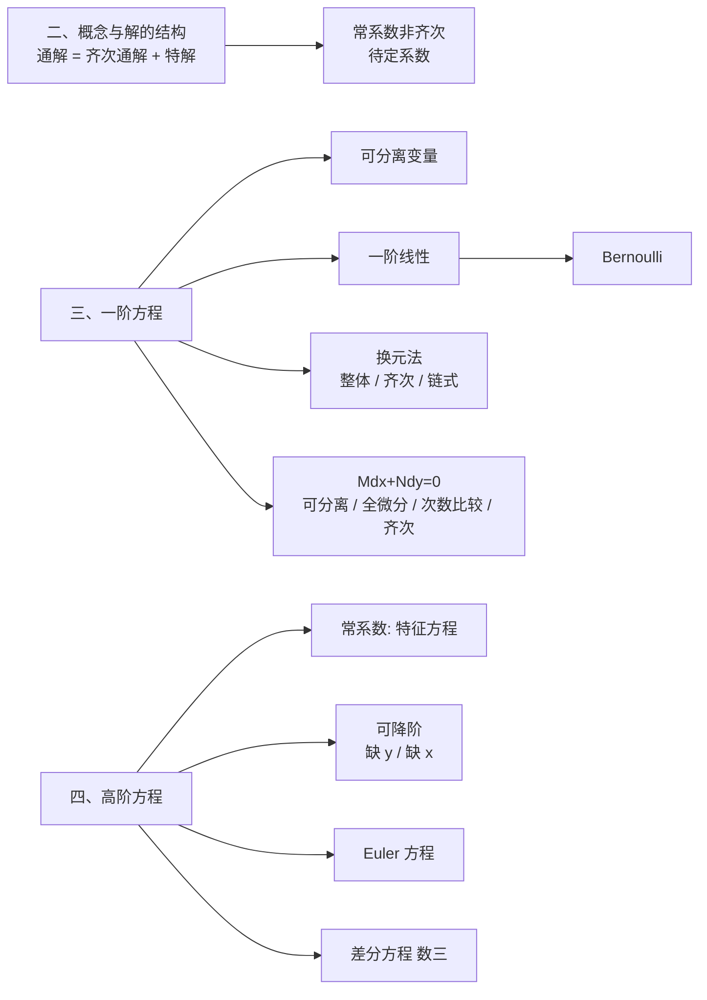
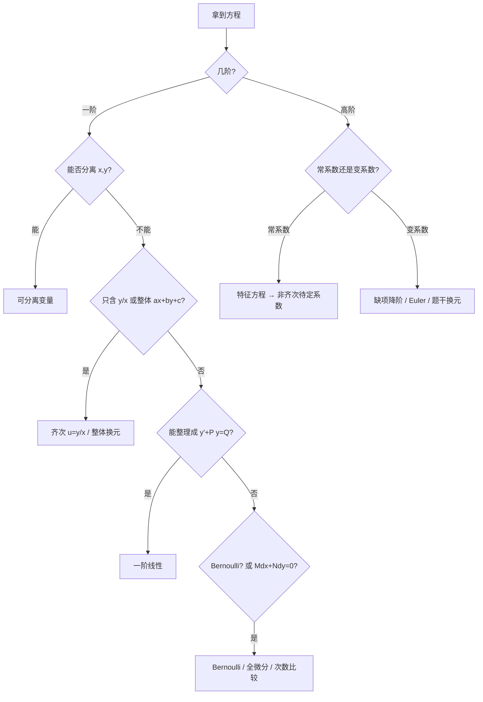

# 微分方程 MOC

> [!info] 来源
> 本专题整理自《微分方程知识点_withMarginNotes.pdf》（考试大纲 ＋ 思维导图 ＋ 手写口诀），在原有口诀与框架基础上补充了标准公式与 LaTeX 表达，用于系统性复习微分方程。完整推导、例题与「补充说明」见 [[微分方程大观]]。
>
> 2026-09-18 结构重整：原 36 节平铺笔记改为**六大板块**（总览 / 考试大纲 / 基本概念与解的结构 / 一阶微分方程 / 高阶微分方程 / 综合与应用 / 速查与易混），主文件由 `微分方程知识点_Obsidian详细笔记.md` 更名为 [[微分方程大观]]（旧名保留在 aliases 中，老链接仍可用）。
> 三处主要改动：**判型信息由 5 处收拢为 2 处**（「总览 · 解题总顺序」＋「六、速查」）、**删去整体换元与待定系数表的重复节**、**二阶解的结构从原 §4 上提为独立板块**并与待定系数法接成一条线。

## 知识结构总览

微分方程的两条主线：**线性方程的"解的结构"（公理层）** 与 **按型识别的解法（操作层）**。

## 解题总顺序（先判型，后出手）

## 板块导航

| 板块 | 内容 | 笔记 |
|------|------|------|
| 总览 | 知识地图、解题总顺序（八步扫描） | [[微分方程大观#总览]] |
| 一、考试大纲 | 考试内容、九条要求、数三附加、大纲反读 | [[微分方程大观#一、考试大纲与复习定位]] |
| 二、概念与解的结构 | 五个基本概念、线性算子四条性质、解的结构定理 | [[微分方程大观#二、基本概念与解的结构]] |
| 三、一阶方程 | 判型决策树、可分离变量、一阶线性、Bernoulli、三种换元、Mdx+Ndy=0 三出路 | [[微分方程大观#三、一阶微分方程]] |
| 四、高阶方程 | 总分类、特征方程、待定系数、可降阶、Euler、变系数原则、差分方程 | [[微分方程大观#四、高阶微分方程]] |
| 五、综合与应用 | 导数定义、几何应用、定积分/变限积分、二重积分变区域、三步建模 | [[微分方程大观#五、综合与应用]] |
| 六、速查与易混 | 三张速查表 ＋ 六组易混概念 | [[微分方程大观#六、速查与易混]] |

## 一阶方程速查（7 种题型）

| 题型 | 标准形式 | 一招 |
|------|------|------|
| 可分离变量 | $y'=f(x)g(y)$ | 分离后两边积分；**除掉的因子要查漏解** |
| 齐次方程 | $y'=F(y/x)$ | $u=y/x$，$y'=u+xu'$ |
| 整体换元 | $y'=F(ax+by+c)$ | $u=ax+by+c$，化可分离 |
| 链式结构 | 出现 $F'(y)y'$ | 看成 $[F(y)]'$，整体换元 |
| 一阶线性 | $y'+P(x)y=Q(x)$ | 积分因子 $\mu=e^{\int P\mathrm dx}$ |
| Bernoulli | $y'+Py=Qy^{\alpha}$ | $z=y^{1-\alpha}$ → 一阶线性 |
| 全微分 | $M\mathrm dx+N\mathrm dy=0$ 且 $M_y=N_x$ | 求势函数 $U$，解 $U=C$ |

## 核心考点速查

- **公理层一条**：非齐次通解 ＝ 对应齐次通解 ＋ 非齐次一个特解；待定系数法的全部依据。
- **线性算子**：$L[\sum a_iy_i]=\sum a_iL[y_i]$；四条口诀都是它的特例。系数和 $0$ → 齐次解，系数和 $1$ → 非齐次解。
- **判型不互斥**：$y'+P(x)y=0$ 既可分离也可当线性方程；选最省力的一条路。
- **齐次有两个语境**：$y'=F(y/x)$（次数齐性）用 $u=y/x$；$L[y]=0$（算子为零）用特征方程。
- **Mdx+Ndy=0 四条出路**（按成本从低到高）：$\mathrm dx$ 前只含 $y$ 且 $\mathrm dy$ 前只含 $x$ → **直接可分离**；再查 $M_y=N_x$（全微分）；再比 $x,y$ 次数定方向；同次则化 $y/x$。$y(x)$ 不线性时可倒换 $x(y)$。
- **特征方程一条通吃**：导几次就是 $r$ 的几次方；重根乘 $x$ 的递增幂，复根 cos/sin 成对出现。
- **待定系数十六字诀**：指数照抄；多项式同次（三角取高次）；正余弦都写；冲突乘 $x^k$（$k$ ＝ 该特征根的重数）。
- **可降阶判据只有一个"缺谁"**：缺 $y$ → $p=y'$（$y''=p'$）；缺 $x$ → $p=p(y)$（$y''=p\,\mathrm dp/\mathrm dy$）。
- **Euler 两个换算**：$xy'=Dy$，$x^2y''=D^2y-Dy$；非齐次项 $f(x)$ 必须一起换成 $t$ 的表达式。
- **变限积分三种处理**：连续 → 直接求导；可导且给初值 → 一直导；导成高阶变系数 → 令变限积分 $=g(x)$ 重新构造。
- **应用题三步建模**：设未知函数 → 把"变化率"写成导数 → 用初始条件定常数。

## 相关链接

- [[微分方程大观]]（完整详细笔记）
- [[🌲6.微分方程及其应用]]（教材级笔记）
- [[一元积分 MOC]]、[[函数极限 MOC]]、[[多元微分 MOC]]（同库其他专题）
