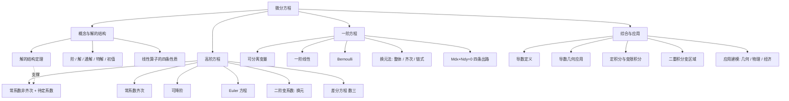
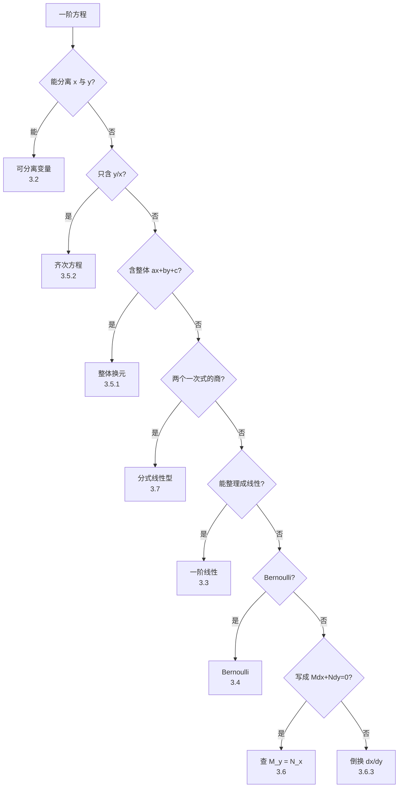
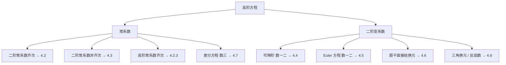

# 微分方程大观

> [!info] 整理说明
> - 依《微分方程知识点_withMarginNotes.pdf》（考试大纲 ＋ 思维导图 ＋ 手写口诀）整理；索引与速查见 [[微分方程 MOC]]。
> - PDF 中口语化的"框框""除框框""乘高次幂"等识别口诀，已改写为标准数学表达。
> - 标 **「补充说明」** 之处，是为闭合知识链条补上的标准考研公式/推导，并非 PDF 逐字转录。
> - PDF 对"二阶变系数中的三角换元、反函数"只列标题、未给统一公式，本笔记保留为"待题型触发"，不擅自补成固定套路。
>
> **2026-09-18 结构重整**：原 40 节全部平铺在 H1，现改为六大板块 ＋ 自测与附录。四处动刀：
> ① **判型信息收拢**——原来散在 5 处（判型总流程、Mdx+Ndy 判结构、次数比较法、两张速查表、考场顺序），现归为「总览 · 解题总顺序」（宏观扫描）＋「六、速查与易混」（查表）两极，正文各节只讲自己的解法；
> ② **去重**——原 §7 与 §9 的"整体换元"、原 §20 与 §34 的"待定系数表"各重复了一遍，现各留一处；
> ③ **接链**——Bernoulli 前移到一阶线性之后（它就是线性方程换元而来的）；"线性方程解的性质与结构"原夹在"基本概念"与"一阶方程"之间，现上提为「二、基本概念与解的结构」，与下游「4.3 常系数非齐次」接成一条"结构 → 待定系数"的线；
> ④ **自测合并**——原 §37 默写题与 §38 答案相隔约 200 行，现合成「七、公式默写自测」的问答折叠块，点开即见答案；原 §39 背诵版收进 [[#6.5 考前最终背诵（裸背清单）]]，原 §40 待补充清单移到文末附录。
> 另：全部多步推导改写为 `aligned` 逐步对齐（每行一个变换、等号成列、中间量用 `\underbrace` 就地命名）。
>
> **2026-09-18 并入题型讲义例题（13 道）**：补上了本笔记原先**完全空白**的
> [[#3.7 分式线性型：先消常数项]]（分式线性型的三个特殊情况 + 平移消常数项），
> 并在 3.4 / 3.5 / 3.6 各节补例题，含 **数一 2024 真题** 与 **两届初赛题**。
> 按教学价值取舍详略：例 1、2、4、5、7、8、10、11、13 给完整解析；例 3、6、9、12 只给关键变形与答案
> （见 [[微分方程 MOC]] 的例题索引）。
> 全部例题已重新验算；其中 **例 11、例 13 的积分因子符号** 与 **例 5「后悔药」中 $\mathrm dy$ 项符号**，
> 讲义原文有笔误——本笔记按验算结果书写，并在原处标为易错点（含自检办法）。

---

## 总览

**一句话主线**：解微分方程 ＝ **先判型，再换元，最后降阶/积分**。判型错了，后面每一步都在白算。

全章按"拿到题目之后要做的事"切成五大板块：

| 板块 | 面对的对象 | 核心动作 |
|---|---|---|
| [[#二、基本概念与解的结构]] | 一切线性方程 | 先说清"通解长什么样" |
| [[#三、一阶微分方程]] | 一阶方程 7 种题型 | 判型 → 换元 → 分离积分 |
| [[#四、高阶微分方程]] | 二阶及以上 | 常系数走特征方程；变系数走降阶/换元 |
| [[#五、综合与应用]] | 与其他章节拼接的题 | 把题干条件翻译成微分方程 |
| [[#六、速查与易混]] | 考前十分钟 | 查表 ＋ 分清单词 |

### 全章知识地图

> [!tip] 读图的重点
> 左半（B）是**公理层**：所有线性方程共用同一套"解的结构"，下游的待定系数法完全建立在 $y=y_h+y_p$ 上。
> 右半（C、D）是**操作层**：一阶看"能不能换来换去"，高阶看"是常系数还是变系数"。

### 解题总顺序（八步扫描）

动笔之前先扫一遍，不要一看就积分：

| 步 | 先看什么 | 判到哪 | 第一动作 |
|:--:|---|---|---|
| ① | **阶数** | 一阶 / 高阶 | 一阶 → [[#3.1 一阶方程判型决策树\|3.1]]；高阶 → [[#4.1 高阶方程总分类\|4.1]] |
| ② | 能否把 $x$ 与 $y$ 分离 | 可分离变量 | 两边各自积分 |
| ③ | 右端是否只含 $y/x$；是否反复出现 $ax+by+c$；是否是两个一次式的商 | 齐次 / 整体换元 / **分式线性型** | $u=y/x$；$u=ax+by+c$；或平移消常数项 → [[#3.7 分式线性型：先消常数项\|3.7]] |
| ④ | 能否整理成 $y'+P(x)y=Q(x)$ | 一阶线性 | 积分因子 $e^{\int P\,\mathrm dx}$ |
| ⑤ | 能否整理成 $y'+Py=Qy^{\alpha}$ | Bernoulli | $z=y^{1-\alpha}$ |
| ⑥ | 是否写成 $M\,\mathrm dx+N\,\mathrm dy=0$ | 先看系数只含谁，再查 $M_y=N_x$ | 可分离 / 全微分 / 次数比较 / 齐次 / 倒换 |
| ⑦ | 二阶常系数 | 特征方程 | 非齐次再做待定系数 |
| ⑧ | 二阶变系数 | 缺项、Euler、题干换元 | 降阶或按题干换元 |

---

## 一、考试大纲与复习定位

### 1.1 考试内容

- 常微分方程的基本概念
- 变量可分离的微分方程
- 齐次微分方程
- 一阶线性微分方程
- Bernoulli 方程
- 全微分方程
- 可用简单变量代换求解的某些微分方程
- 可降阶的高阶微分方程
- 线性微分方程解的性质及解的结构定理
- 二阶常系数齐次线性微分方程
- 高于二阶的某些常系数齐次线性微分方程
- 简单的二阶常系数非齐次线性微分方程
- Euler 方程
- 微分方程的简单应用
- 差分与差分方程的概念
- 差分方程的通解与特解
- 一阶常系数线性差分方程

### 1.2 考试要求

1. 了解微分方程及其**阶、解、通解、初始条件、特解**等概念。
2. 掌握**变量可分离方程**及**一阶线性方程**的解法。
3. 会解**齐次方程、Bernoulli 方程、全微分方程**，会用简单变量代换求某些微分方程。
4. 会用**降阶法**解微分方程。
5. 理解**线性微分方程解的性质及解的结构**。
6. 掌握**二阶常系数齐次线性微分方程**，并会解某些高于二阶的常系数齐次线性微分方程。
7. 会解自由项为**多项式、指数函数、正弦函数、余弦函数及其和与积**的二阶常系数非齐次线性微分方程。
8. 会解 **Euler 方程**。
9. 会用微分方程解决简单应用问题。

### 1.3 数学三附加要求

- 了解差分与差分方程、通解、特解等概念。
- 了解一阶常系数线性差分方程的求解方法。
- 会用微分方程求解简单经济应用问题。

> [!tip] 大纲反读：哪一条对应哪一节
> 要求 1 → [[#二、基本概念与解的结构]]；要求 2、3 → [[#三、一阶微分方程]]；要求 4、6、7、8 → [[#四、高阶微分方程]]；
> 要求 5 → [[#2.2 线性算子的四条性质]] 与 [[#2.3 解的结构定理]]；要求 9 → [[#五、综合与应用]]；数三附加 → [[#4.7 差分方程（数学三）]]。

---

## 二、基本概念与解的结构

这一板块是**公理层**：不说清"通解长什么样"，后面所有解法都无从下笔。

### 2.1 五个基本概念

| 概念 | 定义 | 关键提醒 |
|---|---|---|
| **微分方程** | 含有未知函数及其导数、并反映它们之间关系的方程 | 一般形如 $F(x,y,y',y'',\dots,y^{(n)})=0$ |
| **阶** | 方程中出现的未知函数**最高阶导数的阶数** | $y''+3y'-2y=0$ 最高阶是 $y''$，故为二阶 |
| **解** | 把 $y=\varphi(x)$ 及各阶导数代入后，等式在相应区间内恒成立的函数 | 强调"在区间上恒成立" |
| **通解** | 含有与方程阶数相同个数的**相互独立**任意常数的解 | "含 $n$ 个常数"只是常见表达特征，**独立性**才是本质 |
| **特解** | **不含任意常数**的解 | 通常由初始条件从通解中定出 |
| **初始条件** | 确定微分方程特解的一组常数条件 | 二阶常给 $y(x_0)=y_0,\ y'(x_0)=y_1$，代入通解求 $C_1,C_2$ |

> [!warning] 通解的两个坑
> 1. 「$n$ 阶方程的通解含 $n$ 个任意常数」是**通常情况**，不是定义；考试更认"常数相互独立"这一条。
> 2. 二阶方程写成 $y=C_1y_1+C_2y_2$，若 $y_1,y_2$ 线性相关，实际上只剩一个独立常数，那就不是通解。

### 2.2 线性算子的四条性质

> [!tip] 先把"算子"这个词翻译成人话
> $L[y]\equiv y''+p(x)y'+q(x)y$ 不是什么新东西，它只是给"**对 $y$ 求两次导、求一次导，各乘上一个已知系数，再加起来**"这整套动作起了个名字——就像把"洗、漂、烘"打包叫"洗衣服"。
> 之所以能打包成一个符号，是因为这套动作里**只有求导和乘已知函数**，没有平方、没有 $\sin y$、没有 $y\cdot y'$ 这类非线性的东西。凡是"不含非线性操作"的动作，都叫**线性**算子。下面四条，全部是"线性"这两个字的推论。

#### 一句话：你怎么配系数，右边就怎么变

**已知什么，就得到什么按同样的系数配比。** 若 $L[y_i]=f_i(x)$（$i=1,\dots,n$），则

$$
\begin{aligned}
L\left[\sum_{i=1}^{n} a_i y_i\right]
&= \sum_{i=1}^{n} a_i L[y_i]
\\ &= \sum_{i=1}^{n} a_i f_i(x)
\end{aligned}
$$

第一行是"线性"本身——求导可以拆到每一项上；第二行只是把已知条件 $L[y_i]=f_i(x)$ 代回去。
**翻译成人话**：把几个解按 $a_i$ 配起来，右边那几个 $f$ 就按**同样的 $a_i$** 配起来；最后剩下什么，只看你怎么配的系数。

#### 四种常见情形：数系数和就够了

| 情形 | 右边变成什么 | 所以结论是 |
|---|---|---|
| 两个齐次解组合 $C_1y_1+C_2y_2$ | $0+0=0$ | 仍是**齐次解** |
| 齐次解 ＋ 非齐次解 $y_h+y_p$ | $0+f(x)=f(x)$ | 仍是**非齐次解** |
| 两个非齐次解相减 $y_1-y_2$ | $f(x)-f(x)=0$ | 是**齐次解** |
| 非齐次解自己加自己 $2y$ | $f(x)+f(x)=2f(x)$ | ⚠️ 不是原方程的解，而是 $L[y]=2f(x)$ 的解 |
| 三个非齐次解按 $a_i$ 配 $\sum a_i y_i$ | $\left(\sum a_i\right)f(x)$ | $\sum a_i=0$ → **齐次解**；$\sum a_i=1$ → **原非齐次解** |

> [!summary] 只剩一句话要背：**系数和是几，右边就是几个 $f(x)$**
>
> | 系数和 $\sum a_i$ | 右边变成 | 得到的是什么 |
> |:--:|:--:|:--:|
> | $0$ | $0$（$f$ 一个都不剩） | **齐次解** |
> | $1$ | $f(x)$（恰好剩一个） | **原非齐次方程的解** |
> | $k$（其他） | $k\,f(x)$ | $L[y]=k\,f(x)$ 的解，**不是**原方程的解 |
>
> 齐次方程的解不参与这套记账——它右边本来就是 $0$，怎么配都还是 $0$。

#### 考场怎么用：不代回验证，只数系数

> [!example] 一个例子解决一类题
> 已知 $y_1,y_2,y_3$ 都是 $y''+p(x)y'+q(x)y=f(x)$ 的解，直接看系数和：
> - $y_1-y_2$：系数和 $1-1=0$ → **齐次解**；
> - $y_1+y_2-y_3$：系数和 $1+1-1=1$ → **原非齐次方程的解**；
> - $2y_1-y_2-y_3$：系数和 $2-1-1=0$ → **齐次解**；它一般与 $y_1-y_2$ 线性无关，于是两个齐次解到手，通解直接写出：
>   $$
>   y=C_1(y_1-y_2)+C_2(2y_1-y_2-y_3)+y_3.
>   $$
>
> 这类题**不要代回原方程硬验**，数系数和就是全部——这正是原 PDF「系数和为 $0$ / $1$」那条结论的用法。

### 2.3 解的结构定理

考虑二阶线性非齐次方程

$$
y''+p(x)y'+q(x)y=f(x).
$$

1. **对应齐次方程** $y''+p(x)y'+q(x)y=0$：若 $y_1,y_2$ 是两个**线性无关**解，则齐次通解为
   $$
   y_h=C_1y_1+C_2y_2.
   $$
2. **非齐次方程**：若 $y_p$ 是它的一个特解，则非齐次通解为
   $$
   y=y_h+y_p=C_1y_1+C_2y_2+y_p.
   $$

> [!summary] 一句话记忆
> **非齐次通解 ＝ 对应齐次通解 ＋ 非齐次的一个特解。**

> [!tip] 这条定理就是待定系数法的全部依据
> 它把"解非齐次方程"拆成两件独立的事：**齐次部分**（会算，走特征方程）＋ **一个特解**（猜形式，走待定系数）。见 [[#4.3 常系数非齐次与待定系数法]]。

---

## 三、一阶微分方程

### 3.1 一阶方程判型决策树

> [!tip] 怎么用这张图
> 顺着**否**一直往下问，问到自己能答"是"的那个菱形，就按它引出的方框去做。
> 每格第二行是该题型在本文的节号；把这一列节号串起来，正好就是下面六节（3.2 → 3.7）的顺序。

> [!tip] 判型不互斥
> 例如一阶线性齐次方程 $y'+P(x)y=0$ 本身也能分离变量。所以判型的意义不是"归类"，而是**挑一条最省力的路**——能分离就别上积分因子。一页速查见 [[#6.1 一阶方程判型速查表]]。

---

### 3.2 可分离变量

#### 标准形式

若方程能写成 $\dfrac{dy}{dx}=f(x)g(y)$，则

$$
\begin{aligned}
\frac{dy}{dx} = f(x)g(y)
&\implies \frac{1}{g(y)}\,\mathrm dy = f(x)\,\mathrm dx
\\ &\implies \int \frac{1}{g(y)}\,\mathrm dy = \int f(x)\,\mathrm dx + C
\end{aligned}
$$

PDF 中记的是更直接的形式：

$$
g(y)\,\mathrm dy=f(x)\,\mathrm dx
\quad\Longrightarrow\quad
\int g(y)\,\mathrm dy=\int f(x)\,\mathrm dx.
$$

#### 做题步骤

1. 把所有含 $y$ 的量和 $\mathrm dy$ 放一边；
2. 把所有含 $x$ 的量和 $\mathrm dx$ 放另一边；
3. 两边积分；
4. 整理任意常数（见下）；
5. 若题目给初始条件，再求特解。

> [!warning] 易错点：除掉的因子可能对应漏解
> 分离变量时若两边除以了 $g(y)$，必须回头检查 $g(y)=0$ 是否本身给出**常值解**（这类解常在题目答案里，且不包含在通解中）。

#### 任意常数的写法

> [!info] 补充说明
> 常见整理规则：
> - $C_1+C_2$ 可以重新记成 $C$；
> - 非零常数乘积可以并入 $C$；
> - 若积出 $\ln\lvert y\rvert=F(x)+C$，可写成 $y=Ce^{F(x)}$；
> - 但若之前除以了 $y$，仍要另外检查 $y=0$ 是否为解。

---

### 3.3 一阶线性微分方程

#### 标准形式

$$
y'+P(x)y=Q(x),
$$

其中 $P(x),Q(x)$ 在讨论区间内连续。若 $Q(x)\equiv 0$，称**一阶线性齐次方程** $y'+P(x)y=0$。

#### 齐次情形

$$
y'+P(x)y=0
\;\Longrightarrow\;
\frac{dy}{y}=-P(x)\,\mathrm dx
\;\Longrightarrow\;
\ln\lvert y\rvert=-\int P(x)\,\mathrm dx+C
$$

即

$$
y=Ce^{-\int P(x)\,\mathrm dx}.
$$

#### 非齐次通解：积分因子写法

取积分因子

$$
\mu(x)=e^{\int P(x)\,\mathrm dx},\qquad \mu'=\mu P(x).
$$

原方程两边乘 $\mu$，左边恰好凑成乘积求导：

$$
\begin{aligned}
\mu y'+\mu P y &= \mu Q
\\ \left(\mu y\right)' &= \mu Q
\\ \mu y &= \int \mu Q\,\mathrm dx+C
\\ y &= e^{-\int P(x)\,\mathrm dx}\left[\int Q(x)e^{\int P(x)\,\mathrm dx}\,\mathrm dx+C\right]
\end{aligned}
$$

> [!summary] 一阶线性通解公式
> $$
> y=e^{-\int P\,\mathrm dx}\left[\int Q\,e^{\int P\,\mathrm dx}\,\mathrm dx+C\right]
> $$
> 结构记忆：**先去指数、再乘回来**——$e^{-\int P}$ 留在括号外，$e^{+\int P}$ 贴着 $Q$ 进积分号。

---

### 3.4 Bernoulli 方程（数学一）

> [!note] 位置说明
> Bernoulli 方程是**一阶线性的推广**（右端多了因子 $y^{\alpha}$），换元后立刻化为一阶线性，因此紧跟 3.3，不要与后面的 Mdx+Ndy 混着记。

#### 标准形式

$$
y'+P(x)y=Q(x)y^{\alpha},\qquad \alpha\ne 0,1.
$$

PDF 口诀：

> **伯努利，$1-\alpha$ 可尔法。**
> **消右边 $y$，左边凑。**

其核心就是令

$$
z=y^{1-\alpha}.
$$

#### 推导

原式两边除以 $y^{\alpha}$，再令 $z=y^{1-\alpha}$（此时 $z'=(1-\alpha)y^{-\alpha}y'$）：

$$
\begin{aligned}
y^{-\alpha}y'+P(x)y^{1-\alpha} &= Q(x)
\\ \frac{z'}{1-\alpha}+P(x)\underbrace{z}_{y^{1-\alpha}} &= Q(x)
\\ z'+(1-\alpha)P(x)z &= (1-\alpha)Q(x)
\end{aligned}
$$

最后一行已是标准一阶线性方程，用 [[#3.3 一阶线性微分方程]] 的通解公式解出 $z$，再回代 $y=z^{\frac{1}{1-\alpha}}$。

> [!summary] Bernoulli 一行口诀
> $$
> z=y^{1-\alpha}
> \quad\Longrightarrow\quad
> \text{一阶线性方程}.
> $$

#### 例题

> [!example] 例 13（14 届初赛）：先整理成"某项乘 $y'$"，再走标准两步
> 求 $(x\ln x\sin y)\dfrac{dy}{dx}+\cos y\left(1-x\cos y\right)=0$ 的通解。
>
> **第一步：整理成"某项乘 $y'$"的样子。** 两边除以 $x\ln x$：
> $$
> \sin y\,\frac{dy}{dx}+\frac{\cos y}{x\ln x}=\frac{\cos^2y}{\ln x}.
> $$
> **第二步：认出链式结构（见 [[#3.5.3 链式结构]]）。** 由 $\sin y\,y'=-(\cos y)'$，令 $u=\cos y$，
> 则 $u'=-\sin y\,y'$，方程化为
> $$
> u'-\frac{u}{x\ln x}=-\frac{u^2}{\ln x},
> $$
> 这是 $\alpha=2$ 的 Bernoulli 方程。
> **第三步：$w=1/u$ 化线性。** 两边除以 $u^2$ 并令 $w=\dfrac1u$：
> $$
> \frac{dw}{dx}+\frac{w}{x\ln x}=\frac{1}{\ln x}.
> $$
> **第四步：套通解公式。** 先算 $\displaystyle\int\frac{\mathrm dx}{x\ln x}=\ln\ln x$：
> $$
> \begin{aligned}
> w &= e^{-\int\frac{\mathrm dx}{x\ln x}}\left[\int\frac{1}{\ln x}\cdot e^{\int\frac{\mathrm dx}{x\ln x}}\,\mathrm dx+C\right]
> \\ &= \frac{1}{\ln x}\left[\int\frac{\ln x}{\ln x}\,\mathrm dx+C\right]
> \\ &= \frac{1}{\ln x}\left[x+C\right]
> \end{aligned}
> $$
> 回代 $w=\dfrac{1}{\cos y}$，得通解
> $$
> (x+C)\cos y=\ln x.
> $$
>
> > [!warning] 易错点：积分因子的内外别写反
> > 通解公式里 $e^{-\int P\,\mathrm dx}$ 在**外**、$e^{+\int P\,\mathrm dx}$ 贴着 $Q$ **在里**（[[#3.3 一阶线性微分方程]]）。
> > 本题 $P=\dfrac{1}{x\ln x}$，所以外面是 $\dfrac{1}{\ln x}$、里面是 $\ln x$，恰好互为倒数——
> > 写反了答案里 $\ln x$ 会跑到分子上去。**自检**：把结果代回 $w'+\dfrac{w}{x\ln x}$，看是否等于 $\dfrac{1}{\ln x}$。

---

### 3.5 换元法：三种"一步换元"

三类题看似不同，共同点是：**换元之后，新方程一定落到"可分离变量"或"一阶线性"上**。判断标准不是"式子复杂"就看换元，而是**这个整体的导数能不能只用这个整体表示出来**。

| 触发形态 | 令 | 换来谁 | 详见 |
|---|---|---|---|
| $y'=F(ax+by+c)$ | $u=ax+by+c$ | 可分离变量 | [[#3.5.1 整体换元]] |
| $y'=F(y/x)$ 或 $M,N$ 同次 | $u=y/x$ | 可分离变量 | [[#3.5.2 齐次方程]] |
| 出现 $F'(y)\cdot y'$ 结构 | $u=F(y)$ | 可分离 / 一阶线性 | [[#3.5.3 链式结构]] |

#### 3.5.1 整体换元

PDF 口诀（五步）：

1. **整体代换**，把"框框"换成 $u$；
2. 等式两端对 $x$ 求导；
3. 代入题干，转化为 $u$ 关于 $x$ 的可分离变量方程；
4. 两端积分，解出 $u$；
5. 换回原变量。

若出现 $y'=F(ax+by+c)$，令 $u=ax+by+c$：

$$
\begin{aligned}
\frac{du}{dx}
&= a+b\frac{dy}{dx}
\\ &= a+bF(u)
\end{aligned}
$$

于是 $\dfrac{du}{a+bF(u)}=\mathrm dx$，化为可分离变量方程。

> [!tip] 核心
> 不是"看到复杂东西就换元"，而是要让这个整体的导数**能借助原方程重新写成只含这个整体的式子**。
> $xy'$ 这种乘了 $x$ 的结构就不属于"整体"（它的导数会引入 $x$ 之外的新因子），PDF 对它的处理是"**先除 $x$**"。

**例题**

> [!example] 例 1：最标准的整体换元
> 求 $\dfrac{dy}{dx}=(4x+y+1)^2$ 的通解。
>
> 令 $u=4x+y+1$，即 $y=u-4x-1$，故 $y'=u'-4$。代入原方程：
> $$
> u'-4=u^2
> \;\Longrightarrow\;
> \frac{\mathrm du}{u^2+4}=\mathrm dx
> \;\Longrightarrow\;
> \frac12\arctan\frac u2=x+C
> $$
> 再用 $u=4x+y+1$ 回代，得通解
> $$
> 4x+y+1=2\tan(2x+C).
> $$

> [!example] 例 8（数一 2024 真题）：回代之后要"解出题目要的形式"
> 求微分方程 $y'=\dfrac{1}{(x+y)^2}$ 满足 $y(1)=0$ 的特解。
>
> 令 $u=x+y$，则 $u'=1+y'$，即 $y'=u'-1$，代入得 $u'-1=\dfrac{1}{u^2}$：
> $$
> \begin{aligned}
> \frac{du}{dx} &= 1+\frac{1}{u^2}=\frac{u^2+1}{u^2}
> \\ \frac{u^2}{u^2+1}\,\mathrm du &= \mathrm dx
> \\ u-\arctan u &= x+C
> \end{aligned}
> $$
> 回代 $u=x+y$，通解为 $y=\arctan(x+y)+C$。由 $y(1)=0$ 知此时 $u=x+y=1$，代入得
> $0=\arctan 1+C$，故 $C=-\dfrac\pi4$，特解为
> $$
> y+\frac\pi4=\arctan(x+y),
> \qquad\text{或写成}\qquad
> x+y=\tan\left(y+\frac\pi4\right).
> $$
>
> > [!tip] 真题的给分点
> > 换元后**别忘回代**；回代后 $y$ 常常"藏"在 $\arctan$、$\tan$ 里解不出来，**这不是错，题目要的就是这种隐式形式**。

> [!tip] 两个"不标准"的整体换元（详略从简）
> - **例 3** $y'=\dfrac{y-x+1}{y-x+5}$：右端是整体 $y-x$ 的函数，先**拆项**再换元——
>   写成 $y'=1-\dfrac{4}{y-x+5}$，令 $u=y-x+5$，得 $u'=-\dfrac4u$，即 $u\,\mathrm du=-4\,\mathrm dx$，
>   故 $u^2+8x=C$，通解 $(y-x+5)^2+8x=C$。
> - **例 9** $y'=y^2+2(\sin x-1)y+\sin^2x-2\sin x-\cos x+1$：先把右端**配方**成
>   $y'=(y+\sin x-1)^2-\cos x$，再令 $u=y+\sin x-1$，得 $u'=u^2$（纯可分离），
>   解得 $-\dfrac1u=x+C$，通解 $y=1-\sin x-\dfrac{1}{x+C}$。
>
> 两例的"框框"都不是 $ax+by+c$ 的标准形状，但**本质一样**：都是先找一个"导数能被整体表示"的组合。

#### 3.5.2 齐次方程

> [!warning] 名称辨析
> 这里的"齐次微分方程"指 $y'=F(y/x)$ 这一类一阶方程；它与"线性齐次方程 $L[y]=0$"**不是同一个"齐次"**。
> 前者说的是 $F$ 对 $(x,y)$ 的次数齐性，后者说的是算子作用为零。混起来就会在该用特征方程时去凑 $y/x$。

标准形式与换元：

$$
\frac{dy}{dx}=F\left(\frac{y}{x}\right),\qquad
u=\frac{y}{x},\qquad y=ux.
$$

由 $y=ux$ 得 $y'=u+xu'$，代入：

$$
\begin{aligned}
u+x\frac{du}{dx} &= F(u)
\\ x\frac{du}{dx} &= F(u)-u
\\ \frac{du}{F(u)-u} &= \frac{dx}{x}
\end{aligned}
$$

两边积分即可。

> [!summary] 口诀
> $$
> u=\frac{y}{x},\qquad y=ux,\qquad y'=u+xu'.
> $$

> [!info] 补充说明：为什么"同次"就能化成 $y/x$
> 若 $M,N$ 都是同次的齐次函数（例如同为 $n$ 次），则 $\dfrac{M}{N}$ 的分子分母同除 $x^n$ 后只剩下 $y/x$：
> $$
> \frac{M(x,y)}{N(x,y)}
> =
> \frac{x^n M(1,y/x)}{x^n N(1,y/x)}
> =
> F\!\left(\frac{y}{x}\right).
> $$
> 这就是 [[#3.6 Mdx+Ndy=0 型的四条出路]] 中"齐次结构"能收编到本节的依据。

**例题**

> [!example] 例 2：两次换元——先"倒过来"，再齐次
> 求 $\dfrac{dy}{dx}=\dfrac{y^2}{4}+\dfrac{1}{x^2}$ 的通解。
>
> **第一次换元：见到 $y^2$ 就想 $u=\dfrac1y$。** 两边同除以 $y^2$，并注意 $\dfrac{d}{dx}\!\left(\dfrac1y\right)=-\dfrac{y'}{y^2}$：
> $$
> \frac{1}{y^2}\frac{dy}{dx}=\frac14+\frac{1}{x^2y^2}
> \;\Longrightarrow\;
> -\frac{d}{dx}\!\left(\frac1y\right)=\frac14+\frac{1}{x^2}\left(\frac1y\right)^2
> $$
> 令 $u=\dfrac1y$，得
> $$
> \frac{du}{dx}=-\frac14-\frac{u^2}{x^2},
> $$
> 右端**只含 $u/x$**，已是齐次方程。
> **第二次换元：$v=\dfrac ux$。** 由 $u=vx$ 得 $\dfrac{du}{dx}=v+x\dfrac{dv}{dx}$：
> $$
> \begin{aligned}
> v+x\frac{dv}{dx} &= -\frac14-v^2
> \\ x\frac{dv}{dx} &= -\left(v+\frac12\right)^2
> \\ -\frac{\mathrm dv}{\left(v+\frac12\right)^2} &= \frac{\mathrm dx}{x}
> \end{aligned}
> $$
> 积分得 $\dfrac{1}{v+\frac12}=\ln x-\ln C$，即 $x=Ce^{\frac{1}{v+\frac12}}$。
> 回代 $v=\dfrac{u}{x}=\dfrac{1}{xy}$：
> $$
> v+\frac12=\frac{1}{xy}+\frac12=\frac{xy+2}{2xy}
> \;\Longrightarrow\;
> \frac{1}{v+\frac12}=\frac{2xy}{xy+2},
> $$
> 故通解为
> $$
> x=Ce^{\frac{2xy}{xy+2}}.
> $$
>
> > [!tip] 什么时候该"先倒过来"
> > 见到 $y^2,\ \dfrac{1}{y^2}$ 这类结构，先试 $u=\dfrac1y$——它其实就是一个 $n=2$ 的 Bernoulli 方程换了张脸
> > （两边除以 $y^2$ 正是 [[#3.4 Bernoulli 方程（数学一）]] 的第一步）。

> [!tip] 又一个"平方和"型整体换元（详略从简）
> **例 12** $2yy'=e^{\frac{x^2+y^2}{x}}+\dfrac{x^2+y^2}{x}-2x$：注意 $u=x^2+y^2$ 时 $u'=2x+2yy'$，
> 于是原方程恰好变成 $u'=e^{u/x}+\dfrac ux$——这是 $v=u/x$ 的齐次方程，解出
> $-e^{-\frac{x^2+y^2}{x}}=\ln\lvert x\rvert+C$。
> **关键**：这里的"整体"$x^2+y^2$ 是靠"配一个 $2x$"凑出来的，题干里那个 $2x$ 就是为它准备的。

#### 3.5.3 链式结构

> **看到某个关于 $y$ 的函数乘 $y'$，先检查它是不是一个复合函数的导数。**

| 出现结构 | 看成谁的导数 | 换元建议 |
|---|---|---|
| $2yy'$ | $(y^2)'$ | $u=y^2$ |
| $e^y y'$ | $(e^y)'$ | $u=e^y$ |
| $\cos y\,y'$ | $(\sin y)'$ | $u=\sin y$ |
| $\sec^2 y\,y'$ | $(\tan y)'$ | $u=\tan y$ |
| $\dfrac{y'}{y}$ | $(\ln\lvert y\rvert)'$ | $u=\ln\lvert y\rvert$ |
| $\dfrac{y'}{\sqrt{1-y^2}}$ | $(\arcsin y)'$ | $u=\arcsin y$ |
| $xy'$ | — | **不属于链式**，先除 $x$ 化成标准形 |

> [!tip] 核心动作
> 把"函数 $\times\,y'$"整体看成 $\dfrac{d}{dx}\bigl[F(y)\bigr]$。这样常可一步整体换元，把方程降成一阶线性或可分离变量。

**例题**

> [!example] 例 11：链式结构 $\Rightarrow$ 一阶线性
> 求 $y'+x\sin 2y=2xe^{-x^2}\cos^2y$ 的通解。
>
> 两边除以 $\cos^2y$，并用 $\dfrac{\sin 2y}{\cos^2y}=\dfrac{2\sin y\cos y}{\cos^2y}=2\tan y$：
> $$
> \sec^2y\,y'+2x\tan y=2xe^{-x^2}
> \;\Longrightarrow\;
> \frac{d(\tan y)}{dx}+2x\tan y=2xe^{-x^2}.
> $$
> 令 $u=\tan y$，得 $u'+2xu=2xe^{-x^2}$。这里 $P=2x$、$Q=2xe^{-x^2}$、$\int P\,\mathrm dx=x^2$：
> $$
> \begin{aligned}
> u &= e^{-\int 2x\,\mathrm dx}\left[\int 2xe^{-x^2}e^{\int 2x\,\mathrm dx}\,\mathrm dx+C\right]
> \\ &= e^{-x^2}\left[\int 2xe^{-x^2}\cdot e^{x^2}\,\mathrm dx+C\right]
> \\ &= e^{-x^2}\left[\int 2x\,\mathrm dx+C\right]
> \\ &= e^{-x^2}\left(x^2+C\right)
> \end{aligned}
> $$
> 故通解为
> $$
> \tan y=e^{-x^2}\left(x^2+C\right).
> $$
>
> > [!warning] 最典型的错法：把外面写成 $e^{+\int P}$
> > 若误写成 $\tan y=e^{x^2}(x^2+C)$，代回 $u'+2xu$ 会得到 $2xe^{x^2}(2x^2+2C+1)$，
> > 而右端是 $2xe^{-x^2}$——**对不上**。
> > 记法见 [[#3.3 一阶线性微分方程]]：$e^{-\int P}$ 在括号**外**，$e^{+\int P}$ 贴着 $Q$ **在里**。
> > 自检两秒钟的办法：把结果代回原线性方程，等式成立就对了。

---

### 3.6 Mdx+Ndy=0 型的四条出路

一般写成

$$
M(x,y)\,\mathrm dx+N(x,y)\,\mathrm dy=0,
$$

它等价于两种"把谁当函数"的写法：

$$
M(x,y)+N(x,y)\frac{dy}{dx}=0
\qquad\text{或}\qquad
M(x,y)\frac{dx}{dy}+N(x,y)=0.
$$

PDF 的思路是**先观察 $\mathrm dx,\mathrm dy$ 前面的结构**，而不是一上来就硬算。四条出路按"检查成本从低到高"排：

| 出路 | 检查什么 | 成本 | 去哪 |
|---|---|---|---|
| ① 可分离 | $\mathrm dx$ 前是否只含 $y$、$\mathrm dy$ 前是否只含 $x$ | 看一眼 | [[#3.6.1 出路一：可分离]] |
| ② 全微分 | $M_y=N_x$ 是否成立 | 一次偏导 | [[#3.6.2 出路二：全微分方程（数学一、二）\|3.6.2]] |
| ③ 次数比较 | $x,y$ 谁的最高次数高 | 数次数 | [[#3.6.3 出路三：次数比较法定方向]] |
| ④ 齐次结构 | $M,N$ 是否同次 | 数次数 | [[#3.5.2 齐次方程]] |

#### 3.6.1 出路一：可分离

PDF 口诀：

> **$\mathrm dx$ 前面是 $y$，$\mathrm dy$ 前面是 $x$ → 尝试转化为可分离变量。**

也就是说，若 $M=M(y)$、$N=N(x)$（两个微分前的系数各自只含"对方那个变量"），方程就直接是可分离的：

$$
M(y)\,\mathrm dx+N(x)\,\mathrm dy=0
\quad\Longrightarrow\quad
f(y)\,\mathrm dy=g(x)\,\mathrm dx.
$$

两边积分即可，**不必再做任何换元**。这是四条出路里最省事的一条，所以放在第一位查——很多看似属于"全微分"或"次数比较"的题，扫一眼系数就发现根本不用绕。

#### 3.6.2 出路二：全微分方程（数学一、二）

**判定**：若存在函数 $U(x,y)$ 使 $\mathrm dU=M\,\mathrm dx+N\,\mathrm dy$，则称为全微分方程，通解为

$$
U(x,y)=C.
$$

在 $M,N$ 有连续一阶偏导的条件下，判定条件为

$$
\frac{\partial M}{\partial y}=\frac{\partial N}{\partial x}.
$$

**求 $U$ 的三条路**：

| 方法 | 做法 | 适用 |
|---|---|---|
| **偏积分** | 先 $U=\int M\,\mathrm dx+\varphi(y)$，再由 $\dfrac{\partial U}{\partial y}=N$ 定出 $\varphi'(y)$，最后积分得 $\varphi(y)$ | 通用，最稳 |
| **观察法** | 把项直接拼成某个熟悉的全微分 | 题目项少、结构眼熟 |
| **折线法** | 沿 $(x_0,y_0)\to(x,y_0)\to(x,y)$ 积分（PDF 写作"二类线（取折线）"） | 要求写成积分形式的题 |

折线法的写法（全微分时积分与路径无关）：

$$
U(x,y)-U(x_0,y_0)
=
\int_{x_0}^{x}M(s,y_0)\,\mathrm ds
+
\int_{y_0}^{y}N(x,t)\,\mathrm dt.
$$

**常用全微分**（观察法的弹药库）：

$$
\begin{aligned}
\mathrm d(xy) &= y\,\mathrm dx+x\,\mathrm dy,
\\ \mathrm d\!\left(\frac{y}{x}\right) &= \frac{x\,\mathrm dy-y\,\mathrm dx}{x^2},
\\ \mathrm d(x^2+y^2) &= 2x\,\mathrm dx+2y\,\mathrm dy,
\\ \mathrm d(e^{xy}) &= e^{xy}\left(y\,\mathrm dx+x\,\mathrm dy\right),
\\ \mathrm d\!\left(\ln\sqrt{x^2+y^2}\right) &= \frac{x\,\mathrm dx+y\,\mathrm dy}{x^2+y^2},
\\ \mathrm d\!\left(\arctan\frac{y}{x}\right) &= \frac{x\,\mathrm dy-y\,\mathrm dx}{x^2+y^2}.
\end{aligned}
$$

> [!info] 补充说明
> 第 1、3、4 行是 PDF 原文给出的；第 2、5、6 行是为"观察法"补齐的常客，它们分别对应
> $\dfrac{x\,\mathrm dy-y\,\mathrm dx}{x^2}$、$\dfrac{x\,\mathrm dx+y\,\mathrm dy}{x^2+y^2}$、$\dfrac{x\,\mathrm dy-y\,\mathrm dx}{x^2+y^2}$
> 这三种常见分子——考场上看到分子恰好是这类组合，可直接套用。

#### 3.6.3 出路三：次数比较法定方向

这一步解决的是**"谁是函数、谁是自变量"**，而不是换元。动作统一为：同除某一边的微分 → 再同除导数前的系数。

| $x,y$ 的最高次数 | 走法 | 目标形式 |
|---|---|---|
| $x$ 的次数比 $y$ 高 | 同除 $\mathrm dx$，再同除 $dy/dx$ 的系数，**把 $y$ 当 $x$ 的函数** | $y'+P(x)y=Q(x)$ |
| $y$ 的次数比 $x$ 高 | 同除 $\mathrm dy$，再同除 $dx/dy$ 的系数，**把 $x$ 当 $y$ 的函数** | $\dfrac{dx}{dy}+P(y)x=Q(y)$ |
| 两者同次 | 先按第一种试；不通再把 $dy/dx$ 倒过来做 | 二者之一 |

> [!tip] 关键
> 如果 $y(x)$ 不线性，不代表方程不能线性；**换个方向**，把 $x$ 当成 $y$ 的函数试试。
> 看到 $\mathrm dx$ 前的系数比 $\mathrm dy$ 前的系数"干净"，就是该倒换的信号。

**例题**

> [!example] 例 10：把 $x^2$ 当成新未知函数（换元 ＋ 倒换）
> 求 $\dfrac{dy}{dx}=\dfrac{xy}{y^3+x^2y+x^2}$ 的通解。
>
> 先写成对称形式，并注意 $xy\,\mathrm dx=\dfrac12y\,\mathrm d(x^2)$：
> $$
> \left(y^3+x^2y+x^2\right)\mathrm dy=xy\,\mathrm dx=\frac12y\,\mathrm d(x^2).
> $$
> **令 $u=x^2$，并把 $y$ 当自变量**：
> $$
> \begin{aligned}
> y\,\mathrm du &= 2\left(y^3+uy+u\right)\mathrm dy
> \\ \frac{du}{dy} &= 2y^2+2u+\frac{2u}{y}
> \\ \frac{du}{dy}-2\left(1+\frac1y\right)u &= 2y^2
> \end{aligned}
> $$
> 最后一行是**关于 $u(y)$ 的一阶线性方程**。由 $\displaystyle\int 2\left(1+\frac1y\right)\mathrm dy=2y+2\ln y$，套通解公式：
> $$
> \begin{aligned}
> u &= e^{2y+2\ln y}\left[\int 2y^2e^{-2y-2\ln y}\,\mathrm dy+C\right]
> \\ &= y^2e^{2y}\left[\int 2e^{-2y}\,\mathrm dy+C\right]
> \\ &= y^2e^{2y}\left(-e^{-2y}+C\right)
> \\ &= Cy^2e^{2y}-y^2
> \end{aligned}
> $$
> 回代 $u=x^2$，得通解
> $$
> x^2=Cy^2e^{2y}-y^2.
> $$
>
> > [!tip] 为什么该倒换
> > 这里 $x$ 的最高次数（$2$）比 $y$ 的高次（$3$）低，且 $\mathrm d(x^2)$ 前面的系数只有 $y$——
> > 正是 [[#3.6.3 出路三：次数比较法定方向]] 说的"该倒换的信号"。
> > 加上 $u=x^2$ 这一步，$x$ 的二次项整体变成了**一次**，方程就线性了。

#### 3.6.4 出路四：齐次结构

同除 $\mathrm dx$，再除以 $dy/dx$ 前的系数；若分子分母同次，就化成 $y/x$ 的函数，转到 [[#3.5.2 齐次方程]] 处理，推导见该节的「补充说明」。

---

### 3.7 分式线性型：先消常数项

> [!note] 这一节补的是原 PDF 没有展开的题型
> 形如 $\dfrac{dy}{dx}=f\!\left(\dfrac{ax+by+c}{a_1x+b_1y+c_1}\right)$（六个常数）的方程。
> 它和 3.5.1「整体换元」的区别：**分子分母各是一个一次式，换元换不掉——得先把坐标系平移一下。**

#### 先查三个特殊情况（能省一大截）

| 情况 | 判据 | 处理 |
|---|---|---|
| ① 本来就是齐次 | $c=c_1=0$ | 直接 $u=y/x$，见 [[#3.5.2 齐次方程]] |
| ② 系数成比例 | $\dfrac{a}{a_1}=\dfrac{b}{b_1}=k$ | 令 $z=a_1x+b_1y$，得 $\dfrac{dz}{dx}=a_1+b_1f\!\left(\dfrac{kz+c}{z+c_1}\right)$，是**可分离变量** |
| ③ 是全微分方程 | $b=-a_1$ | 直接**凑全微分**（见下面例 5 的「后悔药」） |

> [!tip] 动笔之前花十秒扫这两种情况
> **先查 $M_y=N_x$（是不是全微分），再查 $\dfrac{a}{a_1}$ 与 $\dfrac{b}{b_1}$ 是否相等（系数是否成比例）。**
> 这两种都有"不用平移"的短路径——例 5 的「后悔药」就是没先查、绕了远路的典型。

#### 一般情形：消常数项 → 齐次方程

剩下的是 $c,c_1$ 至少一个不为零、且 $\dfrac{a}{a_1}\ne\dfrac{b}{b_1}$ 的情况。**做一次平移，把两个常数项一起消掉。**

令 $x=X+h$、$y=Y+k$（$h,k$ 待定），代入得

$$
\frac{dY}{dX}=f\!\left(\frac{aX+bY+(ah+bk+c)}{a_1X+b_1Y+(a_1h+b_1k+c_1)}\right).
$$

由于 $\dfrac{a}{a_1}\ne\dfrac{b}{b_1}$，方程组

$$
\begin{cases}
ah+bk+c=0,\\
a_1h+b_1k+c_1=0
\end{cases}
$$

**有唯一解**（系数行列式 $ab_1-a_1b\ne0$）。取这组 $(h,k)$，方程立刻变成齐次方程

$$
\frac{dY}{dX}=f\!\left(\frac{aX+bY}{a_1X+b_1Y}\right),
$$

之后走 [[#3.5.2 齐次方程]]：令 $u=\dfrac YX$，解完再把 $X=x-h$、$Y=y-k$ 换回。

> [!tip] 这一步到底在干什么
> 分子分母是**两条相交直线**；$(h,k)$ 就是把坐标原点**平移它们的交点**上。平移后两条直线都过原点，分式就齐次了。
> 若 $\dfrac{a}{a_1}=\dfrac{b}{b_1}$，两条直线平行、没有交点——那就落回上面的特殊情况 ②。

#### 例题

> [!example] 例 4：标准流程（分离变量后要做部分分式）
> 求 $(2x-5y+3)\mathrm dx-(2x+4y-6)\mathrm dy=0$ 的通解。
>
> 先写成导数形式 $\dfrac{dy}{dx}=\dfrac{2x-5y+3}{2x+4y-6}$，再令 $x=X+h$、$y=Y+k$：
> $$
> \frac{dY}{dX}=\frac{2X-5Y+(2h-5k+3)}{2X+4Y+(2h+4k-6)}.
> $$
> 令常数项为零：
> $$
> \begin{cases}2h-5k+3=0\\2h+4k-6=0\end{cases}
> \;\Longrightarrow\;
> h=1,\ k=1,
> $$
> 即 $x=X+1$、$y=Y+1$ 时方程化为齐次方程
> $$
> \frac{dY}{dX}=\frac{2X-5Y}{2X+4Y}.
> $$
> 令 $u=\dfrac YX$，得 $X\dfrac{du}{dX}+u=\dfrac{2-5u}{2+4u}$，即
> $$
> X\frac{du}{dX}=\frac{2-5u}{2+4u}-u=\frac{2-7u-4u^2}{2+4u}
> \;\Longrightarrow\;
> \frac{4u+2}{4u^2+7u-2}\,\mathrm du=-\frac{\mathrm dX}{X}.
> $$
> 部分分式：$4u^2+7u-2=(u+2)(4u-1)$，且
> $$
> \frac{4u+2}{(u+2)(4u-1)}=\frac{2}{3}\cdot\frac{1}{u+2}+\frac{4}{3}\cdot\frac{1}{4u-1},
> $$
> 积分得
> $$
> -\ln X=\frac23\ln(u+2)+\frac13\ln(4u-1)-\frac13\ln C,
> $$
> 即 $X^3(u+2)^2(4u-1)=C$。回代 $u=\dfrac YX$ 得 $(2X+Y)^2(4Y-X)=C$，再用 $X=x-1$、$Y=y-1$，得通解
> $$
> (2x+y-3)^2(4y-x-3)=C.
> $$

> [!example] 例 5：平移后是纯齐次；但这题还能"抄近路"
> 求 $y'=\dfrac{x+y-2}{y-x+4}$ 的通解。
>
> **主路：消常数项。** 令 $x=X+h$、$y=Y+k$：
> $$
> \frac{dY}{dX}=\frac{X+Y+(h+k-2)}{-X+Y+(-h+k+4)}
> $$
> 令常数项为零，解得 $h=3$、$k=-1$，即 $x=X+3$、$y=Y-1$ 时化为
> $$
> \frac{dY}{dX}=\frac{X+Y}{Y-X}.
> $$
> 令 $u=\dfrac YX$：$X\dfrac{du}{dX}+u=\dfrac{1+u}{u-1}$，即 $X\dfrac{du}{dX}=\dfrac{1+2u-u^2}{u-1}$，分离变量
> $$
> \frac{u-1}{1+2u-u^2}\,\mathrm du=\frac{\mathrm dX}{X}.
> $$
> 注意 $\dfrac{\mathrm d}{\mathrm du}\left(1+2u-u^2\right)=2-2u=-2(u-1)$，所以左边积出 $-\dfrac12\ln(1+2u-u^2)$：
> $$
> -\frac12\ln(1+2u-u^2)=\ln X-\frac12\ln C
> \;\Longrightarrow\;
> X^2\left(1+2u-u^2\right)=C.
> $$
> 回代 $u=\dfrac YX$ 得 $X^2+2XY-Y^2=C$，再用 $X=x-3$、$Y=y+1$：
> $$
> (x-3)^2+2(x-3)(y+1)-(y+1)^2=C.
> $$
>
> > [!success] 后悔药：这题其实是全微分方程，可以秒杀
> > 把方程写成 $M\,\mathrm dx+N\,\mathrm dy=0$ 并查 $M_y=N_x$：
> > $$
> > (x+y-2)\mathrm dx+(x-y-4)\mathrm dy=0,
> > \qquad M_y=1=N_x\ \checkmark
> > $$
> > 它是全微分方程（[[#3.6.2 出路二：全微分方程（数学一、二）]]）。**分组凑微分**：
> > $$
> > \begin{aligned}
> > 0 &= (x-2)\,\mathrm dx+\left(y\,\mathrm dx+x\,\mathrm dy\right)+(-y-4)\,\mathrm dy
> > \\ &= \mathrm d\!\left(\frac{x^2}{2}-2x\right)+\mathrm d(xy)+\mathrm d\!\left(-\frac{y^2}{2}-4y\right)
> > \end{aligned}
> > $$
> > 故通解 $x^2-4x+2xy-y^2-8y=C$——和主路的结果**是同一条曲线**（常数可吸收）。
> >
> > > [!warning] 注意 $\mathrm dy$ 项的符号
> > > 若误写成 $(x+y-2)\mathrm dx+(x-y+4)\mathrm dy=0$，凑出来会是 $+8y$，它对应的是
> > > $y'=-\dfrac{x+y-2}{x-y+4}$，**与原题不是同一个方程**。
> > > **自检办法**：把结果写成隐函数 $F(x,y)=C$，验证 $-\dfrac{F_x}{F_y}$ 是否等于题目的 $y'$。
> > > 本题 $F=x^2+2xy-y^2-4x-8y$ 时，$-\dfrac{F_x}{F_y}=-\dfrac{2(x+y-2)}{-2(y-x+4)}=\dfrac{x+y-2}{y-x+4}$ ✓

> [!tip] 两个变体（详略从简）
> - **例 6** $(x-y-1)\mathrm dx+(4y+x-1)\mathrm dy=0$：先化为 $\dfrac{dy}{dx}=\dfrac{y-x+1}{4y+x-1}$，
>   令 $X=x-1$、$Y=y$（这题的平移就是 $x\to x-1$）直接消掉常数，得 $\dfrac{dY}{dX}=\dfrac{Y-X}{4Y+X}$。
>   再令 $u=\dfrac YX$，得到 $\dfrac{4u+1}{4u^2+1}\,\mathrm du=-\dfrac{\mathrm dX}{X}$——注意这里 $4u^2+1$
>   **不能再分解**，积分出来是 $\ln$ 与 $\arctan$ 的混合项，通解
>   $\ln\left[(x-1)^2+4y^2\right]+\arctan\dfrac{2y}{x-1}=C$。
> - **例 7**（15 届初赛）$(x^2+y^2+3)\dfrac{dy}{dx}=2x\!\left(2y-\dfrac{x^2}{y}\right)$：先整理成
>   $\dfrac{y\,\mathrm dy}{x\,\mathrm dx}=\dfrac{2(2y^2-x^2)}{x^2+y^2+3}$，再令 $u=x^2$、$v=y^2$，
>   化为 $\dfrac{dv}{du}=\dfrac{2(2v-u)}{u+v+3}$——**到这里就是本节的标准题型**。
>   解 $\begin{cases}2v-u=0\\u+v+3=0\end{cases}$ 得 $u=-2$、$v=-1$，故令 $U=u+2$、$V=v+1$，
>   得 $\dfrac{dV}{dU}=\dfrac{2(2V-U)}{U+V}$；再令 $W=\dfrac VU$，分离变量
>   $\left(\dfrac{2}{W-1}-\dfrac{3}{W-2}\right)\mathrm dW=\dfrac{\mathrm dU}{U}$，积分得 $(W-1)^2=CU(W-2)^3$，
>   回代得通解 $\left(y^2-x^2-1\right)^2=C\left(y^2-2x^2-3\right)^3$。
>   **它说明**：平移消常数不限于"分式里直接写 $x,y$"——只要整理后成为
>   $\dfrac{dv}{du}=F\!\left(\dfrac{au+bv+c}{a_1u+b_1v+c_1}\right)$ 就能用。

> [!tip] 用结果形状反查自己有没有算错
> 平移后分离变量，总要积一个**二次式**：
> - 二次式**能因式分解**（例 4 的 $4u^2+7u-2=(u+2)(4u-1)$、例 5 的 $1+2u-u^2$）→ 部分分式，结果是**幂的乘积式**；
> - 二次式**不可约**（例 6 的 $4u^2+1$）→ 结果里出现 $\ln$ 与 $\arctan$。
>
> 看到形状不对，先回头看那一步有没有分解干净。

---

## 四、高阶微分方程

### 4.1 高阶方程总分类

| 大类 | 子类 | 适用卷种 |
|---|---|---|
| **常系数** | 二阶常系数线性齐次 / 二阶常系数线性非齐次 / 高阶常系数线性齐次 | 数一、二、三 |
| | 差分方程 | 数三 |
| **二阶变系数** | 二阶可降阶 | 数一、二 |
| | Euler 方程 | 数一、二 |
| | 三角换元 / 反函数 / 题干给出的换元 | 数一、二 |

---

### 4.2 常系数齐次：特征方程

二阶与 $n$ 阶**用的是同一个原理**，不必分两处记：**导几次，特征方程里就是 $r$ 的几次方。**

PDF 的三步法：

1. **把 $y$ 改写为 $r$**：导几次就是几次方；
2. 解特征方程；
3. 根据根的三种情况写通解。

#### 4.2.1 特征方程的来源

设形式解 $y=e^{rx}$，则 $y'=re^{rx}$、$y''=r^2e^{rx}$。代入 $y''+py'+qy=0$：

$$
\begin{aligned}
\left(r^2+pr+q\right)e^{rx} &= 0
\\ r^2+pr+q &= 0
\end{aligned}
$$

第二行成立是因为 $e^{rx}\ne0$ 恒成立。这一步把一个**求函数**的问题变成了一个**解二次方程**的问题。

#### 4.2.2 二阶：三种根型

| 判别式 | 根型 | 通解 |
|---|---|---|
| $\Delta>0$ | 两不等实根 $r_1\ne r_2$ | $y=C_1e^{r_1x}+C_2e^{r_2x}$ |
| $\Delta=0$ | 二重实根 $r_1=r_2=r$ | $y=(C_1+C_2x)e^{rx}$ |
| $\Delta<0$ | 共轭复根 $r=\alpha\pm i\beta$ | $y=e^{\alpha x}\left(C_1\cos\beta x+C_2\sin\beta x\right)$ |

> [!tip] 二重根为什么多一个 $x$
> 单根只给出一个解 $e^{rx}$，而二阶方程需要两个线性无关解；$xe^{rx}$ 正是补齐的那一个（可用降阶法或常数变易法验证）。

#### 4.2.3 高阶：根型 → 通解的统一规则

$$
a_ny^{(n)}+a_{n-1}y^{(n-1)}+\cdots+a_1y'+a_0y=0
\quad\Longrightarrow\quad
a_nr^n+a_{n-1}r^{n-1}+\cdots+a_1r+a_0=0
$$

| 特征根 | 对应的通解项 |
|---|---|
| 实根 $r$，重数 $m$ | $e^{rx},\ xe^{rx},\ x^2e^{rx},\ \dots,\ x^{m-1}e^{rx}$ |
| 复根 $\alpha\pm i\beta$，单根 | $e^{\alpha x}\cos\beta x,\quad e^{\alpha x}\sin\beta x$ |
| 复根 $\alpha\pm i\beta$，重数 $m$ | 在上面两项基础上依次乘 $1,x,x^2,\dots,x^{m-1}$ |

> [!summary] 一句话
> **重根就乘 $x$ 的递增幂**——实根、复根同一条规则；复根额外要求 cos 与 sin **成对出现**。

---

### 4.3 常系数非齐次与待定系数法

#### 标准结构与解题框架

$$
y''+py'+qy=f(x),\qquad y=y_h+y_p,
$$

其中 $y_h$ 是对应齐次方程的通解（[[#4.2 常系数齐次：特征方程]]），$y_p$ 是非齐次方程的一个特解。PDF 的关键词：

> **特解待定系数。**

于是整道题固定为三段：**解特征方程得 $y_h$ → 按 $f(x)$ 形态设 $y_p$ → 代回定系数**。

#### 4.3.1 $f(x)$ 不含三角函数

PDF 口诀：**指数照抄；多项式次数相同；与特征根冲突时乘高次幂。**

若 $f(x)=e^{\lambda x}P_m(x)$，则试设

$$
y_p=x^k e^{\lambda x}Q_m(x),
$$

其中

- $Q_m(x)$ 是与 $P_m$ **同次数**的待定多项式；
- $k$ 等于 $\lambda$ 作为特征根的**重数**：不是特征根取 $k=0$，单根取 $k=1$，二重根取 $k=2$。

> [!summary] "乘高次幂"真正的意思
> $$
> \text{冲突几重，就乘 }x^k\text{ 几次}
> $$
> 不是随手乘一个 $x$。"冲突"＝ $\lambda$ 与特征根撞上，"重"＝ 撞上的重数。

#### 4.3.2 $f(x)$ 含三角函数

PDF 口诀：**指数照抄；多项式取高次；与特征根冲突时乘高次幂。**

若

$$
f(x)=e^{\alpha x}\left[P_m(x)\cos\beta x+Q_n(x)\sin\beta x\right],
$$

令 $l=\max(m,n)$，则试设

$$
y_p=x^k e^{\alpha x}\left[R_l(x)\cos\beta x+S_l(x)\sin\beta x\right],
$$

其中 $R_l,S_l$ 都取 $l$ 次一般多项式；$k$ 由 $\alpha+i\beta$ 是否为特征根及其重数决定。

> [!warning] 最高频的错误
> cos 与 sin **必须同时写、且取同一个次数 $l$**。只写 $R_l\cos\beta x$ 会漏掉 sin 项对应的未知系数，代回后**无解或只能定出一部分系数**。
> 即便右端本身只有 $\cos$ 项，$y_p$ 里仍要带上 $\sin$ 项。

#### 4.3.3 右端是和：线性叠加

> [!info] 补充说明
> 若 $f(x)=f_1(x)+f_2(x)$，可分别求 $y_{p1},y_{p2}$，再取 $y_p=y_{p1}+y_{p2}$。
> 依据是 [[#2.2 线性算子的四条性质]] 中的线性性。

#### 4.3.4 $y_p$ 设法速查

| 右端 $f(x)$ | 试设 $y_p$ | $k$ 由谁定 | 记忆 |
|---|---|---|---|
| $e^{\lambda x}P_m(x)$ | $x^k e^{\lambda x}Q_m(x)$ | $\lambda$ 在特征方程中的重数 | 指数照抄，多项式同次，冲突乘 $x^k$ |
| $e^{\alpha x}\left[P_m\cos\beta x+Q_n\sin\beta x\right]$ | $x^k e^{\alpha x}\left[R_l\cos\beta x+S_l\sin\beta x\right]$，$l=\max(m,n)$ | $\alpha+i\beta$ 在特征方程中的重数 | 指数照抄，**正余弦都写**，多项式取高次，冲突乘 $x^k$ |

---

### 4.4 可降阶的高阶方程（数学一、二）

| 类型 | 特征 | 换元 | 降成 |
|---|---|---|---|
| **不显含 $y$** | $y''=f(x,y')$，式子里没有裸的 $y$ | $p=y'$ | $p'=f(x,p)$：$p$ 关于 $x$ 的一阶方程 |
| **不显含 $x$** | $y''=f(y,y')$，式子里没有裸的 $x$ | $p=p(y)$ | $p\dfrac{dp}{dy}=f(y,p)$：$p$ 关于 $y$ 的一阶方程 |

#### 4.4.1 不显含 $y$ 型

令 $p=y'$，则 $y''=p'$，原方程变为

$$
p'=f(x,p).
$$

解出 $p=\varphi(x)$ 后，再由 $y'=p=\varphi(x)$ **积分一次**得到 $y$。

> [!summary] 口诀
> **不显含 $y$：令 $y'=p$，直接把阶数降 $1$。**

#### 4.4.2 不显含 $x$ 型

仍令 $p=y'$，但这里把 $p$ 看成 $y$ 的函数 $p=p(y)$，由链式法则

$$
\begin{aligned}
y'' &= \frac{dp}{dx}
\\ &= \frac{dp}{dy}\cdot\frac{dy}{dx}
\\ &= p\frac{dp}{dy}
\end{aligned}
$$

于是原方程化为

$$
p\frac{dp}{dy}=f(y,p).
$$

解出 $p=g(y)$ 后，由 $y'=\dfrac{dy}{dx}=g(y)$ 转化为**可分离变量**方程。

> [!summary] 口诀
> **不显含 $x$：$y''=p\,\dfrac{dp}{dy}$。**

> [!warning] 两种类型"像"但不一样
> 同样写 $p=y'$，不显含 $y$ 时 $p$ 是 $x$ 的函数（$y''=p'$）；不显含 $x$ 时 $p$ 要当成 $y$ 的函数（$y''=p\dfrac{dp}{dy}$）。
> **判据只有一个：式子里缺谁。** 用错方向会出现"解出来后回代不自洽"，或积分出多余的 $\ln$ 项。

---

### 4.5 Euler 方程（数学一、二）

#### 识别

PDF 的识别口诀：

- 二次方配二阶导；
- 一次方配一阶导；
- 零次方不求导。

典型形式

$$
x^2y''+axy'+by=f(x),
$$

齐次时右端为 $0$。要点是**每一项的 $x$ 幂次恰好等于该项求导的阶数**——这条比"记住 $x^2$ 配 $y''$"更耐用。

#### 换元与算子换算

令

$$
x=e^t,\qquad t=\ln x,\qquad D=\frac{d}{dt}.
$$

则有两个核心换算：

$$
xy'=Dy,\qquad x^2y''=D^2y-Dy.
$$

**推导其一：$xy'=Dy$。** 由 $t=\ln x$ 得 $\dfrac{dt}{dx}=\dfrac1x$，于是

$$
\begin{aligned}
y' &= \frac{dy}{dt}\cdot\frac{dt}{dx}
\\ &= \frac{1}{x}\cdot\frac{dy}{dt}
\end{aligned}
$$

两边乘 $x$，即得 $xy'=\dfrac{dy}{dt}=Dy$。

**推导其二：$x^2y''=D^2y-Dy$。** 由 $y'=\dfrac1x Dy$ 再对 $x$ 求导：

$$
\begin{aligned}
y'' &= \frac{d}{dx}\left(\frac1x Dy\right)
\\ &= -\frac{1}{x^2}Dy+\frac1x\cdot\frac{d}{dx}\left(Dy\right)
\\ &= -\frac{1}{x^2}Dy+\frac1x\cdot\underbrace{\frac{d}{dt}\left(Dy\right)}_{D^2y}\cdot\underbrace{\frac{dt}{dx}}_{\frac1x}
\\ &= \frac{1}{x^2}\left(D^2y-Dy\right)
\end{aligned}
$$

两边乘 $x^2$，即得 $x^2y''=D^2y-Dy$。

> [!info] 补充说明
> 原 PDF 在此处只写"整理得"，跳过了 $-\dfrac{1}{x^2}Dy$ 这一项的来源。上面第三行补上了它的两处出处：
> 一处来自 $\dfrac{d}{dx}\left(\dfrac1x\right)=-\dfrac{1}{x^2}$（商法则/幂法则），另一处来自链式法则 $\dfrac{d}{dx}=\dfrac{dt}{dx}\dfrac{d}{dt}=\dfrac1x D$。

#### 三步法

> [!summary] Euler 三步法
> 1. 令 $x=e^t$（$x<0$ 时取 $t=\ln\lvert x\rvert$，两个换算公式形式不变）；
> 2. 用 $xy'=Dy$、$x^2y''=D^2y-Dy$ 化成**关于 $t$ 的常系数方程**；
> 3. 解完用 $t=\ln x$ 换回。

> [!warning] 两个容易漏的细节
> 1. **非齐次项也要换**：右端 $f(x)$ 必须一起换成 $t$ 的表达式（例如 $x=e^t$ 就代入 $f(e^t)$）再走待定系数法，否则 $y_p$ 的设法会与特征根对不上。
> 2. **定义域**：Euler 方程通常只在 $x>0$ 上讨论；若题目涉及 $x<0$，取 $t=\ln\lvert x\rvert$，换算公式形式不变。

---

### 4.6 二阶变系数：处理原则

PDF 对二阶变系数**没有给统一万能公式**，而是强调：

> **将题干给出的换元直接代入。**

若题干已经给 $u=\varphi(x,y)$ 或给出了新的自变量 $x=\varphi(t)$，就按提示把 $y',y''$ **逐层变换**。

> [!info] 补充说明
> $x=\varphi(t)$ 时唯一的通用换算来自链式法则
> $$
> \frac{dy}{dx}=\frac{dy/dt}{dx/dt},
> $$
> 二阶导再由它对 $x$ 求一次导（商法则 ＋ 链式法则）得到。这一步不背固定结果，**只按"每次都写成对 $t$ 的导数"这一条走**。

关于三角换元与反函数：

> [!warning] 复习策略
> 这两类**不要机械背"万能换元"**。考试中通常以**题干结构或题干提示**为触发点，再按链式法则逐层变换。
> 另外要保留定义域意识：换元后解出的通解，需根据换元式写回原变量所在的区间。

---

### 4.7 差分方程（数学三）

#### 差分及其记号

> [!info] 补充说明：定义
> 一阶差分 $\Delta y_n=y_{n+1}-y_n$；二阶差分 $\Delta^2y_n=\Delta(\Delta y_n)=y_{n+2}-2y_{n+1}+y_n$。
> 差分方程中未知的是**数列** $y_n$，与微分方程"未知函数"逐条对应；通解、特解、初始条件的概念**逐条平移**。

#### 一阶常系数线性差分方程

最常见形式

$$
y_{n+1}=ay_n+b_n.
$$

其思想与线性微分方程**完全同构**：

$$
\text{通解}=\text{齐次解}+\text{一个特解}.
$$

右端为常数 $b$ 时，对应齐次方程 $y_{n+1}=ay_n$ 有

$$
y_n^{(h)}=Ca^n.
$$

> [!info] 补充说明：非齐次特解
> - 若 $a\ne1$，取常数特解 $y_n^{*}=\dfrac{b}{1-a}$，故 $y_n=Ca^n+\dfrac{b}{1-a}$；
> - 若 $a=1$，常数不再是解，需取 $y_n^{*}=bn$，故 $y_n=C+bn$。
> 判断依据与微分方程里"$1$ 是否为特征根、$k$ 取 $0$ 还是 $1$"是同一件事。

#### 二阶差分的降阶思想

若方程中出现 $\Delta^2y_n$，可令

$$
u_n=\Delta y_n,
$$

则 $\Delta u_n=\Delta^2y_n$，于是**先求 $u_n$，再由 $\Delta y_n=u_n$ 求 $y_n$**。这对应 PDF 的：

> **"差两次转化为一阶差分"。**

---

## 五、综合与应用

这一板块考的不是新解法，而是**"把非微分方程的语言翻译成微分方程"**。入口有三个：**导数的定义、导数的应用、积分（含变限积分与二重积分）**。

### 5.1 与导数定义结合

#### 题目含 $\Delta x$

PDF 三步法：

1. **同除 $\Delta x$**；
2. 等式两端同时取极限；
3. 得到微分方程后，若可分离，则两边同时积分。

其本质是识别

$$
\lim_{\Delta x\to0}\frac{f(x+\Delta x)-f(x)}{\Delta x}=f'(x).
$$

#### 题目含 $f(x+y)$

PDF 口诀：

> **写导数定义，套题干方程。**

常见动作是人为构造小增量，把 $f(x+y)$ 与某个**差商**联系起来，再利用题干给的函数关系得到微分方程。

### 5.2 与导数几何应用结合

PDF 关键词：

> **切法线，切点为动点。**

若曲线上动点为 $P(x,y)$，则切线斜率为 $y'$，法线斜率为 $-\dfrac{1}{y'}$（在相应斜率存在条件下）。把题目给出的切线/法线**几何关系**翻译成 $x,y,y'$ 的关系，常可直接得到一阶微分方程。

### 5.3 与定积分应用结合

PDF 关键词：

> **面积、体积的端点为动点。**

若面积函数写成 $A(x)=\displaystyle\int_a^x f(t)\,\mathrm dt$，则 $A'(x)=f(x)$。题目同时给出面积/体积与边界量的关系时，**对关系式求导**即可把积分关系转成微分方程。

### 5.4 含变限积分

PDF 的处理顺序非常重要：

| 情况 | 处理 |
|---|---|
| $f$ 连续 | 直接用变上限积分求导 |
| $f$ 无穷阶可导且给初始条件 | **导下去能做就一直导**，逐步消掉积分号 |
| 一求导就出现高阶变系数 | **不再硬导**，改为重新构造辅助函数（换元） |

前两种用的是

$$
\frac{d}{dx}\int_a^{x}f(t)\,\mathrm dt=f(x),
\qquad
\frac{d}{dx}\int_a^{\varphi(x)}f(t)\,\mathrm dt=f(\varphi(x))\varphi'(x).
$$

第三种是 PDF 单独强调的一招：

> [!tip] 构造辅助函数
> 令**变限积分部分** $=g(x)$，则被积函数往往可由 $g'(x)$ 表示，再把原式整体改写成关于 $g$ 的微分方程：
> $$
> g(x)=\int_a^{x}f(t)\,\mathrm dt\ \Longrightarrow\ g'(x)=f(x).
> $$

### 5.5 与二重积分结合

PDF 关键词：

> **二重积分的积分区域含参数 $t$ —— 变区域。**

处理时重点不是算积分，而是先弄清四件事：

1. 参数 $t$ 改变时，积分区域如何移动；
2. 边界由哪些曲线组成；
3. 是否需要交换积分次序；
4. 对参数求导时，积分区域的边界是否也在变。

> [!warning] 原 PDF 的边界
> PDF 在此处只给了"变区域"的识别提醒，没有给统一公式。这一节保持提醒性质，遇到具体题再按区域形状处理。

### 5.6 简单应用：三步建模

> [!info] 补充说明
> 考纲要求第 9 条"会用微分方程解决简单应用问题"，PDF 只以关键词形式散落在前面几节。这里补一个统一的建模动作：
> **① 设未知函数（并明确自变量是什么，往往是时间 $t$）；② 把题目里的"变化率"用导数写出来；③ 用初始条件定常数。**
> 第 ② 步是全部难点——题目不会直接说"$y'=\dots$"，而是说"增长速度""冷却速度""流入流出之差"。

常见模型与其对应方程：

| 题干说法 | 方程 | 解的形状 |
|---|---|---|
| 变化率与当前量成正比（人口、放射性衰变、复利、无流入的稀释） | $y'=ky$ | 指数型 $y=Ce^{kt}$ |
| 变化率与"差额"成正比（牛顿冷却、趋近稳定值） | $y'=k(A-y)$ | 指数趋近 $A$ |
| 流入率 − 流出率（混合问题） | $y'=\text{流入}-\text{流出}$ | 视流出是否与 $y$ 有关 |
| 变化率与剩余量成正比且受容量限制（数三 Logistic 型） | $y'=ky(A-y)$ | 可分离变量，解出后取极限得容量 |

> [!tip] 所有应用题的收尾都一样
> 解完后**回读题目问的是什么**，并把初始条件代进去得到特解——通解在应用题里通常不算答案。

---

## 六、速查与易混

### 6.1 一阶方程判型速查表

| 看到的结构 | 优先判型 | 第一动作 |
|---|---|---|
| $y'=f(x)g(y)$ | 可分离变量 | $y$ 与 $x$ 分居两边 |
| $y'=F(y/x)$ | 齐次方程 | $u=y/x$ |
| $y'=F(ax+by+c)$ | 整体换元 | $u=ax+by+c$ |
| $y'=f\!\left(\dfrac{ax+by+c}{a_1x+b_1y+c_1}\right)$ | **分式线性型** | 先查全微分／系数成比例，再平移消常数项 → [[#3.7 分式线性型：先消常数项\|3.7]] |
| $y'+P(x)y=Q(x)$ | 一阶线性 | 积分因子 / 通解公式 |
| $y'+P(x)y=Q(x)y^{\alpha}$ | Bernoulli | $z=y^{1-\alpha}$ |
| $M\,\mathrm dx+N\,\mathrm dy=0$ 且 $M_y=N_x$ | 全微分 | 求势函数 $U(x,y)$ |
| $M,N$ 同次 | 齐次结构 | 同除某次幂化成 $y/x$ |
| $y$ 当 $x$ 的函数不好做 | 可能可倒换 | 尝试 $x=x(y)$ |
| 出现 $2yy'$ | 链式结构 | 看成 $(y^2)'$ |
| 出现 $e^y y'$ | 链式结构 | 看成 $(e^y)'$ |
| 出现 $\cos y\,y'$ | 链式结构 | 看成 $(\sin y)'$ |

> [!tip] 表的使用方式
> 这张表**只用来选路**，不代表互斥分类。选路准则是"哪条最短"：能分离变量就别上积分因子；能观察出全微分就别做偏积分。

### 6.2 高阶方程判型速查表

| 看到的结构 | 判型 | 核心动作 |
|---|---|---|
| $y''+py'+qy=0$ | 二阶常系数齐次 | 特征方程 |
| $y''+py'+qy=f(x)$ | 二阶常系数非齐次 | $y=y_h+y_p$ ＋ 待定系数 |
| $a_ny^{(n)}+\cdots+a_0y=0$ | 高阶常系数齐次 | $n$ 次特征方程 |
| $y''=f(x,y')$（缺 $y$） | 不显含 $y$ | $p=y'$ |
| $y''=f(y,y')$（缺 $x$） | 不显含 $x$ | $y''=p\dfrac{dp}{dy}$ |
| $x^2y''+axy'+by=f(x)$ | Euler | $x=e^t$ |
| 题干明确给换元 | 二阶变系数 | 直接按题干换元 |
| 含 $\Delta^2y_n$ | 二阶差分（数三） | $u_n=\Delta y_n$ 降阶 |

### 6.3 待定系数法速记表

| 右端形态 | 指数部分 | 多项式部分 | $k$ |
|---|---|---|---|
| $e^{\lambda x}P_m(x)$ | 照抄 $e^{\lambda x}$ | 同次数 $Q_m(x)$ | $\lambda$ 的重数 |
| $e^{\alpha x}\left[P_m\cos\beta x+Q_n\sin\beta x\right]$ | 照抄 $e^{\alpha x}$ | $R_l,S_l$ 都取 $l=\max(m,n)$ 次 | $\alpha+i\beta$ 的重数 |

> [!summary] 十六字诀
> **指数照抄；多项式同次（三角取高次）；正余弦都写；冲突乘 $x^k$。**
> 完整写法与推导见 [[#4.3 常系数非齐次与待定系数法]]。

### 6.4 六组最容易混淆的概念

#### ① "齐次方程"有两种语境

| | 表达式 | 处理手段 |
|---|---|---|
| **一阶齐次**（次数齐性） | $y'=F(y/x)$ | $u=y/x$ |
| **线性齐次**（算子为零） | $L[y]=0$ | 特征方程、解的结构 |

#### ② 通解 vs 特解

- 通解：含**相互独立**的任意常数，个数＝阶数；
- 特解：任意常数已被初始条件确定。

#### ③ 可分离变量 vs 一阶线性

$y'+P(x)y=0$ 两种身份兼有。**判型不是互斥的**，应优先选最直接的方法。

#### ④ 全微分方程 vs 齐次方程

- 全微分判据：$M_y=N_x$；
- 齐次结构判据：$M,N$ 是否同次、能否化成 $y/x$。

两者可以同时成立，先查成本更低的 $M_y=N_x$。

#### ⑤ 不显含 $y$ vs 不显含 $x$

- 缺 $y$：$y''=f(x,y')$，令 $p=y'$（$p$ 看成 $x$ 的函数），$y''=p'$；
- 缺 $x$：$y''=f(y,y')$，令 $p=p(y)$，$y''=p\dfrac{dp}{dy}$。

#### ⑥ 二阶齐次通解 vs 二阶非齐次通解

- 齐次：$y=C_1y_1+C_2y_2$；
- 非齐次：$y=C_1y_1+C_2y_2+y_p$。

### 6.5 考前最终背诵（裸背清单）

> [!abstract] 一阶
> - 可分离：**分变量，两边积分**（除掉的因子要查漏解）。
> - 齐次：$u=y/x$，$y'=u+xu'$。
> - 整体线性组合：$u=ax+by+c$。
> - 一阶线性：$y'+Py=Q$，积分因子 $e^{\int P\,\mathrm dx}$。
> - Bernoulli：$z=y^{1-\alpha}$。
> - $M\,\mathrm dx+N\,\mathrm dy=0$：先查 $M_y=N_x$；不行再看同次和次数比较。
> - 链式结构：$2yy'=(y^2)'$、$e^yy'=(e^y)'$、$\cos y\,y'=(\sin y)'$。

> [!abstract] 二阶及高阶
> - 常系数齐次：**特征方程**。
> - 二阶非齐次：$y=y_h+y_p$，$y_p$ 用待定系数。
> - 不显含 $y$：$p=y'$。
> - 不显含 $x$：$y''=p\,\dfrac{dp}{dy}$。
> - Euler：$x=e^t$，$xy'=Dy$，$x^2y''=D^2y-Dy$。
> - 高阶常系数齐次：仍然是高次特征方程。

> [!abstract] 综合题
> - 含 $\Delta x$：除 $\Delta x$ → 取极限 → 得微分方程。
> - 变限积分：能导就导；一旦导成难处理的高阶变系数，就构造辅助函数。
> - 切线/法线动点：把几何关系翻译成 $x,y,y'$。
> - 二重积分区域含参数：先研究**变区域**。

> [!tip] 使用方式
> 这一节是**不看表的裸背清单**——每行只有触发词与动作。若某一行背不顺，回到对应的速查表与正文小节补细节。

---

## 七、公式默写自测

> [!info] 用法
> 每题先自己默写，再点开答案核对。题目全部来自前面各节的核心结论。

> [!question] 1. 一阶线性方程通解
> 已知 $y'+P(x)y=Q(x)$，请默写通解 $y=\underline{\hspace{4cm}}$
>
> > [!success]- 点开看答案
> > $$
> > y=e^{-\int P(x)\,\mathrm dx}\left(\int Q(x)e^{\int P(x)\,\mathrm dx}\,\mathrm dx+C\right)
> > $$
> > 见 [[#3.3 一阶线性微分方程]]

> [!question] 2. Bernoulli 换元
> 已知 $y'+P(x)y=Q(x)y^{\alpha}$，请默写换元式 $z=\underline{\hspace{4cm}}$
>
> > [!success]- 点开看答案
> > $$
> > z=y^{1-\alpha}
> > $$
> > 换元后得 $z'+(1-\alpha)P(x)z=(1-\alpha)Q(x)$。见 [[#3.4 Bernoulli 方程（数学一）]]

> [!question] 3. 一阶齐次换元
> 已知 $y'=F(y/x)$，请默写 $u=\underline{\hspace{3cm}}$，以及 $y'=\underline{\hspace{4cm}}$
>
> > [!success]- 点开看答案
> > $$
> > u=\frac{y}{x},\qquad y=ux \Longrightarrow y'=u+xu'
> > $$
> > 见 [[#3.5.2 齐次方程]]

> [!question] 4. 全微分判定
> 已知 $M\,\mathrm dx+N\,\mathrm dy=0$，请默写它是全微分方程的判定条件 $\underline{\hspace{5cm}}$
>
> > [!success]- 点开看答案
> > $$
> > \frac{\partial M}{\partial y}=\frac{\partial N}{\partial x}
> > $$
> > 通解为 $U(x,y)=C$。见 [[#3.6.2 出路二：全微分方程（数学一、二）]]

> [!question] 5. 不显含 $x$ 的降阶公式
> 令 $p=y'$，请默写 $y''=\underline{\hspace{4cm}}$
>
> > [!success]- 点开看答案
> > $$
> > y''=p\frac{dp}{dy}
> > $$
> > 注意此时 $p$ 是 $y$ 的函数（不显含 $x$ 时用这个；不显含 $y$ 时是 $y''=p'$）。见 [[#4.4 可降阶的高阶方程（数学一、二）]]

> [!question] 6. Euler 两个变换公式
> 令 $x=e^t$、$D=\dfrac{d}{dt}$，请默写 $xy'=\underline{\hspace{3cm}}$，$x^2y''=\underline{\hspace{4cm}}$
>
> > [!success]- 点开看答案
> > $$
> > xy'=Dy,\qquad x^2y''=D^2y-Dy
> > $$
> > 见 [[#4.5 Euler 方程（数学一、二）]]

---

## 附录：来源中仅列标题、未充分展开的部分

为免把 PDF 没有明确给出的内容擅自扩写成"原笔记内容"，以下条目**保持为待补充**：

- 二阶变系数中的**三角换元**；
- 二阶变系数中的**反函数法**；
- 部分差分方程的具体例题与完整公式；
- 综合题中 $f(x+y)$ 型的具体题型模板；
- 二重积分"变区域"型的具体求导公式。

> [!warning] 使用建议
> 若要继续深入，建议把这些作**独立专题**补充，而不要混在当前主框架里——它们各有自己的换元套路，混进来会打乱"判型 → 换元 → 积分"这条主线。
> 已在正文相应位置标注为"待题型触发"：[[#4.6 二阶变系数：处理原则]] 与 [[#5.5 与二重积分结合]]。

---

## 相关链接

- [[微分方程 MOC]]（知识结构、专题导航与速查）
- [[🌲6.微分方程及其应用]]（更完整的教材级笔记）
- [[一元积分 MOC]]、[[函数极限 MOC]]、[[多元微分 MOC]]（同库其他专题）
