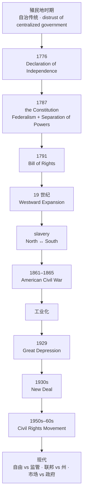
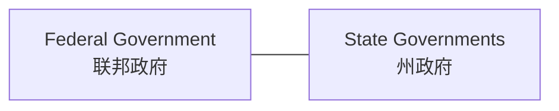
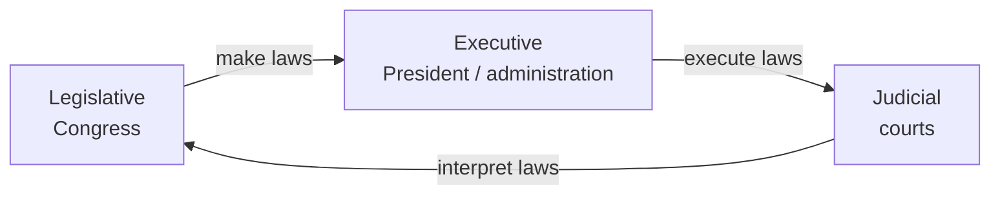
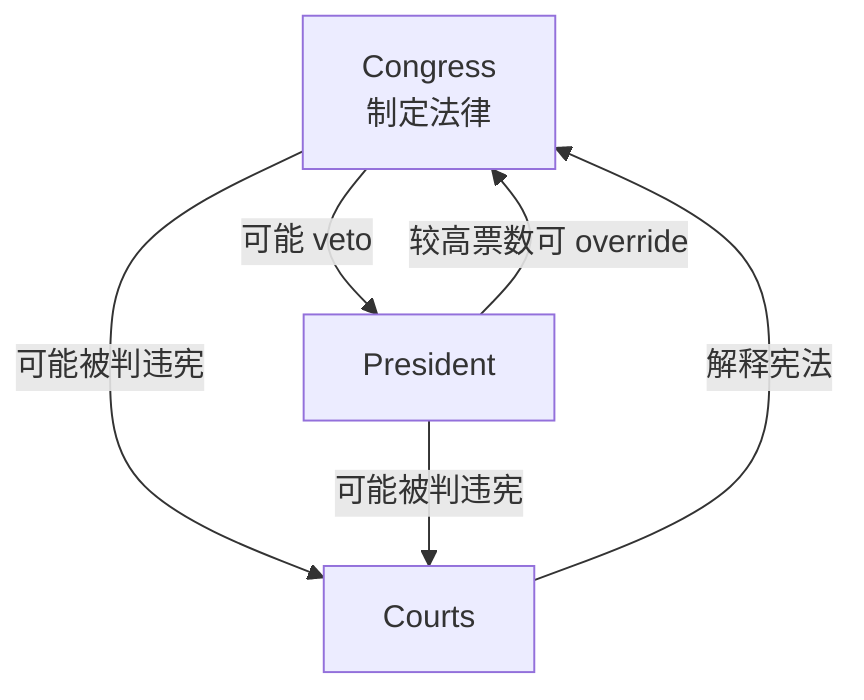
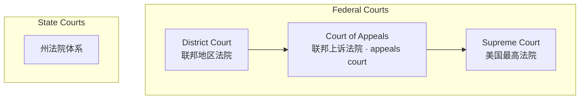
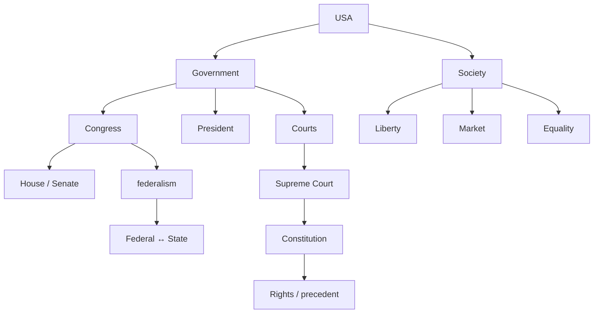

# 01 历史与制度骨架

> [!abstract] 本笔记导航
> **01 历史与制度骨架**（当前） · [[02 词汇与概念体系]] · [[03 冲突模型与真题对照]]
>
> 英语一政治法律类文章，作者默认你已经知道美国的制度长什么样，然后直接讨论"政府该不该管""联邦管还是州管""法院有没有权推翻政策"。这篇笔记解决的就是这层默认背景——**谁有权、权力从哪来、权力之间怎么互相卡住**。

---

## 一、总框架：美国到底是一个什么样的国家

> [!important] 底层公式
> **美国政治文化 = 自由主义传统 + 对政府权力的不信任 + 权力制衡 + 市场经济**

这里的"自由主义"不等同于今天美国民主党的 liberal，而是更古老的含义：**个人的权利优先，政府权力必须受到限制。**

所以美国政治制度的底层思维不是"怎样让政府更强"，而是：

> [!important] 一句话总纲
> **不是怎样让政府更强，而是怎样防止政府权力失控。**

这一条几乎能解释考研英语一里大量的美国政治、法律文章。

> [!question] 看到这些词，脑子里先浮现的不是词义
> `constitutional` · `Supreme Court` · `federal government` · `state` · `regulation` · `privacy` · `liberty` · `rights` · `individual` · `government intervention` · `authority` · `judicial`
>
> 而是 —— ==**"权力边界问题。"**==

---

## 二、历史主线：真正需要记的只有一条线

### 1. 欧洲殖民 → 北美十三殖民地

17—18 世纪，英国在北美建立殖民地。这里有一个非常重要的文化背景：**殖民地长期具有比较强的自治传统。** 也就是说，美国人从一开始就不习惯一个遥远的中央政府什么都管。由此形成了美国文化中一个很强倾向：

**distrust of centralized government（对强大中央政府的天然警惕）**

这件事非常重要，它后来发展成：`states' rights` 州权、`limited government` 有限政府、`local autonomy` 地方自治、`federalism` 联邦制。

### 2. 关键节点速览

### 3. 1776：美国独立

**1776 — Declaration of Independence《独立宣言》**

《独立宣言》确立了美国政治文化最重要的一套价值观：

**life（生命） · liberty（自由） · pursuit of happiness（追求幸福）**

> [!warning] liberty 不只是"自由"
> 英语阅读里 `liberty` 是一个极其重要的美国政治关键词。它经常隐含：==**政府不能随便干涉个人。**==

### 4. 1787：美国宪法

**1787 — the Constitution**

美国宪法建立了现在美国政府的大框架，最重要的就是两个制度：

> [!important] 宪法的两块基石
> **Federalism + Separation of Powers（联邦制 + 三权分立）**

### 5. 1791：Bill of Rights《权利法案》

美国宪法后来增加了一系列修正案，最著名的前十条即《权利法案》。其中心思想是：

**保护个人免受政府过度干预**

所以英语一里 `individual rights`、`civil liberties`、`constitutional rights` 出现时，都和这套传统有关。

### 6. 西进运动与边疆精神

**Westward Expansion｜19 世纪**

美国从东部逐渐向西扩张。不需要背战争细节，但要知道它影响了美国文化：土地、迁徙、机会、自主、冒险。

### 7. 奴隶制：美国历史第一大矛盾

美国早期存在严重的 **slavery（奴隶制）**，主要集中于南方农业经济，逐渐形成 `North` ↔ `South` 的矛盾。

### 8. 1861—1865：Civil War 美国内战

**1861–1865 — American Civil War**

核心背景之一是 `slavery`，同时还涉及 `federal vs state power`。

**Abraham Lincoln** 只需要知道：总统、`Civil War`、`abolition of slavery` 即可。

`abolish` 废除；`abolition` 废除；`abolitionist` 废奴主义者。

### 9. 内战之后并没有马上实现种族平等

> [!warning] 最容易读错的一处
> 奴隶制废除了 ==**≠**== 种族歧视消失。随后长期存在 **segregation（种族隔离）**，即 `racial segregation`。

### 10. 1950s–1960s：Civil Rights Movement

**Civil Rights Movement 民权运动**，核心是 `ending racial segregation and discrimination`。

**Martin Luther King Jr.** 知道他是 `civil rights leader` 即可，其核心文化符号是 **equality（平等）**。

### 11. 1929：Great Depression 大萧条

1929 年以后的大萧条导致美国出现严重的 `unemployment`、`bank failures`、`poverty`，也改变了美国政府与经济的关系。

### 12. FDR & New Deal 新政

Franklin D. Roosevelt（`FDR`）推出 **New Deal（新政）**，核心变化是：**联邦政府开始更加积极介入经济与社会保障。**

因此美国 20 世纪政治争论形成一条主线：

> [!important] 20 世纪的政治主轴
> **New Deal government ↔ limited government**

### 13. Reagan 与保守主义回潮

1980 年代，Ronald Reagan 在政治经济上强调 `lower taxes`、`deregulation`、`smaller government`、`market forces`。

**Reaganomics** 通常与 **free market** 联系在一起。

### 14. 最后只背这几个年份

> [!success] 只需要记这 7 个
> **1776** 独立 → **1787** 宪法 → **1791** 权利法案 → **1861–1865** 内战 → **1929** 大萧条 → **1930s** New Deal → **1950s–60s** Civil Rights Movement
>
> 其他年份，对英语一阅读的重要程度明显低一个档次。

---

## 三、Federalism 联邦制（第一个超级重点）

很多英语一法律题，如果不知道联邦制，非常难读。美国不是"中央政府 → 地方政府"这种单纯上下级关系，而是：

即 **联邦政府和州政府各自拥有一定权力**。

> [!note] 两个词的默认含义
> **`Federal`** 表示"联邦的"：`federal government` 联邦政府、`federal law` 联邦法律、`federal court` 联邦法院、`federal agency` 联邦机构。
>
> **`State`** 在考研阅读里非常重要——它很多时候不是"国家"，而是 ==**州**==。例如 `state law` 通常不是"国家法律"，而是 **州法律**。

### 为什么英语一特别喜欢考联邦—州冲突

因为美国大量公共政策争议，本质都是：**到底应该由 Washington 管，还是由 states 自己决定？**

常见领域：教育、环境、医疗、税收、商业监管、劳动法、隐私、选举、枪支、婚姻、堕胎、大麻。

因此看到下面这些表达：

> [!example] 出现即预警
> `states are allowed to...` / `federal regulators...` / `state lawmakers...` / `federal authority...`
>
> 一定要意识到：==**可能在讨论 Federal power vs State power。**==

---

## 四、Separation of Powers 三权分立（第二个超级重点）

| 权力 | 机构 | 核心作用 |
|---|---|---|
| Legislative | Congress | 制定法律 |
| Executive | President / administration | 执行法律 |
| Judicial | courts | 解释法律 |

> [!success] 考研最容易记的版本
> **Congress → make laws**
> **President → execute laws**
> **Courts → interpret laws**

---

## 五、Congress：国会到底是什么

**Congress = House + Senate**（两院制）

| 院 | 英文 | 席位 |
|---|---|---|
| 众议院 | House of Representatives（the House） | **435** 个有投票权的席位，按各州人口分配 |
| 参议院 | Senate | 每州 2 名 → **100 Senators** |

### 为什么设计成两院

本质上是一个 `compromise`。人口大的州希望"人多，议员也应该更多"，所以 House 按人口分配。但人口小的州认为"那我们永远被大州压制"，所以 Senate 每州一律 2 席。

> [!important] 一句话记住两院
> **House = population**
> **Senate = states**
>
> 这个设计本身就是美国 **checks and balances** 精神的体现。

---

## 六、Checks and Balances 制衡（全文超级高频思想）

通常翻译为"制衡"。核心不是单纯"三权分立"，而是：

> [!important] 定义
> **让不同权力互相限制**

即 **Congress ↔ President ↔ Courts** 互相限制。

---

## 七、总统与 Executive Branch

总统属于 **Executive Branch（行政部门）**。

> [!warning] administration ≠ 整个美国政府
> `the Obama administration` 不是"奥巴马政府所有政治机构"，更准确的理解是 ==**奥巴马政府的行政当局**==。同理还有 `Biden administration`、`Trump administration`。

### President ≠ Congress

这个观念非常重要。中国学生很容易把"美国政府"理解成一个统一整体，但英语阅读里，`President` 和 `Congress` 甚至可能完全互相反对。例如总统希望通过政策 A，但国会 `refuses to approve it`，这完全正常。

---

## 八、美国法院体系

> [!important] 两组法院不能混
> **Federal Courts ≠ State Courts**

### justice 不是只有"正义"

> [!danger] 高频埋伏词
> `justice` 可以表示"正义"，但 `Justice` 尤其和 `Supreme Court` 一起出现时，经常是 ==**法官 / 大法官**==。
>
> `Supreme Court justices` = **最高法院大法官**，而不是"最高法院的正义"。

---

## 九、Supreme Court：考研英语一政治阅读第一核心机构

历年题目里最高法院相关内容出现得非常明显——2010 Text 2 商业方法专利、2013 Text 4 最高法院，以及大量法律、商业、隐私问题，背后都会涉及 **Supreme Court**。

因为最高法院可以解释 **Constitution（宪法）**。美国政治里有一个非常重要的概念：

> [!important] judicial review 司法审查
> 法院可以审查政府行为或者法律是否违反宪法。

所以你经常看到 **unconstitutional**，意思是 **违宪的**：

> [!quote] 真题级例句
> The law was ruled unconstitutional.

不是简单说法院"不喜欢这个法律"，而是 ==**法院认为这个法律违反宪法**==。

### 为什么美国法院经常决定"大政治问题"

因为美国大量政治问题最后都会变成：`Constitution` 到底怎么解释？比如 `speech`、`privacy`、`abortion`、`gun rights`、`voting`、`race`、`same-sex marriage`、`business regulation`，最后都会进入法院。

因此美国新闻里经常出现：

> [!example] 三句新闻套话
> `Supreme Court ruled...` / `justices held that...` / `the court struck down...`

### 三个法院高频动词

| 动词 | 阅读义 | 例句 |
|---|---|---|
| `uphold` | 维持 | `uphold a law`（法律继续有效） |
| `strike down` | 判定……无效 / 推翻 | The Supreme Court struck down the law. |
| `overturn` | 推翻 | `overturn a previous ruling` |

### precedent 判例 / 先例

法院通常会参考过去类似案件。因此出现 `legal precedent`、`judicial precedent`、`established precedent` 时，你应该自动想到：

**以前法院怎么判，现在法院是否遵循过去的判法。**

完整司法词群见 [[02 词汇与概念体系]]。

---

## 十、为什么考研会不断考美国法律

2010—2025 之间，专利、隐私、法律服务、最高法院、税收、劳动法、湿地保护、商业监管频繁出现。因为美国社会里有一个很重要的逻辑：

> [!important] 美国社会的传导链
> **social conflict → legal dispute → court**

所以美国社会争议非常容易被"法律化"（`legalistic`）。各种 `commercial dispute`、`employment dispute`、`environmental dispute`、`privacy`、`civil rights` 都很容易进入 **litigation（诉讼）**。所以 2014"法律服务费用"那一类真题才特别典型。

---

## 十一、Bill of Rights 与 First Amendment

**1791 — Bill of Rights《权利法案》**，中心思想是 **保护个人免受政府过度干预**。

**First Amendment 第一修正案**：考研不用背全部条文，记住核心之一 **freedom of speech（言论自由）**，此外还涉及 `freedom of religion`、`freedom of press`、`assembly`。

所以美国媒体类文章里经常出现 `free speech`、`freedom of the press`——背后并不只是文化习惯，而有 **constitutional protection**。

### 为什么美国媒体敢疯狂批评总统

因为 **Freedom of the Press** 是美国政治文化的重要部分。媒体经常被称为 **watchdog（监督者）**，含义是 `media should monitor people in power`。

> [!warning] 不要读成"媒体在反政府"
> 英语阅读写媒体批评政府时，美国政治传统恰恰认为：==**监督政府本来就是媒体的一部分职责。**==

---

## 十二、Constitution 的深层作用：把所有争论分成两层

> [!question] 看到美国政治文章，先分层
> **第一层：政策** —— 这项政策好不好？
>
> **第二层：宪法** —— 政府有没有权这么做？
>
> 第二层往往才是美国法律文章真正讨论的核心。

即 **Is it good? ≠ Is it constitutional?**

一个政策可能是好政策，但法院仍可能认为政府没有宪法权力这样做。这一点对英语一法律阅读特别重要。

---

## 十三、美国政治阅读最小脑图

> [!success] 用法
> 这张图足够帮助你处理绝大多数美国政治背景。考场草稿纸上直接默画。

---

> [!abstract] 继续阅读
> [[02 词汇与概念体系]] · [[03 冲突模型与真题对照]]
