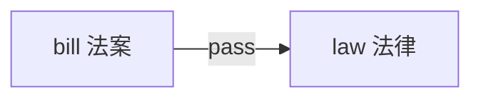

# 02 词汇与概念体系

> [!abstract] 本笔记导航
> [[01 历史与制度骨架]] · **02 词汇与概念体系**（当前） · [[03 冲突模型与真题对照]]
>
> 制度骨架见 [[01 历史与制度骨架]]。这一篇处理**语言层**：同一个词在美国政治语境里到底指什么，以及哪些词是中国学生最容易按汉语字面意思读错的。

> [!danger] 先记住这 9 个"不是它的字面意思"的词
> `state` 不是国家 · `justice` 不是正义 · `appeal` 不是吸引力 · `case` 不是情况 · `business` 不是生意 · `campaign` 不是宣传活动 · `agency` 不是代理机构 · `welfare` 不是幸福 · `entitlement` 不是权利感
>
> 另有三个借代地名：`Washington` · `Capitol Hill` · `the White House`

---

## A. 政治光谱与政党

### liberal / conservative

这是中国学生最容易按照汉语字面意思读错的一组词。

| 词 | 美国政治含义 | 典型主张 | 偏 |
|---|---|---|---|
| `liberal` | 偏左 / 自由派 | government social programs、environmental regulation、minority rights、abortion rights、stronger social welfare、progressive social policies | Democrats |
| `conservative` | 偏右 / 保守派 | limited government、lower taxes、free market、traditional values、gun rights、states' rights | Republicans |

> [!warning] 不要机械套用
> ==**这只是总体倾向，不是所有人的绝对立场。**== 做阅读千万不要机械套用"Democrat = 一定支持政府"或者"Republican = 一定反对监管"。**真题以原文为准。**

### Democrats & Republicans

**Democratic Party 民主党**，成员 `Democrat`，总体偏 `center-left`。
**Republican Party 共和党**，成员 `Republican`，总体偏 `center-right`。

| | Democrats | Republicans |
|---|---|---|
| 大致 | 左 | 右 |
| liberal | 较多 | 较少 |
| conservative | 较少 | 较多 |
| 福利 | 较支持 | 较谨慎 |
| 环境监管 | 较支持 | 较谨慎 |
| 市场监管 | 相对更多 | 相对更少 |
| 税收 | 更接受累进税 | 更强调低税 |
| 州权 | 相对较弱 | 通常更强调 |

### 左右派争论的真正轴线

英语一政治经济类文章大量围绕这根轴展开。

---

## B. 政府机构词群

### 美国"政府"相关词有四种，必须区分

| 词 | 阅读义 |
|---|---|
| `government` | 最宽泛：政府 |
| `administration` | 某总统领导的行政当局 |
| `federal government` | 联邦政府 |
| `state government` | 州政府 |

> [!warning] 别扩大化
> 原文如果写 `the administration`，千万不要直接扩大成 ==**"整个美国国家机关"**==。

### agency / regulator

`agency` 除了"代理机构"，在政府文章中指 **政府机构**，例如 `federal agency` 联邦政府机构。

`regulator` 监管机构 / 监管者；`regulatory agency` 监管机构。

### bureaucracy

**官僚体系**。语气有时中性，但经常带"程序复杂、低效率"的意味。`bureaucratic` 官僚主义的 / 官僚体系的。

### 三个借代地名（熟词僻义）

| 原文 | 实际含义 |
|---|---|
| `Washington` | 美国联邦政府 / 美国政界（不是"华盛顿市民"） |
| `Capitol Hill` | 美国国会 / 国会政治（不是普通山丘） |
| `the White House` | 总统及其行政当局（不只是建筑） |

类似地，`Beijing` 有时也可借指中国政府。

---

## C. 立法程序词群

### bill / act / law 的区别

| 词 | 阅读义 |
|---|---|
| `bill` | **法案**——还没正式成为法律 |
| `act` | 往往指已经正式通过的某部法律，例如 `Clean Air Act` |
| `law` | 法律——最广泛 |

### legislation / legislator / legislature

`legislation` 立法 / 法律法规；`legislator` 立法者 / 议员；`legislature` 立法机关。

> [!warning] 这三个不要混
> `-ion` 是==**产物**==，`-or` 是==**人**==，`-ure` 是==**机关**==。

### Congress 相关高频词表

| 英文 | 阅读义 |
|---|---|
| `Congress` | 国会 |
| `congressional` | 国会的 |
| `lawmaker` | 议员、立法者 |
| `legislator` | 立法者 |
| `House` | 众议院 |
| `Senate` | 参议院 |
| `senator` | 参议员 |
| `representative` | 众议员 |
| `bipartisan` | 两党共同的 |
| `partisan` | 党派性的 |

`bipartisan`（bi = two）→ **两党共同支持的**，例如 `bipartisan support` 两党支持。
`partisan` → **党派性强的**，例如 `partisan politics` 党派政治。

### lobby / lobbyist / interest group

`lobby` 作动词是 **游说**，例如 `companies lobbied Congress.` 公司游说国会。
`lobbyist` 游说者。美国允许利益集团合法影响政策。

> [!warning] interest group 不是"兴趣小组"
> 政治里是 ==**利益集团**==。例如 `business groups`、`environmental groups`、`labor unions`、`professional associations` 都会影响政策。

### campaign

> [!warning] 不是"商业宣传活动"
> 政治文章中的 `campaign` 是 ==**竞选活动**==。`campaign contribution` 竞选捐款。

---

## D. 选举与舆论词群

考研阅读不需要背复杂选举制度，知道下面这些即可：

| 英文 | 阅读义 |
|---|---|
| `election` | 选举 |
| `voter` | 选民 |
| `ballot` | 选票 |
| `candidate` | 候选人 |
| `campaign` | 竞选 |
| `primary` | 党内初选 |
| `Electoral College` | 选举人团 |

**Electoral College 选举人团**——美国总统不是简单全国"谁总票数多谁赢"，而是使用选举人团制度。考研如果看到，知道它是总统选举制度即可，不用掌握所有计算细节。

`public opinion` 公众舆论；`poll` 民意调查；`pollster` 民调人员。

### politics / politician / policy 一定区分

| 词 | 阅读义 |
|---|---|
| `politics` | 政治 |
| `politician` | 政治人物 |
| `policy` | 政策 |

> [!warning] 差一个字母，意思差很远
> `environmental policy` 是 ==**环境政策**==，不是"环境政治"。

---

## E. 司法词群

> [!question] 看到这些词直接切换司法语境
> `court` · `judge` · `justice` · `ruling` · `decision` · `case` · `lawsuit` · `appeal` · `legal challenge` · `constitutional` · `precedent`

| 英文 | 阅读义 |
|---|---|
| `sue` | 起诉 |
| `lawsuit` | 诉讼 |
| `plaintiff` | 原告 |
| `defendant` | 被告 |
| `litigation` | 诉讼 |
| `legal challenge` | 法律挑战 / 诉讼质疑 |
| `landmark case` | 具有里程碑意义的案件 |
| `ruling` | 裁决 / 判决 |
| `legal profession` | 法律职业 |
| `law firm` | 律师事务所 |

`attorney` / `lawyer`——两者考研里基本都可以理解为 **律师**。

### 熟词僻义四连

> [!danger] justice
> 除了"正义"，和 `Supreme Court` 一起出现时经常是 ==**法官 / 大法官**==。`Supreme Court justices` = 最高法院大法官。

> [!danger] appeal
> 名词可以是"吸引力"，但法律语境里是 ==**上诉**==。例如 `appeal a ruling`，对判决提出上诉。

> [!danger] case
> 法律语境里是 ==**案件**==，例如 `landmark case`。

> [!danger] rule / ruling
> `rule` 作动词是"法院裁定"，例如 `The court ruled that...` = 法院裁定……
> `ruling` 是 ==**裁决 / 判决**==（名词）。

### 三个法院高频动词

| 动词 | 阅读义 | 例句 |
|---|---|---|
| `uphold` | 维持 | `uphold a law`（法律继续有效） |
| `strike down` | **判定……无效 / 推翻** | `The Supreme Court struck down the law.` |
| `overturn` | 推翻 | `overturn a previous ruling` |

配套概念 **unconstitutional 违宪的**——`The law was ruled unconstitutional.` 不是"法院不喜欢这个法律"，而是"法院认为它违反宪法"。

### 为什么美国社会如此依赖法院和律师

因为美国社会本身 **legalistic**，法律化程度很高。`commercial dispute`、`employment dispute`、`environmental dispute`、`privacy`、`civil rights` 都很容易进入 `litigation`。

---

## F. 经济与商业词群

### free market

美国文化的另一个核心是 **free market 自由市场**。因此美国政治经济文章经常讨论 `competition`、`business`、`entrepreneurship`、`private enterprise`、`monopoly`、`regulation`、`antitrust`。

### regulation（理解美国文章必须真正掌握）

不是简单"规则"。政治经济文章里通常指 **政府监管**，例如 `environmental regulation`、`financial regulation`、`government regulation`。

为什么这个词如此重要？因为美国长期存在两个声音：

> [!example] 两根轴上的两种声音
> 一派：`market should regulate itself`（市场应该自行运行）
>
> 另一派：`government intervention is necessary`（政府干预是必要的）

于是产生英语一最喜欢讨论的问题：==**regulation 是解决问题，还是制造问题？**==

### deregulation

和 `regulation` 相反：**放松监管**。考研经济类超级重要。

### business 在美国文章中的地位非常高

> [!warning] business 常常不是"生意"
> 英语一的 `business` 经常泛指 ==**企业界 / 商业力量**==。
>
> | 表达 | 阅读义 |
> |---|---|
> | `business interests` | 商业利益集团 |
> | `big business` | 大型企业 |
> | `business lobby` | 商业游说集团 |
>
> 所以文章说 `business opposed the proposal`，通常不是"某项生意反对政策"，而是 **企业界反对该政策**。

### corporation

**公司 / 企业法人**。对应形容词 `corporate` 公司的 / 企业的，例如 `corporate America`、`corporate interests`、`corporate power`、`corporate responsibility`。

### patent

**专利**。`patent protection` 专利保护；`patent holder` 专利权人；`grant a patent` 授予专利。

> [!important] 为什么专利问题很适合英语一
> 因为它天然存在 **innovation ↔ monopoly** 的张力：一方面专利保护鼓励创新，另一方面过度专利保护可能阻碍竞争。这种"双方都有道理"的议题是英语一最喜欢的。

### antitrust / monopoly

`antitrust` **反垄断**。`trust` 在这里不是"信任"，历史法律语境里和大型企业垄断组织有关。所以 `antitrust law` = 反垄断法。

`monopoly` **垄断**，对应 `competition` 竞争。经典冲突：**market power ↔ competition**。

### property rights

**财产权**。美国政治传统非常重视 `private property`。所以环境保护政策经常发生"政府为了保护环境限制土地所有者使用土地"的情况，这时就是 **environment ↔ property rights**。

---

## G. 福利与劳工词群

| 词 | 阅读义 |
|---|---|
| `welfare` | **福利**（不是"幸福"） |
| `welfare state` | 福利国家 |
| `social welfare` | 社会福利 |
| `Social Security` | 社会保障体系，尤其退休相关保障（不是"社会安全"） |
| `entitlement` | `government entitlement programs` = 依法有资格领取的政府福利项目（不是"权利感"） |

> [!warning] Social Security 与 entitlement
> `Social Security` 不要按字面译成 ==**"社会安全"**==；`entitlement` 必须结合语境，普通英语里的"权利感"义在这里不适用。

### labor / union

`labor` 在政治经济语境里是 **劳工**，而不只是"劳动"。
`labor union` 工会；`organized labor` 有组织的劳工 / 工会力量。

### employer / employee

**`employer` 雇主**（老板）；**`employee` 雇员**（员工）。最稳的记法：`employer employs people.`

### middle class / working class

**middle class 中产阶级**——美国政治文化尤其重视，大量公共政策会被包装成 `help the middle class`，因为"中产"几乎是 `American Dream` 的核心社会想象。

**working class 工薪阶层 / 劳工阶层**——不要机械翻成"工人阶级"然后自动套马克思主义阶级概念，美国英语语境通常更宽。

---

## H. 社会文化词群

### individualism

理解社会类阅读的第一文化关键词。**个人主义**——这里不要理解成"自私自利"。美国文化语境里的 `individualism` 更多是 **强调个人独立、个人选择、个人责任**。所以 **individual choice** 非常重要。

### self-reliance

**自立 / 依靠自己**。美国传统文化很推崇"靠自己"。这也解释了很多美国文章为什么会讨论：`poverty` 到底是个人责任还是结构问题？

### American Dream

核心想法是：

> [!important] American Dream
> **努力 → 成功**
>
> 或者 `regardless of birth, individuals can improve their lives through hard work.`（不论出身，通过努力可以改变命运。）

它和 **upward mobility（社会向上流动）** 紧密联系。

### self-made man

**`self-made` 白手起家的**；`self-made man` 靠自己奋斗成功的人。这是典型美国文化叙事。

> [!warning] 警觉点
> 文章如果在质疑 **meritocracy**，你就应该警觉。

### meritocracy

`merit`（能力）+ `cracy`（治理）。实际阅读可以理解为：**靠个人能力、成绩和努力获得社会地位的制度或理念。**

于是产生一个经典争论：

| 立场 | 归因 |
|---|---|
| 传统美国叙事 | 努力 + 能力 → 成功 |
| 社会批判者 | `family background` + `wealth` + `education` + `social inequality` 同样决定机会 |

### Puritanism / Protestant work ethic

早期北美殖民者中有清教徒群体。考研真正需要知道的不是神学，而是文化影响：

> [!important] Protestant work ethic 新教工作伦理
> 强调 `hard work`、`discipline`、`thrift`、`self-control`（勤奋 + 节制 + 自律），核心是 `hard work is morally valuable`——工作、勤奋本身被视为一种美德。
>
> 后来和资本主义、个人奋斗叙事联系起来，所以美国文化中特别容易产生 **success ↔ personal merit** 这种联系。

### frontier spirit

美国长期西进扩张，形成所谓 **frontier spirit 边疆精神 / 开拓精神**。文化印象包括 `independence`、`adventure`、`self-reliance`、`risk-taking`、`entrepreneurship`。

所以美国商业文化特别推崇 `entrepreneur` 创业者、`innovation` 创新、`risk` 冒险。

### immigration

美国本身就是一个典型的 **immigrant society 移民社会**。所以文章非常容易讨论 `immigrant`、`immigration`、`ethnicity`、`diversity`、`assimilation`、`multiculturalism`。

| 词 | 阅读义 |
|---|---|
| `melting pot` | 大熔炉——不同移民群体 `gradually integrate into American society` |
| `assimilate` | 同化 / 融入——`immigrants assimilate into American society.` |

### race / racial

英语一遇到 `race`、`racial`、`minority`、`discrimination`、`equality`、`diversity`、`civil rights`，背后往往涉及 **美国长期的种族问题**，而不是某个孤立事件。

相关词：`slavery` 奴隶制、`segregation` 种族隔离、`civil rights` 公民权利 / 民权、`Civil Rights Movement` 民权运动、`abolish` / `abolition` 废除、`abolitionist` 废奴主义者。

---

## I. 自由与平等的分层

### 美国阅读中的"自由"不是单一概念

| 类型 | 阅读义 | 谁更强调 |
|---|---|---|
| `political liberty` | 政治自由 | — |
| `civil liberty` | 公民自由 | 偏左 |
| `economic freedom` | 经济自由 | 偏右 |

两边都会使用 `freedom` 这个词。所以：

> [!question] 看到 freedom 先问自己
> ==**作者说的是哪一种自由？**==

### equality 也一样

| 类型 | 阅读义 | 争议程度 |
|---|---|---|
| `equality of opportunity` | 机会平等 | 美国传统政治文化更普遍接受 |
| `equality of outcome` | 结果平等 | 对"应该平等到什么程度"争议较大 |

这也解释了大量教育类真题：美国教育文章背后经常讨论 **education → opportunity → social mobility**。所以 `college degree` 往往不只是教育问题，而是 **阶层流动问题**。

---

## J. 英语一作者最容易批判的三种美国力量

> [!danger] 阅读时重点警觉这三类对象
> 1. **big business** 大企业
> 2. **government bureaucracy** 政府官僚体系
> 3. **entrenched professional interests** 固化的职业利益集团
>
> 这也是为什么真题经常讨论：==**政府监管会不会被企业影响？**==

---

## 🎯 自测：熟词僻义

先自己想，再点开核对答案

| 词 | 阅读义 |
|---|---|
| `state` | 州（不是"国家"） |
| `state law` | 州法律 |
| `justice` | 大法官（与 Supreme Court 连用时） |
| `appeal` | 上诉 |
| `case` | 案件 |
| `rule`（动词） | 法院裁定 |
| `business` | 企业界 / 商业力量 |
| `campaign` | 竞选活动 |
| `agency` | 政府机构 |
| `welfare` | 福利 |
| `entitlement` | 政府福利项目 |
| `Social Security` | 社会保障体系 |
| `Washington` | 美国联邦政府 / 美国政界 |
| `Capitol Hill` | 美国国会 |
| `the White House` | 总统及其行政当局 |
| `interest group` | 利益集团 |
| `antitrust` 里的 `trust` | 垄断组织（不是"信任"） |
| `administration` | 总统行政当局（不是整个国家机关） |

---

> [!abstract] 继续阅读
> [[01 历史与制度骨架]] · [[03 冲突模型与真题对照]]
