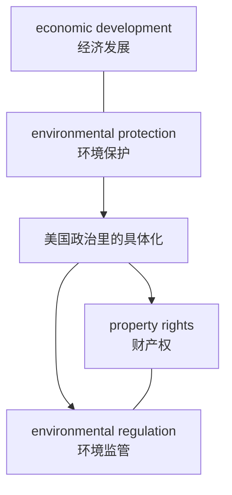
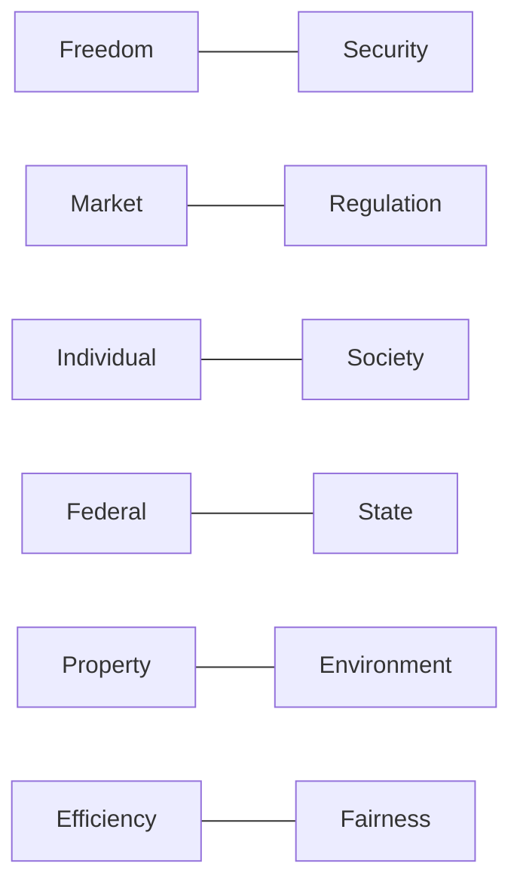

# 03 冲突模型与真题对照

> [!abstract] 本笔记导航
> [[01 历史与制度骨架]] · [[02 词汇与概念体系]] · **03 冲突模型与真题对照**（当前）
>
> 这是最该优先背的一篇。**把美国政治文化学成"冲突模型"，比单纯背美国历史效率高得多。**
>
> 英语一很少写成"好人 vs 坏人"。真正的模型通常是两个**都合理**的价值发生冲突，作者在两者之间做权衡或指出某一方的代价。

---

## 一、英语一里真正高频的五组美国政治矛盾

这五组建议直接背下来。

| # | 冲突组 | 一句英文锚点 |
|---|---|---|
| ① | Individual vs Government | `individual liberty` ↔ `government intervention` |
| ② | Federal vs State | `federal government` ↔ `state government` |
| ③ | Market vs Regulation | `free market` ↔ `regulation` |
| ④ | Individual responsibility vs Structural factors | `individual responsibility` ↔ `structural inequality` |
| ⑤ | Majority vs Minority rights | `majority rule` ↔ `minority rights` |

> [!important] ① Individual vs Government
> **individual liberty ↔ government intervention**（个人自由 ↔ 政府干预）
>
> 常对应：`privacy`、`speech`、`surveillance`、`regulation`

> [!important] ② Federal vs State
> **federal government ↔ state government**（联邦政府 ↔ 州政府）
>
> 对应：`law`、`education`、`environment`、`tax`、`healthcare`

> [!important] ③ Market vs Regulation
> **free market ↔ regulation**（自由市场 ↔ 政府监管）
>
> 对应：`business`、`finance`、`internet`、`environmental law`、`antitrust`

> [!important] ④ Individual responsibility vs Structural factors
> **individual responsibility ↔ structural inequality**（个人责任 ↔ 结构性因素）
>
> 对应：`poverty`、`employment`、`education`、`social mobility`
>
> 这一组的典型两种声音是：
>
> `poor people should work harder.`
>
> `poverty is caused partly by structural factors.`

> [!important] ⑤ Majority vs Minority rights
> **majority rule ↔ minority rights**（多数人的决定 ↔ 少数人的权利）
>
> 对应：`race`、`religion`、`gender`、`civil rights`、`constitutional rights`

---

## 二、六个条件反射

> [!important] 考前最该形成的肌肉记忆
> 下面六条不是知识，是**看到就自动触发的问题**。

> [!question] 看到 Supreme Court
> 不要只翻译。马上问：
>
> ==**谁的权利 vs 谁的权力？**==

> [!question] 看到 federal / state
> 马上问：
>
> ==**联邦和州到底谁有权管？**==

> [!question] 看到 regulation
> 马上问：
>
> ==**市场自由 vs 政府干预？**==

> [!question] 看到 privacy
> 马上问：
>
> ==**个人隐私 vs 公共利益 / 商业利益？**==

> [!question] 看到 poverty / inequality
> 马上问：
>
> ==**个人责任 vs 社会结构？**==

> [!question] 看到 environmental law
> 马上问：
>
> ==**环境保护 vs 经济利益 / 财产权？**==

> [!success] 效果
> 只要形成这六个条件反射，美国政治社会类文章会明显好读很多。

---

## 三、为什么英语一的美国文章常有"作者看起来谁都不完全支持"

因为美国公共议题很多不是"对 vs 错"，而是：

**Liberty vs Equality vs Efficiency vs Security**

例如 **surveillance 政府监控**：好处是 `security`，问题是 `privacy`。因此：

**security ↔ privacy**

### 冲突模型总表

| 冲突对 |
|---|
| Freedom ↔ Security |
| Market ↔ Regulation |
| Individual ↔ Society |
| Federal ↔ State |
| Property ↔ Environment |
| Efficiency ↔ Fairness |

### 隐私问题的固定框架

> [!question] 看到这些词，先想到同一条公式
> `data` · `surveillance` · `track` · `privacy` · `personal information` · `technology company`
>
> → **convenience / security ↔ privacy**
>
> 这是英语一科技政治交叉类的高频模板。

---

## 四、环境类真题背后的政治背景

涉及年份：2013 塑料污染、2016 英国乡村绿地、2017 夏威夷望远镜、2021 印尼扶贫与森林、2022 环境教育、2024 湿地保护。

理解这一层的关键词是 **property rights 财产权**（见 [[02 词汇与概念体系]]）。

> [!warning] 美国政治传统非常重视 private property
> 所以环保政策经常变成"政府为了保护环境限制土地所有者使用土地"，这时冲突就具体化为 ==**environment ↔ property rights**==。

---

## 五、商业法律类真题背后的模型

> [!important] patent 为什么天然适合出题
> 因为它天然存在 **innovation ↔ monopoly** 的张力。一方面专利保护鼓励创新，另一方面过度专利保护可能阻碍竞争。这种"双方都有道理"的议题是英语一最喜欢的。

`antitrust` 反垄断，`monopoly` 垄断。经典冲突：**market power ↔ competition**。

---

## 六、2010—2025 真题背景对照表

| 年份 | 题材 | 需要调用的背景框架 |
|---|---|---|
| 2010 Text 2 | 商业方法专利 | `patent law` + `Supreme Court` + `innovation` |
| 2012 Text 2 | 核电公司与水资源诉讼 | `corporation` + `lawsuit` + `environment` + `regulation` |
| 2013 Text 4 | 最高法院 | `Supreme Court` + `justice` + `ruling` + `law` + `rights` |
| 2014 Text 2 | 美国法律服务费用 | `legal profession` + `regulation` + `market` |
| 2015 Text 2 | 最高法院涉及手机隐私 | `law enforcement` ↔ `privacy` |
| 2017 Text 4 | 贫穷问题 | `personal responsibility` ↔ `structural poverty` |
| 2019 Text 4 | 网上购物征税 | `state` + `taxation` + `commerce` + `Supreme Court` |
| 2021 Text 4 | 宽带提供商 | `business` + `regulation` + `consumer` |
| 2022 Text 4 | 不正当解雇、劳动法律 | `employer` + `employee` + `labor law` + `court` + `contract` + `legal protection` |
| 2024 Text 4 | 湿地保护与法律挑战 | `private property` ↔ `environmental regulation`（常牵涉 Federal ↔ State） |

分年速记（点开逐条展开）

**2010 Text 2**：商业方法专利。本质涉及 `patent law` + `Supreme Court` + `innovation`。

**2012 Text 2**：核电公司与水资源诉讼。核心是 `corporation` + `lawsuit` + `environment` + `regulation`。

**2013 Text 4**：最高法院。直接要求你熟悉 `Supreme Court`、`justice`、`ruling`、`law`、`rights`。

**2014 Text 2**：美国法律服务费用。涉及 `legal profession` + `regulation` + `market`。

**2015 Text 2**：最高法院涉及手机隐私。背后的冲突是 **law enforcement ↔ privacy**。

**2017 Text 4**：贫穷问题。核心背景是 **individual responsibility ↔ structural inequality**（`personal responsibility` ↔ `structural poverty`）。文章里的两种声音通常是 `poor people should work harder.` 与 `poverty is caused partly by structural factors.` 这就是美国个人主义文化和社会政策之间的张力。

**2019 Text 4**：网上购物征税。非常典型：`state` + `taxation` + `commerce` + `Supreme Court`。

**2021 Text 4**：宽带提供商。典型：`business` + `regulation` + `consumer`。

**2022 Text 4**：不正当解雇、劳动法律。需要 `employer`、`employee`、`labor law`、`court`、`contract`、`legal protection`。

**2024 Text 4**：湿地保护与法律挑战。几乎就是经典模型 **private property ↔ environmental regulation**，同时还经常牵涉 **Federal ↔ State**。

### 教育类真题的同一条逻辑

真题里的 GPA、大学学位、环境教育、学校教育、文化教育，背后经常是：

> [!important] 教育题的底层公式
> **education → opportunity → social mobility**
>
> 所以 `college degree` 往往不只是教育问题，而是 ==**阶层流动问题**==。

---

## 七、触发式背景表（重点记这张）

| 原文看到 | 马上想到 |
|---|---|
| `Constitution` | 政府权力有没有越界 |
| `Supreme Court` | 宪法解释、权利冲突 |
| `justice` | 大法官 |
| `ruling` | 法院裁决 |
| `precedent` | 判例 |
| `state` | **很可能是"州"** |
| `federal` | 联邦 |
| `Congress` | 国会 |
| `House` | 众议院 |
| `Senate` | 参议院 |
| `administration` | 总统行政当局 |
| `regulation` | 政府监管 |
| `deregulation` | 放松监管 |
| `liberty` | 防止政府干预 |
| `privacy` | 个人权利 vs 安全 / 科技 |
| `property` | 私有财产权 |
| `liberal` | 美国政治偏左 |
| `conservative` | 美国政治偏右 |
| `Democrat` | 民主党 |
| `Republican` | 共和党 |
| `lobby` | 游说 |
| `interest group` | 利益集团 |
| `business` | **很可能是企业界** |
| `corporation` | 公司 |
| `patent` | 专利 |
| `antitrust` | 反垄断 |
| `welfare` | 社会福利 |
| `labor` | 劳工 |
| `union` | 工会 |
| `race` | 美国种族历史 |
| `civil rights` | 公民权利 / 民权 |
| `minority` | 少数群体 |
| `American Dream` | 努力 → 成功 → 阶层流动 |
| `merit` | 能力 / 功绩 |
| `mobility` | 社会流动 |
| `Washington` | **很可能借指联邦政府** |
| `White House` | 总统当局 |
| `Capitol Hill` | 国会 |

---

## 八、考前只背这 10 句话

> [!success] 如果只允许你考前背 10 句话
> 1. **美国政治的核心是限制政府权力。**
> 2. **Federal ≠ State，联邦政府和州政府存在权力分工。**
> 3. **Congress = House + Senate。**
> 4. **President 属于 Executive Branch，而不是 Congress。**
> 5. **Supreme Court 的重要功能之一是解释宪法。**
> 6. **liberty / privacy / property rights 是美国政治的核心个人权利。**
> 7. **美国经济长期存在 free market vs regulation 之争。**
> 8. **美国文化高度强调 individualism、self-reliance 和 American Dream。**
> 9. **美国社会议题经常是 individual responsibility vs structural inequality。**
> 10. **英语一政治法律文章，本质通常是在讨论两个都合理的价值发生冲突。**

第 10 条尤其重要。真正的模型通常是：

🎯 自测：遮住上面，先把六组冲突默写出来

| 冲突对 |
|---|
| Freedom ↔ Security |
| Market ↔ Regulation |
| Individual ↔ Society |
| Federal ↔ State |
| Property ↔ Environment |
| Efficiency ↔ Fairness |

---

> [!abstract] 继续阅读
> [[01 历史与制度骨架]] · [[02 词汇与概念体系]]
