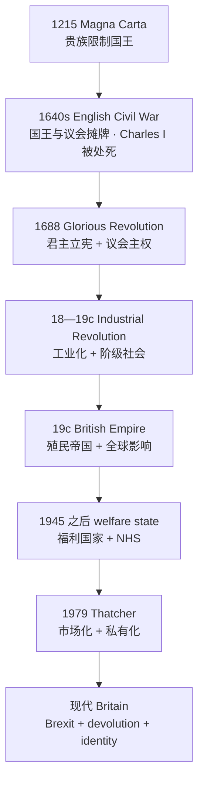
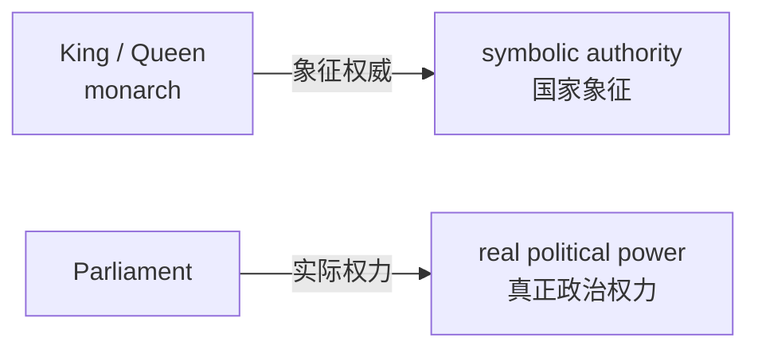
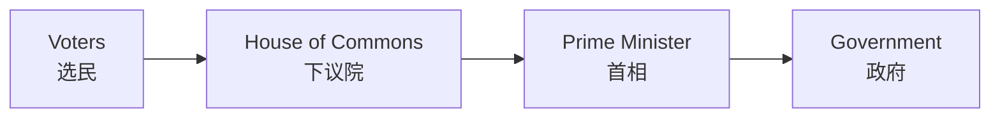
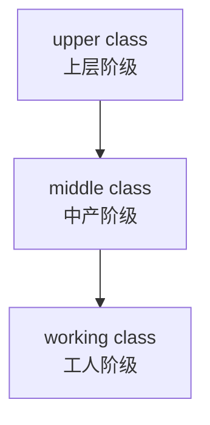
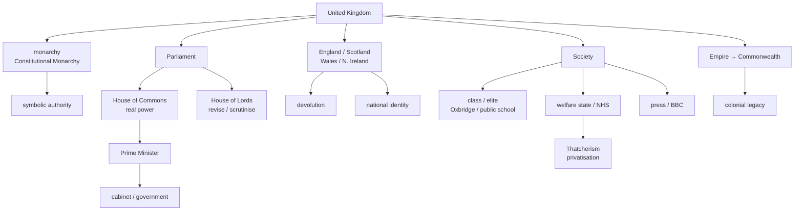

# 01 历史与制度骨架

> [!abstract] 本笔记导航
> **01 历史与制度骨架**（当前） · [[英国02 词汇与概念体系]] · [[英国03 冲突模型与真题对照]]
>
> 英国题材的文章有个共同前提：作者默认你知道"国王其实没权""议会才是核心""public school 不是公立学校"，然后直接开始讨论。这篇解决的就是这层默认背景，并且把它压缩成**一条能背下来的主线 + 一张能默画的关系图**。
>
> 美国那一套见 [[05_英语/美国政治背景/01 历史与制度骨架|美国政治背景 · 01 历史与制度骨架]]。

---

## 一、总框架：英国到底是一个什么样的国家

> [!important] 底层公式
> **英国政治文化 = 传统 + 渐进式改革（gradual reform）**

英国政治最重要的关键词不是 `democracy`，而是 ==**渐进式改革**==。

英国历史和法国、俄国最大的区别之一，是它很少通过彻底推翻旧制度来建立新制度，而更倾向于：

> **保留旧制度的形式，同时逐渐改变它的实际权力。**

所以今天英国会出现一些乍看很矛盾的东西：

| 看上去的矛盾 | 实际情况 |
|---|---|
| 有国王（`monarchy`） | 却是成熟的民主国家 |
| 有贵族院（`House of Lords`） | 却实行民主政治 |
| 没有一部统一的成文宪法 | 宪政制度却非常成熟 |
| 大量古老传统一直保留 | 实际政治早已现代化 |

> [!question] 看到这些词，脑子里先浮现的不是词义
> `tradition` · `convention` · `institution` · `gradual reform` · `continuity` · `compromise` · `evolution`
>
> 而是 —— ==**"传统 + 渐进改革"的政治文化。**==

> [!important] 英美对照第一句（很值钱）
> **美国是"设计出来的"**——1787 年一次性立宪，制度可以被讨论"该不该这样设计"。
>
> **英国是"长出来的"**——几百年连续演进，制度很少被整体推翻。
>
> 所以英国文章里的 `reform` 往往不是"推倒重来"，而是 ==**调整既有制度**==。

---

## 二、历史主线：只需要记这一条线

> [!success] 贯穿始终的一条主轴
> **tradition ↔ reform**
>
> 上面每一个阶段，都是"旧形式保留 + 新功能生长"。这几乎可以看成理解英国政治文化的**总钥匙**。

> [!success] 只需要记这几个年份
> **1215** Magna Carta → **1640s** Civil War → **1688** Glorious Revolution → **18—19c** Industrial Revolution → **1948** NHS → **1979** Thatcher → **2016** Brexit
>
> 其他年份，对英语一阅读的重要程度明显低一个档次。

---

## 三、Magna Carta：限制国王（1215）

**1215 — Magna Carta（大宪章）** 是一个非常重要的文化符号。

它最初**并不是现代意义上的民主文件**，而是 ==**贵族限制国王权力的协议**==。但后来它被英国人不断重新解释，逐渐成为 **government is subject to law** 的象征，即：

> [!important] 大宪章真正的历史作用
> **政府也必须受法律约束。**

所以阅读中看到下面这组词：

> [!example] 出现即预警
> `Magna Carta` · `rule of law` · `arbitrary power` · `constitutional liberty` · `tyranny`
>
> 要联想到 —— ==**限制政府权力。**==

顺带把 `rule of law` 在这里钉死：

> [!important] rule of law ≠ "用法律管理国家"
> 真正的含义是：==**任何人，包括政府，都受法律约束。**==
>
> 所以它通常和 `arbitrary power`（专断权力）、`liberty`、`constitutionalism`、`judicial independence` 连在一起出现。中国的"依法治国"若按"以法管民"去理解，在这里会读反。

---

## 四、Parliament：议会逐渐崛起

**Parliament（议会）** 后来逐渐成为国家政治中心。英国议会分为两院：

> [!important] 两院结构
> **Parliament = House of Commons + House of Lords**
>
> - **House of Commons** 下议院 —— 议员（`MP`, Member of Parliament）由选民直选产生
> - **House of Lords** 上议院 —— 传统上是贵族院，今天成员主要为**任命产生**，不是选举产生

> [!important] 考研里最需要记住的一句
> **真正掌握主要政治权力的是下议院（House of Commons）。**
>
> 上议院今天主要起审议、修正、监督作用——正是第一节说的那种"形式保留、权力转移"的典型。

相关词：`MP` 议员 · `seat` 席位 · `constituency` 选区 · `majority` 多数席位 · `cabinet` 内阁。

> [!warning] 别把上议院理解成"英国版参议院"
> 美国的 Senate 与 House 是两种选举逻辑的立法机构，权力接近；英国的上议院 ==**不是选举产生、也不再是权力中心**==。两者不能类比。

---

## 五、17 世纪：English Civil War 英国内战

这是英国政治史最值得记的一段——**国王与议会发生严重冲突**。

核心问题其实是一句话：

> [!question] 内战真正争的是什么
> ==**国王能不能不受议会限制地统治？**==

后来爆发 **English Civil War（英国内战）**，国王 **Charles I 被处死**。

> [!important] 这件事为什么重要
> 因为它意味着 ==**国王不是绝对不可挑战的**==。
>
> 这是英国政治思想史上一次不可逆的转折：王权从"神授且不可质询"变成"可以被追究"。

---

## 六、1688 Glorious Revolution：宪政关键节点

**1688 — Glorious Revolution（光荣革命）**

1688 年以后，英国逐步确立：

> [!important] constitutional monarchy 君主立宪制
> **国王存在，但必须在法律和宪政规则范围内行使权力。**

之后形成：

> [!important] parliamentary sovereignty 议会主权
> 最高权力在议会，而不在国王。

于是英国政治的权力归属被彻底定格：

---

## 七、今天的国王到底有什么用

这是英语文章里最容易误解的地方。

英国是 **constitutional monarchy（君主立宪制）**：

| 职位 | 英文 | 实际含义 |
|---|---|---|
| 国王 / 女王 | `monarch` / `the Crown` | **head of state** 国家元首 —— 国家象征 |
| 首相 | `Prime Minister` | **head of government** 政府实际领导人 |

> [!warning] head of state ≠ head of government
> 这是英美政治文章里非常值钱的一对区分。英国国王是 ==**国家元首**==，但政府实际由首相领导；美国总统则**同时**是国家元首和政府首脑。

国王的很多行为是 **ceremonial（仪式性的、象征性的）**。这也是考研阅读的常见逻辑：

> [!important] 一个高频判断
> 某个传统机构可能 ==**symbolically important but politically limited**==——
> **象征意义很大，实际政治权力有限。**

> [!quote] 真题原句（讲欧洲王室的存废）
> It is only the Queen who has preserved the monarchy's reputation with her rather ordinary (if well-heeled) granny style.（2015 · Text 1）
>
> Charles ought to know that as English history shows, it is kings, not republicans, who are the monarchy's worst enemies.（2015 · Text 1）

后一句几乎是第六节那段历史的回声：**王权最大的敌人从来是国王自己**，而不是共和派。这句话的深层预设就是"君主制之所以还能存在，靠的是自我克制而非权力"。

---

## 八、英国政治体系：至少要看懂这张图

正常情况下：**下议院中拥有多数席位的政党组成政府**，其领导人通常成为 `Prime Minister`。

所以英国属于：

> [!important] 两种制度必须区分
> **parliamentary system 议会制** —— 英国：选民选议员，议员中的多数党领袖当首相
>
> **presidential system 总统制** —— 美国：选民分别选总统和议员，总统与国会各自有独立授权
>
> 这决定了两种政治文章的逻辑差异：英国的"政府"由议会多数构成，==**首相可被本党议员赶下台**==；美国总统在任期内基本不会被议会罢免。

---

## 九、英国为什么"没有一部宪法"

这是英国政治文化很典型的一点。

美国有 **the Constitution**（一部成文宪法文本）；英国没有一份单独、统一的成文宪法。英国宪政体系来自很多东西：

- `Acts of Parliament` 议会立法
- `judicial decisions` 司法判决
- `conventions` 宪政惯例
- `historical documents` 历史文件（如 Magna Carta）

所以一般说英国拥有：

> [!danger] 最容易翻译错的一个术语
> **`uncodified constitution`（不成文宪法 / 未编纂宪法）**
>
> 注意：**不是说英国"没有宪法"**，而是 ==**没有一部统一编码的宪法文本**==。
>
> 译成"英国没有宪法"会直接读错文章立场；译成"没有成文宪法"也容易引起误解，最好记成"**宪法规则分散在立法、判例和惯例里**"。

这再次体现了英国制度的核心特征：

> [!important] 一句话
> ==**历史演进，而非一次性设计。**==

---

## 十、Industrial Revolution：理解英国社会文化最重要的背景

**18—19 世纪 — Industrial Revolution（工业革命）** 首先大规模发生于英国，于是英国从农业社会迅速变成工业社会。带来三样东西：

| 英文 | 中文 | 阅读意义 |
|---|---|---|
| `urbanization` | 城市化 | 人口向城市集中，城市问题出现 |
| `industrial capitalism` | 工业资本主义 | 资本、工厂、雇佣劳动 |
| `working class` | 工人阶级 | 新的社会集团诞生 |

> [!note] 为什么这段要放在政治笔记里
> 因为**阶级社会的底层结构就是工业革命铺出来的**。后面要讲的 `class`、`welfare state`、`trade union`、`Labour Party`，全都建立在这一层上。

---

## 十一、为什么英国文章特别强调 class

这是英国文化文章里的超级高频背景。

英国社会长期具有很强的 **class consciousness（阶级意识）**。传统上可以粗略理解成三层：

英国人的 `accent`（口音）、`education`、`occupation`、`neighborhood`，历史上都可能透露阶级背景。

> [!warning] 极其重要的一处理解
> 阅读里的 `class`，很多时候**不是马克思主义政治意义上的"阶级斗争"**，而是 ==**社会阶层、社会身份、文化区隔**==。
>
> 英国人说一个人 `class-conscious`，往往是在讲**生活方式与文化优越感**，而不是在讲革命。

难点还在于：`class` 也常作"类别""等级"用。真题里 "an entire class of patents"（一整类专利）、"a class of..." 都是这个意思，不要一见 class 就想"阶级"。

---

## 十二、精英教育与 Oxbridge

英国很多社会精英来自少数名校，最典型的是：

> [!important] Oxbridge
> **Oxford + Cambridge = Oxbridge**（牛津剑桥）

英国历史上的 `politicians`、`judges`、`civil servants`（公务员）、`academics` 中，Oxbridge 毕业生比例长期很高。

因此英国教育类文章非常喜欢讨论两个词：

| 英文 | 中文 | 说明 |
|---|---|---|
| `elitism` | 精英主义 | 少数精英机构主导社会 |
| `social mobility` | 社会流动 | 个人能否突破出身向上走 |

典型争论：

> [!question] 教育类文章的标准问法
> ==**名校到底促进社会流动，还是复制社会阶层？**==
>
> 这和英国的阶级社会背景直接相关，也是英国教育文章最爱的张力。

> [!quote] 注意一个"假朋友"
> 真题里的 `Oxford` 不一定是英国名校语境。2018 · Text 1 的 "a University of Oxford study" 只是**研究出处**，文章讨论的是美国就业市场。**机构名要看清是不是文章背景。**

---

## 十三、最容易坑中国学生的词：public school

> [!danger] 这个词按字面读一定错
> 英国语境里的 **`public school`** 很多时候**并不是"公立学校"**，反而是历史悠久的 ==**elite private school（精英私立学校）==**，例如 **Eton（伊顿公学）**。

| 语境 | `public school` 的含义 |
|---|---|
| 英国传统用法 | **顶级私立寄宿学校**（学费昂贵、门槛极高，历史名称来自"面向公众招生"而非"公费办学"） |
| 美国用法 | **公立学校**（政府出资、免费就读） |
| 今天英国的通用说法 | 官方统计里叫 **`independent school` / `private school`**，`state school` 才是公立校 |

所以考研文章如果讲 "British public schools"，千万不要自动翻译成"中国意义上的公立学校"。

> [!warning] 这对词一起记才保险
> **`public school`（英）≈ 精英私校 ↔ `state school` ≈ 公立学校**
>
> 这是英美文化差异里的经典埋雷点。

---

## 十四、19 世纪：British Empire 帝国时代

维多利亚时代的英国成为世界霸权，出现：

> [!important] British Empire 大英帝国
> 历史上常说 ==**the empire on which the sun never sets**==（日不落帝国）——因为属地横跨各时区，任何时刻总有领土在阳光下。

英国曾统治或控制 `India`、`Canada`、`Australia`、`large parts of Africa`、`parts of Asia` 等大量地区。

---

## 十五、为什么今天英国文章经常讨论 colonialism

因为现代英国的很多社会问题都与帝国历史有关。常见关键词：

| 英文 | 中文 |
|---|---|
| `colonialism` | 殖民主义 |
| `imperialism` | 帝国主义 |
| `legacy` | 历史遗产 / 后果 |

文章会讨论 **the legacy of the British Empire**。这里的 `legacy` **不是**"帝国留下了多少建筑"，而更多是：

> [!important] legacy 的真正含义
> ==**历史持续影响今天。**==

比如：`immigration`（移民）、`race`（种族）、`museums`（博物馆与文物归还）、`cultural identity`（文化认同）、`Commonwealth`。

> [!danger] legacy 是个"熟词僻义"高发词
> 它在美国文章里也常指**"遗留业务 / 老业务"**，例如 2016 · Text 4 讲传统报纸时反复用 "a legacy business""a legacy product"——意思是==**过去的业务模式**==，不是"历史遗产"。看语境判。

---

## 十六、Commonwealth 是什么

> [!important] 英联邦
> **`Commonwealth`** —— 很多成员国曾经与英国殖民帝国存在历史关系。

所以两个概念要分层：

| 概念 | 性质 |
|---|---|
| `Empire` | **历史概念**——帝国本身 |
| `Commonwealth` | **现代国际关系概念**——今天的国家间组织 |

---

## 十七、二战以后：从"帝国"到"福利国家"

二战以后英国政治发生重要转型。关键词：

> [!important] welfare state 福利国家
> 英国政府承担更多社会责任：`healthcare` · `education` · `social security` · `unemployment assistance`

最典型的制度是：

> [!important] NHS
> **NHS = National Health Service**（英国国家医疗服务体系）——1948 年建立，核心原则是==**医疗按需提供、由税收支持、使用时基本不直接付费**==。

---

## 十八、为什么 NHS 对英国人特别重要

它不只是一套医院制度，也是英国**现代国家认同**的重要象征之一。真题就把它和"王室、莎士比亚、乡村"并列。

> [!quote] 真题原句（英国人最自豪的东西）
> While polls show Britons rate "the countryside" alongside the royal family, Shakespeare and the National Health Service (NHS) as what makes them proudest of their country, this has limited political support.（2016 · Text 2）

所以英国文章讨论 NHS 时，常常同时涉及：`government spending` · `public services` · `taxation` · `ageing population` · `efficiency` · `privatization`。

背后的核心矛盾是：

> [!important] NHS 类文章的万能公式
> **公共福利需求 ↔ 财政负担**
>
> 这其实是考研英语非常喜欢的题型：==**一个好的制度遇到了现实成本问题。**==
>
> 作者通常不否定制度本身的价值，而是讨论**"它还能不能按原来的方式维持下去"**。

---

## 十九、Thatcher：理解现代英国必须知道的人

**1979 — Margaret Thatcher（撒切尔夫人）** 成为首相。她代表一套与传统福利国家不同的经济思想，核心倾向是：

> [!important] 一句话
> **market > state intervention**（市场优先于国家干预）

也即更强调：

| 英文 | 中文 |
|---|---|
| `privatization` | 私有化 |
| `deregulation` | 放松管制 |
| `competition` | 竞争 |
| `individual responsibility` | 个人责任 |

> [!important] Thatcherism 为什么重要
> 因为现代英国很多争论都可以理解成：
>
> ==**welfare state ↔ market liberalism**==
>
> 一边强调"政府应该保障公共服务与社会公平"，另一边强调"市场竞争和个人选择能够提高效率"。
>
> 这类 `government vs market` 是考研英语阅读的超级高频思想框架。

> [!quote] 真题原句（英国福利改革的转向）
> The principle of British welfare is no longer that you can insure yourself against the risk of unemployment and receive unconditional payments if the disaster happens.（2014 · Text 1）
>
> Instead, the claimant receives a time-limited "allowance," conditional on actively seeking a job; no entitlement and no insurance, at £71.70 a week, one of the least generous in the EU.（2014 · Text 1）
>
> 这两句就是"福利国家 → 市场化改革"这条线的真题现场：==**从"无条件保险"改成"有条件、限期、低额的补助"**==。

---

## 二十、英国两大政党

传统上最重要的是：

> [!important] 两党
> **Conservative Party 保守党**
>
> **Labour Party 工党**

粗略记：

| | Conservative 保守党 | Labour 工党 |
|---|---|---|
| 大致 | 偏右 | 偏左 |
| 强调 | `market` · `private enterprise` · `lower taxation` · `tradition` | `welfare` · `public services` · `workers` · `redistribution` |
| 历史联系 | 传统、企业、乡村地方势力 | 工会、工人运动 |

> [!warning] 不要机械理解成绝对对立
> 现代政党政策会变化，内部也有不同派别。**考研阅读里主要需要知道的是它们的历史传统与话语倾向，而不是给政党贴死标签。**

> [!quote] 真题原句（工党与工会的历史关系）
> Britain's Labor Party, as its name implies, has long been associated with trade unionism.（2012 · Text 4）

---

## 二十一、英国不是一个完全单一的民族国家

"Britain" 和 "England" **不能完全等同**。

> [!important] 层级必须分清
> **UK = England + Scotland + Wales + Northern Ireland**
>
> 正式名称：**the United Kingdom of Great Britain and Northern Ireland**
>
> 其中 **Great Britain = England + Scotland + Wales**（不包含北爱尔兰）

所以：

> [!danger] England ≠ UK
> 把 `England` 直接译成"英国"在多数语篇里会造成理解偏差，尤其在涉及 `Scotland`、`Wales`、`Northern Ireland` 时。
>
> 同理：`British` 通常指**联合王国整体**，而 `English` 指英格兰。

---

## 二十二、devolution：英国政治高频背景

20 世纪末以后英国进行了 **devolution**，中文通常译作：

> [!important] devolution
> ==**权力下放 / 地方分权**==
>
> 即伦敦中央政府把一部分权力下放给 `Scotland`、`Wales`、`Northern Ireland`。
>
> 例如苏格兰有自己的 **Scottish Parliament（苏格兰议会）**。

> [!danger] devolution ≠ independence
> 关键区别：
>
> **devolution** = ==**仍属于英国，但拥有更多自治权**==
> **independence** = ==**脱离英国，成为独立国家**==
>
> 这两个词在文章里经常同时出现，读错就等于读错整篇文章的立场。

---

## 二十三、national identity 为什么很复杂

一个人可能同时认为自己是 `Scottish` **和** `British`，或者 `English + British`。

因此英国文化文章里常见：`national identity` · `regional identity` · `nationalism` · `Scottish independence`。

> [!warning] identity 不是"身份证上的身份"
> 这里的 `identity` 是 ==**文化 / 民族 / 社会认同**==：你认同哪个群体、哪种归属。
>
> 所以 `national identity` 常和 `belonging`、`heritage`、`culture`、`language` 一起出现。

---

## 二十四、Brexit 背后的文化背景

现代英国绕不开：

> [!important] Brexit
> **= Britain + exit**，英国退出欧盟（2016 年公投通过，2020 年正式退出）。

对考研来说，**不需要背具体谈判细节**。更应该理解其背后的几个矛盾：

> [!important] 两组核心张力
> **national sovereignty ↔ European integration**（国家自主权 ↔ 欧洲一体化）
>
> **globalization ↔ national identity**（全球化 ↔ 国家认同）

再加上 `immigration`、`regional inequality`、`economic dissatisfaction` 等因素。

> [!important] Brexit 文章的真正主题
> 所以 Brexit 文章往往不只是"英国退出欧盟"，而是借这个问题讨论：
>
> ==**全球化时代的国家身份危机。**==
>
> 看到 Brexit，先问：==**作者是在讲经济，还是在讲"我们是谁"？**==

> [!quote] 真题原句（Brexit 的两副面孔）
> With Britain voting to leave the European Union, and GDP already predicted to slow as a result, it is now a timely moment to assess what he was referring to.（2017 · Text 3）
>
> —— 这一篇走的是**经济与福祉**路线：GDP 涨了，为什么还有人投 Brexit？
>
> A cynic might speculate that the UK is on the verge of disappearing into an endless fever of self-celebration in its desperation to reinvent itself for the post-Brexit world.（2020 · Text 1）
>
> —— 这一篇走的是**身份焦虑**路线：`post-Brexit` 之后，英国急着重新定义自己。

---

## 二十五、英国政治阅读最小脑图

> [!success] 用法
> 这张图足够覆盖绝大多数英国背景题。考场草稿纸上直接默画，先定位文章在讲**哪一支**，再判断作者站在哪一端。

---

> [!abstract] 继续阅读
> [[英国02 词汇与概念体系]] · [[英国03 冲突模型与真题对照]]
