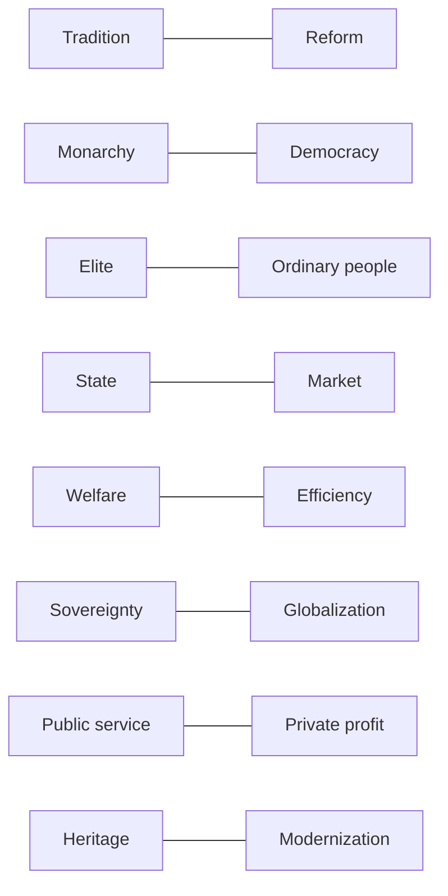

# 03 冲突模型与真题对照

> [!abstract] 本笔记导航
> [[英国01 历史与制度骨架]] · [[英国02 词汇与概念体系]] · **03 冲突模型与真题对照**（当前）
>
> 这是最该优先背的一篇。**把英国政治文化学成"冲突模型"，比背英国历史效率高得多。**
>
> 英语一很少写成"好人 vs 坏人"。真正的模型通常是两个**都合理**的价值发生冲突，作者在两者之间权衡，或指出某一方的代价。
>
> 美国那一套见 [[05_英语/美国政治背景/03 冲突模型与真题对照|美国政治背景 · 03 冲突模型与真题对照]]。

---

## 一、英语一里真正高频的英国矛盾

> [!success] 总钥匙
> 英国所有冲突的上游，几乎都是这一对：
>
> ==**tradition ↔ reform**==（传统 ↔ 改革）
>
> 制度形式被保留，实际权力被一点点挪走——这就是英国式的变革方式。

| 一端 | 另一端 | 常见表层话题 |
|---|---|---|
| `tradition` | `reform` | 君主制、上议院、古老机构 |
| `monarchy` | `democracy` | 王室存废、国家元首的象征性 |
| `elite` | `ordinary people` | 名校、精英、机会分配 |
| `state` | `market` | 公共服务、私有化、监管 |
| `welfare` | `efficiency` | NHS、福利制度、财政负担 |
| `national sovereignty` | `globalization` | Brexit、欧盟、移民 |
| `London` | `regions` | devolution、地区不平等 |
| `academic values` | `commercialization` | 大学、科研经费、学费 |
| `public service` | `private profit` | BBC、NHS、博物馆 |
| `liberty` | `government regulation` | 言论、隐私、数据 |
| `equality` | `hierarchy` | 阶级、社会流动 |
| `heritage` | `modernization` | 文物归还、旧制度是否还该留 |

> [!important] 这张表的用法
> 文章表面上讲 **大学、BBC、博物馆、NHS、议会、媒体**，实际上都可以还原成上面某一行的冲突。
>
> 所以读第一段时先问自己：==**这篇在争哪一行？**==

---

## 二、八个条件反射（考前最该形成的肌肉记忆）

> [!question] 看到 monarchy / Parliament
> 马上问：==**王权是怎么被议会一步步限制的？谁在真正掌权？**==

> [!question] 看到 class / elite / Oxbridge / public school
> 马上问：==**这是不是一道"精英 vs 普通人"的题？名校是流动的阶梯，还是阶层的复制？**==

> [!question] 看到 Empire / colonial / legacy
> 马上问：==**这段殖民历史如何影响今天——移民、种族、文化认同？**==

> [!question] 看到 NHS / welfare / public service
> 马上问：==**好制度遇到了什么成本问题？谁来付钱？**==

> [!question] 看到 privatization / Thatcher
> 马上问：==**market ↔ state 这一架，作者站哪边？**==

> [!question] 看到 Scotland / devolution
> 马上问：==**这是自治，还是独立？（devolution ≠ independence）**==

> [!question] 看到 Brexit / sovereignty
> 马上问：==**作者谈的是经济账，还是"我们是谁"的身份焦虑？**==

> [!question] 看到 BBC / university / museum
> 马上问：==**公共机构 vs 商业化，价值该由谁定价？**==

> [!success] 效果
> 只要形成这八个条件反射，英国题材的文章即使个别词不认识，也能提前判出作者大概率在讨论什么矛盾。

---

## 三、为什么英国文章的作者常常"谁都不完全支持"

因为英国公共议题很多不是"对 vs 错"，而是：

**Tradition vs Reform vs Efficiency vs Fairness**

例如 **上议院改革**：好处是 `legitimacy`（更民主），代价是 `continuity`（失去历史积累的专业与制衡）。

> [!important] 经典结构
> 某个古老机构可能 ==**symbolically important but politically limited**==——
> **象征意义很大，实际政治权力有限。**
>
> 于是作者可以同时说"它值得保留"和"它不该掌权"，一点不矛盾。

### 冲突模型总表

| 冲突对 |
|---|
| Tradition ↔ Reform |
| Monarchy ↔ Democracy |
| Elite ↔ Ordinary people |
| State ↔ Market |
| Welfare ↔ Efficiency |
| Sovereignty ↔ Globalization |
| London ↔ Regions |
| Public service ↔ Private profit |
| Liberty ↔ Regulation |
| Equality ↔ Hierarchy |
| Heritage ↔ Modernization |

🎯 自测：遮住上面，先把冲突对默写出来

| 冲突对 |
|---|
| Tradition ↔ Reform |
| Monarchy ↔ Democracy |
| Elite ↔ Ordinary people |
| State ↔ Market |
| Welfare ↔ Efficiency |
| Sovereignty ↔ Globalization |
| London ↔ Regions |
| Public service ↔ Private profit |
| Liberty ↔ Regulation |
| Equality ↔ Hierarchy |
| Heritage ↔ Modernization |

---

## 四、真题对照表（2010—2025，逐篇核对过原文）

下表是在 2010—2025 全部 64 篇 Text 里按英国背景关键词检索、并逐句读过原文后整理的，**不是凭印象写的**。

| 年份 | 题材 | 需要调用的背景框架 |
|---|---|---|
| 2010 Text 1 | 报刊艺术评论的衰落 | `the press` + 严肃评论传统（England 报纸） |
| 2012 Text 4 | 英国工会与公共部门 | `trade union` + `Labour Party` + `public sector` + `benefits` |
| 2014 Text 1 | 英国福利改革（求职者补助） | `welfare state` + `benefits` + `entitlement` + 市场化转向 |
| 2015 Text 1 | 欧洲君主制的存废（由西班牙案引出英国王室） | `monarchy` + `constitutional monarchy` + `ceremonial` + `aristocracy` |
| 2016 Text 2 | 英国乡村与绿地保护 | `countryside` + `NHS` 的国家认同 + `free market` 的反用 |
| 2017 Text 3 | Brexit 之后：GDP 与生活质量 | `Brexit` + `European Union` + `GDP` ↔ `well-being` |
| 2018 Text 3 | NHS 与 DeepMind 的数据交易 | `NHS` + `public service` ↔ `commercial interest` + `privacy` |
| 2019 Text 1 | 英国对大银行高管的监管规则 | `regulation` + `short-termism` + `the City` / `Bank of England` |
| 2020 Text 1 | "文化之城"奖项与 post-Brexit 身份焦虑 | `Brexit` + `national identity` + `MPs` + 地区（Hull）↔ London |
| 2020 Text 4 | 数字服务税（含英国 DPT） | 国家主权 + 跨国企业 + 税收（英国只作举例） |

分年速记（点开逐条展开，含真题原句）

**2010 Text 1｜报刊艺术评论的衰落**

> We are even farther removed from the unfocused newspaper reviews published in England between the turn of the 20th century and the eve of World War II...

框架：`the press` 的黄金年代 ↔ 今天的商业化与碎片化。对应第一行的 `public service ↔ private profit`。

**2012 Text 4｜英国工会与公共部门**

> In Britain, more than half of public-sector workers but only about 15% of private-sector ones are unionized.
>
> Britain's Labor Party, as its name implies, has long been associated with trade unionism.

框架：`trade union` 的历史力量 + `Labour Party` + `public sector`。看到 union 要立刻想到工党与 Thatcher 之后的收缩。

**2014 Text 1｜英国福利改革**

> The principle of British welfare is no longer that you can insure yourself against the risk of unemployment and receive unconditional payments if the disaster happens.
>
> Instead, the claimant receives a time-limited "allowance," conditional on actively seeking a job; no entitlement and no insurance, at £71.70 a week, one of the least generous in the EU.

框架：**福利国家 → 条件化、限期化、低额化**。这就是 `welfare ↔ efficiency`（更准确说是 `welfare ↔ individual responsibility`）的真题现场。

**2015 Text 1｜欧洲君主制的存废**

> The Spanish case provides arguments both for and against monarchy.
>
> It is only the Queen who has preserved the monarchy's reputation with her rather ordinary (if well-heeled) granny style.
>
> At a time when Thomas Piketty and other economists are warning of rising inequality and the increasing power of inherited wealth, it is bizarre that wealthy aristocratic families should still be the symbolic heart of modern democratic states.

框架：**`monarchy ↔ democracy` 的教科书样本**。注意作者的复杂态度——既承认君主制有支持理由，也用"世袭财富 + 不平等上升"来质疑它。这就是"两头都不完全站"的典型。

**2016 Text 2｜英国乡村与绿地保护**

> While polls show Britons rate "the countryside" alongside the royal family, Shakespeare and the National Health Service (NHS) as what makes them proudest of their country, this has limited political support.
>
> This is not a free market but a biased one.

框架：**情感认同很高，政治支持却很低**——这是英国公共议题的常见落差。再叠加 `free market` 的反用，落点是 `market ↔ heritage / community`。

**2017 Text 3｜Brexit 之后：GDP 与生活质量**

> With Britain voting to leave the European Union, and GDP already predicted to slow as a result, it is now a timely moment to assess what he was referring to.

框架：`GDP ≠ well-being`。Brexit 在这里是**引子**，真正讨论的是"经济增长能否转化为生活质量"。对应 `efficiency ↔ welfare`。

**2018 Text 3｜NHS 与 DeepMind**

> Any fair-minded assessment of the dangers of the deal between Britain's National Health Service (NHS) and DeepMind must start by acknowledging that both sides mean well.

框架：**`public service ↔ commercial interest`**，外加 `privacy` 与数据监管。注意作者先声明"双方动机都好"——这是英语一的标准起手式，意味着后文要讲的是**结构性问题**，不是坏人作恶。

**2019 Text 1｜对银行高管的监管**

> Financial regulators in Britain have imposed a rather unusual rule on the bosses of big banks.
>
> "Short-termism" or the desire for quick profits, has worsened in publicly traded companies, says the Bank of England's top economist, Andrew Haldane.

框架：`regulation` + `the City` + 短期主义。落点是 `market ↔ regulation`，与美国的同类文章是一个模型。

**2020 Text 1｜"文化之城"与 post-Brexit 身份焦虑**

> A group of Labour MPs, among them Yvette Cooper, are bringing in the new year with a call to institute a UK "town of culture" award.
>
> A cynic might speculate that the UK is on the verge of disappearing into an endless fever of self-celebration in its desperation to reinvent itself for the post-Brexit world.

框架：**`heritage` 被当成经济工具**，以及脱欧后急着"重新定义自己"。同时暗含 `London ↔ regions`（小镇与大城的资源落差）。

**2020 Text 4｜数字服务税**

> At the same time, the European Union, Spain, Britain and several other countries have all seriously contemplated digital services taxes.
>
> They have included Britain's DPT (diverted profits tax), Australia's MAAL (multinational anti-avoidance law), and India's SEP (significant economic presence) test...

框架：**主权 vs 跨国企业**。英国只是举例之一，不要误判成"英国主题"。

### 别被骗：四个"像英国、其实不是"的篇目

> [!warning] 机构名要看清是不是文章背景
> **2018 · Text 1**：出现 `Oxford`，但只是"牛津大学的一项研究"，文章讲的是美国的自动化与中产就业。
>
> **2016 · Text 1**：出现 `The parliament also agreed to ban websites...`，这里的 parliament 是**法国议会**（该篇讲法国禁止过度瘦身宣传）。
>
> **2016 · Text 4**：出现 `legacy business`，是**美国报业**的"遗留业务"，与帝国遗产无关。
>
> **2020 · Text 3**：出现 `elite women`、`quotas`，是**美国的董事会性别配额**议题。
>
> 结论：==**关键词命中 ≠ 题材背景。**== 一定要看第一段的主语是谁。

---

## 五、触发式背景表（重点记这张）

| 原文看到 | 马上想到 |
|---|---|
| `monarchy` / `monarch` | 君主制；国王是**象征**而非权力中心 |
| `constitutional monarchy` | 君主立宪：国王受宪政约束 |
| `the Crown` | 王室 / 王权（不是王冠） |
| `Parliament` | 议会；真正掌权的是下议院 |
| `MP` | 议员 |
| `House of Commons` | 下议院（**实权**） |
| `House of Lords` | 上议院（审议监督，非选举） |
| `Prime Minister` | 首相 = head of government |
| `cabinet` | 内阁 |
| `convention` | **宪政惯例** |
| `uncodified constitution` | 不成文宪法（不是没有宪法） |
| `rule of law` | 政府也受法律约束 |
| `sovereignty` | 主权（Brexit 核心词） |
| `devolution` | 权力下放（**不是独立**） |
| `independence` | 独立 |
| `Scotland` / `Welsh` | 地区认同、民族主义 |
| `identity` | 身份认同 |
| `class` | **很可能是"社会阶层"** |
| `elite` / `elitism` | 精英 / 精英主义 |
| `establishment` | 权势集团 / 建制派 |
| `Oxbridge` | 牛津剑桥（精英教育） |
| `public school` | **精英私立学校，不是公立** |
| `state school` | 公立学校 |
| `social mobility` | 社会流动 |
| `aristocracy` | 贵族阶层 |
| `welfare state` | 福利国家 |
| `NHS` | 国家医疗服务体系 |
| `public service` | 公共服务 |
| `benefit(s)` | **救济金 / 补助** |
| `claimant` | 领取补助的人 |
| `privatisation` | 私有化 |
| `Thatcher` | 市场化、削弱工会 |
| `deregulation` | 放松监管 |
| `trade union` | 工会 |
| `Labour` | 工党 |
| `Conservative` | 保守党 |
| `empire` / `imperial` | 帝国 |
| `colonial` / `colonialism` | 殖民（主义） |
| `legacy` | 历史遗产 / 后续影响（**商业语境另译**） |
| `Commonwealth` | 英联邦（现代概念） |
| `Brexit` | 脱欧 → 主权 ↔ 全球化 |
| `immigration` | 移民（Brexit 文章常伴随） |
| `the press` | 新闻界 / 报业 |
| `tabloid` | 小报（煽情） |
| `broadsheet` | 大报（严肃） |
| `BBC` | 公共服务广播 |
| `Westminster` | 英国议会 / 政界 |
| `Whitehall` | 英国政府 / 公务员系统 |
| `Downing Street` | 首相及首相府 |
| `the City` | 伦敦金融城 / 英国金融业 |
| `Bank of England` | 英格兰银行（央行） |
| `the Treasury` | 英国财政部 |

---

## 六、英国 vs 美国：一张对照表

> [!important] 英美题材混着考的时候，这张表能防止串味
> | 维度 | 英国 | 美国 |
> |---|---|---|
> | 宪法 | `uncodified constitution` 不成文 | `the Constitution` 成文宪法 |
> | 政体 | `parliamentary system` 议会制 | `presidential system` 总统制 |
> | 国家元首 | `monarch`（象征性） | `President`（同时是政府首脑） |
> | 立法机构 | `Parliament`（下议院主导） | `Congress`（众议院 + 参议院，权力对等） |
> | 上院 | `House of Lords`（任命，权力弱） | `Senate`（选举，权力强） |
> | 权力顶点 | `parliamentary sovereignty` 议会主权 | `checks and balances` 三权制衡 |
> | 地方政府 | `devolution` 权力下放 | `federalism` 联邦制 |
> | 核心冲突 | `tradition ↔ reform`；`state ↔ market` | `liberty ↔ government`；`federal ↔ state` |
> | 高频社会词 | `class` / `elite` / `Oxbridge` / `public school` | `individualism` / `American Dream` / `race` |

> [!warning] 最容易串的一处
> 英国的 **`Parliament`（议会）** 与美国 **`Congress`（国会）** 不是同一层级的机构；英国首相由议会多数产生、可被本党议员赶下台，美国总统有独立授权、任期内基本不会被议会罢免。==**用美国的制度直觉去套英国文章，很容易把政治责任的归属判错。**==

---

## 七、考前只背这 10 句话

> [!success] 如果只允许你考前背 10 句话
> 1. **英国政治文化的核心是 tradition + gradual reform：保留形式，改变功能。**
> 2. **国王是 head of state，只具象征性；首相是 head of government，实际掌权。**
> 3. **真正掌权的是下议院 House of Commons；上议院只起审议、修正、监督作用。**
> 4. **英国没有统一的成文宪法（uncodified constitution），靠立法、判例与惯例运行。**
> 5. **英国是 parliamentary system，美国是 presidential system。**
> 6. **class / elite / Oxbridge / public school 是英国社会类文章的第一背景。**
> 7. **英国的 public school 多为精英私校，不是公立学校。**
> 8. **NHS / welfare state 是二战后国家认同的核心，矛盾是公共福利需求 ↔ 财政负担。**
> 9. **Thatcher → privatization / deregulation，形成 welfare state ↔ market liberalism 的长期拉锯。**
> 10. **devolution ≠ independence；Brexit 的本质是 national sovereignty ↔ globalization / identity。**

第 10 条尤其重要。真正的模型通常是：

> [!important] 最省力的读法
> 英国文章的答案，往往不在"作者支持哪一方"，而在 ==**"作者认为这一方付出了什么代价"**==。

---

## 八、最后：看到英国题材文章的四步法

> [!success] 考场上的操作顺序
> **第一步**：第一段的主语是谁？——是真·英国背景，还是只借了个"剑桥/牛津"当出处？
>
> **第二步**：判断文章落点是哪一支？——制度 / 阶级 / 帝国 / 福利 / 市场化 / 地区 / 身份。
>
> **第三步**：套第一张冲突表，确定这一篇在争哪一行。
>
> **第四步**：找作者的态度词——他是**否定某一方**，还是指出**某一方被忽视了**？

---

> [!abstract] 继续阅读
> [[英国01 历史与制度骨架]] · [[英国02 词汇与概念体系]]
>
> 美国对照：[[05_英语/美国政治背景/01 历史与制度骨架|美国 · 01 历史与制度骨架]] · [[05_英语/美国政治背景/02 词汇与概念体系|美国 · 02 词汇与概念体系]] · [[05_英语/美国政治背景/03 冲突模型与真题对照|美国 · 03 冲突模型与真题对照]]
