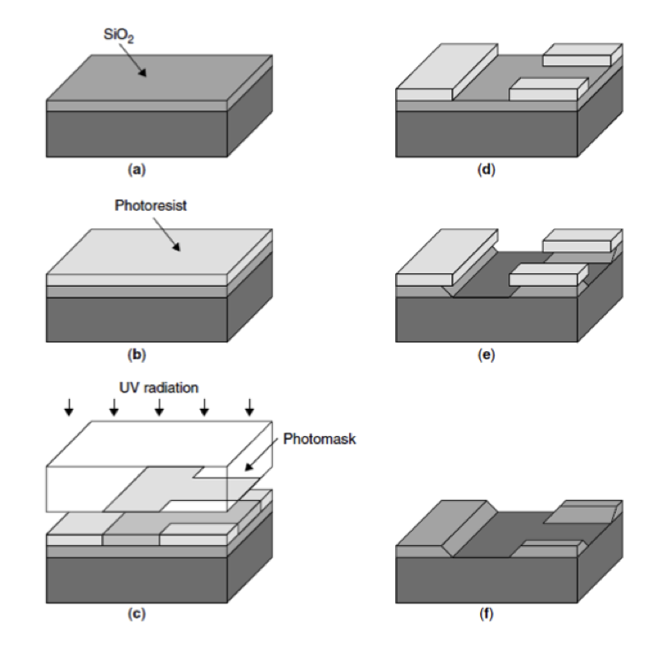
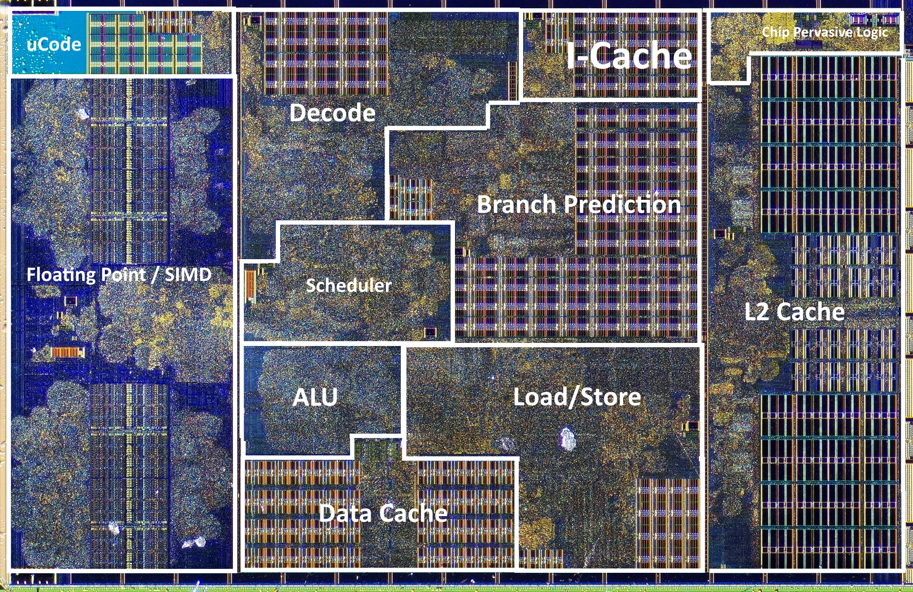

---
tags:
  - 现代硬件算法
  - 复杂性模型
created: 2026-09-11
source: https://en.algorithmica.org/hpc/complexity/hardware/
original_title: Modern Hardware
---

# 现代硬件

1960 年代超级计算机的主要缺点并不在于它们慢——相对而言，它们并不慢——而在于它们体积庞大、使用复杂，而且昂贵到只有世界强国的政府才买得起。它们之所以昂贵，是因为体积：它们需要大量定制组件，必须由拥有电气工程高级学位的人员在宏观世界中极为小心地组装，而这一过程无法扩大规模以进行批量生产。

转折点在于微芯片（microchips）——单块、微小而完整的电路——的发展，它彻底改变了行业，并很可能成为 20 世纪最重要的发明。1965 年价值数百万美元的一柜计算机器，到 1975 年已经能装进一片[4mm × 4mm 的硅片](https://en.wikipedia.org/wiki/MOS_Technology_6502)[^size]上，而你只需花 25 美元就能买到。这种可负担性的巨大进步，在接下来的十年里开启了家用计算机革命，Apple II、Atari 2600、Commodore 64 和 IBM PC 等计算机开始走入大众。

[^size]: CPU 的实际尺寸约为厘米量级，原因在于电源管理、散热，以及需要在不引发过多抱怨的情况下插到主板上。

### 微芯片是如何制造的

微芯片是利用一种称为光刻（photolithography）的工艺"印制"在一片单晶硅片上的，该工艺包括

1. 生长并切割[高纯硅晶体](https://en.wikipedia.org/wiki/Wafer_(electronics))；
2. 在其上覆盖一层[受光子照射即溶解的物质](https://en.wikipedia.org/wiki/Photoresist)；
3. 按设定图案用光子照射它；
4. 对现已暴露的部分进行化学[蚀刻](https://en.wikipedia.org/wiki/Etching_(microfabrication))；
5. 移除剩余的Photoresist（光刻胶）；

……然后在数月内再执行另外 40–50 个步骤，以完成 CPU 的其余部分。

现在考虑"用光子照射"这一步。为此，我们可以使用一套透镜系统，将图案投影到小得多的区域上，从而有效地制造出具备所有所需特性的微型电路。这样一来，1970 年代的光学工艺就能在一片指甲盖大小的面积上容纳数千个晶体管，这使微芯片获得了宏观世界计算机所不具备的几个关键优势：

- 更高的时钟频率（此前受限于光速）；
- 能够扩大生产规模；
- 低得多的材料和功耗，转化为低得多的单位成本。

除了这些直接好处之外，光刻还提供了一条进一步提升性能的清晰路径：你只需把透镜做得更强，就能以相对较少的代价制造出更小但在功能上完全相同的器件。

### Dennard 缩放定律

考虑当我们把微芯片缩小尺寸时会发生什么。更小的电路所需材料成比例地减少，而更小的晶体管翻转（以及芯片中所有其他物理过程）所需时间更短，从而允许降低电压并提高时钟频率。

一个被称为 Dennard 缩放定律（Dennard scaling）的更细致的观察指出，将晶体管尺寸缩小 30% 会：

- 使晶体管密度翻倍（$0.7^2 \approx 0.5$），
- 使时钟速度提升 40%（$\frac{1}{0.7} \approx 1.4$），
- 并使整体功率密度（power density）保持不变。

由于单位制造成本是面积的函数，而利用成本主要是电力成本[^power]，每一代"新工艺"应具有大致相同的总成本，但时钟提高 40% 且晶体管数量翻倍——这些新增的晶体管可以立即被利用起来，例如添加新的指令或增大字长——以跟上存储微芯片中同样发生的微型化趋势。

[^power]: 让一台繁忙的服务器运行 2–3 年的电费，大致等于制造该芯片本身的成本。

由于在设计中需要在能耗与性能之间权衡，制造工艺本身的精度——例如"180nm"或"65nm"——直接对应晶体管的密度，已成为 CPU 效率的代名词[^fidelity]。

[^fidelity]: 在摩尔定律开始放缓的某个时候，芯片制造商不再用元件尺寸来界定其芯片——如今这更像是一个营销术语。有一个专门委员会每两年开一次会，他们取上一个工艺节点的名称，除以二的平方根，四舍五入到最接近的整数，宣布结果即为新的节点名称，然后喝掉大量红酒。"nm"不再表示纳米了。

在计算的绝大部分历史中，光学缩小一直是性能提升背后的主要驱动力。英特尔前 CEO 戈登·摩尔（Gordon Moore）在 1975 年预测，微处理器中的晶体管数量将每两年翻一番。他的预测一直保持到今天，并被称为摩尔定律（Moore's law）。

Dennard 缩放定律和摩尔定律都不是真正的物理定律，而只是精明的工程师所做的观察。它们都注定会在某个时候因基本的物理限制而停止，最终的极限是硅原子的尺寸。事实上，Dennard 缩放定律已经因功耗问题而停止了。

从热力学角度看，计算机只不过是一台把电能高效地转化为热的设备。这些热量最终需要被移除，而从一个毫米量级的晶体中能散发出多少功率是存在物理极限的。旨在最大化性能的计算机工程师，实质上只是选择尽可能高的时钟频率，使整体功耗保持不变。如果晶体管变得更小，它们的电容就更小，意味着翻转它们所需的电压更低，这反过来又允许提高时钟频率。

大约在 2005–2007 年，这一策略因泄漏（leakage）效应而失效：电路特征变得如此之小，以至于它们的磁场开始使邻近电路中的电子朝着不该移动的方向运动，造成不必要的发热和偶发的位翻转。

缓解这一问题的唯一方法是提高电压；而为了平衡功耗，又需要降低时钟频率，这反过来使得随着晶体管密度提高，整个过程变得越来越不划算。在某个时刻，时钟频率再也无法通过缩放来提升，微型化趋势也开始放缓。

<!--

### 能效

可能会令人惊讶的是，现代 CPU 的主要指标并非时钟频率，而是"每焦耳的有用操作数"，或者更实际地说，"每美元的有用操作数"。

从热力学角度看，计算机只不过是一台把电能高效地转化为热的设备。这些热量最终需要被移除，而当你处理毫米量级的晶体时，这并非易事。你能消耗并散发出多少功率是存在物理极限的。

历史上，指导微芯片设计的三个主要变量是功耗、性能和面积（PPA），通常分别以瓦特、赫兹和纳米来定义。直到约 2005 年，主要由面积决定的成本，以及性能，曾是最重要的标准。但随着电池驱动的 mobile 设备开始取代 PC，功耗迅速且坚定地跃居榜首，其后是成本和性能。

泄漏：干扰性的磁场使电子朝着不该移动的方向运动，造成不必要的发热。它本身并不糟糕：要缓解它你需要提高电压，而这不会翻转任何比特。但问题在于，电路越小，就越难通过隔离导线来应对这一点。所以现代芯片把时钟频率保持在一个不会引起过热的水准，尽管从物理上说没有其他理由不让它们更高。

-->

### 现代计算

Dennard 缩放定律已经结束，但摩尔定律尚未消亡。

时钟频率趋于平稳，但晶体管数量仍在增长，从而得以创造出新的并行（parallel）硬件。CPU 设计不再一味追求更高的周期速度，而是专注于在单个周期内完成更多有用的工作。晶体管不再一味变小，而是不断改变形状。

这导致了日益复杂的架构，能够在每个周期内完成数十、数百甚至数千件不同的事情。

以下是一些利用更多可用晶体管、驱动近期计算机设计的核心方法：

- 重叠指令的执行，使 CPU 的不同部分保持忙碌（流水线 pipelining）；
- 执行操作而不必等待前序操作完成（推测执行与乱序执行）；
- 增加多个执行单元以同时处理独立操作（超标量处理器）；
- 增大机器字长，直至添加能够在分为若干组的 128、256 或 512 位数据块上执行同一操作的指令（[[SIMD并行.md|SIMD]]）；
- 在芯片上添加 [[RAM与CPU缓存.md|缓存层]] 以加快 [[外部存储.md|内存与外部存储]] 的访问速度（内存并不完全遵循硅缩放定律）；
- 在单芯片上添加多个相同的核心（并行计算、GPU）；
- 在主板上使用多颗芯片，并在数据中心使用多台更廉价的计算机（分布式计算）；
- 使用定制硬件以更高的芯片利用率解决特定问题（ASIC、FPGA）。

对于现代计算机而言，"[[复杂性模型.md|让我们数清所有操作]]"这种预测算法性能的方法不只是略有偏差，而是偏差了数个数量级。这就要求建立新的计算模型，以及其他评估算法性能的方式。

<!--

指针跳转与大多数脚本语言中的处理：$10^7$
原生语言中的含分支操作：$10^8$
原生语言中的无分支标量处理：$10^9$
带宽受限或复杂 SIMD 应用：$10^{10}$
线性代数，单核：$10^{11}$
典型桌面 CPU：$10^{12}$
典型手机 GPU：$10^{12}$
典型集成显卡：$2 \cdot 10^{12}$
高端游戏配置：$10^{13}$
深度学习硬件：$10^{14}$
深度学习整机柜：$10^{15}$
被视为超级计算机：$10^{16}$
用于训练 LM 神经网络的配置：$5 \cdot 10^{17}$
Fugaku（#1）：$2 \cdot 10^{18}$
Folding@home：$3 \cdot 10^{18}$

-->
