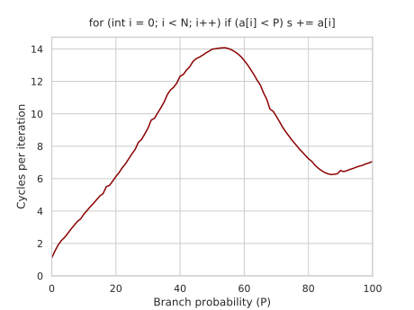

---
tags:
  - 现代硬件算法
  - 指令级并行
created: 2026-09-11
source: https://en.algorithmica.org/hpc/pipelining/branching/
original_title: The Cost of Branching
---

# 分支的代价

当 CPU 遇到条件跳转或[[间接跳转.md|任何其他形式的分支]]时，它并不会干等条件算出来——相反，它会立即*推测执行*（speculatively executing）看起来更可能被选中的那条分支。执行期间，CPU 会统计每条指令上所取分支的情况，经过一段时间，便能借由识别常见模式来预测分支。

正因如此，分支真正的"代价"很大程度上取决于 CPU 预测它的能力。如果它是纯粹的 50/50 抛硬币，你就得承受一次[[流水线冒险.md|控制冒险]]（control hazard），丢弃整条流水线，再花 15–20 个周期重新搭建。而如果分支总是被选中或总是不被选中，你几乎不用付出什么代价，只需检查条件即可。

## 一个实验

作为案例研究，我们先创建一个数组，其中装满 0 到 99（含）之间的随机整数：

```c++
for (int i = 0; i < N; i++)
    a[i] = rand() % 100;
```

接着写一个循环，把所有小于 50 的元素累加起来：

```c++
volatile int s;

for (int i = 0; i < N; i++)
    if (a[i] < 50)
        s += a[i];
```

我们令 $N = 10^6$，并多次运行该循环，以免[[内存带宽.md|冷缓存]]效应搅乱结果。我们把累加变量标为 `volatile`，是为了防止编译器对循环做向量化、交错迭代，或以任何其他方式"作弊"。

在 Clang 上，这段代码生成的汇编如下：

```nasm
    mov  rcx, -4000000
    jmp  body
counter:
    add  rcx, 4
    jz   finished   ; "jump if rcx became zero"
body:
    mov  edx, dword ptr [rcx + a + 4000000]
    cmp  edx, 49
    jg   counter
    add  dword ptr [rsp + 12], edx
    jmp  counter
```

我们的目标是模拟一个完全不可预测的分支，并且确实做到了：这段代码每个元素约耗时 14 个 CPU 周期。若要粗略估计它"本该"是多少，可以假设分支在 `<` 与 `>=` 之间交替，于是每隔一次迭代就会发生一次预测错误。那么，每两次迭代：

- 丢弃流水线，在 Zen 2 上它有 19 级深（即 19 个阶段，每个阶段占一个周期）。
- 需要一次内存读取和一次比较，开销约 5 个周期。由于可以并行检查偶数与奇数迭代的条件，可假设每 2 次迭代只付一次。
- 在 `<` 分支的情况下，还需约 4 个周期，把 `a[i]` 加到 volatile（存于内存）变量 `s`。

因此，平均每个元素需花费 $(4 + 5 + 19) / 2 = 14$ 个周期，与实测值吻合。

### 分支预测

我们可以把硬编码的 `50` 换成一个可调参数 `P`，它实际上设定了 `<` 分支被取中的概率：

```c++
for (int i = 0; i < N; i++)
    if (a[i] < P)
        s += a[i];
```

若针对不同的 `P` 做基准测试，会得到一张看起来很有意思的图：



其峰值出现在 50–55%，正如预期：分支预测失败在此最为昂贵。这张图并不对称：对于从不成立的条件（仅检查 `P = 0`），只需约 1 个周期；若分支总是被取中（`P = 100`），求和约需 7 个周期。

这张图并非单峰：在约 85–90% 处还有另一个局部极小值。在那里每个元素约花 6.15 个周期，比总是取中分支快约 10–15%，这要归功于需要执行的加法更少。到这一点，分支预测失败已不再影响性能，因为失败发生时，被丢弃的不是整个指令缓冲，而只是那些被推测调度的操作。本质上，那 10–15% 的预测失败率是一个平衡点：在这个点上我们能在流水线里看得足够远而不致停顿，同时仍能通过取中更廉价的 `>=` 分支省下 10–15%。

注意，检查一个几乎从不发生的条件，代价几乎为零。这正是程序员如此大量使用运行时异常与基本情况检查的原因：若它们确实罕见，便几乎不花任何成本。

### 模式检测

在我们的例子中，高效分支预测所需的，只是一个硬件统计计数器。如果我们历史上取中分支 A 的次数多于分支 B，那么推测执行分支 A 就是合理的。但现代 CPU 上的分支预测器远不止于此，它们能检测复杂得多的模式。

把 `P` 重新固定为 50，并在主求和循环之前先对数组排序：

```c++
for (int i = 0; i < N; i++)
    a[i] = rand() % 100;

std::sort(a, a + n);
```

我们处理的仍是相同的元素，只是顺序不同；它不再需要 14 个周期，而是略多于 4 个周期，恰好等于纯 `<` 与 `>=` 分支代价的平均。

分支预测器能捕捉比"一直左、再一直右"或"左右左右"复杂得多的模式。如果只把数组大小 $N$ 减小到 1000（不做排序），分支预测器便能记住整段比较序列，基准测试再次测到约 4 个周期——事实上还略少于排序数组的情形，因为前者分支预测器需要在"总是 yes"与"总是 no"两种状态间来回切换，要花些时间。

### 提示分支的可能性

如果你事先知道哪条分支更可能被取中，把这一信息[[情境化优化.md|告知编译器]]可能是有益的：

```c++
for (int i = 0; i < N; i++)
    if (a[i] < P) [[likely]]
        s += a[i];
```

当 `P = 75` 时，它测得每个元素约 7.3 个周期，而原版无提示的版本需要约 8.3 个。

这一提示并不会消除分支，也不会向分支预测器传递任何信息，而是通过改变[[机器码布局.md|机器码布局]]，让 CPU 前端能稍快一点处理更可能取中的分支（尽管通常不超过一个周期）。

只有当编译阶段之前你就知道哪条分支更可能被取中时，这一优化才有用。当分支本质上不可预测时，我们可以试着用*谓词化*（predication）——一项极为重要的技术——来彻底移除它，下一节[[无分支编程.md|我们将展开讨论]]。

### 致谢

这一案例研究受[史上获赞最多的 Stack Overflow 问题](https://stackoverflow.com/questions/11227809/why-is-processing-a-sorted-array-faster-than-processing-an-unsorted-array)启发。
