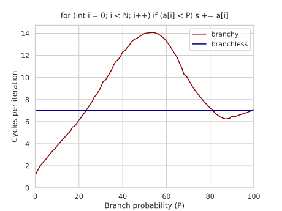

---
tags:
  - 现代硬件算法
  - 指令级并行
created: 2026-09-11
source: https://en.algorithmica.org/hpc/pipelining/branchless/
original_title: Branchless Programming
---

# 无分支编程

正如[[分支的代价.md|上一节]]所述，那些无法被 CPU 有效预测的分支代价高昂，因为在预测失败后，它们会引发一次长流水线停顿，以取回新指令。本节我们讨论从源头移除分支的办法。

### 谓词化

我们将沿用之前开启的同一案例研究——先创建一个随机数组，再把所有小于 50 的元素累加：

```c++
for (int i = 0; i < N; i++)
    a[i] = rand() % 100;

volatile int s;

for (int i = 0; i < N; i++)
    if (a[i] < 50)
        s += a[i];
```

我们的目标是消除由 `if` 语句引发的分支。我们可以试着这样摆脱它：

```c++
for (int i = 0; i < N; i++)
    s += (a[i] < 50) * a[i];
```

这个循环现在每个元素约需 7 个周期，而非原先的约 14 个。而且，若把 `50` 换成别的阈值，性能也保持不变，因此它不依赖于分支概率。

但等等……难道不该还有一个分支吗？`(a[i] < 50)` 是怎么映射到汇编的？

汇编里没有布尔类型，也没有任何指令能根据比较结果产出一个 0 或 1，但我们可以用间接方式算出来：`(a[i] - 50) >> 31`。这个技巧依赖于[[整数.md|整数的二进制表示]]，具体说，若表达式 `a[i] - 50` 为负（即意味着 `a[i] < 50`），则结果的最高位会被置为 1，我们便可用右移把它取出来。

```nasm
mov  ebx, eax   ; t = x
sub  ebx, 50    ; t -= 50
sar  ebx, 31    ; t >>= 31
imul  eax, ebx   ; x *= t
```

另一种更复杂、实现整段序列的方式，是把这个符号位转换成一个掩码，然后用按位 `and` 取代乘法：`((a[i] - 50) >> 31 - 1) & a[i]`。整段序列由此快了一个周期，因为与其他指令不同，`imul` 需要 3 个周期：

```nasm
mov  ebx, eax   ; t = x
sub  ebx, 50    ; t -= 50
sar  ebx, 31    ; t >>= 31
; imul  eax, ebx ; x *= t
sub  ebx, 1     ; t -= 1（若 t = 0 会导致下溢）
and  eax, ebx   ; x &= t
```

注意，从编译器角度看，这一优化技术上并不正确：对于 50 个最小的合法整数——即落在 $[-2^{31}, - 2^{31} + 49]$ 范围内的那些——结果会因下溢而出错。我们知道所有数都在 0 到 100 之间，这种情况不会发生，但编译器并不知道。

不过编译器实际上选择了另外一种做法。它没用这套算术技巧，而是用了一条特殊的 `cmov`（"条件移动"，conditional move）指令，依据条件（用标志寄存器计算并判断，与跳转方式相同）来赋值：

```nasm
mov     ebx, 0      ; cmov 不支持立即数，所以需要一个全零寄存器
cmp     eax, 50
cmovge  eax, ebx    ; eax = (eax >= 50 ? eax : ebx=0)
```

所以上面的代码其实更接近于使用这样的三元运算符：

```c++
for (int i = 0; i < N; i++)
    s += (a[i] < 50 ? a[i] : 0);
```

两个变体都会被编译器优化，并产生如下汇编：

```nasm
    mov     eax, 0
    mov     ecx, -4000000
loop:
    mov     esi, dword ptr [rdx + a + 4000000]  ; load a[i]
    cmp     esi, 50
    cmovge  esi, eax                            ; esi = (esi >= 50 ? esi : eax=0)
    add     dword ptr [rsp + 12], esi           ; s += esi
    add     rdx, 4
    jnz     loop                                ; "iterate while rdx is not zero"
```

这种通用技术称为*谓词化*（predication），它大致等价于下面这个代数技巧：

$$
x = c \cdot a + (1 - c) \cdot b
$$

这样你就能消除分支，但代价是要*同时*计算两个分支以及 `cmov` 本身。由于计算">="分支本身不花代价，性能正好等同于分支版中[[分支的代价.md#一个实验|"总是为真"的情况]]。

### 谓词化何时有益

使用谓词化消除了[[流水线冒险.md|控制冒险]]，却引入了一个数据冒险。流水线停顿仍在，但代价更低：你只需等待 `cmov` 结算，而不必在预测失败时冲刷整条流水线。

然而，在许多情形下，保留带分支的代码反而更高效。当计算*两个*分支（而非仅一个）的代价超过了潜在分支预测失败的惩罚时，便是如此。

在我们的例子中，当分支可被预测的概率高于约 75% 时，带分支的代码更占优。



这个 75% 的阈值常被编译器用作决定是否使用 `cmov` 的启发式判据。遗憾的是，这个概率在编译期通常未知，因此需要通过以下几种方式之一来提供：

- 使用[[情境化优化.md#分支的可能性|基于性能剖析的优化]]（profile-guided optimization），由它自行决定是否采用谓词化。
- 使用[[分支的代价.md#模式检测|可能性属性]]与[[情境化优化.md|编译器特定的内建函数]]来提示分支的可能性：GCC 中的 `__builtin_expect_with_probability` 与 Clang 中的 `__builtin_unpredictable`。
- 用三元运算符或各种算术技巧改写带分支的代码，这相当于在程序员与编译器之间达成了一种隐式约定：若程序员以这种方式写代码，那它很可能本就打算做成无分支的。

"正确的做法"是使用分支提示，遗憾的是对这一机制的支持尚不充分。目前看来，当编译器后端决定 `cmov` 是否更有利时，这些提示[似乎被丢弃了](https://bugs.llvm.org/show_bug.cgi?id=40027)。要让它成为可能已有[一些进展](https://discourse.llvm.org/t/rfc-cmov-vs-branch-optimization/6040)，但眼下还没有什么好办法能强制编译器生成无分支代码，所以有时最好的指望只能是手写一小段汇编。

<!--

Because this is very architecture-specific.

in the absence of branch likeliness hints

While any program that uses a ternary operator is equivalent to a program that uses an `if` statement

The codes seem equivalent. My guess is that the compiler doesn't know that `s + a[i]` does not cause integer overflow.

(The compiler can't optimize it because it's technically [not allowed to](/hpc/compilation/contracts): despite `y - x` being valid, `x - y` could over/underflow, causing undefined behavior. Although fully correct, I guess the compiler just doesn't date executing it.)

Branchless computing tricks like this one are especially important in all sorts of parallel algorithms.

The `cmov` variant doesn't care about probabilities of branches. It only wins if the branch probability if 75% chance, which usually is the heuristic threshold set in compilers.

This is a legal optimization, but I guess an implicit contract has evolved between application programmers and compiler engineers that if you write a ternary operator, then you kind of telling that it is likely going to be an unpredictable branch.

The general technique is called *branchless* or *branch-free* programming. Predication is the main tool of it, but there are more complicated ways.

-->

<!--

Let's do a few more examples as an exercise.

```c++
int max(int a, int b) {
    return (a > b) * a + (a <= b) * b;
}
```

```c++
int max(int a, int b) {
    return (a > b ? a : b);
}
```


```c++
int abs(int a, int b) {
    return max(diff, -diff);
}
```

```c++
int abs(int a, int b) {
    int diff = a - b;
    return (diff < 0 ? -diff : diff);
}
```

```c++
int abs(int a) {
    return (a > 0 ? a : -a);
}
```

```c++
int abs(int a) {
    int mask = a >> 31;
    a ^= mask;
    a -= mask;
    return a;
}
```

-->

### 更大的例子

**字符串。** 略作简化，`std::string` 由一个指向堆上某处、以 null 结尾的 `char` 数组（也称"C 字符串"）的指针，以及一个记录字符串长度的整数组成。

字符串的一个常见取值是空字符串——它也是默认值。你总得对它们做些处理，惯用做法是把指针赋为 `nullptr`、长度赋为 `0`，然后在每个涉及字符串的过程开头检查指针是否为空或长度是否为零。

然而，这需要一条独立分支，代价不菲（除非绝大多数字符串不是空就是非空）。为了省去检查、从而也省去分支，我们可以分配一个"零 C 字符串"——就是某处分配的一个零字节——然后让所有空字符串都指向它。现在所有对空字符串的操作都得去读这个无用的零字节，但这仍远比一次分支预测失败便宜。

**二分查找。** 标准二分查找[[二分查找.md|可以实现]]为无分支形式，在小数组（能装进缓存）上比带分支的 `std::lower_bound` 快约 4 倍：

```c++
int lower_bound(int x) {
    int *base = t, len = n;
    while (len > 1) {
        int half = len / 2;
        base += (base[half - 1] < x) * half; // will be replaced with a "cmov"
        len -= half;
    }
    return *base;
}
```

除了更复杂之外，它还有个小缺点：可能做更多次比较（恒为 $\lceil \log_2 n \rceil$ 次，而非 $\lfloor \log_2 n \rfloor$ 或 $\lceil \log_2 n \rceil$ 次），并且无法对未来内存读取做推测（那相当于预取，因此在超大数组上会吃亏）。

一般而言，数据结构是通过隐式或显式地*填充*（padding）来做到无分支的，使其操作只需常数次迭代。更复杂的例子请参阅[[二分查找.md|该文]]。

<!--

The only downside of the branchless implementation is that it potentially does more memory reads: 

There are typically two ways to achieve this:

And in general, data structures can be "padded" to be made constant size or height.

That there are no substantial reasons why compilers can't do this on their own, but unfortunately this is just how it is right now.

-->

**数据并行编程。** 无分支编程对 [[SIMD并行.md|SIMD]] 应用极为重要，因为它们本来就没有分支。

在我们的数组求和例子中，去掉累加变量上的 `volatile` 限定符，编译器就能对循环做[[自动向量化与 SPMD.md|向量化]]：

```c++
/* volatile */ int s = 0;

for (int i = 0; i < N; i++)
    if (a[i] < 50)
        s += a[i];
```

它现在每个元素约 0.3 个周期，主要[[内存带宽.md|受内存制约]]。

编译器通常能向量化任何不带分支、且迭代间无依赖的循环——以及少数与此略有出入的特殊情况，例如[[归约.md|归约]]或只含单个"无 else 的 if"的简单循环。对更复杂内容的向量化是个相当棘手的问题，可能涉及[[掩码与混合.md]]与[[寄存器内重排.md|寄存器内重排]]等多种技术。

<!--

**Binary exponentiation.** However, when it is constant

When we can iterate in small batches, [autovectorization](/hpc/simd/autovectorization) speeds it up 13x.

-->
