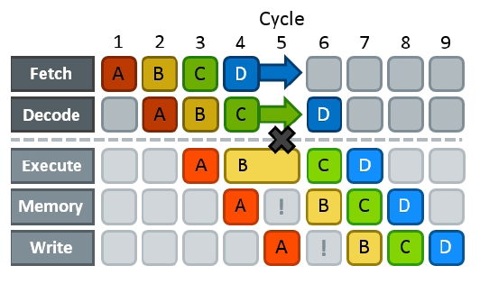

---
tags:
  - 现代硬件算法
  - 指令级并行
created: 2026-09-11
source: https://en.algorithmica.org/hpc/pipelining/hazards/
original_title: Pipeline Hazards
---

# 流水线冒险

[[指令级并行.md|流水线]]让你通过并发执行指令来隐藏其延迟，但它也带来了一些自身特有的潜在障碍——它们被统称为*流水线冒险*（pipeline hazards），即下一条指令无法在下一个时钟周期执行的情形。

这种情况可能以多种方式发生：

* *结构冒险*（structural hazard）发生于两个或更多指令需要 CPU 的同一部分（例如某个执行单元）时。
* *数据冒险*（data hazard）发生于你不得不等待某个操作数由前一步算好时。
* *控制冒险*（control hazard）发生于 CPU 无法判断下一步需要执行哪些指令时。

解决冒险的唯一办法就是制造一次*流水线停顿*（pipeline stall）：暂停此前所有阶段的推进，直到造成拥塞的原因消失。这会在流水线里产生*气泡*（bubbles）——类似于流体管道中的气泡——即执行单元空闲、没有做有用工作的时间 propagating 状态。

不同冒险的惩罚各不相同：

- 在结构冒险中，你须等待（通常多一个周期）直到执行单元就绪。它们是性能上的根本性瓶颈，无法回避——你只能在设计上绕开它们。
- 在数据冒险中，你须等待所需数据被算好（即*关键路径*的延迟）。数据冒险可通过重构计算、缩短关键路径来解决。
- 在控制冒险中，通常须冲刷整条流水线并重新开始，浪费整整 15–20 个周期。它们的解决之道，要么彻底移除分支，要么让分支可预测，使 CPU 能有效*推测*下一步要执行什么。

由于它们对性能的影响截然不同，我们将倒序进行，先从更严重的那类说起。
