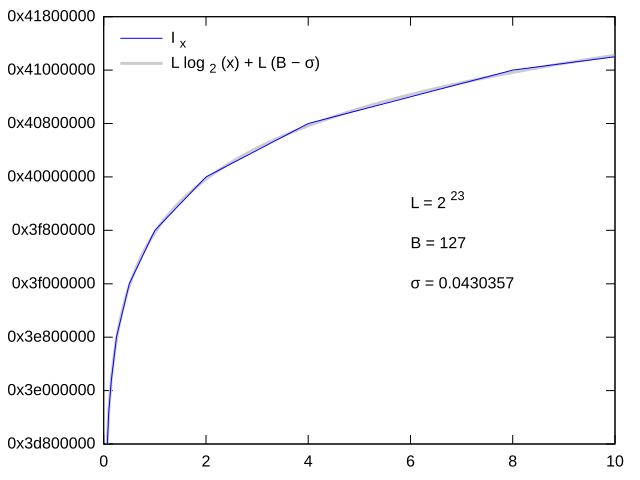

---
tags:
  - 现代硬件算法
  - 算术运算
created: 2026-09-11
source: https://en.algorithmica.org/hpc/arithmetic/rsqrt/
original_title: Fast Inverse Square Root
---

# 快速平方根倒数

浮点数的平方根倒数 $\frac{1}{\sqrt x}$ 用于计算归一化向量（normalized vectors），而归一化向量又被广泛用于各种仿真场景，例如计算机图形学（例如，用于确定入射角和反射角以模拟光照）。

$$
\hat{v} = \frac{\vec v}{\sqrt {v_x^2 + v_y^2 + v_z^2}}
$$

直接计算平方根倒数——先算平方根，再用 $1$ 除以它——极其缓慢，因为尽管这两个运算都由硬件实现，但它们本身都很慢。

但有一个出奇好的近似算法，它利用了浮点数在内存中的存储方式。事实上它好到已经被 [硬件实现](https://www.felixcloutier.com/x86/rsqrtps)，因此该算法本身对软件工程师而言不再具有现实意义，但我们仍将一步步讲解它，因为它本身具有美感，且有极大的教学价值。

除了算法本身，它的创作历史也相当有趣。它归功于游戏工作室 *id Software*，他们在 1999 年的标志性游戏 *Quake III Arena* 中使用了它，尽管显然它经由一条"我从一个家伙那学的，而那家伙又从另一个家伙那学的"的链条流传至此，而这条链条似乎终结于 William Kahan（也就是那位对 IEEE 754 和 Kahan 求和算法负责的人）。

它在 2005 年左右游戏开发社区中流行起来，当时他们发布了游戏的源代码。下面是 [其中的相关摘录](https://github.com/id-Software/Quake-III-Arena/blob/master/code/game/q_math.c#L552)，包含注释：

```c++
float Q_rsqrt(float number) {
    long i;
    float x2, y;
    const float threehalfs = 1.5F;

    x2 = number * 0.5F;
    y  = number;
    i  = * ( long * ) &y;                       // evil floating point bit level hacking
    i  = 0x5f3759df - ( i >> 1 );               // what the fuck? 
    y  = * ( float * ) &i;
    y  = y * ( threehalfs - ( x2 * y * y ) );   // 1st iteration
//  y  = y * ( threehalfs - ( x2 * y * y ) );   // 2nd iteration, this can be removed

    return y;
}
```

我们将一步步讲解它的作用，但首先，我们需要稍微绕个弯。

### 近似对数

在计算机（或至少买得起的 calculator）成为日常用品之前，人们使用对数表来计算乘法及相关的运算——查 $a$ 和 $b$ 的对数，将它们相加，然后求出结果的逆对数（inverse logarithm）。

$$
a \times b = 10^{\log a + \log b} = \log^{-1}(\log a + \log b)
$$

在计算 $\frac{1}{\sqrt x}$ 时你也可以玩同样的把戏，利用恒等式：

$$
\log \frac{1}{\sqrt x} = - \frac{1}{2} \log x
$$

快速平方根倒数正是基于这一恒等式，因此它需要非常快地计算 $x$ 的对数。事实证明，它可以通过简单地将一个 32 位 `float` 重新解释为一个整数来近似。

[[浮点数.md|回顾一下]]，浮点数顺序存储符号位（对于正数值为零，这正是我们的情况）、指数 $e_x$ 和尾数 $m_x$，它们对应

$$
x = 2^{e_x} \cdot (1 + m_x)
$$

因此它的对数为

$$
\log_2 x = e_x + \log_2 (1 + m_x)
$$

由于 $m_x \in [0, 1)$，右边的对数可以近似为

$$
\log_2 (1 + m_x) \approx m_x
$$

该近似在区间两端都是精确的，但为了计算平均情况，我们需要将它偏移一个小的常数 $\sigma$，因此

$$
\log_2 x = e_x + \log_2 (1 + m_x) \approx e_x + m_x + \sigma
$$

现在，带着这一近似，并定义 $L=2^{23}$（`float` 中尾数的位数）和 $B=127$（指数偏置），当我们把 $x$ 的位模式重新解释为整数 $I_x$ 时，本质上得到

$$
\begin{aligned}
I_x &= L \cdot (e_x + B + m_x)
\\  &= L \cdot (e_x + m_x + \sigma +B-\sigma )
\\  &\approx L \cdot \log_2 (x) + L \cdot (B-\sigma )
\end{aligned}
$$

（将整数乘以 $L=2^{23}$ 等价于将其左移 23 位。）

当你调整 $\sigma$ 以最小化均方误差（mean square error）时，这就产生了一个出奇准确的近似。



现在，从近似中解出对数，我们得到

$$
\log_2 x \approx \frac{I_x}{L} - (B - \sigma)
$$

酷。现在，我们说到哪了？哦，对，我们想计算平方根倒数。

### 近似结果

要使用恒等式 $\log_2 y = - \frac{1}{2} \log_2 x$ 计算 $y = \frac{1}{\sqrt x}$，我们可以将其代入我们的近似公式，得到

$$
\frac{I_y}{L} - (B - \sigma)
\approx
- \frac{1}{2} ( \frac{I_x}{L} - (B - \sigma) )
$$

解出 $I_y$：

$$
I_y \approx \frac{3}{2} L (B - \sigma) - \frac{1}{2} I_x
$$

事实证明，我们甚至根本不需要先计算对数：上面的公式只是一个常量减去 $x$ 的整数重解释的一半。它在代码中被写成：

```cpp
i = * ( long * ) &y;
i = 0x5f3759df - ( i >> 1 );
```

我们在第一行将 `y` 重新解释为整数，然后在第二行将它代入公式，其中第一项就是魔数 $\frac{3}{2} L (B - \sigma) = \mathtt{0x5F3759DF}$，而第二项则用二进制移位而非除法来计算。

### 用牛顿法迭代

接下来是几步手写的牛顿法迭代，取 $f(y) = \frac{1}{y^2} - x$，并配有一个非常好的初值。其更新规则为

$$
f'(y) = - \frac{2}{y^3} \implies y_{i+1} = y_{i} (\frac{3}{2} - \frac{x}{2} y_i^2) = \frac{y_i (3 - x y_i^2)}{2}
$$

它在代码中被写成

```cpp
x2 = number * 0.5F;
y  = y * ( threehalfs - ( x2 * y * y ) );
```

初始近似是如此之好，以至于仅一次迭代就足以满足游戏开发的需要。仅经过第一次迭代，它就已落入正确答案 99.8% 的范围内，并且可以进一步迭代以提高精度——这正是硬件中所做的：[x86 指令](https://www.intel.com/content/www/us/en/docs/intrinsics-guide/index.html#ig_expand=3037,3009,5135,4870,4870,4872,4875,833,879,874,849,848,6715,4845,6046,3853,288,6570,6527,6527,90,7307,6385,5993&text=rsqrt&techs=AVX,AVX2) 会执行其中几次，并保证相对误差不超过 $1.5 \times 2^{-12}$。

### 延伸阅读

[维基百科关于快速平方根倒数的文章](https://en.wikipedia.org/wiki/Fast_inverse_square_root#Floating-point_representation)。
