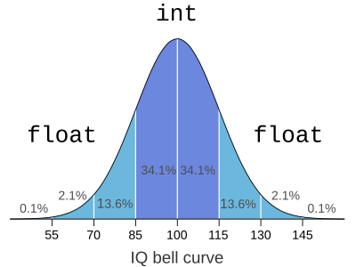

---
tags:
  - 现代硬件算法
  - 算术运算
created: 2026-09-11
source: https://en.algorithmica.org/hpc/arithmetic/float/
original_title: Floating-Point Numbers
---

# 浮点数

浮点运算的使用者值得拥有这样一张 IQ 钟形曲线（bell curve）表情包——因为这大致就是它与大多数人之间的关系走向：

- 初学者程序员到处使用它，仿佛它是某种具有无限精度的魔法数据类型。
- 然后他们发现 `0.1 + 0.2 != 0.3` 或其他类似怪癖，惊慌失措，开始以为每个计算都被加上了某个随机误差项，并在此后多年里彻底回避任何真正的实数类型。
- 然后他们终于鼓起勇气，阅读了 IEEE-754 浮点工作原理的规范，并开始恰当地使用它们。

遗憾的是，太多人仍停留在第 2 阶段，滋生了关于浮点运算的各种误解——以为它本质上就不精确、不稳定，并且比整数运算慢。



但这全都是神话。浮点运算往往比整数运算*更快*，因为有专门的指令；而实数表示已被彻底标准化，并在舍入方面遵循简单且确定性的规则，使你能可靠地管理计算误差。

事实上，它可靠到某些高级编程语言——最著名的如 JavaScript——根本就没有整数。在 JavaScript 中，只有一种 `number` 类型，它在内部存储为 64 位 `double`，并且由于浮点运算的工作方式，介于 $-2^{53}$ 与 $2^{53}$ 之间的所有整数以及涉及它们的计算结果都可以精确存储，因此从程序员的角度看，几乎没有什么实际需求需要一个独立的整数类型。

一个显著的例外是当你需要对数字执行位运算时，而*浮点单元*（floating-point units，负责浮点运算的协处理器）通常不支持这些操作。在这种情况下，它们需要被转换为整数——这在支持 JavaScript 的浏览器中使用如此频繁，以至于 Arm [新增了一条专门的 "FJCVTZS" 指令](https://community.arm.com/developer/ip-products/processors/b/processors-ip-blog/posts/armv8-a-architecture-2016-additions)，意为"Floating-point Javascript Convert to Signed fixed-point, rounding toward Zero"（浮点 JavaScript 转换为有符号定点数、向零舍入），正如其名——它以与 JavaScript 完全相同的方式将实数转换为整数——这是软硬件反馈闭环（software-hardware feedback loop）的一个有趣实例。

但除非你是一位纯粹用实数类型来模拟整数运算的 JavaScript 开发者，否则你大概需要一份关于浮点运算更深入的指南，因此我们将从一个更宽泛的主题开始。

## 实数表示

如果你需要处理实数（非整数），有几种适用面各异的选择。在直接跳到本文主要讨论的浮点数之前，我们想先探讨一下可用的替代方案及其背后的动机——毕竟，回避浮点运算的人也并非全无道理。

### 符号表达式

第一种也是最笨拙的方法是：不存储结果值本身，而是存储产生它们的代数表达式。

下面是一个简单的例子。在某些应用中，例如计算几何，除了对数字进行加、减、乘之外，你还需要不带舍入地做除法，从而得到一个有理数，它可以用两个整数的比值精确表示：

```c++
struct r {
    int x, y;
};

r operator+(r a, r b) { return {a.x * b.y + a.y * b.x, a.y * b.y}; }
r operator*(r a, r b) { return {a.x * b.x, a.y * b.y}; }
r operator/(r a, r b) { return {a.x * b.x, a.y * b.y}; }
bool operator<(r a, r b) { return a.x * b.y < b.x * a.y; }
// ...and so on, you get the idea
```

这个比值可以被化为最简形式，这甚至会使这种表示唯一：

```c++
struct r {
    int x, y;
    r(int x, int y) : x(x), y(y) {
        if (y < 0)
            x = -x, y = -y;
        int g = gcd(x, y);
        x /= g;
        y /= g;
    }
};
```

*计算机代数*（computer algebra）系统，如 WolframAlpha 和 SageMath，就是这样工作的：它们仅对符号表达式进行操作，避免将任何东西求值为实数值。

用这种方法，你获得了绝对的精度，并且当你处理的范围有限（例如仅支持有理数）时效果很好。但这是以巨大的计算成本为代价的，因为在一般情况下，你需要以某种方式存储导致该结果的所有运算历史，并在每次执行新运算时加以考虑——随着历史增长，这很快变得不可行。

### 定点数

另一种方法是坚持使用整数，但将它们视为已经乘以某个固定常数。这在本质上与更换更合尺度的计量单位相同。

因为某些值无法精确表示，这使得计算并不精确：你需要将结果舍入到最近的可表示值。

这种方法常用于金融软件中，因为你的的确确需要一种直截了当的方式来管理舍入误差，以使最终数字能够对齐。例如，纳斯达克（NASDAQ）在其股票行情中使用 $\frac{1}{10000}$ 美元作为基本单位，这意味着你在所有交易中获得的正好是小数点后 4 位的精度。

```c++
struct money {
    uint v; // 1/10000th of a dollar
};

std::string to_string(money) {
    return std::format("${0}.{1:04d}", v / 10000, v % 10000);
}

money operator*(money x, money y) { return {x.v * y.v / 10000}; }
```

除了引入舍入误差外，一个更大的问题是当缩放常数放错位置时它们就毫无用处。如果你处理的数字过大，那么内部整数值将溢出；如果数字过小，它们将被简单地向下舍入为零。有趣的是，前一种情况曾经在纳斯达克[成为一个问题](https://www.wsj.com/articles/berkshire-hathaways-stock-price-is-too-much-for-computers-11620168548)，当时伯克希尔·哈撒韦的股价逼近 $\frac{2^{32} - 1}{10000}$ = $429,496.7295，再也无法容纳于一个无符号 32 位整数中。

这个问题使得定点算术从根本上不适用于那些需要同时使用大数和小数的应用，例如评估某些物理方程：

$$
E = m c^2
$$

在這一个具体方程中，$m$ 的量级通常与一个质子的质量（$1.67 \cdot 10^{-27}$ kg）相当，$c$ 是光速（$3 \cdot 10^9$ m/s）。

### 浮点数

在大多数数值应用中，我们主要关注的是相对误差。我们希望计算结果与真实值的偏差不超过，比如说，$0.01\\%$，而我们并不真正关心这 $0.01\\%$ 在绝对单位上等于多少。

浮点数通过存储一定数量的最高有效位和该数的数量级来解决这个问题。更精确地说，它们用一个整数（称为 *有效数字*（significand）或 *尾数*（mantissa））表示，并使用某个固定基数的指数进行缩放——最常见的是 2 或 10。例如：

$$
1.2345 =
\underbrace{12345}_\text{mantissa}
\times {\underbrace{10}_\text{base}\!\!\!\!}
      ^{\overbrace{-4}^\text{exponent}}
$$

计算机操作固定长度的二进制字，因此在为硬件设计浮点格式时，你会想要一种固定长度的二进制格式，其中一些位专用于尾数（以获得更高精度），另一些位专用于指数（以获得更大范围）。这一手搓浮点实现有望传达其思想：

```cpp
// DIY floating-point number
struct fp {
    int m; // mantissa
    int e; // exponent
};
```

这样我们就可以表示形如 $\pm \\; m \times 2^e$ 的数，其中 $m$ 和 $e$ 都是有界*且可能为负数*的整数——这分别对应负数或较小的数。这些数的分布非常不均匀：在 $[0, 1)$ 范围内的数和在 $[1, +\infty)$ 范围内的数大致一样多。

注意，这些表示对某些数来说并不唯一。例如，数字 $1$ 可以表示为

$$
1 \times 2^0 = 2 \times 2^{-1} = 256 \times 2^{-8}
$$

以及另外 28 种不会使尾数溢出的方式。

这对于某些应用（如比较或哈希）可能是个问题。为修复这一点，我们可以使用某个约定来*规范化*（normalize）这些表示。在十进制中，[标准形式](https://en.wikipedia.org/wiki/Scientific_notation) 总是把逗号放在第一位数字之后（`6.022e23`），而对于二进制，我们也可以这样做：

$$
42 = 10101_2 = 1.0101_2 \times 2^5
$$

注意，遵循这一规则，第一位总是 1。显式存储它是冗余的，因此我们将假装它存在，只存储其他位，这些位对应某个位于 $[0, 1)$ 范围内的有理数。可表示数的集合现在大致为

$$
\{ \pm \; (1 + m) \cdot 2^e \; | \; m = \frac{x}{2^{32}}, \; x \in [0, 2^{32}) \}
$$

由于 $m$ 现在是一个非负值，我们现在将其设为无符号整数，并另外添加一个独立的布尔字段来表示数字的符号：

```cpp
struct fp {
    bool s;     // sign: "0" for "+", "1" for "-" 
    unsigned m; // mantissa
    int e;      // exponent
};
```

现在，让我们尝试用我们的手搓浮点实现某种算术运算——例如乘法。使用新公式，结果应为：

$$
\begin{aligned}
c  &= a \cdot b
\\ &= (s_a \cdot (1 + m_a) \cdot 2^{e_a}) \cdot (s_b \cdot (1 + m_b) \cdot 2^{e_b})
\\ &= s_a \cdot s_b \cdot (1 + m_a) \cdot (1 + m_b) \cdot 2^{e_a} \cdot 2^{e_b} 
\\ &= \underbrace{s_a \cdot s_b}_{s_c} \cdot (1 + \underbrace{m_a + m_b + m_a \cdot m_b}_{m_c}) \cdot 2^{\overbrace{e_a + e_b}^{e_c}}
\end{aligned}
$$

这些分组现在看起来可以直接计算，但有两个细微之处：

- 新的尾数现在位于 $[0, 3)$ 范围内。我们需要检查它是否大于 $1$，并对表示进行规范化，应用如下公式：$1 + m = (1 + 1) + (m - 1) = (1 + \frac{m - 1}{2}) \cdot 2$。
- 由于精度不足，结果数字可能（而且极有可能）无法精确表示。我们需要多出一倍的位来容纳 $m_a \cdot m_b$ 项，而在这里我们能做的最好的事情就是将它舍入到最近的可表示数。

由于我们需要一些额外的位来妥善处理尾数溢出问题，我们将从 $m$ 中保留一位，从而将其限制在 $[0,2^{31})$ 范围内。

```c++
fp operator*(fp a, fp b) {
    fp c;
    c.s = a.s ^ b.s;
    c.e = a.e + b.e;
    
    uint64_t x = a.m, y = b.m; // casting to wider types
    uint64_t m = (x << 31) + (y << 31) + x * y; // 62- or 63-bit intermediate result
    if (m & (1<<62)) { // checking for overflow
        m -= (1<<62); // m -= 1;
        m >>= 1;
        c.e++;
    }
    m += (1<<30); // "rounding" by adding 0.5 to a value that will be floored next
    c.m = m >> 31;
    
    return c;
}
```

许多需要更高精度的应用都以类似方式使用软件浮点运算。但当然，你不会想在每次想要将两个实数相乘时都执行这段代码编译出的 10 条左右的指令序列，因此在现代 CPU 上，浮点运算由硬件实现——通常作为独立的协处理器，因其复杂度所致。

x86 的*浮点单元*（常被称为 x87）拥有独立的寄存器和自己的微型指令集，支持内存操作、基本算术、三角函数以及一些常见运算，如对数、指数和平方根。为了使这些运算能够妥善地协同工作，浮点数表示的一些额外细节需要被澄清——我们将在 [[IEEE 754 浮点数.md|下一节]] 中完成这一点。
