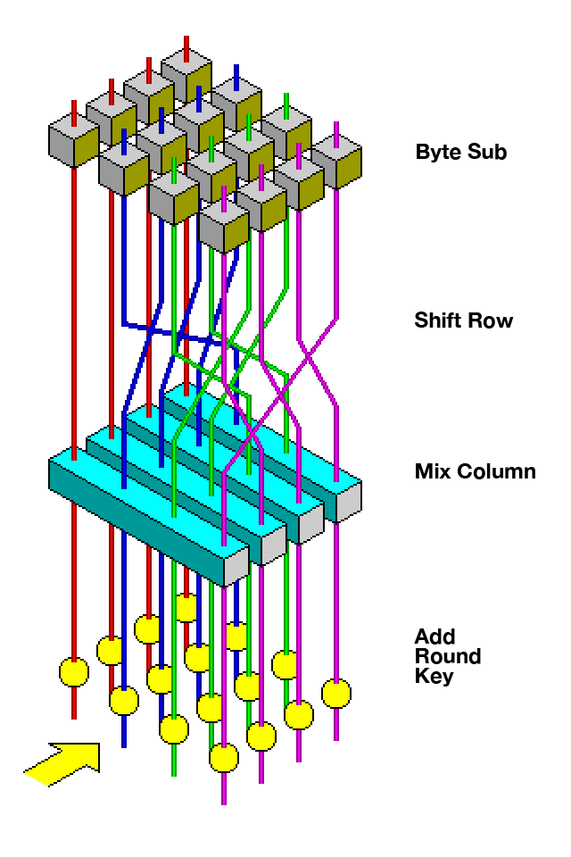

---
tags:
  - 现代硬件算法
  - 数论
created: 2026-09-11
source: https://en.algorithmica.org/hpc/number-theory/cryptography/
original_title: Cryptography
---

# 密码学

本文综述了与现代互联网时代密码学相关的所有主题。

密码学（cryptography，源自希腊语 kryptos"隐藏"与 graphein"书写"）研究在被称为"对手"（adversary）的第三方存在时，进行安全通信的技术。

## 非对称密码学

密码学主要基于这样一种观念：有些操作正向很容易，反向却极为困难。其中之一就是整数分解：选取两个大素数 $p$ 和 $q$ 并将它们相乘得到 $n = pq$ 很容易，但反向操作却极其困难。

1. 选取两个素数 $p$ 和 $q$，以及满足与 $\phi(n) = (p - 1) \cdot (q - 1)$ 互素的指数 $e$。选取较小的指数在计算上更合理，但安全性略低。通常人们并不在意，直接取 $e = 3$。
2. 计算 $e$ 模 $\phi(n)$ 的乘法逆元，即满足 $d \cdot e \equiv 1 \pmod \phi(n)$ 的 $d$。
3. 将 $(e, n)$ 设为公钥，发送给所有希望与我们通信的人。$(d, n)$ 是解密消息所需的信息。

实际的加密是计算 $c = m^e$，解密则是计算 $c^e = {m^e}^d = m^{ed} = m$。

为了计算 $d$ 并还原消息，攻击者需要重复第 2 步，即求出 $e$ 的逆元。这需要用到扩展欧几里得算法，但必须向其中输入 $\phi(n)$ 的值，而除非已知 $n$ 的因式分解，否则这一点很难做到。

在实际通信中，人们首先交换各自的公钥（以任意、可能不安全的方式进行），然后用它来加密消息。

这正是 Web 浏览器在建立 "https" 连接时所做的。你也可以用 GPG 手动完成。

### 中间人攻击

在建立初始通信时存在一个问题：攻击者可能替换通信对象并控制通信。

例如在你与银行之间："嘿，这是来自银行的一条消息。"

信任网络。例如，每个人都可以信任 Google，或者信任制造设备或操作系统的厂商。

## 对称密码学

RSA 的缺点在于计算困难。你绝不会想为每个从 YouTube 流式传输的 64 字节视频块执行 512 次模 $2^{512}$ 的乘法来解密。

此类方案确实存在，但它们需要一把安全的密钥。RSA 正是用于此目的，但在之后它们会切换到 AES。

混淆（confusion）与扩散（diffusion）。

混淆意味着密文的每一个二进制位（bit）都应当依赖于密钥的若干部分，从而掩盖二者之间的联系。

扩散意味着，如果我们改变明文中的单个比特，那么（从统计上看）密文中应当有一半的比特发生改变；类似地，如果我们改变密文中的单个比特，那么明文中大约也会有一半的比特发生改变。[3] 由于一个比特只有两种状态，当它们全部被重新计算、从一个看似随机的位置变为另一个时，会有一半的比特改变状态。

混淆这一性质隐藏了密文与密钥之间的关系。扩散的思想则是隐藏密文与明文之间的关系。

AES 由硬件实现。

## 完美安全性

几乎所有实用的密码学都依赖于某些假设。它们不可避免地会泄露至少一些关于消息的信息。

密码学函数的设计常常依赖于硬件实现效率，而非数学。

一次性密码本（one-time pad）无法被破解。如果俄罗斯某人想与美国人通信，他们会派出一名代表，送上装满熵（随机性）的手提箱。

其安全性依赖于 RSA 在事实上无法被高效求解。

AES 经 NSA 批准可用于 196 位与 256 位密钥。并非 128 位密钥不安全，只是……

量子计算就是其中之一。

[Shor 算法](https://en.wikipedia.org/wiki/Shor%27s_algorithm)（Shor's algorithm）能够在量子计算机上以多项式时间分解整数。但在 2019 年，所有的量子计算都更易在普通计算机上模拟。在真实量子计算机上被分解的最大数字是 4088459。

### RSA

...

## 密码学协议

在本文中，我们已了解如何：

* 在人们之间可共享某些随机信息的前提下传递两条消息。
* 在没有任何共同信息的情况下传递两条消息。
* 对消息签名以验证其真实性。
* 执行任何操作，尽管是以计算效率极低且不保密的方式。

如果你感到好奇，以下是一些值得思考的问题：

* 如何在不泄露任何信息的前提下比较两个数的大小？例如，你可能想与同事比较薪水，又不想因此被解雇。
* 如何在不暴露任何信息的情况下洗一副牌并打一手扑克？
* 私有的稳定匹配或其他多方计算？
* 私有集合求交？
* 当对手不止一个、而是占了 49% 时，如何让这一切保持安全？

密码学要有趣得多。

时序信息、功耗、电磁泄漏甚至声音，都可能提供额外的信息来源。
