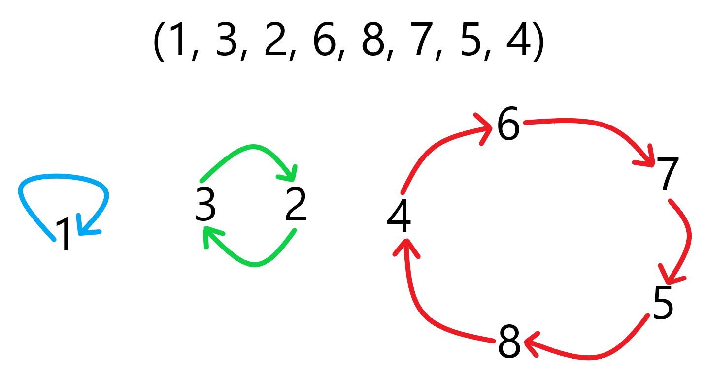
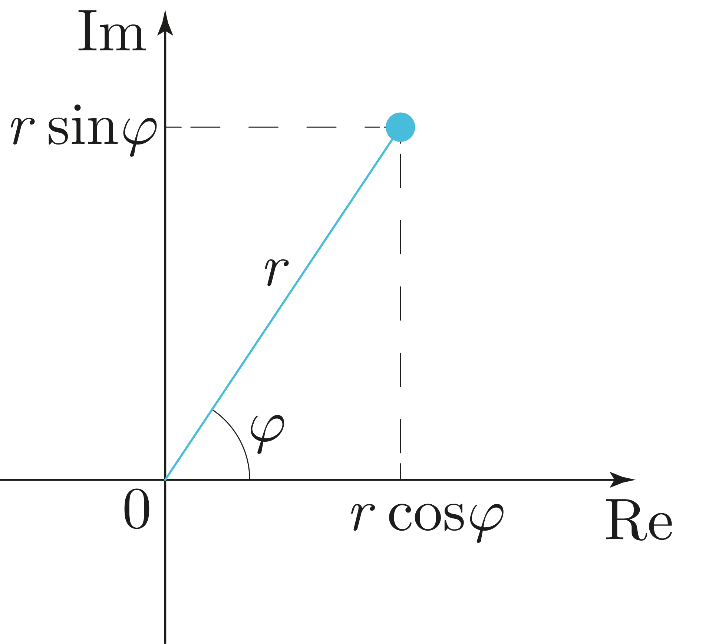
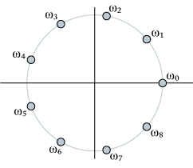

---
tags:
  - 现代硬件算法
  - 数论
created: 2026-09-11
source: https://en.algorithmica.org/hpc/number-theory/finite/
original_title: Finite Fields
---

# 有限域

还有其他数学对象的行为方式与素数模下的剩余相同。依据这些对象集合所保留的性质，它们被称为*群*（groups）、*环*（rings）和*域*（fields）。

### 置换

我们可以将置换的乘积定义为将一个置换作用于另一个置换。

该运算满足结合律，因此我们可以用快速幂在 $O(n \log n)$ 时间内计算 $n$ 次幂。



一般来说，这被称为*置换群*，而*群*是指在其上定义了某种运算的元素集合。

### 单位根

复数（complex numbers）是形如 $a + bi$ 的数，其中 $a$ 和 $b$ 为实数，$i$ 称为虚数单位：满足 $i^2 = -1$。

复数在代数中用于处理负数的根，因为就某种意义而言 $i$ 等于 $\sqrt{-1}$。与负数类似，它们在现实世界中并不真正存在，只存在于数学家的头脑中。

从几何角度思考复数最为方便。

复数的*模*（modulus）是实数 $r = \sqrt{a^2 + b^2}$。从几何上看，它是向量 $(a, b)$ 的长度。

复数的*辐角*（argument）是实数 $\phi \in (-\pi, \pi]$，满足 $\tan \phi = \frac{b}{a}$。从几何上看，它是向量 $(a, 0)$ 与 $(a, b)$ 之间的夹角。

这样我们便可以用极坐标表示复数：

$$
a + bi = r \cdot ( \cos \phi + i \sin \phi )
$$



这种表示法之所以有用，是因为若需要将两个复数相乘，借助高中三角学可以证明：我们无需做二项式展开，只需将它们的模相乘、辐角相加即可：

$$
\begin{aligned}
(a + bi) \cdot (c + di)
   &= r_1 \cdot ( \cos \phi_1 + i \sin \phi_1 ) \cdot r_2 \cdot ( \cos \phi_2 + i \sin \phi_2 )
\\ &= r_1 \cdot r_2 \cdot (\cos \phi_1 \cos \phi_2 - \sin \phi_1 \sin \phi_2 + i \cos \phi_1 \sin \phi_2 + i \cos \phi_2 \sin \phi_1 )
\\ &= r_1 \cdot r_2 \cdot (\cos (\phi_1 + \phi_2) + i \sin (\phi_1 + \phi_2) )
\end{aligned}
$$

现在，我们**定义**欧拉数 $e$ 为满足下式的数：

$$
e^{i\phi} = \cos \phi + i \sin \phi
$$

也就是说，仅为 $(\cos \phi + i \sin \phi)$ 引入这样一种记号，而不必深究将一个数提升到复数指数的真正含义。从几何上看，所有这些点都位于单位圆上。

这种记号很有用，因为我们可以将 $e^{i\phi}$ 当作普通的指数来处理。若要将单位圆上辐角分别为 $a$ 和 $b$ 的两个复数相乘，只需写出

$$
(\cos a + i \sin a) \cdot (\cos b + i \sin b) = e^{i (a+b)}
$$

你或许会问，这一切与有限环（finite rings）有何关系。事情是这样的：当我们将位于单位圆上的复数相乘时，它们的行为与整数剩余一样会"绕回"。它们仍然是无限多个，因此相似性并不明显，但请考虑：1 的 $n$ 次*根*可能有多少个？这些点被提升到 $n$ 次幂后会回到 1。

事实上恰好有 $n$ 个，且它们等距分布。确切地说，它们是如下形式的数：

$$
w_k = e^{i \tau \frac{k}{n}}
$$

其中 $\tau$ 表示 $2 \pi$（一种[现代记号](https://tauday.com/tau-manifesto)）。



第一个根 $w_1$（更准确地说应是第二个根，因为 $1$ 也是一个根）称为本原单位根（generating root of unity）。将它提升到 1 次、2 次等幂，将生成一串根，并在 $n$ 次迭代后循环：

$$
w_n = e^{i \tau \frac{n}{n}} = e^{i \tau} = e^{i \cdot 0} = w_0 = 1
$$

不在单位圆上的所有点，其模会过大或过小。而辐角不能被 $w_1$ 整除的所有点，其辐角会偏离太远。

这类结构被称为*环*，更准确地说，是*有限环*。

### Galois 域

剩余构成*有限环*。素数模下的剩余之所以不同，在于其乘法总存在逆运算，此时它被称为*有限域*（finite fields）。但素数并非唯一能容纳有限域的集合大小。

以素数构造有限域的问题在于，对于处理 2 的幂次数据的计算机而言，它较为浪费。

事实证明，对于任意素数 $p$，还可以构造大小为 $p^k$ 的域。这对计算机尤其有用，因为你可以取 $p=2$、$k=8$，这样一个字节恰好能容纳该集合的一个元素。

对于非素域，你不再使用整数的思路，而是将信息编码为一种特殊类型的多项式。首先，你选取一个*不可约多项式*（irreducible polynomial）。例如，对于 GF(8)，可取 $p(x) = x^3 + x + 1$：它无法分解为因式乘积。

集合中的元素由多项式的系数定义。由于每个系数非 0 即 1，这样的元素恰好有 256 个。

你将加法定义为元素的异或（xor），乘法定义为多项式相乘后再按该不可约多项式进行约简（做法与 GCD 类似）。

异或在计算上没问题，但我们不必做这种奇怪的乘法，而是可以利用元素不多这一事实，直接预计算一张包含 256 个单字节条目的查找表。

这听起来很复杂，但这一切都是为了实现高效：

```c++
char log[256], ilog[256];

char add(char x, char y) {
    return x ^ y;
}

char sub(char x, char y) {
    return x ^ y;
}

char mul(char x, char y) {
    return ilog[log[x] + log[y]];
}

char div(char x, char y) {
    return ilog[log[x] - log[y]];
}
```

这个具体的域是许多密码学与数据压缩算法的基础。事实上，当你加载本页时，你的计算机已将在通信中传输的一切转换为了这种形式。
