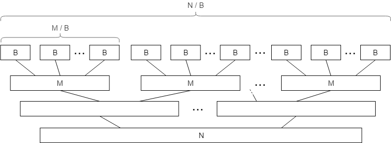

---
tags:
  - 现代硬件算法
  - 外部存储
created: 2026-09-11
source: https://en.algorithmica.org/hpc/external-memory/sorting/
original_title: External Sorting
---

# 外部排序

现在，让我们尝试为新的[[外部存储模型.md|外部存储模型]]设计一些真正有用的算法。本节的目标是循序渐进地构建更复杂的东西，最终得到*外部排序*及其有趣的应用。

该算法将基于标准的归并排序算法，因此我们需要先推导出它的主要原语。

### 归并

**问题。** 给定两个长度分别为 $N$ 和 $M$ 的有序数组 $a$ 和 $b$，产生一个包含它们所有元素、长度为 $N + M$ 的有序数组 $c$。

用于合并有序数组的标准双指针技巧如下所示：

```cpp
void merge(int *a, int *b, int *c, int n, int m) {
    int i = 0, j = 0;
    for (int k = 0; k < n + m; k++) {
        if (i < n && (j == m || a[i] < b[j]))
            c[k] = a[i++];
        else
            c[k] = b[j++];
    }
}
```

从内存操作的角度看，我们只是线性地读完了 $a$ 和 $b$ 的所有元素，并线性地写完了 $c$ 的所有元素。由于这些读与写可以被缓冲，它以 $SCAN(N+M)$ 次 I/O 操作工作。

到目前为止，例子都很简单，其分析与 RAM 模型相差不大，只不过我们把最终答案除以了块大小 $B$。但下面就是一个并非如此的情况。

**$k$ 路归并。** 考虑该算法的一个变体：我们需要合并的不是两个数组，而是总共大小为 $N$ 的 $k$ 个数组——做法是同样观察 $k$ 个值，选取其中的最小值，把它写入 $c$，并让其中一个迭代器自增。

在标准 RAM 模型中，渐近复杂度会乘以 $k$，因为每填好下一个元素都需要执行 $O(k)$ 次比较。但在外部存储模型中，由于我们在内存中所做的一切都不计入成本，只要我们能容纳 $(k+1)$ 个完整的块在内存中，也即当 $k = O(\frac{M}{B})$ 时，其渐近复杂度不会改变。

还记得我们引入计算模型时的[[外部存储模型.md|关于 $M \gg B$ 的假设]]吗？如果我们对某个 $\epsilon > 0$ 有 $M \geq B^{1+\epsilon}$，那么我们就能在内存中容纳任意次多项式数量的块，其中自然包括 $O(\frac{M}{B})$。这个条件被称为*高缓存假设*（tall cache assumption），它在许多其他外部存储算法中通常也是必需的。

### 归并排序

标准归并排序算法的"正常"复杂度是 $O(N \log_2 N)$：在它的每一层（共 $O(\log_2 N)$ 层）中，算法总共需要遍历全部 $N$ 个元素，并以线性时间将它们归并。

在外部存储模型中，当我们读取一个大小为 $M$ 的块时，我们可以"免费"地对其中的元素排序，因为它们已经在内存中。这样，我们可以把数组切分成 $O(\frac{N}{M})$ 个由连续元素组成的块，分别作为基步对它们排序，之后才进行归并。



这实际上意味着，在 I/O 操作层面，归并排序最底层的 $O(\log M)$ 层是免费的，而只有 $O(\log_2 \frac{N}{M})$ 层具有非零成本，每层都可以以总计 $O(\frac{N}{B})$ 的 IOPS 完成归并。这使得总 I/O 复杂度为

$$
O\left(\frac{N}{B} \log_2 \frac{N}{M}\right)
$$

这相当快。如果我们拥有 1GB 内存和 10GB 数据，这本质上意味着：对数据进行排序所需的努力，仅比读取数据多出一点点（略多于 3 倍）。有趣的是，我们还能做得更好。

### $k$ 路归并排序

半页之前我们学到，在外部存储模型中，我们可以像合并两个数组一样轻松地合并 $k$ 个数组——代价是读取它们。我们为什么不把这个事实用在这里呢？

让我们像之前那样在内存中对每个大小为 $M$ 的块排序，但在每个归并阶段，我们不是把已排序的块两两配对去归并，而是尽可能多地取能放进内存的块，进行一次 $k$ 路归并。这样，归并树的高度将大幅降低，而每一层仍然以 $O(\frac{N}{B})$ 的 IOPS 完成。

我们能一次性合并多少个有序数组？恰好 $k = \frac{M}{B}$，因为每个数组都需要一块内存。由于总层数将减少到 $\log_{\frac{M}{B}} \frac{N}{M}$，总复杂度也将降为

$$
SORT(N) \stackrel{\text{def}}{=} O\left(\frac{N}{B} \log_{\frac{M}{B}} \frac{N}{M} \right)
$$

请注意，在我们的例子中，我们有 10GB 数据、1GB 内存，而 HDD 的块大小约为 1MB。这使得 $\frac{M}{B} = 1000$、$\frac{N}{M} = 10$，于是该对数值小于 1（即 $\log_{1000} 10 = \frac{1}{3}$）。当然，我们不可能把数组排序得比读取它还快，因此这一分析适用于数据集极大、内存极小和/或块大小很大的情形，而在如今的现实中这种情况很少发生。

### 实际实现

在更现实的约束下，我们不必使用 $\log_{\frac{M}{B}} \frac{N}{M}$ 层，而可以只用两层：一层用于在大小为 $M$ 的块中对数据排序，另一层用于一次性归并它们全部。这样，从 I/O 操作的角度看，我们只需在数据集上循环两遍。而借助 1GB 内存与 1MB 块大小，这种方式可以对高达 1TB 大小的数组排序。

第一阶段在 C++ 中看起来是这样的。这个程序打开一个含有未排序整数的、大小为若干 GB 的二进制文件，以 256MB 的块读取它，在内存中排序，然后写回到名为 `part-000.bin`、`part-001.bin`、`part-002.bin` 等文件中：

```cpp
const int B = (1<<20) / 4; // 1 MB blocks of integers
const int M = (1<<28) / 4; // available memory

FILE *input = fopen("input.bin", "rb");
std::vector<FILE*> parts;

while (true) {
    static int part[M]; // better delete it right after
    int n = fread(part, 4, M, input);

    if (n == 0)
        break;
    
    // sort a block in-memory
    std::sort(part, part + n);
    
    char fpart[sizeof "part-999.bin"];
    sprintf(fpart, "part-%03d.bin", parts.size());

    printf("Writing %d elements into %s...\n", n, fpart);

    FILE *file = fopen(fpart, "wb");
    fwrite(part, 4, n, file);
    fclose(file);
    
    file = fopen(fpart, "rb");
    parts.push_back(file);
}

fclose(input);
```

现在剩下的就是将它们合并在一起。现代 HDD 的带宽可以相当高，而且可能有大量的分段需要合并，因此这一阶段的 I/O 效率并非我们唯一关心的：我们还需要一种比"用 $O(k)$ 次比较找最小值"更快的 $k$ 路合并方法。如果我们为这 $k$ 个元素维护一个最小堆（其方式与堆排序几乎一致），就可以在每元素的 $O(\log k)$ 时间内完成。

下面是如何实现它。首先，我们需要一个堆（C++ 中的 `priority_queue`）：

```c++
struct Pointer {
    int key, part; // the element itself and the number of its part

    bool operator<(const Pointer& other) const {
        return key > other.key; // std::priority_queue is a max-heap by default
    }
};

std::priority_queue<Pointer> q;
```

然后，我们需要分配并填满缓冲区：

```c++
const int nparts = parts.size();

auto buffers = new int[nparts][B]; // buffers for each part
int *l = new int[nparts],          // # of already processed buffer elements
    *r = new int[nparts];          // buffer size (in case it isn't full)

// now we add fill the buffer for each part and add their elements to the heap
for (int part = 0; part < nparts; part++) {
    l[part] = 1; // if the element is in the heap, we also consider it "processed"
    r[part] = fread(buffers[part], 4, B, parts[part]);
    q.push({buffers[part][0], part});
}
```

现在我们只需不断从堆中弹出元素写入结果文件，直到堆为空，并谨慎地分批写入与读取元素：

```cpp
FILE *output = fopen("output.bin", "w");

int outbuffer[B]; // the output buffer
int buffered = 0; // number of elements in it

while (!q.empty()) {
    auto [key, part] = q.top();
    q.pop();

    // write the minimum to the output buffer
    outbuffer[buffered++] = key;
    // check if it needs to be committed to the file
    if (buffered == B) {
        fwrite(outbuffer, 4, B, output);
        buffered = 0;
    }

    // fetch a new block of that part if needed
    if (l[part] == r[part]) {
        r[part] = fread(buffers[part], 4, B, parts[part]);
        l[part] = 0;
    }

    // read a new element from that part unless we've already processed all of it
    if (l[part] < r[part]) {
        q.push({buffers[part][l[part]], part});
        l[part]++;
    }
}

// write what's left of the output buffer
fwrite(outbuffer, 4, buffered, output);

//clean up
delete[] buffers;
for (FILE *file : parts)
    fclose(file);
fclose(output);
```

这个实现并非特别高效或安全（好吧，这基本就是纯 C），但作为如何与底层内存 API 协作的教学示例，它是个不错的例子。

### 连接

排序主要不是被单独使用，而是作为其他操作的中间步骤。外部排序的一个重要现实用例是连接（即"SQL join"），它被用于数据库及其他数据处理应用中。

**问题。** 给定两个元组列表 $(x_i, a_{x_i})$ 与 $(y_i, b_{y_i})$，输出一个列表 $(k, a_{x_k}, b_{y_k})$，满足 $x_k = y_k$。

最优解是对这两个列表排序，然后用标准的双指针技巧将它们合并。其 I/O 复杂度将与排序相同；而如果数组已经有序，则仅为 $O(\frac{N}{B})$。这就是大多数数据处理应用（数据库、MapReduce 系统）倾向于让它们的表至少部分有序的原因。

**其他方法。** 请注意，这一分析只适用于外部存储场景——即当你没有足够内存读取整个数据集时。在现实世界中，替代方法可能更快。

其中最简单的大概是*哈希连接*（hash join），大致如下：

```python
def join(a, b):
    d = dict(a)
    for x, y in b:
        if x in d:
            yield d[x]
```

在外部存储中，用哈希表连接两个列表是不可行的，因为这会涉及 $O(M)$ 次块读取，而每次读取其实只用到其中一个元素。

另一种方法是使用替代性的排序算法，例如基数排序（radix sort）。特别地，如果有足够内存为所有可能的键维护缓冲区，基数排序将以 $O(\frac{N}{B} \cdot w)$ 次块读取工作，并且在键较小、数据集较大的情况下可能更快。
