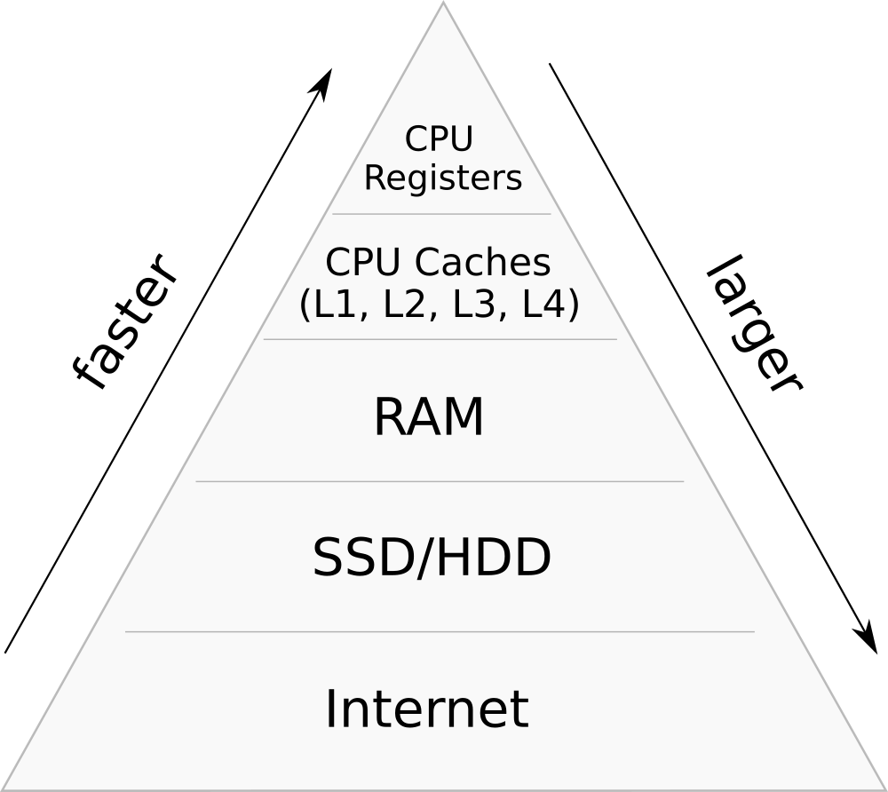

---
tags:
  - 现代硬件算法
  - 外部存储
created: 2026-09-11
source: https://en.algorithmica.org/hpc/external-memory/hierarchy/
original_title: Memory Hierarchy
---

# 存储层次

现代计算机内存具有高度的层次性。它由多个速度、大小各异的*缓存层*组成，其中*较高*层级通常会从*较低*层级中存储最常访问的数据，以降低延迟：每一层通常比上一层快一个数量级，但也更小和/或更昂贵。

抽象地说，各类存储设备都可以被描述为具有某种存储容量 $M$、并能以大小为 $B$ 的块（而非单个字节！）进行读写、且完成这些操作耗时固定的模块。

从这个视角看，每种内存都有几个重要特征：

- *总大小* $M$；
- *块大小* $B$；
- *延迟*，即取出一个字节所需的时间；
- *带宽*，它可能会高于「块大小乘以延迟」，这意味着 I/O 操作可以"重叠"；
- *成本*，指摊销意义上的成本，包括芯片价格、能耗要求、维护开销等。

下面是 2021 年商品硬件的大致对比表：

| 类型 | $M$      | $B$ | 延迟 | 带宽 | $/GB/月[^pricing] |
|:-----|:---------|-----|---------|-----------|:------------------|
| L1   | 10K      | 64B | 2ns     | 80G/s     | -                 |
| L2   | 100K     | 64B | 5ns     | 40G/s     | -                 |
| L3   | 1M/核  | 64B | 20ns    | 20G/s     | -                 |
| RAM  | GB 级      | 64B | 100ns   | 10G/s     | 1.5               |
| SSD  | TB 级      | 4K  | 0.1ms   | 5G/s      | 0.17              |
| HDD  | TB 级      | -   | 10ms    | 1G/s      | 0.04              |
| S3   | $\infty$ | -   | 150ms   | $\infty$  | 0.02[^S3]         |

实际上，每种内存都有许多具体细节，我们接下来逐一介绍。

[^pricing]: 定价信息取自 [Google Cloud Platform](https://cloud.google.com/products/calculator?skip_cache=true)。
[^S3]: 云存储通常具有[多个层级](https://aws.amazon.com/s3/storage-classes/)，如果你访问数据的频率越低，价格会越便宜。

### 易失性内存

一直到 RAM 层级为止的所有内存都被称为*易失性内存*，因为一旦断电或其他灾难发生，它们便无法持久保存数据。它速度很快，这正是计算机通电时用来存储临时数据的原因。

从最快到最慢：

- **CPU 寄存器**，即 CPU 用来存储所有中间值的零延迟访问数据单元，也可以被看作一种内存类型。它们的数量有限（例如仅有 16 个"通用"寄存器），在某些情况下，出于性能考虑你可能想把它们全部用上。
- **CPU 缓存。** 现代 CPU 有多层缓存（L1、L2，通常还有 L3，极少情况甚至有 L4）。最低层在核心之间共享，并且通常随核心数扩展（例如，一个 10 核 CPU 应拥有约 10M 的 L3 缓存）。
- **随机存取内存（RAM）**，这是第一种可扩展的内存类型：如今在公有云上你可以租用配有半 TB 内存的机器。你的大部分工作数据都应当存储于此。

CPU 缓存系统有一个重要概念——*缓存行*，它是 CPU 与 RAM 之间数据传输的基本单位。在大多数架构上，缓存行的大小为 64 字节，这意味着所有主存都被划分为 64 字节的块，而每当你请求（读或写）单个字节时，无论你是否愿意，你同时也会取回它所在的缓存行中的其余 63 个字节。

CPU 层面的缓存是基于缓存行的最近访问时间自动进行的。当被访问时，缓存行的内容被放置到最低缓存层，然后除非及时再次被访问，否则会逐步被淘汰到更高层级。程序员无法显式控制这一过程，但详尽地研究其运作机理是值得的，我们会在[[RAM与CPU缓存.md|下一章]]中这样做。

<!--

Caching is done not with a separate chip, but is embedded in the CPU itself. There are also multi-socket systems that support installing multiple CPUs in the motherboard. In this case, they have separate caching systems, and more over, each socket often becomes *local* to a certain part of the main memory and thus has increased latency (~100ns) for accessing locations outside of it. Such architectures are called NUMA ("Non-Uniform Memory Access") and used as a way to increase the total amount of RAM. We will not consider them for now, but they will become important in the context of parallel computing.

There are other caches inside CPUs that are used for something other than data. Instructions are fetched from memory roughly the same way that the data is fetched, so it is important not to wait for the instructions to load. For this reason, CPUs also have *instruction cache*, which, as the name suggests, is used for caching instructions that are read from the main memory. Its size and performance are about the same as for the L1 cache, and since it is not large, it makes sense to make binaries small in size so that the CPU does not "starve" from not being to fetch instructions in time.

-->

### 非易失性内存

虽然 CPU 缓存和 RAM 中的数据单元只轻轻存储着区区几个电子（这些电子会周期性泄漏，需要定期刷新），但*非易失性内存*中的数据单元却存储着数百个电子。这让数据能够在断电的情况下长时间保存，但代价是性能与耐久度——因为当你拥有更多电子时，它们与硅原子发生碰撞的机会也就更多。

<!-- error correction -->

以持久方式存储数据的方法有很多，但从程序员角度看，主要有以下这些：

- **固态硬盘（SSD）。** 它们的延迟相对较低，约为 0.1ms（$10^5$ ns），但成本也较高，而且由于每个单元只能被写入有限次数、寿命有限，这一成本进一步被放大。移动设备和大多数笔记本电脑都使用它，因为它结构紧凑且没有移动部件。
- **机械硬盘（HDD）** 的特殊之处在于，它们实际上是[旋转的实体盘片](https://www.youtube.com/watch?v=3owqvmMf6No&feature=emb_title)，并附有读写头。要读取某个内存位置，你需要等待盘片旋转到正确位置，然后极其精准地将磁头移动到该位置。这导致了一些非常奇特的访问模式：随机读取一个字节所花的时间，可能与读取其后的 1MB 数据相同——后者通常处于毫秒量级。由于这是计算机中除散热系统外唯一带有机械运动部件的部分，硬盘损坏相当频繁（数据中心 HDD 的平均寿命约为 3 年）。
- **网络附加存储**，即使用其他联网设备来存储数据的做法。它有两种不同类型。第一种是网络文件系统（NFS），这是一种通过网络挂载另一台计算机文件系统的协议。另一种是 API 驱动的分布式存储系统，最著名的当属 [Amazon S3](https://aws.amazon.com/s3/)，它由公有云中一批存储优化的机器支撑，内部通常使用廉价的 HDD 或某些[更奇特](https://aws.amazon.com/storagegateway/vtl/)的存储类型。虽然 NFS 若位于同一数据中心有时甚至比 HDD 还快，但公有云中的对象存储延迟通常为 50–100ms。它们通常高度分布式且经过复制以提高可用性。

由于 SSD/HDD 明显比 RAM 慢，这一层级及其以下的所有内容通常被称为*外部存储*。

与 CPU 缓存不同，外部存储可以被显式控制。这在很多情况下很有用，但大多数程序员只想把它抽象掉，当作主存的扩展来使用，而操作系统通过[[虚拟内存.md|虚拟内存]]具备这种能力。
