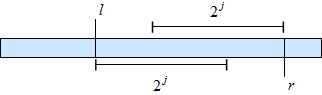

---
tags:
  - 现代硬件算法
  - 外部存储
created: 2026-09-11
source: https://en.algorithmica.org/hpc/external-memory/locality/
original_title: Spatial and Temporal Locality
---

# 时空局部性

<!--

In some environments, the programmer has no direct control over caching. Moreover, sometimes we don't even know the high-level characteristics of the cache hierarchy, such as the memory size of each layer, the block size, the strategy used for cache eviction, or even the number of cache layers.

-->

要从内存操作的角度精确评估一个算法的性能，我们需要考虑缓存系统的多个特征：缓存层的数量、每一层的[[存储层次.md|内存与块大小]]、每一层所用的具体[[淘汰策略.md|策略]]，有时甚至还有[[虚拟内存.md|内存分页]]机制的细节。

把所有这些都抽象掉，在算法设计的初期阶段大有裨益。与其计算理论上的缓存命中率，不如用更定性的方式去思考缓存性能，这往往更有意义。

<!--

In some environments, the programmer has no direct control over caching. Moreover, sometimes we don't even know the high-level characteristics of the cache hierarchy, such as the memory size of each layer, the block size, the strategy used for cache eviction, or even the number of cache layers.

In this article, we continue designing algorithms for the external memory model and address the problem of assessing I/O performance when some details of the cache system are unknown.

-->

在这个语境下，我们可以从两个主要方面谈论缓存复用的程度：

- *时间局部性*（temporal locality）指在小时间段内反复访问同一份数据，使得数据很可能在两次请求之间仍然保留在缓存中。
- *空间局部性*（spatial locality）指访问在内存位置上彼此相对靠近的元素，使得它们很可能被取入同一个内存块。

换言之，时间局部性是指：同一内存位置很可能很快再次被请求；而空间局部性是指：紧邻的位置很可能紧接着被请求。

本节中，我们将通过几个案例研究来展示这些高层概念如何助力实际优化。

### 深度优先 vs. 广度优先

考虑像归并排序这样的分治算法。它有两类实现方式：

- 我们可以按通常的方式递归地、也即"深度优先"地实现它：先排左半部分，再排右半部分，然后合并结果。
- 我们可以迭代地、也即"广度优先"地实现它：先做最底层的"层"，遍历整个数据集、把奇数位元素与偶数位元素两两比较，然后把前两个元素与后两个元素合并，再把第三对与第四对合并，依此类推。

第二种方法似乎更繁琐，但也更快——因为递归总是很慢，对吧？

一般而言，递归[[函数与递归.md|确实很慢]]，但对本例及许多类似的分治算法而言并非如此。尽管迭代法的优势在于只做顺序 I/O，但递归法具有好得多的*时间局部性*：当一个分段完全放入缓存后，它在所有更底层的递归中都留在那里，从而在后续带来更好的访问时间。

事实上，由于我们只需要把数组切分 $O(\log \frac{N}{M})$ 次即可达到这种状态，我们总共只需读取 $O(\frac{N}{B} \log \frac{N}{M})$ 个块；而在迭代法中，无论怎样，整个数组都会被从头读 $O(\log N)$ 次。由此带来的加速比为 $O(\frac{\log N}{\log N - \log M})$，最高可达一个数量级。

在实践中，递归仍会带来一定开销，因此使用混合算法是有意义的：我们不必一路递归到基例，而是在较低的递归层级切换到迭代代码。

### 动态规划

类似的推理也可应用于动态规划算法的实现，但结论恰恰相反。考虑经典的*背包问题*：给定 $N$ 个具有正整数代价 $c_i$ 的物品，挑选出一个总代价最大、且不超过给定常数 $W$ 的物品子集。

解决方法是引入*状态* $f[n, w]$，它表示仅使用前 $n$ 个物品所能达到的不超过 $w$ 的最大总代价。如果我们考虑"取或不取第 $n$ 个物品"、并利用动态规划的前置状态来做出最优决策，那么每个状态都可以在 $O(1)$ 时间内算出。

Python 有一个方便的 `lru_cache` 装饰器，可以用来通过记忆化递归实现它：

```python
@lru_cache
def f(n, w):
    # check if we have no items to choose
    if n == 0:
        return 0
    
    # check if we can't pick the last item (note zero-based indexing)
    if c[n - 1] > w:
        return f(n - 1, w)
    
    # otherwise, we can either pick the last item or not
    return max(f(n - 1, w), c[n - 1] + f(n - 1, w - c[n - 1]))
```

在计算 $f[N, W]$ 时，递归可能访问多达 $O(N \cdot W)$ 个不同的状态，这在渐近意义上是高效的，但在现实中相当缓慢。即便消除了 Python 递归的开销，以及 LRU 缓存正常工作所需的全部[[淘汰策略.md#最优缓存|哈希表查询]]，它仍然很慢，因为其在绝大部分执行过程中都在做随机 I/O。

我们可以换一种做法：为动态规划创建一个二维数组，并用一段漂亮的嵌套循环来替代递归：

```cpp
int f[N + 1][W + 1] = {0}; // this zero-fills the array

for (int n = 1; n <= N; n++)
    for (int w = 0; w <= W; w++)
        f[n][w] = c[n - 1] > w ?
                  f[n - 1][w] :
                  max(f[n - 1][k], c[n - 1] + f[n - 1][w - c[n - 1]]);
```

注意，我们计算下一层动态规划时只用了上一层。这意味着，如果我们能把一层存进缓存，就只需在外部存储中写 $O(\frac{N \cdot W}{B})$ 个块。

此外，如果我们只关心答案，其实不必存储整个二维数组，而只需保存最后一层。这让我们只需维持一个大小为 $W$ 的数组、即用 $O(W)$ 的内存即可。为了简化代码，我们可以略微改变动态规划，使其存储一个二值：用我们已经考虑过的物品，能否恰好凑出和为 $w$。这一动态规划计算起来还要更快：

```cpp
bool f[W + 1] = {0};
f[0] = 1;
for (int n = 0; n < N; n++)
    for (int x = W - c[n]; x >= 0; x--)
        f[x + c[n]] |= f[x];
```

顺带一提，既然现在只用到简单的位运算，它还可以用位集进一步优化：

```cpp
std::bitset<W + 1> b;
b[0] = 1;
for (int n = 0; n < N; n++)
    b |= b << c[n];
```

令人意外的是，仍有改进空间，我们稍后会回到这个问题。

### 稀疏表

*稀疏表*（sparse table）是一种*静态*数据结构，常用于解决*静态 RMQ* 问题以及计算任何类似的*幂等区间归约*。它可以被形式化地定义为一个大小为 $\log n \times n$ 的二维数组：

$$
t[k][i] = \min \{ a_i, a_{i+1}, \ldots, a_{i+2^k-1} \}
$$

用通俗的话说：我们对每个长度为 2 的幂的区间存放其最小值。

这样的数组可用于在常数时间内计算任意区间的最小值，因为对于任意区间，我们总能找到两个可能有重叠、且大小同为 2 的某次幂的区间，它们的并集正好覆盖整个区间。



这意味着，我们只需取这两个预先算好的最小值中的较小者作为答案：

```cpp
int rmq(int l, int r) { // half-interval [l; r)
    int t = __lg(r - l);
    return min(mn[t][l], mn[t][r - (1 << t)]);
}
```

`__lg` 函数是 GCC 中可用的一条内建函数，用于计算一个数的二进制对数并向下取整。它内部使用了 `clz`（"计算前导零"）指令，并用 32（在 32 位整数情况下）减去这个计数，因此只需几个周期。

我在本文中提起它，是因为它有多种不同的构建方式，在内存操作效率上各有差异。一般来说，稀疏表可以用动态规划的方式、以 $O(n \log n)$ 时间构建：按 $i$ 或 $k$ 递增的顺序迭代，并应用如下恒等式：

$$
t[k][i] = \min(t[k-1][i], t[k-1][i+2^{k-1}])
$$

现在，需要做两个设计选择：对数大小 $k$ 应当作为第一维还是第二维，以及应优先迭代 $k$ 还是 $i$。这意味着共有 $2\times2=4$ 种构建方式，而下面这种是最优的：

```cpp
int mn[logn][maxn];

memcpy(mn[0], a, sizeof a);

for (int l = 0; l < logn - 1; l++)
    for (int i = 0; i + (2 << l) <= n; i++)
        mn[l + 1][i] = min(mn[l][i], mn[l][i + (1 << l)]);
```

这是内存布局与迭代顺序的唯一一种组合，能够产生漂亮的线性遍历，速度约快 3 倍。作为练习，请考虑另外三种变体，并思考*为什么*它们更慢。

### 数组结构（AoS） vs. 结构体数组（SoA）

假设你想实现一个二叉树，并把它的字段分别存放在独立的数组中，像这样：

```cpp
int left_child[maxn], right_child[maxn], key[maxn], size[maxn];
```

这种把每个字段与其他字段分开存储的内存布局，称为*结构体数组*（struct-of-arrays，SoA）。在大多数情况下，实现树操作时，你会访问一个节点，紧接着又访问它的全部或大部分内部数据。如果这些字段是分开存储的，就意味着它们也位于不同的内存块中。若所请求的某些字段恰好已被缓存、而另一些没有，你仍得等待其中最慢的那个被取回。

相反，如果采用数组结构（AoS）存储，由于一个节点的全部数据都位于同一个块中、会一次性被取回，你所需的块读取次数会减少约 4 倍：

```cpp
struct Node {
    int left_child, right_child, key, size;
};

Node t[maxn];
```

AoS 布局通常更受数据结构青睐，但 SoA 仍有很好的用途：虽然它不利于查找，但对线性扫描要好得多。

这种设计上的差异在数据处理应用中很重要。例如，数据库可以是*行式*或*列式*（也称*列存*）的：

- *行式*存储格式用于：你需要在大型数据集中搜索数量有限的物体，和/或取出它们的全部或大部分字段。例子：PostgreSQL、MongoDB。
- *列式*存储格式用于大数据处理与分析，因为无论如何你都需要扫描全部数据来计算某些统计量。例子：ClickHouse、Hbase。

列式格式还有一个额外的优点：由于不同字段存储在独立的外部存储区域中，你只需读取所需要的字段。
