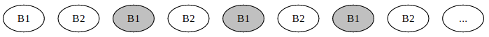

---
tags:
  - 现代硬件算法
  - 外部存储
created: 2026-09-11
source: https://en.algorithmica.org/hpc/external-memory/policies/
original_title: Eviction Policies
---

# 淘汰策略

你可以手动控制程序的 I/O 操作，但在大多数时候，人们只是依赖自动的缓冲与缓存，要么是出于懒惰，要么是因为计算环境的限制。

但自动缓存也有它自己的难题。当一个程序耗尽用于存储中间数据的工作内存时，它就需要丢弃一个块，以便为新块腾出空间。在冲突发生时，决定缓存中保留哪些数据的具体规则，被称为*淘汰策略*（eviction policy）。

这条规则可以是任意的，但有几个流行的选择：

- 先进先出（FIFO）：简单地淘汰最早加入的块，完全不考虑它此前被访问的频率（与 FIFO 队列的方式相同）。
- 最近最少使用（LRU）：淘汰最长时间未被访问的块。
- 后进先出（LIFO）与最近最常使用（MRU）：与前两者相反。删除最"热"的块看似有害，但在某些场景下这些策略是最优的，例如在一个文件上循环反复地遍历。
- 最不常使用（LFU）：统计每个块被请求的频率，并丢弃使用次数最少的那个。一些变体还会考虑访问模式随时间的变化，例如使用时间窗口只考虑最近 $n$ 次访问，或使用指数平均来给最近的访问更大权重。
- 随机替换（RR）：随机丢弃一个块。其优点是不需要维护任何带有块信息的数据结构。

淘汰策略的精确度，与其实现复杂性带来的额外开销之间，存在一种自然的权衡。对于 CPU 缓存，你需要一种简单的策略，能够轻易地在硬件中以近乎零的延迟实现；而在节奏更慢、更可规划的场景中，例如 Netflix 决定把电影存放在哪些数据中心、或 Google Drive 优化用户数据的存放位置，使用更复杂的策略（甚至可能涉及一些机器学习来预测数据何时会被再次访问）就变得有意义了。

### 最优缓存

除了上述策略之外，还存在理论上的*最优策略*，记作 $OPT$ 或 $MIN$，它对给定的查询序列确定应当保留哪些块，以使缓存未命中的总数最小。

这些决策可以用一种称为*Bélády 算法*的简单贪心方法来制定：我们只需保留*最晚才会被使用*的块，并且可以用反证法证明，这样做总是最优解之一。这种方法的缺点在于，你要么需要预先掌握这些查询，要么能以某种方式预测未来。

好消息是，从渐近复杂度的角度看，具体使用哪种方法其实无关紧要。[Sleator 与 Tarjan 证明](https://www.cs.cmu.edu/~sleator/papers/amortized-efficiency.pdf)，在大多数情况下，像 $LRU$ 这样的流行策略与 $OPT$ 的差距仅在一个常数因子之内。

**定理。** 令 $LRU_M$ 与 $OPT_M$ 分别表示：一台拥有 $M$ 内部内存的计算机，在执行同一算法时，分别遵循最近最少使用替换策略与理论最小值所需的访问块数。则有：

$$
LRU_M \leq 2 \cdot OPT_{M/2}
$$

证明的核心思想是考虑最坏情形。对 LRU 而言，最坏情形是重复出现 $\frac{M}{B}$ 个不同块的序列：每个块都是新的，因此 LRU 的缓存未命中率为 100%。与此同时，$OPT_{M/2}$ 能够缓存其中一半（但无法更多，因为它只有一半的内存）。因此 $LRU_M$ 需要取回的块数是 $OPT_{M/2}$ 的两倍，这基本上就是该不等式所表达的内容，而 LRU 任何更好的表现只会削弱它。

这是一个令人宽慰的结果。它意味着，至少在渐近 I/O 复杂度层面，你可以假设淘汰策略要么是 LRU、要么是 OPT—— whichever 对你而言更简单——并据此做复杂度分析，而你得到的结果通常可以推广到任何其他合理的缓存替换策略。

### 实现缓存

<!-- TODO: actual C/C++ implementation -->

要找到合适的块并在合理时间内淘汰它，并不总是一件轻松的事。虽然 CPU 缓存是在硬件中实现的（通常是 LRU 的某种变体），但更高层级的淘汰策略必须依赖软件来存储关于块的某些统计信息，并在其上维护数据结构以加速这一过程。

让我们想想，要实现一个 LRU 缓存需要些什么。假设我们要存储一些中等大小的对象——比如说，我们需要为某个数据库开发一个缓存，其中请求与回复都是某种 SQL 方言下的中等长度字符串，因此我们数据结构的开销虽小，却也不可忽略。

<!-- https://www.geeksforgeeks.org/lru-cache-implementation/ -->

首先，我们需要一个哈希表来找到数据本身。由于我们在处理大型变长字符串，用查询的哈希值作为键、用一个指向堆上分配的结果字符串的指针作为值，是合情合理的。

为了实现 LRU 逻辑，最简单的方法是创建一个队列，在访问对象时把当前时间与对象的 ID/键放入其中，并存储每个对象上一次被访问的时间（不必是时间戳——任何递增的计数器都可以）。

现在，当我们需要腾出空间时，可以通过从队首弹出元素来找到最近最少使用的对象。我们不能简单地删除它们，因为它们可能自其记录被加入队列之后又被访问过。因此我们需要检查：把它们放入队列的时间是否与其上一次被访问的时间一致，只有一致时才释放内存。

这里剩下的唯一问题是：我们在每次块被访问时都向队列添加一个条目，而只在发生缓存未命中、并开始从队首不断弹出直到匹配时才移除条目。这可能导致队列溢出，为了缓解这一点，我们不应"添加后便置之不理"，而是在缓存命中时立即把它移动到队列末尾。

为了支持这一点，我们需要在一条双向链表上实现该队列，并在哈希表中存储一个指向该块在队列中节点的指针。这样一来，当发生缓存命中时，我们顺着指针在常数时间内从链表中移除该节点，并把一个更新的节点加到队列末尾。这样，任意时刻队列中的节点数都恰好等于我们拥有的对象数，而每个缓存条目的内存开销将保证为常数。

作为练习，请尝试思考实现其他缓存策略的方法。

<!-- It is quite fun, I assure you. -->
