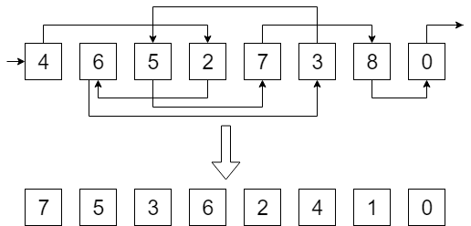

---
tags:
  - 现代硬件算法
  - 外部存储
created: 2026-09-11
source: https://en.algorithmica.org/hpc/external-memory/list-ranking/
original_title: List Ranking
---

# 链表求秩

本节中，我们将运用[[外部排序.md|外部排序]]与[[外部排序.md#实际实现|连接]]来解决一个表面上看起来无用、实则被大量外部存储算法与并行算法用作关键原语的问题。

**问题。** 给定一个单向链表，计算每个元素的*秩*，即它到*最后一个*元素的距离。

这个问题在 RAM 模型中可以平凡地解决：你只需用一个计数器遍历整个链表。但这种"指针跳跃"在外部存储场景下并不奏效，因为链表节点是任意存储的，而在最坏情况下，每读取一个新节点都可能要求读取一个新块。

### 算法

考虑该问题稍一般化的版本。现在，每个元素带有一个*权重* $w_i$，而对于每个元素，我们需要计算其所有前置元素的权重之和，而非仅仅它的秩。要解决最初的问题，我们只需令所有权重都等于 1 即可。

该算法的核心思想是：删除部分比例的元素，递归地解决问题，然后利用这些权重秩来重建原问题的答案——这正是棘手之处。

考虑三个连续的元素 $x$、$y$ 和 $z$。假设我们删除了 $y$，并针对包含 $x$ 和 $z$ 的剩余链表解决了问题，现在需要还原原始三元组的答案。$x$ 的权重将保持正确不变，但我们需要计算 $y$ 的答案，并为 $z$ 做相应调整，即：

- $w_y' = w_y + w_x$
- $w_z' = w_z + w_y + w_x$

现在，我们可以删除（比如说）第一个元素，递归地解决问题，并为原数组重新计算权重。但遗憾的是，这样做的时间复杂度会是二次的，因为为了完成更新，我们需要知道其邻居在哪里，而由于我们没法把整个数组都放进内存，每次都得扫描一遍。

因此，在每一步中，我们希望删除尽可能多的元素。但同时存在一个约束：我们不能删除两个相邻的元素，否则合并结果就不会那么简单了。

理想情况下，我们希望把链表拆分为偶数位和奇数位元素，但是否能做到这一点并不比原问题更简单。一种变通办法是随机地选择元素：对每个元素抛一次硬币，然后删除所有"正面"之后紧跟着一个"反面"的元素。这样就不会有任何两个相邻元素同时被选中，而且平均而言我们能去掉当前链表的 ¼。该方案的算术复杂度仍然保持线性，因为

$$
T(N) = T\left(\frac{3}{4} N\right) = O(N)
$$

这里唯一棘手的地方在于：如何在外部存储中实现合并步骤。为了高效地完成它，我们需要把链表维护成如下形式：

- 元组 $(i, j)$ 的列表，表示元素 $j$ 跟在元素 $i$ 之后；
- 元组 $(i, w_i)$ 的列表，表示元素 $i$ 当前具有权重 $w_i$；
- 一个被删除元素的列表。

现在，为了在随机删除某些元素并递归求解子问题之后还原答案，我们需要用三个指针遍历所有列表，寻找被删除的元素。对于其中每个元素，我们会把 $(j, w_i)$ 写入一个单独的表，这表示在递归步骤之前，我们需要给 $j$ 加上 $w_i$。随后，我们可以将这张新表与初始权重做连接，并将这些额外权重加到它们之上。

从递归返回后，我们需要为被删除的元素更新权重，这可以用同样的技巧完成，只不过遍历的是反向连接而非正向连接。

因此，该算法的 I/O 复杂度将与连接相同，即 $SORT(N) = O\left(\frac{N}{B} \log_{\frac{M}{B}} \frac{N}{M} \right)$。

### 应用

链表求秩在图算法中尤为有用。

例如，我们可以通过由树构造一个对应于其欧拉巡回的链表，然后应用链表求秩算法，从而在外部存储中获得一棵树的欧拉巡回——每个节点的秩将与它在欧拉巡回中的下标 $tin_v$ 相同。为了构造这个链表，我们需要：

- 把每条无向边拆分为两条有向边；
- 为每个向上边复制父节点（因为链表节点只能有一个入边，但某些顶点会被访问多次）；
- 把每个这样的节点导向"下一个兄弟"（如果有的话），否则导向它自己的父节点；
- 最后在根处断开所得的环。

这一通用技巧被称为*树收缩*，它是大量树算法的基石。

同样的方法也可以应用到并行算法中，我们将在第二部分更深入地探讨。
