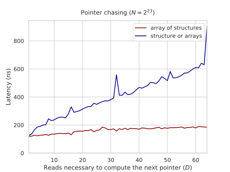
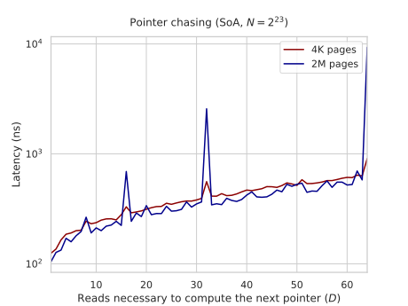
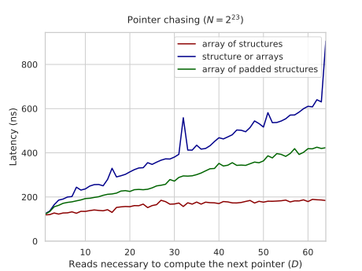
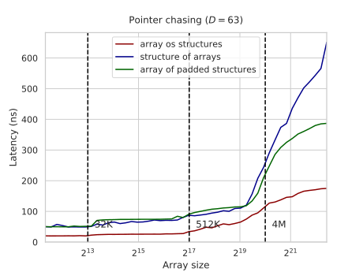
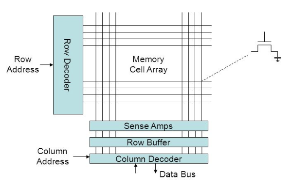

---
tags:
  - 现代硬件算法
  - RAM与CPU缓存
created: 2026-09-11
source: https://en.algorithmica.org/hpc/cpu-cache/aos-soa/
original_title: AoS and SoA
---

# AoS 与 SoA

将需要同时获取的数据放在一起通常是有益的：最好放在同一条缓存行上，若做不到，则放在相邻的缓存行上。这样可以改善你访存的[[时空局部性.md|空间局部性]]，对访存受限算法的性能产生积极影响。

为了演示这样做可能带来的影响，我们对[[内存延迟.md|指针追踪]]基准测试做出修改，使得下一个指针不是由一个字段、而是由数量可变（$D$ 个）的字段计算而来。

### 实验

第一种方法将把这些字段作为二维数组的各行放在一起。我们将这种变体称为*结构体数组（array of structures，AoS）*：

```c++
const int M = N / D; // # 次内存访问
int p[M], q[M][D];

iota(p, p + M, 0);
random_shuffle(p, p + M);

int k = p[M - 1];

for (int i = 0; i < M; i++)
    q[k][0] = p[i];

    for (int j = 1; j < D; j++)
        q[i][0] ^= (q[j][i] = rand());

    k = q[k][0];
}

for (int i = 0; i < M; i++) {
    int x = 0;
    for (int j = 0; j < D; j++)
        x ^= q[k][j];
    k = x;
}
```

而在第二种方法中，我们将它们分开存放。最偷懒的做法是转置二维数组 `q`，并在其后的所有访问中交换下标：

```c++
int q[D][M];
//    ^--^
```

以此类推，我们将这种变体称为*数组结构体（structure of arrays，SoA）*。显然，对于较大的 $D$，它的表现要差得多：



两种变体的性能都随 $D$ 线性增长，但由于数据顺序存储，AoS 需要获取的缓存行总数最多只有前者的 1/16。即使在 $D=64$ 时，处理其余 63 个值所额外花费的时间也小于第一次获取所带来的延迟。

你还可以看到在 2 的幂处出现的尖峰。AoS 表现略好，是因为它可以借助 SIMD 更快地计算[[归约.md|水平异或和]]。相比之下，SoA 的表现要差得多，但这与 $D$ 无关，而是与 $\lfloor N / D \rfloor$（第二维的大小）是一个较大的 2 的幂有关：这引发了一种相当复杂的[[缓存关联度.md|缓存关联度]]效应。

### 临时存储争用

乍一看，似乎不应该有任何缓存问题，因为 $N=2^{23}$，数组本身就太大，一开始就无法装进 L3 缓存。微妙之处在于，为了并行处理来自不同内存位置的多个元素，你仍然需要一些空间来临时存放它们。你不能直接用寄存器，因为寄存器数量不够，所以它们必须存放在缓存中，即使在一微秒之后你就不再需要它们了。

因此，当 `N / D` 是一个较大的 2 的幂、并且我们沿着第一维遍历数组 `q[D][N / D]` 时，我们临时需要的某些内存地址会映射到同一条缓存行——而由于那里空间不足，其中许多地址将不得不从内存层级的更上层重新获取。

还有另一个令人费解的现象：如果我们启用[[内存分页.md|大页]]，对于大多数 $D$ 值，它如预期那样使总延迟降低了 10-15%，但对于 $D=64$，它却让情况恶化了十倍：



我怀疑即使是设计内存控制器的工程师也无法立刻解释发生了什么。

简而言之，差异在于：与每个核心私有的 L1/L2 缓存不同，L3 缓存在不同核心共享该缓存时，必须使用*物理*内存地址而非*虚拟*内存地址来进行同步。

当我们使用 4K 内存页时，虚拟地址会一定程度任意地分散到物理内存中，这使得缓存关联度问题不那么严重：物理地址只对 4K 字节取模后具有相同的余数，而不是像虚拟地址那样对 `N / D` 取模。而当我们明确要求大页时，这一最大对齐上限提升到了 2M，缓存行因此受到更大的争用。

这是我所知的唯一一个启用大页反而让性能变差、甚至差到十分之一的例子。

### 填充式 AoS

只要获取的是相同数量的缓存行，它们位于何处应该无关紧要，对吧？我们来验证一下，并在 AoS 代码中改用[[缓存行.md|填充整数]]：

```c++
struct padded_int {
    int val;
    int padding[15];
};

const int M = N / D / 16;
padded_int q[M][D];
```

除此之外，我们仍在计算 $D$ 个填充整数的异或和。我们恰好获取 $D$ 条缓存行，但这一次是顺序获取的。运行时间本应与 SoA 没有区别，然而实际并非如此：



在 $D=63$ 时，运行时间大约降低了 ⅓，但这只适用于超过 L3 缓存大小的数组。如果我们固定 $D$ 而改变 $N$，你会看到填充版本在较小数组上表现略差，因为随机[[缓存行.md|缓存共享]]的机会更少了：



由于在较小数组大小上性能不受影响，这显然与 RAM 的工作方式有关。

### RAM 特定的时序

从性能分析的角度来看，RAM 中的所有数据在物理上都存储在一个由微小电容单元组成的二维数组中，这个数组被划分为行与列。要读取或写入任意一个单元，你需要执行一到三个动作：

1. 将某一行的内容读入一个*行缓冲（row buffer）*，这会临时使电容放电。
2. 读取或写入该行缓冲中的特定单元。
3. 将行缓冲的内容写回电容，以便数据得以保留，且行缓冲可用于其他内存访问。

关键在于：对于对应同一行的两次内存访问，你不必在它们之间执行第 1 步和第 3 步——你可以直接把行缓冲当作临时缓存使用。这三个动作耗时大致相同，因此这一优化使得长序列的行内（row-local）访问相比分散的访问模式快了三倍。



行的大小因硬件而异，但通常介于 1024 到 8192 字节之间。因此，即使填充式 AoS 基准测试将每个元素放在独立的缓存行中，它们仍然极有可能位于同一个 RAM 行上，整个读取序列的运行时间约为第一次内存访问延迟加上其 ⅓。
