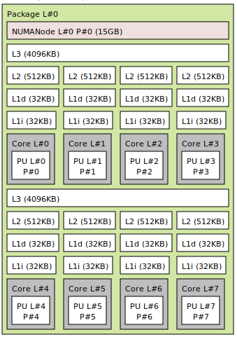
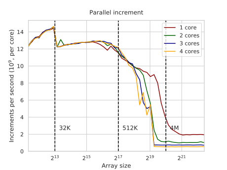
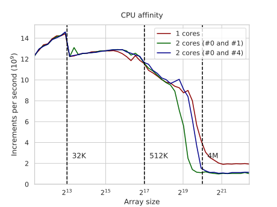
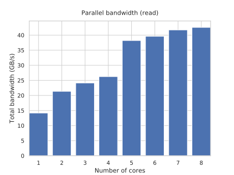

---
tags:
  - 现代硬件算法
  - RAM与CPU缓存
created: 2026-09-11
source: https://en.algorithmica.org/hpc/cpu-cache/sharing/
original_title: Memory Sharing
---

# 内存共享

从层级中某一层开始，缓存变为在不同核心之间*共享*。这减少了芯片总面积，让你能在单块芯片上集成更多核心，但也带来了一些"吵闹的邻居"问题，因为它限制了单个执行线程可用的有效缓存大小和带宽。

在大多数 CPU 上，只有最后一层缓存是共享的，而且并非总是以统一的方式。在我的机器上，有 8 个物理核心，L3 缓存大小为 8M，但它被分成两半：两组各 4 个核心各自拥有自己 4M 的 L3 缓存区域，而非全部。

还有更复杂的拓扑结构，其中访问某些内存区域需要非恒定的时间，且对每个核心而言各不相同（这[有时并非有意为之](https://randomascii.wordpress.com/2022/01/12/5-5-mm-in-1-25-nanoseconds/)）。这种架构特性称为*非一致内存访问（non-uniform memory access，NUMA）*，在装有多个独立 CPU 芯片的多路系统中就是这种情况。

在 Linux 上，可以用 `lstopo` 获取内存系统的拓扑：



这对并行算法有一些重要启示：多线程内存访问的性能取决于哪些核心在运行哪些执行线程。为了演示这一点，我们将并行运行[[内存带宽.md|带宽基准测试]]。

### CPU 亲和性

我们不必修改源代码以在多线程上运行，而只需用 [GNU parallel](https://www.gnu.org/software/parallel/) 运行多个相同的进程。为了控制哪些核心执行它们，我们用 `taskset` 设置它们的*处理器亲和性（processor affinity）*。下面这条组合命令运行 4 个进程，它们可以在 CPU 的前 4 个核心上运行：

```bash
parallel taskset -c 0,1,2,3 ./run ::: {0..3}
```

下面是当我们改变同时运行的进程数量时得到的结果：



你现在可以看到，当数组超出 L2 缓存（它是每个核心私有的）时，随着进程数量增多，性能会下降，因为各核心开始争抢共享的 L3 缓存和 RAM。

我们特意将所有进程设置为运行在前 4 个核心上，因为它们拥有统一的 L3 缓存。如果某些进程被调度到另一半核心上，对 L3 缓存的争用就会少一些。操作系统并不会[[统计采样剖析.md|监控]]此类活动——一个进程在做什么属于它自己的私事——因此默认情况下，它在执行期间任意地将线程分配给核心，而不关心缓存亲和性，只顾及核心负载。

让我们再运行一个基准测试，但这次将进程固定到不共享 L3 缓存的不同 4 核组上：

```bash
parallel taskset -c 0,1 ./run ::: {0..1}  # 共享 L3 缓存
parallel taskset -c 0,4 ./run ::: {0..1}  # 不共享 L3 缓存
```

它的表现更好——仿佛可用 L3 缓存和 RAM 带宽翻了一倍：



这些问题在基准测试中尤其棘手，并且是计时并行应用时噪声的一大来源。

### 占满带宽

当观察第一张图的 RAM 部分时，似乎随着核心增多，每个进程的吞吐量变为 ½、⅓、¼……而总带宽保持恒定。但这并不完全正确：争用确实造成了损害，但单个 CPU 核心通常无法占满全部 RAM 带宽。

如果我们更仔细地画图，会看到总带宽实际上随核心数量增加——尽管不是成比例地增加，并最终逼近其理论最大值 ~42.4 GB/s：



注意我们仍然指定了处理器亲和性：$k$ 线程的运行使用最前面的 $k$ 个核心。这正是为什么从 4 核切换到 5 核时我们会得到如此巨大的性能提升：如果请求经由独立的 L3 缓存，你就能获得更多的 RAM 带宽。

一般而言，为了达到最大带宽，你应当始终对称地拆分一个应用的线程。
