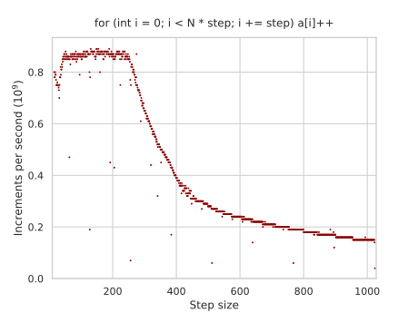
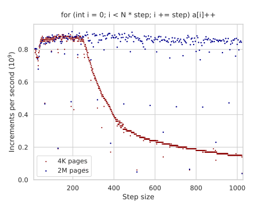
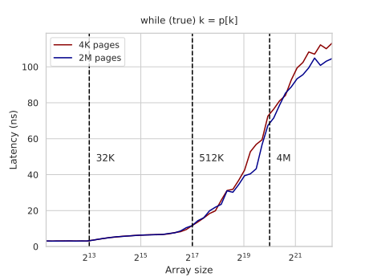

---
tags:
  - 现代硬件算法
  - RAM与CPU缓存
created: 2026-09-11
source: https://en.algorithmica.org/hpc/cpu-cache/paging/
original_title: Memory Paging
---

# 内存分页

[[缓存关联度.md|再次]]考虑那个跨步递增循环：

```cpp
const int N = (1 << 13);
int a[D * N];

for (int i = 0; i < D * N; i += D)
    a[i] += 1;
```

我们改变步长 $D$ 并相应地增大数组大小，使得迭代总数 $N$ 保持恒定。由于内存访问总数也保持恒定，对于所有 $D \geq 16$，我们应当恰好获取 $N$ 条缓存行——确切地说，是 $64 \cdot N = 2^6 \cdot 2^{13} = 2^{19}$ 字节。这恰好能装进 L2 缓存，无论步长如何，吞吐量图应当看起来是平坦的。

这一次，我们考虑更大范围的 $D$ 值，直到 1024。从大约 256 开始，图像绝对不再平坦：



这一反常现象同样源于缓存系统，尽管标准的 L1-L3 数据缓存与此无关。[[虚拟内存.md|虚拟内存]]才是罪魁祸首，具体而言是*转译后备缓冲器（translation lookaside buffer，TLB）*，这是一个负责获取虚拟内存页物理地址的缓存。

在[我的 CPU](https://en.wikichip.org/wiki/amd/microarchitectures/zen_2)上，有两级 TLB：

- L1 TLB 有 64 项，如果页大小为 4K，那么它可以处理 $64 \times 4K = 512K$ 的活动内存而不必访问 L2 TLB。
- L2 TLB 有 2048 项，它可以处理 $2048 \times 4K = 8M$ 的内存而不必访问页表。

当 $D$ 增长到 256 时，分配了多少内存？你猜到了：正是 $8K \times 256 \times 4B = 8M$，恰好是 L2 TLB 所能处理的极限。当 $D$ 超过这个值，一些请求开始被重定向到主页表，而主页表具有极大的延迟和非常有限的吞吐量，从而成为整个计算的瓶颈。

### 改变页大小

那 8MB 的无减速内存看起来是一个相当苛刻的限制。虽然我们无法改变硬件特性来解除它，但我们*可以*增大页大小，从而减轻对 TLB 容量的压力。

现代操作系统允许我们既全局地、也针对单个分配来设置页大小。CPU 只支持一组规定的页大小——以我的为例，可以使用 4K 或 2M 页。另一个典型的页大小是 1G——它通常只与拥有数百 GB RAM 的服务器级硬件相关。任何大于默认 4K 的页，在 Linux 上称为*大页（huge pages）*，在 Windows 上称为*大页面（large pages）*。

在 Linux 上，有一个特殊的系统文件管控着大页的分配。下面演示如何让内核在每次分配时都给你大页：

```bash
$ echo always > /sys/kernel/mm/transparent_hugepage/enabled
```

像这样全局启用大页并不总是个好主意，因为它降低了内存粒度，并提高了进程消耗的最小内存——而某些环境中进程数多于空闲内存的兆字节数。因此，除了 `always` 和 `never`，该文件中还有第三个选项：

```bash
$ cat /sys/kernel/mm/transparent_hugepage/enabled
always [madvise] never
```

`madvise` 是一个特殊的系统调用，它让程序向内核建议是否使用大页，可用于按需分配大页。如果它已启用，你可以在 C++ 中这样使用它：

```c++
#include <sys/mman.h>

void *ptr = std::aligned_alloc(page_size, array_size);
madvise(ptr, array_size, MADV_HUGEPAGE);
```

你只能在内存区域具备相应对齐时，才能请求使用大页来分配它。

Windows 有类似的功能。它的内存 API 将这两个函数合而为一：

```c++
#include "memoryapi.h"

void *ptr = VirtualAlloc(NULL, array_size,
                         MEM_RESERVE | MEM_COMMIT | MEM_LARGE_PAGES, PAGE_READWRITE);
```

在这两种情况下，`array_size` 都应是 `page_size` 的整数倍。

### 大页的影响

两种分配大页的方式都立即将曲线拉平：



启用大页还能将[[内存延迟.md]]改善多达 10-15%（对于无法装进 L2 缓存的数组）：



一般而言，当你有任意形式的稀疏读取时，启用大页是个好主意，因为它们通常能略微改善、（并且[[AoS 与 SoA.md|几乎]]）从不损害性能。

话虽如此，如果可能的话你不应依赖大页，因为它们并非总是可用，原因要么是硬件限制，要么是计算环境的限制。[[缓存行.md|还有许多]][[预取.md|其他]][[AoS 与 SoA.md|原因]]可以说明，在空间中将数据的访问聚集在一起可能是有益的，而这会自动解决分页问题。

<!--


virtually located, physically tagged

Actually, TLB misses may stall memory reads for the same reason. The TLB cache is called "lookaside" because the lookup can happen independently from normal data cache lookups. L1 and L2 caches on the other side are private to the core, and so they can store virtual addresses and be queried concurrently with TLB — after fetching a cache line, its tag is used to restore the physical address, which is then checked against the concurrently fetched TLB entry. This trick does not work for shared memory however, because their bandwidth is limited, and dispatching read queries there for no reason is not a good idea in general. So we can observe a similar effect in L3 and RAM reads when the page does not fit L1 TLB and L2 TLB respectively.

For sparse reads, it often makes sense to increase page size, which improves the latency.

Typical size of a page is 4KB, but it can be up to 1G or so for large databases, but enabling it by default is not a good idea as scenarios when we have a VPS with 256M or RAM and more than 256 processes are not uncommon.

Typical page sizes are 4K, 2M and 1G (e.g., allowing for 256K, 128M, 64G memory regions to be stored in a 64-entry L1 TLB respectively).


- There are other types of cache inside CPUs that are used for things other than data. The most important for us are *instruction cache* (I-cache), which is used to speed up the fetching of machine code from memory, and *translation lookaside buffer* (TLB), which is used to store physical locations of virtual memory pages, which is instrumental to the efficiency of virtual memory.

You can fetch this information for your architecture with `cpuid` command.

-->
