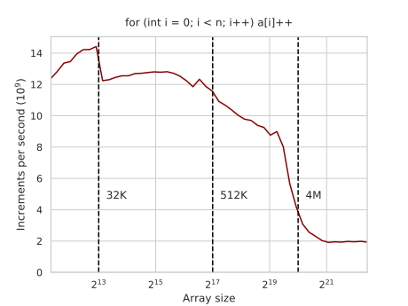
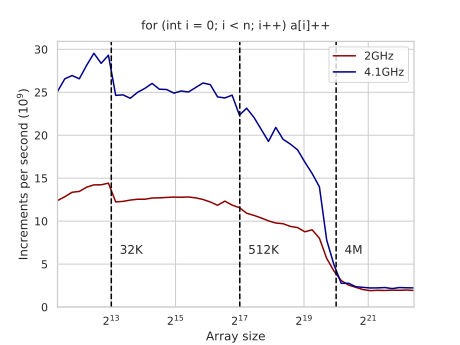
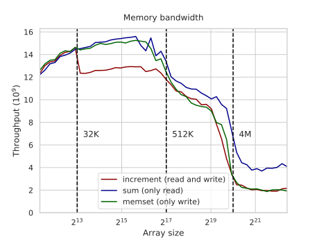
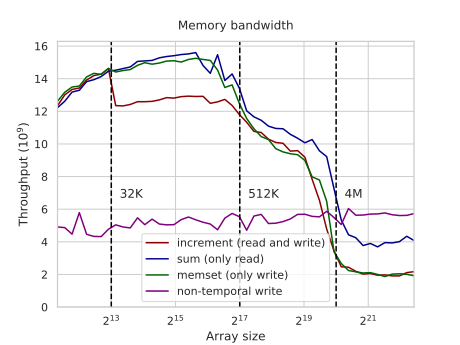

---
tags:
  - 现代硬件算法
  - RAM与CPU缓存
created: 2026-09-11
source: https://en.algorithmica.org/hpc/cpu-cache/bandwidth/
original_title: Memory Bandwidth
---

# 内存带宽

在 CPU 寄存器与 RAM 之间的数据通路上，存在一组*缓存（caches）*层级，它们存在的目的是为了加速对频繁使用数据的访问：越靠近处理器的层级越快，但容量也越小。这里的"更快"一词适用于两个密切相关却又彼此独立的计时指标：

- 从发起一次读或写，到数据到达之间的延迟（*latency*，延迟）。
- 单位时间内可以处理的内存操作数量（*bandwidth*，带宽）。

对许多算法而言，内存带宽是缓存系统最重要的特性。同时，它也是最易于测量的，因此我们打算从它入手。

在我们的实验中，我们创建一个数组并迭代它 $K$ 次，对其值做自增：

```cpp
int a[N];

for (int t = 0; t < K; t++)
    for (int i = 0; i < N; i++)
        a[i]++;
```

改变 $N$ 并调整 $K$，使得被访问的数组单元总数大致保持恒定，并将总时间表达为"每秒操作数"，我们会得到这样一张图：



在这张图上你可以清晰地看到缓存的大小：

- 当整个数组能装进最低层缓存时，程序的瓶颈在于 CPU，而非 L1 缓存带宽。随着数组变大，与循环最初几次迭代相关的开销变小，性能逐渐接近其 16 GFLOPS 的理论最大值。
- 但随后性能下降：首先，当超出 L1 缓存时降到 12-13 GFLOPS，然后随着不再能装进 L3 缓存，逐渐降到约 2 GFLOPS。

这种情况在许多轻量级循环中都很典型。

### 频率缩放

所有 CPU 缓存层级都与处理器位于同一块微芯片上，因此其带宽、延迟以及所有其他特性都会随时钟频率而缩放。而 RAM 则位于其独立的固定时钟上，其特性保持恒定。我们可以通过开启睿频（turbo boost）重新运行同一基准测试来观察到这一点：



在比较算法实现时，这一细节会发挥作用。当工作数据集能装进缓存时，两种实现的相对性能可能因 CPU 时钟速率不同而有所差异，因为 RAM 不受其影响（而其他一切都受影响）。

出于这一原因，[[如何获得准确结果.md|建议]]将时钟速率固定，并且由于睿频不够稳定，本书中的大多数基准测试都在纯粹的 2GHz 下运行。

### 单向访问

这个递增循环在执行过程中需要同时进行读和写：在每次迭代中，我们取出一个值、对其自增，然后再写回。在许多应用中，我们只需要做其中一项，因此让我们尝试测量单向带宽。

计算数组之和只需要内存读取：

```c++
for (int i = 0; i < N; i++)
    s += a[i];
```

而将数组清零（或填充为其他任意常量）只需要内存写入：

```c++
for (int i = 0; i < N; i++)
    a[i] = 0;
```

这两个循环都很容易被编译器[[SIMD并行.md|向量化]]，而且第二个实际上会被替换为 `memset`，因此 CPU 在这里也不是瓶颈（除非数组能装进 L1 缓存）。



单向与双向内存访问之所以表现不同，是因为它们共享缓存与内存总线以及其他 CPU 资源。在 RAM 的情况下，这导致纯读场景与同时读写的场景之间存在两倍的性能差异，因为内存控制器必须在单向内存总线上于两种模式间切换，从而将带宽减半。对于 L2 缓存，性能下降没那么严重：这里的瓶颈不是缓存总线，因此递增循环只落后了约 15%。

图上有一个有趣的异常现象，即仅写循环在数组命中 L3 缓存和 RAM 时，表现与读写循环相同。这是因为 CPU 在每次访问时都会把数据搬到缓存的最高层级，无论那是一次读还是一次写——这通常是一种良好的优化，因为在许多使用场景中我们很快就会需要它。读取数据时这不成问题，因为数据无论如何都要穿过缓存层级；但写入时，这会导致另一次隐式读紧随写之后被分派——从而需要两倍的总线带宽。

### 绕过缓存

我们可以通过使用*非临时（non-temporal）*内存访问，来阻止 CPU 预取我们刚刚写入的数据。为此，我们需要更直接地重新实现清零循环，而不依赖编译器的向量化。

忽略少数特殊情况，`memset` 和自动向量化的赋值循环在底层所做的是用[[数据搬移.md|搬移]] 32 字节的数据块，借助[[SIMD并行.md|SIMD 指令]]来完成：

```c++
const __m256i zeros = _mm256_set1_epi32(0);

for (int i = 0; i + 7 < N; i += 8)
    _mm256_store_si256((__m256i*) &a[i], zeros);
```

我们可以用一个*非临时*的向量存储内建函数来替换通常的向量存储内建函数：

```c++
const __m256i zeros = _mm256_set1_epi32(0);

for (int i = 0; i + 7 < N; i += 8)
    _mm256_stream_si256((__m256i*) &a[i], zeros);
```

非临时内存读或写是一种告诉 CPU 我们今后不会需要刚刚访问的那些数据的方式，因此写入后无需再把数据读回来。



一方面，如果数组小到能装进缓存，而我们确实在稍后访问它，这会产生负面影响，因为我们必须从 RAM 完整读取它（或者说，在这种情况下，我们必须将其*写入* RAM，而不是使用一个本地缓存的版本）。而另一方面，这避免了回读，让我们能更高效地使用内存总线。

事实上，在 RAM 的情况下，性能提升甚至超过 2 倍，并且比只读基准测试更快。这是因为：

- 内存控制器不必再以这种方式在读写模式间切换总线；
- 指令序列变得更简单，从而允许更多挂起的内存指令；
- 最重要的是，内存控制器可以简单地"发射后即忘"非临时写请求——而对于读请求，它需要记住数据到达后该如何处理（类似于网络软件中的连接句柄）。

理论上，两种请求应当使用相同的带宽：读请求发出一个地址并取回数据，而非临时写请求发出一个附带数据的地址且取回空。不计方向，我们传输的数据相同，但读周期会更长，因为它需要等待数据被取回。由于内存系统能够同时处理的并发请求数量[[内存级并行.md|存在实际限制]]，读写周期延迟上的这一差异也导致了它们带宽上的差异。

此外，出于这些原因，单个 CPU 核心通常[[内存共享.md|无法完全占满内存带宽]]。

同样的技术也推广到 `memcpy`：它也只是用 SIMD 加载/存储指令搬移 32 字节的数据块，同样可以做成非临时的，从而将大数组的吞吐量提升两倍。还有一个非临时加载指令（`_mm256_stream_load_si256`），用于在你希望*读取*而不污染缓存时（例如，在 `memcpy` 之后你不再需要原始数组，但仍会需要你在调用它之前访问过的某些数据）。
