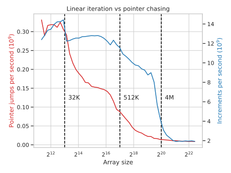
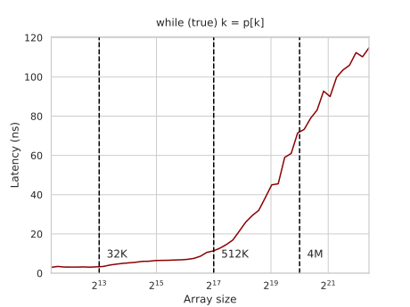
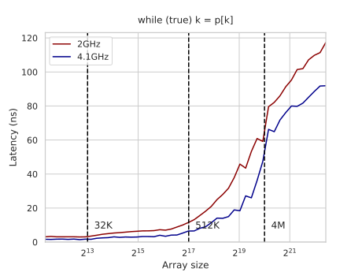
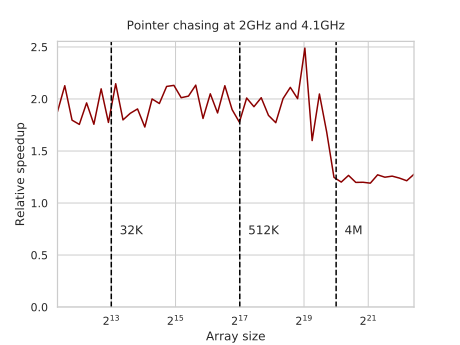

---
tags:
  - 现代硬件算法
  - RAM与CPU缓存
created: 2026-09-11
source: https://en.algorithmica.org/hpc/cpu-cache/latency/
original_title: Memory Latency
---

# 内存延迟

尽管[[内存带宽.md]]是一个更复杂的概念，但它比延迟要容易观察和测量得多：你只需执行一长串相互独立的读或写查询，调度器由于事先就能拿到它们，会对它们重排序并相互重叠，从而隐藏其延迟并最大化总吞吐量。

要测量*延迟*，我们需要设计一个实验，使得 CPU 无法投机取巧地提前知道我们将要请求的内存位置。一种确保这一点的方法是生成一个大小为 $N$、且对应一个环的随机置换，然后反复沿该置换前进：

```cpp
int p[N], q[N];

// 生成一个随机置换
iota(p, p + N, 0);
random_shuffle(p, p + N);

// 这个置换可能包含多个环，
// 因此我们改为用它构造另一个只含单个环的置换
int k = p[N - 1];
for (int i = 0; i < N; i++)
    k = q[k] = p[i];

for (int t = 0; t < K; t++)
    for (int i = 0; i < N; i++)
        k = q[k];
```

与线性迭代相比，以这种方式访问数组的所有元素要慢得多——慢了好几个数量级。它不仅使得[[SIMD并行.md|SIMD]] 无法使用，还会[[指令级并行.md|使流水线停顿]]，造成一大团指令的交通堵塞，全都在等待从内存中取回单一的一块数据。

这种性能反模式被称为*指针追踪（pointer chasing）*，它在数据结构中非常常见，尤其是在那些使用大量堆分配对象、以及为动态类型所必需的大量指向它们的指针的高级语言所写的数据结构中。



在讨论延迟时，使用周期数或纳秒比使用吞吐量单位更有意义，因此我们用它的倒数来替换这张图：



注意两张图上的悬崖都不如带宽图中那么分明。这是因为，即使数组不能完全装进某一层缓存，我们仍有一定概率命中更上一层的缓存。

### 理论延迟

更形式化地说，如果缓存层级有 $k$ 层，大小分别为 $s_i$、延迟分别为 $l_i$，那么，其期望延迟将不是等于最慢的那次访问，而是：

$$
E[L] = \frac{
      s_1 \cdot l_1
    + (s_2 - s_1) \cdot l_2
%    + (s_3 - s_2) \cdot l_3
    + \ldots
    + (N - s_k) \cdot l_{RAM}
    }{N}
$$

如果我们抽象掉最慢缓存层之前发生的所有事情，可以将公式简化为：

$$
E[L] = \frac{N \cdot l_{last} - C}{N} = l_{last} - \frac{C}{N}
$$

随着 $N$ 增大，期望延迟缓慢地逼近 $l_{last}$，如果你眯起眼睛仔细看，吞吐量图（延迟的倒数）应该大致看起来像由几条经过转置和缩放的双曲线组成：

$$
\begin{aligned}
E[L]^{-1} &= \frac{1}{l_{last} - \frac{C}{N}}
\\        &= \frac{N}{N \cdot l_{last} - C}
\\        &= \frac{1}{l_{last}} \cdot \frac{N + \frac{C}{l_{last}} - \frac{C}{l_{last}}}{N - \frac{C}{l_{last}}}
\\        &= \frac{1}{l_{last}} \cdot \left(\frac{1}{N \cdot \frac{l_{last}}{C} - 1} + 1\right)
\\        &= \frac{1}{k \cdot (x - x_0)} + y_0
\end{aligned}
$$

要得到真实的延迟数值，我们可以迭代地应用第一个公式，依次推导出 $l_1$、然后 $l_2$，依此类推。或者直接看悬崖之前的值——它们应该与真实延迟相差在 10-15% 以内。

还有更直接的方法可以测量延迟，包括使用[[内存带宽.md|非临时读]]，但这个基准测试更能代表实际的访问模式。

<!--

E[L] \approx \frac{s_{k} \cdot l_{k} + (N - s_k) \cdot l_{k+1}}{N}
= l_{k+1} - \frac{s_k \cdot (l_{k+1} - l_k)}{N} 

-->

### 频率缩放

与带宽类似，所有 CPU 缓存的延迟都与其时钟频率成正比地缩放，而 RAM 则不然。如果我们通过开启睿频来改变频率，也能观察到这一差异。



如果我们把它画成相对加速比，这张图就开始更有道理了。



你本以为对于能完全装进 CPU 缓存的数组大小，会有 2 倍的加速，而对于存放在 RAM 中的数组，加速比大致相等。但实际情况并非完全如此：即便对于 RAM 访问，在低时钟频率的运行下也存在一个小的、固定延迟的延迟。这是因为 CPU 在向主内存分派读查询之前，必须先检查它的缓存——以便为可能需要的其他进程节省 RAM 带宽。

内存延迟还会受到[[内存分页.md|虚拟内存实现]]和[[内存级并行.md|RAM 特定的时序]]某些细节的轻微影响，我们稍后再讨论。
