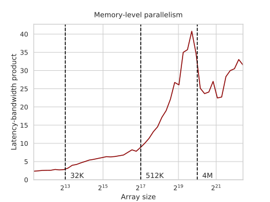
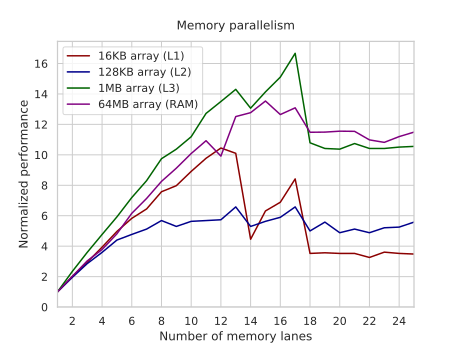

---
tags:
  - 现代硬件算法
  - RAM与CPU缓存
created: 2026-09-11
source: https://en.algorithmica.org/hpc/cpu-cache/mlp/
original_title: Memory-Level Parallelism
---

# 内存级并行

内存请求可以在时间上相互重叠：当你等待一个读请求完成时，你可以发出另外几个请求，它们会与之并发执行。这正是[[内存带宽.md|线性迭代]]远比[[内存延迟.md|指针跳跃]]快得多的主要原因：CPU 知道接下来需要获取哪些内存位置，并提前很久就发出了内存请求。

并发内存操作的数量很大但有限，而且对于不同类型的内存也不相同。在设计算法尤其是数据结构时，你可能想知道这个数字，因为它限制了你的计算所能达到的并行度。

要从理论上求出某种特定内存类型的这一上限，你可以将它的延迟（获取一条缓存行所需的时间）乘以它的带宽（每秒获取的缓存行数），这便给出了进行中的内存操作的平均数量：



L1/L2 缓存的延迟很小，因此不需要很长的挂起请求流水线，但较大的内存类型可以维持多达 25-40 个并发读操作。

### 直接实验

让我们尝试更直接地测量可用的内存并行度：修改我们的指针追踪基准测试，使其并行地绕 $D$ 个独立的环循环，而不是只绕一个：

```c++
const int M = N / D;
int p[M], q[D][M];

for (int d = 0; d < D; d++) {
    iota(p, p + M, 0);
    random_shuffle(p, p + M);
    k[d] = p[M - 1];
    for (int i = 0; i < M; i++)
        k[d] = q[d][k[d]] = p[i];
}

for (int i = 0; i < M; i++)
    for (int d = 0; d < D; d++)
        k[d] = q[d][k[d]];
```

将环长之和固定为几个选定的大小、并尝试不同的 $D$，我们得到略有差异的结果：



如预期，L2 缓存的运行受限于约 6 个并发操作，但较大的内存类型都在 13 到 17 之间达到上限。当通道数超过可用逻辑寄存器数量时，你无法利用更多的内存通道。当通道数少于寄存器数时，每条通道只需发出一条读指令：

```nasm
dec     edx
movsx   rdi, DWORD PTR q[0+rdi*4]
movsx   rsi, DWORD PTR q[1048576+rsi*4]
movsx   rcx, DWORD PTR q[2097152+rcx*4]
movsx   rax, DWORD PTR q[3145728+rax*4]
jne     .L9
```

但当它超过约 15 时，你就必须使用临时内存存储：

```nasm
mov     edx, DWORD PTR q[0+rdx*4]
mov     DWORD PTR [rbp-128+rax*4], edx
```

你并非总能达到最大可能的内存并行度，但对于大多数应用而言，十几个并发请求已经绰绰有余。
