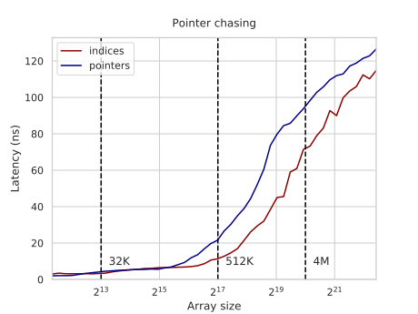
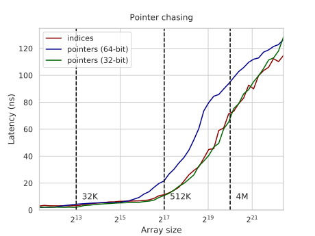
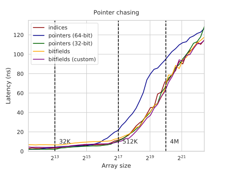

---
tags:
  - 现代硬件算法
  - RAM与CPU缓存
created: 2026-09-11
source: https://en.algorithmica.org/hpc/cpu-cache/pointers/
original_title: Pointer Alternatives
---

# 指针的替代方案

在[[内存延迟.md|指针追踪基准测试]]中，为求简单，我们并没有使用真正的指针，而是使用了相对于某个基址的整数下标：

```c++
for (int i = 0; i < N; i++)
    k = q[k];
```

x86 上的[[汇编语言.md#数据搬运|内存寻址运算符]]与地址计算是融合在一起的，因此 `k = q[k]` 这一行被折叠成仅一条简洁的指令，在底层还顺带完成了乘以 4 和加法：

```nasm
mov rax, DWORD PTR q[0+rax*4]
```

尽管完全融合，这些额外的计算仍为内存操作增加了一些延迟。一次 L1 获取的延迟是 4 或 5 个周期——若是后者，则是因为我们需要进行复杂的地址计算。正因如此，该置换基准测试测得每次跳跃为 3ns 或 6 个周期：4+1 用于读和地址计算，另 1 个用于将结果移动到正确的寄存器。

### 指针

如果我们用真正的指针替换"假指针"——下标，可以让基准测试运行得略快一些。

在构造"指针的指针的指针……"这种结构时有一些语法上的麻烦，因此我们改为定义一个结构体，它只包裹一个指向其自身类型的指针——大多数指针追踪实际上就是这么做的：

```cpp
struct node { node* ptr; };
```

现在我们随机地用指针填充数组，并追踪它们，而不是下标：

```cpp
node* k = q + p[N - 1];

for (int i = 0; i < N; i++)
    k = k->ptr = q + p[i];

for (int i = 0; i < N; i++)
    k = k->ptr;
```

这段代码对于能装进 L1 缓存的数组，现在运行在 2ns / 4 个周期。为什么不是 4+1=5？因为 Zen 2 [有一个有趣的特性](https://www.agner.org/forum/viewtopic.php?t=41)，它允许以零延迟复用仅通过地址访问的数据，因此这里的"移动"是透明的，从而整整省下了两个周期。

遗憾的是，在 64 位系统上它有一个问题：指针变成了两倍大小，使得数组比使用 32 位下标时更早地溢出缓存。延迟-大小图像看起来就像向左平移了一个 2 的幂——这正是它应有的样子：



通过切换到 32 位模式，这一问题得到了缓解：



你需要费点[周折](https://askubuntu.com/questions/91909/trouble-compiling-a-32-bit-binary-on-a-64-bit-machine)才能在本世纪制造的计算机上获得 32 位库来运行它，但这不应造成其他问题，除非你需要与 64 位软件互操作，或访问超过 4G 的 RAM。

### 位域

在较大的问题规模下，性能受限于内存而非 CPU，这一事实让我们可以尝试一些更离奇的做法：我们可以用少于 4 字节来存储下标。这可以通过[[对齐与填充.md#结构体紧凑化|位域]]来实现：

```cpp
struct __attribute__ ((packed)) node { int idx : 24; };
```

你除了定义一个位域结构体之外无需做任何其他事情——编译器会自行处理这 3 字节的整数：

```cpp
int k = p[N - 1];

for (int i = 0; i < N; i++) {
    k = q[k].idx = p[i];

for (int i = 0; i < N; i++) {
    k = q[k].idx;
```

这段代码在 L1 缓存下测得 6.5ns。编译器默认选用的转换过程并非最优，因此还有改进空间。我们可以手动加载一个 4 字节整数并自行截断（我们还需要为 `q` 数组多添加一个元素，以确保我们拥有那额外的一个字节内存）：

```cpp
k = *((int*) (q + k));
k &= ((1<<24) - 1);
```

现在它运行在 4ns，并生成如下图像：



如果你放大得足够近（[该图是 svg 格式](img/permutation-bf-custom.svg)），你会看到：在非常小的数组上指针占优，然后从大约 L2-L3 缓存边界开始，我们自定义的位域反超，而对于非常大的数组则不再重要，因为我们反正永远不会命中缓存。

这并非一种能带来 5 倍提升的优化，但当所有其他资源都已用尽时，它仍然值得一试。
