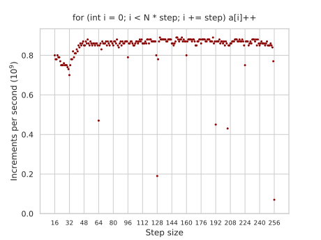
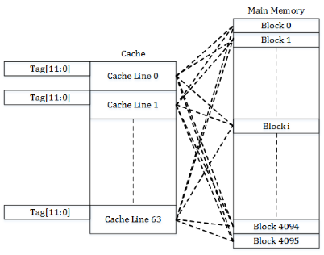
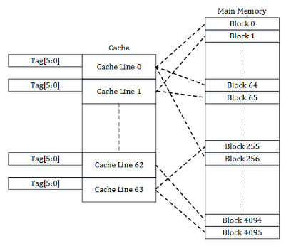
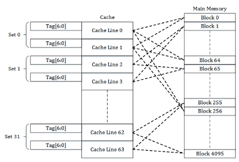
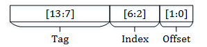

---
tags:
  - 现代硬件算法
  - RAM与CPU缓存
created: 2026-09-11
source: https://en.algorithmica.org/hpc/cpu-cache/associativity/
original_title: Cache Associativity
---

# 缓存关联度

考虑一个对大小为 $N=2^{21}$ 的数组进行的[[缓存行.md|跨步递增循环]]，固定步长为 256：

```cpp
for (int i = 0; i < N; i += 256)
    a[i]++;
```

然后是步长为 257 的这个循环：

```cpp
for (int i = 0; i < N; i += 257)
    a[i]++;
```

哪一个会更快结束？有几种容易想到的考虑：

- 一开始，你会觉得应该差别不大，或者也许第二个循环快 $\frac{257}{256}$ 倍左右，因为它总共执行的迭代更少。
- 接着你回想，256 是个很整齐的数字，这或许与[[SIMD并行.md|SIMD]]或内存系统有关，所以也许第一个更快。

但正确的答案是非常反直觉的：第二个循环更快——而且快了 10 倍。

这并非某个单独的糟糕步长。对于所有为较大 2 的幂的倍数作为下标的情况，性能都会下降：



这里没有任何向量化之类的因素，两个循环生成的汇编除了步长之外完全一致。这一效应完全来自内存系统，具体来说来自一个称为*缓存关联度（cache associativity）*的特性——这是 CPU 缓存在硬件实现上的一个奇特产物。

### 硬件缓存

当我们[[外部存储.md|从理论上]]研究内存系统时，我们讨论过在软件中[[淘汰策略.md|实现缓存淘汰策略]]的多种方法。我们重点关注过的一种策略是*最近最少使用（least recently used，LRU）*策略，它简单而有效，但仍需要一些非平凡的数据操作。

在硬件语境下，这样的方案被称为*全相联缓存（fully associative cache）*：我们有 $M$ 个单元，每个单元都能容纳对应于全部 $N$ 个内存位置中任意一个的缓存行，在发生争用时，最久未被访问的那个会被踢出，并由新行替换。



全相联缓存的问题在于，"在数百万个缓存行中找到最老的那一个"这一操作在软件中都很难实现，在硬件里更近乎不可行。你可以做一个大约 16 项的全相联缓存，但要管理数百条缓存行已经要么昂贵到难以承受，要么慢到不值得。

我们可以求助于另一种简单得多的方案：只需将 RAM 中每个 64 字节的块映射到它可以占据的单一缓存行即可。例如，如果内存中有 4096 个块、64 条缓存行供它们使用，那么每条缓存行在任何时刻都存放着 $\frac{4096}{64} = 64$ 个不同块中某一个的内容。



直接映射缓存易于实现，除了标签（被缓存块的真实内存位置）之外，不需要为缓存行存储任何额外的元信息。缺点是条目可能过早被踢出——例如，当在两个映射到同一条缓存行的地址之间来回跳动时——导致整体缓存利用率偏低。

为此，我们折中于直接映射缓存与全相联缓存之间：即*组相联缓存（set-associative cache）*。它将地址空间分割成相等的组，每组各自充当一个小型的全相联缓存。



*关联度（Associativity）*就是这些组的大小，换言之，就是每个数据块可以被映射到多少条不同的缓存行。更高的关联度能更高效地利用缓存，但也会增加成本。

例如，在[我的 CPU](https://en.wikichip.org/wiki/amd/ryzen_7/4700u)上，L3 缓存是 16 路组相联的，单个核心可用 4MB。这意味着总共有 $\frac{2^{22}}{2^{6}} = 2^{16}$ 条缓存行，它们被分成 $\frac{2^{16}}{16} = 2^{12}$ 组，每组各自充当一个覆盖 RAM 中 $(\frac{1}{2^{12}})$ 部分的全相联缓存。

大多数其他 CPU 缓存也是组相联的，包括非数据的缓存，如指令缓存和 TLB。例外是仅容纳 64 或更少条目的一些小型专用缓存——这些通常是全相联的。

### 地址转换

还剩下一个模糊之处：缓存行的映射具体是如何完成的。

如果我们在软件中实现组相联缓存，我们会计算内存块地址的某个哈希函数，然后以其值作为缓存行索引。在硬件中，我们没法真的这么做，因为那太慢了：例如，对于 L1 缓存，延迟要求为 4 或 5 个周期，而即便是[[整数除法.md|取模]]也要大约 10-15 个周期，更不用说更复杂的东西了。

相反，硬件采用了一种"偷懒"的办法。它取出需要访问的内存地址，将其从低位到高位分成三部分：

- *offset*（偏移量）——64 字节缓存行内某字的索引（$\log_2 64 = 6$ 比特）；
- *index*（索引）——缓存行组的索引（接下来的 $12$ 比特，因为 L3 缓存中有 $2^{12}$ 条缓存行）；
- *tag*（标签）——内存地址的其余部分，用于区分缓存行中存放的不同内存块。

换句话说，所有"中间"部分相同的内存地址都会映射到同一个组。



这使得缓存系统更简单、更廉价，但也容易受到某些不良访问模式的影响。

### 病态映射

好了，我们说到哪了？哦，没错：为什么步长为 256 的迭代会造成如此严重的减速。

当我们跨越 256 个整数跳转时，指针总是增加 $1024 = 2^{10}$，最后 10 个比特保持不变。由于缓存系统用低 6 比特表示偏移量、接下来的 12 比特表示缓存行索引，我们实际上只用到了 L3 缓存中 $2^{12 - (10 - 6)} = 2^8$ 个不同的组，而不是 $2^{12}$，这使得我们的 L3 缓存缩小了 $2^4 = 16$ 倍。数组不再能装进 L3 缓存（$N=2^{21}$），并溢出到慢一个数量级的 RAM 中，从而导致性能下降。

<!--

TODO: Implement this in software:

Inside these sets, cache operates simply as LRU. Instead of storing time, you just store counters: the later an element was accessed, the lower its counter is. In hardware, you need to maintain $n$ counters of $\log_2 n$ bits each. When a cell is accessed, its counter becomes $(n-1)$ (maximum possible), and the others that are larger need to be decremented by one. Then to kick out an element you need to find the counter with zero and replace it, and then decrement everyone else's counters.

Simply speaking, the CPU just maintains these cells containing data, and when reading any cell from the main memory the CPU first looks it up in the cache, and if it contains the data, it reads it and otherwise goes to a higher cache level until it reaches main memory. Simple and beautiful.

along with a "tag" information which helps identify which block it is

-->

由于多种原因，程序员们就是喜欢在用数组下标时采用 2 的幂，因此由缓存关联度效应引发的性能问题在算法中出现的频率高得惊人：

- 当最后一维是 2 的幂时，计算多维数组访问的地址更容易，因为只需一次二进制移位而非乘法。
- 对 2 的幂取模更容易，因为只需一次按位 `and` 即可完成。
- 在分治算法中，使用 2 的幂作为问题规模既方便又常常是必要的。
- 它是最小整数指数，因此在为访存受限算法做基准测试时，使用递增的 2 的幂序列作为问题规模是一种流行的选择。
- 此外，更自然的 10 的幂通过传递性也可以被稍小一点的 2 的幂整除。

这一点尤其经常适用于使用固定内存布局的隐式数据结构。例如，在大小为 $2^{20}$ 的数组上进行[[二分查找.md|二分查找]]每次查询约需 ~360ns，而在大小为 $(2^{20} + 123)$ 的数组上查找约需 ~300ns。当数组大小是较大 2 的幂的倍数时，"最热"元素（我们在最初十余次迭代中很可能请求的那些）的索引也将能被某些较大的 2 的幂整除，从而映射到同一条缓存行——彼此将对方踢出，造成约 20% 的性能下降。

幸运的是，这类问题更多是一种反常现象，而非严重问题。解决方案通常很简单：避免以 2 的幂进行迭代，让多维数组的最后一维采用略有不同的大小，或使用任何其他方法在内存布局中插入"空洞"，又或者在数组下标与实际存放数据的位置之间构造某种看似随机的双射。

<!-- seemingly random bijection, link to segment tree, to binary search -->
