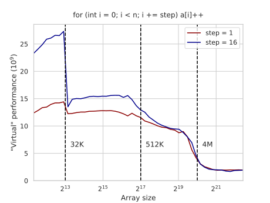
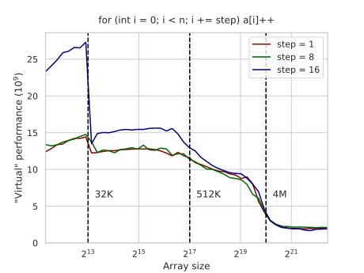
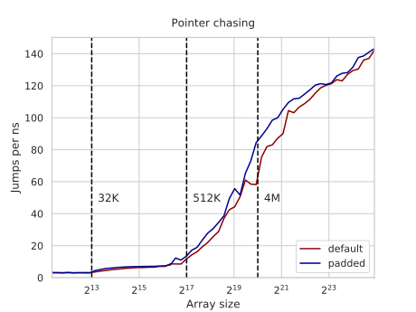

---
tags:
  - 现代硬件算法
  - RAM与CPU缓存
created: 2026-09-11
source: https://en.algorithmica.org/hpc/cpu-cache/cache-lines/
original_title: Cache Lines
---

# 缓存行

CPU 缓存系统中数据传输的基本单位不是单独的位和字节，而是*缓存行（cache lines）*。在大多数架构上，缓存行的大小为 64 字节，这意味着所有内存都被划分为 64 字节的块，而每当你请求（读或写）单个字节时，无论你愿不愿意，都会一并获取它所在的另外 63 个缓存行邻居。

为了演示这一点，我们给[[内存带宽.md|递增循环]]加上一个"步长"参数。现在我们只触碰每第 $D$ 个元素：

```cpp
for (int i = 0; i < N; i += D)
    a[i]++;
```

如果我们分别以 $D=1$ 和 $D=16$ 运行它，可以观察到一个有趣的现象：



随着问题规模增大，两个循环的图像逐渐重合，尽管其中一个所做的工作只有另一个的 1/16。这是因为，就缓存行而言，两个循环获取的是完全相同的内存，而跨步循环只需要其中十六分之一这一事实在此无关紧要。

当数组能装进 L1 缓存时，跨步版本完成得更快——不过不是快 16 倍，而只是快 2 倍。这是因为它只需要做一半的工作：每 16 个元素它只执行一条 `inc DWORD PTR [rdx]` 指令，而原始循环需要两条 8 元素的[[SIMD并行.md|向量指令]]来处理同样的 16 个元素。两种计算都受限于将结果写回：Zen 2 每个周期只能写一个字——无论它由一个整数还是八个整数组成。

当我们把步长参数改为 8 时，两张图趋于持平，因为现在我们每 16 个元素同样需要两次自增和两次写回：



我们可以利用这一效应，在我们[[内存延迟.md|延迟基准测试]]中尽量减小缓存共享，从而更精确地测量它。我们需要对置换的下标进行*填充*，使每个下标都位于其各自的缓存行中：

```c++
struct padded_int {
    int val;
    int padding[15];
};

padded_int q[N / 16];

// 从随机置换构造一个环
// ...

for (int i = 0; i < N / 16; i++)
    k = q[k].val;
```

现在，每个下标在循环一圈再次被请求时，更有可能已经被踢出缓存：



在设计和分析访存受限算法时，一个重要且实用的教训是：要统计所访问的缓存行数量，而不仅仅是内存读写的总次数。
