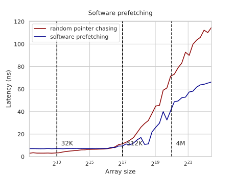
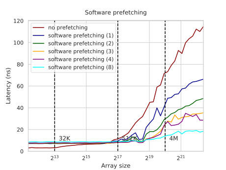

---
tags:
  - 现代硬件算法
  - RAM与CPU缓存
created: 2026-09-11
source: https://en.algorithmica.org/hpc/cpu-cache/prefetching/
original_title: Prefetching
---

# 预取

利用内存硬件中可用的[[内存级并行.md|免费并发能力]]，如果接下来很可能被访问的数据的位置可以被预测，那么*预取（prefetch）*这些数据是有益的。当流水线中不存在[[流水线冒险.md|数据或控制冒险]]、且 CPU 只需跑在指令流之前、乱序执行内存操作时，这很容易做到。

但有时内存位置并不在指令流中，却仍然可以被高概率地预测。在这些情况下，它们可以通过其他手段被预取：

- 显式地：单独读取下一个数据字或同一条缓存行中的任意字节，从而将它提升到缓存层级中。
- 隐式地：使用简单的访问模式，例如线性迭代，这类模式可被内存硬件检测到，从而自动开始预取。

隐藏内存延迟对于取得性能至关重要，因此在本节中，我们将研究预取技术。

### 硬件预取

让我们修改[[内存延迟.md|指针追踪]]基准测试，以展示硬件预取的效果。现在，我们以一种方式生成置换：使得在沿置换迭代时，CPU 请求连续的缓存行，但仍在一条缓存行内部以随机顺序访问元素：

```cpp
int p[15], q[N];

iota(p, p + 15, 1);

for (int i = 0; i + 16 < N; i += 16) {
    random_shuffle(p, p + 15);
    int k = i;
    for (int j = 0; j < 15; j++)
        k = q[k] = i + p[j];
    q[k] = i + 16;
}
```

画一张图毫无意义，因为它会完全是平的：无论数组大小如何，延迟都是 3ns。尽管指令调度器仍然无法判断我们接下来要获取什么，但内存预取器仅凭观察内存访问就能检测出一个模式，并提前开始加载下一条缓存行，从而消减延迟。

硬件预取对于大多数用例都足够智能，但它只能检测简单的模式。你可以向前或向后并行迭代多个数组，步长或许小到中等，但也仅此而已。对于任何更复杂的情况，预取器都无法弄清发生了什么，我们需要自己帮它一把。

### 软件预取

进行软件预取最简单的方法是，用 `mov` 或任何其他内存指令加载缓存行中的任意字节，但 CPU 有一条独立的 `prefetch` 指令，它可以在不对该缓存行做任何操作的情况下将其提升。这条指令不是 C 或 C++ 标准的一部分，但在大多数编译器中作为 `__builtin_prefetch` 内建函数可用：

```c++
__builtin_prefetch(&a[k]);
```

要想出一个它能派上用场的*简单*例子相当困难。为了让指针追踪基准测试从软件预取中获益，我们需要构造一个置换，它既能绕整个数组循环、又无法被硬件预取器预测，同时还具有易于计算的下一地址。

幸运的是，[线性同余生成器（linear congruential generator）](https://en.wikipedia.org/wiki/Linear_congruential_generator)有一个性质：如果模数 $n$ 是素数，那么生成器的周期将恰好为 $n$。因此，如果我们使用一个以当前下标作为状态的、由 LCG 生成的置换，就能得到所需的所有性质：

```cpp
const int n = find_prime(N); // 不超过 N 的最大素数

for (int i = 0; i < n; i++)
    q[i] = (2 * i + 1) % n;
```

当我们运行它时，性能与一个普通的随机置换相当。但现在我们获得了向前窥视的能力：

```cpp
int k = 0;

for (int t = 0; t < K; t++) {
    for (int i = 0; i < n; i++) {
        __builtin_prefetch(&q[(2 * k + 1) % n]);
        k = q[k];
    }
}
```

计算下一地址有一些开销，但对于足够大的数组，它快了几乎两倍：



有趣的是，我们可以预取不止一个元素之前，利用 LCG 函数中的这一模式：

$$
\begin{aligned}
   f(x)   &= 2 \cdot x + 1
\\ f^2(x) &= 4 \cdot x + 2 + 1
\\ f^3(x) &= 8 \cdot x + 4 + 2 + 1
\\ &\ldots
\\ f^k(x) &= 2^k \cdot x + (2^k - 1)
\end{aligned}
$$

因此，要加载 `D` 个位置之前的元素，我们可以这样做：

```cpp
__builtin_prefetch(&q[((1 << D) * k + (1 << D) - 1) % n]);
```

如果我们在每次迭代中都执行这一请求，我们将平均同时预取 `D` 个位置之前的元素，将吞吐量提升 `D` 倍。忽略当 `D` 过大时的整数溢出等问题，我们可以将平均延迟任意地降低到计算下一索引的代价（在本例中，这主要由[[整数除法.md|取模运算]]主导）。



注意这是一个人为构造的例子，而在尝试将软件预取插入实际程序时，你失败的概率其实大于成功的概率。这在很大程度上是因为你需要发出一条独立的内存指令，它可能会与其他指令争夺资源。与此同时，硬件预取是 100% 无害的，因为它仅在内存和缓存总线空闲时才会激活。

在进行软件预取时，你还可以指定需要将数据提升到哪一级缓存——当你不确定是否会用到它、又不想把已在 L1 缓存中的内容踢出时，这很有用。你可以使用 `_mm_prefetch` 内建函数，它以一个整数值作为第二个参数，指定缓存层级。这对于与[[内存带宽.md#单向访问|非临时加载与存储]]配合使用很有帮助。

<!--

In the bandwidth benchmark, we iterated over array and fetched its elements. Although separately each memory read in that case is not different from the fetch in pointer chasing, they run much faster because they can are overlapped: and in fact, CPU issues read requests in advance without waiting for the old ones to complete, so that the results come about the same time as the CPU needs them.

Apart from having a very large pipeline and using the fact that scheduler can look ahead in it, modern memory controllers can detect simple patterns such as iterating backwards, forwards, including using constant small-ish strides.

### Speculative Execution

In fact, this sometimes works even when we are not sure which instruction is going to be executed next due to [speculative execution]. Consider the following example:

```cpp
bool cond = some_long_memory_operation();

if (cond)
    do_this_fast_operation();
else
    do_that_fast_operation();
```

What most modern CPUs do is they start evaluating one (most likely) branch without waiting for the condition to be computed. If they are right, then you will progress faster, and if they are wrong, the worst thing will happen is they discard some useless computation. This includes memory operations too, including cache system — because, well, we wait for a hundred cycles anyway, why not evaluate at least one of the branches ahead of time. By the way, this is what Meltdown was all about.

-->
