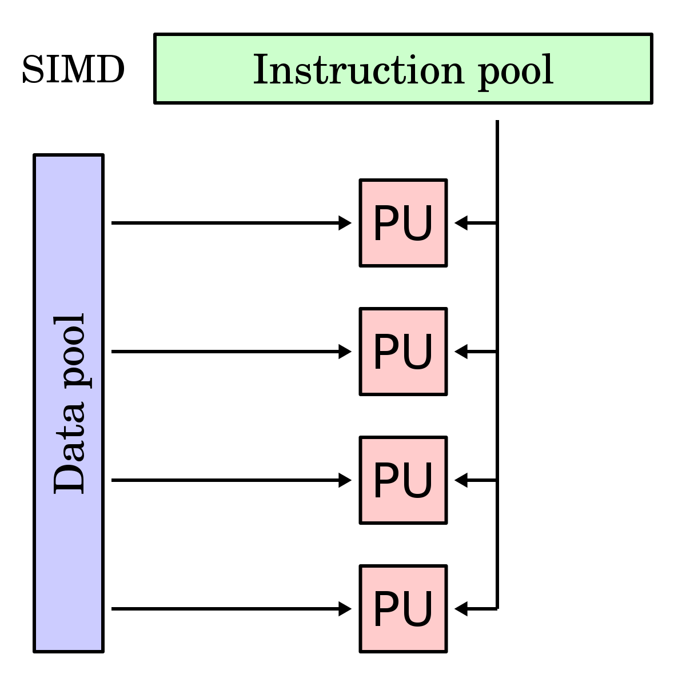
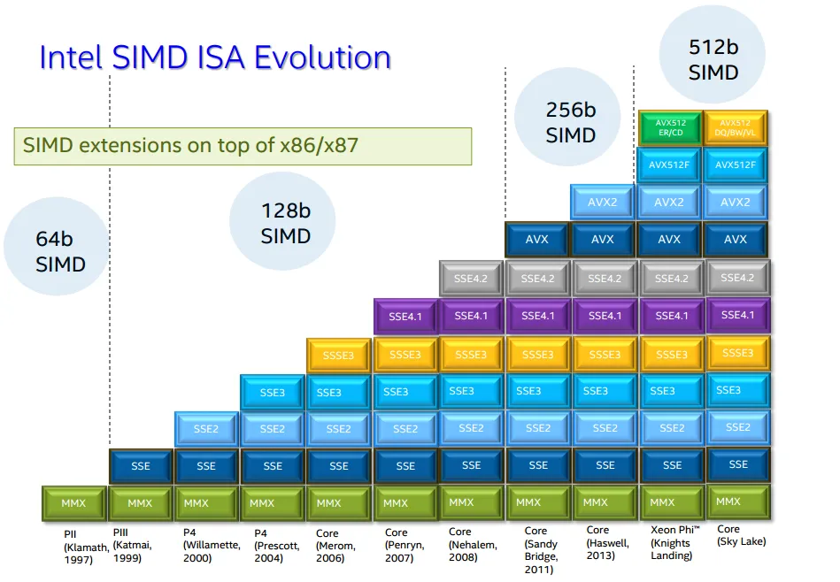

---
tags:
  - 现代硬件算法
  - SIMD并行
created: 2026-09-11
source: https://en.algorithmica.org/hpc/simd/
original_title: SIMD Parallelism
---

# SIMD 并行

考虑下面这个小程序，其中我们计算一个整数数组的求和：

```c++
const int n = 1e5;
int a[n], s = 0;

int main() {
    for (int t = 0; t < 100000; t++)
        for (int i = 0; i < n; i++)
            s += a[i];

    return 0;
}
```

如果我们用普通的 `g++ -O3` 编译并运行，它会在 2.43 秒内完成。

现在，让我们在最开头添加如下这行"魔法"编译指示：

```c++
#pragma GCC target("avx2")
// ...其余部分与之前相同
```

当在相同的环境中编译并运行时，它在 1.24 秒内完成。这几乎快了一倍，而且我们没有改动哪怕一行代码，也没有改变优化级别。

这里发生的事情是，我们提供了一点关于这段代码将要运行的计算机的信息。具体来说，我们告诉编译器目标 CPU 支持 x86 指令集的一个名为 "AVX2" 的扩展。AVX2 是 x86 众多所谓"SIMD 扩展"之一。这些扩展包含这样的指令：它们操作能够容纳 128、256 乃至 512 位数据的特殊寄存器，所采用的是"单指令多数据"（single instruction, multiple data，SIMD）的方法。SIMD 指令并不处理单个标量值，而是将寄存器中的数据划分为 8、16、32 或 64 位的块，并对它们并行执行相同的操作，从而获得成比例的性能提升[^power]。

[^power]: 在某些 CPU 上，尤其是繁重的 SIMD 指令会消耗更多能量，因而需要[降频](https://blog.cloudflare.com/on-the-dangers-of-intels-frequency-scaling/)以平衡总功耗，所以真实的加速比并不总是成比例的。



这些扩展相对较新，它们对 CPU 的支持是在保持向后兼容的前提下逐步实现的[^avx512]。除了增加更多专用的指令，它们之间最重要的区别在于逐步引入了更宽的寄存器。

具体而言，AVX2 包含操作 256 位寄存器的指令，而默认情况下 GCC 假定除 128 位的 SSE2 之外没有任何扩展被启用。因此，在告诉优化器它可以一次性加上 8 个整数（而非 4 个）之后，性能提升了一倍。

[^avx512]: 从 AVX512 开始，向后兼容不再被维持：存在许多针对特定需求（如数据压缩、加密或机器学习）而定制的不同"风味"。



编译器常常能出色地把简单的循环改写为 SIMD 指令，就像上面的例子一样。这种优化被称为[[自动向量化与 SPMD.md]]，它是最流行的使用 SIMD 的方式。

问题在于它只对某些类型的循环有效，而且即便如此，结果也常常不够理想。为了理解它的局限，我们需要亲自上手，在更低的层次上探究这项技术，而这正是本章要做的事情。
