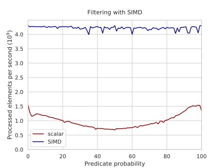

---
tags:
  - 现代硬件算法
  - SIMD并行
created: 2026-09-11
source: https://en.algorithmica.org/hpc/simd/shuffling/
original_title: In-Register Shuffles
---

# 寄存器内重排

[[掩码与混合.md|掩码]]让你只把操作施加到向量元素的某个子集上。它是一种非常有效且频繁使用的数据处理技术，但在许多情况下，你需要执行更高级的操作：涉及在向量寄存器内部置换（permute）值，而不只是把它们与其他向量混合。

问题在于，在硬件中为每种可能的用例单独增加一条元素重排指令是不可行的。但我们能做的，是只增加一条通用的置换指令，它接受置换的下标，并用预计算的查找表来生成这些下标。

这个总体思路或许过于抽象，所以让我们直接跳到例子。

### 重排与位计数

*总体计数*（population count），又称*汉明重量*（Hamming weight），是一个二进制串中 `1` 的个数。

它是一项频繁使用的操作，所以 x86 上有一条独立指令来计算一个字的位计数：

```c++
const int N = (1<<12);
int a[N];

int popcnt() {
    int res = 0;
    for (int i = 0; i < N; i++)
        res += __builtin_popcount(a[i]);
    return res;
}
```

它也支持 64 位整数，把总吞吐提升一倍：

```c++
int popcnt_ll() {
    long long *b = (long long*) a;
    int res = 0;
    for (int i = 0; i < N / 2; i++)
        res += __builtin_popcountl(b[i]);
    return res;
}
```

所需的指令仅两条：融合载入的 popcount 与加法。它们的吞吐都很高，所以这段代码每周期处理约 $8+8=16$ 字节，因为它受限于这颗 CPU 上 4 的解码宽度。

这些指令在 2008 年前后随 SSE4 加入 x86。让我们暂时回到向量化尚未出现的年代，尝试用其他方式实现 popcount。

朴素的方法是一个比特一个比特地遍历二进制串：

```c++
__attribute__ (( optimize("no-tree-vectorize") ))
int popcnt() {
    int res = 0;
    for (int i = 0; i < N; i++)
        for (int l = 0; l < 32; l++)
            res += (a[i] >> l & 1);
    return res;
}
```

如预期，它只比每周期八分之一字节略快一点——大约 0.2。

我们可以尝试以字节而非单个比特来处理，方法是[[预计算.md|预计算]]一个包含各个字节位计数的、256 元素的小*查找表*，然后在遍历数组原始字节时查询它：

```c++
struct Precalc {
    alignas(64) char counts[256];

    constexpr Precalc() : counts{} {
        for (int m = 0; m < 256; m++)
            for (int i = 0; i < 8; i++)
                counts[m] += (m >> i & 1);
    }
};

constexpr Precalc P;

int popcnt() {
    auto b = (unsigned char*) a; // 注意：普通 "char" 是有符号的
    int res = 0;
    for (int i = 0; i < 4 * N; i++)
        res += P.counts[b[i]];
    return res;
}
```

它现在每周期处理约 2 字节，若切换到 16 位字（`unsigned short`）则上升到约 2.7。

与 `popcnt` 指令相比，这个方案仍然非常慢，但它现在可以被向量化了。我们不会试图通过[[数据搬移.md#映射到数组|gather]]指令来加速，而是走另一条路：把查找表做得小到能装进一个寄存器，然后用一条特殊的 [pshufb](https://software.intel.com/sites/landingpage/IntrinsicsGuide/#text=pshuf&techs=AVX,AVX2&expand=6331) 指令并行地查表。

最初在 128 位 SSE3 中引入的 `pshufb` 取两个寄存器：一个含 16 个字节值的查找表，以及一个由 16 个 4 位下标（0 到 15）组成的向量，指明每个位置该挑选哪些字节。在 256 位 AVX2 中，我们有一条指令，它在两个 128 位通道（lane）上独立地执行相同的重排操作，而非使用笨拙的 5 位下标配 32 字节查找表。

所以，对我们的用途，我们创建一个 16 字节的查找表，含每个半字节（nibble，半个字节）的位计数，重复两次：

```c++
const reg lookup = _mm256_setr_epi8(
    /* 0 */ 0, /* 1 */ 1, /* 2 */ 1, /* 3 */ 2,
    /* 4 */ 1, /* 5 */ 2, /* 6 */ 2, /* 7 */ 3,
    /* 8 */ 1, /* 9 */ 2, /* a */ 2, /* b */ 3,
    /* c */ 2, /* d */ 3, /* e */ 3, /* f */ 4,

    /* 0 */ 0, /* 1 */ 1, /* 2 */ 1, /* 3 */ 2,
    /* 4 */ 1, /* 5 */ 2, /* 6 */ 2, /* 7 */ 3,
    /* 8 */ 1, /* 9 */ 2, /* a */ 2, /* b */ 3,
    /* c */ 2, /* d */ 3, /* e */ 3, /* f */ 4
);
```

现在，要计算一个向量的位计数，我们把它的每个字节拆分为低半字节与高半字节，然后用这个查找表检索它们的计数。剩下唯一要做的，就是仔细地把它们求和：

```c++
const reg low_mask = _mm256_set1_epi8(0x0f);

int popcnt() {
    int k = 0;

    reg t = _mm256_setzero_si256();

    for (; k + 15 < N; k += 15) {
        reg s = _mm256_setzero_si256();
        
        for (int i = 0; i < 15; i += 8) {
            reg x = _mm256_load_si256( (reg*) &a[k + i] );
            
            reg l = _mm256_and_si256(x, low_mask);
            reg h = _mm256_and_si256(_mm256_srli_epi16(x, 4), low_mask);

            reg pl = _mm256_shuffle_epi8(lookup, l);
            reg ph = _mm256_shuffle_epi8(lookup, h);

            s = _mm256_add_epi8(s, pl);
            s = _mm256_add_epi8(s, ph);
        }

        t = _mm256_add_epi64(t, _mm256_sad_epu8(s, _mm256_setzero_si256()));
    }

    int res = hsum(t);

    while (k < N)
        res += __builtin_popcount(a[k++]);

    return res;
}
```

这段代码每周期处理约 30 字节。理论上，内层循环能处理 32，但我们必须每 15 轮停下，因为 8 位计数器会溢出。

`pshufb` 指令在某些 SIMD 算法中如此关键，以至于提出该算法的 [Wojciech Muła](http://0x80.pl/) 把它当成了自己的 [Twitter 账号](https://twitter.com/pshufb)。你还能算得更快：去看看他的 [GitHub 仓库](https://github.com/WojciechMula/sse-popcount)，里面有各种向量化 popcount 实现，以及他的[近期论文](https://arxiv.org/pdf/1611.07612.pdf)，对当前最先进水平作了详细解释。

### 置换与查找表

本章最后一个重要例子是 `filter`（过滤）。它是一种非常重要的数据处理原语，它以一个数组为输入，只写出满足某谓词（保持原有顺序）的元素。

在单线程标量情形下，它可以通过维护一个在每次写入时递增的计数器来轻易实现：

```c++
int a[N], b[N];

int filter() {
    int k = 0;

    for (int i = 0; i < N; i++)
        if (a[i] < P)
            b[k++] = a[i];

    return k;
}
```

要向量化它，我们将使用 `_mm256_permutevar8x32_epi32` 内建函数。它取一个值向量，并用一个下标向量逐个挑选它们。尽管名字如此，它并不*置换*（permute）值，而只是*复制*它们以形成一个新向量：结果中允许重复。

我们算法的整体思路如下：

- 在一个数据向量上计算谓词——在本例中，这意味着执行比较以得到掩码；
- 用 `movemask` 指令得到一个标量 8 位掩码；
- 用这个掩码去索引一张查找表，该表返回一个把满足谓词的元素移到向量开头（保持原有顺序）的置换；
- 用 `_mm256_permutevar8x32_epi32` 内建函数置换这些值；
- 把整个置换后的向量写入缓冲区——它末尾可能带些垃圾，但其前缀是正确的；
- 计算标量掩码的位计数，并据此移动缓冲区指针。

首先，我们需要预计算这些置换：

```c++
struct Precalc {
    alignas(64) int permutation[256][8];

    constexpr Precalc() : permutation{} {
        for (int m = 0; m < 256; m++) {
            int k = 0;
            for (int i = 0; i < 8; i++)
                if (m >> i & 1)
                    permutation[m][k++] = i;
        }
    }
};

constexpr Precalc T;
```

然后我们就能实现算法本身：

```c++
const reg p = _mm256_set1_epi32(P);

int filter() {
    int k = 0;

    for (int i = 0; i < N; i += 8) {
        reg x = _mm256_load_si256( (reg*) &a[i] );
        
        reg m = _mm256_cmpgt_epi32(p, x);
        int mask = _mm256_movemask_ps((__m256) m);
        reg permutation = _mm256_load_si256( (reg*) &T.permutation[mask] );
        
        x = _mm256_permutevar8x32_epi32(x, permutation);
        _mm256_storeu_si256((reg*) &b[k], x);
        
        k += __builtin_popcount(mask);
    }

    return k;
}
```

向量化版本实现起来颇费功夫，但它比标量版本快 6~7 倍（当 `P` 取值偏高或偏低时加速略小，因为[[分支的代价.md|分支变得可预测]]）。



循环性能仍然相当低——每轮迭代要 4 个 CPU 周期——因为在这颗特定的 CPU（Zen 2）上，`movemask`、`permute` 与 `store` 吞吐都低，且都必须经过同一个执行端口（P2）。在大多数其他 x86 CPU 上，你可以预期它快约 2 倍。

过滤在 AVX-512 上也能实现得相当快：它有一条特殊的 "[compress](https://www.intel.com/content/www/us/en/docs/intrinsics-guide/index.html#ig_expand=7395,7392,7269,4868,7269,7269,1820,1835,6385,5051,4909,4918,5051,7269,6423,7410,150,2138,1829,1944,3009,1029,7077,519,5183,4462,4490,1944,1395&text=_mm512_mask_compress_epi32)" 指令，它取一个数据向量与一个掩码，并把其未被掩掉的元素连续地写出。这对依赖各种过滤子例程（如快速排序）的算法影响巨大。

<!--

You can use either registers or fetch them from memory. There are some others that use immediates (compile-time constant too?)

_mm256_permute2x128_si256 — swaps lines
_mm256_slli_si256 srli
_mm256_permute_ps uses a mask

https://stackoverflow.com/questions/9795529/how-to-find-the-horizontal-maximum-in-a-256-bit-avx-vector Norbert P. and Peter Cordes 

_MM_SHUFFLE

https://stackoverflow.com/questions/37088449/macro-for-generating-immediates-for-avx-shuffle-intrinsics

-->
