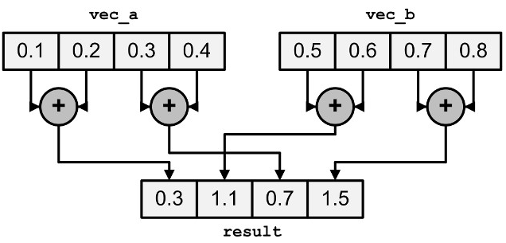

---
tags:
  - 现代硬件算法
  - SIMD并行
created: 2026-09-11
source: https://en.algorithmica.org/hpc/simd/reduction/
original_title: Reductions
---

# 归约

*归约*（reduction，在函数式编程中又称*折叠* folding）是计算某个结合且交换的操作（即 $(a \circ b) \circ c = a \circ (b \circ c)$ 且 $a \circ b = b \circ a$）在一组任意元素上的取值的动作。

归约最简单的例子是计算一个数组的求和：

```c++
int sum(int *a, int n) {
    int s = 0;
    for (int i = 0; i < n; i++)
        s += a[i];
    return s;
}
```

这种朴素的方法并不那么容易向量化，因为循环的状态（当前前缀上的求和 $s$）依赖于前一轮迭代。克服它的办法是把单个标量累加器 $s$ 拆分为 8 个独立的累加器，使得 $s_i$ 包含原数组中每隔 8 个、偏移为 $i$ 的那个元素之和：

$$
s_i = \sum_{j=0}^{n / 8} a_{8 \cdot j + i }
$$

如果我们把着 8 个累加器存放在单个 256 位向量中，就可以通过加上数组连续的 8 元素段一次性更新它们全部。借助[[SIMD并行.md|向量扩展]]，这很直接：

```c++
int sum_simd(v8si *a, int n) {
    //       ^ 你可以像其他任何指针类型一样正常转型
    v8si s = {0};

    for (int i = 0; i < n / 8; i++)
        s += a[i];
    
    int res = 0;
    
    // 将 8 个累加器求和成一个
    for (int i = 0; i < 8; i++)
        res += s[i];

    // 加上 a 的剩余部分
    for (int i = n / 8 * 8; i < n; i++)
        res += a[i];
        
    return res;
}
```

你可以把这种方法用于其他归约，例如求数组的最小值或其异或和。

### 指令级并行

我们的实现与编译器自动产生的代码一致，但它实际上并非最优：当我们只用一个累加器时，[[吞吐量计算.md|我们需要等待]]一个周期，让向量加法在循环各轮迭代之间完成，而对应指令在这套微架构上的[[指令表.md|吞吐]]是 2。

如果我们再次把数组分成 $B \geq 2$ 部分，并为每一部分使用*独立*的累加器，就能让向量加法的吞吐饱和，从而把性能提升一倍：

```c++
const int B = 2; // 使用多少个向量累加器

int sum_simd(v8si *a, int n) {
    v8si b[B] = {0};

    for (int i = 0; i + (B - 1) < n / 8; i += B)
        for (int j = 0; j < B; j++)
            b[j] += a[i + j];

    // 把所有向量累加器求和成一个
    for (int i = 1; i < B; i++)
        b[0] += b[i];
    
    int s = 0;

    // 把 8 个标量累加器求和成一个
    for (int i = 0; i < 8; i++)
        s += b[0][i];

     // 加上 a 的剩余部分
    for (int i = n / (8 * B) * (8 * B); i < n; i++)
        s += a[i];

    return s;
}
```

如果你拥有超过 2 个相关的执行端口，可以相应地增大 `B` 常量，但 $n$ 倍的性能提升只适用于能装进 L1 缓存的数组——对更大的数组，[[内存带宽.md|内存带宽]]会成为瓶颈。

### 水平求和

我们把向量寄存器中存储的 8 个累加器求和成单个标量、以得到总和的那一步，称为"水平求和"（horizontal summation）。

尽管逐个提取并相加每个标量只需要常数个周期，但用一条[特殊指令](https://software.intel.com/sites/landingpage/IntrinsicsGuide/#techs=AVX,AVX2&text=_mm256_hadd_epi32&expand=2941)会稍快一些，它把寄存器中相邻的元素对相加。



由于这是一项非常特定的操作，它只能由 SIMD 内建函数完成——尽管编译器大概率也会为标量代码发出大致相同的流程：

```c++
int hsum(__m256i x) {
    __m128i l = _mm256_extracti128_si256(x, 0);
    __m128i h = _mm256_extracti128_si256(x, 1);
    l = _mm_add_epi32(l, h);
    l = _mm_hadd_epi32(l, l);
    return _mm_extract_epi32(l, 0) + _mm_extract_epi32(l, 1);
}
```

还有[其他类似的指令](https://www.intel.com/content/www/us/en/docs/intrinsics-guide/index.html#techs=AVX,AVX2&ig_expand=3037,3009,5135,4870,4870,4872,4875,833,879,874,849,848,6715,4845&text=horizontal)，例如用于整数乘法，或计算相邻元素之间的绝对差（用于图像处理）。

还有一条特定指令 `_mm_minpos_epu16`，它一次算出 8 个 16 位整数中的水平最小值及其下标。这是唯一能一步完成的水平归约：其他所有水平归约都需要多步计算。
