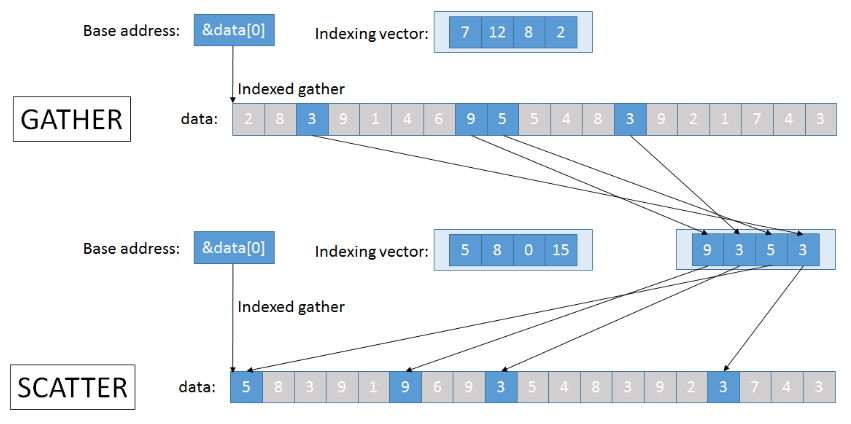
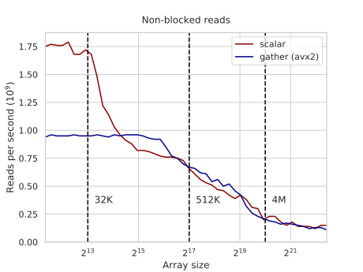

---
tags:
  - 现代硬件算法
  - SIMD并行
created: 2026-09-11
source: https://en.algorithmica.org/hpc/simd/moving/
original_title: Moving Data
---

# 数据搬移

如果你花时间研究过[这份参考](https://software.intel.com/sites/landingpage/IntrinsicsGuide)，你或许已经注意到，向量操作本质上分为两大组：

1. 执行某些逐元素操作的指令（`+`、`*`、`<`、`acos` 等）。
2. 执行载入、存储、掩码、重排以及一般意义上搬移数据的指令。

虽然使用逐元素指令很容易，但 SIMD 最大的挑战首先在于如何把数据装进向量寄存器，并且开销要足够低，使得整个努力是值得的。

### 对齐的载入与存储

把 SIMD 寄存器的内容读入内存、以及从内存写入的操作，各有两种版本：`load` / `loadu` 与 `store` / `storeu`。这里的字母 "u" 代表 "unaligned"（未对齐）。区别在于，前者仅在所读/所写的块落在单个[[缓存行.md|缓存行]]内部时才能正确工作（否则崩溃），而后者无论哪种情况都能工作，但在块跨缓存行时会带来轻微的性能损失。

有时，尤其是当"内部"操作非常轻量时，性能差异会变得显著（至少是因为你需要取两条缓存行而非一条）。作为一个极端的例子，下面这种将两个数组相加的方式：

```c++
for (int i = 3; i + 7 < n; i += 8) {
    __m256i x = _mm256_loadu_si256((__m256i*) &a[i]);
    __m256i y = _mm256_loadu_si256((__m256i*) &b[i]);
    __m256i z = _mm256_add_epi32(x, y);
    _mm256_storeu_si256((__m256i*) &c[i], z);
}
```

…比其对齐版本慢约 30%：

```c++
for (int i = 0; i < n; i += 8) {
    __m256i x = _mm256_load_si256((__m256i*) &a[i]);
    __m256i y = _mm256_load_si256((__m256i*) &b[i]);
    __m256i z = _mm256_add_epi32(x, y);
    _mm256_store_si256((__m256i*) &c[i], z);
}
```

在第一种版本中，假设数组 `a`、`b`、`c` 都做了 64 字节*对齐*（它们首元素的地址能被 64 整除，因此都始于一条缓存行的开头），那么大约一半的读与写会是"糟糕的"，因为它们跨过了缓存行边界。

注意，这种性能差异是由缓存系统引起的，而非指令本身。在大多数现代架构上，只要两种情况下块都只跨一条缓存行，`loadu` / `storeu` 内建函数就应当与 `load` / `store` 一样快。后者的优势在于，它们可以充当免费的运行时断言，保证所有读与写都是对齐的。

这使得在分配时恰当地[[对齐与填充.md|对齐]]数组及其他数据变得重要，它也是编译器不能总是高效地[[自动向量化与 SPMD.md|自动向量化]]的原因之一。对多数用途而言，我们只需要保证任何 32 字节的 SIMD 块不会跨过缓存行边界，而我们可以用 `alignas` 说明符来指定这种对齐：

<!--

By default, when you allocate an array, the only guarantee about its alignment you get is that none of its elements are split by a cache line. For an array of `int`, this means that it gets the alignment of 4 bytes (`sizeof int`), which lets you load exactly one cache line when reading any element. For our purposes, we want to guarantee that any (256-bit = 32-byte) SIMD block will not be split, so we need to specify the alignment of 32 bytes. For static arrays, we can do so with the `alignas` specifier:

-->

```c++
alignas(32) float a[n];

for (int i = 0; i < n; i += 8) {
    __m256 x = _mm256_load_ps(&a[i]);
    // ...
}
```

[[内建函数与向量类型.md|编译器的内建向量类型]]已经带有相应的对齐要求，并假设对齐的内存读与写——所以当你分配一个 `v8si` 数组时总是安全的，但在把它从 `int*` 转换而来时，你必须确保它是已对齐的。

与标量情形类似，许多算术指令把内存地址作为操作数——[[内建函数与向量类型.md|向量加法]]就是一个例子——尽管你不能显式地作为一个内建函数来使用它，而必须依赖编译器。还有一些用于从内存读取一个 SIMD 块的其他指令，最值得注意的是[[内存带宽.md#单向访问|非临时]]（non-temporal）的载入与存储操作，它们不会把被访问的数据提升到缓存层次中。

### 寄存器别名

第一个 SIMD 扩展 MMX 起步相当小。它只使用 64 位向量，这些向量被方便地别名为一个[[IEEE 754 浮点数.md|80 位浮点数]]的尾数部分，从而无需引入一组独立的寄存器。随着后续扩展中向量尺寸的增长，通用寄存器中使用的同一套[[汇编语言.md#汇编语言|寄存器别名]]机制被采纳到向量寄存器上，以维持向后兼容：`xmm0` 是 `ymm0` 的前一半（128 位），`xmm1` 是 `ymm1` 的前一半，依此类推。

这一特性，再加上向量寄存器位于 FPU 中这一事实，使得在它们与通用寄存器之间搬移数据略显复杂。

### 提取与插入

要*提取*（extract）向量中的某个特定值，你可以使用 `_mm256_extract_epi32` 以及类似的内建函数。它把待提取整数的索引作为第二个参数，并依据该值生成不同的指令序列。

如果你需要提取第一个元素，它会生成 `vmovd` 指令（针对 `xmm0`，即向量的前一半）：

```nasm
vmovd eax, xmm0
```

对于 SSE 向量的其他元素，它会生成可能稍慢的 `vpextrd`：

```nasm
vpextrd eax, xmm0, 1
```

要提取 AVX 向量后一半中的任何内容，它必须先提取那后一半，再提取标量本身。例如，下面是如何提取最后一个（第八个）元素：

```nasm
vextracti128 xmm0, ymm0, 0x1
vpextrd      eax, xmm0, 3
```

存在一个类似的 `_mm256_insert_epi32` 内建函数，用于覆写特定元素：

```nasm
mov          eax, 42

; v = _mm256_insert_epi32(v, 42, 0);
vpinsrd xmm2, xmm0, eax, 0
vinserti128     ymm0, ymm0, xmm2, 0x0

; v = _mm256_insert_epi32(v, 42, 7);
vextracti128 xmm1, ymm0, 0x1
vpinsrd      xmm2, xmm1, eax, 3
vinserti128  ymm0, ymm0, xmm2, 0x1
```

要点：把标量数据进出向量寄存器都很慢，尤其是当它并非第一个元素时。

### 构造常量

如果你需要填充的不只是一个元素，而是整个向量，你可以使用 `_mm256_setr_epi32` 内建函数：

```c++
__m256 iota = _mm256_setr_epi32(0, 1, 2, 3, 4, 5, 6, 7);
```

这里的 "r" 代表 "reversed"（反向）——是从[[整数.md#有符号整数|CPU 的视角]]，而非为人类。还存在一个 `_mm256_set_epi32`（不带 "r"），它从相反方向填充值。二者大多用于创建编译期常量，之后再用一块载入取进寄存器。如果你要做的只是用零填满一个向量，请改用 `_mm256_setzero_si256`：它把该寄存器与自身做 `xor`。

在内建向量类型中，你可以直接用普通的括号初始化：

```c++
vec zero = {};
vec iota = {0, 1, 2, 3, 4, 5, 6, 7};
```

### 广播

与其只修改一个元素，你也可以把一个值*广播*（broadcast）到它的所有位置：

```nasm
; __m256i v = _mm256_set1_epi32(42);
mov          eax, 42
vmovd        xmm0, eax
vpbroadcastd ymm0, xmm0
```

这是一项频繁使用的操作，所以你也可以使用一个内存位置：

```nasm
; __m256 v = _mm256_broadcast_ss(&a[i]);
vbroadcastss ymm0, DWORD PTR [rdi]
```

当使用内建向量类型时，你可以创建一个零向量，再给它加上一个标量：

```c++
vec v = 42 + vec{};
```

### 映射到数组

如果你想避开所有这些复杂性，可以干脆把向量倾倒进内存，再作为标量读回来：

```c++
void print(__m256i v) {
    auto t = (unsigned*) &v;
    for (int i = 0; i < 8; i++)
        std::cout << std::bitset<32>(t[i]) << " ";
    std::cout << std::endl;
}
```

这可能不够快，也不完全合法（C++ 标准并未规定以这种方式转型数据时会发生什么），但它很简单，我在调试时经常用这段代码打印向量的内容。

<!-- vector types syntax -->

### 非连续载入

后来的 SIMD 扩展增加了专用的 "gather"（聚集）与 "scatter"（散布）指令，它们使用任意数组下标非顺序地读/写数据。不过它们并不会快 8 倍，并且通常受内存而非 CPU 限制，但它们对某些应用（如稀疏线性代数）仍然有帮助。

Gather 自 AVX2 起可用，各类 scatter 指令自 AVX512 起可用。



让我们看看它们是否比标量读取更快。首先，我们创建一个大小为 $N$ 的数组与 $Q$ 个随机读查询：

```c++
int a[N], q[Q];

for (int i = 0; i < N; i++)
    a[i] = rand();

for (int i = 0; i < Q; i++)
    q[i] = rand() % N;
```

在标量代码中，我们逐个把查询所指定的元素加到校验和上：

```c++
int s = 0;

for (int i = 0; i < Q; i++)
    s += a[q[i]];
```

而在 SIMD 代码中，我们使用 `gather` 指令，并行地对 8 个不同下标执行该操作：

```c++
reg s = _mm256_setzero_si256();

for (int i = 0; i < Q; i += 8) {
    reg idx = _mm256_load_si256( (reg*) &q[i] );
    reg x = _mm256_i32gather_epi32(a, idx, 4);
    s = _mm256_add_epi32(s, x);
}
```

两者性能大致相当，除非数组能装进 L1 缓存：



`gather` 与 `scatter` 的目的并非让内存操作更快，而是把数据装进寄存器，以便对它们执行繁重计算。对于任何比一次加法更昂贵的操作，它们都极具优势。

缺乏（快速的）gather 与 scatter 指令，使得 CPU 上的 SIMD 编程与支持独立内存访问的真正并行计算环境非常不同。你总是必须围绕它进行设计，并采用各种方式顺序地组织数据，以便能被载入寄存器。
