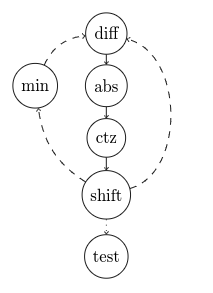
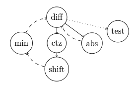

---
tags:
  - 现代硬件算法
  - 算法案例
created: 2026-09-11
source: https://en.algorithmica.org/hpc/algorithms/gcd/
original_title: Binary GCD
---

# 二进制 GCD

在本节中，我们将推导出一个 `gcd` 的变体，它比 C++ 标准库中的版本快约 2 倍。

## 欧几里得算法

欧几里得算法解决的是求两个整数 $a$ 和 $b$ 的*最大公约数*（GCD）问题，定义为能同时整除 $a$ 和 $b$ 的、最大的那个数 $g$：

$$
\gcd(a, b) = \max_{g: \; g|a \, \land \, g | b} g
$$

你大概已经从某本计算机科学教科书里知道这个算法了，但我在这里还是总结一下。它基于如下公式（假设 $a > b$）：

$$
\gcd(a, b) = \begin{cases}
    a, & b = 0
\\ \gcd(b, a \bmod b), & b > 0
\end{cases}
$$

这是成立的，因为如果 $g = \gcd(a, b)$ 同时整除 $a$ 和 $b$，那么也应当整除 $(a \bmod b = a - k \cdot b)$；但 $b$ 的任意更大的因子 $d$ 则不会：$d > g$ 意味着 $d$ 不可能整除 $a$，因而也不会整除 $(a - k \cdot b)$。

上面的公式本质上就是算法本身：你只需递归地应用它，并且由于每次其中一个参数都严格减小，它最终会收敛到 $b = 0$ 的情形。

教科书大概也提到过，欧几里得算法的最坏输入——也就是使总步数最大化的那种——是连续的斐波那契数，而由于它们呈指数增长，该算法的最坏运行时间在渐近意义下是对数的。如果我们把平均运行时间定义为均匀分布的随机整数对所需步数的期望，这对*平均*运行时间同样成立。[维基百科文章](https://en.wikipedia.org/wiki/Euclidean_algorithm)还给出了更精确的 $0.84 \cdot \ln n$ 渐近估计的一种隐晦推导。


实现欧几里得算法有很多种方式。最简单的是直接把定义翻译成代码：

```c++
int gcd(int a, int b) {
    if (b == 0)
        return a;
    else
        return gcd(b, a % b);
}
```

你也可以把它写得更紧凑：

```c++
int gcd(int a, int b) {
    return (b ? gcd(b, a % b) : a);
}
```

你还可以把它写成循环，这会更接近硬件实际执行它的方式。不过它不会更快，因为编译器可以轻松地优化尾递归。

```c++
int gcd(int a, int b) {
    while (b > 0) {
        a %= b;
        std::swap(a, b);
    }
    return a;
}
```

你甚至可以把循环体写成这条令人困惑的一行——而且从 C++17 起它甚至能在不引发未定义行为警告的情况下编译：

```c++
int gcd(int a, int b) {
    while (b) b ^= a ^= b ^= a %= b;
    return a;
}
```

上述所有这些，以及 C++17 引入的 `std::gcd`，几乎等价，并被[编译](https://godbolt.org/z/r8z5KcGqK)成功能上等同于下面这样的汇编循环：

```nasm
; a = eax, b = edx
loop:
    ; modulo in assembly:
    mov  r8d, edx
    cdq
    idiv r8d
    mov  eax, r8d
    ; (a and b are already swapped now)
    ; continue until b is zero:
    test edx, edx
    jne  loop
```

如果你在上面跑 [[统计采样剖析.md|perf]]，你会看到它把约 90% 的时间花在了 `idiv` 那一行。这并不奇怪：通用的[[整数除法.md|整数除法]]在所有计算机（包括 x86）上都是出了名的慢。

但有一种除法在硬件上表现良好：除以 2 的幂。

## 二进制 GCD

*二进制 GCD 算法*与欧几里得算法几乎在同一时代被发现，只不过是在文明世界的另一端，即古代中国。1967 年，Josef Stein 为了用于那些没有除法指令或除法极慢的计算机而重新发现了它——在那个年代的 CPU 上，罕见或复杂的操作用掉几百甚至几千个周期是常事。

类似于欧几里得算法，它基于几个类似的观察：

1. $\gcd(0, b) = b$，对称地有 $\gcd(a, 0) = a$；
2. $\gcd(2a, 2b) = 2 \cdot \gcd(a, b)$；
3. 若 $b$ 为奇数，则 $\gcd(2a, b) = \gcd(a, b)$，对称地，若 $a$ 为奇数，则 $\gcd(a, b) = \gcd(a, 2b)$；
4. 若 $a$ 和 $b$ 均为奇数，则 $\gcd(a, b) = \gcd(|a − b|, \min(a, b))$。

同样地，算法本身也只是这些恒等式的反复应用。

它的运行时间仍然是对数的，这一点甚至更容易说明，因为在每条这些恒等式中，其中一个参数都被除以 2——除了最后一种情形，此时新第一个参数（两个奇数的绝对差）必然是偶数，因此会在下一轮被除以 2。

让这个算法对我们格外有趣的是，它使用的唯一算术运算是二进制移位、比较和减法，这些通常都只需一个周期。

### 实现

这个算法之所以没被写进教科书，是因为它再也不能被实现成简单的一行了：

```c++
int gcd(int a, int b) {
    // base cases (1)
    if (a == 0) return b;
    if (b == 0) return a;
    if (a == b) return a;

    if (a % 2 == 0) {
        if (b % 2 == 0) // a is even, b is even (2)
            return 2 * gcd(a / 2, b / 2);
        else            // a is even, b is odd (3)
            return gcd(a / 2, b);
    } else {
        if (b % 2 == 0) // a is odd, b is even (3)
            return gcd(a, b / 2);
        else            // a is odd, b is odd (4)
            return gcd(std::abs(a - b), std::min(a, b));
    }
}
```

我们来运行一下，结果发现……它很糟。与 `std::gcd` 相比，差异确实达到了 2 倍，但在等式的另一侧。这主要是由于区分各种情形所需的那些分支造成的。让我们开始优化。

首先，让我们把所有"除以 2"替换成"除以尽可能高的 2 的幂"。我们可以用现代 CPU 上可用的 `__builtin_ctz`（"计算末尾零的个数"）指令高效地做到。每当原算法中应该除以 2 时，我们就调用这个函数，它会给出要把该数右移的确切位数。假设我们处理的是大的随机数，这预期会把迭代次数减少近 2 倍，因为 $1 + \frac{1}{2} + \frac{1}{4} + \frac{1}{8} + \ldots \to 2$。

其次，我们可以注意到，条件 2 现在只会成立一次——在最开始——因为其他每个恒等式都会至少留下其中一个数为奇数。因此我们可以在开头只处理这一情形，而不必在主循环中考虑它。

第三，我们可以注意到，在进入了条件 4 并应用其恒等式之后，$a$ 将永远是偶数、$b$ 永远是奇数，所以我们已经知道下一轮会落在条件 3。这意味着我们实际上可以立刻把 $a$ "去偶数化"，而这样做的话，下一轮又必定会命中条件 4。这意味着我们只会处在条件 4，或者由条件 1 终止，从而不再需要分支。

综合这些想法，我们得到如下实现：

```c++
int gcd(int a, int b) {
    if (a == 0) return b;
    if (b == 0) return a;

    int az = __builtin_ctz(a);
    int bz = __builtin_ctz(b);
    int shift = std::min(az, bz);
    a >>= az, b >>= bz;
    
    while (a != 0) {
        int diff = a - b;
        b = std::min(a, b);
        a = std::abs(diff);
        a >>= __builtin_ctz(a);
    }
    
    return b << shift;
}
```

它运行于 116ns，而 `std::gcd` 需要 198ns。几乎快了两倍——也许我们还能把它优化到 100ns 以下？

为此我们需要再次盯着[它的汇编](https://godbolt.org/z/nKKMe48cW)，尤其是这一段：

```nasm
; a = edx, b = eax
loop:
    mov   ecx, edx
    sub   ecx, eax       ; diff = a - b
    cmp   eax, edx
    cmovg eax, edx       ; b = min(a, b)
    mov   edx, ecx
    neg   edx
    cmovs edx, ecx       ; a = max(diff, -diff) = abs(diff)
    tzcnt ecx, edx       ; az = __builtin_ctz(a)
    sarx  edx, edx, ecx  ; a >>= az
    test  edx, edx       ; a != 0?
    jne   loop
```

我们来画出这个循环的依赖图：

<!--
\node [draw, circle] (diff)  at (3, 10) {diff};
\node [draw, circle] (min)   at (1.5, 8.9) {min};
\node [draw, circle] (abs)   at (3, 8.9) {abs};
\node [draw, circle] (ctz)   at (3, 7.8) {ctz};
\node [draw, circle] (shift) at (3, 6.6) {shift};
\node [draw, circle] (test)  at (3, 5.3) {test};

\path [->] (diff) edge (abs);
\path [->] (abs) edge (ctz);
\path [->] (ctz) edge (shift);
\path [->, dashed] (min) edge [bend left] (diff);
\path [->, dotted] (shift) edge (test);
\path [->, dashed] (shift) edge [bend right=75] (diff);
\path [->, dashed] (shift) edge [bend left=25] (min);
-->



现代处理器可以并行执行许多指令，这本质上意味着该计算真正的"代价"大致等于其关键路径上各延迟之和。在本例中，它就是 `diff`、`abs`、`ctz` 和 `shift` 的总延迟。

我们可以利用这样一个事实来减小这个延迟：我们实际上可以只用 `diff = a - b` 来计算 `ctz`，因为一个[[整数.md#二进制格式|负数]]若能被 $2^k$ 整除，其二进制表示的末尾仍然有 $k$ 个零。这让我们可以不必等待先算出 `max(diff, -diff)`，从而得到一张更短的依赖图：

<!--
\node [draw, circle] (diff)  at (3, 10) {diff};
\node [draw, circle] (min)   at (1.5, 8.9) {min};
\node [draw, circle] (abs)   at (4.5, 8.9) {abs};
\node [draw, circle] (ctz)   at (3, 8.9) {ctz};
\node [draw, circle] (shift) at (3, 7.8) {shift};
\node [draw, circle] (test)  at (5.6, 9.4) {test};

\path [->] (diff) edge (abs);
\path [->] (diff) edge (ctz);
\path [->] (ctz) edge (shift);
\path [->, dashed] (min) edge [bend left] (diff);
\path [->, dotted] (diff) edge (test);
\path [->, dashed] (shift) edge [bend left=25] (min);
\path [->, dashed] (abs) edge [bend left=25] (diff);
-->



希望你想到最终代码将如何执行时，会少一些困惑：

```c++
int gcd(int a, int b) {
    if (a == 0) return b;
    if (b == 0) return a;

    int az = __builtin_ctz(a);
    int bz = __builtin_ctz(b);
    int shift = std::min(az, bz);
    b >>= bz;
    
    while (a != 0) {
        a >>= az;
        int diff = b - a;
        az = __builtin_ctz(diff);
        b = std::min(a, b);
        a = std::abs(diff);
    }
    
    return b << shift;
}
```

它运行于 91ns，这个速度已经足够好，可以到此为止了。

如果有人想通过手写汇编或尝试用查找表来省下最后几次迭代，从而再砍掉几个纳秒，请[让我知道](http://sereja.me/)。

### 致谢

主要的优化思路归功于 Daniel Lemire 和 Ralph Corderoy，他们在 2013 年的圣诞假期[无事可做](https://lemire.me/blog/2013/12/26/fastest-way-to-compute-the-greatest-common-divisor/)。
