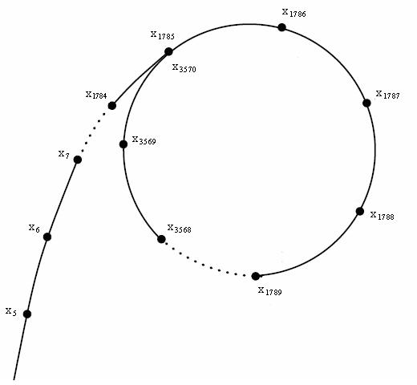

---
tags:
  - 现代硬件算法
  - 算法案例
created: 2026-09-11
source: https://en.algorithmica.org/hpc/algorithms/factorization/
original_title: Integer Factorization
---

# 整数分解

将整数分解为素数因子的乘积，是计算[[数论.md|数论]]的核心问题。至少自公元前 3 世纪起就有人[研究](https://www.cs.purdue.edu/homes/ssw/chapter3.pdf)它，并且已经发展出[许多方法](https://en.wikipedia.org/wiki/Category:Integer_factorization_algorithms)，各自针对不同的输入高效。

在本案例研究中，我们特别考虑*字长*整数的分解：规模在 $10^9$ 到 $10^{18}$ 量级。与本书通常情况不同，在这一章中你或许真的能学到一种渐近更优的算法：我们从几种基本方法出发，逐步构建出 $O(\sqrt[4]{n})$ 时间的*Pollard rho 算法*，并将其优化到可以为 60 位半素数在 0.3–0.4ms 内完成分解，比之前最先进的实现快约 3 倍。

<!--
Integer factorization is interesting because of the RSA problem.
Unlike other case studies of this book, in this one you will actually learn an asymptotically better algorithm that you've never known before — Pollard's rho algorithm — which we optimize so that it is almost 4 times faster than the existing implementation, to the best of my knowledge.
-->

### 基准测试

对于所有方法，我们都会实现 `find_factor` 函数，它接受一个正整数 $n$ 并返回它的任意一个非平凡因子（若 $n$ 为素数则返回 `1`）：

```c++
// I don't feel like typing "unsigned long long" each time
typedef __uint16_t u16;
typedef __uint32_t u32;
typedef __uint64_t u64;
typedef __uint128_t u128;

u64 find_factor(u64 n);
```

要求得完整的分解，你可以把它作用在 $n$ 上，约简后再继续，直到再也找不到新的因子：

```c++
vector<u64> factorize(u64 n) {
    vector<u64> factorization;
    do {
        u64 d = find_factor(n);
        factorization.push_back(d);
        n /= d;
    } while (d != 1);
    return factorization;
}
```

每移除一个因子后，问题都会显著变小，因此完整分解的最坏运行时间等于一次 `find_factor` 调用的最坏运行时间。

对于包括本节所述在内的许多分解算法，运行时间随较小的素因子而伸缩。因此，为了提供最坏情况输入，我们使用*半素数*：两个素数 $p \le q$ 的乘积，且二者量级相当。我们生成一个 $k$ 位的半素数，作为两个随机的 $\lfloor k / 2 \rfloor$ 位素数的乘积。

由于某些算法本质上是随机化的，我们也容忍一小部分（<1%）的假阴性错误（即尽管 $n$ 是合数，`find_factor` 却返回 `1`），不过这个比率可以在不显著影响性能的前提下降低到几乎为零。

### 试除法

<!--

Trial division was first described by Fibonacci in 1202. Although it was probably known to animals. Perhaps some animals can factor? The scientific priority probably belongs to dinosaurs or ancient fish trying to divvy stuff up.

0.056024

-->

最基础的方法是把每个小于 $n$ 的整数都当作除数来试：

```c++
u64 find_factor(u64 n) {
    for (u64 d = 2; d < n; d++)
        if (n % d == 0)
            return d;
    return 1;
}
```

我们可以注意到，如果 $n$ 能被 $d < \sqrt n$ 整除，那么它也能被 $\frac{n}{d} > \sqrt n$ 整除，因此无需单独去检查后者。这使得我们可以提前结束试除，只检查不超过 $\sqrt n$ 的潜在除数：

```c++
u64 find_factor(u64 n) {
    for (u64 d = 2; d * d <= n; d++)
        if (n % d == 0)
            return d;
    return 1;
}
```

在我们的基准测试中，$n$ 是一个半素数，并且我们总是找到较小的那个因子，因此 $O(n)$ 和 $O(\sqrt n)$ 两种实现表现相同，都能每秒分解约 2k 个 30 位的数——而要分解单个 60 位的数则要花整整 20 秒。

### 查找表

如今，你可以在 Linux 终端或 Google 搜索框中输入 `factor 57` 来得到任意数的分解。但在计算机发明之前，更实际的做法是使用*因数表*：那些包含前 $N$ 个数之分解的特殊书籍。

我们也可以采用这种方法来[[预计算.md|在编译期]]计算这些查找表。为了节省空间，我们可以只存储一个数的最小因子。由于最小因子不超过 $\sqrt n$，对每个 16 位整数我们只需要一个字节：

```c++
template <int N = (1<<16)>
struct Precalc {
    unsigned char divisor[N];

    constexpr Precalc() : divisor{} {
        for (int i = 0; i < N; i++)
            divisor[i] = 1;
        for (int i = 2; i * i < N; i++)
            if (divisor[i] == 1)
                for (int k = i * i; k < N; k += i)
                    divisor[k] = i;
    }
};

constexpr Precalc P{};

u64 find_factor(u64 n) {
    return P.divisor[n];
}
```

采用这种方法，我们每秒可以处理 3M 个 16 位整数，尽管对于更大的数它可能会[[内存带宽.md|变慢]]。虽然计算并存储前 $2^{16}$ 个数的因子只需几毫秒和 64KB 内存，但它的扩展性对更大的输入并不好。

### 轮分解

为了节省纸张，前计算机时代的因数表通常排除能被 $2$ 和 $5$ 整除的数，使因数表变为原来大小的 ½ × ⅘ = 0.4。在十进制数字系统中，你可以快速判断一个数是否能被 $2$ 或 $5$ 整除（看它的最后一位数字），并持续将 $n$ 除以 $2$ 或 $5$，直到不能再除，最终在因数表中找到某个条目。

我们可以对试除法应用类似的技巧：先检查该数能否被 $2$ 整除，然后只考虑奇数除数：

```c++
u64 find_factor(u64 n) {
    if (n % 2 == 0)
        return 2;
    for (u64 d = 3; d * d <= n; d += 2)
        if (n % d == 0)
            return d;
    return 1;
}
```

需要执行的除法减少了 50%，此算法因此快了一倍。

这个方法可以扩展：如果数不能被 $3$ 整除，我们也可以忽略所有 $3$ 的倍数，其他除数同理。问题在于，随着我们要排除的素数数量增加，要只遍历不被它们整除的数就变得不那么直接了，因为那些数遵循着不规则的模式——除非素数的数量很小。

例如，如果我们考虑 $2$、$3$ 和 $5$，那么在前 $90$ 个数中，我们只需要检查：

```center
(1,) 7, 11, 13, 17, 19, 23, 29,
31, 37, 41, 43, 47, 49, 53, 59,
61, 67, 71, 73, 77, 79, 83, 89…
```

你可以注意到一个规律：该序列每 $30$ 个数重复一次。这并不奇怪，因为我们只需知道模 $2 \times 3 \times 5 = 30$ 的余数，就足以判断一个数能否被 $2$、$3$ 或 $5$ 整除。这意味着每 $30$ 个数中我们只需要检查具有特定余数的 $8$ 个数，从而成比例地提升性能：

```c++
u64 find_factor(u64 n) {
    for (u64 d : {2, 3, 5})
        if (n % d == 0)
            return d;
    u64 offsets[] = {0, 4, 6, 10, 12, 16, 22, 24};
    for (u64 d = 7; d * d <= n; d += 30) {
        for (u64 offset : offsets) {
            u64 x = d + offset;
            if (n % x == 0)
                return x;
        }
    }
    return 1;
}
```

正如预期，它比朴素试除法快 $\frac{30}{8} = 3.75$ 倍，每秒大约处理 7.6k 个 30 位的数。通过考虑更多素数，性能还能进一步提升，但收益递减：新增一个素数 $p$ 会把迭代次数减少 $\frac{1}{p}$，但同时把跳过列表的大小增加 $p$ 倍，需要成比例的更多内存。

### 预计算素数

如果我们持续增加轮分解中的素数数量，最终会排除所有合数，只检查素因子。这种情况下，我们不再需要这个偏移数组，而只需要素数数组：

```c++
const int N = (1 << 16);

struct Precalc {
    u16 primes[6542]; // # of primes under N=2^16

    constexpr Precalc() : primes{} {
        bool marked[N] = {};
        int n_primes = 0;

        for (int i = 2; i < N; i++) {
            if (!marked[i]) {
                primes[n_primes++] = i;
                for (int j = 2 * i; j < N; j += i)
                    marked[j] = true;
            }
        }
    }
};

constexpr Precalc P{};

u64 find_factor(u64 n) {
    for (u16 p : P.primes)
        if (n % p == 0)
            return p;
    return 1;
}
```

这种方法让我们每秒能处理近 20k 个 30 位整数，但它对更大的（64 位）数无效，除非它们有较小的（< $2^{16}$）因子。

注意，这实际上是一个渐近优化：在前 $n$ 个数中有 $O(\frac{n}{\ln n})$ 个素数，因此该算法执行 $O(\frac{\sqrt n}{\ln \sqrt n})$ 次操作，而轮分解只排除了一个很大但为常数的除数比例。如果我们把它扩展到 64 位数并预计算 $2^{32}$ 以下的所有素数（存储它们需要几百兆字节的内存），相对加速比将增长 $\frac{\ln \sqrt{n^2}}{\ln \sqrt n} = 2 \cdot \frac{1/2}{1/2} \cdot \frac{\ln n}{\ln n} = 2$ 倍。

试除法的所有变体（包括这个）都受整数除法速度的制约，如果我们提前知道除数并允许一些额外的预计算，则可以对它进行[[整数除法.md|优化]]。在我们的情形中，适合使用[[整数除法.md#为什么它有效|Lemire 除法检查]]：

```c++
// ...precomputation is the same as before,
// but we store the reciprocal instead of the prime number itself
u64 magic[6542];
// for each prime i:
magic[n_primes++] = u64(-1) / i + 1;

u64 find_factor(u64 n) {
    for (u64 m : P.magic)
        if (m * n < m)
            return u64(-1) / m + 1;
    return 1;
}
```

这令算法快了约 18 倍：我们现在每秒能分解 **~350k** 个 30 位整数，这实际上是针对这一数值范围我们最高效的算法。虽然通过用[[SIMD并行.md|SIMD]]并行执行这些检查或许还能进一步优化，但我们到此为止，转而尝试一种渐近更优的方法。

### Pollard rho 算法

<!--

Consider this weird code snippet:

```c++
u64 find_factor(u64 n) {
    while (true) {
        if (u64 g = gcd(randint(2, n - 1), n); g != 1)
            return g;
    }
}
```

It also searches for a factor, but it does so by repeatedly trying to compute the [GCD](../gcd) of $n$ and its random remainder, which would yield a valid divisor of $n$ if this remainder is not coprime with it. Surprisingly, this algorithm is not *that* terrible: it needs expected $O(\sqrt n)$ iterations in the worst case (times $\log n$ from GCD) because on each trial, it can hit not only $p$ or $q = \frac{n}{p}$, but also $\frac{n}{p} + \frac{n}{q} = O(\sqrt n)$ of their multiples.

By itself, this algorithm is just an esoteric way of computing factorization, but can be made useful. If, instead of random numbers, we apply this $\gcd$ trick to a particular number sequence, we get a $O(n^\frac{1}{4})$ approach known as Pollard's rho algorithm.

Apart from this trick, Pollard's rho algorithm relies on a consequence from the Birthday paradox: we need to add $O(\sqrt{n})$ random numbers from $1$ to $n$ to a set until we get a collision. 

-->

Pollard rho 是一种随机化的 $O(\sqrt[4]{n})$ 整数分解算法，它利用了[生日悖论](https://en.wikipedia.org/wiki/Birthday_problem)：

> 只需从 $1$ 到 $n$ 之间抽取 $d = \Theta(\sqrt{n})$ 个随机数，就能以高概率得到一个碰撞。

其背后的推理是：每一个被加入的 $d$ 个元素都有 $\frac{d}{n}$ 的概率与某个其他元素碰撞，这意味着期望的碰撞次数为 $\frac{d^2}{n}$。如果 $d$ 渐近地小于 $\sqrt n$，那么当 $n \to \infty$ 时这个比值趋近于零，反之则趋于无穷。

考虑某个函数 $f(x)$，它取余数 $x \in [0, n)$，并从数论角度将它映射到 $n$ 的某个看似随机的余数。具体来说，我们将使用 $f(x) = x^2 + 1 \bmod n$，它对我们的目的而言已经足够随机。

现在，考虑一张图，其中每个数-顶点 $x$ 都有一条指向 $f(x)$ 的边。这样的图被称为*函数图*。在函数图中，任何元素的"轨迹"——也就是从那个元素出发、不断沿着边走所经过的路径——最终会绕成一个环（因为顶点集合有限，在某个时刻我们必然会走到一个已经访问过的顶点）。



考虑某个特定元素 $x_0$ 的轨迹：

$$
x_0, \; f(x_0), \; f(f(x_0)), \; \ldots
$$

我们将这个序列再生成另一个序列，方法是把每个元素对 $p$ 取模，其中 $p$ 是 $n$ 的最小素因子。

**引理.** 归约后的序列在进入循环之前的期望长度为 $O(\sqrt[4]{n})$。

**证明：** 由于 $p$ 是最小因子，有 $p \leq \sqrt n$。每当我们经过一条新边，本质上就是在 $0$ 到 $p$ 之间生成一个随机数（我们把 $f$ 当作一个"确定性随机"的函数）。生日悖论告诉我们，只需要生成 $O(\sqrt p) = O(\sqrt[4]{n})$ 个数，就能得到一个碰撞，从而进入循环。

由于我们不知道 $p$，这个模 $p$ 序列只是假想的，但如果我们能在其中找到一个循环——也就是 $i$ 和 $j$ 使得

$$
f^i(x_0) \equiv f^j(x_0) \pmod p
$$

那么我们也可以把 $p$ 本身求出来，即

$$
p = \gcd(|f^i(x_0) - f^j(x_0)|, n)
$$

算法本身只是利用这个 GCD 技巧以及 Floyd 的"[龟兔](https://en.wikipedia.org/wiki/Cycle_detection#Floyd's_tortoise_and_hare)"算法来找到这个循环和 $p$：我们维护两个指针 $i$ 和 $j = 2i$，并检查

$$
\gcd(|f^i(x_0) - f^j(x_0)|, n) \neq 1
$$

这等价于在模 $p$ 意义下比较 $f^i(x_0)$ 和 $f^j(x_0)$。由于 $j$（兔）以 $i$（龟）两倍的速度增长，它们的差每轮增加 $1$，最终会等于（或成为）循环长度的倍数，此时 $i$ 和 $j$ 指向相同的元素。正如我们半页前所证明的，到达一个循环只需要 $O(\sqrt[4]{n})$ 次迭代：

```c++
u64 f(u64 x, u64 mod) {
    return ((u128) x * x + 1) % mod;
}

u64 diff(u64 a, u64 b) {
    // a and b are unsigned and so is their difference, so we can't just call abs(a - b)
    return a > b ? a - b : b - a;
}

const u64 SEED = 42;

u64 find_factor(u64 n) {
    u64 x = SEED, y = SEED, g = 1;
    while (g == 1) {
        x = f(f(x, n), n); // advance x twice
        y = f(y, n);       // advance y once
        g = gcd(diff(x, y));
    }
    return g;
}
```

虽然它每秒只能处理约 25k 个 30 位整数——比用快速除法技巧逐个检查素数慢了将近 15 倍——但对于 60 位数，它远超所有 $\tilde{O}(\sqrt n)$ 算法，每秒能分解约 90 个。

### Pollard-Brent 算法

Floyd 的循环查找算法有一个问题：它移动的迭代器比必要的多：较慢的迭代器至少有半数顶点会被多访问一次。

一种解决方法是记住较快迭代器访问过的值 $x_i$，并且每两次迭代用 $x_i$ 与 $x_{\lfloor i / 2 \rfloor}$ 的差来计算 GCD。但也可以在不使用额外内存的情况下，依据另一原则实现：龟并非每轮都移动，而是当迭代次数变为 2 的幂时，重置为较快迭代器的值。这让我们可以在每轮仍然使用相同的 GCD 技巧来比较 $x_i$ 和 $x_{2^{\lfloor \log_2 i \rfloor}}$，从而节省额外的迭代：

```c++
u64 find_factor(u64 n) {
    u64 x = SEED;
    
    for (int l = 256; l < (1 << 20); l *= 2) {
        u64 y = x;
        for (int i = 0; i < l; i++) {
            x = f(x, n);
            if (u64 g = gcd(diff(x, y), n); g != 1)
                return g;
        }
    }

    return 1;
}
```

注意，我们还对迭代次数设置了上限，以便算法在合理时间内结束，并在 $n$ 结果为素数时返回 `1`。

它实际上*没有*提升性能，反而让算法慢了约 1.5 倍，这大概与 $x$ 过期有关。它把大部分时间花在计算 GCD 上，而不是推进迭代器——事实上，由于这个原因，该算法目前的时间需求是 $O(\sqrt[4]{n} \log n)$。

与其[[二进制 GCD.md|优化 GCD 本身]]，我们不如优化它的调用次数。我们可以利用这样一个事实：如果 $a$ 和 $b$ 中有一个含有因子 $p$，那么 $a \cdot b \bmod n$ 也会含有它，因此与其计算 $\gcd(a, n)$ 和 $\gcd(b, n)$，不如计算 $\gcd(a \cdot b \bmod n, n)$。这样，我们就可以把 GCD 的计算按 $M = O(\log n)$ 分组，从而把 $\log n$ 从渐近复杂度中去掉：

```c++
const int M = 1024;

u64 find_factor(u64 n) {
    u64 x = SEED;
    
    for (int l = M; l < (1 << 20); l *= 2) {
        u64 y = x, p = 1;
        for (int i = 0; i < l; i += M) {
            for (int j = 0; j < M; j++) {
                y = f(y, n);
                p = (u128) p * diff(x, y) % n;
            }
            if (u64 g = gcd(p, n); g != 1)
                return g;
        }
    }

    return 1;
}
```

现在它每秒执行 425 次分解，受模运算速度的制约。

### 优化模运算

最后一步是应用[[Montgomery 乘法.md|Montgomery 乘法]]。由于模数是常数，我们可以把所有计算——推进迭代器、做乘法、甚至计算 GCD——都放在 Montgomery 空间中进行，在那里约简是廉价的：

```c++
struct Montgomery {
    u64 n, nr;
    
    Montgomery(u64 n) : n(n) {
        nr = 1;
        for (int i = 0; i < 6; i++)
            nr *= 2 - n * nr;
    }

    u64 reduce(u128 x) const {
        u64 q = u64(x) * nr;
        u64 m = ((u128) q * n) >> 64;
        return (x >> 64) + n - m;
    }

    u64 multiply(u64 x, u64 y) {
        return reduce((u128) x * y);
    }
};

u64 f(u64 x, u64 a, Montgomery m) {
    return m.multiply(x, x) + a;
}

const int M = 1024;

u64 find_factor(u64 n, u64 x0 = 2, u64 a = 1) {
    Montgomery m(n);
    u64 x = SEED;
    
    for (int l = M; l < (1 << 20); l *= 2) {
        u64 y = x, p = 1;
        for (int i = 0; i < l; i += M) {
            for (int j = 0; j < M; j++) {
                x = f(x, m);
                p = m.multiply(p, diff(x, y));
            }
            if (u64 g = gcd(p, n); g != 1)
                return g;
        }
    }

    return 1;
}
```

这个实现每秒可以处理约 3k 个 60 位整数，比 [PARI](https://pari.math.u-bordeaux.fr/) / [SageMath 的 `factor`](https://doc.sagemath.org/html/en/reference/structure/sage/structure/factorization.html) / `cat semiprimes.txt | time factor` 的测量值快约 3 倍。

### 进一步改进

**优化.** 我们对 Pollard 算法的实现仍有大量优化潜力：

- 我们大概可以使用更好的循环查找算法，利用图是随机的这一事实。例如，我们在最初几轮内就进入循环的可能性很小（循环的长度与进入循环前所走的路径长度在期望上相等，因为在绕回之前，我们是独立地选择所走路径上的顶点），因此我们可以先让迭代器推进一段时间，再开始用 GCD 技巧进行试探。
- 我们当前的方法受推进迭代器所制约（Montgomery 乘法的延迟远高于其对应的吞吐），而在等待它完成时，我们可以用之前的值执行不止一次试探。
- 如果我们并行运行 $p$ 个带有不同种子的独立算法实例，并在其中一个找到答案时停止，它将快 $\sqrt p$ 倍结束（推理类似生日悖论；试着自己证明它）。我们不必为此使用多核：还有大量未被利用的[[指令级并行.md|指令级并行]]，因此我们可以在同一线程上并发运行两三个相同的操作，或者使用[[SIMD并行.md|SIMD]]指令并行执行 4 或 8 次乘法。

如果再看到 3 倍的提升、达到约 10k/秒的吞吐，我不会感到惊讶。如果你[实现了](https://github.com/sslotin/amh-code/tree/main/factor)其中某些想法，请[让我知道](http://sereja.me/)。

<!-- Another observation: the length of the "tail" and the cycle is equal in expectation, since when we loop around, we choose any vertex of the path we walked independently. How to optimize for the *average* case is unclear. -->

**错误.** 在实际实现中我们需要处理的另一个方面是可能出现的错误。我们当前的实现对 60 位整数有 0.7% 的错误率，并且当数字更小时错误率还会更高。这些错误来自三个主要来源：

- 根本没有找到循环（算法本身是随机的，无法保证一定能找到）。这种情况下，我们需要执行素性测试并可选地重新开始。
- `p` 变量变成零（因为 $p$ 和 $q$ 都可能进入乘积）。当我们减小输入规模或增大常数 `M` 时，它变得越来越可能发生。这种情况下，我们需要重启该过程，或者（更好）回滚最后 $M$ 次迭代并逐个执行试探。
- Montgomery 乘法中的溢出。我们当前的实现对溢出相当宽松，如果 $n$ 很大，我们需要添加更多 `x > mod ? x - mod : x` 这样的语句来处理溢出。

**更大的数.** 如果我们用之前实现的算法排除掉小数和带有小素因子的数，这些问题就不那么重要了。一般来说，最优方法应当取决于数的大小：

- 小于 $2^{16}$：使用查找表；
- 小于 $2^{32}$：使用带有快速可除性检查的预计算素数列表；
- 小于 $2^{64}$ 左右：使用带 Montgomery 乘法的 Pollard rho 算法；
- 小于 $10^{50}$：切换到 [Lenstra 椭圆曲线分解](https://en.wikipedia.org/wiki/Lenstra_elliptic-curve_factorization)；
- 小于 $10^{100}$：切换到 [二次筛法](https://en.wikipedia.org/wiki/Quadratic_sieve)；
- 大于 $10^{100}$：切换到 [广义数域筛法](https://en.wikipedia.org/wiki/General_number_field_sieve)。

<!-- Requiring about 100KB of memory. 6542 * 8 -->

最后三种方法与我们所做的非常不同，需要更高深的数论，它们本身就值得写一篇文章（或一门完整的大学课程）。
