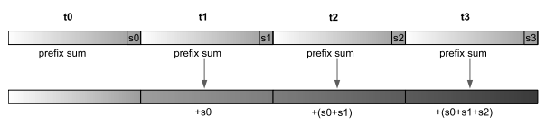
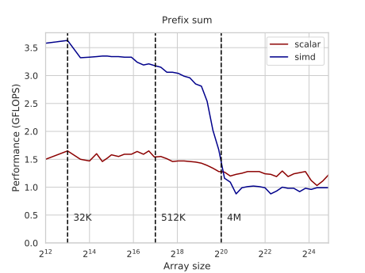
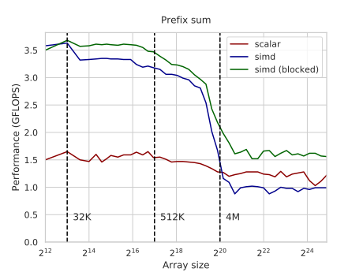

---
tags:
  - 现代硬件算法
  - 算法案例
created: 2026-09-11
source: https://en.algorithmica.org/hpc/algorithms/prefix/
original_title: Prefix Sum with SIMD
---

# 用 SIMD 求前缀和

*前缀和*，也称为*累积和*、*inclusive scan*，或简称为 *scan*，是从另一个序列 $a_i$ 用如下规则生成的一串数 $b_i$：

$$
\begin{aligned}
b_0 &= a_0
\\ b_1 &= a_0 + a_1
\\ b_2 &= a_0 + a_1 + a_2
\\ &\ldots
\end{aligned}
$$

换句话说，输出序列的第 $k$ 个元素就是输入序列前 $k$ 个元素之和。

前缀和在许多算法中都是一个非常重要的原语，尤其在并行算法的语境下，它的计算几乎可以随处理器数量完美扩展。遗憾的是，在单个 CPU 核心上用 SIMD 并行来加速它要困难得多，但我们仍然会尝试——并推导出一个比基线标量实现快约 2.5 倍的算法。

### 基线

对于我们的基线，我们本可以调用 STL 里的 `std::partial_sum`，但为了清晰起见，我们将手动实现它。我们创建一个整数数组，然后依次把前一个元素加到当前元素上：

```c++
void prefix(int *a, int n) {
    for (int i = 1; i < n; i++)
        a[i] += a[i - 1];
}
```

看起来每次迭代我们需要两次读、一次加、一次写，但当然，编译器把多余的读优化掉了，而是用一个寄存器作为累加器：

```nasm
loop:
    add     edx, DWORD PTR [rax]
    mov     DWORD PTR [rax-4], edx
    add     rax, 4
    cmp     rax, rcx
    jne     loop
```

经过[[循环与条件分支.md|循环展开]]后，实际上只剩两条指令：融合的读-加，以及结果写回。理论上，这些应该运行在 2 GFLOPS（每个 CPU 周期 1 个元素，凭借[[指令级并行.md|超标量处理]]），但由于内存系统必须不断在[[内存带宽.md#频率缩放|读与写之间切换]]，实际性能在 1.2 到 1.6 GFLOPS 之间，取决于数组大小。

### 向量化

实现并行前缀和算法的一种方法是：把数组分成小块，在它们之上独立计算*局部*前缀和，然后再做第二趟，把之前所有元素的和加到每个块的计算值上，从而调整它们。



这使得每个块都可以并行处理——无论是在计算局部前缀和阶段，还是在累加阶段——所以你通常会把数组分成和处理器数量一样多的块。但由于我们只被允许使用一个 CPU 核心，而且 SIMD 中的[[数据搬移.md#映射到数组|非顺序内存访问]]表现不好，我们不会那样做。相反，我们会使用一个固定为 SIMD 通道大小的块，并在一个寄存器内计算前缀和。

现在，要在本地计算这些前缀和，我们将使用另一种并行前缀和方法，它在一般情况下效率不高（总工作量是 $O(n \log n)$ 而非线性），但当数据已经在 SIMD 寄存器中时已经足够好。思路是执行 $\log n$ 次迭代，在第 $k$ 次迭代中，对所有适用的 $i$ 把 $a_{i - 2^k}$ 加到 $a_i$ 上：

```c++
for (int l = 0; l < logn; l++)
    // (atomically and in parallel):
    for (int i = (1 << l); i < n; i++)
        a[i] += a[i - (1 << l)];
```

我们可以通过归纳证明这个算法有效：如果在第 $k$ 次迭代中，每个元素 $a_i$ 都等于原数组 $(i - 2^k, i]$ 段的和，那么把 $a_{i - 2^k}$ 加到它上面之后，它将等于 $(i - 2^{k+1}, i]$ 段的和。经过 $O(\log n)$ 次迭代，该数组就会变成它的前缀和。

要在 SIMD 中实现它，我们可以用[[寄存器内重排.md|置换]]把第 $i$ 个元素放到 $(i-2^k)$ 个元素的对面，但它们太慢了。相反，我们将使用 `sll`（"shift lanes left"，左移通道）指令，它恰好做这件事，并且用零替换掉不匹配的元素：

```c++
typedef __m128i v4i;

v4i prefix(v4i x) {
    // x = 1, 2, 3, 4
    x = _mm_add_epi32(x, _mm_slli_si128(x, 4));
    // x = 1, 2, 3, 4
    //   + 0, 1, 2, 3
    //   = 1, 3, 5, 7
    x = _mm_add_epi32(x, _mm_slli_si128(x, 8));
    // x = 1, 3, 5, 7
    //   + 0, 0, 1, 3
    //   = 1, 3, 6, 10
    return x;
}
```

遗憾的是，这条指令的 256 位版本是在两个 128 位通道内独立执行这种字节移位的，这正是 AVX 的典型行为：

```c++
typedef __m256i v8i;

v8i prefix(v8i x) {
    // x = 1, 2, 3, 4, 5, 6, 7, 8
    x = _mm256_add_epi32(x, _mm256_slli_si256(x, 4));
    x = _mm256_add_epi32(x, _mm256_slli_si256(x, 8));
    x = _mm256_add_epi32(x, _mm256_slli_si256(x, 16)); // <- this does nothing
    // x = 1, 3, 6, 10, 5, 11, 18, 26
    return x;
}
```

我们仍然可以用它来以两倍速度计算 4 元素前缀和，但在累加时我们必须切换到 128 位 SSE。让我们写一个方便的函数，端到端地计算一个局部前缀和：

```c++
void prefix(int *p) {
    v8i x = _mm256_load_si256((v8i*) p);
    x = _mm256_add_epi32(x, _mm256_slli_si256(x, 4));
    x = _mm256_add_epi32(x, _mm256_slli_si256(x, 8));
    _mm256_store_si256((v8i*) p, x);
}
```

现在，对于累加阶段，我们将创建另一个方便的函数，它同样接收指向一个 4 元素块的指针，以及前一个前缀和的 4 元素向量。这个函数的职责是把这个前缀和向量加到该块上，并更新它，以便能传给下一个块（方法是在加法之前广播该块的最后一个元素）：

<!--

Not managing to come up with a more characteristic name, we are going to call it `accumulate`:

-->

```c++
v4i accumulate(int *p, v4i s) {
    v4i d = (v4i) _mm_broadcast_ss((float*) &p[3]);
    v4i x = _mm_load_si128((v4i*) p);
    x = _mm_add_epi32(s, x);
    _mm_store_si128((v4i*) p, x);
    return _mm_add_epi32(s, d);
}
```

实现了 `prefix` 和 `accumulate` 之后，剩下的唯一一件事就是把我们的两趟算法粘合起来：

```c++
void prefix(int *a, int n) {
    for (int i = 0; i < n; i += 8)
        prefix(&a[i]);
    
    v4i s = _mm_setzero_si128();
    
    for (int i = 4; i < n; i += 4)
        s = accumulate(&a[i], s);
}
```

该算法已经比标量实现快了略多于两倍，但对于超出 L3 缓存的大数组会变慢——大致在[[内存带宽.md|双向内存带宽]]的一半处，因为我们把整个数组读了两遍。



另一个有趣的数据点：如果我们只执行 `prefix` 阶段，性能会是约 8.1 GFLOPS。`accumulate` 阶段略慢，约 5.8 GFLOPS。合理性检查：总性能应为 $\frac{1}{ \frac{1}{5.8} + \frac{1}{8.1} } \approx 3.4$。

### 分块

所以，对于大数组我们遇到了内存带宽问题。如果我们把数组分成能放进缓存的块并分别处理，就可以避免重新从 RAM 取整个数组。我们需要传给下一个块的只是之前那些块的和，因此我们可以设计一个接口类似 `accumulate` 的 `local_prefix` 函数：

```c++
const int B = 4096; // <- ideally should be slightly less or equal to the L1 cache

v4i local_prefix(int *a, v4i s) {
    for (int i = 0; i < B; i += 8)
        prefix(&a[i]);
    
    for (int i = 0; i < B; i += 4)
        s = accumulate(&a[i], s);

    return s;
}

void prefix(int *a, int n) {
    v4i s = _mm_setzero_si128();
    for (int i = 0; i < n; i += B)
        s = local_prefix(a + i, s);
}
```

（我们必须确保 $N$ 是 $B$ 的倍数，但我们先忽略这类实现细节。）

分块版本的表现好得多，而且不只是在数组位于 RAM 中时如此：



与未分块实现相比，在 RAM 情形下的加速比只有约 1.5 而非 2。这是因为在第二次遍历缓存块时，内存控制器处于空闲状态，而没有去取下一个块——[[预取.md|硬件预取器]]还不够先进，检测不出这种模式。

### 连续加载

有几种方法可以解决这种利用率不足的问题。最明显的一种是使用[[预取.md|软件预取]]，在我们仍在处理当前块时显式地请求下一个块。

最好把预取加到 `accumulate` 阶段，因为它比 `prefix` 更慢、对内存的压力也更小：

```c++
v4i accumulate(int *p, v4i s) {
    __builtin_prefetch(p + B); // <-- prefetch the next block
    // ...
    return s;
}
```

对于缓存内的数组，性能略有下降，但对于 RAM 内的数组则更接近 2 GFLOPS：


另一种方法是做两阶段的*交织*。不是在大块中把它们分开并交替，而是并发执行两个阶段，且 `accumulate` 阶段固定落后若干次迭代——类似于[[指令级并行.md|CPU 流水线]]：

```c++
const int B = 64;
//        ^ small sizes cause pipeline stalls
//          large sizes cause cache system inefficiencies

void prefix(int *a, int n) {
    v4i s = _mm_setzero_si128();

    for (int i = 0; i < B; i += 8)
        prefix(&a[i]);

    for (int i = B; i < n; i += 8) {
        prefix(&a[i]);
        s = accumulate(&a[i - B], s);
        s = accumulate(&a[i - B + 4], s);
    }

    for (int i = n - B; i < n; i += 4)
        s = accumulate(&a[i], s);
}
```

这有更多好处：循环以恒定速度推进，减轻了对内存系统的压力，而且调度器能同时看到两个子程序的指令，从而能更高效地把指令分配到执行端口——有点像超线程，但是在代码里。

由于这些原因，性能即便在小数组上也得到了提升：


最后，我们似乎不受[[指令表.md|内存读端口]]或[[机器码布局.md#机器码布局|解码宽度]]制约，所以我们可以免费加上预取，从而进一步提升性能：


我们能够达到的总加速比，在小数组上介于 $\frac{4.2}{1.5} \approx 2.8$ 之间，在大数组上介于 $\frac{2.1}{1.2} \approx 1.75$ 之间。

与使用标量代码相比，对于更低精度的数据，加速比可能更高，因为它几乎被限制为每个周期执行一次迭代，而与操作数大小无关，但和某些[[用 SIMD 求 Argmin.md|其他基于 SIMD 的算法]]相比，它仍然有点"就那样"。这在很大程度上是因为 AVX 中没有一个完整的寄存器字节移位指令能让 `accumulate` 阶段快一倍，更不用说一条专用的前缀和指令了。

### 其他相关工作

你可以阅读[哥伦比亚大学的这篇论文](http://www.adms-conf.org/2020-camera-ready/ADMS20_05.pdf)，它聚焦于多核场景和 AVX-512（它[在某种意义上](https://www.intel.com/content/www/us/en/docs/intrinsics-guide/index.html#ig_expand=3037,4870,6715,4845,3853,90,7307,5993,2692,6946,6949,5456,6938,5456,1021,3007,514,518,7253,7183,3892,5135,5260,3915,4027,3873,7401,4376,4229,151,2324,2310,2324,591,4075,6130,4875,6385,5259,6385,6250,1395,7253,6452,7492,4669,4669,7253,1039,1029,4669,4707,7253,7242,848,879,848,7251,4275,879,874,849,833,6046,7250,4870,4872,4875,849,849,5144,4875,4787,4787,4787,3016,3018,5227,7359,7335,7392,4787,5259,5230,5230,5223,6438,488,483,6165,6570,6554,289,6792,6554,5230,6385,5260,5259,289,288,3037,3009,590,604,633,5230,5259,6554,6554,5259,6547,6554,3841,5214,5229,5260,5259,7335,5259,519,1029,515,3009,3009,3013,3011,515,6527,652,6527,6554,288&text=_mm512_alignr_epi32&techs=AVX_512)有一个快速的 512 位寄存器字节移位），以及[这个 StackOverflow 问题](https://stackoverflow.com/questions/10587598/simd-prefix-sum-on-intel-cpu)以了解更一般的讨论。

我在本文中描述的大部分内容早已为人所知。据我所知，我在这里的贡献是交织技术，它带来了约 20% 的 modest（适度）性能提升。大概还有办法能进一步改进，但不会很多。

还有 CMU 的这位教授 [Guy Blelloch](https://www.cs.cmu.edu/~blelloch/)，他在 90 年代[提倡](https://www.cs.cmu.edu/~blelloch/papers/sc90.pdf)专用的前缀和硬件，当时[向量处理器](https://en.wikipedia.org/wiki/Vector_processor)还是个东西。前缀和对并行应用非常重要，而硬件正变得越来越并行，所以也许将来 CPU 制造商会重拾这个想法，让前缀和计算稍微容易一些。

<!--

There are ways to do it with permutations, but it would kill the performance of the prefix stage.

-->
