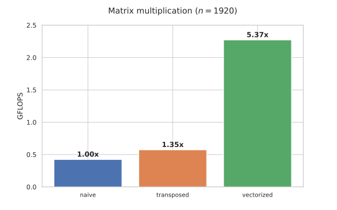
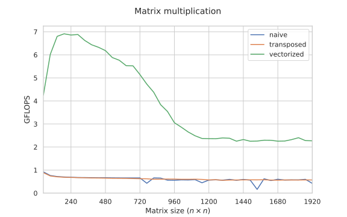
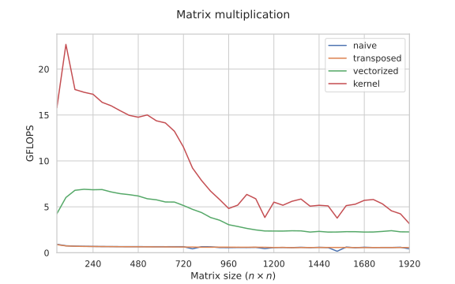
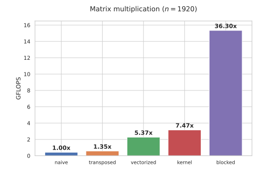

---
tags:
  - 现代硬件算法
  - 算法案例
created: 2026-09-11
source: https://en.algorithmica.org/hpc/algorithms/matmul/
original_title: Matrix Multiplication
---

# 矩阵乘法

在本案例研究中，我们将设计并实现几种矩阵乘法算法。

我们从朴素的"for-for-for"算法出发，逐步改进它，最终得到一个快 50 倍、与 BLAS 库性能相当、且代码不到 40 行 C 的版本。

所有实现都用 GCC 13 编译，并运行在[Zen 2](https://en.wikichip.org/wiki/amd/microarchitectures/zen_2) CPU 上，主频 2GHz。

## 基线

一个 $l \times n$ 矩阵 $A$ 乘以一个 $n \times m$ 矩阵 $B$ 的结果，定义为一个 $l \times m$ 矩阵 $C$，满足：

$$
C_{ij} = \sum_{k=1}^{n} A_{ik} \cdot B_{kj}
$$

为简单起见，我们只考虑*方阵*，即 $l = m = n$。

要实现矩阵乘法，我们可以直接把定义翻译成代码，但我们用一维数组而不是二维数组（即矩阵）来表示，以便显式地控制指针运算：

```c++
void matmul(const float *a, const float *b, float *c, int n) {
    for (int i = 0; i < n; i++)
        for (int j = 0; j < n; j++)
            for (int k = 0; k < n; k++)
                c[i * n + j] += a[i * n + k] * b[k * n + j];
}
```

为了避免之后才显现的原因，我们在基准测试中只使用 48 的倍数的矩阵大小，但实现对于所有其他大小仍然正确。我们也专门使用[[IEEE 754 浮点数.md|32 位浮点数]]，不过所有实现都可以轻松[推广](#推广)到其他数据类型和操作。

用 `g++ -O3 -march=native -ffast-math -funroll-loops` 编译后，该朴素方法对大小为 $n = 1920 = 48 \times 40$ 的两个矩阵做乘法用了约 16.7 秒。换个角度说，这大约是 $\frac{1920^3}{16.7 \times 10^9} \approx 0.42$ 次有用操作每纳秒（GFLOPS），或者说每次乘法约 5 个 CPU 周期，目前看起来还不太理想。

## 转置

一般来说，当优化一个处理海量数据的算法时——而 $1920^2 \times 3 \times 4 \approx 42$ MB 显然是个海量，因为它放不进任何一层[[RAM与CPU缓存.md|CPU 缓存]]——你应该总是先从内存入手，再去优化算术，因为它更可能成为瓶颈。

字段 $C_{ij}$ 可以看作矩阵 $A$ 的第 $i$ 行与矩阵 $B$ 的第 $j$ 列的dot product（点积）。当我们在上面的内层循环中递增 `k` 时，我们是顺序读取矩阵 `a`，但在遍历 `b` 的一列时，我们要跳过一个 $n$ 个元素，这比顺序迭代[[AoS 与 SoA.md|要慢]]。

一个[[缓存无关算法.md#算法|众所周知的]]优化是：把矩阵 $B$ 存成*列主序*——或者，在矩阵乘法之前先把它*转置*。这需要 $O(n^2)$ 次额外操作，但能保证最内层循环的顺序读取：

<!--


-->

```c++
void matmul(const float *a, const float *_b, float *c, int n) {
    float *b = new float[n * n];

    for (int i = 0; i < n; i++)
        for (int j = 0; j < n; j++)
            b[i * n + j] = _b[j * n + i];
    
    for (int i = 0; i < n; i++)
        for (int j = 0; j < n; j++)
            for (int k = 0; k < n; k++)
                c[i * n + j] += a[i * n + k] * b[j * n + k]; // <- note the indices
}
```

这段代码运行约 12.4s，也就是快了约 30%。

正如我们稍后会看到的，转置还有比顺序内存读取更重要的好处。

## 向量化

既然我们现在所做的只是顺序读取 `a` 和 `b` 的元素、把它们相乘、再把结果加到一个累加器变量上，我们就可以用[[SIMD并行.md|SIMD]]指令来加速这一切。用[[内建函数与向量类型.md#指令参考|GCC 向量类型]]来实现相当直接——我们可以[[对齐与填充.md|内存对齐]]矩阵行、用零填充，然后像计算任何其他[[归约.md]]那样计算乘-加：

```c++
// a vector of 256 / 32 = 8 floats
typedef float vec __attribute__ (( vector_size(32) ));

// a helper function that allocates n vectors and initializes them with zeros
vec* alloc(int n) {
    vec* ptr = (vec*) std::aligned_alloc(32, 32 * n);
    memset(ptr, 0, 32 * n);
    return ptr;
}

void matmul(const float *_a, const float *_b, float *c, int n) {
    int nB = (n + 7) / 8; // number of 8-element vectors in a row (rounded up)

    vec *a = alloc(n * nB);
    vec *b = alloc(n * nB);

    // move both matrices to the aligned region
    for (int i = 0; i < n; i++) {
        for (int j = 0; j < n; j++) {
            a[i * nB + j / 8][j % 8] = _a[i * n + j];
            b[i * nB + j / 8][j % 8] = _b[j * n + i]; // <- b is still transposed
        }
    }

    for (int i = 0; i < n; i++) {
        for (int j = 0; j < n; j++) {
            vec s{}; // initialize the accumulator with zeros

            // vertical summation
            for (int k = 0; k < nB; k++)
                s += a[i * nB + k] * b[j * nB + k];
            
            // horizontal summation
            for (int k = 0; k < 8; k++)
                c[i * n + j] += s[k];
        }
    }

    std::free(a);
    std::free(b);
}
```

对于 $n = 1920$，性能现在约为 2.3 GFLOPS——相比转置但未向量化的版本又高出了约 4 倍。



这个优化看起来既不复杂，也不专属于矩阵乘法。为什么编译器不能自己[[自动向量化与 SPMD.md|自动向量化]]内层循环呢？

它其实可以；唯一阻止它的是 `c` 可能与 `a` 或 `b` 重叠的可能性。为了排除这一点，你可以向编译器保证 `c` 不与任何东西[[契约式编程.md#算术|别名]]，方法是给它加上 `__restrict__` 关键字：

<!-- (the compiler already knows that reading `a` and `b` is safe in any order because they are marked as `const`): -->

```c++
void matmul(const float *a, const float *_b, float * __restrict__ c, int n) {
    // ...
}
```

手动向量化和自动向量化的实现表现大致相同。

<!--

The performance is bottlenecked by using a single variable. We could use multiple variables similar to other reductions, but we will solve it later anyway.

-->

## 内存效率

有趣的是，实现的效率取决于问题规模。

起初，性能（定义为每秒有用操作数）随着循环管理和水平归约的开销减小而上升。然后，在 $n=256$ 左右，它开始平滑下降，因为矩阵开始放不进[[RAM与CPU缓存.md|缓存]]（$2 \times 256^2 \times 4 = 512$ KB 是 L2 缓存的大小），性能转而受[[内存带宽.md|内存带宽]]制约。



同样有趣的是，朴素实现大体上与未向量化的转置版本持平——甚至略好一点，因为它不需要做转置。

有人可能会认为，由于我们要取的缓存行更少，顺序读取会带来某种整体性能提升，但事实并非如此：取 `b` 的第一列确实花更多时间，但接下来的 15 列读取会与第一列处于相同的缓存行中，因此它们无论如何都会被缓存——除非矩阵大到连 `n * cache_line_size` 字节都放不进缓存，而这对任何实际矩阵大小都不会发生。

相反，性能只会在少数特定矩阵大小上恶化，这是由于[[缓存关联度.md|缓存关联度]]的影响：当 $n$ 是一个大 2 的幂的倍数时，我们取的 `b` 的地址很可能都映射到同一个缓存行，这会降低有效缓存大小。这就解释了 $n = 1920 = 2^7 \times 3 \times 5$ 时的 30% 性能下降，而你还能看到 $1536 = 2^9 \times 3$ 时更明显的下降：它比 $n=1535$ 慢了约 3 倍。

所以，反直觉的是，转置矩阵对缓存并没有帮助——而且在朴素标量实现中，我们其实根本不受内存带宽制约。但我们的向量化实现无疑是受制约的，所以让我们着手改善它的 I/O 效率。

## 寄存器复用

用类似 Python 的记号来指代子矩阵：要计算单元 $C[x][y]$，我们需要计算 $A[x][:]$ 和 $B[:][y]$ 的点积，这需要取 $2n$ 个元素，即使我们把 $B$ 存成列主序。

<!-- Any two cells of A and B are used to update some cell of C. -->

要计算 $C[x:x+2][y:y+2]$（$C$ 的一个 $2 \times 2$ 子矩阵），我们需要 $A$ 的两行和 $B$ 的两列，即 $A[x:x+2][:]$ 和 $B[:][y:y+2]$，总共包含 $4n$ 个元素，用来更新*四个*单元而不是*一个*——就 I/O 效率而言这好 $\frac{2n / 1}{4n / 4} = 2$ 倍。

<!--

To actually avoid reading more data, we need to read these $2+2$ rows and columns in parallel and update all $2 \times 2$ cells at once using all possible combinations of products.

-->

为了避免多次取同一份数据，我们需要并行遍历这些行和列，并计算 $2 \times 2$ 全部可能的乘积组合。下面是一个概念验证：

```c++
void kernel_2x2(int x, int y) {
    int c00 = 0, c01 = 0, c10 = 0, c11 = 0;

    for (int k = 0; k < n; k++) {
        // read rows
        int a0 = a[x][k];
        int a1 = a[x + 1][k];

        // read columns
        int b0 = b[k][y];
        int b1 = b[k][y + 1];

        // update all combinations
        c00 += a0 * b0;
        c01 += a0 * b1;
        c10 += a1 * b0;
        c11 += a1 * b1;
    }

    // write the results to C
    c[x][y]         = c00;
    c[x][y + 1]     = c01;
    c[x + 1][y]     = c10;
    c[x + 1][y + 1] = c11;
}
```

我们现在可以简单地对这个 $C$ 的所有 2x2 子矩阵调用这个 kernel，但我们懒得去评估它：尽管这个算法在 I/O 操作上更优，它仍然打不过我们的基于 SIMD 的实现。相反，我们将直接扩展这个思路，并立刻开发一个类似的*向量化* kernel。

<!-- It also boosts instruction-level parallelism (we don't have to wait between iterations to update the loop state) and saves some cycles from executing the read instructions.

Of course, although better in terms of I/O, this $2 \times 2$ update would not beat our vectorized implementation, so we are not going to try this version in particular and instead will scale the idea right away.

-->

## 设计 kernel

我们不直接设计一个从头计算 $C$ 的一个 $h \times w$ 子矩阵的 kernel，而是声明一个函数，用它来*更新*该子矩阵——所用的是 $A$ 的第 $l$ 到 $r$ 列，以及 $B$ 的第 $l$ 到 $r$ 行。目前这看似过度泛化，但这个函数接口之后会派上用场。

<!--

We follow this approach and design a general kernel that updates a $h \times w$ submatrix of C using columns from $l$ to $r$ of $A$ and rows from $l$ to $r$ of $B$ (i.e., not a full computation, but only a partial update — it will be clear why later). 

-->

要确定 $h$ 和 $w$，我们有如下几个性能上的考量：

- 一般来说，要计算一个 $h \times w$ 子矩阵，我们需要取 $2 \cdot n \cdot (h + w)$ 个元素。为了优化 I/O 效率，我们希望 $\frac{h \cdot w}{h + w}$ 这个比值尽量高，而这通过大而接近方形的子矩阵可以实现。
- 我们希望使用所有现代 x86 架构上都有的 [FMA](https://en.wikipedia.org/wiki/FMA_instruction_set)（"乘加融合"，fused multiply-add）指令。顾名思义，它一次性对 8 元素向量执行 `c += a * b` 操作——这正是点积的核心——让我们可以省去分别执行向量乘法和加法。
- 为了更好地利用这条指令，我们希望发挥[[指令级并行.md|指令级并行]]。在 Zen 2 上，`fma` 指令的延迟为 5、吞吐为 2，这意味着我们需要并发执行至少 $5 \times 2 = 10$ 条才能喂满它的执行端口。
- 我们希望避免寄存器溢出（把数据在寄存器和内存之间搬来搬去超过必要）。我们只有 $16$ 个逻辑向量寄存器可以作为累加器使用（再减去那些需要用来保存临时值的）。

出于这些原因，我们选定一个 $6 \times 16$ 的 kernel。这样我们一次处理 $96$ 个元素，它们存放在 $6 \times 2 = 12$ 个向量寄存器中。为了高效地更新它们，我们使用如下过程：

<!--

We [broadcast](/hpc/simd/moving/#broadcast) an element of A, and then use it to update the first row ($8 + 8$ elements). Then we load the one below it, and so on. When we have updated the last row, we move to the next $6$ elements to the right.

The final implementation is simpler than it sounds:

-->

```c++
// update 6x16 submatrix C[x:x+6][y:y+16]
// using A[x:x+6][l:r] and B[l:r][y:y+16]
void kernel(float *a, vec *b, vec *c, int x, int y, int l, int r, int n) {
    vec t[6][2]{}; // will be zero-filled and stored in ymm registers

    for (int k = l; k < r; k++) {
        for (int i = 0; i < 6; i++) {
            // broadcast a[x + i][k] into a register
            vec alpha = vec{} + a[(x + i) * n + k]; // converts to a broadcast
            // multiply b[k][y:y+16] by it and update t[i][0] and t[i][1]
            for (int j = 0; j < 2; j++)
                t[i][j] += alpha * b[(k * n + y) / 8 + j]; // converts to an fma
        }
    }

    // write the results back to C
    for (int i = 0; i < 6; i++)
        for (int j = 0; j < 2; j++)
            c[((x + i) * n + y) / 8 + j] += t[i][j];
}
```

我们需要 `t`，这样编译器就会把这些元素放在向量寄存器里。我们其实可以直接更新它们在 `c` 中的最终目的地，但遗憾的是，编译器会把它们重新写回内存，导致变慢（用 `__restrict__` 关键字把所有东西包起来也无济于事）。

在把这些循环展开、并把 `b` 提到 `i` 循环之外（`b[(k * n + y) / 8 + j]` 不依赖于 `i`，可以只加载一次并在全部 6 次迭代中复用）之后，编译器生成的东西更类似这样：

<!-- /hpc/simd/intrinsics/#simd-intrinsics -->

```c++
for (int k = l; k < r; k++) {
    __m256 b0 = _mm256_load_ps((__m256*) &b[k * n + y];
    __m256 b1 = _mm256_load_ps((__m256*) &b[k * n + y + 8];
    
    __m256 a0 = _mm256_broadcast_ps((__m128*) &a[x * n + k]);
    t00 = _mm256_fmadd_ps(a0, b0, t00);
    t01 = _mm256_fmadd_ps(a0, b1, t01);

    __m256 a1 = _mm256_broadcast_ps((__m128*) &a[(x + 1) * n + k]);
    t10 = _mm256_fmadd_ps(a1, b0, t10);
    t11 = _mm256_fmadd_ps(a1, b1, t11);

    // ...
}
```

我们用了 $12+3=15$ 个向量寄存器，总共 $6 \times 3 + 2 = 20$ 条指令来执行 $16 \times 6 = 96$ 次更新。假设没有其他瓶颈，我们应该能达到 `_mm256_fmadd_ps` 的吞吐。

注意这个 kernel 是特定于架构的。如果我们没有 `fma`、或者它的吞吐/延迟不同、或者 SIMD 宽度是 128 或 512 位，我们就会做出不同的设计选择。多平台 BLAS 实现发布了[许多 kernel](https://github.com/xianyi/OpenBLAS/tree/develop/kernel)，每个都是手写汇编并针对特定架构优化。

实现的其余部分很直接。类似于之前的向量化实现，我们只是把矩阵搬到内存对齐的数组里，并调用这个 kernel 而非最内层循环：

```c++
void matmul(const float *_a, const float *_b, float *_c, int n) {
    // to simplify the implementation, we pad the height and width
    // so that they are divisible by 6 and 16 respectively
    int nx = (n + 5) / 6 * 6;
    int ny = (n + 15) / 16 * 16;
    
    float *a = alloc(nx * ny);
    float *b = alloc(nx * ny);
    float *c = alloc(nx * ny);

    for (int i = 0; i < n; i++) {
        memcpy(&a[i * ny], &_a[i * n], 4 * n);
        memcpy(&b[i * ny], &_b[i * n], 4 * n); // we don't need to transpose b this time
    }

    for (int x = 0; x < nx; x += 6)
        for (int y = 0; y < ny; y += 16)
            kernel(a, (vec*) b, (vec*) c, x, y, 0, n, ny);

    for (int i = 0; i < n; i++)
        memcpy(&_c[i * n], &c[i * ny], 4 * n);
    
    std::free(a);
    std::free(b);
    std::free(c);
}
```

这改进了基准性能，但只提升了约 40%：


在更小的数组上加速比更高（2–3 倍），说明仍然存在内存带宽问题：



现在，如果你读过[[缓存无关算法.md|缓存无关算法]]那一节，你会知道这类问题的一个通用解法是：把所有矩阵分成四部分，执行八次递归的分块矩阵乘法，再把结果仔细合并起来。这个解法的实际表现尚可，但[[函数与递归.md|递归有开销]]，而且它也不允许我们精细调优算法，所以我们将采用另一种更简单的方法。

## 分块

分治技巧在缓存感知层面的对应物是*缓存分块*（cache blocking）：把数据切分成能放进缓存的块，并逐个处理。如果我们有不止一层缓存，就可以做分层分块：先选一个能放进 L3 缓存的数据块，再把它分成能放进 L2 缓存的块，依此类推。这种方法需要预先知道缓存大小，但它通常更容易实现，而且实践中也更快。

用矩阵做缓存分块不像数组那样简单，但大致思路如下：

- 选一个能放进 L3 缓存的 $B$ 的子矩阵（比如它的一组列）。
- 选一个能放进 L2 缓存的 $A$ 的子矩阵（比如它的一组行）。
- 选一个上面所选 $B$ 的子矩阵的子矩阵（它的一组行），能放进 L1 缓存。
- 用 kernel 更新 $C$ 的相关子矩阵。

这里是 Jukka Suomela 做的一个很好的[可视化](https://jukkasuomela.fi/cache-blocking-demo/)（它展示了许多不同的方法；你感兴趣的是最后一个）。

注意，一开始就从矩阵 $B$ 入手这个决定并非随意。在 kernel 执行期间，我们读取 $A$ 的元素比读取 $B$ 的元素慢得多：我们只取并广播 $A$ 的一个元素，然后用它乘以 $B$ 的 16 个元素。因此，我们希望 $B$ 位于 L1 缓存中，而 $A$ 可以留在 L2 缓存中，而不是反过来。

这听起来很复杂，但我们只需再加三个外层 `for` 循环就能实现，它们合起来被称为*宏 kernel*（而那个更新 6x16 子矩阵的高度优化的底层函数则被称为*微 kernel*）：

```c++
const int s3 = 64;  // how many columns of B to select
const int s2 = 120; // how many rows of A to select 
const int s1 = 240; // how many rows of B to select

for (int i3 = 0; i3 < ny; i3 += s3)
    // now we are working with b[:][i3:i3+s3]
    for (int i2 = 0; i2 < nx; i2 += s2)
        // now we are working with a[i2:i2+s2][:]
        for (int i1 = 0; i1 < ny; i1 += s1)
            // now we are working with b[i1:i1+s1][i3:i3+s3]
            // and we need to update c[i2:i2+s2][i3:i3+s3] with [l:r] = [i1:i1+s1]
            for (int x = i2; x < std::min(i2 + s2, nx); x += 6)
                for (int y = i3; y < std::min(i3 + s3, ny); y += 16)
                    kernel(a, (vec*) b, (vec*) c, x, y, i1, std::min(i1 + s1, n), ny);
```

缓存分块彻底消除了内存瓶颈：



性能不再（显著）受问题规模影响：


注意 $1536$ 处的凹陷仍在：缓存关联度仍然影响性能。为了缓解这一点，我们可以调整步长常数，或在布局中插入空洞，但我们目前懒得去做。

## 优化

要更接近性能极限，我们还需要更多优化：

- 去掉内存分配，直接操作传给函数的数组。注意我们不需要对 `a` 做任何事，因为我们一次只读取一个元素；而对于 `c`，由于很少用到，我们可以用一个[[数据搬移.md#数据搬移|未对齐]]的 `store`，所以我们唯一关心的是读取 `b`。
- 去掉 `std::min`，使大小参数（基本上）成为常数，从而能被编译器嵌入机器码（这也让它[[循环与条件分支.md|展开]]微 kernel 循环更高效，并避免运行时检查）。
- 用手写方式重写微 kernel，使用 12 个向量变量（编译器似乎难以把它们留在寄存器中，而是先把它们写到临时内存位置，最后才写到 $C$）。

这些优化都很直接，但实现起来相当繁琐，所以我们不打算在文章中列出[代码](https://github.com/sslotin/amh-code/blob/main/matmul/v5-unrolled.cc)。要有效支持"奇怪"的矩阵大小还需要更多工作，这也是为什么我们只对 48 = $\frac{6 \cdot 16}{\gcd(6, 16)}$ 的倍数的大小运行基准测试。

<!--

Effectively supporting weird sizes requires a bit more work, and this is the reason why we benchmarked at an array sizes that are divisible by $48 = \frac{6 \cdot 16}{\gcd(6, 16)}$. We leave the code out, because the change is large and tedious and involves slightly modifying the benchmarking code itself. It is straightforward, but we only implement the version for this particular size, whithout any safety checks. Cheating on the benchmark.

But avoiding moving anything pays off. 

-->

这些各自微小的改进叠加在一起，又带来了 50% 的提升：


我们实际上离理论性能极限已经不远了——它可以被计算为 SIMD 宽度乘以 `fma` 指令吞吐乘以时钟频率：

$$
\underbrace{8}_{SIMD} \cdot \underbrace{2}_{thr.} \cdot \underbrace{2 \cdot 10^9}_{cycles/sec} = 32 \; GFLOPS \;\; (3.2 \cdot 10^{10})
$$

与某个实用库（比如 [OpenBLAS](https://www.openblas.net/)）比较更有代表性。最偷懒的办法就是直接[[编程语言.md#编译型语言|从 NumPy 调用矩阵乘法]]。Python 可能会带来一些微小开销，但它最终达到了理论极限的 80%，这看起来是合理的（20% 的开销可以接受：矩阵乘法并不是 CPU 唯一要做的事）。


我们已经达到了约 93% 的 BLAS 性能和约 75% 的理论性能极限，对于一个本质只有 40 行 C 的东西来说，这真的非常出色。

有趣的是，在假设我们身处 2050 年、使用 GCC 35 版（它终于不再搞砸寄存器溢出了）的前提下，整件事可以浓缩成一个深度嵌套的 `for` 循环，并且达到 BLAS 级别的性能：

```c++
for (int i3 = 0; i3 < n; i3 += s3)
    for (int i2 = 0; i2 < n; i2 += s2)
        for (int i1 = 0; i1 < n; i1 += s1)
            for (int x = i2; x < i2 + s2; x += 6)
                for (int y = i3; y < i3 + s3; y += 16)
                    for (int k = i1; k < i1 + s1; k++)
                        for (int i = 0; i < 6; i++)
                            for (int j = 0; j < 2; j++)
                                c[x * n / 8 + i * n / 8 + y / 8 + j]
                                += (vec{} + a[x * n + i * n + k])
                                   * b[n / 8 * k + y / 8 + j];
```

还有一种执行渐近更少算术操作的方法——[[缓存无关算法.md#分析|Strassen 算法]]——但它有一个很大的常数因子，而且只对[非常大的矩阵](https://arxiv.org/pdf/1605.01078.pdf)（$n > 4000$）才高效，而在那种规模下我们通常本就得用多进程或者某些近似降维方法。

## 推广

FMA 也支持 64 位浮点数，但不支持整数：你需要分别执行加法和乘法，这会导致性能下降。如果你能保证所有中间结果都能被精确表示为 32 或 64 位浮点数（这[[舍入误差.md|常常是成立的]]），那么直接把它们和浮点数相互转换可能更快。

这个方法也可以应用于一些看起来类似的计算。一个例子是定义为如下形式的"min-plus 矩阵乘法"：

$$
(A \circ B)_{ij} = \min_{1 \le k \le n} (A_{ik} + B_{kj})
$$

由于它的图论解释，它也被称为"距离积"：当它作用于自身 $(D \circ D)$ 时，结果就是在一个由边权矩阵 $D$ 给出的全连接加权图中，所有顶点对之间长度为 2 的最短路径矩阵。

距离积的一个妙处是，如果我们迭代这一过程并计算

$$
D_2 = D \circ D \\
D_4 = D_2 \circ D_2 \\
D_8 = D_4 \circ D_4 \\
\ldots
$$

……我们就可以在 $O(\log n)$ 步内求出所有点对最短路径：

```c++
for (int l = 0; l < logn; l++)
    for (int i = 0; i < n; i++)
        for (int j = 0; j < n; j++)
            for (int k = 0; k < n; k++)
                d[i][j] = min(d[i][j], d[i][k] + d[k][j]);
```

这需要 $O(n^3 \log n)$ 次操作。如果我们以特定顺序执行这些"两边松弛"，就可以只用一趟完成，这就是众所周知的 [Floyd-Warshall 算法](https://en.wikipedia.org/wiki/Floyd%E2%80%93Warshall_algorithm)：

```c++
for (int k = 0; k < n; k++)
    for (int i = 0; i < n; i++)
        for (int j = 0; j < n; j++)
            d[i][j] = min(d[i][j], d[i][k] + d[k][j]);
```

有趣的是，类似地对距离积做向量化、并迭代执行 $O(\log n)$ 次（[或者可能更少](https://arxiv.org/pdf/1904.01210.pdf)），总共 $O(n^3 \log n)$ 次操作，比朴素地执行 $O(n^3)$ 次操作的 Floyd-Warshall 算法更快，尽管快得不多。

作为练习，试着加速这个"for-for-for"计算。它比矩阵乘法情形更难，因为现在迭代之间存在逻辑依赖，你需要以特定顺序执行更新，但仍然可能设计出[一个类似的 kernel 和分块迭代顺序](https://github.com/sslotin/amh-code/blob/main/floyd/blocked.cc)，实现 30–50 倍的总加速。

## 致谢

最终的算法最初由 Kazushige Goto 设计，它是 GotoBLAS 和 OpenBLAS 的基础。作者本人在"[Anatomy of High-Performance Matrix Multiplication](https://www.cs.utexas.edu/~flame/pubs/GotoTOMS_revision.pdf)"一文中对它做了更详细的阐述。

叙述风格受 Jukka Suomela 的"[Programming Parallel Computers](http://ppc.cs.aalto.fi/)"课程启发，该课程在[加速距离积](http://ppc.cs.aalto.fi/ch2/)上也有一个类似的案例研究。
