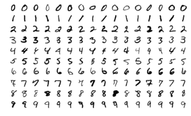

---
tags:
  - 现代硬件算法
  - 算法案例
created: 2026-09-11
source: https://en.algorithmica.org/hpc/algorithms/logistic/
original_title: Optimizing Logistic Regression
---

# 逻辑回归的优化

在机器学习中，也许最流行的黑盒分类方式就是逻辑回归。

假设我们想把 $28 \times 28$ 的黑白数字图片分到 10 个类别（0..9）之一：



在计算上，它的工作方式如下。如果我们处理的是 $n$ 维数据，需要把它分到 $m$ 个类别之一，那么就把输入向量乘以一个大小为 $n \times m$ 的参数矩阵，然后对输出 $m$ 元向量施加一个特殊的"softmax"函数：

$$
softmax(x)\_k = \frac{e^{x_k}}{\sum_i^m e_{x_i}}
$$

换句话说，这个函数所做的，是对输入向量逐元素地取指数，然后归一化，使各元素之和为 1。由于输出有 $m$ 个正元素且之和为 1，它可以被当作样本属于某一类别的概率分布。然后我们可以查看概率最高的预测，并将其作为模型的答案。

我们看着一个大型的样本数据集，并拟合我们的参数矩阵，使我们得到尽量多的正确答案。我们不会深入讨论如何拟合它，但一旦完成，我们就需要对它做*推理*，也就是把新数据喂给它并得到预测。

这基本就是性能工程师需要了解的关于机器学习的全部内容。目前，我们只关心计算方面的问题。

```c++
float w[10][28*28];
// 796 x 10
int predict(float a) {
    float s[10] = {0};

    for (int k = 0; k < 10; k++)
        for (int i = 0; i < 28*28; i++)
            s[k] += a[i] * w[k][i];

    // there is not problem with calculating exponent of small numbers,
    // but exponent of large numbers may overflow
    int mx = *std::max_element(s, s + 10);
    float sumexp = 0;
    for (int i = 0; i < 10; i++) {
        s[i] = exp(s[i] - mx);
        sumexp += s[i];
    }

    int argmax = 0;
    
    for (int i = 0; i < 10; i++) {
        s[i] /= sumexp;
        if (s[i] > s[argmax])
            argmax = i;
    }

    return argmax;
}
```

这其实不值得优化，因为毕竟只有约 10k 次操作，但我们的用例可能更大。例如，神经网络在本质上并没有不同：它们只是用了更长的变换链，而不仅仅是矩阵乘法后接一个 softmax。

这也可以用在热点上。例如，国际象棋程序用类似的模型来确定某个局面的价值（获胜概率）。顺便说一句，这就是"1-3-3-5-9"启发式方法的由来：你可以在一个大型国际象棋局面数据集上训练逻辑回归，这些局面被转化为子力差，而权重就会长成那个样子。其他游戏中的评分也是类似的工作方式。

我们首先能注意到的是，我们实际上并不需要实现 softmax，因为我们可以注意到最大的 logit（这是 softmax 之前那些数的称呼）在 softmax 之后仍然最大，所以我们只需要在矩阵乘法之后取 argmax 即可。

没有哪个头脑正常的人会用 C++ 来训练机器学习模型。

### 量化

机器学习是那种既不需要范围也不需要精度的场景之一。机器学习的全部意义在于学习对数据中的小扰动具有鲁棒性的函数。输入数据本身就有噪声，那我们的计算为什么不能也有噪声呢？何况误差应当会相互抵消。我们还可以强制让矩阵参数处于某个特定范围内。

使用更低精度有两个好处：

1. 取数据所花的时间更少。
2. 我们可以使用能打包更多值的 SIMD 指令。

```c++
char w[10][28*28];

int predict(char a) {
    short max = 0, argmax = 0;

    for (int k = 0; k < 10; k++) {
        short s = 0;
        for (int i = 0; i < 28*28; i++)
            s += a[i] * w[k][i];
        if (s > max)
            s = 0, argmax = k;
    }

    return argmax;
}
```
