---
tags:
  - 现代硬件算法
  - 数据结构案例
created: 2026-09-11
source: https://en.algorithmica.org/hpc/data-structures/binary-search/
original_title: Binary Search
---

# 二分查找

<!-- mention interpolation search and radix trees? -->

尽管提升面向用户的程序速度是性能工程的终极目标，但人们并不会真的为某些数据库里 5–10% 的改进而兴奋。是的，这正是软件工程师的薪水所在，但这类优化往往过于精细且系统相关，难以轻易推广到其它软件。

相反，性能工程最迷人的展示，是对教科书算法的多重优化：那些人人都知道、且被认为简单到根本不会有人想到去优化它们的算法。这些优化简单且具启发性，也完全可以被用到别处。而且它们出奇地并不像你想的那么罕见。

<!-- Yet, with remarkable periodicity, these can be optimized to ridiculous levels of performance. -->

在本节中，我们聚焦这样一个基础算法——*二分查找*——并实现它的两个变体，视问题规模不同，比 `std::lower_bound` 快至多 4 倍，而代码不到 15 行。

第一个算法通过去掉[[分支的代价.md|分支]]来实现这一点，第二个则同时优化内存布局以取得更好的[[RAM与CPU缓存.md|缓存系统]]性能。后者严格来说已不能当作 `std::lower_bound` 的直接替代品，因为它需要先对数组元素做置换才能开始回答查询——但我回想不起太多"拿到一个有序数组却花不起线性时间做预处理"的场景。

<!--

- *Branchless binary search* that is up to 3x faster on *small* arrays and can act as a drop-in replacement to `std::lower_bound`.
- *Eytzinger binary search* that rearranges the elements of a sorted array in a cache-friendly way of is also 3x faster on small arrays and 2x faster on large arrays.

-->

照例的免责声明：CPU 是 [Zen 2](https://www.7-cpu.com/cpu/Zen2.html)，内存是[[RAM与CPU缓存.md|DDR4-2666]]，我们默认使用的编译器是 Clang 10。你机器上的性能可能不同，所以我强烈建议你[自己去测试](https://godbolt.org/z/14rd5Pnve)。

<!--

It performs slightly worse on array sizes that fit lower layers of cache, but in low-bandwidth environments it can be up to 3x faster (or 7x faster than `std::lower_bound`). GCC sucked on all benchmarks, so we will mostly be using Clang (10.0). The CPU is a Zen 2, although the results should be transferrable to other platforms, including most Arm-based chips.

The CPU is a Zen 2, and as always, the results are a bit architecture dependant, although the results should be transferrable to other platforms, including most Arm-based chips.

This is a large article, which will turn into a multi-hour read. If you feel comfortable reading [intrinsic](/hpc/simd/intrinsics)-heavy code without any context whatsoever, you can skim through the first four implementation and jump straight to the last section.

Build up understanding gradually, but you can skip them.

-->

## 二分查找

<!--

For our benchmark, we create an array of random integers of size `n` and sort it. Then, each implementations can do some preprocessing:

```c++
void prepare(int *a, int n);
int lower_bound(int x);
```

Already sorted array `t` of size `n`.

We are going ot create an array named `a` into array named `t`.

-->

下面是在 `n` 个整数的有序数组 `t` 中，查找第一个不小于 `x` 的元素的标准方法，你在任何一本计算机科学入门教材里都能找到：

```c++
int lower_bound(int x) {
    int l = 0, r = n - 1;
    while (l < r) {
        int m = (l + r) / 2;
        if (t[m] >= x)
            r = m;
        else
            l = m + 1;
    }
    return t[l];
}
```

<!-- We maintain the indices of first and the last element that may be the answer, compare the element the middle to the key `x`, and then shrink the search interval by half depending how the comparison went. Beautiful in its simplicity. -->

找到搜索区间的中间元素，把它与 `x` 比较，把区间减半。简单之中见优美。

`std::lower_bound` 采用了类似的方法，只是它必须更通用，以支持没有随机访问迭代器的容器，因此用的是搜索区间的第一个元素和区间大小，而非两端。为此，[Clang](https://github.com/llvm-mirror/libcxx/blob/78d6a7767ed57b50122a161b91f59f19c9bd0d19/include/algorithm#L4169) 和 [GCC](https://github.com/gcc-mirror/gcc/blob/d9375e490072d1aae73a93949aa158fcd2a27018/libstdc%2B%2B-v3/include/bits/stl_algobase.h#L1023) 的实现都用了下面这个元编程怪物：

```c++
template <class _Compare, class _ForwardIterator, class _Tp>
_LIBCPP_CONSTEXPR_AFTER_CXX17 _ForwardIterator
__lower_bound(_ForwardIterator __first, _ForwardIterator __last, const _Tp& __value_, _Compare __comp)
{
    typedef typename iterator_traits<_ForwardIterator>::difference_type difference_type;
    difference_type __len = _VSTD::distance(__first, __last);
    while (__len != 0)
    {
        difference_type __l2 = _VSTD::__half_positive(__len);
        _ForwardIterator __m = __first;
        _VSTD::advance(__m, __l2);
        if (__comp(*__m, __value_))
        {
            __first = ++__m;
            __len -= __l2 + 1;
        }
        else
            __len = __l2;
    }
    return __first;
}
```

如果编译器成功地去掉了抽象，它会编译成大致相同的机器码，并产生大致相同的平均延迟，而它[[内存延迟.md|如预期般]]随数组大小增长：

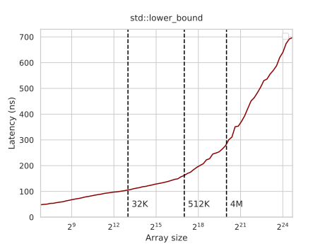

既然大多数人不手写二分查找，我们就用 Clang 的 `std::lower_bound` 作基线。

### 瓶颈

在跳到优化实现之前，先简要讨论一下二分查找为何一开始就很慢。

如果你用 [[统计采样剖析.md|perf]] 跑 `std::lower_bound`，会看到它大部分时间花在一条[[循环与条件分支.md|条件跳转]]指令上：

```nasm
       │35:   mov    %rax,%rdx
  0.52 │      sar    %rdx
  0.33 │      lea    (%rsi,%rdx,4),%rcx
  4.30 │      cmp    (%rcx),%edi
 65.39 │    ↓ jle    b0
  0.07 │      sub    %rdx,%rax
  9.32 │      lea    0x4(%rcx),%rsi
  0.06 │      dec    %rax
  1.37 │      test   %rax,%rax
  1.11 │    ↑ jg     35
```

这个[[现代硬件算法·总览.md|流水线停滞]]阻碍了搜索推进，它主要由两个[[流水线冒险.md|因素]]造成：

- 我们遭受*控制冒险*，因为我们有一个[[分支的代价.md|分支]]无法预测（查询和键是独立随机抽取的），处理器必须暂停 10–15 个周期来冲刷流水线并重新填满，每次分支预测失败都如此。
- 我们遭受*数据冒险*，因为我们必须等前面的比较完成，而比较又等它的某个操作数从内存取回——它可能[[内存延迟.md|要花]] 0 到 300 个周期不等，取决于它在哪里。

现在，让我们试着逐个消除这些障碍。

## 去掉分支

我们可以用[[无分支编程.md|谓词]]替代分支。为了让任务更简单，我们采用 STL 的思路，用搜索区间的第一个元素和大小（而非首尾元素）来重写循环：

```c++
int lower_bound(int x) {
    int *base = t, len = n;
    while (len > 1) {
        int half = len / 2;
        if (base[half - 1] < x) {
            base += half;
            len = len - half;
        } else {
            len = half;
        }
    }
    return *base;
}
```

注意，在每次迭代里，`len` 本质上只是被减半，然后视比较结果要么向下取整要么向上取整。这个有条件的更新似乎没必要；为了避开它，我们可以干脆说它总是向上取整：

```c++
int lower_bound(int x) {
    int *base = t, len = n;
    while (len > 1) {
        int half = len / 2;
        if (base[half - 1] < x)
            base += half;
        len -= half; // = ceil(len / 2)
    }
    return *base;
}
```

这样，我们只需用[[无分支编程.md|条件移动]]更新搜索区间的第一个元素，并在每次迭代把其大小减半：

```c++
int lower_bound(int x) {
    int *base = t, len = n;
    while (len > 1) {
        int half = len / 2;
        base += (base[half - 1] < x) * half; // will be replaced with a "cmov"
        len -= half;
    }
    return *base;
}
```

<!-- pre-compute base pointer for next iteration? -->

注意这个循环并不总是等价于标准二分查找。由于它总是把搜索区间的大小*向上*取整，它访问的元素略有不同，并可能多做一次本不需要的比较。除了简化每次迭代的计算，这也让迭代次数在数组大小固定时为常数，彻底消除了分支预测失败。

正如谓词的典型情况，这个技巧对编译器优化非常脆弱——视编译器和函数调用方式不同，它可能仍留下一个分支，或生成次优代码。它在 Clang 10 上工作良好，在小数组上带来 2.5–3 倍的提升：

<!-- todo: update numbers -->

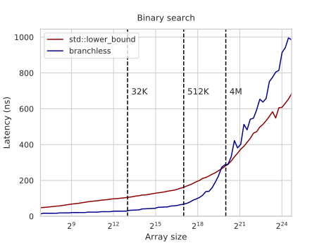

一个有趣的细节是，它在大数据组上表现更差。这看起来奇怪：总延迟由 RAM 延迟主导，而由于它做了与标准二分查找大致相同的内存访问，它应当大致相同甚至略好。

真正该问的问题不是"为什么无分支实现更差"，而是"为什么有分支的版本更好"。原因在于：当有分支时，CPU 可以[[分支的代价.md|推测]]其中一个分支，并在它确认那是否是正确的键之前，就开始取回左键或右键——这实际上充当了隐式[[预取.md]]。

对无分支实现，这不会发生，因为 `cmov` 被当作和普通指令一样处理，分支预测器不会试图窥探它的操作数来预测未来。为了补偿，我们可以在软件里通过显式请求左右子键来预取数据：

```c++
int lower_bound(int x) {
    int *base = t, len = n;
    while (len > 1) {
        int half = len / 2;
        len -= half;
        __builtin_prefetch(&base[len / 2 - 1]);
        __builtin_prefetch(&base[half + len / 2 - 1]);
        base += (base[half - 1] < x) * half;
    }
    return *base;
}
```

<!-- todo: rerun this too -->

有了预取，大数据组上的性能变得大致相同：

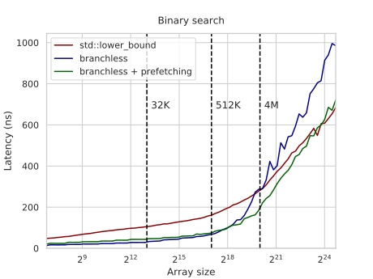

图仍增长得更快，因为有分支的版本还会预取"孙节点""曾孙节点"等等——尽管每次新的推测性读取的用处随预测正确的可能性降低而指数级衰减。

在无分支版本里，我们也可以预取超过一层，但我们需要的取回次数也会指数级增长。相反，我们将尝试一种不同的方法来优化内存操作。

## 优化布局

我们在二分查找期间执行的内存请求形成了一种非常特殊的访问模式：

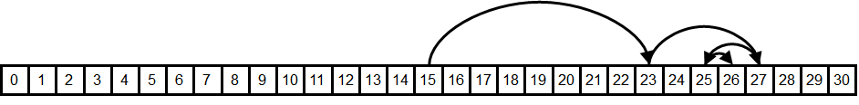

每次请求里的元素被缓存的可能性有多大？它们的[[时空局部性.md|数据局部性]]有多好？

- *空间局部性*对最后 3 到 4 次请求似乎还行，它们很可能在同一[[缓存行.md|缓存行]]上——但之前所有请求都需要巨大的内存跳变。
- *时间局部性*对前十来次请求似乎还行——这种长度的、不同的比较序列没那么多，所以我们会反复与相同的中间元素比较，它们很可能被缓存。

为了说明第二类缓存共享有多重要，我们来试试在搜索区间的元素里*随机*挑每次迭代要比较的元素，而非取中间那个：

```c++
int lower_bound(int x) {
    int l = 0, r = n - 1;
    while (l < r) {
        int m = l + rand() % (r - l);
        if (t[m] >= x)
            r = m;
        else
            l = m + 1;
    }
    return t[l];
}
```

[理论上](#appendix-random-binary-search)，这个随机二分查找预期比正常的多做 30–40% 的比较，但在真实计算机上，运行时间在大数组上增加了约 6 倍：

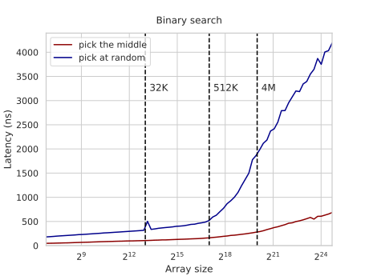

这不只是因为 `rand()` 调用慢。你可以清楚地看到 L2–L3 边界上的那个拐点，在那里内存延迟压过了随机数生成和[[整数除法.md|取模]]。性能退化是因为所有被取回的元素都不太可能被缓存，而不只是其中一小段后缀。

另一个潜在的负面效应是[[缓存关联度.md|缓存关联度]]。如果数组大小是某个大的 2 的幂的倍数，那么这些"热"元素的下标也会能被某些大的 2 的幂整除，并映射到同一个缓存行，互相把对方踢出。例如，在大小为 $2^{20}$ 的数组上二分查找每查询约 ~360ns，而在大小为 $(2^{20} + 123)$ 的数组上约 ~300ns——差了 20%。有[办法](https://en.wikipedia.org/wiki/Fibonacci_search_technique)修复这个问题，但为了不被更紧迫的事分心，我们干脆忽略它：我们用的所有数组大小都形如 $\lfloor 1.17^k \rfloor$（$k$ 为整数），从而任何缓存副作用都不太可能发生。

我们内存布局的真正问题在于，它没有最有效地利用时间局部性，因为它把热元素和冷元素混在一起。例如，我们很可能把元素 $\lfloor n/2 \rfloor$（我们在每次查询最先请求的那个）与 $\lfloor n/2 \rfloor + 1$（我们几乎从不请求的那个）存在同一个缓存行里。

<!--  (sometimes literally never — if it is the first element in a search range of three, and it is indeed the lower bound, we just compare against the middle and deduce it has to be the first element without ever even fetching it) — this is not true -->

下面这张热力图可视化了 31 元素数组上比较的预期频率：

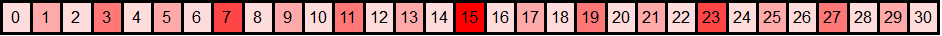

所以，理想情况下，我们想要一种热元素与热元素、冷元素与冷元素分组的内存布局。而如果我们用更缓存友好的方式——通过重新编号——来置换数组，就能做到。我们要用的这种编号其实有半个世纪的历史，而且你很可能已经知道它。

### Eytzinger 布局

**Michaël Eytzinger** 是一位 16 世纪的奥地利贵族，以在谱系学上的工作闻名，尤其是一种称为 *ahnentafel*（德语意为"祖先表"）的祖先编号系统。

在那个年代血统事关重大，但把那些数据写下来很贵。*Ahnentafel* 允许紧凑地展示一个人的谱系，无需画图浪费额外空间。

它按固定的升序序列列出一个人的直系祖先。首先，这个人自己被列为 1 号，然后递归地，对每个编号为 $k$ 的人，其父被列为 $2k$、其母被列为 $(2k+1)$。

这是[保罗一世](https://en.wikipedia.org/wiki/Paul_I_of_Russia)（彼得大帝的曾孙）的例子：

1. 保罗一世
2. 彼得三世（保罗之父）
3. [叶卡捷琳娜二世](https://en.wikipedia.org/wiki/Catherine_the_Great)（保罗之母）
4. 卡尔·弗里德里希（彼得之父，保罗的祖父）
5. 安娜·彼得罗芙娜（彼得之母，保罗的祖母）
6. 克里斯蒂安·奥古斯特（叶卡捷琳娜之父，保罗的外祖父）
7. 约翰娜·伊丽莎白（叶卡捷琳娜之母，保罗的外祖母）

除了紧凑，它还有一些不错的性质，比如所有偶数号的人都是男性、所有奇数号（可能除 1 外）都是女性。人们也可以只凭其后代的性别，就找出某个特定祖先的编号。例如，彼得大帝的血统是保罗一世 → 彼得三世 → 安娜·彼得罗芙娜 → 彼得大帝，所以他的编号应该是 $((1 \times 2) \times 2 + 1) \times 2 = 10$。

**在计算机科学中**，这种编号被广泛用于堆、线段树及其它二叉树结构的隐式（无指针）实现——其中存的不是名字，而是底层数组项。

下面是把这种布局应用到二分查找时的样子：

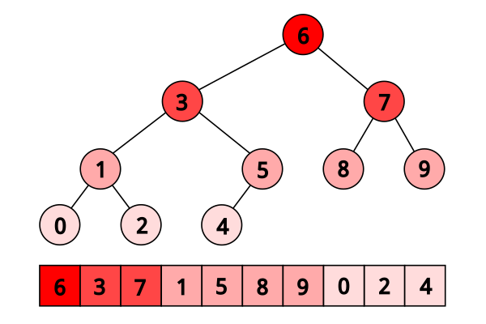

在这个布局里搜索时，我们只需从数组的第一个元素出发，然后在每次迭代根据比较结果跳到 $2 k$ 或 $(2k + 1)$：

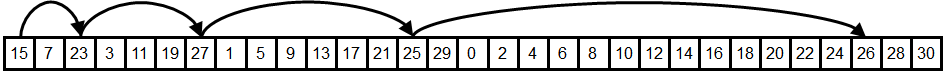

你可以立刻看出它的时间局部性更好（事实上理论上最优），因为越靠近根的元素越靠近数组开头，从而更可能被从缓存取回。

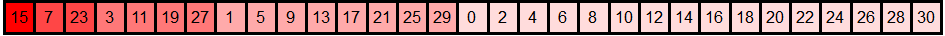

另一种看法是：我们把每个偶数下标的元素写到新数组的末尾，再把剩余元素里每个偶数下标的元素写在它们前面，如此继续，直到把根作为第一个元素放好。

### 构建

要构建 Eytzinger 数组，我们可以做这种偶奇[[寄存器内重排.md#重排与位计数|过滤]] $O(\log n)$ 次——也许这是最快的方法——但为了简洁，我们改为通过遍历原始搜索树来构建：

```c++
int a[n], t[n + 1]; // the original sorted array and the eytzinger array we build
//              ^ we need one element more because of one-based indexing

void eytzinger(int k = 1) {
    static int i = 0; // <- careful running it on multiple arrays
    if (k <= n) {
        eytzinger(2 * k);
        t[k] = a[i++];
        eytzinger(2 * k + 1);
    }
}
```

这个函数取当前节点编号 `k`，递归地写出搜索区间中间元素左边的所有元素，写出我们要与之比较的当前元素，然后递归地写出右边的所有元素。它看起来有点复杂，但要说服自己它有效，你只需要三个观察：

- 它恰好写 `n` 个元素，因为我们只对从 `1` 到 `n` 的每个 `k` 进入 `if` 体一次。
- 它从原数组里顺序写出元素，因为它每次递增 `i` 指针。
- 当我们写节点 `k` 处的元素时，我们已经写好了它左边所有元素（恰好 `i` 个）。

尽管是递归的，它其实相当快，因为所有内存读都是顺序的，而内存写一次只在 $O(\log n)$ 个不同的内存块里。不过维护这个置换在逻辑和计算上都更难维护：往有序数组里加一个元素只需把其后缀右移一位，而 Eytzinger 数组实际上需要整体重建。

注意这种遍历和结果置换并不严格等价于普通二分查找的"树"：例如，左子树可能比右子树大——大到两倍——但这关系不大，因为两种方法都得到相同的 $\lceil \log_2 n \rceil$ 树深。

还要注意 Eytzinger 数组是 1-based 的——这对后面的性能很重要。你可以在第 0 个元素里放入"下界不存在时想返回的值"（类似于 `std::lower_bound` 的 `a.end()`）。

### 搜索实现

我们现在可以只用下标来下行这个数组：我们只需从 $k=1$ 开始，若需向左则执行 $k := 2k$、需向右则 $k := 2k + 1$。我们甚至不再需要存储和重算搜索边界。这种简洁也让我们能避开分支：

```c++
int k = 1;
while (k <= n)
    k = 2 * k + (t[k] < x);
```

唯一的问题出现在我们需要恢复结果元素的下标时，因为 $k$ 并不直接指向它。考虑这个例子（其对应的树列在上面）：

<!--
    array:  0 1 2 3 4 5 6 7 8 9                           
eytzinger:  6 3 7 1 5 8 9 0 2 4                           
1st range:  -------------------  k := 1                    
2nd range:  -------------        k := 2*k     = 2   (6 ≥ 3)
3rd range:  -------              k := 2*k     = 4   (3 ≥ 3)
4th range:      ---              k := 2*k + 1 = 9   (1 < 3)
5th range:        -              k := 2*k + 1 = 19  (2 < 3)
-->

<pre class='center-pre'>
    array:  0 1 2 3 4 5 6 7 8 9                            
eytzinger:  <u>6</u> <u>3</u> 7 <u>1</u> 5 8 9 0 <u>2</u> 4                            
1st range:  ------------?------  k := 2*k     = 2   (6 ≥ 3)
2nd range:  ------?------        k := 2*k     = 4   (3 ≥ 3)
3rd range:  --?----              k := 2*k + 1 = 9   (1 < 3)
4th range:      ?--              k := 2*k + 1 = 19  (2 < 3)
5th range:        !                                        
</pre>

<!-- do we need the last comparison? -->

这里我们查询 $[0, …, 9]$ 的数组，求 $x=3$ 的下界。我们把它与 $6$、$3$、$1$、$2$ 比较，走左-左-右-右，最终得到 $k = 19$，它甚至不是一个合法的数组下标。

技巧在于注意到：除非答案是数组的最后一个元素，否则我们会在某处把 $x$ 与它比较，而在得知它不小于 $x$ 之后，我们恰好向左走一次，然后一直向右直到到达一个叶子（因为我们将只与更小的元素比较）。因此，要恢复答案，我们只需"抵消"若干次右转，再加一次。

这可以通过一个优雅的方式做到：观察到右转记录在 $k$ 的二进制表示里作为 1 位，所以我们只需找到二进制表示中末尾连续 1 的个数，并把 $k$ 右移恰好那么多位再加一。为此，我们可以反转这个数（`~k`）并调用"找第一个置位"指令：

```c++
int lower_bound(int x) {
    int k = 1;
    while (k <= n)
        k = 2 * k + (t[k] < x);
    k >>= __builtin_ffs(~k);
    return t[k];
}
```

我们运行它，然后……嗯，它看起来没*那么*好：

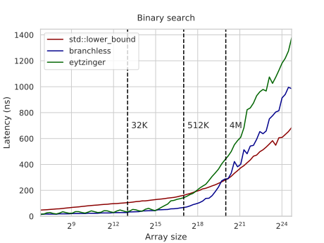

在较小数组上的延迟与无分支二分查找实现不相上下——这不奇怪，因为它只有两行代码——但它开始起飞得早得多。原因是 Eytzinger 二分查找没有得到空间局部性的好处：最后 3–4 个被比较的元素不再在同一缓存行里，我们得分别取回它们。

如果你往深里想，你可能会反对说改善的时间局部性应当能补偿这一点。之前，我们只用了约 $\frac{1}{16}$ 的缓存行来存一个热元素，现在我们用了全部，所以有效缓存大小大了 16 倍，让我们能多覆盖 $\log_2 16 = 4$ 次首请求。

但如果你再想想，你会明白这补偿得不够。缓存另外 15 个元素并非完全无用，而且硬件预取器还能取回我们请求的相邻缓存行。如果这是我们最后的几次请求之一，我们将要读的其余部分很可能已被缓存。所以实际上，最后 6–7 次访问很可能被缓存，而非 3–4 次。

似乎我们切换到这个布局整体上干了件蠢事，但有一种办法能让它值得。

### 预取

为了隐藏内存延迟，我们可以用类似于无分支二分查找的软件预取。但与其为左右子节点分别发两条预取指令，我们可以注意到它们在 Eytzinger 数组里是邻居：一个下标 $2 k$，另一个 $(2k + 1)$，所以它们很可能在同一缓存行，我们只需一条指令。

这个观察可以推广到节点 $k$ 的孙节点——它们也是顺序存储的：

```
2 * 2 * k           = 4 * k
2 * 2 * k + 1       = 4 * k + 1
2 * (2 * k + 1)     = 4 * k + 2
2 * (2 * k + 1) + 1 = 4 * k + 3
```

<!--
\begin{aligned}
   2 \cdot 2 \cdot k       &= 4 \cdot k
\\ 2 \cdot 2 \cdot k + 1   &= 4 \cdot k + 1
\\ 2 \cdot (2 \cdot k) + 1 &= 4 \cdot k + 2
\\ 2 \cdot (2 \cdot k + 1) + 1 &= 4 \cdot k + 3
\end{aligned}
-->

它们的缓存行也可以一条指令取回。有趣……如果我们继续下去，与其取直接子节点，不如预取尽可能多的、能塞进一条缓存行的后代？那会是 $\frac{64}{4} = 16$ 个元素，我们的曾孙节点，下标从 $16k$ 到 $(16k + 15)$。

现在，如果我们只预取这 16 个元素中的一个，我们大概只能得到其中一部分而非全部，因为它们可能跨缓存行边界。我们可以预取第一个*和*最后一个元素，但为了只用一次内存请求，我们需要注意到第一个元素的下标 $16k$ 能被 $16$ 整除，所以它的内存地址将是数组基址加上某个能被 $16 \cdot 4 = 64$（缓存行大小）整除的数。如果数组从一条缓存行开头，那么这 $16$ 个曾孙元素就保证在单一缓存行上，这正是我们所需的。

因此，我们只需[[对齐与填充.md|对齐]]数组：

```c++
t = (int*) std::aligned_alloc(64, 4 * (n + 1));
```

然后在每次迭代预取下标为 $16 k$ 的元素：

```c++
int lower_bound(int x) {
    int k = 1;
    while (k <= n) {
        __builtin_prefetch(t + k * 16);
        k = 2 * k + (t[k] < x);
    }
    k >>= __builtin_ffs(~k);
    return t[k];
}
```

在大数据组上的性能比上一版提升 3–4 倍，比 `std::lower_bound` 约快 2 倍。只多两行代码，不错：

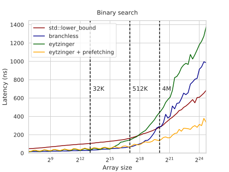

本质上，我们在这里做的是通过预取四步、重叠内存请求来隐藏延迟。理论上，如果计算无关紧要，我们预期约 4 倍加速，但现实中我们得到的加速更温和一些。

我们也可以尝试预取超过那四步，而我们甚至不必用多于一条预取指令：我们可以只请求第一条缓存行，并指望硬件预取其邻居。这个技巧可能改善、也可能不改善实际性能——取决于硬件：

```c++
__builtin_prefetch(t + k * 32);
```

另外，注意最后几次预取请求其实不需要，而且事实上它们甚至可能超出为程序分配的内存区域。在大多数现代 CPU 上，无效的预取指令会变成空操作，所以不是问题，但在某些平台上这可能导致减速，所以把最后的约 4 次迭代从循环里拆出来去掉它们，可能是有意义的。

这个预取技术让我们能多读四个元素，但它并非真的免费——我们实质上是在用额外的内存[[内存带宽.md]]换更低的[[内存延迟.md]]。如果你在独立硬件线程上同时跑多个实例，或在后台跑任何其它内存密集计算，它会显著[[内存共享.md|影响]]基准性能。

但我们可以做得更好。与其一次取四条缓存行，我们可以取少*四倍*的缓存行。在[[静态 B 树.md|下一节]]，我们会探讨这种方法。

<!--

But that was a small detour. Let's get back to optimizing for *large* arrays.

[Part 2](https://algorithmica.org/en/b-tree) explores efficient implementation of implicit static B-trees in bandwidth-constrained environment.

-->

### 去掉最后一个分支

最后一点润色：你注意到 Eytzinger 搜索的颠簸了吗？这不是随机噪声——我们放大看看：

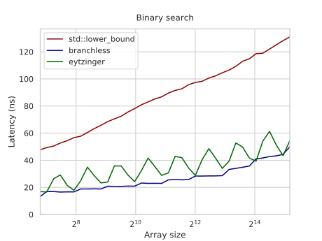

对形如 $1.5 \cdot 2^k$ 的数组大小，延迟高出约 10ns。这些是来自循环自身的、被错误预测的分支——确切地说，是最后一个分支。当数组大小远离 2 的幂时，很难预测循环会做 $\lfloor \log_2 n \rfloor$ 还是 $\lfloor \log_2 n \rfloor + 1$ 次迭代，所以我们有 50% 的概率恰好遭受一次分支预测失败。

一种解决方法是用无穷大把数组填充到最近的 2 的幂，但这浪费内存。相反，我们通过总是执行一个恒定的最小迭代次数、然后用谓词可选地再做一次与某个哑元素的最后比较，来去掉那最后一个分支——该哑元素保证小于 $x$，从而它的比较会被抵消：

```c++
t[0] = -1; // an element that is less than x
iters = std::__lg(n + 1);

int lower_bound(int x) {
    int k = 1;

    for (int i = 0; i < iters; i++)
        k = 2 * k + (t[k] < x);

    int *loc = (k <= n ? t + k : t);
    k = 2 * k + (*loc < x);

    k >>= __builtin_ffs(~k);

    return t[k];
}
```

图现在平滑了，在较小数组上它只比无分支二分查找慢几个周期：

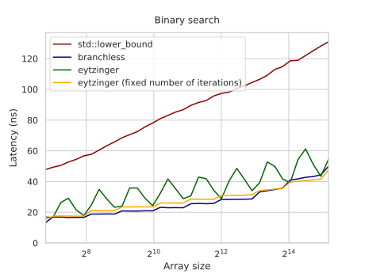

有趣的是，现在 GCC 无法把分支换成 `cmov`，但 Clang 可以。1 比 1。

### 附录：随机二分查找

顺便说，找到随机二分查找精确的预期比较次数，本身就是一个相当有趣的数学问题。先自己试着解解看！

*算法地*计算它的方法是通过动态规划。如果我们记 $f_n$ 为在大小为 $n$ 的搜索区间上找随机下界的预期比较次数，它可以通过考虑所有 $(n - 1)$ 种可能的切分，从之前的 $f_n$ 算出：

$$
f_n = \sum_{l = 1}^{n - 1} \frac{1}{n-1} \cdot \left( f_l \cdot \frac{l}{n} + f_{n - l} \cdot \frac{n - l}{n} \right) + 1
$$

直接套用这个公式给我们一个 $O(n^2)$ 算法，但我们可以通过像这样重排求和来优化它：

$$
\begin{aligned}
f_n &= \sum_{i = 1}^{n - 1} \frac{ f_i \cdot i + f_{n - i} \cdot (n - i) }{ n \cdot (n - 1) } + 1
\\  &= \frac{2}{n \cdot (n - 1)} \cdot \sum_{i = 1}^{n - 1} f_i \cdot i + 1
\end{aligned}
$$

要更新 $f_n$，我们只需计算所有 $i < n$ 的 $f_i \cdot i$ 之和。为此，我们引入两个新变量：

$$
g_n = f_n \cdot n,
\;\;
s_n = \sum_{i=1}^{n} g_n
$$

现在它们可以顺序计算为：

$$
\begin{aligned}
g_n &= f_n \cdot n
     = \frac{2}{n-1} \cdot \sum_{i = 1}^{n - 1} g_i + n
     = \frac{2}{n - 1} \cdot s_{n - 1} + n
\\ s_n &= s_{n - 1} + g_n
\end{aligned}
$$

这样我们得到一个 $O(n)$ 算法，但我们还能做得更好。让我们在 $s_n$ 的更新公式里代入 $g_n$：

$$
\begin{aligned}
s_n &= s_{n - 1} + \frac{2}{n - 1} \cdot s_{n - 1} + n
\\  &= (1 + \frac{2}{n - 1}) \cdot s_{n - 1} + n
\\  &= \frac{n + 1}{n - 1} \cdot s_{n - 1} + n
\end{aligned}
$$

<!-- todo: can we simplify the proof and get rid of r? -->

下一个技巧更复杂。我们这样定义 $r_n$：

$$
\begin{aligned}
r_n &= \frac{s_n}{n}
\\  &= \frac{1}{n} \cdot \left(\frac{n + 1}{n - 1} \cdot s_{n - 1} + n\right)
\\  &= \frac{n + 1}{n} \cdot \frac{s_{n - 1}}{n - 1} + 1
\\  &= \left(1 + \frac{1}{n}\right) \cdot r_{n - 1} + 1
\end{aligned}
$$

我们可以把它代入之前为 $g_n$ 得到的公式：

$$
g_n = \frac{2}{n - 1} \cdot s_{n - 1} + n = 2 \cdot r_{n - 1} + n
$$

回想 $g_n = f_n \cdot n$，我们可以用 $f_n$ 表示 $r_{n - 1}$：

$$
f_n \cdot n = 2 \cdot r_{n - 1} + n
\implies
r_{n - 1} = \frac{(f_n - 1) \cdot n}{2}
$$

最后一步。我们刚用 $r_{n - 1}$ 表达了 $r_n$，又用 $f_n$ 表达了 $r_{n - 1}$。这让我们能用 $f_n$ 表达 $f_{n + 1}$：

$$
\begin{aligned}
&&\quad r_n &= \left(1 + \frac{1}{n}\right) \cdot r_{n - 1} + 1
\\ &\Rightarrow & \frac{(f_{n + 1} - 1) \cdot (n + 1)}{2} &= \left(1 + \frac{1}{n}\right) \cdot \frac{(f_n - 1) \cdot n}{2} + 1
\\ &&&= \frac{n + 1}{2} \cdot (f_n - 1) + 1
\\ &\Rightarrow & (f_{n + 1} - 1) &= (f_{n} - 1) + \frac{2}{n + 1}
\\ &\Rightarrow &f_{n + 1} &= f_{n} + \frac{2}{n + 1}
\\ &\Rightarrow &f_{n} &= f_{n - 1} + \frac{2}{n}
\\ &\Rightarrow &f_{n} &= \sum_{k = 2}^{n} \frac{2}{k}
\end{aligned}
$$

最后一个表达式是[调和级数](https://en.wikipedia.org/wiki/Harmonic_series_(mathematics))的两倍，众所周知当 $n \to \infty$ 时近似于 $\ln n$。因此，随机二分查找会比正常的多做 $\frac{2 \ln n}{\log_2 n} = 2 \ln 2 \approx 1.386$ 次比较。

### 致谢

本文 loosely 基于 Paul-Virak Khuong 和 Pat Morin 的"[Array Layouts for Comparison-Based Searching](https://arxiv.org/pdf/1509.05053.pdf)"。它长达 46 页，更详细地讨论了这些以及许多其它（较不成功的）方法。我也强烈推荐去看看——这是我最喜欢的性能工程论文之一。

感谢 Marshall Lochbaum [提供](https://github.com/algorithmica-org/algorithmica/issues/57)随机二分查找的证明。我自己绝不可能做到。

我也很久以前从某个博客偷来了这些可爱的布局可视化图，但不记得博客名和它用的许可证，而且反向图片搜索也找不到了。如果你不告我，谢谢你，不管你是谁！
