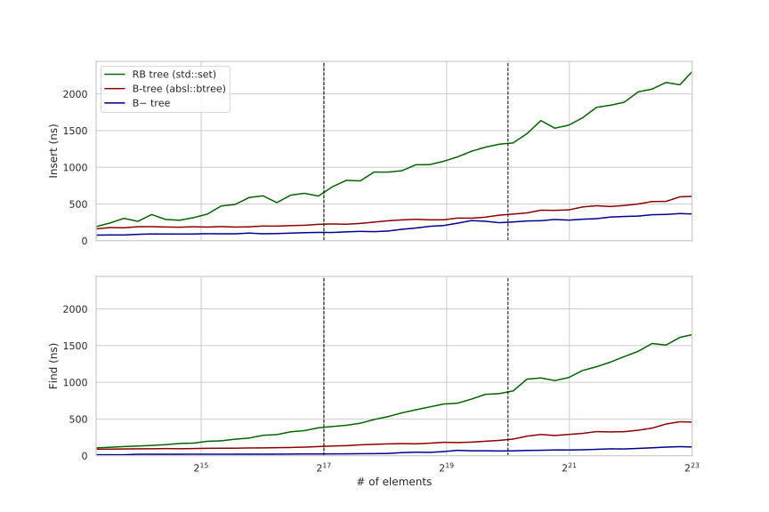
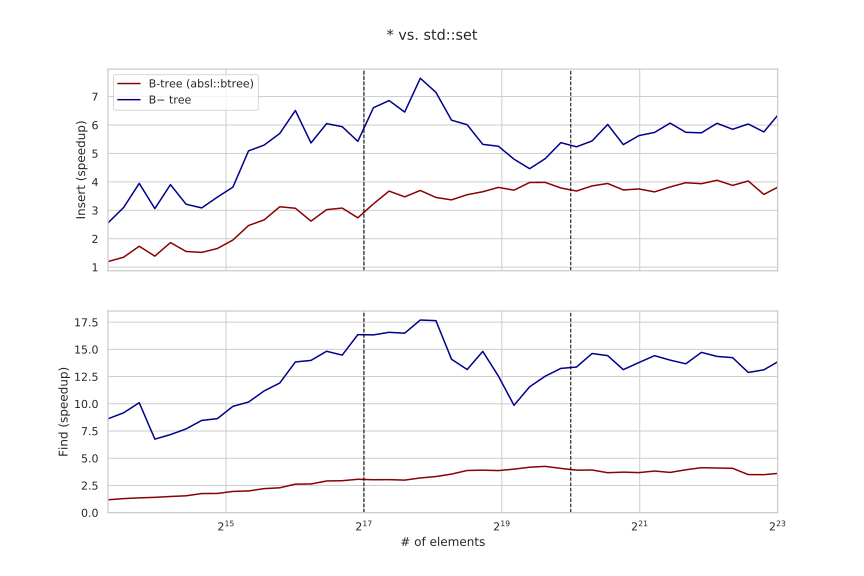
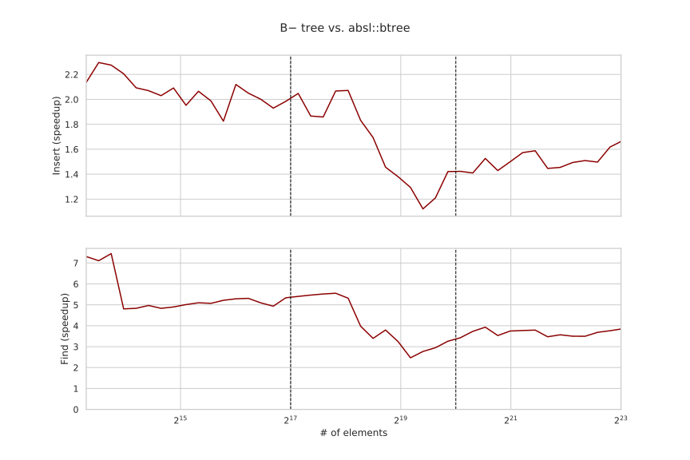

---
tags:
  - 现代硬件算法
  - 数据结构案例
created: 2026-09-11
source: https://en.algorithmica.org/hpc/data-structures/b-tree/
original_title: Search Trees
---

# 搜索树

在[[静态 B 树.md|上一篇文章]]中，我们设计并实现了*静态* B 树，以加速有序数组上的二分查找。在它的[[静态 B 树.md#修改与进一步优化|最后一节]]，我们简要讨论了如何在保留来自[[SIMD并行.md|SIMD]]的性能收益的同时，让它们重新变得*动态*，并通过在 S+ 树的内部节点中加入并跟随显式指针，验证了我们的预测。

在本文中，我们延续这个命题，设计一棵针对整数键、功能最小化的搜索树，对 `lower_bound` 和 `insert` 查询分别取得比 `std::set` 至多 18x/8x、比 [`absl::btree`](https://abseil.io/blog/20190812-btree) 至多 7x/2x 的加速——且仍有充足的改进空间。

该结构对 32 位整数的内存开销约为 30%，最终实现[不到 150 行 C++](https://github.com/sslotin/amh-code/blob/main/b-tree/btree-final.cc)。它可以轻松推广到其它算术类型，以及小的/定长字符串，如哈希、国家代码、股票代码。

<!--

7-18x/3-8x speedup over `std::set` and 3-7x/1.5-2x

that we call *B− tree*

-->

## B− 树

与其它案例研究中那样做小的渐进式改进不同，在本文中我们将只实现一种我们命名为 *B− 树* 的数据结构，它基于[[静态 B 树.md#优化|B+ 树]]，有几点细微差别：

- B− 树中的节点不存指针或任何元数据，除了指向内部节点子节点的指针（而 B+ 树的叶节点存一个指向下一个叶节点的指针）。这让我们可以把键完美地放在叶节点的缓存行上。
- 我们把键 $i$ 定义为子节点 $i$ 子树里的*最大*键，而非子节点 $(i + 1)$ 子树里的*最小*键。这让我们在到达一个叶子后无需再取回任何其它节点（在 B+ 树中，叶节点里所有键都可能小于搜索键，所以我们需要去下一个叶节点取它的第一个元素）。

我们还用了 $B=32$ 的节点大小，比典型的小。它之所以不是 [[静态 B 树.md#与 `std::lower_bound` 的对比|对 S+ 树最优的]] $16$，是因为我们有与取回指针相关的额外开销，而把树高降低约 20% 的好处，超过了每个节点多处理一倍元素的代价；同时也因为它改善了 `insert` 查询的运行时间——该查询平均每 $\frac{B}{2}$ 次插入就要做一次昂贵的节点分裂。

<!--

We will discuss other node sizes later.

This is needed simd to be efficient (we will discuss other node sizes later).

There is some overhead, so it makes sense to use more than one cache line.

Analogous to the B+ tree,

-->

### 内存布局

尽管从软件工程角度看这可能不是最好的方法，我们将简单地把整棵树存进一个大的预分配数组，不区分叶子和内部节点：

```c++
const int R = 1e8;
alignas(64) int tree[R];
```

我们还用无穷大预填这个数组，以简化实现：

```c++
for (int i = 0; i < R; i++)
    tree[i] = INT_MAX;
```

（一般来说，与底层用 `new` 的 `std::set` 或其它结构比较，在技术上算是作弊，但内存分配和初始化并非这里的瓶颈，所以这不显著影响评估。）

两类节点都把它们的键顺序地按有序存好，并由其第一个键在数组里的下标标识：

- 一个叶节点最多有 $(B - 1)$ 个键，但用无穷大填充到 $B$ 个元素。
- 一个内部节点最多有 $(B - 2)$ 个键（填充到 $B$ 个元素）和最多 $(B - 1)$ 个子节点下标（同样填充到 $B$ 个元素）。

这些设计决定并非随意：

- 填充保证叶节点恰好占 2 条缓存行，内部节点恰好占 4 条缓存行。
- 我们特意使用[[指针的替代方案.md|下标而非指针]]，以节省缓存空间，并让用 SIMD 移动它们更快。
  （从现在起，"指针"和"下标"我们将互换使用。）
- 我们把下标紧接在键之后存储，尽管它们存在独立的缓存行里，因为[[AoS 与 SoA.md|我们有理由]]。
- 我们故意在叶节点里"浪费"一个数组单元、在内部节点里浪费 $2+1=3$ 个单元，因为我们需要在节点分裂时存临时结果。

最初，我们只有一个空的叶节点作为根：

```c++
const int B = 32;

int root = 0;   // where the keys of the root start
int n_tree = B; // number of allocated array cells
int H = 1;      // current tree height
```

要"分配"一个新节点，如果它是叶节点我们就把 `n_tree` 增加 $B$，如果是内部节点就增加 $2 B$。

由于新节点只能由分裂一个满节点产生，除了根之外每个节点都至少半满。这意味着我们每个整数元素需要 4 到 8 字节（内部节点会贡献约 $\frac{1}{16}$ 到这个数），前者是插入顺序发生时的情况，后者是输入敌对时发生的情况。当查询均匀分布时，节点平均约 75% 满，折算约每个元素 5.2 字节。

与基于指针的二叉树相比，B 树非常省内存。例如，`std::set` 至少需要三个指针（左子、右子、父），仅此就花费 $3 \times 8 = 24$ 字节，再加上至少另外 $8$ 字节来存键和元信息（因[[对齐与填充.md|结构填充]]）。

### 查找

>90% 的操作是查找是非常常见的场景，而且即便不是这样，其它每个树操作通常也以定位一个键开始，所以我们将从实现并优化查找入手。

当我们实现[[静态 B 树.md#查找|S 树]]时，由于 blending/packs 指令工作机制的复杂性，我们最终把键按置换顺序存储。对*动态树*问题，把键按置换顺序存储会让插入难以实现得多，所以我们要换个思路。

思考"元素 `x` 在有序数组中本应在的位置"的另一种方式，不是"第一个不小于 `x` 的元素的下标"，而是"小于 `x` 的元素个数"。这个观察产生了如下想法：把键与 `x` 比较，把向量掩码聚合成一个 32 位掩码（其中每个位可以对应任何元素，只要映射是双射），然后对它调用 `popcnt`，返回小于 `x` 的元素个数。

这个技巧让我们能高效地、且无需任何重排地执行局部搜索：

```c++
typedef __m256i reg;

reg cmp(reg x, int *node) {
    reg y = _mm256_load_si256((reg*) node);
    return _mm256_cmpgt_epi32(x, y);
}

// returns how many keys are less than x
unsigned rank32(reg x, int *node) {
    reg m1 = cmp(x, node);
    reg m2 = cmp(x, node + 8);
    reg m3 = cmp(x, node + 16);
    reg m4 = cmp(x, node + 24);

    // take lower 16 bits from m1/m3 and higher 16 bits from m2/m4
    m1 = _mm256_blend_epi16(m1, m2, 0b01010101);
    m3 = _mm256_blend_epi16(m3, m4, 0b01010101);
    m1 = _mm256_packs_epi16(m1, m3); // can also use blendv here, but packs is simpler

    unsigned mask = _mm256_movemask_epi8(m1);
    return __builtin_popcount(mask);    
}
```

注意，由于这个流程，我们必须用无穷大填充"键区"，这阻止我们把元数据存在空出的单元里（除非我们也愿意在载入 SIMD 通道时花几个周期把它掩码掉）。

现在，要实现 `lower_bound`，我们可以像在 S+ 树里那样下行树，但在算出子节点编号之后再取指针：

```c++
int lower_bound(int _x) {
    unsigned k = root;
    reg x = _mm256_set1_epi32(_x);
    
    for (int h = 0; h < H - 1; h++) {
        unsigned i = rank32(x, &tree[k]);
        k = tree[k + B + i];
    }

    unsigned i = rank32(x, &tree[k]);

    return tree[k + i];
}
```

实现查找很容易，而且它不引入太多开销。难的部分是实现插入。

### 插入

一方面，正确实现插入需要大量代码，但另一方面，那些代码大多数很少执行，所以我们不必太关心它的性能。最常见的情况是：我们只需到达叶节点（这我们已经会做了），然后把一个新键插进去，把键的某个后缀右移一位。偶尔，我们还需要分裂节点和/或更新一些祖先，但这相对罕见，所以先聚焦最常见的执行路径。

要把一个键插入 $(B - 1)$ 个有序元素的数组，我们可以把它们载入向量寄存器，然后用一个[[预计算.md|预计算]]的掩码，通过[[掩码与混合.md|掩码存储]]把它们右移一位，该掩码指明对于给定的 `i` 哪些元素需要被写：

```c++
struct Precalc {
    alignas(64) int mask[B][B];

    constexpr Precalc() : mask{} {
        for (int i = 0; i < B; i++)
            for (int j = i; j < B - 1; j++)
                // everything from i to B - 2 inclusive needs to be moved
                mask[i][j] = -1;
    }
};

constexpr Precalc P;

void insert(int *node, int i, int x) {
    // need to iterate right-to-left to not overwrite the first element of the next lane
    for (int j = B - 8; j >= 0; j -= 8) {
        // load the keys
        reg t = _mm256_load_si256((reg*) &node[j]);
        // load the corresponding mask
        reg mask = _mm256_load_si256((reg*) &P.mask[i][j]);
        // mask-write them one position to the right
        _mm256_maskstore_epi32(&node[j + 1], mask, t);
    }
    node[i] = x; // finally, write the element itself
}
```

这个[[预计算.md|constexpr 魔法]]是我们用的唯一 C++ 特性。

还有其它做法，有些可能更高效，但我们就先到此为止。

当分裂一个节点时，我们需要把一半的键移到另一个节点，所以来写另一个做这件事的原语：

```c++
// move the second half of a node and fill it with infinities
void move(int *from, int *to) {
    const reg infs = _mm256_set1_epi32(INT_MAX);
    for (int i = 0; i < B / 2; i += 8) {
        reg t = _mm256_load_si256((reg*) &from[B / 2 + i]);
        _mm256_store_si256((reg*) &to[i], t);
        _mm256_store_si256((reg*) &from[B / 2 + i], infs);
    }
}
```

有了这两个向量函数，我们现在可以非常小心地实现插入：

```c++
void insert(int _x) {
    // the beginning of the procedure is the same as in lower_bound,
    // except that we save the path in case we need to update some of our ancestors
    unsigned sk[10], si[10]; // k and i on each iteration
    //           ^------^ We assume that the tree height does not exceed 10
    //                    (which would require at least 16^10 elements)
    
    unsigned k = root;
    reg x = _mm256_set1_epi32(_x);

    for (int h = 0; h < H - 1; h++) {
        unsigned i = rank32(x, &tree[k]);

        // optionally update the key i right away
        tree[k + i] = (_x > tree[k + i] ? _x : tree[k + i]);
        sk[h] = k, si[h] = i; // and save the path
        
        k = tree[k + B + i];
    }

    unsigned i = rank32(x, &tree[k]);

    // we can start computing the is-full check before insertion completes
    bool filled  = (tree[k + B - 2] != INT_MAX);

    insert(tree + k, i, _x);

    if (filled) {
        // the node needs to be split, so we create a new leaf node
        move(tree + k, tree + n_tree);
        
        int v = tree[k + B / 2 - 1]; // new key to be inserted
        int p = n_tree;              // pointer to the newly created node
        
        n_tree += B;

        for (int h = H - 2; h >= 0; h--) {
            // ascend and repeat until we reach the root or find a the node is not split
            k = sk[h], i = si[h];

            filled = (tree[k + B - 3] != INT_MAX);

            // the node already has a correct key (the right one)
            //                  and a correct pointer (the left one)
            insert(tree + k,     i,     v);
            insert(tree + k + B, i + 1, p);
            
            if (!filled)
                return; // we're done

            // create a new internal node
            move(tree + k,     tree + n_tree);     // move keys
            move(tree + k + B, tree + n_tree + B); // move pointers

            v = tree[k + B / 2 - 1];
            tree[k + B / 2 - 1] = INT_MAX;

            p = n_tree;
            n_tree += 2 * B;
        }

        // if reach here, this means we've reached the root,
        // and it was split into two, so we need a new root
        tree[n_tree] = v;

        tree[n_tree + B] = root;
        tree[n_tree + B + 1] = p;

        root = n_tree;
        n_tree += 2 * B;
        H++;
    }
}
```

有许多低效之处，但幸好 `if (filled)` 体执行得非常不频繁——大约每 $\frac{B}{2}$ 次插入一次——而且插入性能并非我们的首要优先级，所以我们就先放那。

## 评估

我们只实现了 `insert` 和 `lower_bound`，所以我们就测这两个。

我们希望评估花合理的时间，所以我们的基准是一个交替两步的循环：

- 用单独的 `insert` 把结构大小从 $1.17^k$ 增大到 $1.17^{k+1}$，并测量所花时间。
- 执行 $10^6$ 次随机 `lower_bound` 查询，并测量所花时间。

我们从大小 $10^4$ 开始，到 $10^7$ 结束，总共约 $50$ 个数据点。我们为两类查询都在 $[0, 2^{30})$ 范围内均匀生成数据，且各阶段之间独立。由于数据生成过程允许重复键，我们与 `std::multiset` 和 `absl::btree_multiset`[^absl]比较，尽管为简洁我们仍称它们为 `std::set` 和 `absl::btree`。我们还对三次运行在系统级启用了[[内存分页.md|大页]]。

[^absl]: 如果你也认为只和 Abseil 的 B 树比较不够有说服力，欢迎[随意](https://github.com/sslotin/amh-code/tree/main/b-tree)把你最喜欢的搜索树加到基准里。

<!--

Keys are uniform, but we should not rely on that fact (e.g., using interpolation search).

It is common that >90% of operations are lookups. Optimizing searches is important because every other operation starts with locating a key.

I apologize to everyone else, but this is sort of your fault for not using a public benchmark.

-->

B− 树的性能与我们最初的预测相符——至少对查找而言：



相对加速比随结构大小变化——比 STL 快 7-18x/3-8x，比 Abseil 快 3-7x/1.5-2x：



插入只比 `absl::btree`（它一切用标量代码）快 1.5–2 倍。我最好的猜测是插入*这么*慢的原因在于数据依赖：由于树节点可能变化，CPU 无法在前一个查询完成前就开始处理下一个（两类查询的[[静态 B 树.md#查找|真实延迟]]大致相等，且约为 `lower_bound` 倒数吞吐的 3 倍）。



当结构规模较小时，`lower_bound` 的[[静态 B 树.md#查找|倒数吞吐]]以离散台阶增长：只有根要访问时是 3.5ns，然后涨到 6.5ns（两个节点），再到 12ns（三个节点），然后撞上 L2 缓存（图中未显示）并开始更平滑地增长，但在树高增加时仍有明显的尖峰。

有趣的是，即使只存一个键，B− 树也胜过 `absl::btree`：后者在[[分支的代价.md|分支预测失败]]上停滞约 5ns，而 B− 树（里的搜索）完全无分支。

### 可能的优化

在我们先前数据结构优化的努力中，让尽可能多的变量成为编译期常量很有帮助：编译器可以把这些常量硬编码进机器码、简化算术、展开所有循环，并为我们做许多其它好事。

如果我们的树是恒定高度，这根本不是问题，但它不是。不过它*大体上*是恒定的：高度很少变化，事实上，在基准的约束下，最大高度只有 6。

我们能做的是为几种不同的编译期常量高度预编译 `insert` 和 `lower_bound` 函数，并在树增长时切换它们。地道的 C++ 做法是使用虚函数，但我更喜欢显式，用原始函数指针像这样：

```c++
void (*insert_ptr)(int);
int (*lower_bound_ptr)(int);

void insert(int x) {
    insert_ptr(x);
}

int lower_bound(int x) {
    return lower_bound_ptr(x);
}
```

我们现在定义以树高为参数的模板函数，并在 `insert` 函数里增长树的代码块中，随着树增长改变指针：

```c++
template <int H>
void insert_impl(int _x) {
    // ...
}

template <int H>
void insert_impl(int _x) {
    // ...
    if (/* tree grows */) {
        // ...
        insert_ptr = &insert_impl<H + 1>;
        lower_bound_ptr = &lower_bound_impl<H + 1>;
    }
}

template <>
void insert_impl<10>(int x) {
    std::cerr << "This depth was not supposed to be reached" << std::endl;
    exit(1);
}
```

<!--
insert_ptr = &insert_impl<1>;
lower_bound_ptr = &lower_bound_impl<1>;
-->

我试过但没能用这个取得任何性能提升，但我仍对这个方法寄予厚望，因为编译器（理论上）可以去掉 `sk` 和 `si`，完全消除任何临时存储，只读取并计算一切一次，大幅优化 `insert` 过程。

插入也可能通过用更大的块大小来优化，因为节点分裂会变少，但代价是更慢的查找。我们也可以为不同层尝试不同的节点大小：叶子大概应该比内部节点大。

**另一个想法**是把插入时的多余键移到兄弟节点，尽可能延迟节点分裂。

一个这样的特定修改被称为 B* 树。如果当前节点满了，它把最后一个键移到下一个节点，当两个节点都满时，它把两者合并分裂，产生三个约 ⅔ 满的节点。这减少了内存开销（节点平均约 ⅚ 满）并增大了分叉因子，降低了高度，这对所有操作都有帮助。

这个技术甚至可以推广到比如三对四分裂，尽管进一步推广会以更慢的 `insert` 为代价。

**还有一个想法**是去掉（部分）指针。例如，对于大树，我们大概能负担得起用一个小的[[静态 B 树.md|S+ 树]]来作根（存约 $16 \cdot 17$ 个元素），并在它罕见地变更时整体重建。遗憾的是你不能把它扩展到整棵树：我相信某处有篇论文说，我们不能把一个动态结构完全变成隐式的、同时还不至于每次查询都要做 $\Omega(\sqrt n)$ 操作。

我们也可以试试一些非树的数据结构，比如[跳表](https://en.wikipedia.org/wiki/Skip_list)。甚至有过[成功向量化它的尝试](https://doublequan.github.io/)——尽管加速不算惊艳。我对跳表（具体而言）能被改进希望不大，尽管它在并发场景下可能取得更高的总吞吐。

### 其它操作

要*删除*一个键，我们可以类似地用同样的掩码存储技巧定位并把它从节点里移除。之后，如果节点至少半满，我们就完成了。否则，我们尝试从下一个兄弟借一个键。如果兄弟有超过 $\frac{B}{2}$ 个键，我们追加它的第一个键并把它的键左移一位。否则，当前节点和下一个节点都少于 $\frac{B}{2}$ 个键，所以我们可以合并它们，然后去父节点迭代地删一个键。

我们可能还想实现的是*迭代*。把每个键从 `l` 到 `r` 批量载入是一个非常常见的模式——例如数据库里 `SELECT abc ORDER BY xyz` 这类查询——而 B+ 树通常在数据层存指向下一个节点的指针来支持这种快速迭代。在 B− 树中，由于我们用小得多的节点大小，这么做会遇到[[内存延迟.md|指针追踪]]问题。去父节点读它全部 $B$ 个指针大概更快，因为这消除了该问题。因此，一个祖先栈（我们在 `insert` 里用的 `sk` 和 `si` 数组）可以充当迭代器，甚至可能比在节点里单独存指针更好。

我们几乎可以轻松实现 `std::set` 做的所有事，但 B− 树像任何其它 B 树一样，极不可能成为 `std::set` 的直接替代品，因为指针稳定性的要求：除非元素被删除，指向它的指针应保持有效，而当我们不断分裂和合并节点时这很难做到。这不仅对搜索树、对大多数数据结构总体而言都是个大问题：同时拥有指针稳定性和高性能几乎不可能。

<!--
Maybe if the C++ standard adds something like `std::set_with_unstable_pointers`

We can't store junk in keys.
-->

## 致谢

感谢来自 Google 的 [Danila Kutenin](https://danlark.org/) 就 B 树在 Abseil 中的适用性和用法进行了有意义的讨论。

<!-- One interesting use case is *rope*, also known as *cord*, which is used for wrapping strings in a tree to support mass operations. For example, editing a very large text file. Which is the topic. -->
