---
tags:
  - 现代硬件算法
  - 数据结构案例
created: 2026-09-11
source: https://en.algorithmica.org/hpc/data-structures/segment-trees/
original_title: Segment Trees
---

# 线段树

从[[静态 B 树.md|优化]] [[二分查找.md|二分查找]]中学到的经验，可以应用到一大类数据结构上。

在这篇文章中，我们不再去优化 STL 里的某个东西，而是聚焦于*线段树（segment tree）*——这种结构对大多数*普通*程序员、甚至对大多数计算机科学研究者[^tcs]而言都可能比较陌生，但它在编程竞赛中因其速度与实现的简洁性而被[广泛地使用](https://www.google.com/search?q=segment+tree+site%3Acodeforces.com&newwindow=1&sxsrf=APq-WBuTupSOnSn9JNEHhaqtmv0Uq0eogQ%3A1645969931499&ei=C4IbYrb2HYibrgS9t6qgDQ&ved=0ahUKEwj2p8_og6D2AhWIjYsKHb2bCtQQ4dUDCA4&uact=5&oq=segment+tree+site%3Acodeforces.com&gs_lcp=Cgdnd3Mtd2l6EAM6BwgAEEcQsAM6BwgAELADEEM6BAgjECc6BAgAEEM6BQgAEIAEOgYIABAWEB46BQghEKABSgQIQRgASgQIRhgAUMkFWLUjYOgkaANwAXgAgAHzAYgB9A-SAQYxNS41LjGYAQCgAQHIAQrAAQE&sclient=gws-wiz)。

[^tcs]: 线段树在理论计算机科学文献中很少被提及，因为它相对较新（约 2000 年发明），大体上做不了[任何其他二叉树](https://en.wikipedia.org/wiki/Tree_(data_structure))所做不到的事，而且*渐近地*看也并不更快——尽管在实践中，它常常在速度上大幅胜出。

（如果你已经了解了背景，可以直接跳到[最后一节](#宽线段树)看新意：比 Fenwick 树快 4 到 12 倍的*宽线段树*。）

### 动态前缀和

<!--

This is a long article, and to make it less long, we will mostly be focusing on its simplest application -->

线段树很酷，能做很多不同的事情，但在本文中，我们聚焦于它最简单但非平凡的一个应用——*动态前缀和问题*：

```cpp
void add(int k, int x); // react to a[k] += x (zero-based indexing)
int sum(int k);         // return the sum of the first k elements (from 0 to k - 1)
```

由于我们需要支持两种类型的查询，优化问题变成了多维的，最优解取决于查询的分布。例如，如果某种查询极其罕见，我们就只去优化另一种（这相对容易）：

- 如果只在乎*更新数组*的代价，我们就原样存数组，并在每次 `sum` 查询时[[归约.md|直接计算和]]。
- 如果只在乎*前缀和查询*的代价，我们就事先算好前缀和，并在每次更新时[[用 SIMD 求前缀和.md|从零完整地重算]]。

这两种方案在一种查询上只需 $O(1)$，但在另一种上需要 $O(n)$。当两类查询的频率相当时，我们可以在一种查询上牺牲一些性能，换取另一种查询的性能提升。线段树恰好能让你做到这一点，使两类查询都达到 $O(\log n)$ 的平衡。

### 线段树结构

线段树背后的核心思想如下：

- 计算整个数组的和，并把它写在某处；
- 把数组分成两半，分别计算两半的和，也写在某处；
- 把这两半再各自分半，计算四个和，也写下来；
- ……如此递归，直到到达长度为 1 的段。

这些计算出的子段之和，在逻辑上可表示为一棵二叉树——这就是我们所说的*线段树*：

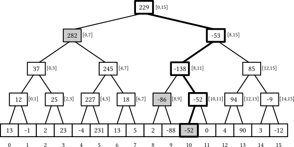

线段树有一些不错的性质：

- 如果底层数组有 $n$ 个元素，线段树恰好有 $(2n - 1)$ 个节点——$n$ 个叶节点和 $(n - 1)$ 个内部节点——因为每个内部节点把一个段一分为二，而要把原始的 $[0, n-1]$ 区间完全切分，只需 $(n - 1)$ 个内部节点。
- 树的高度为 $\Theta(\log n)$：从根节点开始，每一层节点数大约翻倍，而它们所覆盖的段大小大约减半。
- 每个段都可以拆成 $O(\log n)$ 个互不相交的段，对应线段树的节点：每一层最多取两个。

当 $n$ 不是 2 的整次幂时，并非所有层都完全填满——最后一层可能不完整——但这些性质依然成立。第一条性质让我们只需 $O(n)$ 内存即可存储这棵树，后两条性质让我们能在 $O(\log n)$ 时间内解决问题：

- `add(k, x)` 查询可以通过把 `x` 加到所有"段包含元素 `k`"的节点上来处理，而我们已经论证过这样的节点只有 $O(\log n)$ 个。
- `sum(k)` 查询可以通过找出所有"共同拼出前缀 `[0, k)`"的节点、并把它们存储的值相加来回答——我们也论证过这样的节点最多只有 $O(\log n)$ 个。

但这仍是理论。后文会看到，实现这种数据结构的方法多得惊人。

<!--

Note that by the same logic that each prefix can be covered by $O(\log n)$ nodes, each possible segment can also be covered by $O(\log n)$ nodes: you just possibly need at most two of them on each level. This lets us compute sums on any segment, although in this article we are not going to do it, instead reducing it to computing two prefix sums (from the right border, and the subtracting the prefix sum on the left border).

This is a general idea. Many different implementations possible, which we will explore one by one in this article.

Segment trees are built recursively: build a tree for left and right halves and merge results to get root.

Depending on the relative frequencies of the query types, the optimal solution may differ.

One way to do this is through a trick commonly called *square root decomposition*: we split the array (of size $n$) into blocks of approximately $\sqrt n$ elements,

sqrt

Enable [hugepages](/hpc/cpu-cache/paging) system-wide and forget about it.

Most of examples in this section are about optimizing some algorithms that are either included in standard library or take under 10 lines of code to implement naively, but we will start off with a bit more obscure example.

There are many things segment trees can do. Persistent structures, computational geometry. But for most of this article, we will focus on the dynamic (as opposed to static) prefix sum problem.

Segment trees are used for windowing queries or range queries in general, either by themselves or as part of a larger algorithm.

Functional programming, e.g., for implementing persistent arrays and derived structures.

-->

### 基于指针的实现

实现线段树最直接的方式，是把节点所需的一切都显式地存下来：包括数组段边界、和，以及指向子节点的指针。

如果我们在上"面向对象编程入门"课，会像下面这样递归地实现线段树：

```c++
struct segtree {
    int lb, rb;                         // the range this node is responsible for 
    int s = 0;                          // the sum of elements [lb, rb)
    segtree *l = nullptr, *r = nullptr; // pointers to its children

    segtree(int lb, int rb) : lb(lb), rb(rb) {
        if (lb + 1 < rb) { // if the node is not a leaf, create children
            int m = (lb + rb) / 2;
            l = new segtree(lb, m);
            r = new segtree(m, rb);
        }
    }

    void add(int k, int x) { /* react to a[k] += x */ }
    int sum(int k) { /* compute the sum of the first k elements */ }
};
```

如果要在已有数组上建树，就把构造函数的函数体改成这样：

```c++
if (lb + 1 == rb) {
    s = a[lb]; // the node is a leaf -- its sum is just the element a[lb]
} else {
    int t = (lb + rb) / 2;
    l = new segtree(lb, t);
    r = new segtree(t, rb);
    s = l->s + r->s; // we can use the sums of children that we've just calculated
}
```

建树时间对我们来说意义不大，所以为了减轻心智负担，在后续所有实现里我们都假设数组是零初始化的。

现在，要实现 `add`，需要一路向下走到叶节点，把增量加到 `s` 字段上：

```c++
void add(int k, int x) {
    s += x;
    if (l != nullptr) { // check whether it is a leaf node
        if (k < l->rb)
            l->add(k, x);
        else
            r->add(k, x);
    }
}
```

<!--

We can do largely the same with the prefix sum query, adding the sum stored in the left node each time we go right:

-->

要计算一个段上的和，可以检查查询是否完全覆盖当前段、或者完全不相交——如果是，就直接返回该节点的结果。若都不是，就把查询递归下传给子节点，让它们自己解决：

```c++
int sum(int lq, int rq) {
    if (rb <= lq && rb <= rq) // if we're fully inside the query, return the sum
        return s;
    if (rq <= lb || lq >= rb) // if we don't intersect with the query, return zero
        return 0;
    return l->sum(lq, rq) + r->sum(lq, rq);
}
```

这个函数总共访问 $O(\log n)$ 个节点，因为它只在某段与查询部分相交时才生成子调用，而这样的段最多有 $O(\log n)$ 个。

对*前缀和*而言，这些判断可以简化，因为查询的左边界永远是零：

```c++
int sum(int k) {
    if (rb <= k)
        return s;
    if (lb >= k)
        return 0;
    return l->sum(k) + r->sum(k);
}
```

由于有两类查询，我们也就有了两张图可看：

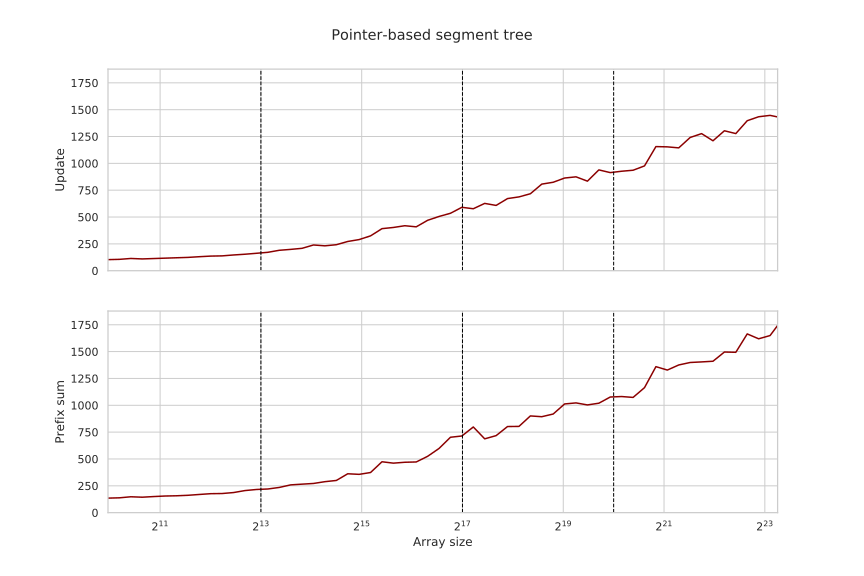

尽管这种面向对象实现在工程实践上相当不错，但在性能方面有几个让它糟糕透顶的方面：

- 两种查询实现都用了[[函数与递归.md|递归]]——虽然 `add` 查询可以被尾调用优化。
- 两种查询实现都用了不可预测的分支（[[分支的代价.md]]），这会让 CPU 流水线停滞。
- 节点存了额外的元数据。该结构占了 $4+4+4+8+8=28$ 字节，并因[[对齐与填充.md|内存对齐]]原因被填充到 32 字节，而真正用来存整数和只需 4 字节。
- 最重要的是，我们做了大量的[[内存延迟.md|指针追踪]]：即使仅凭查询就能提前推断出需要哪些段，我们仍必须取出指向子节点的指针才能下行。

指针追踪的影响比其它所有问题都大好几个数量级——而要消除它，我们需要去掉指针，让结构变成*隐式*的。

### 隐式线段树

由于线段树是一种二叉树，我们可以用[[二分查找.md#优化布局|Eytzinger 布局]]把节点存进一个大数组，并用下标运算代替显式指针来导航。

更形式化地，我们定义节点 $1$ 为根，保存整个数组 $[0, n)$ 的和。然后，对每个对应区间 $[l, r]$ 的节点 $v$，定义：

- 节点 $2v$ 为其左子节点，对应区间 $[l, \lfloor \frac{l+r}{2} \rfloor)$；
- 节点 $(2v+1)$ 为其右子节点，对应区间 $[\lfloor \frac{l+r}{2} \rfloor, r)$。

当 $n$ 是 2 的整次幂时，这种布局把整棵树排得非常好：

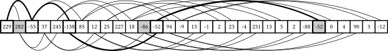

然而，当 $n$ 不是 2 的幂时，布局就不再紧凑：尽管无论怎么切分，节点数仍恰好是 $(2n - 1)$，但它们不再完美地映射到 $[1, 2n)$ 区间上。

例如，考虑在大小为 $17 = 2^4 + 1$ 的线段树中下行到最右叶节点时会发生什么：

- 我们从根节点 $1$ 出发，对应区间 $[0, 16]$，
- 走到节点 $3 = 2 \times 1 + 1$，对应区间 $[8, 16]$，
- 走到节点 $7 = 2 \times 2 + 1$，对应区间 $[12, 16]$，
- 走到节点 $15 = 2 \times 7 + 1$，对应区间 $[14, 16]$，
- 走到节点 $31 = 2 \times 15 + 1$，对应区间 $[15, 16]$，
- 最终到达节点 $63 = 2 \times 31 + 1$，对应区间 $[16, 16]$。

由于 $63 > 2 \times 17 - 1 = 33$，布局里存在某些空位，但树的结构仍相同，其高度仍是 $O(\log n)$。眼下我们可以先忽略这个问题，直接分配一个更大的数组来存节点——可以证明最右叶节点的下标不会超过 $4n$，所以分配这么多单元一定够用：

```c++
int t[4 * N]; // contains the node sums
```

现在，要实现 `add`，我们写一个类似的递归函数，但用下标运算代替指针。由于我们也不再在节点里存段的边界，需要重新计算它们，并作为每次递归调用的参数传下去：

```c++
void add(int k, int x, int v = 1, int l = 0, int r = N) {
    t[v] += x;
    if (l + 1 < r) {
        int m = (l + r) / 2;
        if (k < m)
            add(k, x, 2 * v, l, m);
        else
            add(k, x, 2 * v + 1, m, r);
    }
}
```

前缀和查询的实现大体相同：

```c++
int sum(int k, int v = 1, int l = 0, int r = N) {
    if (l >= k)
        return 0;
    if (r <= k)
        return t[v];
    int m = (l + r) / 2;
    return sum(k, 2 * v, l, m)
         + sum(k, 2 * v + 1, m, r);
}
```

在递归函数里传来传去五个变量显得笨拙，但性能收益显然值得：

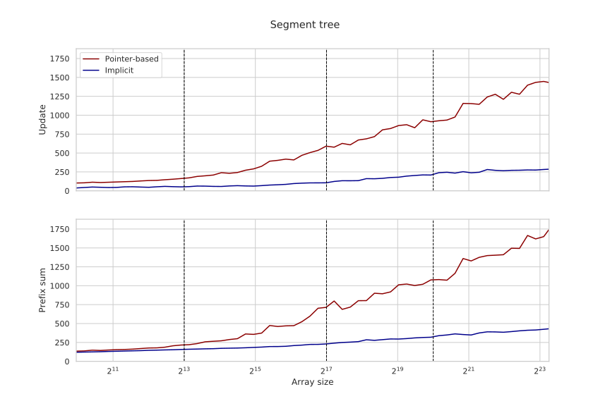

除了需要更少的内存（有利于塞进 CPU 缓存）之外，这种实现的主要优势在于我们可以利用[[内存级并行.md|访存并行]]并行地取回所需节点，显著改善两类查询的运行时间。

要进一步提升性能，我们可以：

- 手动优化下标运算（例如注意到无论怎样都要把 `v` 乘 `2`），
- 把除以二换成显式的二进制移位（因为[[契约式编程.md#假设|编译器并不总是能自己做]]），
- 最重要的是，去掉[[函数与递归.md|递归]]，让实现完全迭代化。

由于 `add` 是尾递归且无返回值，很容易把它变成一个 `while` 循环：

```c++
void add(int k, int x) {
    int v = 1, l = 0, r = N;
    while (l + 1 < r) {
        t[v] += x;
        v <<= 1;
        int m = (l + r) >> 1;
        if (k < m)
            r = m;
        else
            l = m, v++;
    }
    t[v] += x;
}
```

对 `sum` 查询做同样的事稍微难一点，因为它有两个递归调用。关键技巧是注意到，当进行这两个调用时，其中一个必然立即终止，因为 `k` 只能落在两半之一，所以我们可以在下树之前先检查这个条件：

```c++
int sum(int k) {
    int v = 1, l = 0, r = N, s = 0;
    while (true) {
        int m = (l + r) >> 1;
        v <<= 1;
        if (k >= m) {
            s += t[v++];
            if (k == m)
                break;
            l = m;
        } else {
            r = m;
        }
    }
    return s;
}
```

这对更新查询的性能提升不大（因为它本来就是尾递归，编译器已经做了类似的优化），但前缀和查询的运行时间在所有问题规模下都大约减半：

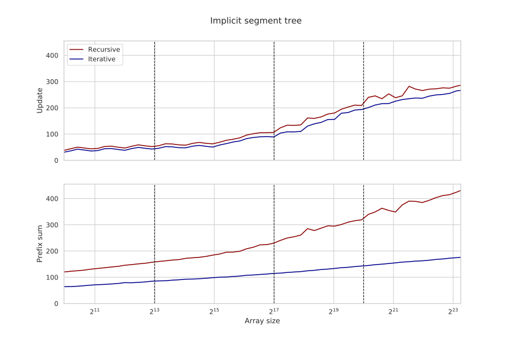

这个实现仍有一些问题：我们用了将近必要的两倍内存，存在代价高昂的[[分支的代价.md]]，而且每次迭代都要维护和重算数组边界。要消除这些问题，我们需要稍微改变思路。

### 自底向上实现

让我们改变隐式线段树布局的定义。不再依赖父到子的关系，而是先把所有叶节点强行编号为 $[n, 2n)$ 区间，然后递归地把节点 $k$ 的父节点定义为 $\lfloor \frac{k}{2} \rfloor$。

这个结构大体上和之前相同：你仍可以通过把任意节点编号除以二到达根节点（节点 $1$），每个节点仍至多有 $2k$ 和 $(2k + 1)$ 两个子节点，因为除以二下取整会得到不同父编号的只有它们。我们得到的好处是，强制让最后一层连续且从 $n$ 开始，于是可以用小一半的数组：

```c++
int t[2 * N];
```

当 $n$ 是 2 的幂时，树的结构与之前完全相同；实现查询时，可以利用这种自底向上的方式，从第 $k$ 个叶节点（简单地索引为 $N + k$）出发，一路向上直到根：

```c++
void add(int k, int x) {
    k += N;
    while (k != 0) {
        t[k] += x;
        k >>= 1;
    }
}
```

要计算 $[l, r)$ 子段上的和，可以维护指向"需要被加上"的首尾元素的指针，在加入某节点时分别递增/递减它们，等它们汇聚到同一节点（即它们的最近公共祖先）后停止：

```c++
int sum(int l, int r) {
    l += N;
    r += N - 1;
    int s = 0;
    while (l <= r) {
        if ( l & 1) s += t[l++]; // l is a right child: add it and move to a cousin
        if (~r & 1) s += t[r--]; // r is a left child: add it and move to a cousin
        l >>= 1, r >>= 1;
    }
    return s;
}
```

令人惊讶的是，即使 $n$ 不是 2 的幂，这两个查询也都能正确工作。要理解为什么，考虑一个 13 个元素的线段树：

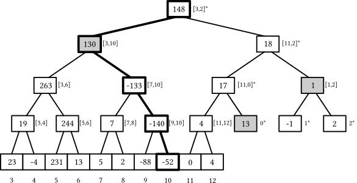

最后一层的第一个下标始终是 2 的幂，但当数组大小不是 2 的整次幂时，部分叶元素前缀会被"环绕"到树的右侧。神奇的是，这一事实对我们的实现并不构成问题：

- `add` 查询仍会更新它的父节点，尽管其中一些对应的是数组的某个前缀或后缀，而非连续子段。
- `sum` 查询仍会算出正确子段上的和，即使 `l` 落在那个环绕前缀、逻辑上"在 `r` 右边"——因为最终 `l` 会变成某一层上的最后一个节点并被递增，突然跳到下一层的第一个元素，并在加上环绕部分上恰好正确的节点后正常继续（看插图里变暗的节点）。

与自顶向下相比，我们只用了一半内存，且无需维护查询区间，于是代码更简单、因而更快：

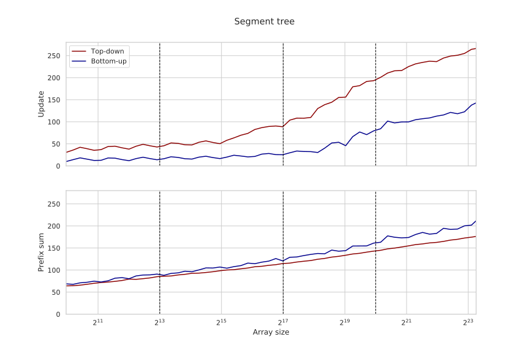

跑基准测试时，我们用 `sum(l, r)` 来计算一般子段和，并令 `l` 固定为 `0`。要进一步提高前缀和查询的性能，我们想避免维护 `l`，只移动右边界，像这样：

```c++
int sum(int k) {
    int s = 0;
    k += N - 1;
    while (k != 0) {
        if (~k & 1) // if k is a right child
            s += t[k--];
        k = k >> 1;
    }
    return s;
}
```

相反，这个前缀和实现只有在 $n$ 是 2 的幂时才能工作——因为 `k` 可能落在那个环绕部分，于是我们会把几乎整个数组加起来而非一个小前缀。

要让它对任意数组大小都工作，可以把叶子重排，使它们在树的最后两层里按从左到右的逻辑顺序排列。上面的例子中，这意味着给所有叶子下标加 $3$，再把最后三个叶子下移一层（减去 $13$）。

一般情况下，可以用谓词（predication）在几个周期内完成，像这样：

```c++
const int last_layer = 1 << __lg(2 * N - 1);

// calculate the index of the leaf k
int leaf(int k) {
    k += last_layer;
    k -= (k >= 2 * N) * N;
    return k;
}
```

实现查询时，只需调用 `leaf` 函数得到正确的叶子下标：

```c++
void add(int k, int x) {
    k = leaf(k);
    while (k != 0) {
        t[k] += x;
        k >>= 1;
    }
}

int sum(int k) {
    k = leaf(k - 1);
    int s = 0;
    while (k != 0) {
        if (~k & 1)
            s += t[k--];
        k >>= 1;
    }
    return s;
}
```

最后一步：把 `s += t[k--]` 这一行换成[[无分支编程.md|谓词]]，可以让实现变成无分支（除了最后一个分支——我们仍要检查循环条件）：

```c++
int sum(int k) {
    k = leaf(k - 1);
    int s = 0;
    while (k != 0) {
        s += (~k & 1) ? t[k] : 0; // will be replaced with a cmov
        k = (k - 1) >> 1;
    }
    return s;
}
```

这些优化组合起来，让前缀和查询快了很多：

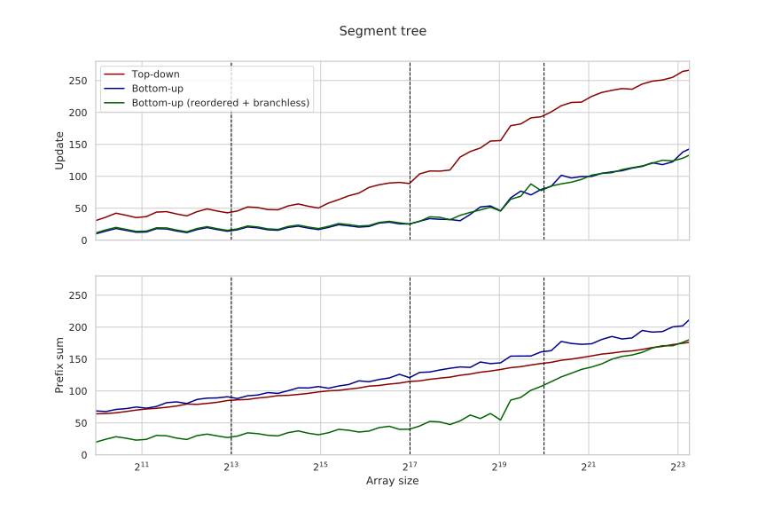

注意前缀和查询的延迟在 $2^{19}$ 处、而非在 L3 缓存边界 $2^{20}$ 处开始抬升。这是因为我们仍存了 $2n$ 个整数，并且无论最后是否把它加到 `s`，都会取 `t[k]` 元素。这两个问题其实都能解决。

### Fenwick 树

隐式结构很棒：它们避免指针追踪，允许并行访问所有相关节点，而且不存节点元数据、占用空间更小。比隐式结构更好的，是*简洁（succinct）*结构：它们只需信息论最小的空间来存储结构，只用 $O(1)$ 额外内存。

要让线段树简洁，需要审视节点里存的值、寻找冗余——那些可由其它值推断出来的值——并把它们去掉。一种办法是注意到，在之前每个前缀和的实现中，我们从未用过右子节点里存的和——因此，对计算前缀和而言，这类节点是冗余的：

<!--

One way to do this is to use the fact that for every node $v$ with children $l$ and $r$, we have $s_v = s_l + s_r$, so we only need to store two of these values, and we can in "triangle" $(l, v, r)$

For any node $p$, its sum $s_p$ equals to the sum $(s_l + s_r)$ stored in its children nodes. Therefore, for any such "triangle" of nodes, we only need to store any two of $s_p$, $s_l$, or $s_r$, and we can restore the other one from the $s_p = s_l + s_r$ identity.

-->

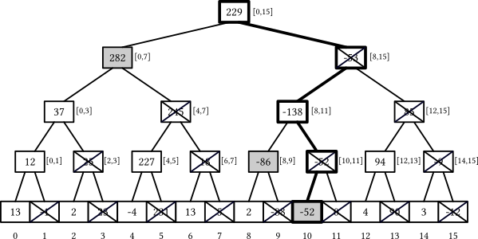

*Fenwick 树*（也叫*二叉索引树*——稍后你会明白为什么）是一种利用了这一考量的线段树，它去掉了所有*右*子节点，实质上删去了每一层里每隔一个的节点，使总节点数与原数组相同。

```c++
int t[N + 1]; // +1 because we use use one-based indexing
```

为了紧凑地存这些段和，Fenwick 树抛弃了 Eytzinger 布局：取而代之，在原本会是线段树最后一层某个叶子的每个元素 $k$ 处，它存的是"其第一个未被删除的祖先"的和。例如：

- 元素 $7$ 会保存 $[0, 7]$ 区间的和（$282$），
- 元素 $9$ 会保存 $[8, 9]$ 区间的和（$-86$），
- 元素 $10$ 会保存 $[10, 10]$ 区间的和（$-52$，即元素自身）。

如何比"模拟下行整棵树"更快地算出给定元素 $k$ 的区间（更确切地说，左边界；右边界始终是元素 $k$ 自身）？结果有一个在树大小为 2 的幂、且用 1-based 下标时有效的巧妙位运算技巧——只需去掉下标的最低有效位：

- 元素 $7 + 1 = 8 = 1000_2$ 的左边界是 $0000_2 = 0$，
- 元素 $9 + 1 = 10 = 1010_2$ 的左边界是 $1000_2 = 8$，
- 元素 $10 + 1 = 11 = 1011_2$ 的左边界是 $1010_2 = 10$。

要得到一个整数的最后一个置位（set bit），可以用这个程序：

```c++
int lowbit(int x) {
    return x & -x;
}
```

这个技巧利用了有符号数用[[整数.md|二进制补码]]存储的方式。当我们计算 `-x` 时，本质上是用某个大的 2 的幂减去它：数字的前缀部分翻转，末尾的一串零保留，而唯一保持不变的那一位就是最后一个置位——它将是 `x & -x` 中唯一存活的位。例如：

```
+90 = 64 + 16 + 8 + 2 = (0)10110
-90 = 00000 - 10110   = (1)01010
    → (+90) & (-90)   = (0)00010
```

<!-- More formally, a Fenwick tree is defined as the array $t_i = \sum_{k=f(i)}^i a_k$ where $f$ is some function for which $f(i) \leq i$. If $f$ is the "remove last bit" function (`x -= x & -x`), then both query and update would only require updating $O(\log n)$ different $t$. -->

我们已经确定，Fenwick 树不过是一个大小为 `n` 的数组，其中每个元素 `k` 定义为原数组中从 `k - lowbit(k) + 1` 到 `k`（含端点）的元素之和，现在来实现一些查询。

实现前缀和查询很容易。`t[k]` 持有我们需要的和，只是差了前 `k - lowbit(k)` 个元素，所以我们只需把它加进结果，然后跳到 `k - lowbit(k)` 并继续，直到到达数组开头：

```c++
int sum(int k) {
    int s = 0;
    for (; k != 0; k -= lowbit(k))
        s += t[k];
    return s;
}
```

<!-- In a segment tree, this is equivalent to starting at the leaf `k` and jumping straight to the first ancestor that is a left child: -->

由于我们不断地从 `k` 中去掉最低置位，并且这一过程等价于访问线段树中同一批左子节点，每个 `sum` 查询最多触摸 $O(\log n)$ 个节点：

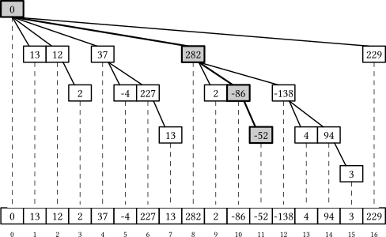

为了略微提升 `sum` 查询的性能，我们用 `k &= k - 1` 一次性去掉最低位，这比 `k -= k & -k` 快一条指令：

```c++
int sum(int k) {
    int s = 0;
    for (; k != 0; k &= k - 1)
        s += t[k];
    return s;
}
```

与之前所有线段树实现不同，在 Fenwick 树中，把子段上的和算作两个前缀和之差既更容易也更高效：

```c++
// [l, r)
int sum (int l, int r) {
    return sum(r) - sum(l);
}
```

更新查询更容易写但不那么直观。我们需要把一个值 `x` 加到叶 `k` 的所有"左子祖先"节点上。这类节点的下标 `m` 大于 `k` 但满足 `m - lowbit(m) < k`，从而 `k` 落在它们的区间里。

所有这样的下标都要与 `k` 共享一个前缀，然后在 `k` 为 `0` 的那一位上是 `1`，其后是一串零，使得那个 `1` 被抵消、且 `m - lowbit(m)` 的结果小于 `k`。所有这样的下标可以用迭代方式生成，像这样：

```c++
void add(int k, int x) {
    for (k += 1; k <= N; k += k & -k)
        t[k] += x;
}
```

反复把最低置位加到 `k` 上，会让它"更偶"、并把它抬升到下一个左子线段树祖先：

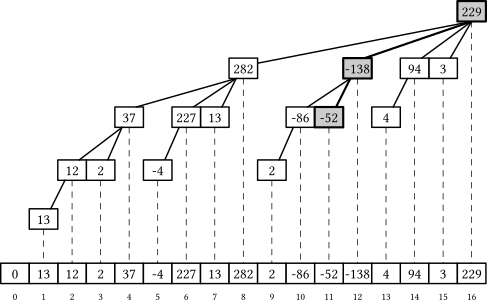

现在，如果保持代码原样，即使 $n$ 不是 2 的幂它也能正确工作。这种情况下，Fenwick 树并不等价于大小为 $n$ 的线段树，而是等价于至多 $O(\log n)$ 棵"大小为 2 的幂"的线段树组成的*森林*——或者，如果你愿意这么想，等价于被补零填充到一个较大 2 的幂的单棵线段树。无论哪种理解，所有过程仍正确，因为它们从不触碰 $[1, n]$ 范围之外的东西。

<!-- Sometimes people use `k -= k & -k` to iterate when processing the `sum` query, which makes this implementation delightfully symmetric. -->

Fenwick 树的性能在更新查询上与优化后的自底向上线段树相近，在前缀和查询上略快：

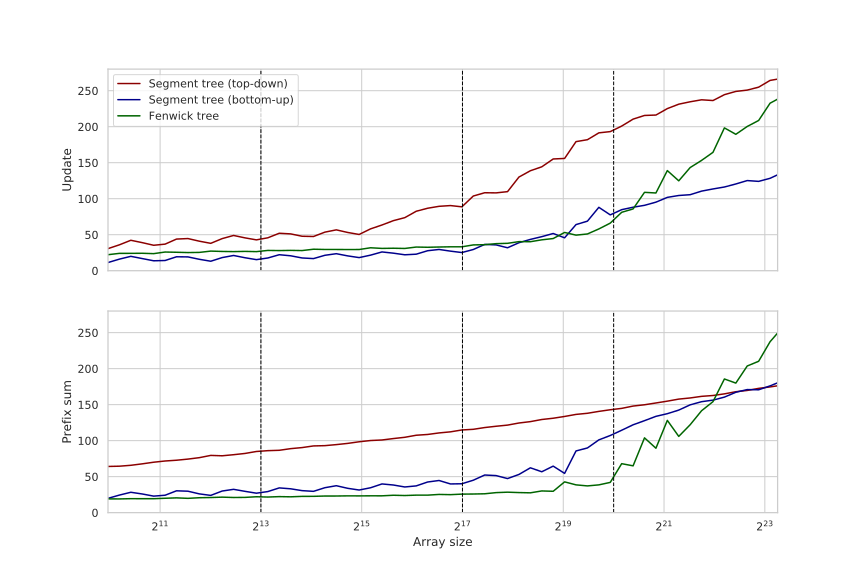

图上有个奇怪的地方。在越过 L3 缓存边界后，性能急速起飞。这是[[缓存关联度.md|缓存关联度]]效应：最常用的单元，其下标都能被大的 2 的幂整除，于是它们被别名到同一个缓存组，互相把对方踢出，等效地缩小了缓存大小。

消除这种效应的一种办法是在布局里插入"空洞"，像这样：

```c++
inline constexpr int hole(int k) {
    return k + (k >> 10);
}

int t[hole(N) + 1];

void add(int k, int x) {
    for (k += 1; k <= N; k += k & -k)
        t[hole(k)] += x;
}

int sum(int k) {
    int res = 0;
    for (; k != 0; k &= k - 1)
        res += t[hole(k)];
    return res;
}
```

计算 `hole` 函数不在迭代间的critical path上，所以不会引入显著开销，却完全解决了缓存关联度问题，在大数组上把延迟缩减至多 3 倍：

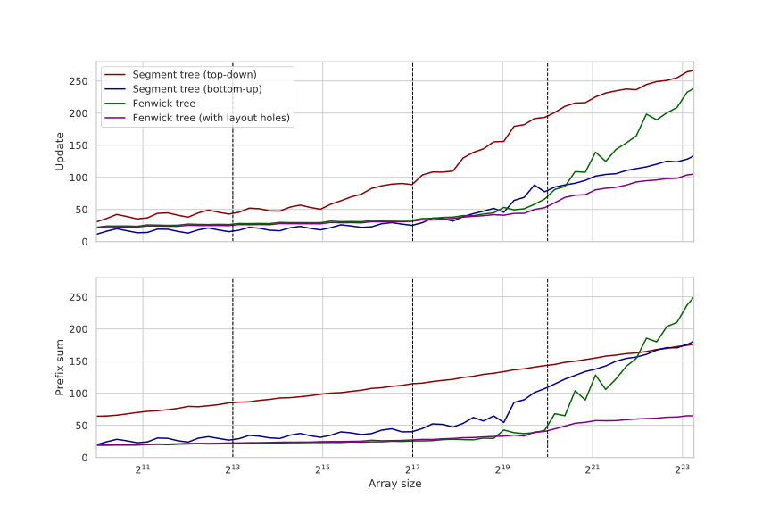

Fenwick 树很快，但它们仍有其它小问题。与[[二分查找.md|二分查找]]类似，它们访存的时间局部性不是最好的，因为很少被访问的元素与最常访问的元素混在一起。Fenwick 树还要执行数量不固定的迭代，并必须做循环尾检查，极可能引发一次分支预测失败——尽管只有一次。

可能仍有可优化的地方，但我们就此打住，转向一个完全不同的思路；如果你了解[[静态 B 树.md|S 树]]，大概已经猜到要去向何方了。

### 宽线段树

核心思路如下：既然内存系统反正会为我们取回一整条[[缓存行.md|缓存行]]，那就用它塞满能让我们更快处理查询的信息。对线段树来说，这意味着在一个节点里存多于一个数据点。这让我们降低树高，下行或上行时执行更少的迭代：

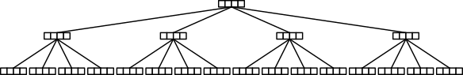

我们用术语*宽（B 叉）线段树*来指称这种变体。

要实现这种布局，可以用我们曾在[[静态 B 树.md#B+ 树布局|S+ 树]]中用过的、基于[[预计算.md|constexpr]]的类似方法：

```c++
const int b = 4, B = (1 << b); // cache line size (in integers, not bytes)

// the height of the tree over an n-element array 
constexpr int height(int n) {
    return (n <= B ? 1 : height(n / B) + 1);
}

// where the h-th layer starts
constexpr int offset(int h) {
    int s = 0, n = N;
    while (h--) {
        n = (n + B - 1) / B;
        s += n * B;
    }
    return s;
}

constexpr int H = height(N);
alignas(64) int t[offset(H)]; // an array for storing nodes
```

这样，我们有效地把树高降低了大约 $\frac{\log_B n}{\log_2 n} = \log_2 B$ 倍（若 $B = 16$ 则约 4 倍），但在节点内高效实现操作变得不那么平凡。对我们的题目，有两个主要选项：

1. 每个节点存 $B$ 个*和*（对应它的 $B$ 个子节点各一个）。
2. 每个节点存 $B$ 个*前缀和*（第 $i$ 个为前 $(i + 1)$ 个子节点之和）。

如果走第一个选项，`add` 查询与自底向上线段树大体相同，但 `sum` 查询需要在每个访问到的节点上加总至多 $B$ 个标量。如果走第二个选项，`sum` 查询会很简单，但 `add` 查询需要在每个访问到的节点上给某个后缀加 `x`。

无论哪种，一种操作会执行 $O(\log_B n)$ 次运算、每个节点只碰一个标量，而另一种会执行 $O(B \cdot \log_B n)$ 次运算、每个节点至多碰 $B$ 个标量。不过，我们可以用[[SIMD并行.md|SIMD]]来加速较慢的操作；由于 SIMD 指令集中没有快速的[[归约.md|水平归约]]，但把向量加到向量上很容易，所以我们选第二种方案，在每个节点存前缀和。

这让 `sum` 查询极快且易实现：

```c++
int sum(int k) {
    int s = 0;
    for (int h = 0; h < H; h++)
        s += t[offset(h) + (k >> (h * b))];
    return s;
}
```

`add` 查询更复杂也更慢。我们只需要给一个节点的某个后缀加一个数，可以用[[掩码与混合.md|掩码滤掉]]不应被修改的位置来实现。

我们可以预计算一个 $B \times B$ 数组，对应 $B$ 个这样的掩码，它们对每个节点内的 $B$ 个位置指出：某个前缀和值是否需要更新：

```c++
struct Precalc {
    alignas(64) int mask[B][B];

    constexpr Precalc() : mask{} {
        for (int k = 0; k < B; k++)
            for (int i = 0; i < B; i++)
                mask[k][i] = (i > k ? -1 : 0);
    }
};

constexpr Precalc T;
```

除了这个掩码技巧，其余计算足够简单，只用[[内建函数与向量类型.md#指令参考|GCC 向量类型]]就能处理。处理 `add` 查询时，我们直接用这些掩码与广播后的 `x` 值做按位与来掩码，再加到节点里存的值上：

```c++
typedef int vec __attribute__ (( vector_size(32) ));

constexpr int round(int k) {
    return k & ~(B - 1); // = k / B * B
}

void add(int k, int x) {
    vec v = x + vec{};
    for (int h = 0; h < H; h++) {
        auto a = (vec*) &t[offset(h) + round(k)];
        auto m = (vec*) T.mask[k % B];
        for (int i = 0; i < B / 8; i++)
            a[i] += v & m[i];
        k >>= b;
    }
}
```

相比 Fenwick 树，这把 `sum` 查询加速了 10 倍以上、`add` 查询加速了至多 4 倍：

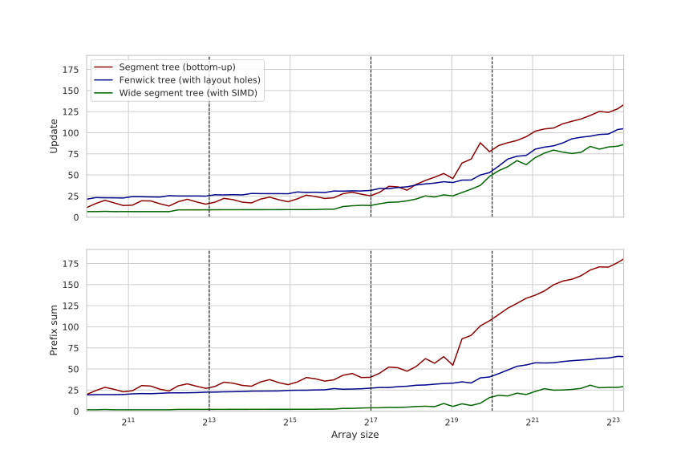

与[[静态 B 树.md|S 树]]不同，这种实现里块大小可以轻松改变（字面意思上改一个字符）。如预期，当我们增大它时，更新时间也随之增加——因为需要取回并处理更多缓存行；但 `sum` 查询时间会下降，因为树高变小了：

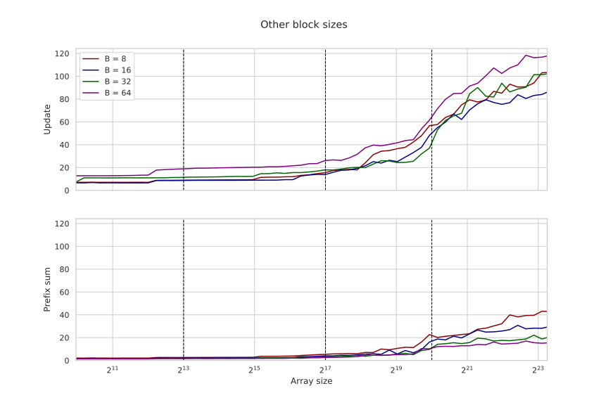

类似于[[静态 B 树.md#与 `std::lower_bound` 的对比|S+ 树]]，最优内存布局大概率具有非均匀的块大小，取决于问题规模和查询分布，但我们不打算展开这个思路，就把优化止步于此。

<!-- Wide Fenwick trees make little sense. The speed of Fenwick trees comes from rapidly iterating over just the elements we need. -->

### 对比

宽线段树比其它流行的线段树实现显著更快：

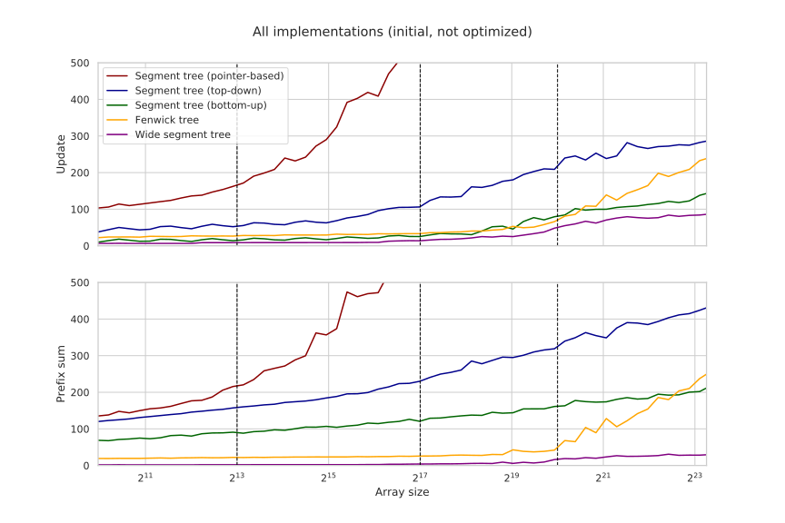

相对加速比达到数量级：

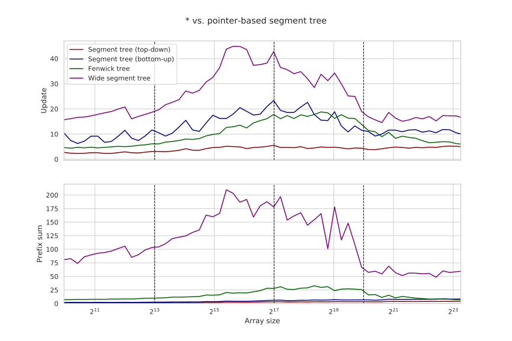

相比最初的基于指针的实现，宽线段树在前缀和和更新查询上分别快至多 200 倍和 40 倍——尽管对足够大的数组，两种实现都变成纯内存受限（memory-bound），这个加速比分别降到约 60 和 15。

### 修改与扩展

我们只在 32 位整数上的前缀和问题聚焦——既是为了让这篇已经很长的文章略短，也是为了让与 Fenwick 树的对比更公平——但宽线段树可用于其它常见的区间操作，尽管用 SIMD 高效实现它们需要一些巧思。

*免责声明：* 这些想法我一个都没实现过，所以其中一些可能有致命缺陷。

**其它数据类型**可以通过改变向量类型、并（若大小不同则）改变节点大小 $B$ 来平凡地支持——这也会改变树高，从而改变两类查询的总迭代次数。

查询对更新和前缀和的限制也可能不同。例如，只有"$\pm 1$"更新、且保证前缀和结果总能塞进 32 位整数的情况并不罕见。如果结果能塞进 8 位，我们就简单地用 8 位 `char`、块大小取 $B=64$ 字节，使总树高变为 $\frac{\log_{16} n}{\log_{64} n} = \log_{16} 64 = 1.5$ 倍小，两类查询按比例变快。

遗憾的是，这在一般情况下不行，但我们仍有办法在更新增量较小时加速查询：我们可以*缓冲*更新查询。用同样的"$\pm 1$"例子，我们可以如所愿把分叉因子取为 $B=64$，在每个节点里存 $B$ 个 32 位整数、$B$ 个 8 位有符号 char，以及一个 8 位计数变量（初始为 $127$，每次更新节点时递减）。然后，在处理节点里的查询时：

- 对更新查询，我们把一个"被掩码的 8 位正负一"向量加到 `char` 数组，递减计数器，若为零则把 `char` 数组里的值[转换](https://www.intel.com/content/www/us/en/docs/intrinsics-guide/index.html#ig_expand=3037,3009,4870,6715,4845,3853,288,6570,90,7307,5993,2692,6946,6949,5456,6938,5456,1021,3007,514,518,7253,7183,3892,5135,5260,3915,4027,3873,7401,4376,4229,151,2324,2310,2324,591,4075,3011,3009,6130,4875,6385,5259,6385,6250,1395,7253,6452,7492,4669,4669,7253,1039,1029,4669,4707,7253,7242,848,879,848,7251,4275,879,874,849,833,6046,7250,4870,4872,4875,849,849,5144,4875,4787,4787,4787,3016,3018,5227,7359,7335,7392,4787,5259,5230,5230,5223,5214,6438,5229,488,483,6527,6527,6554,1829,1829,1829&techs=AVX,AVX2&text=cvtepi8_)为 32 位整数，加到整数数组，把 `char` 数组清零，并把计数器重置回 127。
- 对前缀和查询，我们访问同样的节点，但把 `int` 和 `char` 值*都*加进结果。

这种更新累积技巧让我们以多用约 25% 内存为代价，把性能提升至多 1.5 倍。

在 `add` 查询里放一个条件分支、并把 `char` 数组加到 `int` 数组上相当慢，但由于每 127 次迭代才需要做一次，摊销意义上它不花我们任何代价。处理 `sum` 查询的时间会增加，但不显著——因为它主要取决于最慢的那次读取，而非迭代次数。

**一般区间查询**可以像 Fenwick 树那样支持：只需把区间 $[l, r)$ 拆成两个前缀和 $[0, r)$ 与 $[0, l)$ 之差。

这也适用于加法之外的某些运算（模素数乘法、异或等），但它们必须*可逆*：要有办法快速地把左前缀上的运算从最终结果里"撤销"。

**不可逆运算**也能支持，但它们仍应满足其它一些性质：

- 必须*可结合*：$(a \circ b) \circ c = a \circ (b \circ c)$。
- 必须有*单位元*：$a \circ e = e \circ a = a$。

（如果你讲究，这种代数结构叫[幺半群](https://en.wikipedia.org/wiki/Monoid)。）

遗憾的是，当运算不可逆时前缀和技巧失效，所以我们得切换到[方案一来](#宽线段树)，为每段分别存运算结果。这需要对查询做显著改动：

- 更新查询应在叶子处替换一个标量，在叶子节点做[[归约.md#指令级并行|水平归约]]，然后继续向上，替换其父节点中的一个标量，依此类推。
- 区间归约查询应分别为左右边界，计算一条"路径上竖直归约后的值"的向量，把这两个向量合并成一个，再水平归约它来返回最终答案。注意我们仍需要用掩码把查询之外的位置替换成中性元，而这次大概需要一些条件移动/混合，以及用 $B \times B$ 预计算掩码、或用两个掩码来兼顾查询的左右边界。

这让两类查询都慢很多——尤其是归约——但仍应比自底向上线段树快。

**最小值**是一个不错的例外：当元素的新值小于当前值时，更新查询可以做得略快——我们可以跳过水平归约部分，只用标量过程更新 $\log_B n$ 个节点。

当这类更新占大多数时这工作得很快，例如稀疏图 Dijkstra 算法（边数多于顶点数）。对这个问题，宽线段树可以充当一个高效的定域（fixed-universe）最小堆。

**惰性传播**可以通过在节点里存一个单独的数组来保存延迟操作实现。要传播更新，我们需要自顶向下（只需把 `for` 循环方向反过来、并用 `k >> (h * b)` 计算第 `h` 个祖先），对当前节点的父节点所存的延迟操作值做[[数据搬移.md#构造常量|广播]]并重置，再用 SIMD 把它应用到当前节点存的所有值上。

一个小问题是，对某些运算我们需要知道段的长度：例如，当我们同时要支持求和与批量赋值时。这可以用以下方式解决：把元素填充到让每一层上的段大小均匀，预计算段长度并存在节点里，或者用谓词检查有问题的节点（每层至多一个）。

<!--

**Persistent** trees

We mostly focused on the prefix sum problem, but this general structure can be used for other problems handled by segment trees:

- General sums and other reductions.
- Range minimum sum queries.
- Fixed-universe heaps.

Some more exotic applications, reliant on there being pointers, are expectedly harder. To implement dynamic trees, we could store the mapping between the node number and the tree in a hash table. For more complicated cases, such as whether wide segment trees can help in implementing persistent trees is an open question.

why b-ary Fenwick tree is not a good idea

-->

### 致谢

非常感谢 Giulio Ermanno Pibiri 合作完成本案例研究，它很大程度上基于他与 Rossano Venturini 合著的 2020 年论文"[Practical Trade-Offs for the Prefix-Sum Problem](https://arxiv.org/pdf/2006.14552.pdf)"。如果你对我们为简洁而略过的细节感兴趣，强烈建议阅读原论文。

<!-- It has some more detailed discussions, as well as some other implementations or branchless top-down segment tree and why b-ary Fenwick tree is not a good idea. Intermediate structures we've skipped here. -->

关于自底向上线段树的代码和一些想法，改编自 Oleksandr Bacherikov 2015 年的博客文章"[Efficient and easy segment trees](https://codeforces.com/blog/entry/18051)"。
